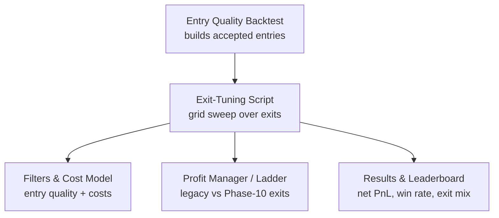
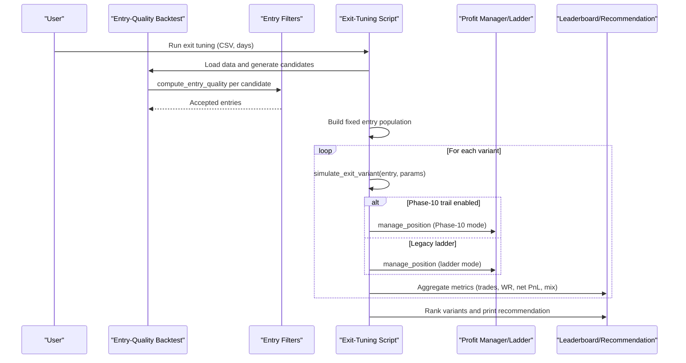
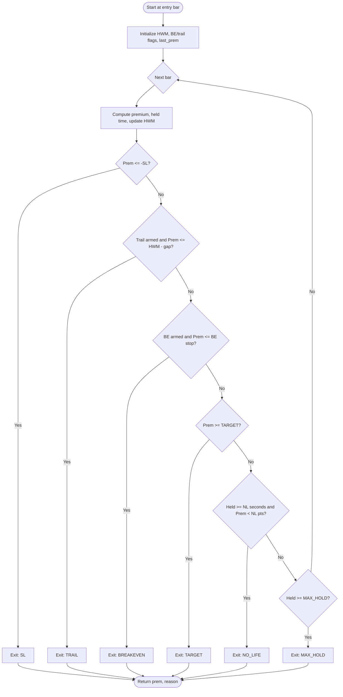
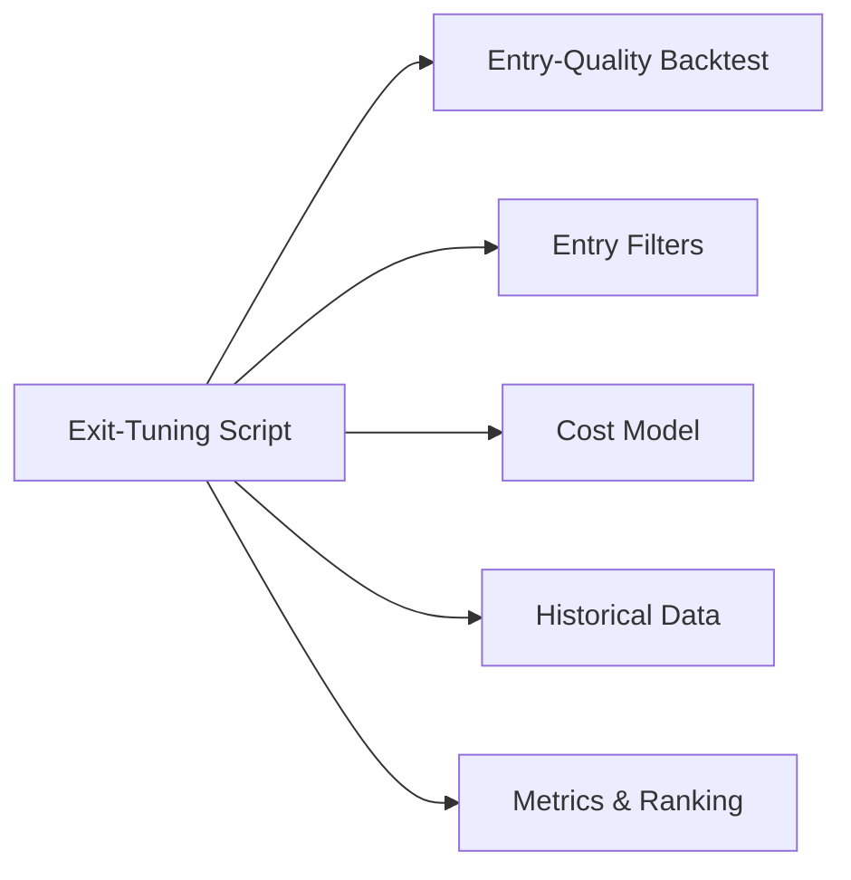

# Backtest Exit Tuning

<cite>
**Referenced Files in This Document**
- [backtest_exit_tuning.py](file://scripts/backtest_exit_tuning.py)
- [backtest_entry_quality.py](file://scripts/backtest_entry_quality.py)
- [filters.py](file://engine/execution/filters.py)
- [profit_manager.py](file://engine/execution/profit_manager.py)
- [backtest_engine.py](file://backtest/backtest_engine.py)
- [research_engine.py](file://research/backtest/engine/research_engine.py)
- [scalp_backtest.py](file://backtest/scalp_backtest.py)
- [scalp_engine.py](file://engine/scalping/scalp_engine.py)
</cite>

## Table of Contents
1. [Introduction](#introduction)
2. [Project Structure](#project-structure)
3. [Core Components](#core-components)
4. [Architecture Overview](#architecture-overview)
5. [Detailed Component Analysis](#detailed-component-analysis)
6. [Dependency Analysis](#dependency-analysis)
7. [Performance Considerations](#performance-considerations)
8. [Troubleshooting Guide](#troubleshooting-guide)
9. [Conclusion](#conclusion)

## Introduction
This document explains the backtest exit-tuning system used to evaluate and optimize exit parameters for a premium-space options strategy on NIFTY 1-minute data. It focuses on how a fixed, validated entry population is replayed through multiple exit variants (stop loss, target, no-life cut, trailing stops, and max hold), how results are aggregated, and how recommendations are derived. It also contextualizes related backtesting components that share entry logic, filters, and profit management.

## Project Structure
The exit-tuning workflow centers on a dedicated script that:
- Reuses entry generation and rejection logic from an existing entry-quality backtest to build a stable, exit-independent set of accepted entries.
- Sweeps a grid of exit parameters over those entries.
- Produces a leaderboard and recommendation based on net PnL and win rate.

**Diagram sources**
- [backtest_exit_tuning.py:63-153](file://scripts/backtest_exit_tuning.py#L63-L153)
- [filters.py:126-264](file://engine/execution/filters.py#L126-L264)
- [profit_manager.py:173-240](file://engine/execution/profit_manager.py#L173-L240)

**Section sources**
- [backtest_exit_tuning.py:1-282](file://scripts/backtest_exit_tuning.py#L1-L282)
- [backtest_entry_quality.py:1-207](file://scripts/backtest_entry_quality.py#L1-L207)

## Core Components
- Entry population builder: Replays candidates through the real entry-quality filter to produce a fixed set of accepted entries independent of exit configuration.
- Exit simulator: Walks sealed bars after entry applying SL, TARGET, trailing stop tiers, NO_LIFE cut, and MAX_HOLD.
- Grid sweeper: Iterates combinations of SL, TARGET, NO_LIFE time/pts, and trailing behavior; computes trades, win rate, net PnL, and exit mix.
- Baseline parity check: Verifies the new simulator matches the original baseline to ensure fidelity before sweeping.
- Recommendation engine: Ranks variants by net PnL with tie-breakers and prints recommended settings.

**Section sources**
- [backtest_exit_tuning.py:63-159](file://scripts/backtest_exit_tuning.py#L63-L159)
- [backtest_exit_tuning.py:167-282](file://scripts/backtest_exit_tuning.py#L167-L282)

## Architecture Overview
The exit-tuning architecture separates entry selection from exit evaluation to isolate exit parameter effects. The flow ensures reproducibility and parity with the live system’s entry pipeline while enabling rapid experimentation on exits.

**Diagram sources**
- [backtest_exit_tuning.py:63-153](file://scripts/backtest_exit_tuning.py#L63-L153)
- [filters.py:126-264](file://engine/execution/filters.py#L126-L264)
- [profit_manager.py:173-240](file://engine/execution/profit_manager.py#L173-L240)

## Detailed Component Analysis

### Exit Variant Simulator
The core simulation walks sealed bars post-entry and applies checks in priority order:
- Stop Loss (SL)
- Target (TARGET)
- Trailing stop tiers (breakeven then trail below high-water mark)
- No-Life cut (time-based if insufficient profit)
- Max Hold (EOD or time cap)

**Diagram sources**
- [backtest_exit_tuning.py:87-129](file://scripts/backtest_exit_tuning.py#L87-L129)

**Section sources**
- [backtest_exit_tuning.py:87-129](file://scripts/backtest_exit_tuning.py#L87-L129)

### Entry Population Builder
Reuses the same candidate generation and rejection stack as the entry-quality backtest to ensure identical accepted entries across all exit variants.

Key behaviors:
- ORB breakout episodes retry on subsequent sealed bars within a limited window.
- Momentum candidates evaluated once.
- Entry-quality filter applied per candidate; only accepted entries proceed to exit simulation.

**Section sources**
- [backtest_exit_tuning.py:63-84](file://scripts/backtest_exit_tuning.py#L63-L84)
- [backtest_entry_quality.py:86-155](file://scripts/backtest_entry_quality.py#L86-L155)
- [filters.py:126-264](file://engine/execution/filters.py#L126-L264)

### Grid Sweep and Ranking
The grid sweeps:
- SL values
- TARGET values
- NO_LIFE combinations (time and profit threshold), including an OFF variant
- Trailing always ON with defined activation thresholds

Metrics computed per variant:
- Number of trades
- Win rate
- Net PnL (premium points × qty minus round-trip cost)
- Exit mix distribution

Ranking:
- Primary sort by net PnL descending
- Tie-break by win rate descending
- Prints top variants and baseline rank

**Section sources**
- [backtest_exit_tuning.py:136-159](file://scripts/backtest_exit_tuning.py#L136-L159)
- [backtest_exit_tuning.py:229-258](file://scripts/backtest_exit_tuning.py#L229-L258)

### Baseline Parity Check
Before running the grid, the script validates that its exit simulator reproduces the original baseline exactly (same exit mix and net PnL). If mismatch occurs, it aborts to prevent invalid comparisons.

**Section sources**
- [backtest_exit_tuning.py:206-227](file://scripts/backtest_exit_tuning.py#L206-L227)

### Integration with Profit Management
Two exit regimes are supported:
- Phase-10 premium-space trail: When enabled via configuration, the profit manager enforces a simplified stop/target path aligned with Phase-10 semantics.
- Legacy ladder: Default for research parity and scalp strategies; uses a cost-aware profit-lock ladder and drawdown exits.

The exit-tuning script uses its own explicit exit rules (SL/TARGET/TRAIL/NO_LIFE/MAX_HOLD) rather than relying on the profit manager for the grid. However, other backtests integrate with the profit manager directly.

**Section sources**
- [profit_manager.py:173-240](file://engine/execution/profit_manager.py#L173-L240)
- [backtest_engine.py:762-799](file://backtest/backtest_engine.py#L762-L799)
- [research_engine.py:328-365](file://research/backtest/engine/research_engine.py#L328-L365)

### Related Backtesting Engines
- Institutional backtest engine: Mirrors live signal and exit logic, using profit manager and risk manager for realistic simulations.
- Research engine: Clean-room mirror of live logic with legacy exit regime for parity testing.
- Scalp backtest: Compares old vs new risk controls for momentum scalping, including trailing, no-life, and circuit breakers.

These engines demonstrate consistent patterns for entry gating, feature computation, and exit handling that complement the exit-tuning approach.

**Section sources**
- [backtest_engine.py:196-799](file://backtest/backtest_engine.py#L196-L799)
- [research_engine.py:48-365](file://research/backtest/engine/research_engine.py#L48-L365)
- [scalp_backtest.py:224-558](file://backtest/scalp_backtest.py#L224-L558)
- [scalp_engine.py:276-306](file://engine/scalping/scalp_engine.py#L276-L306)

## Dependency Analysis
The exit-tuning script depends on:
- Entry-quality backtest module for candidate generation and filtering
- Engine filters for entry quality and rejection statistics
- Cost model for round-trip cost calculation
- Data loading utilities for historical CSV

**Diagram sources**
- [backtest_exit_tuning.py:23-49](file://scripts/backtest_exit_tuning.py#L23-L49)
- [backtest_entry_quality.py:14-33](file://scripts/backtest_entry_quality.py#L14-L33)
- [filters.py:126-264](file://engine/execution/filters.py#L126-L264)

**Section sources**
- [backtest_exit_tuning.py:23-49](file://scripts/backtest_exit_tuning.py#L23-L49)
- [backtest_entry_quality.py:14-33](file://scripts/backtest_entry_quality.py#L14-L33)

## Performance Considerations
- Fixed entry population: By decoupling entry selection from exit evaluation, the grid sweep avoids recomputing expensive entry logic for each variant.
- Sealed-bar walk: Efficient per-bar iteration with minimal state updates (HWM, flags, premium).
- Vectorization opportunities: While current implementation is iterative, future optimization could vectorize premium calculations and exit checks across bars for large datasets.
- I/O efficiency: Reading one CSV and grouping by day reduces overhead; consider caching day slices if re-running frequently.

[No sources needed since this section provides general guidance]

## Troubleshooting Guide
Common issues and resolutions:
- Baseline mismatch: If the parity check fails, verify that the entry population and exit simulator match the original baseline exactly. Abort grid if mismatch detected.
- No trading days: Ensure the date range includes complete trading days (data reaching market close). Adjust start/end or number of days.
- Empty results: Confirm CSV path and column names; validate that timestamps parse correctly and fall within market hours.
- Exit mix anomalies: Inspect NO_LIFE and MAX_HOLD thresholds; ensure they align with intended holding periods and profit floors.

**Section sources**
- [backtest_exit_tuning.py:167-204](file://scripts/backtest_exit_tuning.py#L167-L204)
- [backtest_entry_quality.py:43-57](file://scripts/backtest_entry_quality.py#L43-L57)

## Conclusion
The backtest exit-tuning system provides a rigorous, reproducible method to evaluate exit parameters against a fixed, validated entry population. By separating entry and exit concerns, it isolates the impact of exit configurations and enables data-driven recommendations. The integration with entry-quality filters and profit management ensures alignment with live trading logic, while the baseline parity check safeguards result integrity.

[No sources needed since this section summarizes without analyzing specific files]