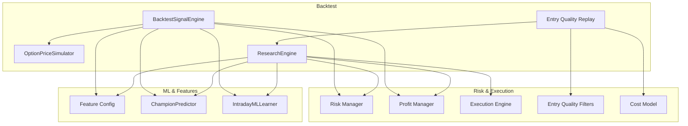
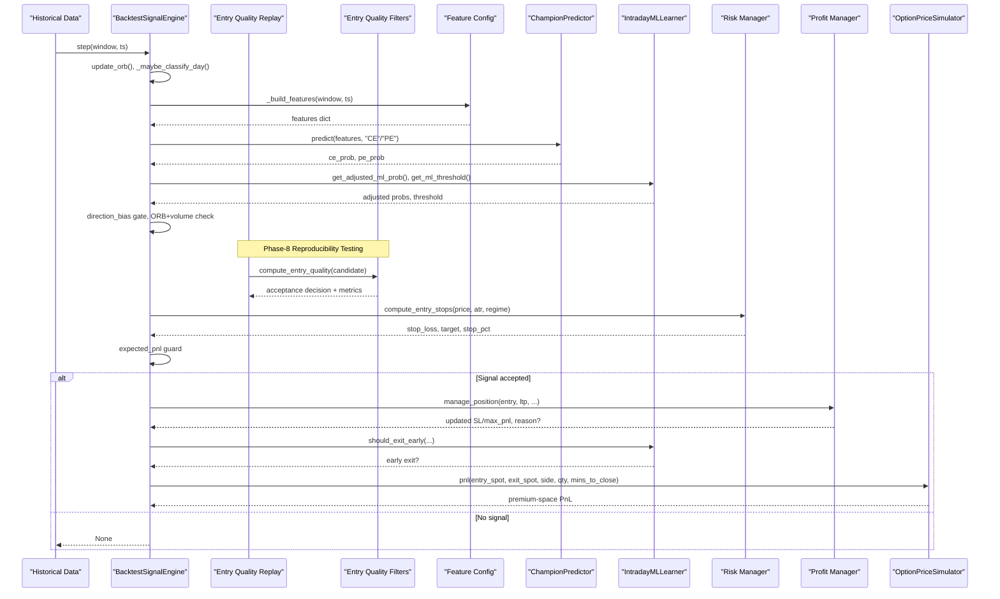
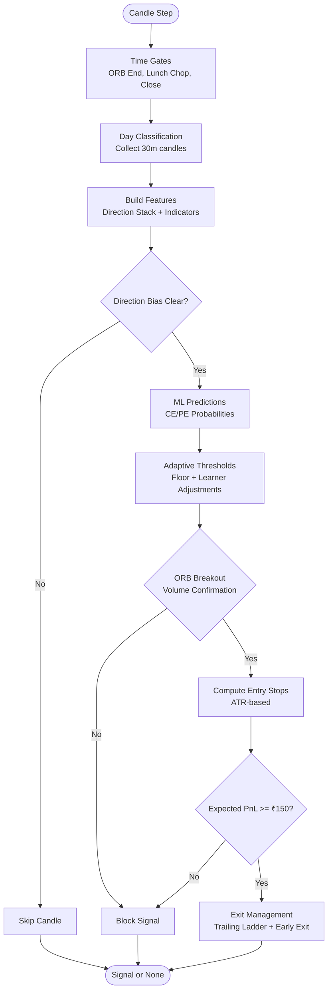
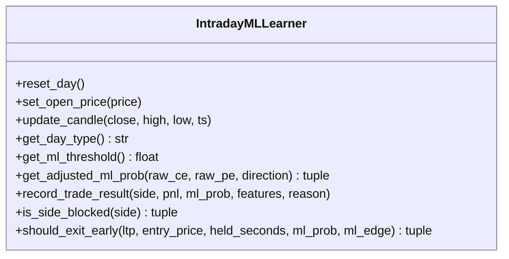
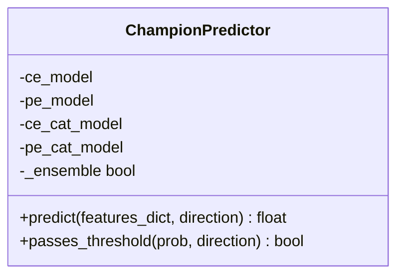
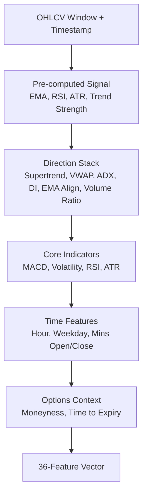
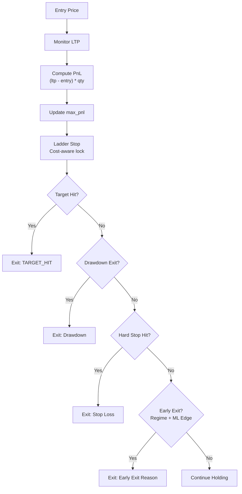
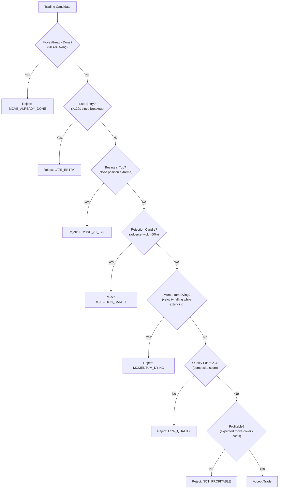
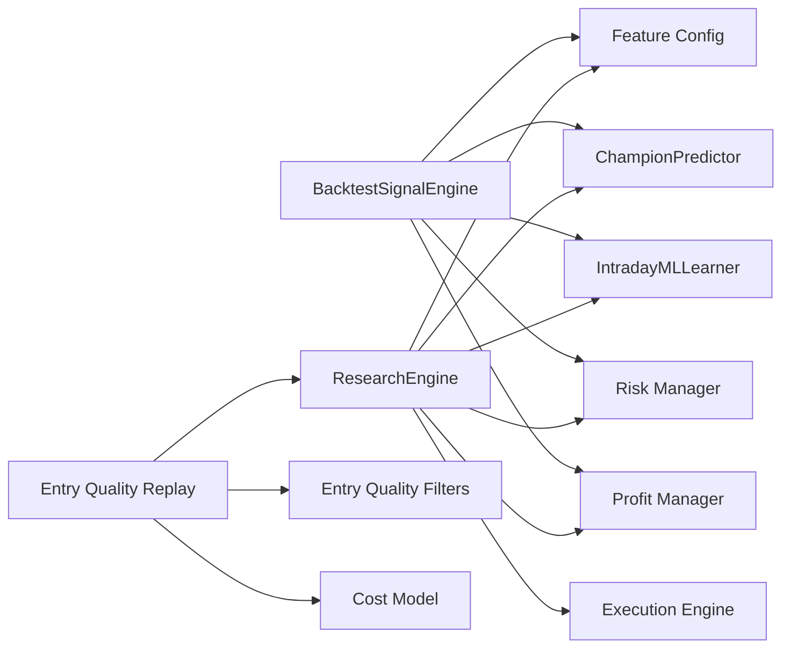

# Backtesting Engine

<cite>
**Referenced Files in This Document**
- [backtest_engine.py](file://backtest/backtest_engine.py)
- [live_engine.py](file://engine/live_engine.py)
- [research_engine.py](file://research/backtest/engine/research_engine.py)
- [run_quick_backtest.py](file://research/backtest/run_quick_backtest.py)
- [ml_intraday_learner.py](file://ml/ml_intraday_learner.py)
- [predictor_champion.py](file://ml/predictor_champion.py)
- [feature_config.py](file://ml/feature_config.py)
- [profit_manager.py](file://engine/execution/profit_manager.py)
- [risk_manager.py](file://engine/risk/risk_manager.py)
- [execution_engine.py](file://engine/execution/execution_engine.py)
- [backtest_entry_quality.py](file://scripts/backtest_entry_quality.py)
- [filters.py](file://engine/execution/filters.py)
- [cost_model.py](file://engine/execution/cost_model.py)
</cite>

## Update Summary
**Changes Made**
- Added comprehensive documentation for the new Phase-8 entry quality replay script
- Enhanced backtesting capabilities section with entry quality filtering
- Updated architecture diagrams to include entry quality system
- Added detailed explanation of sealed historical data replay methodology
- Documented rejection-first filtering approach and quality scoring system

## Table of Contents
1. [Introduction](#introduction)
2. [Project Structure](#project-structure)
3. [Core Components](#core-components)
4. [Architecture Overview](#architecture-overview)
5. [Detailed Component Analysis](#detailed-component-analysis)
6. [Phase-8 Entry Quality Replay System](#phase-8-entry-quality-replay-system)
7. [Dependency Analysis](#dependency-analysis)
8. [Performance Considerations](#performance-considerations)
9. [Troubleshooting Guide](#troubleshooting-guide)
10. [Conclusion](#conclusion)
11. [Appendices](#appendices)

## Introduction
This document explains the institutional-grade backtesting engine that validates intraday options strategies using historical data. It covers the BacktestSignalEngine architecture, ORB (Opening Range Breakout) simulation, feature engineering pipeline, ML prediction integration, exit management logic, and the OptionPriceSimulator used to approximate option premiums from spot data for realistic PnL calculations. It also documents signal generation filters (direction bias, ML thresholds, volume confirmation, session restrictions), telemetry tracking across signal flow stages, practical backtest execution examples, performance metrics interpretation, configuration parameters for strategy tuning and risk management, and common pitfalls such as look-ahead bias prevention, slippage modeling, and overfitting detection.

**Updated** The system now includes a comprehensive Phase-8 entry quality replay system that provides reproducible testing against sealed historical data using rejection-first filtering and quality scoring mechanisms.

## Project Structure
The backtesting system is composed of:
- A dedicated backtest signal engine that mirrors live decision logic without broker dependencies
- A research backtest engine that reuses live components for clean-room validation
- **New**: Phase-8 entry quality replay system for reproducibility testing
- Feature engineering and ML modules shared with live trading
- Risk and profit management modules for stop/target computation and trailing exits
- An execution engine for live order placement and protective stops (used conceptually by backtests via cost models)

**Diagram sources**
- [backtest_engine.py:196-758](file://backtest/backtest_engine.py#L196-L758)
- [research_engine.py:48-319](file://research/backtest/engine/research_engine.py#L48-L319)
- [backtest_entry_quality.py:1-207](file://scripts/backtest_entry_quality.py#L1-L207)
- [filters.py:136-288](file://engine/execution/filters.py#L136-L288)
- [cost_model.py:1-45](file://engine/execution/cost_model.py#L1-L45)

**Section sources**
- [backtest_engine.py:1-1443](file://backtest/backtest_engine.py#L1-L1443)
- [research_engine.py:1-578](file://research/backtest/engine/research_engine.py#L1-L578)
- [backtest_entry_quality.py:1-207](file://scripts/backtest_entry_quality.py#L1-L207)

## Core Components
- BacktestSignalEngine: Orchestrates ORB state, VWAP accumulation, day classification, feature building, direction bias gating, ML predictions, ORB+volume confirmation, adaptive thresholds, expected PnL guard, and exit checks.
- OptionPriceSimulator: Approximates CE/PE option premium from spot movement and time decay to compute realistic PnL in premium space.
- IntradayMLLearner: Tracks daily outcomes, adapts thresholds and side multipliers, detects day type, and provides early exit signals based on regime and ML edge.
- ChampionPredictor: Loads champion models (LightGBM, optional CatBoost ensemble) and predicts probabilities for CE/PE given features.
- Feature Config: Builds a consistent 36-feature vector including a "direction stack" (Supertrend, VWAP bias, ADX, DI spread, EMA alignment, volume ratio).
- Risk Manager: Computes entry stops and targets with capital-aware constraints.
- Profit Manager: Centralized trailing ladder, scale-out, drawdown exits, and hard stop enforcement in premium space.
- ResearchEngine: Clean-room backtest mirroring live logic, with Phase55 filter support and cost-aware net PnL.
- **New**: Entry Quality Replay System: Replays ORB-breakout + momentum candidates through real entry quality filters with sealed historical data for Phase-8 reproducibility testing.

**Section sources**
- [backtest_engine.py:118-758](file://backtest/backtest_engine.py#L118-L758)
- [ml_intraday_learner.py:46-391](file://ml/ml_intraday_learner.py#L46-L391)
- [predictor_champion.py:57-218](file://ml/predictor_champion.py#L57-L218)
- [feature_config.py:25-267](file://ml/feature_config.py#L25-L267)
- [risk_manager.py:20-60](file://engine/risk/risk_manager.py#L20-L60)
- [profit_manager.py:173-225](file://engine/execution/profit_manager.py#L173-L225)
- [research_engine.py:48-319](file://research/backtest/engine/research_engine.py#L48-L319)
- [backtest_entry_quality.py:1-207](file://scripts/backtest_entry_quality.py#L1-L207)

## Architecture Overview
The backtest loop processes each candle through:
1. Time gates (ORB window, lunch chop, market close)
2. Day classification and VWAP accumulation
3. Feature construction using the same pipeline as live
4. Direction bias gating (Supertrend + VWAP consensus)
5. ML probability estimation and adaptive thresholding
6. ORB breakout detection with volume confirmation
7. Side-specific blocking checks and expected PnL guard
8. Exit management via profit manager and learner early-exit logic

**Updated** The Phase-8 entry quality replay system provides an additional layer of validation by replaying candidates through real entry quality filters before execution.

**Diagram sources**
- [backtest_engine.py:431-758](file://backtest/backtest_engine.py#L431-L758)
- [backtest_entry_quality.py:118-155](file://scripts/backtest_entry_quality.py#L118-L155)
- [filters.py:136-288](file://engine/execution/filters.py#L136-L288)
- [feature_config.py:82-267](file://ml/feature_config.py#L82-L267)
- [predictor_champion.py:151-218](file://ml/predictor_champion.py#L151-L218)
- [ml_intraday_learner.py:208-391](file://ml/ml_intraday_learner.py#L208-L391)
- [risk_manager.py:20-60](file://engine/risk/risk_manager.py#L20-L60)
- [profit_manager.py:173-225](file://engine/execution/profit_manager.py#L173-L225)
- [backtest_engine.py:118-187](file://backtest/backtest_engine.py#L118-L187)

## Detailed Component Analysis

### BacktestSignalEngine
Responsibilities:
- ORB simulation: tracks opening range high/low during 9:15–9:30 and locks after window closes
- VWAP accumulation: resets per day; used for price_vs_vwap feature and direction bias
- Day classification: collects first-30-min candles and classifies TREND/RANGE/VOLATILE/GAP
- Feature building: calls safe feature builder ensuring all required columns are present
- Direction bias gating: only allows trades aligned with Supertrend + VWAP consensus
- ML integration: uses ChampionPredictor and IntradayMLLearner for probabilities and adaptive thresholds
- ORB+volume confirmation: requires volume > 130% of 20-bar average to avoid fake breakouts
- Expected PnL guard: minimum ₹150 expected PnL before entry
- Exit management: delegates to profit manager and learner early-exit logic

**Diagram sources**
- [backtest_engine.py:289-327](file://backtest/backtest_engine.py#L289-L327)
- [backtest_engine.py:330-428](file://backtest/backtest_engine.py#L330-L428)
- [backtest_engine.py:431-758](file://backtest/backtest_engine.py#L431-L758)

**Section sources**
- [backtest_engine.py:196-758](file://backtest/backtest_engine.py#L196-L758)

### OptionPriceSimulator
Purpose:
- Approximates ATM option premium using intrinsic value plus time-value component derived from minutes-to-close and volatility proxy
- Computes directional premium relative to entry spot for CE/PE
- Calculates PnL in premium space, accounting for theta decay and delta exposure

Key behaviors:
- Premium calculation considers favorable move weighted by ATM delta (~0.5)
- PnL computed as difference between entry and exit premiums multiplied by quantity
- Ensures realistic theta decay and symmetric adverse/favorable weighting

**Section sources**
- [backtest_engine.py:118-187](file://backtest/backtest_engine.py#L118-L187)

### IntradayMLLearner
Responsibilities:
- Bayesian updates to CE/PE multipliers based on daily trade outcomes
- Adaptive ML threshold adjustments influenced by consecutive wins/losses and day type
- Day-type detection from first 30 minutes (TREND, RANGE, VOLATILE, GAP)
- Early exit logic considering regime, ML edge collapse, and adverse moves
- Blocking sides after consistent losses to protect capital

**Diagram sources**
- [ml_intraday_learner.py:46-391](file://ml/ml_intraday_learner.py#L46-L391)

**Section sources**
- [ml_intraday_learner.py:46-391](file://ml/ml_intraday_learner.py#L46-L391)

### ChampionPredictor
Responsibilities:
- Loads champion LightGBM models (and optional CatBoost ensemble)
- Validates feature presence and builds input vectors
- Returns calibrated probabilities for CE/PE
- Supports threshold loading and fallback behavior

**Diagram sources**
- [predictor_champion.py:57-218](file://ml/predictor_champion.py#L57-L218)

**Section sources**
- [predictor_champion.py:57-218](file://ml/predictor_champion.py#L57-L218)

### Feature Engineering Pipeline
Responsibilities:
- Builds 36 features consistently across training, backtesting, and live trading
- Includes direction stack: Supertrend direction/distance, VWAP bias, ADX, DI spread, EMA alignment, volume ratio
- Normalizes and clips values to prevent outliers
- Uses timestamp-aware time features to avoid look-ahead bias

**Diagram sources**
- [feature_config.py:82-267](file://ml/feature_config.py#L82-L267)

**Section sources**
- [feature_config.py:25-267](file://ml/feature_config.py#L25-L267)

### Exit Management Logic
Responsibilities:
- Trailing stop ladder based on realized peak PnL (max_pnl)
- Scale-out at predefined profit levels
- Drawdown exits when profit retraces beyond retention thresholds
- Hard stop loss in premium space
- Early exit decisions from learner based on regime and ML edge

**Diagram sources**
- [profit_manager.py:173-225](file://engine/execution/profit_manager.py#L173-L225)
- [ml_intraday_learner.py:348-391](file://ml/ml_intraday_learner.py#L348-L391)

**Section sources**
- [profit_manager.py:173-225](file://engine/execution/profit_manager.py#L173-L225)
- [ml_intraday_learner.py:348-391](file://ml/ml_intraday_learner.py#L348-L391)

### ResearchEngine (Clean-Room Backtest)
Responsibilities:
- Mirrors LiveEngine decision logic without modifying protected files
- Enforces whole-lot sizing for Bank Nifty
- Integrates Phase55 filter for additional regime-based gating
- Computes net PnL with round-trip costs

Usage example:
- Load historical CSV, iterate with rolling window, call check_entry and check_exit
- Record trades with timestamps, prices, quantities, and costs

**Section sources**
- [research_engine.py:48-319](file://research/backtest/engine/research_engine.py#L48-L319)
- [run_quick_backtest.py:61-138](file://research/backtest/run_quick_backtest.py#L61-L138)

## Phase-8 Entry Quality Replay System

**New Section** The Phase-8 entry quality replay system provides a comprehensive framework for validating trading strategies against sealed historical data using rejection-first filtering and quality scoring mechanisms.

### Core Functionality
The entry quality replay system performs the following key operations:

1. **Candidate Generation**: Identifies ORB breakout and momentum burst opportunities from sealed 1-minute historical data
2. **Quality Filtering**: Applies real entry quality filters from `engine.execution.filters.compute_entry_quality` 
3. **Exit Simulation**: Simulates premium-space exits with realistic stop-loss, target, and time-based exits
4. **Performance Comparison**: Compares baseline (no filter) vs filtered results with detailed rejection breakdown

### Entry Quality Filter System
The system implements a sophisticated rejection-first architecture that evaluates entries through multiple quality checks:

**Diagram sources**
- [filters.py:136-288](file://engine/execution/filters.py#L136-L288)

### Key Parameters and Configuration
- **Exit Model**: SL -5 pts, TARGET +50 pts, NO_LIFE (<2 pts after 120s), MAX_HOLD 300s
- **Position Sizing**: Delta 0.5 (ATM proxy), Quantity 30 (one BANKNIFTY lot)
- **Cost Model**: Authoritative round-trip cost via `engine.execution.cost_model.round_trip_cost`
- **Candidate Generation**: 2-bar momentum bursts ≥20 points, ORB breakouts with retry logic

### Sealed Historical Data Processing
The system processes sealed 1-minute NIFTY data with strict temporal boundaries:
- Market hours: 9:15 AM to 3:30 PM
- Complete trading days only (data reaching 3:15 PM)
- Session-based candidate generation respecting ORB window
- Real-time evaluation using only completed bars (no look-ahead bias)

### Performance Metrics and Reporting
The replay system provides comprehensive performance analysis:
- **Baseline vs Filtered Comparison**: Win rates, net PnL, trade counts
- **Rejection Analysis**: Detailed breakdown of why candidates were rejected
- **Exit Distribution**: Analysis of stop-loss, target, time-based, and no-life exits
- **Quality Scoring**: Composite scores for accepted trades

**Section sources**
- [backtest_entry_quality.py:1-207](file://scripts/backtest_entry_quality.py#L1-L207)
- [filters.py:136-288](file://engine/execution/filters.py#L136-L288)
- [cost_model.py:1-45](file://engine/execution/cost_model.py#L1-L45)

## Dependency Analysis
Key dependencies and coupling:
- BacktestSignalEngine depends on feature_config, predictor_champion, ml_intraday_learner, risk_manager, profit_manager
- ResearchEngine depends on live_engine components indirectly via shared modules
- **New**: Entry Quality Replay depends on execution filters, cost model, and research engine components
- All engines share the same feature set to ensure consistency between training and backtesting
- ExecutionEngine is primarily for live trading but informs cost modeling and protective stop concepts used in backtests

**Diagram sources**
- [backtest_engine.py:196-758](file://backtest/backtest_engine.py#L196-L758)
- [research_engine.py:48-319](file://research/backtest/engine/research_engine.py#L48-L319)
- [backtest_entry_quality.py:23-26](file://scripts/backtest_entry_quality.py#L23-L26)

**Section sources**
- [backtest_engine.py:196-758](file://backtest/backtest_engine.py#L196-L758)
- [research_engine.py:48-319](file://research/backtest/engine/research_engine.py#L48-L319)
- [backtest_entry_quality.py:1-207](file://scripts/backtest_entry_quality.py#L1-L207)

## Performance Considerations
- Feature computation efficiency: Use pre-computed signal dict to avoid redundant indicator calculations
- Rolling window size: Balance responsiveness vs. noise; ensure sufficient history for indicators like ATR, RSI, Supertrend
- ML model inference: Ensure feature alignment and handle missing/invalid features gracefully
- Exit logic optimization: Minimize polling frequency; use efficient PnL and stop calculations
- Memory management: Avoid large DataFrame copies; reuse windows where possible
- **New**: Entry quality filtering: Optimize candidate generation to reduce unnecessary filter evaluations
- **New**: Sealed data processing: Efficient batch processing of historical data with minimal memory footprint

## Troubleshooting Guide
Common issues and resolutions:
- Missing features: Ensure all FEATURE_COLUMNS are present; use safe builder to fill defaults
- Look-ahead bias: Verify timestamp usage in time features; avoid using current wall-clock in backtests
- Slippage modeling: Understand virtual stop semantics; actual fills may gap below trigger levels
- Overfitting detection: Monitor ML edge stability; validate thresholds across regimes; use out-of-sample testing
- Session filters: Confirm ORB window and lunch chop filters are correctly applied
- Day classification: Ensure first-30-min candles are collected and classifier is available
- **New**: Entry quality rejections: Analyze rejection statistics to understand filter behavior and adjust thresholds if needed
- **New**: Sealed data integrity: Verify complete trading days and proper timestamp handling in historical data

**Section sources**
- [feature_config.py:255-267](file://ml/feature_config.py#L255-L267)
- [profit_manager.py:8-16](file://engine/execution/profit_manager.py#L8-L16)
- [backtest_engine.py:431-758](file://backtest/backtest_engine.py#L431-L758)
- [backtest_entry_quality.py:185-202](file://scripts/backtest_entry_quality.py#L185-L202)

## Conclusion
The backtesting engine provides a robust, institutional-grade framework for validating intraday options strategies. By mirroring live logic, integrating advanced feature engineering, ML predictions, and sophisticated exit management, it enables realistic performance evaluation. The OptionPriceSimulator ensures accurate PnL calculations in premium space, while telemetry and filtering mechanisms enhance signal quality and risk control. 

**Updated** The addition of the Phase-8 entry quality replay system significantly enhances the system's capability for reproducibility testing against sealed historical data, providing comprehensive validation of trading strategies through rejection-first filtering and quality scoring mechanisms. Proper configuration and awareness of common pitfalls ensure reliable backtesting outcomes.

## Appendices

### Practical Backtest Examples
- Quick backtest runner: Load historical CSV, configure date range, run ResearchEngine to generate trade logs
- Custom backtest: Use BacktestSignalEngine with historical data, track signals and exits, compute performance metrics
- **New**: Phase-8 entry quality replay: Run sealed historical data through entry quality filters for reproducibility testing

**Section sources**
- [run_quick_backtest.py:61-138](file://research/backtest/run_quick_backtest.py#L61-L138)
- [research_engine.py:358-486](file://research/backtest/engine/research_engine.py#L358-L486)
- [backtest_entry_quality.py:158-207](file://scripts/backtest_entry_quality.py#L158-L207)

### Configuration Parameters
- Strategy tuning: ML floors, adaptive thresholds, ORB volume confirmation thresholds
- Risk management: ATR-based stops, target ratios, expected PnL guards, maximum hold times
- Performance optimization: Rolling window sizes, feature computation efficiency, memory management
- **New**: Entry quality parameters: Move percentage limits, breakout age thresholds, quality scoring weights, rejection criteria

**Section sources**
- [backtest_engine.py:32-51](file://backtest/backtest_engine.py#L32-L51)
- [risk_manager.py:20-60](file://engine/risk/risk_manager.py#L20-L60)
- [profit_manager.py:66-73](file://engine/execution/profit_manager.py#L66-L73)
- [filters.py:53-75](file://engine/execution/filters.py#L53-L75)

### Common Pitfalls
- Look-ahead bias: Ensure timestamp-based features and avoid future data leakage
- Slippage modeling: Account for virtual stop gaps and realistic fill scenarios
- Overfitting detection: Validate model performance across different regimes and time periods
- **New**: Entry quality over-filtering: Monitor rejection rates and adjust thresholds to maintain adequate trade flow
- **New**: Sealed data limitations: Understand the constraints of replaying against fixed historical data

**Section sources**
- [feature_config.py:157-165](file://ml/feature_config.py#L157-L165)
- [profit_manager.py:8-16](file://engine/execution/profit_manager.py#L8-L16)
- [backtest_engine.py:500-517](file://backtest/backtest_engine.py#L500-L517)
- [backtest_entry_quality.py:185-202](file://scripts/backtest_entry_quality.py#L185-L202)