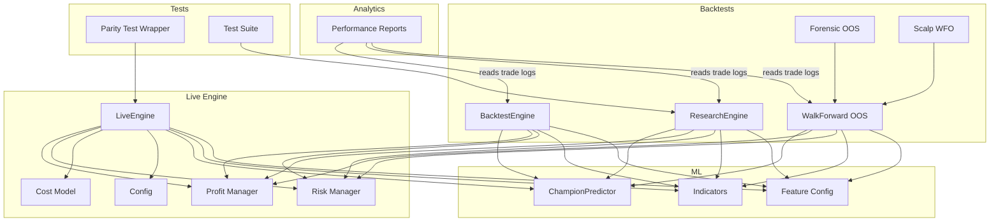
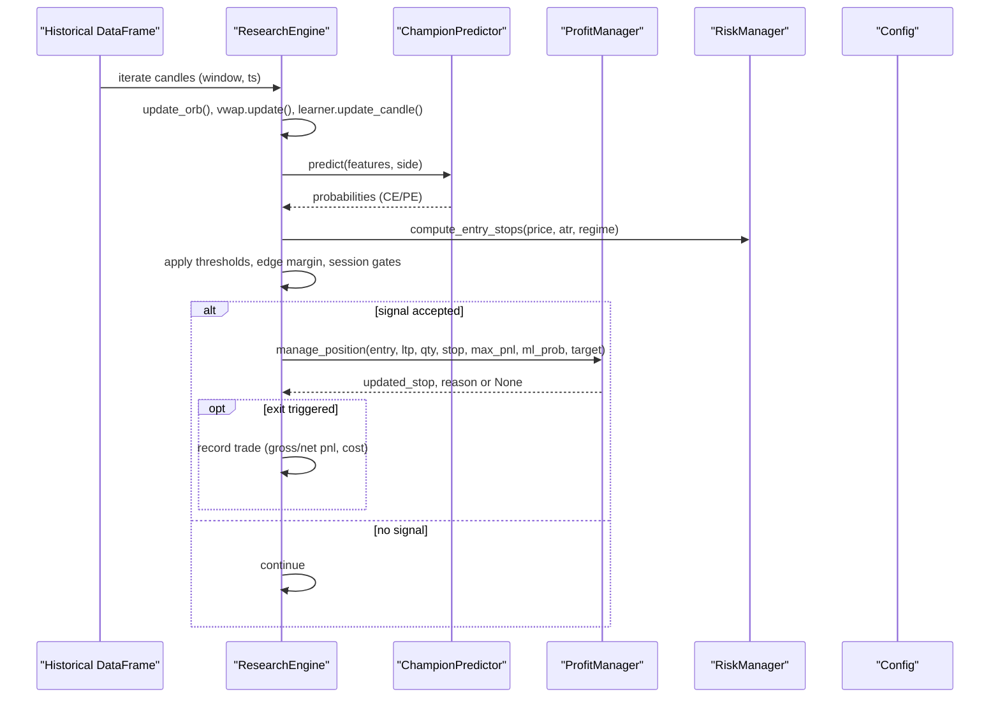
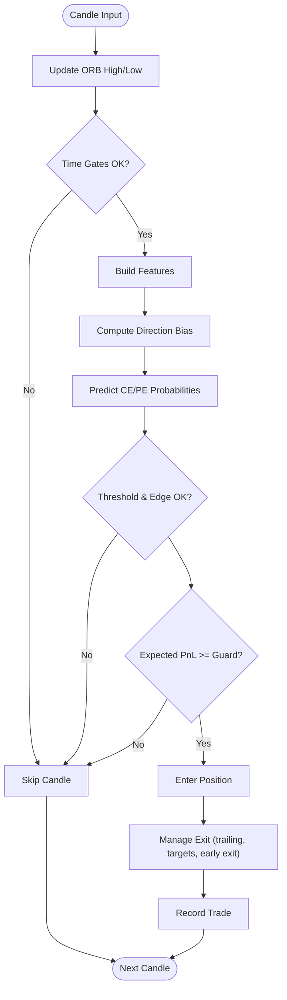
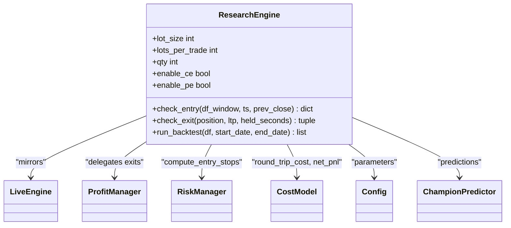
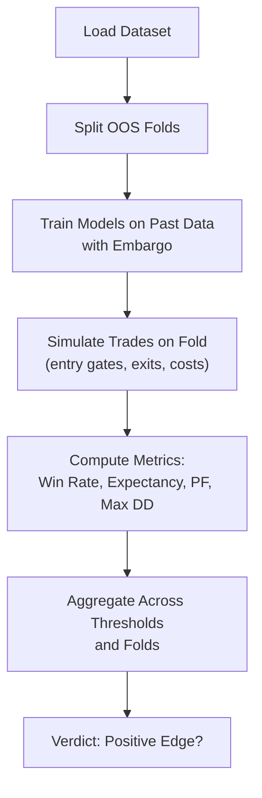
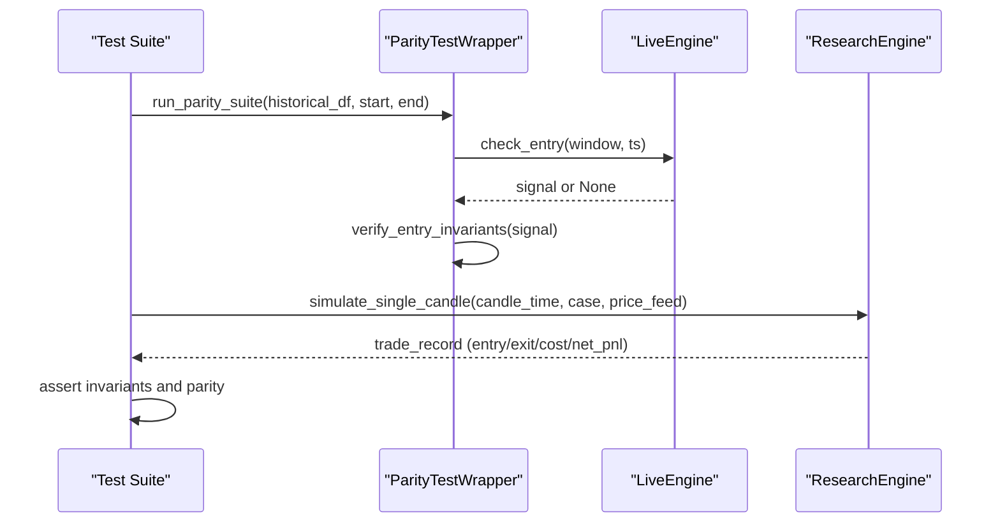
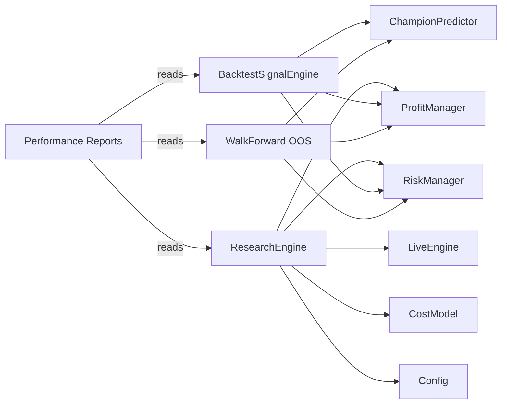

# Backtesting and Research

<cite>
**Referenced Files in This Document**
- [backtest_engine.py](file://backtest/backtest_engine.py)
- [research_engine.py](file://research/backtest/engine/research_engine.py)
- [wrapper.py](file://research/backtest/wrapper.py)
- [run_quick_backtest.py](file://research/backtest/run_quick_backtest.py)
- [walkforward_oos.py](file://backtest/walkforward_oos.py)
- [forensic_oos.py](file://backtest/forensic_oos.py)
- [scalp_wfo.py](file://backtest/scalp_wfo.py)
- [parity_test.py](file://research/backtest/engine/parity_test.py)
- [test_parity.py](file://research/backtest/tests/test_parity.py)
- [performance.py](file://engine/analytics/performance.py)
- [live_engine.py](file://engine/live_engine.py)
- [profit_manager.py](file://engine/execution/profit_manager.py)
- [config.py](file://engine/config/config.py)
- [predictor_champion.py](file://ml/predictor_champion.py)
</cite>

## Table of Contents
1. Introduction
2. Project Structure
3. Core Components
4. Architecture Overview
5. Detailed Component Analysis
6. Dependency Analysis
7. Performance Considerations
8. Troubleshooting Guide
9. Conclusion
10. Appendices

## Introduction
This document explains the backtesting and research framework used for strategy validation and development. It covers:
- The backtest engine architecture: historical data processing, simulation logic, and performance analytics
- Walk-forward optimization for robust parameter testing and out-of-sample validation
- Research engine parity testing to ensure consistency between live and research environments
- Quick backtesting utilities for rapid iteration
- Test suite coverage for trading logic invariants
- Data requirements, metrics, reporting, and practical usage examples
- Common pitfalls (look-ahead bias, overfitting) and prevention techniques

## Project Structure
The framework is organized into clear layers:
- Live execution core: live_engine, profit management, risk, cost model, configuration
- ML models and features: predictor champion, indicators, feature config
- Backtesting engines: legacy backtest engine, walk-forward OOS, forensic OOS, scalp WFO
- Research backtest: clean-room engine mirroring live decisions, wrapper for parity tests, quick runner
- Analytics: post-trade reports and drift monitoring
- Tests: parity and invariant checks

**Diagram sources**
- [live_engine.py:71-184](file://engine/live_engine.py#L71-L184)
- [profit_manager.py:173-225](file://engine/execution/profit_manager.py#L173-L225)
- [research_engine.py:48-122](file://research/backtest/engine/research_engine.py#L48-L122)
- [backtest_engine.py:196-260](file://backtest/backtest_engine.py#L196-L260)
- [walkforward_oos.py:116-242](file://backtest/walkforward_oos.py#L116-L242)
- [performance.py:143-219](file://engine/analytics/performance.py#L143-L219)
- [parity_test.py:30-80](file://research/backtest/engine/parity_test.py#L30-L80)
- [test_parity.py:130-153](file://research/backtest/tests/test_parity.py#L130-L153)

**Section sources**
- [live_engine.py:71-184](file://engine/live_engine.py#L71-L184)
- [research_engine.py:48-122](file://research/backtest/engine/research_engine.py#L48-L122)
- [backtest_engine.py:196-260](file://backtest/backtest_engine.py#L196-L260)
- [walkforward_oos.py:116-242](file://backtest/walkforward_oos.py#L116-L242)
- [performance.py:143-219](file://engine/analytics/performance.py#L143-L219)
- [parity_test.py:30-80](file://research/backtest/engine/parity_test.py#L30-L80)
- [test_parity.py:130-153](file://research/backtest/tests/test_parity.py#L130-L153)

## Core Components
- LiveEngine: central decision loop with ORB tracking, VWAP, day classification, ML prediction, exits via profit manager
- BacktestSignalEngine: mirrors live logic on pure DataFrames; reuses same feature builder, predictor, risk, and profit management
- ResearchEngine: clean-room implementation that calls live modules directly to ensure parity
- ProfitManager: unified trailing stop ladder and scale-out logic
- ChampionPredictor: loads calibrated models (LGBM/CatBoost ensemble), validates features, returns probabilities
- WalkForward OOS: purged walk-forward with embargoed training, per-bar AUC vs trade-level PnL, conservative costs
- Forensic OOS: detailed trade metadata for diagnostics
- Scalp WFO: fast walk-forward optimization for scalp strategies
- Analytics: EOD review, regime breakdown, ML bucket analysis, drift monitoring, equity curve stats
- Parity test wrapper and test suite: enforce invariants and parity between live and research

**Section sources**
- [live_engine.py:71-184](file://engine/live_engine.py#L71-L184)
- [backtest_engine.py:196-260](file://backtest/backtest_engine.py#L196-L260)
- [research_engine.py:48-122](file://research/backtest/engine/research_engine.py#L48-L122)
- [profit_manager.py:173-225](file://engine/execution/profit_manager.py#L173-L225)
- [predictor_champion.py:57-100](file://ml/predictor_champion.py#L57-L100)
- [walkforward_oos.py:116-242](file://backtest/walkforward_oos.py#L116-L242)
- [forensic_oos.py:133-166](file://backtest/forensic_oos.py#L133-L166)
- [scalp_wfo.py:261-295](file://backtest/scalp_wfo.py#L261-L295)
- [performance.py:143-219](file://engine/analytics/performance.py#L143-L219)
- [parity_test.py:30-80](file://research/backtest/engine/parity_test.py#L30-L80)
- [test_parity.py:130-153](file://research/backtest/tests/test_parity.py#L130-L153)

## Architecture Overview
The system ensures parity by having research and backtest components call the same live modules for entry/exit decisions, risk, and cost modeling. Historical data flows through a rolling window to build features, which are fed to ML models. Signals pass through time gates, regime filters, and expected PnL guards before entering positions. Exits are managed by a unified profit ladder and early-exit logic. Analytics read trade logs to produce reports and alerts.

**Diagram sources**
- [research_engine.py:205-319](file://research/backtest/engine/research_engine.py#L205-L319)
- [research_engine.py:358-486](file://research/backtest/engine/research_engine.py#L358-L486)
- [profit_manager.py:173-225](file://engine/execution/profit_manager.py#L173-L225)
- [live_engine.py:71-184](file://engine/live_engine.py#L71-L184)

## Detailed Component Analysis

### Backtest Signal Engine
- Mirrors LiveEngine step behavior using DataFrames
- Builds features via shared functions, computes direction bias from Supertrend + VWAP
- Applies ORB detection, volume confirmation, day-type gating, ML thresholds, expected PnL guard
- Uses profit manager for exits and early exits via learner

**Diagram sources**
- [backtest_engine.py:431-758](file://backtest/backtest_engine.py#L431-L758)
- [backtest_engine.py:762-800](file://backtest/backtest_engine.py#L762-L800)

**Section sources**
- [backtest_engine.py:431-758](file://backtest/backtest_engine.py#L431-L758)
- [backtest_engine.py:762-800](file://backtest/backtest_engine.py#L762-L800)

### Research Engine
- Clean-room implementation calling live modules directly
- Enforces Bank Nifty lot size invariants (qty multiple of 30)
- Entry flow: features -> predictions -> edge margin -> thresholds -> session gates -> risk stops -> expected PnL -> Phase55 filter
- Exit flow: profit manager -> time-based weak exit -> ML early exit

**Diagram sources**
- [research_engine.py:48-122](file://research/backtest/engine/research_engine.py#L48-L122)
- [research_engine.py:205-319](file://research/backtest/engine/research_engine.py#L205-L319)
- [research_engine.py:358-486](file://research/backtest/engine/research_engine.py#L358-L486)
- [config.py:4-48](file://engine/config/config.py#L4-L48)

**Section sources**
- [research_engine.py:48-122](file://research/backtest/engine/research_engine.py#L48-L122)
- [research_engine.py:205-319](file://research/backtest/engine/research_engine.py#L205-L319)
- [research_engine.py:358-486](file://research/backtest/engine/research_engine.py#L358-L486)
- [config.py:4-48](file://engine/config/config.py#L4-L48)

### Walk-Forward Optimization and Out-of-Sample Validation
- Purged walk-forward: train on strictly past data with embargo equal to label lookahead to prevent look-ahead leakage
- Per-fold simulation with conservative costs (spread + brokerage)
- Reports per-bar AUC alongside trade-level expectancy to highlight inflation gap
- Aggregates results across thresholds with minimum sample floors to avoid noise-driven conclusions

**Diagram sources**
- [walkforward_oos.py:116-242](file://backtest/walkforward_oos.py#L116-L242)
- [walkforward_oos.py:265-365](file://backtest/walkforward_oos.py#L265-L365)

**Section sources**
- [walkforward_oos.py:116-242](file://backtest/walkforward_oos.py#L116-L242)
- [walkforward_oos.py:265-365](file://backtest/walkforward_oos.py#L265-L365)

### Forensic OOS and Scalp WFO
- Forensic OOS records full trade metadata for deep diagnostics
- Scalp WFO performs fast walk-forward optimization for scalp strategies with HTF maps and fold-wise evaluation

**Section sources**
- [forensic_oos.py:133-166](file://backtest/forensic_oos.py#L133-L166)
- [scalp_wfo.py:261-295](file://backtest/scalp_wfo.py#L261-L295)

### Parity Testing and Test Suite
- Parity test wrapper delegates to live engine methods to compare research vs live decisions
- Test suite validates sizing invariants, cost model parity, entry/exit behaviors, and report generation

**Diagram sources**
- [parity_test.py:30-80](file://research/backtest/engine/parity_test.py#L30-L80)
- [parity_test.py:118-162](file://research/backtest/engine/parity_test.py#L118-L162)
- [test_parity.py:130-153](file://research/backtest/tests/test_parity.py#L130-L153)
- [wrapper.py:81-214](file://research/backtest/wrapper.py#L81-L214)

**Section sources**
- [parity_test.py:30-80](file://research/backtest/engine/parity_test.py#L30-L80)
- [parity_test.py:118-162](file://research/backtest/engine/parity_test.py#L118-L162)
- [test_parity.py:130-153](file://research/backtest/tests/test_parity.py#L130-L153)
- [wrapper.py:81-214](file://research/backtest/wrapper.py#L81-L214)

### Analytics and Reporting
- EOD review aggregates daily trades, highlights best/worst, top exit/setup reasons, regime breakdown
- Regime breakdown shows win rate, PnL, PF, expectancy, capture ratio per regime
- ML bucket analysis evaluates signal quality by probability buckets
- Drift monitor alerts on WR, expectancy, PF, capture drops across windows
- Equity curve stats compute drawdown, recovery factor, streaks, weekly/monthly rollups

**Section sources**
- [performance.py:143-219](file://engine/analytics/performance.py#L143-L219)
- [performance.py:226-251](file://engine/analytics/performance.py#L226-L251)
- [performance.py:258-287](file://engine/analytics/performance.py#L258-L287)
- [performance.py:294-356](file://engine/analytics/performance.py#L294-L356)
- [performance.py:401-487](file://engine/analytics/performance.py#L401-L487)

## Dependency Analysis
Key dependencies and coupling:
- ResearchEngine depends on live modules (LiveEngine, profit_manager, risk_manager, cost_model, config) to ensure parity
- BacktestSignalEngine reuses live feature builders, predictors, and risk/profit logic
- WalkForward OOS trains models per fold with embargo and simulates trades using option premium simulator and profit manager
- Analytics reads trade logs produced by backtests and live sessions
- PredictorChampion validates features and provides calibrated probabilities

**Diagram sources**
- [research_engine.py:48-122](file://research/backtest/engine/research_engine.py#L48-L122)
- [backtest_engine.py:196-260](file://backtest/backtest_engine.py#L196-L260)
- [walkforward_oos.py:116-242](file://backtest/walkforward_oos.py#L116-L242)
- [performance.py:143-219](file://engine/analytics/performance.py#L143-L219)

**Section sources**
- [research_engine.py:48-122](file://research/backtest/engine/research_engine.py#L48-L122)
- [backtest_engine.py:196-260](file://backtest/backtest_engine.py#L196-L260)
- [walkforward_oos.py:116-242](file://backtest/walkforward_oos.py#L116-L242)
- [performance.py:143-219](file://engine/analytics/performance.py#L143-L219)

## Performance Considerations
- Use rolling windows sized appropriately to balance responsiveness and stability
- Apply session filters (ORB build, lunch chop avoidance) to reduce false signals
- Enforce expected PnL guard to avoid low-value entries
- Conservative cost modeling in walk-forward OOS prevents over-optimistic results
- Trailing stops and scale-out protect profits and reduce drawdowns
- Monitor drift and equity curve to detect degradation early

[No sources needed since this section provides general guidance]

## Troubleshooting Guide
Common issues and resolutions:
- Missing features: PredictorChampion returns None if required features are absent; ensure feature pipeline completeness
- Look-ahead leakage: Walk-forward uses embargo equal to label lookahead; verify dataset_builder parameters match
- Overfitting: Require minimum trade counts and positive expectancy before deployment; use purged folds
- Sizing invariants: Ensure quantity is a multiple of lot size (Bank Nifty = 30); tests validate this
- Exit mismatches: Profit manager handles trailing and scale-out; verify position state updates and MFE tracking
- Parity failures: Use parity test wrapper to compare live vs research decisions; assert invariants

**Section sources**
- [predictor_champion.py:151-200](file://ml/predictor_champion.py#L151-L200)
- [walkforward_oos.py:289-318](file://backtest/walkforward_oos.py#L289-L318)
- [test_parity.py:130-153](file://research/backtest/tests/test_parity.py#L130-L153)
- [profit_manager.py:173-225](file://engine/execution/profit_manager.py#L173-L225)
- [parity_test.py:118-162](file://research/backtest/engine/parity_test.py#L118-L162)

## Conclusion
The framework provides a robust, parity-aligned backtesting and research environment. By reusing live modules, enforcing strict data hygiene (embargoes, minimum samples), and applying realistic costs and exits, it delivers reliable validation for strategy development. Analytics and parity tests support ongoing monitoring and confidence in deployment.

[No sources needed since this section summarizes without analyzing specific files]

## Appendices

### Practical Usage Examples
- Quick backtest: Run the quick runner to generate a trade log for rapid iteration
  - Command pattern: specify date range and optional row limits
  - Output: trade_log.csv under research/backtest/results
- Walk-forward OOS: Execute purged walk-forward with configurable folds and thresholds
  - Environment variables: FOLDS, OOS_START, BT_STOP_MODE, ML_EDGE_MARGIN
  - Output: aggregated metrics and verdict per threshold
- Parity tests: Execute test suite to validate sizing, cost model, entry/exit behaviors
  - Requires historical data file; skips if missing
  - Asserts invariants and parity between live and research

**Section sources**
- [run_quick_backtest.py:61-134](file://research/backtest/run_quick_backtest.py#L61-L134)
- [walkforward_oos.py:265-365](file://backtest/walkforward_oos.py#L265-L365)
- [test_parity.py:68-80](file://research/backtest/tests/test_parity.py#L68-L80)
- [test_parity.py:130-153](file://research/backtest/tests/test_parity.py#L130-L153)

### Data Requirements
- Historical OHLCV data with datetime column(s) recognized by quick runner
- Feature columns must be present for predictor; missing features cause prediction failure
- Training dataset for walk-forward must include feature columns and labels with correct lookahead alignment

**Section sources**
- [run_quick_backtest.py:22-49](file://research/backtest/run_quick_backtest.py#L22-L49)
- [predictor_champion.py:151-200](file://ml/predictor_champion.py#L151-L200)
- [walkforward_oos.py:272-278](file://backtest/walkforward_oos.py#L272-L278)

### Performance Metrics and Reporting
- Win rate, profit factor, expectancy, average MFE/MAE, capture ratio
- Regime breakdown and setup performance
- ML signal quality by probability buckets
- Drift alerts on WR, expectancy, PF, capture
- Equity curve stats including drawdown and recovery factor

**Section sources**
- [performance.py:143-219](file://engine/analytics/performance.py#L143-L219)
- [performance.py:226-251](file://engine/analytics/performance.py#L226-L251)
- [performance.py:258-287](file://engine/analytics/performance.py#L258-L287)
- [performance.py:294-356](file://engine/analytics/performance.py#L294-L356)
- [performance.py:401-487](file://engine/analytics/performance.py#L401-L487)

### Avoiding Look-Ahead Bias and Overfitting
- Embargo training data by label lookahead to prevent leakage
- Require minimum trade counts and positive expectancy for deployment
- Use purged folds and conservative cost modeling
- Validate with parity tests to ensure research matches live behavior

**Section sources**
- [walkforward_oos.py:289-318](file://backtest/walkforward_oos.py#L289-L318)
- [walkforward_oos.py:338-365](file://backtest/walkforward_oos.py#L338-L365)
- [test_parity.py:130-153](file://research/backtest/tests/test_parity.py#L130-L153)