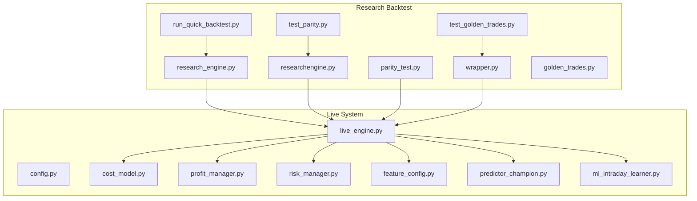
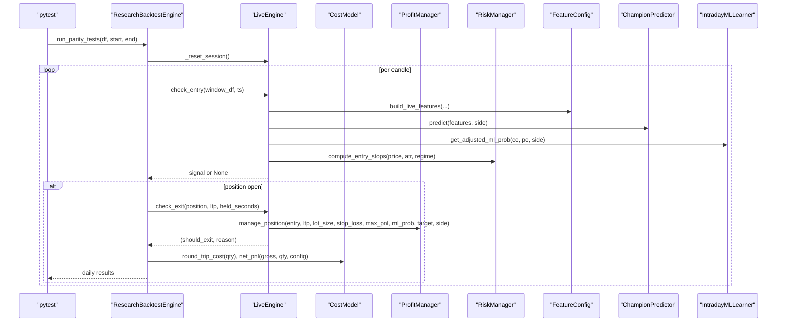
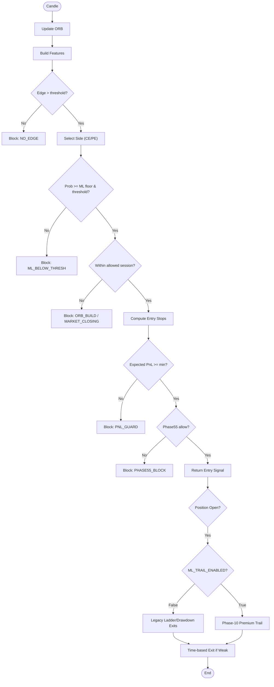
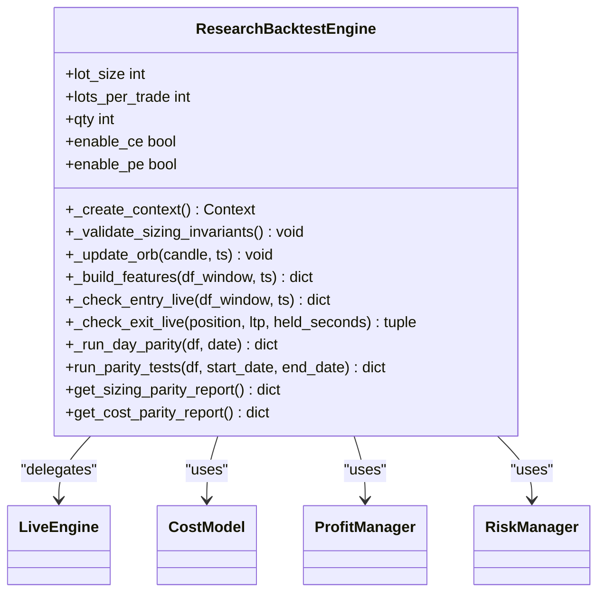
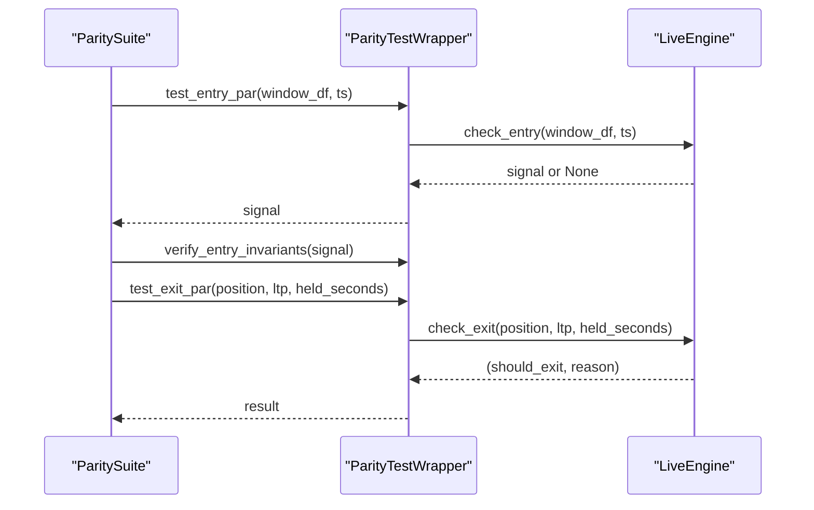
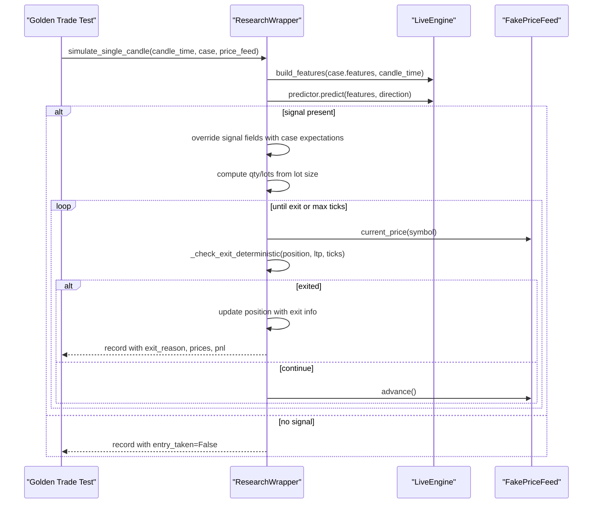
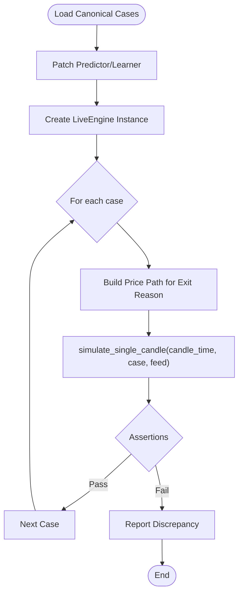
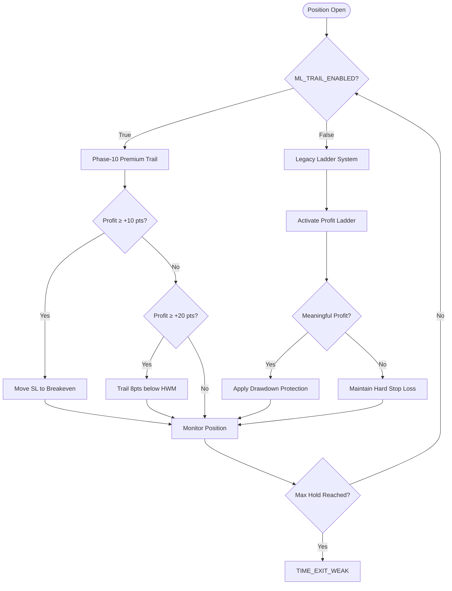
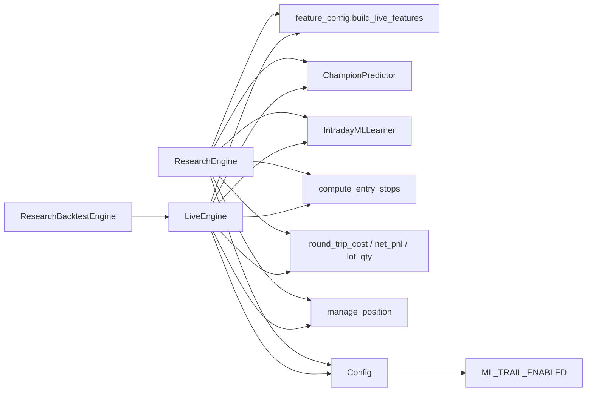

# Research Parity Testing

<cite>
**Referenced Files in This Document**
- [research_engine.py](file://research/backtest/engine/research_engine.py)
- [researchengine.py](file://research/backtest/engine/researchengine.py)
- [parity_test.py](file://research/backtest/engine/parity_test.py)
- [wrapper.py](file://research/backtest/wrapper.py)
- [golden_trades.py](file://research/backtest/tests/golden_trades.py)
- [test_parity.py](file://research/backtest/tests/test_parity.py)
- [test_golden_trades.py](file://research/backtest/tests/test_golden_trades.py)
- [run_quick_backtest.py](file://research/backtest/run_quick_backtest.py)
- [live_engine.py](file://engine/live_engine.py)
- [config.py](file://engine/config/config.py)
- [cost_model.py](file://engine/execution/cost_model.py)
- [profit_manager.py](file://engine/execution/profit_manager.py)
- [risk_manager.py](file://engine/risk/risk_manager.py)
- [feature_config.py](file://ml/feature_config.py)
- [predictor_champion.py](file://ml/predictor_champion.py)
- [ml_intraday_learner.py](file://ml/ml_intraday_learner.py)
- [research-tests.yml](file://.github/workflows/research-tests.yml)
</cite>

## Update Summary
**Changes Made**
- Updated ResearchEngine architecture section to document ML_TRAIL_ENABLED configuration override
- Added detailed explanation of Phase-10 vs legacy exit behavior differences
- Enhanced troubleshooting guide with ML_TRAIL_ENABLED parity issues
- Updated exit logic diagrams to show Phase-10 trail activation conditions
- Added new section on exit regime parity validation

## Table of Contents
1. [Introduction](#introduction)
2. [Project Structure](#project-structure)
3. [Core Components](#core-components)
4. [Architecture Overview](#architecture-overview)
5. [Detailed Component Analysis](#detailed-component-analysis)
6. [Exit Regime Parity](#exit-regime-parity)
7. [Dependency Analysis](#dependency-analysis)
8. [Performance Considerations](#performance-considerations)
9. [Troubleshooting Guide](#troubleshooting-guide)
10. [Conclusion](#conclusion)
11. [Appendices](#appendices)

## Introduction
This document explains the research parity testing framework that ensures consistency between live trading and research environments. It focuses on:
- The ResearchEngine architecture that mirrors live trading logic without duplicating code
- The parity testing methodology that validates identical behavior across production and research code paths
- The golden trades test suite that uses known profitable scenarios to validate strategy correctness
- Test infrastructure for comparing outputs, detecting behavioral drift, and ensuring reproducibility
- Practical guidance for writing new parity tests, debugging discrepancies, and maintaining coverage
- Utilities for simulating market conditions, generating test data, and validating edge cases
- Common issues such as environment differences, timing variations, and external dependency changes
- **Critical**: Exit regime parity ensuring backtesting validates established ladder/drawdown behavior rather than new Phase-10 exits

## Project Structure
The parity testing framework is organized under research/backtest with supporting components in engine and ml. Key areas:
- Engine layer: clean-room research backtest and parity wrappers around live engine methods
- Tests: parity assertions, golden trade scenarios, and deterministic simulations
- Utilities: quick backtest runner and wrapper for single-candle simulation
- CI: GitHub Actions workflow that runs parity tests on pull requests touching research or related paths

**Diagram sources**
- [research_engine.py:1-587](file://research/backtest/engine/research_engine.py#L1-L587)
- [researchengine.py:1-413](file://research/backtest/engine/researchengine.py#L1-L413)
- [parity_test.py:1-181](file://research/backtest/engine/parity_test.py#L1-L181)
- [wrapper.py:1-214](file://research/backtest/wrapper.py#L1-L214)
- [golden_trades.py:1-62](file://research/backtest/tests/golden_trades.py#L1-L62)
- [test_parity.py:1-533](file://research/backtest/tests/test_parity.py#L1-L533)
- [test_golden_trades.py:1-146](file://research/backtest/tests/test_golden_trades.py#L1-L146)
- [run_quick_backtest.py:1-138](file://research/backtest/run_quick_backtest.py#L1-L138)
- [live_engine.py:1-200](file://engine/live_engine.py#L1-L200)

**Section sources**
- [research-engine.py:1-587](file://research/backtest/engine/research_engine.py#L1-L587)
- [researchengine.py:1-413](file://research/backtest/engine/researchengine.py#L1-L413)
- [parity_test.py:1-181](file://research/backtest/engine/parity_test.py#L1-L181)
- [wrapper.py:1-214](file://research/backtest/wrapper.py#L1-L214)
- [golden_trades.py:1-62](file://research/backtest/tests/golden_trades.py#L1-L62)
- [test_parity.py:1-533](file://research/backtest/tests/test_parity.py#L1-L533)
- [test_golden_trades.py:1-146](file://research/backtest/tests/test_golden_trades.py#L1-L146)
- [run_quick_backtest.py:1-138](file://research/backtest/run_quick_backtest.py#L1-L138)
- [live_engine.py:1-200](file://engine/live_engine.py#L1-L200)

## Core Components
- ResearchEngine (clean room): Mirrors LiveEngine decision logic using shared modules; enforces Bank Nifty lot size invariants and consistent sizing; implements ORB, feature building, entry/exit checks, and PnL accounting via live cost model. **Critical**: Forces `ML_TRAIL_ENABLED = False` to maintain parity with legacy exit behavior.
- ResearchBacktestEngine (parity layer): Thin wrapper around LiveEngine to run day-by-day parity comparisons, generate reports, and assert invariants without duplicating logic.
- ParityTestWrapper: Thin adapter that calls live engine methods directly for entry/exit/close parity checks and validates invariants. **Critical**: Also forces `ML_TRAIL_ENABLED = False` for parity validation.
- ResearchWrapper: Single-candle simulation harness for golden trades; builds features via live engine, drives deterministic exits, and returns standardized trade records.
- GoldenTradeCase and canonical cases: Data-driven scenarios describing expected entries, stops, targets, and exit reasons for deterministic validation.
- Test suites: pytest-based parity and golden trade tests with mocked predictors and learners to ensure determinism while exercising live logic.

**Section sources**
- [research_engine.py:48-122](file://research/backtest/engine/research_engine.py#L48-L122)
- [researchengine.py:37-98](file://research/backtest/engine/researchengine.py#L37-L98)
- [parity_test.py:30-81](file://research/backtest/engine/parity_test.py#L30-L81)
- [wrapper.py:7-214](file://research/backtest/wrapper.py#L7-L214)
- [golden_trades.py:5-62](file://research/backtest/tests/golden_trades.py#L5-L62)
- [test_parity.py:130-180](file://research/backtest/tests/test_parity.py#L130-L180)
- [test_golden_trades.py:40-98](file://research/backtest/tests/test_golden_trades.py#L40-L98)

## Architecture Overview
The parity framework avoids code duplication by delegating to LiveEngine and shared utilities. Two complementary engines exist:
- ResearchEngine: A standalone backtest that reuses live modules for features, risk, and costs, but maintains its own session state and loop for research runs.
- ResearchBacktestEngine: A parity layer that constructs a minimal context for LiveEngine and delegates all decisions to it, then asserts invariants and generates parity reports.

**Diagram sources**
- [researchengine.py:123-233](file://research/backtest/engine/researchengine.py#L123-L233)
- [live_engine.py:71-128](file://engine/live_engine.py#L71-L128)
- [cost_model.py:1-200](file://engine/execution/cost_model.py#L1-L200)
- [profit_manager.py:1-200](file://engine/execution/profit_manager.py#L1-L200)
- [risk_manager.py:1-200](file://engine/risk/risk_manager.py#L1-L200)
- [feature_config.py:1-200](file://ml/feature_config.py#L1-L200)
- [predictor_champion.py:1-200](file://ml/predictor_champion.py#L1-L200)
- [ml_intraday_learner.py:1-200](file://ml/ml_intraday_learner.py#L1-L200)

## Detailed Component Analysis

### ResearchEngine (clean room)
Responsibilities:
- Initialize sizing with Bank Nifty lot size and enforce whole-lot invariants
- Maintain ORB state and VWAP accumulator
- Build features using the same function as live engine
- Mirror entry logic: edge check, direction selection, thresholds, session gates, risk stops, expected PnL guard, Phase55 filter
- Mirror exit logic: delegate to profit manager and apply time-based exit when weak
- Close positions using live cost model and compute MFE/giveback

**Updated** Critical configuration override: Forces `ML_TRAIL_ENABLED = False` in research mode to maintain parity with legacy exit behavior. This prevents the research engine from accidentally switching to Phase-10 premium-space trailing exits during backtesting.

Key behaviors:
- ORB window gating prevents early entries
- Predict-first direction selection with ML floors and edge margin
- Risk stops computed from regime-aware ATR
- Expected PnL guard filters low-edge signals
- Phase55 filter can block trades based on regime and confidence
- **Exit regime parity**: Legacy ladder/drawdown exits enforced via ML_TRAIL_ENABLED override

**Diagram sources**
- [research_engine.py:123-319](file://research/backtest/engine/research_engine.py#L123-L319)
- [research_engine.py:328-365](file://research/backtest/engine/research_engine.py#L328-L365)

**Section sources**
- [research_engine.py:48-122](file://research/backtest/engine/research_engine.py#L48-L122)
- [research_engine.py:141-319](file://research/backtest/engine/research_engine.py#L141-L319)
- [research_engine.py:328-365](file://research/backtest/engine/research_engine.py#L328-L365)
- [research_engine.py:367-495](file://research/backtest/engine/research_engine.py#L367-L495)

### ResearchBacktestEngine (parity layer)
Responsibilities:
- Wrap LiveEngine with a minimal context to avoid modifying live code
- Delegate ORB updates, feature building, entry/exit checks to LiveEngine
- Validate signal invariants (qty positive and multiple of 30)
- Close positions using live cost model and produce parity trade records
- Run day-level parity loops and aggregate results into reports

Key behaviors:
- Uses live engine constants for market times and thresholds
- Aggregates daily results including total candles, entry/exit signals, errors
- Generates sizing and cost parity reports for continuous validation

**Diagram sources**
- [researchengine.py:37-98](file://research/backtest/engine/researchengine.py#L37-L98)
- [researchengine.py:99-233](file://research/backtest/engine/researchengine.py#L99-L233)
- [researchengine.py:235-355](file://research/backtest/engine/researchengine.py#L235-L355)

**Section sources**
- [researchengine.py:37-98](file://research/backtest/engine/researchengine.py#L37-L98)
- [researchengine.py:99-233](file://research/backtest/engine/researchengine.py#L99-L233)
- [researchengine.py:235-355](file://research/backtest/engine/researchengine.py#L235-L355)

### ParityTestWrapper
Responsibilities:
- Instantiate LiveEngine with a minimal context
- Call live check_entry/check_exit/_close_position equivalents
- Verify entry and exit invariants (qty multiples, net PnL arithmetic)
- Provide a full parity suite runner over historical data windows

**Updated** Critical configuration override: Forces `ML_TRAIL_ENABLED = False` to ensure parity tests validate the legacy exit regime rather than Phase-10 exits.

Key behaviors:
- Delegates entirely to live engine public methods
- Validates that signals meet sizing constraints and PnL calculations are consistent
- **Exit regime enforcement**: Ensures parity tests use legacy ladder/drawdown exits

**Diagram sources**
- [parity_test.py:30-81](file://research/backtest/engine/parity_test.py#L30-L81)
- [parity_test.py:118-162](file://research/backtest/engine/parity_test.py#L118-L162)

**Section sources**
- [parity_test.py:30-81](file://research/backtest/engine/parity_test.py#L30-L81)
- [parity_test.py:83-116](file://research/backtest/engine/parity_test.py#L83-L116)
- [parity_test.py:118-162](file://research/backtest/engine/parity_test.py#L118-L162)

### ResearchWrapper (Golden Trades Harness)
Responsibilities:
- Build features via live engine if available
- Request entry decision through live predictor interface
- Simulate deterministic exits (stop/target/time) using a fake price feed
- Return standardized trade records for assertions

Key behaviors:
- Overrides signal placeholder fields with case expectations for deterministic testing
- Supports optional execute_entry_simulated path or fallback minimal position dict
- Drives simulation until exit or max ticks, computing gross PnL and optionally cost/net PnL

**Diagram sources**
- [wrapper.py:16-214](file://research/backtest/wrapper.py#L16-L214)
- [test_golden_trades.py:23-38](file://research/backtest/tests/test_golden_trades.py#L23-L38)
- [test_golden_trades.py:100-146](file://research/backtest/tests/test_golden_trades.py#L100-L146)

**Section sources**
- [wrapper.py:16-214](file://research/backtest/wrapper.py#L16-L214)
- [test_golden_trades.py:23-38](file://research/backtest/tests/test_golden_trades.py#L23-L38)
- [test_golden_trades.py:100-146](file://research/backtest/tests/test_golden_trades.py#L100-L146)

### Golden Trades Test Suite
Responsibilities:
- Define canonical cases with expected entry, lots, stops, targets, and exit reasons
- Parametrize tests to validate parity against wrapper output
- Use mocked predictor and learner to ensure deterministic ML probabilities
- Assert structure and numeric tolerances for entry/exit outcomes

Key behaviors:
- Creates fixtures that patch predictor and learner classes before LiveEngine instantiation
- Builds price paths to force specific exit reasons (target/stop/time)
- Verifies entry_taken matches expectation and key fields align within tolerance

**Diagram sources**
- [golden_trades.py:23-62](file://research/backtest/tests/golden_trades.py#L23-L62)
- [test_golden_trades.py:40-98](file://research/backtest/tests/test_golden_trades.py#L40-L98)
- [test_golden_trades.py:100-146](file://research/backtest/tests/test_golden_trades.py#L100-L146)

**Section sources**
- [golden_trades.py:23-62](file://research/backtest/tests/golden_trades.py#L23-L62)
- [test_golden_trades.py:40-98](file://research/backtest/tests/test_golden_trades.py#L40-L98)
- [test_golden_trades.py:100-146](file://research/backtest/tests/test_golden_trades.py#L100-L146)

### Quick Backtest Runner
Responsibilities:
- Load CSV data, filter by date range, and run ResearchEngine.check_entry over a rolling window
- Generate a trade_log.csv with entry/exit timestamps, sides, quantities, and PnL fields
- Useful for sanity checks and generating sample logs for quantity validations

Key behaviors:
- Auto-detects CSV candidates and parses datetime columns
- Limits rows for speed and writes results to research/backtest/results/trade_log.csv

**Section sources**
- [run_quick_backtest.py:22-138](file://research/backtest/run_quick_backtest.py#L22-L138)

## Exit Regime Parity

### Phase-10 vs Legacy Exit Behavior

**Critical Configuration Override**: The research engine and parity test wrapper both force `ML_TRAIL_ENABLED = False` to ensure backtesting validates the established ladder/drawdown exit regime rather than the new Phase-10 premium-space trailing exits.

#### Phase-10 Premium-Space Trailing (When Enabled)
When `ML_TRAIL_ENABLED = True`, the live engine implements a premium-space trailing system:
- At +10 points profit: Stop moves to breakeven (entry + round-trip cost)
- At +20 points profit: Stop trails 8 points below high-water mark
- Bypasses traditional ladder system entirely for ML trades
- Uses premium point space instead of Rs-based calculations

#### Legacy Ladder/Drawdown System (Research Mode)
When `ML_TRAIL_ENABLED = False` (research mode):
- Traditional Rs-based profit ladder activates at various profit levels
- Drawdown protection kicks in after meaningful profit (≥ qty × 10)
- Hard stop loss remains active throughout trade lifecycle
- Maintains parity with established backtested behavior

**Diagram sources**
- [live_engine.py:1439-1525](file://engine/live_engine.py#L1439-L1525)
- [profit_manager.py:198-240](file://engine/execution/profit_manager.py#L198-L240)
- [research_engine.py:328-365](file://research/backtest/engine/research_engine.py#L328-L365)

### Configuration Enforcement

Both research components enforce legacy exit behavior:

**ResearchEngine.__init__**: Forces `self.config.ML_TRAIL_ENABLED = False` with explicit comment explaining this prevents silent switching to Phase-10 exits during backtesting.

**ParityTestWrapper.__init__**: Also forces `self.config.ML_TRAIL_ENABLED = False` to ensure parity tests validate the legacy regime.

**Config Default**: The live system defaults to `ML_TRAIL_ENABLED = True` (line 61 in config.py), making the research overrides critical for parity validation.

**Section sources**
- [research_engine.py:67-73](file://research/backtest/engine/research_engine.py#L67-L73)
- [parity_test.py:35-41](file://research/backtest/engine/parity_test.py#L35-L41)
- [config.py:61](file://engine/config/config.py#L61)

## Dependency Analysis
The parity framework depends on live engine and shared modules to ensure fidelity:
- Feature pipeline: build_live_features from ml.feature_config
- Prediction: ChampionPredictor from ml.predictor_champion
- Learner: IntradayMLLearner from ml.ml_intraday_learner
- Risk: compute_entry_stops from engine.risk.risk_manager
- Costs: round_trip_cost, net_pnl, lot_qty from engine.execution.cost_model
- Exits: manage_position from engine.execution.profit_manager
- Configuration: Config from engine.config.config

**Diagram sources**
- [research_engine.py:17-37](file://research/backtest/engine/research_engine.py#L17-L37)
- [researchengine.py:20-34](file://research/backtest/engine/researchengine.py#L20-L34)
- [live_engine.py:13-24](file://engine/live_engine.py#L13-L24)
- [config.py:61](file://engine/config/config.py#L61)

**Section sources**
- [research_engine.py:17-37](file://research/backtest/engine/research_engine.py#L17-L37)
- [researchengine.py:20-34](file://research/backtest/engine/researchengine.py#L20-L34)
- [live_engine.py:13-24](file://engine/live_engine.py#L13-L24)

## Performance Considerations
- Rolling windows: Both engines use fixed-size windows (e.g., 200 candles) to limit memory and CPU usage during feature computation.
- Deterministic mocks: Tests mock ML components to avoid non-deterministic predictions and reduce runtime variance.
- Early exits: Time-based exits and session gates prevent unnecessary processing outside valid trading windows.
- Batch reporting: Parity reports aggregate daily results to minimize overhead and provide concise summaries.
- **Exit regime optimization**: Legacy ladder system provides more granular profit management compared to Phase-10's binary trail activation.

## Troubleshooting Guide
Common issues and resolutions:
- Historical data missing: Tests skip when required CSV files are not found; ensure data exists at expected paths.
- Environment differences: Ensure Python version and dependencies match CI configuration; install requirements before running tests.
- Timing variations: Use deterministic price feeds and mocked ML components to eliminate non-determinism.
- External dependency changes: Patch predictor and learner classes in tests to isolate behavior and maintain parity.
- Sizing mismatches: Validate that quantities are multiples of 30 and consistent with Bank Nifty lot size; check cost model outputs.
- Exit reason mismatches: Confirm price paths trigger expected exits (target/stop/time) and that wrapper logic advances feed correctly.
- **Critical**: Exit regime parity failures - If tests fail due to different exit behavior, verify `ML_TRAIL_ENABLED` is properly set to `False` in research components.

**Updated** Exit regime troubleshooting:
- **Symptom**: Research backtest shows different exit behavior than live trading
- **Cause**: `ML_TRAIL_ENABLED` configuration mismatch between research and live environments
- **Solution**: Ensure research components explicitly set `ML_TRAIL_ENABLED = False` to maintain parity with legacy exit behavior
- **Verification**: Check that research engine and parity test wrapper both override the default `True` value

Practical steps:
- Run parity tests locally with pytest -v to see detailed failures
- Inspect daily parity results for mismatched signals or exit reasons
- Add golden trade cases to cover new edge cases and regression scenarios
- Use quick backtest runner to generate sample logs and verify quantity handling
- **Debug exit regime**: Print `config.ML_TRAIL_ENABLED` values in research components to verify legacy mode

**Section sources**
- [test_parity.py:68-81](file://research/backtest/tests/test_parity.py#L68-L81)
- [test_parity.py:130-180](file://research/backtest/tests/test_parity.py#L130-L180)
- [test_golden_trades.py:100-146](file://research/backtest/tests/test_golden_trades.py#L100-L146)
- [run_quick_backtest.py:61-138](file://research/backtest/run_quick_backtest.py#L61-L138)
- [research_engine.py:67-73](file://research/backtest/engine/research_engine.py#L67-L73)
- [parity_test.py:35-41](file://research/backtest/engine/parity_test.py#L35-L41)

## Conclusion
The research parity testing framework ensures that research environments mirror live trading behavior by delegating to the live engine and shared modules. It combines:
- Clean-room research backtesting with strict invariants
- Parity layer that compares decisions field-by-field
- Golden trades suite for deterministic scenario validation
- Robust test infrastructure with mocks and price feeds
- CI integration to catch regressions early
- **Critical exit regime parity**: Explicit enforcement of legacy ladder/drawdown exits in research mode to validate established backtested behavior

Adhering to these practices helps maintain parity across environments, detect behavioral drift, and ensure reproducible results. The explicit `ML_TRAIL_ENABLED = False` override ensures research backtesting validates the proven legacy exit regime rather than experimental Phase-10 behavior.

## Appendices

### Writing New Parity Tests
Steps:
- Identify a live behavior to validate (entry/exit logic, sizing, costs)
- Create or extend golden trade cases with expected outcomes
- Use ResearchWrapper to simulate single-candle lifecycle with mocked predictor/learner
- Assert structure and numeric tolerances for entry/exit fields
- Add tests to test_parity.py or test_golden_trades.py and run via pytest
- **Verify exit regime**: Ensure tests validate legacy ladder/drawdown exits, not Phase-10 trails

**Section sources**
- [golden_trades.py:23-62](file://research/backtest/tests/golden_trades.py#L23-L62)
- [test_golden_trades.py:100-146](file://research/backtest/tests/test_golden_trades.py#L100-L146)
- [test_parity.py:231-282](file://research/backtest/tests/test_parity.py#L231-L282)

### Debugging Discrepancies
Approach:
- Check signal invariants (qty, thresholds, session gates)
- Inspect daily parity results for mismatched fields
- Verify price paths and exit triggers in golden trades
- Confirm mocked ML values align with expected thresholds
- Use quick backtest runner to generate logs and compare with live outputs
- **Debug exit regime**: Print configuration values and verify `ML_TRAIL_ENABLED` is properly overridden

**Section sources**
- [researchengine.py:201-233](file://research/backtest/engine/researchengine.py#L201-L233)
- [test_parity.py:288-447](file://research/backtest/tests/test_parity.py#L288-L447)
- [run_quick_backtest.py:61-138](file://research/backtest/run_quick_backtest.py#L61-L138)
- [research_engine.py:67-73](file://research/backtest/engine/research_engine.py#L67-L73)

### Maintaining Test Coverage
Guidelines:
- Add golden trade cases for new strategies or filters
- Cover edge cases (time exits, ML early exits, day-end closes)
- Keep mocks stable and aligned with live interfaces
- Run parity tests on PRs touching research or related paths
- Periodically review CI failures and update cases as needed
- **Validate exit regime**: Ensure new tests cover both legacy and Phase-10 exit scenarios when appropriate

**Section sources**
- [research-tests.yml:13-33](file://.github/workflows/research-tests.yml#L13-L33)
- [test_parity.py:449-533](file://research/backtest/tests/test_parity.py#L449-L533)
- [test_golden_trades.py:100-146](file://research/backtest/tests/test_golden_trades.py#L100-L146)