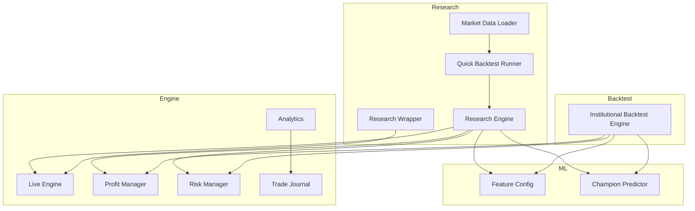
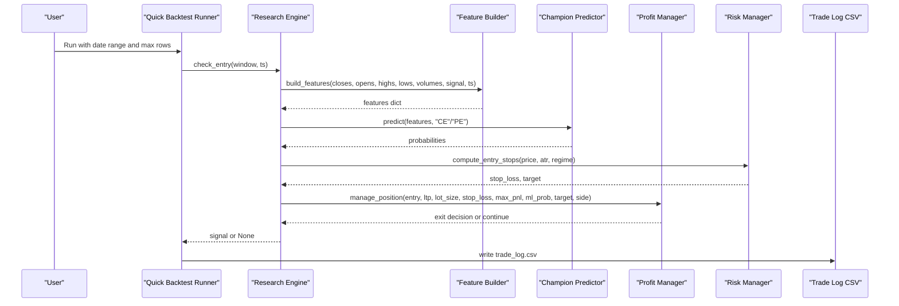
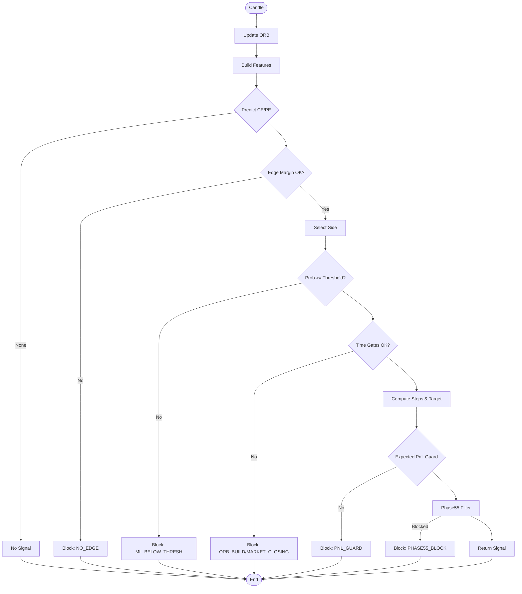
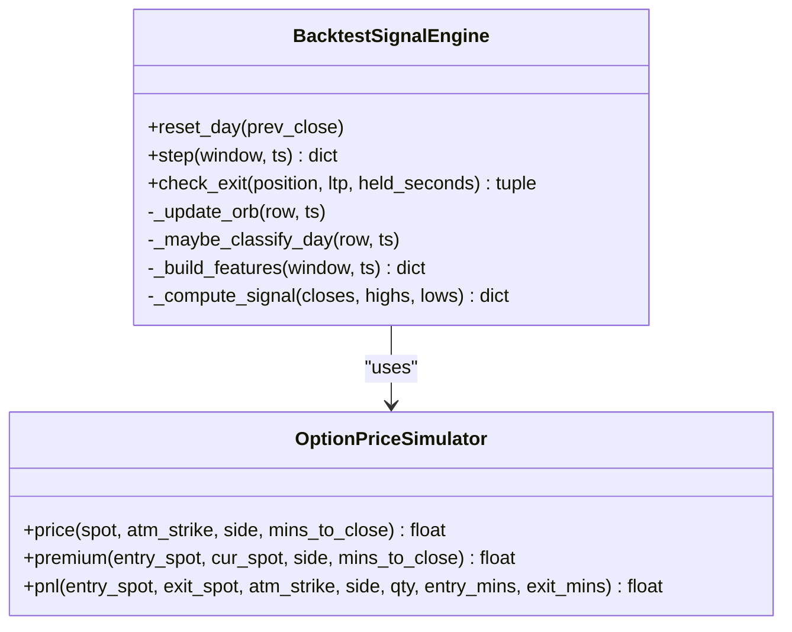
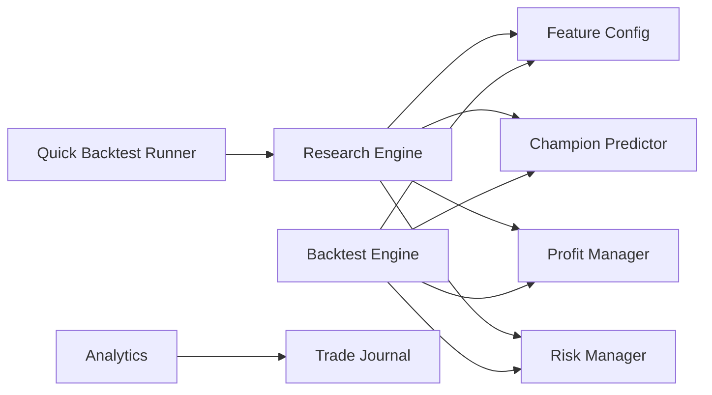

# Strategy Development Tools

<cite>
**Referenced Files in This Document**
- [run_quick_backtest.py](file://research/backtest/run_quick_backtest.py)
- [research_engine.py](file://research/backtest/engine/research_engine.py)
- [market_data.py](file://research/backtest/data/market_data.py)
- [backtest_engine.py](file://backtest/backtest_engine.py)
- [performance.py](file://engine/analytics/performance.py)
- [trade_journal.py](file://engine/diagnostics/trade_journal.py)
- [feature_config.py](file://ml/feature_config.py)
- [predictor_champion.py](file://ml/predictor_champion.py)
- [live_engine.py](file://engine/live_engine.py)
- [wrapper.py](file://research/backtest/wrapper.py)
</cite>

## Table of Contents
1. Introduction
2. Project Structure
3. Core Components
4. Architecture Overview
5. Detailed Component Analysis
6. Dependency Analysis
7. Performance Considerations
8. Troubleshooting Guide
9. Conclusion
10. Appendices

## Introduction
This document explains the strategy development tools that accelerate iterative testing and validation of trading ideas. It covers:
- A quick backtesting utility for rapid prototyping without full production setup
- A market data handling system providing clean, normalized historical data for research
- Result analysis tools that process trade logs, generate performance reports, and visualize metrics
- The end-to-end development workflow from idea to validated strategy (data prep, feature engineering, model training, backtesting)
- Practical examples for developing strategies, integrating custom indicators, and optimizing parameters
- Reporting capabilities for performance, risk, and regime behavior
- Best practices to avoid overfitting, ensure robustness across regimes, and maintain code quality

## Project Structure
The repository is organized into layered modules:
- Research backtesting utilities and wrappers under research/backtest
- Institutional-grade backtest engine under backtest
- Live trading engine and shared components under engine
- Machine learning features, predictors, and learners under ml
- Analytics and diagnostics under engine/analytics and engine/diagnostics

**Diagram sources**
- [run_quick_backtest.py:1-138](file://research/backtest/run_quick_backtest.py#L1-L138)
- [research_engine.py:1-578](file://research/backtest/engine/research_engine.py#L1-L578)
- [market_data.py:1-99](file://research/backtest/data/market_data.py#L1-L99)
- [backtest_engine.py:1-800](file://backtest/backtest_engine.py#L1-L800)
- [feature_config.py:1-267](file://ml/feature_config.py#L1-L267)
- [predictor_champion.py:1-218](file://ml/predictor_champion.py#L1-L218)
- [live_engine.py:1-200](file://engine/live_engine.py#L1-L200)
- [performance.py:1-487](file://engine/analytics/performance.py#L1-L487)
- [trade_journal.py:1-508](file://engine/diagnostics/trade_journal.py#L1-L508)

**Section sources**
- [run_quick_backtest.py:1-138](file://research/backtest/run_quick_backtest.py#L1-L138)
- [research_engine.py:1-578](file://research/backtest/engine/research_engine.py#L1-L578)
- [market_data.py:1-99](file://research/backtest/data/market_data.py#L1-L99)
- [backtest_engine.py:1-800](file://backtest/backtest_engine.py#L1-L800)
- [feature_config.py:1-267](file://ml/feature_config.py#L1-L267)
- [predictor_champion.py:1-218](file://ml/predictor_champion.py#L1-L218)
- [live_engine.py:1-200](file://engine/live_engine.py#L1-L200)
- [performance.py:1-487](file://engine/analytics/performance.py#L1-L487)
- [trade_journal.py:1-508](file://engine/diagnostics/trade_journal.py#L1-L508)

## Core Components
- Quick backtester: a minimal script to load CSV data, run a rolling window through the research engine, and write a trade log for fast iteration.
- Research engine: mirrors live decision logic (entry/exit, ML thresholds, ORB, risk stops) without modifying production code.
- Market data loader: loads and validates OHLCV data with date filtering and integrity checks.
- Institutional backtest engine: advanced backtesting with option price simulation, session filters, direction bias gates, and telemetry.
- Feature pipeline: canonical 36-feature set used consistently across training, backtesting, and live systems.
- ML predictor: loads champion models, ensembles optional CatBoost, and returns calibrated probabilities.
- Analytics suite: EOD reviews, regime breakdowns, ML signal quality by probability buckets, drift monitoring, setup analytics, and equity curve stats.
- Trade journal: passive observability capturing entry snapshots, intra-trade ticks, exit classification, and shadow analysis.

**Section sources**
- [run_quick_backtest.py:1-138](file://research/backtest/run_quick_backtest.py#L1-L138)
- [research_engine.py:1-578](file://research/backtest/engine/research_engine.py#L1-L578)
- [market_data.py:1-99](file://research/backtest/data/market_data.py#L1-L99)
- [backtest_engine.py:1-800](file://backtest/backtest_engine.py#L1-L800)
- [feature_config.py:1-267](file://ml/feature_config.py#L1-L267)
- [predictor_champion.py:1-218](file://ml/predictor_champion.py#L1-L218)
- [performance.py:1-487](file://engine/analytics/performance.py#L1-L487)
- [trade_journal.py:1-508](file://engine/diagnostics/trade_journal.py#L1-L508)

## Architecture Overview
The development stack reuses live logic via dedicated research and backtest engines, ensuring parity between research and production.

**Diagram sources**
- [run_quick_backtest.py:61-138](file://research/backtest/run_quick_backtest.py#L61-L138)
- [research_engine.py:141-319](file://research/backtest/engine/research_engine.py#L141-L319)
- [feature_config.py:82-252](file://ml/feature_config.py#L82-L252)
- [predictor_champion.py:151-208](file://ml/predictor_champion.py#L151-L208)

## Detailed Component Analysis

### Quick Backtesting Utility
Purpose: Rapidly prototype and test hypotheses on historical CSV data without setting up the full production environment.

Key behaviors:
- Auto-detects candidate CSV files and loads them with datetime parsing
- Filters by start/end dates and limits rows for speed
- Iterates a rolling window and calls the research engine’s entry logic
- Computes gross/net PnL using cost model when available
- Writes a standardized trade log CSV for downstream analysis

Usage pattern:
- Place an OHLCV CSV under data/historical or research/backtest/data
- Run with arguments for date range and row limit
- Inspect generated trade_log.csv for quick feedback

**Section sources**
- [run_quick_backtest.py:22-138](file://research/backtest/run_quick_backtest.py#L22-L138)

### Research Engine
Purpose: Mirrors live decision-making exactly while staying read-only for research.

Core responsibilities:
- Session reset and ORB tracking
- Feature building using the same function as live
- Entry gating: edge margin, thresholds, time gates, risk stops, expected PnL guard, Phase55 filter
- Exit delegation to profit manager with time-based exits
- Trade record creation with MFE/MAE/giveback and regime tagging

**Diagram sources**
- [research_engine.py:123-319](file://research/backtest/engine/research_engine.py#L123-L319)

**Section sources**
- [research_engine.py:48-319](file://research/backtest/engine/research_engine.py#L48-L319)
- [research_engine.py:358-530](file://research/backtest/engine/research_engine.py#L358-L530)

### Market Data Handling System
Purpose: Provide clean, normalized historical data for research.

Capabilities:
- Load Bank Nifty 1-minute data from default or specified path
- Sort by date and validate OHLC relationships
- Filter by date range for targeted backtests

Best practices:
- Ensure consistent column names (date, open, high, low, close, volume)
- Validate data before feeding to engines to catch anomalies early

**Section sources**
- [market_data.py:13-99](file://research/backtest/data/market_data.py#L13-L99)

### Institutional Backtest Engine
Purpose: High-fidelity backtesting that reuses live logic and adds institutional safeguards.

Highlights:
- Option price simulator for realistic premium-space PnL
- Direction bias gate based on Supertrend + VWAP consensus
- Session filters (ORB, lunch chop, no-entry-after)
- Telemetry tracking raw signals, ML passes, blocks, executions
- Exit management via profit manager with early exits and time-based exits

**Diagram sources**
- [backtest_engine.py:118-189](file://backtest/backtest_engine.py#L118-L189)
- [backtest_engine.py:196-800](file://backtest/backtest_engine.py#L196-L800)

**Section sources**
- [backtest_engine.py:1-800](file://backtest/backtest_engine.py#L1-L800)

### Feature Pipeline
Purpose: Canonical feature set ensuring consistency across training, backtesting, and live trading.

Key elements:
- Direction stack: Supertrend direction/distance, VWAP bias, ADX, DI spread, EMA alignment, volume ratio
- Core indicators: EMAs, MACD, returns, volatility, RSI, ATR, trend strength
- Time/session features: hour, weekday, minutes since open/close, session flags
- Options-specific: time to expiry, moneyness
- Momentum/candle structure: momentum velocity, range compression, wick ratios, body efficiency, close position

Notes:
- All features are clipped/scaled to stable ranges
- Safe builder ensures missing keys are filled with defaults

**Section sources**
- [feature_config.py:25-64](file://ml/feature_config.py#L25-L64)
- [feature_config.py:82-252](file://ml/feature_config.py#L82-L252)
- [feature_config.py:255-267](file://ml/feature_config.py#L255-L267)

### ML Predictor
Purpose: Load champion models and return calibrated probabilities for CE/PE.

Behavior:
- Loads LightGBM models; optionally ensembles with CatBoost if both exist
- Validates required features and handles invalid values
- Returns probabilities in [0,1] and supports threshold checks

Integration:
- Used by research and backtest engines identically to live
- Learner adjusts thresholds dynamically based on intraday context

**Section sources**
- [predictor_champion.py:18-53](file://ml/predictor_champion.py#L18-L53)
- [predictor_champion.py:57-148](file://ml/predictor_champion.py#L57-L148)
- [predictor_champion.py:151-218](file://ml/predictor_champion.py#L151-L218)

### Live Engine Parity
Purpose: Production engine whose logic is mirrored in research/backtest to ensure parity.

Parity points:
- Feature builder uses the same function as live
- ORB logic uses actual market timestamps
- Day classifier integration at session start
- Intraday learner updates per candle
- Adaptive ML thresholds sourced from learner
- PE detection added alongside CE
- Exit logic delegates to profit manager

**Section sources**
- [live_engine.py:1-200](file://engine/live_engine.py#L1-L200)

### Research Wrapper
Purpose: Thin adapter around live engine for deterministic single-candle simulations useful in tests and golden cases.

Capabilities:
- Builds features via live engine if available
- Calls entry decision and overrides placeholders for test harnesses
- Simulates position lifecycle with deterministic exit conditions

**Section sources**
- [wrapper.py:7-214](file://research/backtest/wrapper.py#L7-L214)

## Dependency Analysis
High-level dependencies among core modules:

**Diagram sources**
- [run_quick_backtest.py:1-138](file://research/backtest/run_quick_backtest.py#L1-L138)
- [research_engine.py:1-578](file://research/backtest/engine/research_engine.py#L1-L578)
- [backtest_engine.py:1-800](file://backtest/backtest_engine.py#L1-L800)
- [performance.py:1-487](file://engine/analytics/performance.py#L1-L487)

**Section sources**
- [run_quick_backtest.py:1-138](file://research/backtest/run_quick_backtest.py#L1-L138)
- [research_engine.py:1-578](file://research/backtest/engine/research_engine.py#L1-L578)
- [backtest_engine.py:1-800](file://backtest/backtest_engine.py#L1-L800)
- [performance.py:1-487](file://engine/analytics/performance.py#L1-L487)

## Performance Considerations
- Use rolling windows sized appropriately for indicator warmup (e.g., 200 candles in research engine)
- Limit rows in quick backtests to accelerate iteration
- Avoid redundant computations by reusing shared feature builders and indicators
- Leverage session filters (ORB, lunch chop) to reduce noise and improve throughput
- Monitor telemetry in backtest engine to identify bottlenecks and signal drop-offs

[No sources needed since this section provides general guidance]

## Troubleshooting Guide
Common issues and resolutions:
- Missing historical CSV: ensure file exists under data/historical or research/backtest/data and contains a datetime-like column
- No signals during backtest: verify time gates (ORB window, no-entry-after), day type classification, and direction bias
- Zero ML predictions: check feature completeness and model availability; ensure feature order matches FEATURE_COLUMNS
- Unexpected blocks: inspect block reasons (NO_EDGE, ML_BELOW_THRESH, ORB_BUILD, MARKET_CLOSING, PNL_GUARD, PHASE55_BLOCK)
- Drift alerts: use drift monitor to detect degradation in win rate, expectancy, profit factor, capture ratio

Operational tips:
- Use analytics functions to generate EOD reviews, regime breakdowns, ML bucket analysis, and equity curve stats
- Review trade journal entries for loss classification and shadow analysis outcomes

**Section sources**
- [research_engine.py:205-319](file://research/backtest/engine/research_engine.py#L205-L319)
- [performance.py:143-487](file://engine/analytics/performance.py#L143-L487)
- [trade_journal.py:78-184](file://engine/diagnostics/trade_journal.py#L78-L184)

## Conclusion
The strategy development toolkit provides a cohesive, production-parity environment for rapid iteration:
- Quick backtesting enables fast hypothesis validation
- Clean data handling ensures reliable inputs
- Shared feature and ML pipelines guarantee consistency across research and live
- Robust backtesting adds institutional safeguards and telemetry
- Analytics and diagnostics deliver actionable insights into performance, risk, and regime behavior

Adopting best practices—avoiding overfitting, validating across regimes, and maintaining code quality—will help sustain robust strategies over time.

[No sources needed since this section summarizes without analyzing specific files]

## Appendices

### End-to-End Development Workflow
- Data preparation: load and validate OHLCV, filter by date range
- Feature engineering: rely on canonical feature builder; add custom indicators only if they integrate cleanly with the feature pipeline
- Model training: train champion models with aligned features; calibrate probabilities; store thresholds
- Backtesting: run research engine for quick loops; use institutional backtest for deeper validation with session filters and telemetry
- Validation: analyze results via analytics suite; review regime performance and drift; refine thresholds and filters

Practical examples:
- Developing new strategies: implement entry/exit logic mirroring live rules; test with quick backtest; iterate using analytics
- Integrating custom indicators: compute within feature builder; ensure clipping and scaling; validate feature presence in predictor
- Optimizing parameters: adjust ML floors, thresholds, and session filters; evaluate impact via regime breakdowns and drift monitors

Reporting capabilities:
- EOD review: daily summary including wins/losses, PnL, win rate, PF, expectancy, hold times, MFE/MAE, capture, highlights, top setups/exits, regime breakdown
- Regime performance: stratified metrics by TREND/RANGE/VOLATILE
- ML signal quality: performance by probability buckets
- Strategy drift: alerts on WR, expectancy, PF, capture across rolling windows
- Setup performance: ranking by total PnL
- Equity curve: drawdown, recovery, streaks, weekly/monthly rollups

Best practices:
- Avoid overfitting: use out-of-sample periods, walk-forward validation, and strict feature stability
- Ensure robustness: test across regimes and market conditions; enforce direction bias and session filters
- Maintain code quality: reuse shared components, keep feature order constant, and instrument with telemetry and journals

**Section sources**
- [market_data.py:13-99](file://research/backtest/data/market_data.py#L13-L99)
- [feature_config.py:82-252](file://ml/feature_config.py#L82-L252)
- [research_engine.py:358-530](file://research/backtest/engine/research_engine.py#L358-L530)
- [backtest_engine.py:196-800](file://backtest/backtest_engine.py#L196-L800)
- [performance.py:143-487](file://engine/analytics/performance.py#L143-L487)