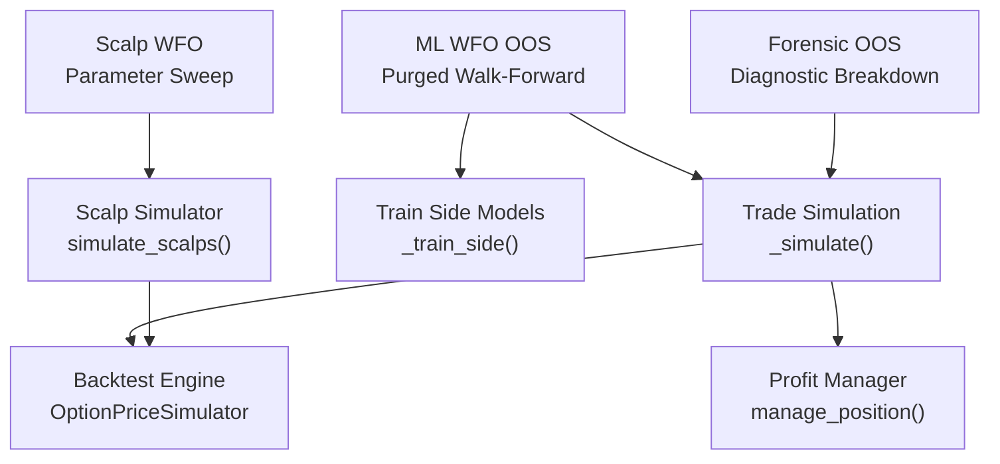
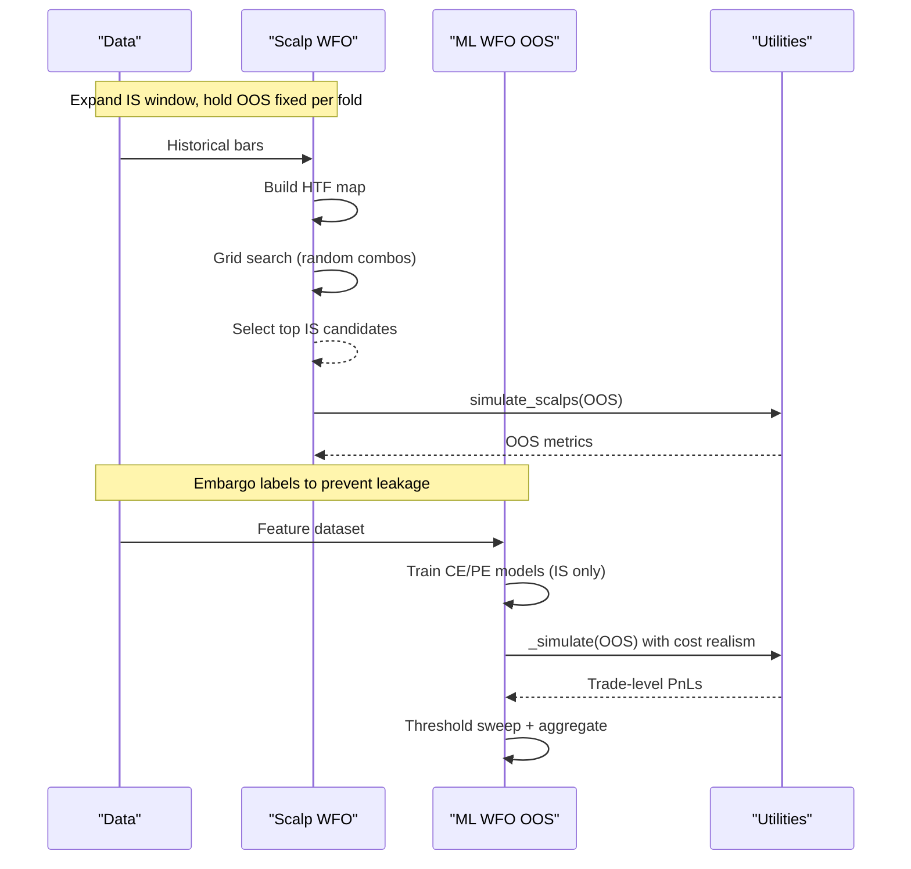
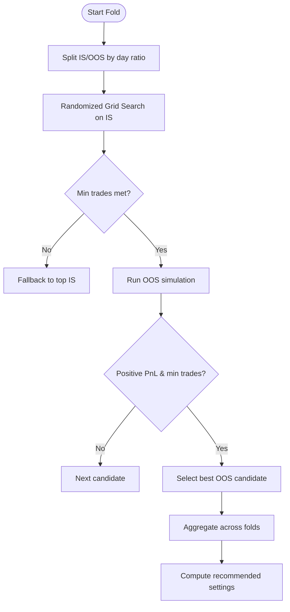
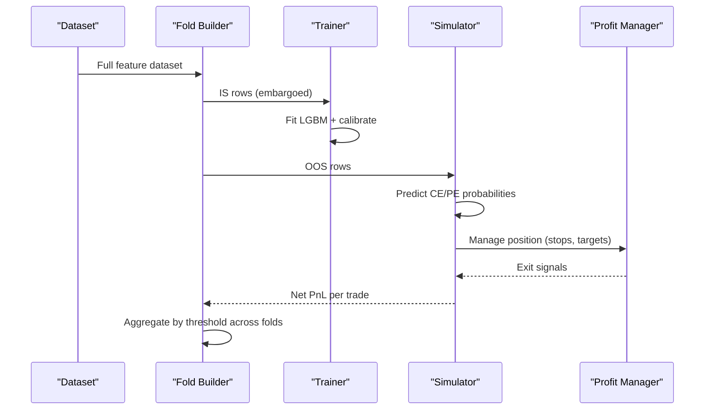
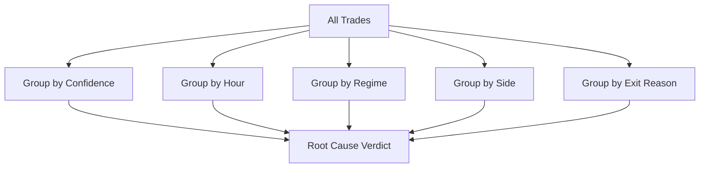
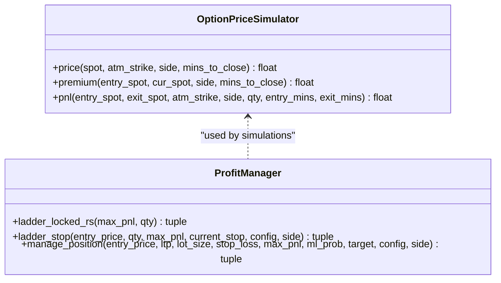

# Walk-Forward Optimization

<cite>
**Referenced Files in This Document**
- [scalp_wfo.py](file://backtest/scalp_wfo.py)
- [walkforward_oos.py](file://backtest/walkforward_oos.py)
- [forensic_oos.py](file://backtest/forensic_oos.py)
- [backtest_engine.py](file://backtest/backtest_engine.py)
- [profit_manager.py](file://engine/execution/profit_manager.py)
</cite>

## Table of Contents
1. Introduction
2. Project Structure
3. Core Components
4. Architecture Overview
5. Detailed Component Analysis
6. Dependency Analysis
7. Performance Considerations
8. Troubleshooting Guide
9. Conclusion
10. Appendices

## Introduction
This document explains the walk-forward optimization (WFO) framework used to robustly test parameters and validate out-of-sample (OOS) performance for both a high-frequency scalp strategy and an ML-driven intraday strategy. It covers:
- Rolling/expanding window design that prevents overfitting by training on historical data and testing forward
- Parameter grid search, evaluation metrics, and model selection criteria
- Scalp-specific routines tuned for short holding periods and option premium dynamics
- OOS validation with cost realism and trade-level PnL
- Practical setup examples, parameter ranges, and result interpretation
- Statistical significance considerations embedded in the code’s sample-size thresholds and fold-wise aggregation
- Common pitfalls such as curve fitting, parameter instability, and regime-dependent degradation

## Project Structure
The WFO system is implemented across three primary scripts plus shared backtesting utilities:
- Scalp WFO: fast parameter sweep for a momentum-based scalp strategy
- Purged WFO OOS: ML model retraining per fold with embargoed labels and trade-level simulation
- Forensic OOS: diagnostic breakdowns to identify why expectancy may be negative after costs
- Backtest engine and profit manager: shared signal generation, risk controls, and position management reused by simulations

**Diagram sources**
- [scalp_wfo.py:242-255](file://backtest/scalp_wfo.py#L242-L255)
- [walkforward_oos.py:81-94](file://backtest/walkforward_oos.py#L81-L94)
- [walkforward_oos.py:116-242](file://backtest/walkforward_oos.py#L116-L242)
- [forensic_oos.py:133-264](file://backtest/forensic_oos.py#L133-L264)
- [backtest_engine.py:118-186](file://backtest/backtest_engine.py#L118-L186)
- [profit_manager.py:173-225](file://engine/execution/profit_manager.py#L173-L225)

**Section sources**
- [scalp_wfo.py:1-405](file://backtest/scalp_wfo.py#L1-L405)
- [walkforward_oos.py:1-370](file://backtest/walkforward_oos.py#L1-L370)
- [forensic_oos.py:1-577](file://backtest/forensic_oos.py#L1-L577)
- [backtest_engine.py:1-800](file://backtest/backtest_engine.py#L1-L800)
- [profit_manager.py:1-225](file://engine/execution/profit_manager.py#L1-L225)

## Core Components
- Scalp WFO: Randomized grid search over risk and entry parameters; evaluates IS performance, selects top candidates, validates on OOS folds, aggregates results, and recommends stable settings.
- ML WFO OOS: Purged walk-forward where each fold trains directional models strictly before the test window with an embargo equal to label lookahead; simulates trades using live-like logic and conservative costs; reports per-bar AUC alongside trade-level expectancy to highlight inflation gaps.
- Forensic OOS: Reuses the same simulation but records rich metadata to diagnose root causes of negative expectancy (direction accuracy, option friction, exits, overtrading, regime mismatch, CE/PE asymmetry).
- Shared Utilities: Option price simulator and profit manager ensure consistent premium-space PnL and trailing stops across strategies.

Key responsibilities:
- Prevent look-ahead bias via embargoed training windows
- Enforce one-position-at-a-time semantics with cooldown and daily limits
- Use realistic option premium pricing and round-trip costs
- Aggregate across folds to avoid lucky-fold artifacts
- Provide diagnostics to isolate failure modes

**Section sources**
- [scalp_wfo.py:242-255](file://backtest/scalp_wfo.py#L242-L255)
- [walkforward_oos.py:265-365](file://backtest/walkforward_oos.py#L265-L365)
- [forensic_oos.py:295-577](file://backtest/forensic_oos.py#L295-L577)
- [backtest_engine.py:118-186](file://backtest/backtest_engine.py#L118-L186)
- [profit_manager.py:173-225](file://engine/execution/profit_manager.py#L173-L225)

## Architecture Overview
The WFO pipeline consists of two parallel tracks:

1) Scalp Strategy WFO
- Data preparation and HTF map construction
- Fold creation (expanding IS, fixed OOS)
- Randomized grid search on IS
- Top candidate selection based on IS quality and minimum trade count
- OOS validation per candidate
- Aggregation and recommended settings

2) ML Strategy WFO
- Purged train/test split per fold with embargo
- Train CE/PE models on IS only
- Simulate trades on OOS using predict-first logic, HTF confirmation, VWAP filter, and cost-aware exits
- Threshold sweep to find deployment-ready confidence threshold
- Aggregate metrics across folds with sample-size guardrails

**Diagram sources**
- [scalp_wfo.py:257-332](file://backtest/scalp_wfo.py#L257-L332)
- [walkforward_oos.py:265-365](file://backtest/walkforward_oos.py#L265-L365)
- [backtest_engine.py:118-186](file://backtest/backtest_engine.py#L118-L186)

## Detailed Component Analysis

### Scalp WFO: Rolling Window and Parameter Optimization
- Rolling/expanding window: The script splits days into folds, uses the first 70% of fold days as IS and the remainder as OOS, then repeats across multiple folds.
- Parameter grid: A randomized grid search samples combinations from predefined ranges for cooldown, trail start/distance, exhaustion cap, daily trade limit, and consecutive loss circuit breaker.
- Evaluation metrics: Trade count, win rate, total PnL, average PnL/trade, profit factor, max drawdown, Sharpe, final equity.
- Model selection: Top IS candidates are filtered by minimum trade count; OOS validation picks the best by positive PnL and highest average PnL/trade among valid OOS results.
- Recommendation: Frequency analysis of profitable OOS folds yields recommended settings; full-dataset validation compares against legacy and safe baselines.

**Diagram sources**
- [scalp_wfo.py:242-255](file://backtest/scalp_wfo.py#L242-L255)
- [scalp_wfo.py:292-332](file://backtest/scalp_wfo.py#L292-L332)
- [scalp_wfo.py:334-400](file://backtest/scalp_wfo.py#L334-L400)

**Section sources**
- [scalp_wfo.py:27-42](file://backtest/scalp_wfo.py#L27-L42)
- [scalp_wfo.py:227-255](file://backtest/scalp_wfo.py#L227-L255)
- [scalp_wfo.py:292-332](file://backtest/scalp_wfo.py#L292-L332)
- [scalp_wfo.py:334-400](file://backtest/scalp_wfo.py#L334-L400)

### ML WFO OOS: Purged Training and Trade-Level Validation
- Purged walk-forward: For each fold, training uses all rows strictly before the test start minus an embargo equal to the label lookahead to prevent forward-label leakage.
- Model training: Directional LightGBM classifiers trained on features; Platt calibration performed on a held-out portion of training data.
- Entry logic: Predict-first decision with edge margin, probability threshold, 5m SuperTrend confirmation, and VWAP tolerance; one position at a time with cooldown and daily limits.
- Exit logic: Realistic option premium pricing and cost-aware exits via manage_position; optional “matched” mode isolates model direction vs stop behavior.
- Threshold sweep: Multiple confidence thresholds evaluated; aggregate metrics computed across folds with a minimum trade floor to avoid noise-driven conclusions.

**Diagram sources**
- [walkforward_oos.py:81-94](file://backtest/walkforward_oos.py#L81-L94)
- [walkforward_oos.py:116-242](file://backtest/walkforward_oos.py#L116-L242)
- [profit_manager.py:173-225](file://engine/execution/profit_manager.py#L173-L225)

**Section sources**
- [walkforward_oos.py:265-365](file://backtest/walkforward_oos.py#L265-L365)
- [walkforward_oos.py:81-94](file://backtest/walkforward_oos.py#L81-L94)
- [walkforward_oos.py:116-242](file://backtest/walkforward_oos.py#L116-L242)

### Forensic OOS: Root Cause Diagnostics
- Records full trade metadata including side, ML probability, regime, hour bucket, exit reason, gross/net PnL, and label correctness.
- Groups and analyzes performance by confidence buckets, time of day, ORB state, regime, side, and exit reasons.
- Provides a verdict summarizing primary causes: direction accuracy, option friction, exit quality, overtrading, regime mismatch, CE/PE asymmetry.

**Diagram sources**
- [forensic_oos.py:285-293](file://backtest/forensic_oos.py#L285-L293)
- [forensic_oos.py:489-577](file://backtest/forensic_oos.py#L489-L577)

**Section sources**
- [forensic_oos.py:133-264](file://backtest/forensic_oos.py#L133-L264)
- [forensic_oos.py:295-577](file://backtest/forensic_oos.py#L295-L577)

### Shared Utilities: Option Pricing and Position Management
- OptionPriceSimulator: Approximates ATM option premium using time value and delta-weighted favorable moves; ensures side-correct PnL in premium space.
- Profit Manager: Centralized trailing ladder that tightens stops based on realized peak PnL, ensuring no lock below cost and protecting winners while avoiding premature exits due to noise.

**Diagram sources**
- [backtest_engine.py:118-186](file://backtest/backtest_engine.py#L118-L186)
- [profit_manager.py:75-170](file://engine/execution/profit_manager.py#L75-L170)
- [profit_manager.py:173-225](file://engine/execution/profit_manager.py#L173-L225)

**Section sources**
- [backtest_engine.py:118-186](file://backtest/backtest_engine.py#L118-L186)
- [profit_manager.py:75-170](file://engine/execution/profit_manager.py#L75-L170)
- [profit_manager.py:173-225](file://engine/execution/profit_manager.py#L173-L225)

## Dependency Analysis
- Scalp WFO depends on:
  - Data preprocessing and HTF map building
  - simulate_scalps for entry/exit logic and risk controls
  - compute_metrics for performance evaluation
  - Option price simulator for premium calculations
- ML WFO OOS depends on:
  - Feature columns and calibrated models
  - Purged training with embargo
  - Predict-first entry gates (edge margin, threshold, HTF, VWAP)
  - Profit manager for realistic exits
  - Cost modeling via round-trip spread and brokerage
- Forensic OOS extends ML WFO simulation to capture detailed metadata for diagnosis

Potential coupling risks:
- Tight coupling between feature set and model expectations
- Heavy reliance on correct embargo and label alignment
- Sensitivity to cost assumptions and spread estimates

External integrations:
- LightGBM for model training
- Pandas/Numpy for data manipulation
- Optional DayClassifier and VWAPAccumulator for additional filters

**Section sources**
- [scalp_wfo.py:242-255](file://backtest/scalp_wfo.py#L242-L255)
- [walkforward_oos.py:81-94](file://backtest/walkforward_oos.py#L81-L94)
- [walkforward_oos.py:116-242](file://backtest/walkforward_oos.py#L116-L242)
- [forensic_oos.py:133-264](file://backtest/forensic_oos.py#L133-L264)
- [backtest_engine.py:118-186](file://backtest/backtest_engine.py#L118-L186)
- [profit_manager.py:173-225](file://engine/execution/profit_manager.py#L173-L225)

## Performance Considerations
- Computational efficiency:
  - Scalp WFO uses randomized grid search capped at 500 combos per fold to reduce runtime while maintaining coverage.
  - ML WFO trains once per fold and re-simulates across thresholds cheaply.
- Memory usage:
  - Rolling buffers and deques keep memory bounded during simulation.
- I/O:
  - CSV-based datasets; consider chunking or parquet for very large histories.
- Numerical stability:
  - Small denominators guarded; AUC computation handles zero-positive cases.
- Cost realism:
  - Conservative spreads and brokerage ensure under-promising rather than over-promising results.

[No sources needed since this section provides general guidance]

## Troubleshooting Guide
Common issues and how the code helps diagnose them:
- Negative expectancy after costs:
  - Use Forensic OOS to identify whether direction accuracy, option friction, exits, overtrading, regime mismatch, or CE/PE asymmetry is the primary cause.
- Overfitting to IS:
  - Rely on purged WFO with embargoed training and fold-wise aggregation; require meaningful sample sizes across folds.
- Parameter instability:
  - Inspect frequency of recommended parameters across profitable OOS folds; prefer values appearing consistently.
- Regime-dependent degradation:
  - Analyze TREND vs RANGE expectancy; adjust entries or filters to avoid choppy regimes.
- Look-ahead bias:
  - Ensure embargo equals label lookahead; verify training cutoff precedes test start.

Actionable checks:
- Verify MIN_TRADES_VERDICT threshold is sufficient to avoid noise-driven decisions
- Confirm STOP_MODE=live for production-like exits; use matched mode for diagnostics
- Review cost assumptions (spread, brokerage) and adjust if broker differs
- Examine per-fold AUC vs trade-level expectancy to detect inflation gaps

**Section sources**
- [forensic_oos.py:489-577](file://backtest/forensic_oos.py#L489-L577)
- [walkforward_oos.py:265-365](file://backtest/walkforward_oos.py#L265-L365)

## Conclusion
The WFO framework combines rigorous rolling/expanding windows, purged training, realistic cost modeling, and trade-level validation to produce robust parameter recommendations and deployable thresholds. The scalp WFO offers fast, practical tuning for high-frequency strategies, while the ML WFO OOS ensures model generalization through embargoed training and multi-threshold evaluation. Forensic diagnostics provide actionable insights when performance falls short, helping isolate root causes and guide improvements.

[No sources needed since this section summarizes without analyzing specific files]

## Appendices

### Practical Setup Examples
- Scalp WFO:
  - Configure PARAM_GRID ranges for COOLDOWN, TRAIL_START_PTS, TRAIL_PTS, MAX_MOVE_PTS, MAX_TRADES_PER_DAY, MAX_CONSEC_LOSSES
  - Run main to generate fold-wise IS/OOS results and recommended settings
- ML WFO OOS:
  - Set environment variables for thresholds, spreads, and folds
  - Run main to train models per fold, simulate trades, and select best threshold with meaningful sample size

[No sources needed since this section provides general guidance]

### Interpreting Results
- Scalp WFO:
  - Prefer settings that yield positive OOS PnL across multiple folds and consistent parameter frequencies
  - Compare against legacy and safe baselines to confirm improvement
- ML WFO OOS:
  - Choose threshold with positive expectancy and sufficient trades across folds
  - Use per-bar AUC as a sanity check against inflated expectations

[No sources needed since this section provides general guidance]

### Statistical Significance Notes
- Sample-size guards:
  - Minimum trade floors (e.g., MIN_TRADES_VERDICT) help avoid noise-driven conclusions
  - Fold-wise aggregation reduces the chance that a single lucky fold drives decisions
- Per-bar AUC vs trade-level expectancy:
  - Discrepancies indicate potential inflation from overlapping or non-independent evaluations
- Diagnostic breakdowns:
  - Grouped analyses (confidence, regime, side) reveal whether observed effects are concentrated or widespread

[No sources needed since this section provides general guidance]