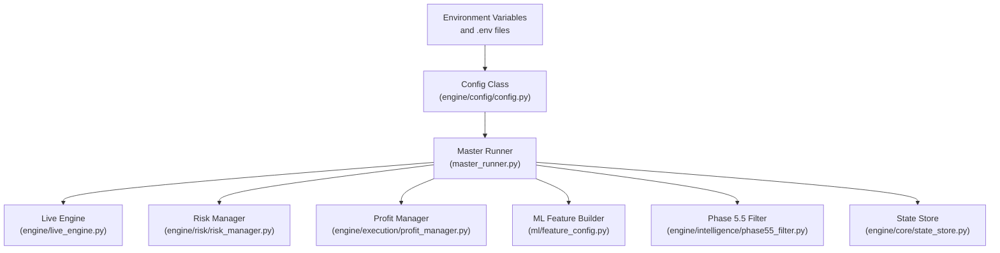
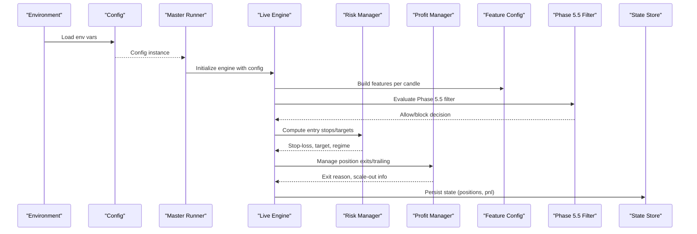
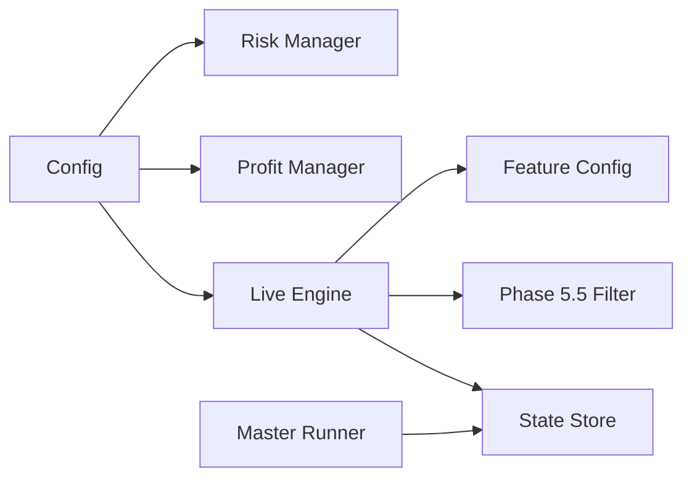

# Configuration and Customization

<cite>
**Referenced Files in This Document**
- [engine/config/config.py](file://engine/config/config.py)
- [ml/feature_config.py](file://ml/feature_config.py)
- [engine/intelligence/phase55_filter.py](file://engine/intelligence/phase55_filter.py)
- [master_runner.py](file://master_runner.py)
- [engine/core/state_store.py](file://engine/core/state_store.py)
- [SESSION_HANDOFF.md](file://SESSION_HANDOFF.md)
- [.github/workflows/trading_morning.yml](file://.github/workflows/trading_morning.yml)
- [.github/workflows/trading_afternoon.yml](file://.github/workflows/trading_afternoon.yml)
- [.github/workflows/trading_test.yml](file://.github/workflows/trading_test.yml)
- [scripts/supervisor.py](file://scripts/supervisor.py)
- [engine/risk/risk_manager.py](file://engine/risk/risk_manager.py)
- [engine/execution/profit_manager.py](file://engine/execution/profit_manager.py)
- [engine/live_engine.py](file://engine/live_engine.py)
</cite>

## Table of Contents
1. [Introduction](#introduction)
2. [Project Structure](#project-structure)
3. [Core Components](#core-components)
4. [Architecture Overview](#architecture-overview)
5. [Detailed Component Analysis](#detailed-component-analysis)
6. [Dependency Analysis](#dependency-analysis)
7. [Performance Considerations](#performance-considerations)
8. [Troubleshooting Guide](#troubleshooting-guide)
9. [Conclusion](#conclusion)
10. [Appendices](#appendices)

## Introduction
This document explains how to configure and customize the trading platform safely, focusing on:
- Centralized configuration via environment variables and runtime parameters
- Feature configuration framework for ML indicators and feature sets
- Intelligence filters (Phase 5.5) for market condition assessment and custom rules
- Environment-specific configurations for development, testing, and production
- Practical customization scenarios (risk parameters, strategy thresholds, market filters)
- Session handoff and persistence for long-running sessions
- Validation, defaults, migration practices, and safe modification without disrupting live operations

## Project Structure
The configuration system is centered around a single Config class that reads environment variables at startup. The ML feature set is defined in a dedicated module, while intelligence filters provide additional decision gates. Runtime state is persisted across restarts to support session handoff.

**Diagram sources**
- [engine/config/config.py:1-164](file://engine/config/config.py#L1-L164)
- [master_runner.py:1-200](file://master_runner.py#L1-L200)
- [engine/live_engine.py:1096-1125](file://engine/live_engine.py#L1096-L1125)
- [engine/risk/risk_manager.py:1-32](file://engine/risk/risk_manager.py#L1-L32)
- [engine/execution/profit_manager.py:125-204](file://engine/execution/profit_manager.py#L125-L204)
- [ml/feature_config.py:1-267](file://ml/feature_config.py#L1-L267)
- [engine/intelligence/phase55_filter.py:1-200](file://engine/intelligence/phase55_filter.py#L1-L200)
- [engine/core/state_store.py:1-94](file://engine/core/state_store.py#L1-L94)

**Section sources**
- [engine/config/config.py:1-164](file://engine/config/config.py#L1-L164)
- [master_runner.py:1-200](file://master_runner.py#L1-L200)

## Core Components
- Configuration management: Reads environment variables into a Config object with sensible defaults; used by risk, execution, and ML components.
- Feature configuration: Defines canonical feature columns and builds features from OHLCV data and precomputed signals for ML models.
- Intelligence filters: Phase 5.5 filter evaluates regime and confidence thresholds to block or allow trades based on market conditions.
- Session persistence: State store persists open positions and daily metrics atomically to survive process restarts.

Key responsibilities:
- Centralize all tunable parameters in one place to avoid scattered hard-coded values.
- Provide clear defaults so the system runs safely out-of-the-box.
- Allow environment-specific overrides via .env and CI workflows.
- Persist critical runtime state to ensure continuity across restarts.

**Section sources**
- [engine/config/config.py:1-164](file://engine/config/config.py#L1-L164)
- [ml/feature_config.py:1-267](file://ml/feature_config.py#L1-L267)
- [engine/intelligence/phase55_filter.py:1-200](file://engine/intelligence/phase55_filter.py#L1-L200)
- [engine/core/state_store.py:1-94](file://engine/core/state_store.py#L1-L94)

## Architecture Overview
The configuration flows from environment variables into the Config object, which is consumed by the master runner and downstream components. ML features are built per candle using the feature builder, and Phase 5.5 filters gate decisions based on regime and confidence. Risk and profit managers use configuration to compute stops, targets, and trailing logic. State persistence ensures continuity.

**Diagram sources**
- [engine/config/config.py:1-164](file://engine/config/config.py#L1-L164)
- [master_runner.py:1-200](file://master_runner.py#L1-L200)
- [engine/live_engine.py:1096-1125](file://engine/live_engine.py#L1096-L1125)
- [engine/risk/risk_manager.py:1-32](file://engine/risk/risk_manager.py#L1-L32)
- [engine/execution/profit_manager.py:125-204](file://engine/execution/profit_manager.py#L125-L204)
- [ml/feature_config.py:1-267](file://ml/feature_config.py#L1-L267)
- [engine/intelligence/phase55_filter.py:1-200](file://engine/intelligence/phase55_filter.py#L1-L200)
- [engine/core/state_store.py:1-94](file://engine/core/state_store.py#L1-L94)

## Detailed Component Analysis

### Configuration Management (engine/config/config.py)
- Purpose: Centralizes all tunable parameters via environment variables with robust defaults.
- Categories:
  - Modes: PAPER_MODE, DRY_RUN
  - Capital/Risk: INITIAL_CAPITAL, RISK_PER_TRADE, DAILY_LOSS_LIMIT, MAX_TRADES_PER_DAY
  - Costs: COST_PER_LOT
  - Filters: LUNCH_FILTER_ENABLED, REENTRY_COOLDOWN, SAME_SYMBOL_COOLDOWN
  - Regime/Warmup: WARMUP_MINUTES, SKIP_RANGE_REGIME
  - Execution: DEFAULT_SL_PCT, DEFAULT_TARGET_PCT, MAX_HOLD_SECONDS, LOT_SIZE
  - ML: CHAMPION_THRESHOLD
  - Entry Confirmation: INITIAL_SL_MULT, REQUIRE_VWAP_ALIGN, REQUIRE_5M_TREND, MAX_ENTRY_SLIP_PTS
  - Timing Gates: CONFIRMATION_WINDOW_SECONDS, BREAK_HOLD_SECONDS, MICRO_TREND_CANDLES, SPREAD_THRESHOLD_PTS, SLIPPAGE_THRESHOLD_PTS
  - Adaptive Thresholds: ADAPTIVE_THRESHOLD_INCREMENT_PER_LOSS, MICRO_TREND_ALIGNMENT_REQUIRED, SECOND_BRAIN_STRICTNESS_FACTOR
  - Trailing & Scale-Out: TRAIL_ACTIVATION_PTS, TRAIL_DISTANCE_PTS, SCALE_OUT_PCT, SCALE_OUT_PTS
  - Scalping: SCALP_ENABLED, multiple SL tiers, ATR multipliers, open volatility adjustments, momentum windows, exhaustion filters, no-life exit, cooldowns, HTF agreement, lots, ML min prob, consecutive loss circuit breaker
- Defaults: All parameters have explicit defaults to ensure safe operation when environment variables are missing.
- Usage: Consumed by risk manager, profit manager, live engine, and master runner to control behavior.

Practical examples:
- Adjust risk parameters: Set INITIAL_CAPITAL, RISK_PER_TRADE, DAILY_LOSS_LIMIT, MAX_TRADES_PER_DAY to tighten or loosen risk exposure.
- Modify strategy thresholds: Change CHAMPION_THRESHOLD, CONFIRMATION_WINDOW_SECONDS, BREAK_HOLD_SECONDS, MICRO_TREND_CANDLES to alter signal quality requirements.
- Add market filters: Enable LUNCH_FILTER_ENABLED, adjust WARMUP_MINUTES, SKIP_RANGE_REGIME to avoid low-quality periods.

Validation and safety:
- Boolean flags are derived from string comparisons ("1" == "1"), preventing accidental truthiness issues.
- Numeric parameters are cast to float/int with defaults, avoiding runtime errors.
- Logging prints key config values at startup for verification.

**Section sources**
- [engine/config/config.py:1-164](file://engine/config/config.py#L1-L164)

### Feature Configuration Framework (ml/feature_config.py)
- Purpose: Defines canonical feature columns and builds features consistently across training and live environments.
- Key elements:
  - FEATURE_COLUMNS: Ordered list of 36 features including direction stack (supertrend_dir, supertrend_dist, price_vs_vwap, adx, di_spread, ema_alignment, volume_ratio), core indicators (ema20, ema50, macd, returns, volatility, rsi, atr, trend_strength), time features (hour, weekday), short-term momentum (return_1, return_3), candle structure (candle_body_pct, range_break_strength), session context (mins_since_open, mins_to_close, session_open, session_close), options specifics (time_to_expiry_min, moneyness), reversal/momentum features (momentum_velocity, range_compression, wick_ratio, body_efficiency, mom3_strength, upper_wick, lower_wick, close_position).
  - build_live_features: Computes features from rolling OHLCV windows and precomputed signal dict; includes safeguards for insufficient data and normalizes ranges.
  - _safe_build_live_features: Wraps feature building with exception handling and ensures all expected keys exist.

Extensibility:
- To add new technical indicators:
  - Extend the signal dict computation upstream to include the indicator values.
  - Add the new feature to FEATURE_COLUMNS in consistent order.
  - Include computation in build_live_features with appropriate normalization and clipping.
  - Ensure both training and live pipelines produce identical feature values to maintain model compatibility.

Complexity considerations:
- Rolling computations use recent windows to match training behavior; ensure consistency in window sizes and calculations.
- Clipping and minimum thresholds prevent extreme values from destabilizing models.

**Section sources**
- [ml/feature_config.py:1-267](file://ml/feature_config.py#L1-L267)

### Intelligence Filters: Phase 5.5 (engine/intelligence/phase55_filter.py)
- Purpose: Apply validated decision filters to assess market regime and confidence before allowing trades.
- Configuration:
  - Phase55FilterConfig supports enabling/disabling CE/PE thresholds, regime filtering, and threshold tuning via attributes read from a config object.
  - Default thresholds are provided for CE quality and PE directional confidence.
- Evaluation:
  - infer_regime_from_features: Determines regime (volatile_trend, trend, range, mixed) based on ADX, DI spread, and volatility.
  - normalize_regime: Normalizes input regime strings to canonical forms.
  - evaluate_phase55_filter: Applies thresholds and regime checks; returns allow/block decision with reasons and applied filters.

Custom rule implementation:
- Add new filters by extending evaluate_phase55_filter with additional checks and updating Phase55FilterConfig to expose toggles/thresholds.
- Use the returned applied_filters list to log which rules were active for transparency.

Operational impact:
- Blocks trades when confidence or regime criteria are not met, reducing false entries during adverse conditions.
- Provides actionable recommendations and blocking reasons for diagnostics.

**Section sources**
- [engine/intelligence/phase55_filter.py:1-200](file://engine/intelligence/phase55_filter.py#L1-L200)

### Session Handoff and Persistence (engine/core/state_store.py)
- Purpose: Persist runtime state (open positions, daily metrics) atomically to survive process restarts and ensure no orphaned positions.
- Mechanism:
  - save_state: Writes a snapshot including session date, saved timestamp, PnL, trades today, positions, and serialized open/scalp positions using atomic tmp + os.replace.
  - load_state: Loads snapshot only if it matches the current trading day; ignores stale files to prevent cross-day leakage.
  - deserialize_position: Reconstructs position objects from saved snapshots, parsing timestamps back to datetime.

Session continuity:
- Master runner restores state at startup, resuming trading with existing positions and counters intact.
- Telegram notifier maintains persistent message IDs across restarts for consistent user interface.

Migration and safety:
- Atomic writes prevent partial reads during crashes.
- Day-based validation ensures state does not leak across sessions.

**Section sources**
- [engine/core/state_store.py:1-94](file://engine/core/state_store.py#L1-L94)
- [master_runner.py:746-774](file://master_runner.py#L746-L774)

### Environment-Specific Configurations
- Development/Test:
  - GitHub Actions workflows write .env files with environment-specific settings:
    - trading_morning.yml: Sets PAPER_MODE=0, DRY_RUN=1, TEST_MODE=0, INITIAL_CAPITAL=100000, CHAMPION_THRESHOLD=0.40.
    - trading_afternoon.yml: Similar to morning with ALLOW_BROKER_POSITION_ON_START=1.
    - trading_test.yml: Enables TEST_MODE=1 for test runs.
- Production:
  - SESSION_HANDOFF.md outlines operational procedures: refresh access tokens, start master_runner, verify connectivity, monitor trades, and enforce DRY_RUN until explicit instruction to go live.
  - scripts/supervisor.py manages process lifecycle and loads .env for Telegram integration.

Best practices:
- Keep secrets in CI secrets and inject into .env at runtime.
- Use DRY_RUN=1 for simulation; flip to real money only after thorough validation.
- Log startup version and config for auditability.

**Section sources**
- [.github/workflows/trading_morning.yml:53-84](file://.github/workflows/trading_morning.yml#L53-L84)
- [.github/workflows/trading_afternoon.yml:68-100](file://.github/workflows/trading_afternoon.yml#L68-L100)
- [.github/workflows/trading_test.yml:84-103](file://.github/workflows/trading_test.yml#L84-L103)
- [SESSION_HANDOFF.md:1-39](file://SESSION_HANDOFF.md#L1-L39)
- [scripts/supervisor.py:24-48](file://scripts/supervisor.py#L24-L48)

### Practical Customization Scenarios
- Adjusting risk parameters:
  - Increase DAILY_LOSS_LIMIT cautiously; reduce RISK_PER_TRADE to limit exposure per trade.
  - Tune MAX_TRADES_PER_DAY to control overtrading; adjust REENTRY_COOLDOWN to avoid rapid re-entries.
- Modifying strategy thresholds:
  - Raise CHAMPION_THRESHOLD to require higher ML confidence; adjust CONFIRMATION_WINDOW_SECONDS and BREAK_HOLD_SECONDS to refine entry timing.
  - Enable REQUIRE_VWAP_ALIGN and REQUIRE_5M_TREND to align entries with broader trends.
- Adding market filters:
  - Enable LUNCH_FILTER_ENABLED to avoid choppy midday sessions; adjust WARMUP_MINUTES to skip early noise.
  - Use Phase 5.5 filters to block trades in mixed regimes or low-confidence signals.

Safe modification guidelines:
- Always test changes in DRY_RUN mode first.
- Monitor logs and dashboards for unexpected behavior.
- Use small incremental changes and validate with historical backtests where applicable.

**Section sources**
- [engine/config/config.py:1-164](file://engine/config/config.py#L1-L164)
- [engine/intelligence/phase55_filter.py:1-200](file://engine/intelligence/phase55_filter.py#L1-L200)
- [SESSION_HANDOFF.md:1-39](file://SESSION_HANDOFF.md#L1-L39)

## Dependency Analysis
Configuration dependencies flow through the system:
- Config influences risk calculations (entry stops, targets) and profit management (trailing, scale-out).
- Live engine uses config to compute expected PnL and gate entries.
- Feature config provides inputs to ML models; Phase 5.5 filters depend on features and config thresholds.
- State store depends on master runner to persist and restore state.

**Diagram sources**
- [engine/config/config.py:1-164](file://engine/config/config.py#L1-L164)
- [engine/risk/risk_manager.py:1-32](file://engine/risk/risk_manager.py#L1-L32)
- [engine/execution/profit_manager.py:125-204](file://engine/execution/profit_manager.py#L125-L204)
- [engine/live_engine.py:1096-1125](file://engine/live_engine.py#L1096-L1125)
- [ml/feature_config.py:1-267](file://ml/feature_config.py#L1-L267)
- [engine/intelligence/phase55_filter.py:1-200](file://engine/intelligence/phase55_filter.py#L1-L200)
- [engine/core/state_store.py:1-94](file://engine/core/state_store.py#L1-L94)

**Section sources**
- [engine/config/config.py:1-164](file://engine/config/config.py#L1-L164)
- [engine/live_engine.py:1096-1125](file://engine/live_engine.py#L1096-L1125)

## Performance Considerations
- Feature computation uses rolling windows and numpy operations; ensure sufficient data length to avoid fallbacks.
- Clipping and minimum thresholds prevent numerical instability in ML inputs.
- Atomic state writes minimize I/O overhead and corruption risks.
- Phase 5.5 filtering adds minimal overhead but significantly improves trade quality by blocking low-confidence setups.

[No sources needed since this section provides general guidance]

## Troubleshooting Guide
Common issues and resolutions:
- Missing environment variables: Config falls back to defaults; verify .env and CI workflow settings.
- ML feature mismatch: Ensure FEATURE_COLUMNS order and computations match training pipeline; check build_live_features for correct window sizes.
- Phase 5.5 blocks too many trades: Adjust thresholds in Phase55FilterConfig or disable specific filters temporarily.
- State persistence failures: Check file permissions and disk space; logs will show warnings if saves fail.
- Daily loss limit hit: System stops trading; review risk parameters and market conditions.

Operational checks:
- Confirm DRY_RUN status and token validity before starting.
- Monitor logs for configuration printouts and error messages.
- Use supervisor script to manage process lifecycle and restarts.

**Section sources**
- [engine/config/config.py:1-164](file://engine/config/config.py#L1-L164)
- [ml/feature_config.py:1-267](file://ml/feature_config.py#L1-L267)
- [engine/intelligence/phase55_filter.py:1-200](file://engine/intelligence/phase55_filter.py#L1-L200)
- [engine/core/state_store.py:1-94](file://engine/core/state_store.py#L1-L94)
- [SESSION_HANDOFF.md:1-39](file://SESSION_HANDOFF.md#L1-L39)

## Conclusion
The trading platform’s configuration system centralizes tunable parameters, provides robust defaults, and supports environment-specific overrides. The ML feature framework ensures consistent feature computation, while Phase 5.5 filters enhance decision quality through regime and confidence checks. Session persistence guarantees continuity across restarts. By following the documented practices, users can safely customize risk, strategy, and filters without disrupting live operations.

[No sources needed since this section summarizes without analyzing specific files]

## Appendices

### Configuration Reference Summary
- Modes: PAPER_MODE, DRY_RUN, TEST_MODE
- Capital/Risk: INITIAL_CAPITAL, RISK_PER_TRADE, DAILY_LOSS_LIMIT, MAX_TRADES_PER_DAY
- Costs: COST_PER_LOT
- Filters: LUNCH_FILTER_ENABLED, REENTRY_COOLDOWN, SAME_SYMBOL_COOLDOWN
- Regime/Warmup: WARMUP_MINUTES, SKIP_RANGE_REGIME
- Execution: DEFAULT_SL_PCT, DEFAULT_TARGET_PCT, MAX_HOLD_SECONDS, LOT_SIZE
- ML: CHAMPION_THRESHOLD
- Entry Confirmation: INITIAL_SL_MULT, REQUIRE_VWAP_ALIGN, REQUIRE_5M_TREND, MAX_ENTRY_SLIP_PTS
- Timing Gates: CONFIRMATION_WINDOW_SECONDS, BREAK_HOLD_SECONDS, MICRO_TREND_CANDLES, SPREAD_THRESHOLD_PTS, SLIPPAGE_THRESHOLD_PTS
- Adaptive Thresholds: ADAPTIVE_THRESHOLD_INCREMENT_PER_LOSS, MICRO_TREND_ALIGNMENT_REQUIRED, SECOND_BRAIN_STRICTNESS_FACTOR
- Trailing & Scale-Out: TRAIL_ACTIVATION_PTS, TRAIL_DISTANCE_PTS, SCALE_OUT_PCT, SCALE_OUT_PTS
- Scalping: SCALP_ENABLED, SL tiers, ATR multipliers, momentum windows, exhaustion filters, cooldowns, HTF agreement, lots, ML min prob, consecutive loss circuit breaker

**Section sources**
- [engine/config/config.py:1-164](file://engine/config/config.py#L1-L164)

### Environment Setup Examples
- Development/Test: Use CI workflows to generate .env with appropriate flags.
- Production: Follow SESSION_HANDOFF.md for token refresh, startup, and monitoring.

**Section sources**
- [.github/workflows/trading_morning.yml:53-84](file://.github/workflows/trading_morning.yml#L53-L84)
- [.github/workflows/trading_afternoon.yml:68-100](file://.github/workflows/trading_afternoon.yml#L68-L100)
- [.github/workflows/trading_test.yml:84-103](file://.github/workflows/trading_test.yml#L84-L103)
- [SESSION_HANDOFF.md:1-39](file://SESSION_HANDOFF.md#L1-L39)