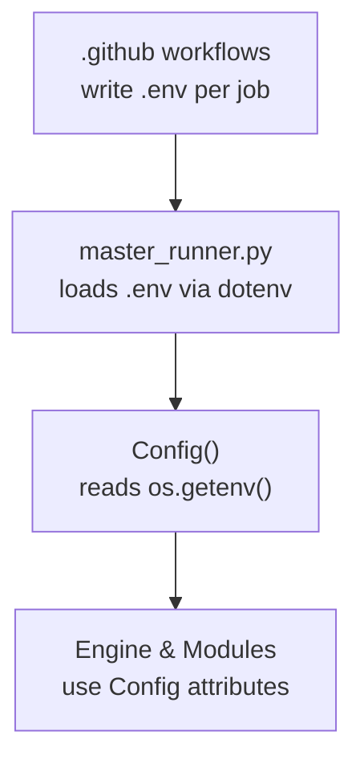
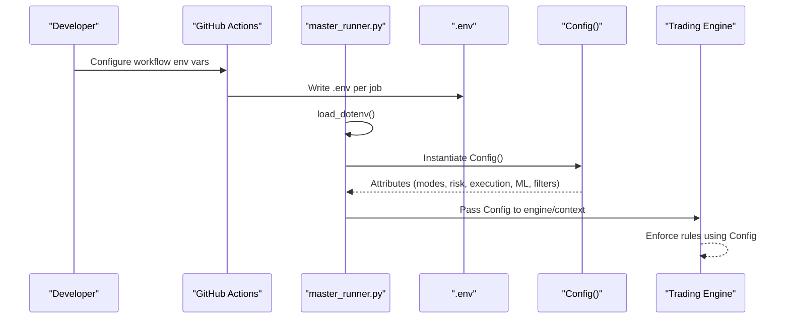
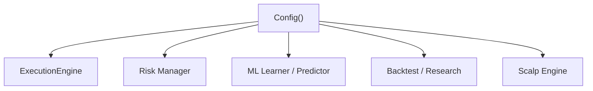

# Core Configuration Management

<cite>
**Referenced Files in This Document**
- [config.py](file://engine/config/config.py)
- [master_runner.py](file://master_runner.py)
- [trading_morning.yml](file://.github/workflows/trading_morning.yml)
- [trading_afternoon.yml](file://.github/workflows/trading_afternoon.yml)
- [parity_test.py](file://research/backtest/engine/parity_test.py)
</cite>

## Table of Contents
1. [Introduction](#introduction)
2. [Project Structure](#project-structure)
3. [Core Components](#core-components)
4. [Architecture Overview](#architecture-overview)
5. [Detailed Component Analysis](#detailed-component-analysis)
6. [Dependency Analysis](#dependency-analysis)
7. [Performance Considerations](#performance-considerations)
8. [Troubleshooting Guide](#troubleshooting-guide)
9. [Conclusion](#conclusion)
10. [Appendices](#appendices)

## Introduction
This document explains the core configuration management system implemented in engine/config/config.py. It details how environment variables are loaded, their defaults, and how they control risk, execution, ML thresholds, session filters, and trading modes (PAPER_MODE and DRY_RUN). It also provides practical guidance for common scenarios such as adjusting risk per account size, tuning strategy thresholds for different market conditions, and setting up environment-specific configurations for development, testing, and production deployments. Finally, it outlines safe migration procedures to update behavior without disrupting live operations.

## Project Structure
The configuration is centralized in a single class that reads values from the process environment at startup. The application’s entry point loads environment variables from a .env file before instantiating the configuration, ensuring consistent settings across components.

**Diagram sources**
- [master_runner.py:18-19](file://master_runner.py#L18-L19)
- [config.py:4-164](file://engine/config/config.py#L4-L164)
- [trading_morning.yml:76-84](file://.github/workflows/trading_morning.yml#L76-L84)
- [trading_afternoon.yml:91-100](file://.github/workflows/trading_afternoon.yml#L91-L100)

**Section sources**
- [master_runner.py:18-19](file://master_runner.py#L18-L19)
- [config.py:4-164](file://engine/config/config.py#L4-L164)

## Core Components
- Config class encapsulates all runtime parameters. It reads environment variables with explicit defaults and exposes them as attributes consumed by other modules.
- Environment loading: master_runner.py calls load_dotenv() early so that .env values are available when Config initializes.
- Mode flags: PAPER_MODE and DRY_RUN determine simulation vs. real execution behavior.
- Risk and capital controls: INITIAL_CAPITAL, RISK_PER_TRADE, DAILY_LOSS_LIMIT, MAX_TRADES_PER_DAY.
- Execution rules: DEFAULT_SL_PCT, DEFAULT_TARGET_PCT, MAX_HOLD_SECONDS, LOT_SIZE.
- ML gating: CHAMPION_THRESHOLD and related scalping ML thresholds.
- Session filters: WARMUP_MINUTES, SKIP_RANGE_REGIME.
- Entry confirmation and timing gates: multiple flags controlling VWAP alignment, trend alignment, spread/slippage thresholds, confirmation windows, and micro-trend checks.
- Trailing and scale-out: TRAIL_ACTIVATION_PTS, TRAIL_DISTANCE_PTS, SCALE_OUT_PCT, SCALE_OUT_PTS.
- Scalping layer: extensive controls for SL sizing, momentum, exhaustion, no-life exits, cooldowns, lot sizing, and circuit breakers.

**Section sources**
- [config.py:4-164](file://engine/config/config.py#L4-L164)

## Architecture Overview
Configuration flows from environment files into the running process and then into subsystems that enforce risk, execution, ML gating, and session logic.

**Diagram sources**
- [master_runner.py:18-19](file://master_runner.py#L18-L19)
- [config.py:4-164](file://engine/config/config.py#L4-L164)
- [trading_morning.yml:76-84](file://.github/workflows/trading_morning.yml#L76-L84)
- [trading_afternoon.yml:91-100](file://.github/workflows/trading_afternoon.yml#L91-L100)

## Detailed Component Analysis

### Environment Variables Reference
Below is a categorized reference of key environment variables defined in the configuration class, including purpose and default behavior. Use these to tune behavior safely.

- Modes
  - PAPER_MODE: Enables paper trading mode; default enabled.
  - DRY_RUN: Simulates orders without sending to broker; default enabled.

- Capital and Risk
  - INITIAL_CAPITAL: Starting equity used for sizing and limits; default numeric value.
  - RISK_PER_TRADE: Fraction of capital risked per trade; default small percentage.
  - DAILY_LOSS_LIMIT: Hard daily loss cap; default negative monetary value.
  - MAX_TRADES_PER_DAY: Global daily trade cap shared between strategies; default integer.

- Execution Rules
  - DEFAULT_SL_PCT: Default stop-loss percentage for entries; default small percentage.
  - DEFAULT_TARGET_PCT: Default target percentage for entries; default small percentage.
  - MAX_HOLD_SECONDS: Maximum hold time for positions; default seconds.
  - LOT_SIZE: Contract lot size used for quantity calculations; default integer.

- ML Settings
  - CHAMPION_THRESHOLD: Minimum ML probability threshold to accept signals; default float.
  - SCALP_ML_MIN_PROB: Minimum ML probability required for scalp entries; default float.

- Session Filters
  - WARMUP_MINUTES: Minutes after market open during which entries are blocked; default minutes.
  - SKIP_RANGE_REGIME: Skip trades on range regime days; default enabled.

- Entry Confirmation and Timing Gates
  - INITIAL_SL_MULT: Initial stop multiplier relative to ATR; default float.
  - REQUIRE_VWAP_ALIGN: Require price alignment with VWAP; default enabled.
  - REQUIRE_5M_TREND: Require 5-minute SuperTrend alignment; default enabled.
  - MAX_ENTRY_SLIP_PTS: Max allowed slippage at entry; default points.
  - CONFIRMATION_WINDOW_SECONDS: Wait time for entry confirmation; default seconds.
  - BREAK_HOLD_SECONDS: Hold time above breakout level; default seconds.
  - MICRO_TREND_CANDLES: Number of candles to check micro-trend alignment; default integer.
  - SPREAD_THRESHOLD_PTS: Skip entries if spread exceeds threshold; default points.
  - SLIPPAGE_THRESHOLD_PTS: Skip entries if slippage spike detected; default points.
  - ADAPTIVE_THRESHOLD_INCREMENT_PER_LOSS: Increase ML threshold after losses; default float.
  - MICRO_TREND_ALIGNMENT_REQUIRED: Require micro-trend alignment; default enabled.
  - SECOND_BRAIN_STRICTNESS_FACTOR: Multiply thresholds when ML probability drops; default float.

- Trailing and Scale-Out
  - TRAIL_ACTIVATION_PTS: Profit level to activate trailing; default points.
  - TRAIL_DISTANCE_PTS: Distance behind peak for trailing; default points.
  - SCALE_OUT_PCT: Percentage to scale out at profit; default fraction.
  - SCALE_OUT_PTS: Points to trigger scale-out; default points.

- Scalping Layer
  - SCALP_ENABLED: Enable/disable scalping; default enabled.
  - SCALP_SL_PTS / SCALP_SL_MED_PTS / SCALP_SL_WIDE_PTS: Fixed SL tiers; default points.
  - SCALP_ATR_SL_STRICT_MULT / SCALP_ATR_SL_MED_MULT / SCALP_ATR_SL_WIDE_MULT: ATR-based SL multipliers; default floats.
  - SCALP_OPEN_VOL_WINDOW_S / SCALP_OPEN_VOL_SL_MULT: Wider SL during first N seconds post-open; default seconds and multiplier.
  - SCALP_TARGET_PTS: Target for scalps (often disabled in favor of trailing); default points.
  - SCALP_MAX_HOLD_SECONDS: Max hold time for scalps; default seconds.
  - SCALP_MOMENTUM_WINDOW / SCALP_MOMENTUM_THRESHOLD: Momentum detection window and threshold; default seconds and points.
  - SCALP_CONFIRM_MIN_SAMPLES / SCALP_EXHAUST_TAIL_FRAC: Min samples and exhaustion tail fraction; default integers and fraction.
  - SCALP_NO_LIFE_SECONDS: Exit if no life within seconds; default seconds.
  - SCALP_COOLDOWN: Cooldown between scalp entries; default seconds.
  - SCALP_REQUIRE_HTF_AGREE: Require higher-timeframe agreement; default enabled.
  - SCALP_LOTS: Lots per scalp trade; default integer.
  - ML_INACTIVITY_MINUTES: Minutes of ML inactivity before stricter filters; default minutes.
  - SCALP_BE_PTS / SCALP_TRAIL_START_PTS / SCALP_TRAIL_PTS: Breakeven and trailing stages; default points.
  - SCALP_MIN_OPT_PTS: Minimum option price to consider; default points.
  - SCALP_MAX_MOVE_PTS: Cap on underlying move for scalp entries; default points.
  - SCALP_MAX_TRADES_PER_DAY: Daily scalp trade limit; default integer.
  - SCALP_MAX_CONSEC_LOSSES: Consecutive scalp loss circuit breaker; default integer.

Notes:
- Boolean-like flags are read as strings and converted to booleans by comparing against "1".
- Numeric fields are parsed to float or int with explicit defaults.

**Section sources**
- [config.py:4-164](file://engine/config/config.py#L4-L164)

### Configuration Loading Mechanism
- The entry point loads environment variables from a .env file using dotenv before any module imports that rely on environment values.
- The Config class reads each variable via os.getenv with explicit defaults, ensuring predictable behavior even if an environment variable is missing.
- GitHub Actions workflows write a .env file per job with environment-specific values, including mode flags and ML thresholds.

Practical implications:
- Always set PAPER_MODE and DRY_RUN explicitly in CI/CD to avoid unintended live trading.
- Ensure .env is present and correct before starting the runner; otherwise defaults apply.

**Section sources**
- [master_runner.py:18-19](file://master_runner.py#L18-L19)
- [config.py:4-164](file://engine/config/config.py#L4-L164)
- [trading_morning.yml:76-84](file://.github/workflows/trading_morning.yml#L76-L84)
- [trading_afternoon.yml:91-100](file://.github/workflows/trading_afternoon.yml#L91-L100)

### Validation Rules and Defaults
- Type safety: Each attribute is cast to the expected type (float/int/bool), preventing runtime type errors.
- Defaults: Conservative defaults are provided to keep the system safe out-of-the-box (e.g., DRY_RUN=1, PAPER_MODE=1).
- Invariants enforced elsewhere: Some invariants (like lot multiples) are validated in tests and downstream modules. For example, parity tests assert quantities must be multiples of the configured lot size.

Recommendations:
- Keep defaults unless you have evidence to change them.
- Validate new environment variables by adding corresponding checks in tests or guards in code paths that consume them.

**Section sources**
- [config.py:4-164](file://engine/config/config.py#L4-L164)
- [parity_test.py:83-109](file://research/backtest/engine/parity_test.py#L83-L109)

### Mode Switching: PAPER_MODE and DRY_RUN
- PAPER_MODE: When enabled, the system simulates trading without placing real orders. Useful for validation and backtesting integration.
- DRY_RUN: When enabled, order submission is simulated. Combined with PAPER_MODE, this ensures zero financial exposure during development and testing.

Operational guidance:
- In CI/CD jobs, both PAPER_MODE and DRY_RUN are set to ensure safe runs.
- Before enabling live trading, explicitly flip DRY_RUN to simulate real execution only after thorough validation.

**Section sources**
- [config.py:8-10](file://engine/config/config.py#L8-L10)
- [trading_morning.yml:76-77](file://.github/workflows/trading_morning.yml#L76-L77)
- [trading_afternoon.yml:91-92](file://.github/workflows/trading_afternoon.yml#L91-L92)

### Practical Configuration Scenarios

- Adjusting risk parameters for different account sizes
  - Smaller accounts: Lower RISK_PER_TRADE and tighten DAILY_LOSS_LIMIT to protect capital.
  - Larger accounts: Maintain conservative RISK_PER_TRADE but consider increasing DAILY_LOSS_LIMIT proportionally while keeping drawdown constraints.
  - Use MAX_TRADES_PER_DAY to cap overtrading regardless of account size.

- Modifying strategy thresholds for various market conditions
  - High volatility: Increase INITIAL_SL_MULT and widen SCALP_ATR_SL_*_MULT to avoid noise stops; increase CONFIRMATION_WINDOW_SECONDS and BREAK_HOLD_SECONDS to require stronger confirmation.
  - Low volatility: Tighten SPREAD_THRESHOLD_PTS and SLIPPAGE_THRESHOLD_PTS; reduce MICRO_TREND_CANDLES to react faster.
  - Range regimes: Keep SKIP_RANGE_REGIME enabled to avoid low-expectancy environments.

- Setting up environment-specific configurations
  - Development: PAPER_MODE=1, DRY_RUN=1, conservative thresholds, minimal lots.
  - Testing (CI): PAPER_MODE=0, DRY_RUN=1, fixed INITIAL_CAPITAL and CHAMPION_THRESHOLD for reproducibility.
  - Production: Explicitly set PAPER_MODE and DRY_RUN based on staged rollout; enable LUNCH_FILTER_ENABLED and other safety filters; monitor MAX_TRADES_PER_DAY and DAILY_LOSS_LIMIT closely.

- Example references
  - CI morning job sets PAPER_MODE=0, DRY_RUN=1, INITIAL_CAPITAL=100000, CHAMPION_THRESHOLD=0.40.
  - CI afternoon job mirrors morning settings and adds ALLOW_BROKER_POSITION_ON_START for resume behavior.

**Section sources**
- [config.py:12-50](file://engine/config/config.py#L12-L50)
- [config.py:53-163](file://engine/config/config.py#L53-L163)
- [trading_morning.yml:76-84](file://.github/workflows/trading_morning.yml#L76-L84)
- [trading_afternoon.yml:91-100](file://.github/workflows/trading_afternoon.yml#L91-L100)

### Migration Procedures and Best Practices
- Change one parameter at a time: Isolate changes to a single environment variable per deployment to identify impact quickly.
- Use staging: Deploy to a staging environment with DRY_RUN=1 and PAPER_MODE=1 to validate behavior.
- Monitor metrics: Track daily PnL, win rate, and drawdown; compare against baselines before flipping to live.
- Rollback plan: Keep previous .env values documented; revert immediately if anomalies appear.
- Audit logs: Review logs for configuration-related warnings or failures; ensure environment variables are correctly loaded.
- Tests: Add or update tests that assert invariants tied to configuration (e.g., lot multiples, thresholds).

[No sources needed since this section provides general guidance]

## Dependency Analysis
The configuration is consumed by multiple subsystems. Key dependencies include execution, risk, ML gating, and research/backtest utilities.

**Diagram sources**
- [config.py:4-164](file://engine/config/config.py#L4-L164)

**Section sources**
- [config.py:4-164](file://engine/config/config.py#L4-L164)

## Performance Considerations
- Overtrading guard: MAX_TRADES_PER_DAY prevents excessive costs; adjust conservatively.
- Re-entry cooldowns: REENTRY_COOLDOWN and SAME_SYMBOL_COOLDOWN reduce churn and adverse re-entries.
- Warmup block: WARMUP_MINUTES avoids noisy early-session entries.
- Spread/slippage thresholds: Tighten SPREAD_THRESHOLD_PTS and SLIPPAGE_THRESHOLD_PTS in illiquid conditions to avoid bad fills.
- Scalp SL sizing: Prefer ATR-relative multipliers (SCALP_ATR_SL_*_MULT) to adapt to volatility and reduce whipsaw exits.

[No sources needed since this section provides general guidance]

## Troubleshooting Guide
Common issues and resolutions:
- Missing environment variables: If a variable is not set, defaults apply. Verify .env contents and CI job outputs to ensure intended values are loaded.
- Unexpected mode behavior: Confirm PAPER_MODE and DRY_RUN values; CI jobs typically set DRY_RUN=1 to prevent live orders.
- Entry filters too strict: Reduce MICRO_TREND_CANDLES or lower CONFIRMATION_WINDOW_SECONDS cautiously; verify spread/slippage thresholds are appropriate for current liquidity.
- Excessive exits due to noise: Increase INITIAL_SL_MULT and SCALP_ATR_SL_*_MULT; extend BREAK_HOLD_SECONDS to confirm breakouts.
- Daily loss limit hit: Review DAILY_LOSS_LIMIT and RISK_PER_TRADE; consider reducing position sizing or tightening entry criteria.
- Scalp circuit breaker: If SCALP_MAX_CONSEC_LOSSES triggers frequently, reassess SCALP_MOMENTUM_THRESHOLD and SCALP_EXHAUST_TAIL_FRAC.

Validation tips:
- Check logs for configuration printout at startup to confirm loaded values.
- Use parity tests to assert invariants like lot multiples and signal validity.

**Section sources**
- [config.py:4-164](file://engine/config/config.py#L4-L164)
- [parity_test.py:83-109](file://research/backtest/engine/parity_test.py#L83-L109)

## Conclusion
The configuration system centralizes critical trading parameters in a single, well-defined class that reads from environment variables with safe defaults. By carefully tuning risk, execution, ML thresholds, and session filters—and by leveraging PAPER_MODE and DRY_RUN—you can safely iterate on strategy behavior across environments. Follow the migration best practices to update behavior incrementally, validate thoroughly, and maintain robust safeguards against overtrading and adverse market conditions.

[No sources needed since this section summarizes without analyzing specific files]

## Appendices

### Environment Variable Quick Reference Table
- Modes: PAPER_MODE, DRY_RUN
- Capital/Risk: INITIAL_CAPITAL, RISK_PER_TRADE, DAILY_LOSS_LIMIT, MAX_TRADES_PER_DAY
- Execution: DEFAULT_SL_PCT, DEFAULT_TARGET_PCT, MAX_HOLD_SECONDS, LOT_SIZE
- ML: CHAMPION_THRESHOLD, SCALP_ML_MIN_PROB
- Session: WARMUP_MINUTES, SKIP_RANGE_REGIME
- Entry Confirmation: INITIAL_SL_MULT, REQUIRE_VWAP_ALIGN, REQUIRE_5M_TREND, MAX_ENTRY_SLIP_PTS, CONFIRMATION_WINDOW_SECONDS, BREAK_HOLD_SECONDS, MICRO_TREND_CANDLES, SPREAD_THRESHOLD_PTS, SLIPPAGE_THRESHOLD_PTS, ADAPTIVE_THRESHOLD_INCREMENT_PER_LOSS, MICRO_TREND_ALIGNMENT_REQUIRED, SECOND_BRAIN_STRICTNESS_FACTOR
- Trailing/Scale-Out: TRAIL_ACTIVATION_PTS, TRAIL_DISTANCE_PTS, SCALE_OUT_PCT, SCALE_OUT_PTS
- Scalping: SCALP_ENABLED, SCALP_SL_PTS/MED/WIDE_PTS, SCALP_ATR_SL_*_MULT, SCALP_OPEN_VOL_WINDOW_S, SCALP_OPEN_VOL_SL_MULT, SCALP_TARGET_PTS, SCALP_MAX_HOLD_SECONDS, SCALP_MOMENTUM_WINDOW, SCALP_MOMENTUM_THRESHOLD, SCALP_CONFIRM_MIN_SAMPLES, SCALP_EXHAUST_TAIL_FRAC, SCALP_NO_LIFE_SECONDS, SCALP_COOLDOWN, SCALP_REQUIRE_HTF_AGREE, SCALP_LOTS, ML_INACTIVITY_MINUTES, SCALP_BE_PTS, SCALP_TRAIL_START_PTS, SCALP_TRAIL_PTS, SCALP_MIN_OPT_PTS, SCALP_MAX_MOVE_PTS, SCALP_MAX_TRADES_PER_DAY, SCALP_MAX_CONSEC_LOSSES

**Section sources**
- [config.py:4-164](file://engine/config/config.py#L4-L164)