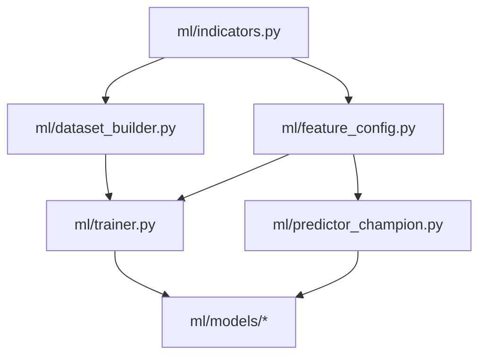
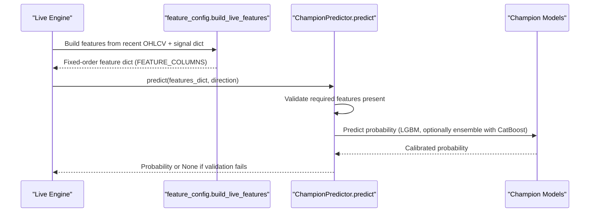
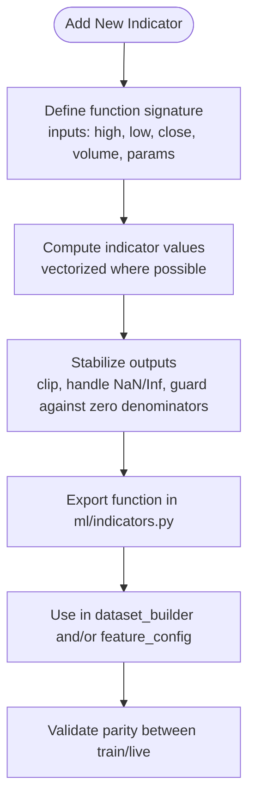
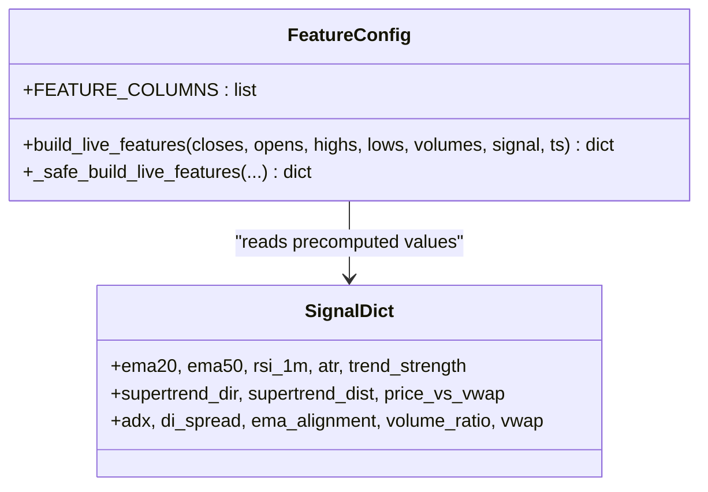
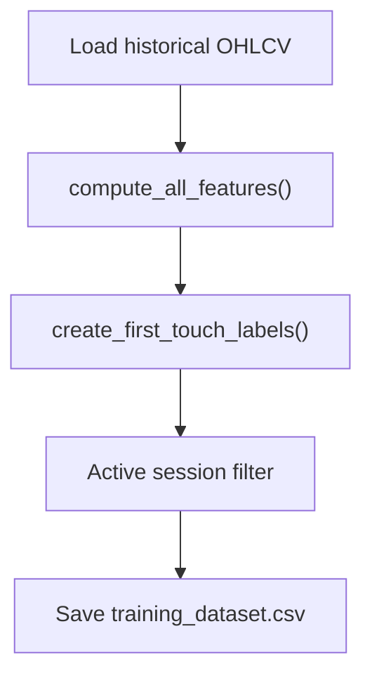
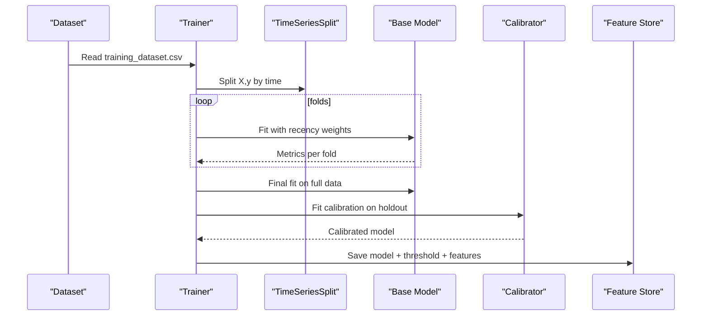
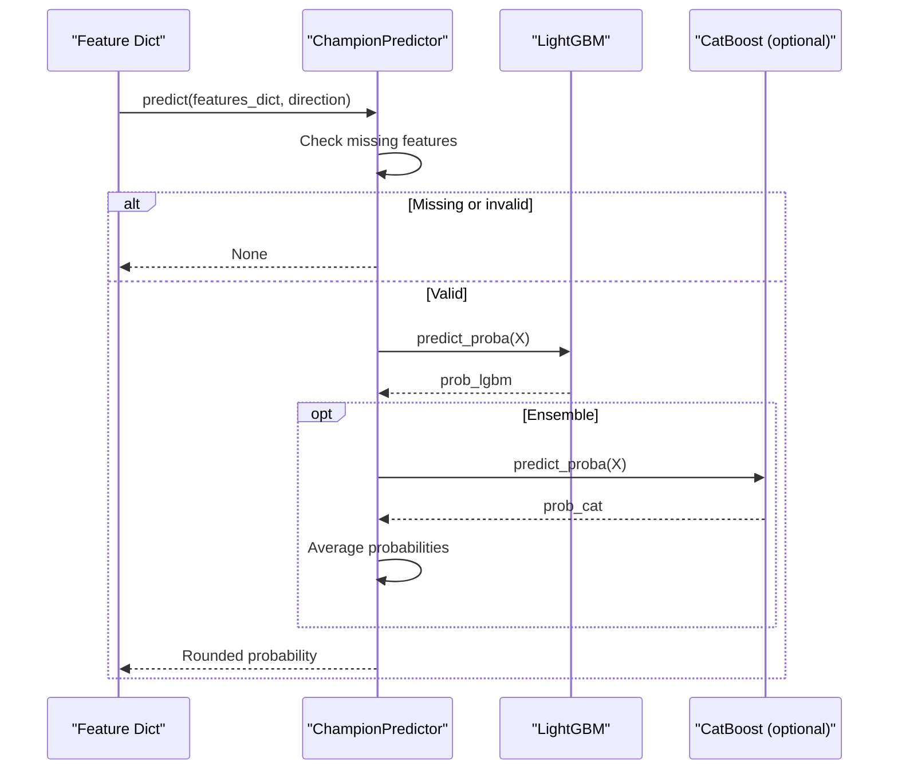
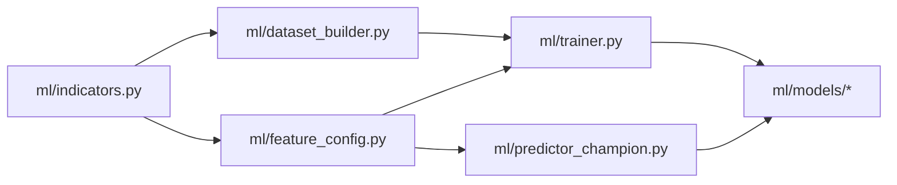

# Feature Customization Framework

<cite>
**Referenced Files in This Document**
- [indicators.py](file://ml/indicators.py)
- [feature_config.py](file://ml/feature_config.py)
- [dataset_builder.py](file://ml/dataset_builder.py)
- [trainer.py](file://ml/trainer.py)
- [predictor_champion.py](file://ml/predictor_champion.py)
</cite>

## Table of Contents
1. [Introduction](#introduction)
2. [Project Structure](#project-structure)
3. [Core Components](#core-components)
4. [Architecture Overview](#architecture-overview)
5. [Detailed Component Analysis](#detailed-component-analysis)
6. [Dependency Analysis](#dependency-analysis)
7. [Performance Considerations](#performance-considerations)
8. [Troubleshooting Guide](#troubleshooting-guide)
9. [Conclusion](#conclusion)
10. [Appendices](#appendices)

## Introduction
This document explains the feature customization framework that enables adding new technical indicators and modifying the machine learning feature set while maintaining backward compatibility with existing models. It covers:
- Extending the indicator library in ml/indicators.py
- Integrating new features into the ML pipeline via ml/feature_config.py
- Ensuring dataset parity between training and live inference
- Data normalization, lag creation, and cross-timeframe considerations
- Step-by-step guides for common custom indicators
- Validation, performance assessment, integration testing, versioning, retraining, and rollback strategies

## Project Structure
The ML subsystem is organized around a clear separation of concerns:
- Indicators: vectorized computations (numpy-based)
- Feature configuration: canonical feature order and live feature builder
- Dataset builder: historical feature computation and labeling
- Trainer: model training, calibration, deployment gate, and backups
- Predictor: champion model loading, feature validation, and prediction

**Diagram sources**
- [indicators.py:1-202](file://ml/indicators.py#L1-L202)
- [dataset_builder.py:84-176](file://ml/dataset_builder.py#L84-L176)
- [feature_config.py:25-64](file://ml/feature_config.py#L25-L64)
- [trainer.py:82-129](file://ml/trainer.py#L82-L129)
- [predictor_champion.py:57-147](file://ml/predictor_champion.py#L57-L147)

**Section sources**
- [indicators.py:1-202](file://ml/indicators.py#L1-L202)
- [feature_config.py:1-267](file://ml/feature_config.py#L1-L267)
- [dataset_builder.py:1-276](file://ml/dataset_builder.py#L1-L276)
- [trainer.py:1-287](file://ml/trainer.py#L1-L287)
- [predictor_champion.py:1-218](file://ml/predictor_champion.py#L1-L218)

## Core Components
- Indicator functions: pure numpy implementations with no side effects, enabling consistent computation across backtests and live systems.
- Feature builder: constructs a fixed-order feature vector used by both training and live inference to ensure parity.
- Dataset builder: computes all features on historical data and creates directional labels using first-touch barriers.
- Trainer: trains LightGBM and optional CatBoost models with time-series cross-validation, Platt calibration, deploy gates, and automatic backups.
- Predictor: loads champion models, validates features, handles missing or invalid values, and returns calibrated probabilities.

Key responsibilities and interactions are detailed in the next sections.

**Section sources**
- [indicators.py:12-202](file://ml/indicators.py#L12-L202)
- [feature_config.py:82-267](file://ml/feature_config.py#L82-L267)
- [dataset_builder.py:84-176](file://ml/dataset_builder.py#L84-L176)
- [trainer.py:82-176](file://ml/trainer.py#L82-L176)
- [predictor_champion.py:57-218](file://ml/predictor_champion.py#L57-L218)

## Architecture Overview
The end-to-end flow from raw OHLCV to model predictions:

**Diagram sources**
- [feature_config.py:82-267](file://ml/feature_config.py#L82-L267)
- [predictor_champion.py:151-208](file://ml/predictor_champion.py#L151-L208)

## Detailed Component Analysis

### Indicator Library Extension (ml/indicators.py)
- Design principles:
  - Pure numpy functions, no globals, no side effects
  - Vectorized where possible; loops only when necessary for stateful logic
  - Clear parameterization (e.g., periods, multipliers)
- Existing indicators include:
  - ATR (Wilder smoothing), Supertrend, ADX (+DI/-DI), VWAP (session reset), and an incremental VWAP accumulator for live use
- How to add a new indicator:
  - Implement a function that accepts OHLCV arrays and returns computed series
  - Keep parameters explicit and default values stable
  - Ensure numerical stability (e.g., avoid division by zero, clip outputs)
  - Add unit tests in your workflow to validate edge cases (short windows, zero volume)

**Diagram sources**
- [indicators.py:12-202](file://ml/indicators.py#L12-L202)

**Section sources**
- [indicators.py:12-202](file://ml/indicators.py#L12-L202)

### Feature Configuration and Integration (ml/feature_config.py)
- Canonical feature order:
  - FEATURE_COLUMNS defines the exact sequence used in training and live inference
  - Any change must be reflected consistently everywhere to maintain parity
- Live feature builder:
  - build_live_features constructs the same feature vector as training
  - Uses pre-computed signal dict for expensive indicators (e.g., EMA, RSI, ATR, Supertrend, VWAP, ADX)
  - Includes safeguards: minimum window checks, clipping, fallbacks for missing data
- Adding a new feature:
  - Append to FEATURE_COLUMNS
  - Compute in build_live_features with the same logic as dataset_builder
  - Ensure identical normalization, clipping, and handling of short histories

**Diagram sources**
- [feature_config.py:25-64](file://ml/feature_config.py#L25-L64)
- [feature_config.py:82-267](file://ml/feature_config.py#L82-L267)

**Section sources**
- [feature_config.py:25-64](file://ml/feature_config.py#L25-L64)
- [feature_config.py:82-267](file://ml/feature_config.py#L82-L267)

### Dataset Builder and Labeling (ml/dataset_builder.py)
- compute_all_features:
  - Computes all indicators and derived features on historical data
  - Mirrors live feature logic to ensure parity
  - Adds session context, momentum, candle structure, and options-specific features
- Labeling scheme:
  - First-touch barrier labels: label_ce=1 if price hits upper target before lower within LOOKAHEAD; label_pe=1 otherwise; flat if neither hit
  - Active session filtering ensures labels are created only during trading hours
- Cross-timeframe considerations:
  - Features are built on the input timeframe (e.g., 1-minute)
  - For cross-timeframe features, compute higher/lower timeframe aggregates and align timestamps before inclusion

**Diagram sources**
- [dataset_builder.py:84-176](file://ml/dataset_builder.py#L84-L176)
- [dataset_builder.py:185-233](file://ml/dataset_builder.py#L185-L233)

**Section sources**
- [dataset_builder.py:84-176](file://ml/dataset_builder.py#L84-L176)
- [dataset_builder.py:185-233](file://ml/dataset_builder.py#L185-L233)

### Training Pipeline and Deployment Gate (ml/trainer.py)
- Time-series cross-validation:
  - Uses TimeSeriesSplit to prevent leakage and simulate forward performance
- Calibration:
  - Platt scaling via CalibratedLGBM wrapper ensures well-calibrated probabilities
- Deploy gate:
  - Requires AUC threshold, probability spread (std), and positive expectancy
  - Backs up existing champions before overwriting
  - Writes feature list alongside models for traceability
- Retraining workflow:
  - After changing features, regenerate dataset and retrain
  - If gate fails, candidate models are saved without replacing champions

**Diagram sources**
- [trainer.py:82-129](file://ml/trainer.py#L82-L129)
- [trainer.py:179-203](file://ml/trainer.py#L179-L203)

**Section sources**
- [trainer.py:82-176](file://ml/trainer.py#L82-L176)
- [trainer.py:179-203](file://ml/trainer.py#L179-L203)

### Prediction and Feature Validation (ml/predictor_champion.py)
- Loads champion models and thresholds
- Validates required features exist and are valid (no NaN/Inf)
- Returns calibrated probability or None on validation failure
- Supports LGBM-only or LGBM+CatBoost ensemble mode

**Diagram sources**
- [predictor_champion.py:151-208](file://ml/predictor_champion.py#L151-L208)

**Section sources**
- [predictor_champion.py:57-218](file://ml/predictor_champion.py#L57-L218)

## Dependency Analysis
- Indicators are consumed by:
  - dataset_builder for historical feature computation
  - feature_config for live feature computation (via precomputed signals)
- Feature columns define the contract between dataset_builder, trainer, and predictor
- Trainer writes models and feature lists; predictor reads them to enforce parity

**Diagram sources**
- [indicators.py:1-202](file://ml/indicators.py#L1-L202)
- [dataset_builder.py:84-176](file://ml/dataset_builder.py#L84-L176)
- [feature_config.py:25-64](file://ml/feature_config.py#L25-L64)
- [trainer.py:82-129](file://ml/trainer.py#L82-L129)
- [predictor_champion.py:57-147](file://ml/predictor_champion.py#L57-L147)

**Section sources**
- [indicators.py:1-202](file://ml/indicators.py#L1-L202)
- [dataset_builder.py:84-176](file://ml/dataset_builder.py#L84-L176)
- [feature_config.py:25-64](file://ml/feature_config.py#L25-L64)
- [trainer.py:82-129](file://ml/trainer.py#L82-L129)
- [predictor_champion.py:57-147](file://ml/predictor_champion.py#L57-L147)

## Performance Considerations
- Prefer vectorized numpy operations in indicators to minimize overhead
- Reuse precomputed signals in live feature building to avoid recomputation
- Clip and normalize features to bounded ranges to improve model stability
- Use rolling windows carefully to avoid stale data and ensure alignment with training
- Monitor feature distributions in live vs training to detect drift early

[No sources needed since this section provides general guidance]

## Troubleshooting Guide
Common issues and resolutions:
- Missing features at prediction time:
  - The predictor will log warnings and return None; ensure build_live_features includes all required features
- Invalid feature values (NaN/Inf):
  - Predictor logs warnings and returns None; add guards in indicator and feature builder
- Zero or near-zero model probabilities:
  - Check calibration and thresholds; ensure feature scales match training
- Feature mismatch between train and live:
  - Verify FEATURE_COLUMNS order and computation parity between dataset_builder and feature_config

**Section sources**
- [predictor_champion.py:151-208](file://ml/predictor_champion.py#L151-L208)
- [feature_config.py:255-267](file://ml/feature_config.py#L255-L267)

## Conclusion
The framework provides a robust, extensible path to add new indicators and features while preserving model integrity through strict feature ordering, parity enforcement, and a deployment gate. By following the step-by-step guides below, you can safely introduce advanced moving averages, volatility measures, or sentiment indicators, validate them rigorously, and integrate them into production with confidence.

[No sources needed since this section summarizes without analyzing specific files]

## Appendices

### Step-by-Step: Add a Custom Indicator
1. Implement the indicator in ml/indicators.py as a pure numpy function with explicit parameters and numerical guards.
2. Add the indicator to dataset_builder.compute_all_features to compute it on historical data.
3. Add the indicator to feature_config.build_live_features to compute it in live inference using the same logic.
4. Append the new feature name to FEATURE_COLUMNS in ml/feature_config.py.
5. Regenerate the training dataset and retrain models using ml/trainer.py.
6. Validate parity by comparing feature distributions and model outputs between dataset_builder and live builds.

**Section sources**
- [indicators.py:12-202](file://ml/indicators.py#L12-L202)
- [dataset_builder.py:84-176](file://ml/dataset_builder.py#L84-L176)
- [feature_config.py:25-64](file://ml/feature_config.py#L25-L64)
- [feature_config.py:82-267](file://ml/feature_config.py#L82-L267)
- [trainer.py:82-176](file://ml/trainer.py#L82-L176)

### Step-by-Step: Advanced Moving Averages
- Example concepts:
  - Triple exponential moving average (TEMA)
  - Kaufman Adaptive Moving Average (KAMA)
  - Hull Moving Average (HMA)
- Implementation notes:
  - Provide period and smoothing parameters
  - Handle warm-up periods and initial values consistently
  - Clip outputs to reasonable bounds if needed

**Section sources**
- [indicators.py:12-202](file://ml/indicators.py#L12-L202)
- [dataset_builder.py:84-176](file://ml/dataset_builder.py#L84-L176)
- [feature_config.py:82-267](file://ml/feature_config.py#L82-L267)

### Step-by-Step: Volatility Measures
- Example concepts:
  - Realized volatility over rolling windows
  - Bollinger Band width or distance
  - ATR-based regime filters
- Implementation notes:
  - Use returns or price changes consistently with training
  - Normalize by scale (e.g., divide by close or ATR)
  - Guard against zero denominators and extreme outliers

**Section sources**
- [dataset_builder.py:128-136](file://ml/dataset_builder.py#L128-L136)
- [feature_config.py:123-148](file://ml/feature_config.py#L123-L148)

### Step-by-Step: Sentiment Indicators
- Example concepts:
  - Volume surge relative to recent average
  - Price momentum acceleration
  - Order flow proxies (if available)
- Implementation notes:
  - Align with session context and time-of-day effects
  - Ensure features are bounded and interpretable
  - Validate impact on model calibration and thresholds

**Section sources**
- [dataset_builder.py:134-176](file://ml/dataset_builder.py#L134-L176)
- [feature_config.py:157-200](file://ml/feature_config.py#L157-L200)

### Data Normalization, Lag Creation, and Cross-Timeframe Features
- Normalization:
  - Use percentage changes, ratios, or standardized z-scores consistently
  - Clip extreme values to reduce outlier influence
- Lag creation:
  - Create lags explicitly in dataset_builder and mirror in feature_config
  - Ensure alignment with timestamps and active sessions
- Cross-timeframe features:
  - Aggregate higher/lower timeframe data and align to current timestamp
  - Validate that aggregation windows match training setup

**Section sources**
- [dataset_builder.py:128-176](file://ml/dataset_builder.py#L128-L176)
- [feature_config.py:118-200](file://ml/feature_config.py#L118-L200)

### Feature Validation, Performance Assessment, and Integration Testing
- Validation:
  - Check for missing or invalid features in predictor; log and reject bad inputs
  - Compare feature distributions between dataset_builder and live builds
- Performance assessment:
  - Use time-series cross-validation metrics (AUC) and calibrated probability spread
  - Evaluate expectancy at selected thresholds
- Integration testing:
  - Run parity tests comparing research and live decisions
  - Simulate backtest runs with new features to confirm behavior

**Section sources**
- [predictor_champion.py:151-208](file://ml/predictor_champion.py#L151-L208)
- [trainer.py:82-129](file://ml/trainer.py#L82-L129)

### Feature Versioning, Model Retraining, and Rollback Strategies
- Versioning:
  - Maintain FEATURE_COLUMNS as the canonical feature schema
  - Write feature lists alongside models for traceability
- Retraining:
  - After feature changes, regenerate dataset and retrain
  - Use deploy gate to ensure quality before overwriting champions
- Rollback:
  - Trainer backs up existing champions before deployment
  - If gate fails, candidates are saved without replacing live models

**Section sources**
- [trainer.py:179-203](file://ml/trainer.py#L179-L203)
- [trainer.py:234-280](file://ml/trainer.py#L234-L280)