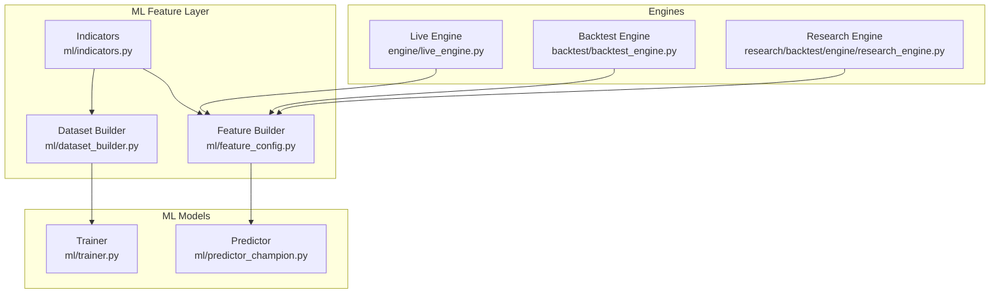
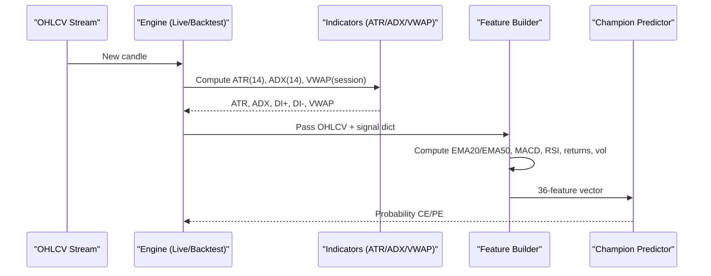
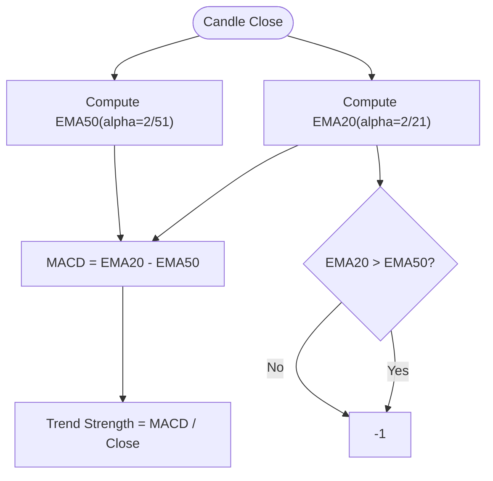
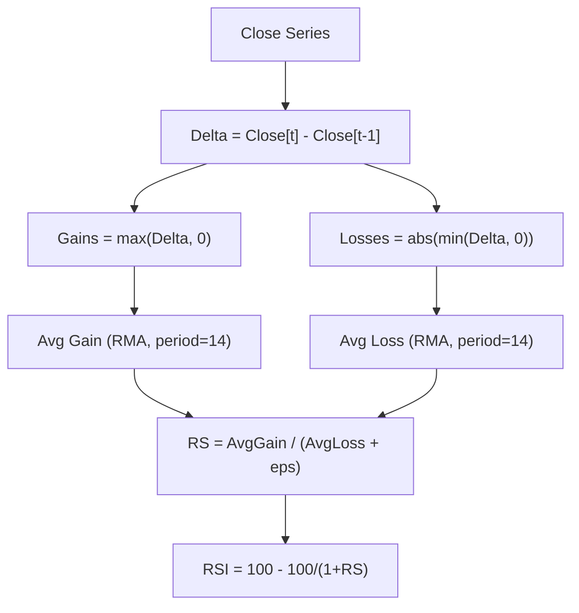
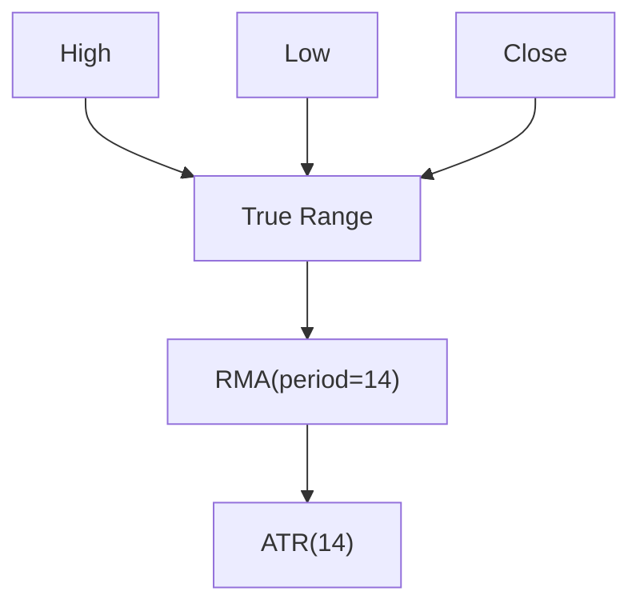
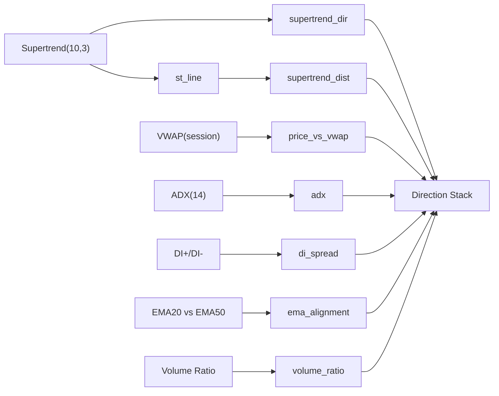
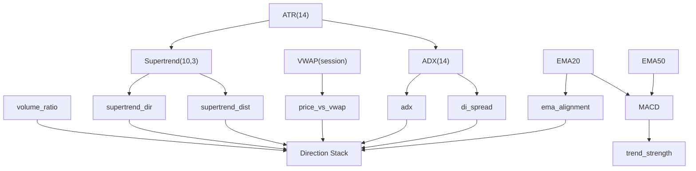

# Core Technical Indicators

<cite>
**Referenced Files in This Document**
- [indicators.py](file://ml/indicators.py)
- [feature_config.py](file://ml/feature_config.py)
- [dataset_builder.py](file://ml/dataset_builder.py)
- [predictor_champion.py](file://ml/predictor_champion.py)
- [trainer.py](file://ml/trainer.py)
- [live_engine.py](file://engine/live_engine.py)
- [backtest_engine.py](file://backtest/backtest_engine.py)
- [research_engine.py](file://research/backtest/engine/research_engine.py)
</cite>

## Table of Contents
1. Introduction
2. Project Structure
3. Core Components
4. Architecture Overview
5. Detailed Component Analysis
6. Dependency Analysis
7. Performance Considerations
8. Troubleshooting Guide
9. Conclusion
10. Appendices

## Introduction
This document explains the core technical indicators that form the ML input space for Bank Nifty/Nifty options trading. It focuses on EMA20 and EMA50 (trend identification), MACD (momentum via EMA spread), RSI (overbought/oversold), ATR (volatility measurement), and returns-based features (returns, return_1, return_3) for short-term momentum. It also documents rolling windows, normalization techniques, how these indicators interact with the “direction stack” features, and guidance for interpreting values in live trading contexts.

## Project Structure
The indicator logic is implemented as pure NumPy functions and integrated into both offline dataset creation and live/backtest feature pipelines:
- ml/indicators.py: Vectorized implementations of ATR, Supertrend, ADX, VWAP session accumulator.
- ml/dataset_builder.py: Batch computation of all 36 features used to train models.
- ml/feature_config.py: Live feature builder that mirrors training computations and normalizes outputs.
- engine/live_engine.py, backtest/backtest_engine.py, research/backtest/engine/research_engine.py: Real-time and backtest engines computing signals and feeding them into the same feature pipeline.
- ml/predictor_champion.py and ml/trainer.py: Consume the consistent 36-feature set for prediction and model training.

**Diagram sources**
- [feature_config.py:82-252](file://ml/feature_config.py#L82-L252)
- [dataset_builder.py:84-176](file://ml/dataset_builder.py#L84-L176)
- [indicators.py:12-169](file://ml/indicators.py#L12-L169)
- [live_engine.py:497-589](file://engine/live_engine.py#L497-L589)
- [backtest_engine.py:350-407](file://backtest/backtest_engine.py#L350-L407)
- [research_engine.py:172-201](file://research/backtest/engine/research_engine.py#L172-L201)
- [trainer.py:82-129](file://ml/trainer.py#L82-L129)
- [predictor_champion.py:151-208](file://ml/predictor_champion.py#L151-L208)

**Section sources**
- [feature_config.py:25-64](file://ml/feature_config.py#L25-L64)
- [dataset_builder.py:84-176](file://ml/dataset_builder.py#L84-L176)
- [indicators.py:12-169](file://ml/indicators.py#L12-L169)

## Core Components
- EMA20 and EMA50: Exponential moving averages computed with alpha = 2/(period+1). Used for trend alignment and as inputs to MACD and trend strength.
- MACD: Defined as ema20 - ema50; normalized by close into trend_strength for scale stability.
- RSI: Wilder-style 14-period RSI using smoothed gains/losses.
- ATR: Wilder’s True Range smoothed with RMA over 14 periods; used for volatility scaling and range breakout metrics.
- Returns-based features:
  - returns: last bar percent change.
  - return_1: alias of returns for consistency.
  - return_3: 3-bar percent change for short-term momentum.
- Direction stack (contextual filters): supertrend_dir, supertrend_dist, price_vs_vwap, adx, di_spread, ema_alignment, volume_ratio. These are not raw indicators but engineered features derived from indicators and price/volume context.

Key normalization and clipping applied across the pipeline:
- ATR lower-bounded to avoid division by zero.
- Volatility clipped to a reasonable range.
- Direction stack features clipped to bounded ranges to stabilize model inputs.
- Trend strength normalized by close to keep it unitless.

**Section sources**
- [dataset_builder.py:112-132](file://ml/dataset_builder.py#L112-L132)
- [feature_config.py:118-148](file://ml/feature_config.py#L118-L148)
- [feature_config.py:201-252](file://ml/feature_config.py#L201-L252)
- [indicators.py:24-34](file://ml/indicators.py#L24-L34)

## Architecture Overview
The system ensures identical indicator calculations in training and live environments to prevent data leakage and distribution shifts. The dataset builder computes all indicators once per historical bar; the live and backtest engines compute the same indicators on rolling windows and feed them into the same 36-feature vector consumed by the predictor.

**Diagram sources**
- [live_engine.py:497-589](file://engine/live_engine.py#L497-L589)
- [backtest_engine.py:350-407](file://backtest/backtest_engine.py#L350-L407)
- [research_engine.py:172-201](file://research/backtest/engine/research_engine.py#L172-L201)
- [feature_config.py:82-252](file://ml/feature_config.py#L82-L252)
- [indicators.py:24-169](file://ml/indicators.py#L24-L169)
- [predictor_champion.py:151-208](file://ml/predictor_champion.py#L151-L208)

## Detailed Component Analysis

### EMA20 and EMA50 (Trend Identification)
- Calculation: Exponential smoothing with alpha = 2/(period+1). EMA20 uses recent closes; EMA50 uses longer window.
- Usage:
  - macd = ema20 - ema50 (momentum proxy).
  - trend_strength = (ema20 - ema50) / close (normalized trend strength).
  - ema_alignment = +1 if EMA20 > EMA50 else -1 (used in direction stack).
- Rolling windows: EMA20 typically initialized over ~20 bars; EMA50 over ~50 bars. In live/backtest engines, EMAs are computed over the most recent usable window to ensure stable initialization.
- Normalization: trend_strength is normalized by close to remain scale-invariant across indices.

**Diagram sources**
- [dataset_builder.py:112-119](file://ml/dataset_builder.py#L112-L119)
- [feature_config.py:211-219](file://ml/feature_config.py#L211-L219)

**Section sources**
- [dataset_builder.py:112-119](file://ml/dataset_builder.py#L112-L119)
- [feature_config.py:211-219](file://ml/feature_config.py#L211-L219)

### MACD (Momentum via EMA Spread)
- Definition: macd = ema20 - ema50.
- Interpretation: Positive values indicate bullish momentum; negative indicates bearish momentum.
- Normalization: trend_strength = macd / close provides a dimensionless measure for model stability.
- Interaction with direction stack: Combined with ema_alignment and other trend filters to confirm regime before entries.

**Section sources**
- [dataset_builder.py:117-119](file://ml/dataset_builder.py#L117-L119)
- [feature_config.py:211-219](file://ml/feature_config.py#L211-L219)

### RSI (Overbought/Oversold)
- Calculation: 14-period RSI using Wilder smoothing of average gains and losses.
- Behavior: Values near 70 suggest overbought conditions; near 30 oversold.
- Use in model: Included as rsi feature; helps identify mean-reversion or continuation probabilities depending on regime.

**Diagram sources**
- [dataset_builder.py:55-72](file://ml/dataset_builder.py#L55-L72)

**Section sources**
- [dataset_builder.py:55-72](file://ml/dataset_builder.py#L55-L72)
- [feature_config.py:217-217](file://ml/feature_config.py#L217-L217)

### ATR (Volatility Measurement)
- Calculation: True Range per bar, then Wilder’s RMA over 14 periods.
- Purpose: Measures volatility; used to normalize range breakouts and wick features; also informs stop-loss sizing in other modules.
- Fallbacks: When insufficient history, ATR is approximated from recent price changes to avoid zeros.

**Diagram sources**
- [indicators.py:24-34](file://ml/indicators.py#L24-L34)

**Section sources**
- [indicators.py:24-34](file://ml/indicators.py#L24-L34)
- [feature_config.py:135-148](file://ml/feature_config.py#L135-L148)

### Returns-Based Features (Short-Term Momentum)
- returns: (close[-1] - close[-2]) / close[-2].
- return_1: Alias of returns for consistency.
- return_3: (close[-1] - close[-4]) / close[-4], capturing 3-bar momentum.
- Normalization: These are already percentage changes; they are kept as-is to preserve interpretability and model stability.

**Section sources**
- [feature_config.py:118-121](file://ml/feature_config.py#L118-L121)
- [dataset_builder.py:129-132](file://ml/dataset_builder.py#L129-L132)

### Direction Stack Features (Interaction with Indicators)
The direction stack aggregates multiple indicators to confirm trend and regime before considering entries:
- supertrend_dir: +1 (bullish) or -1 (bearish) from Supertrend(10,3).
- supertrend_dist: (close - st_line) / close, clipped to [-0.05, 0.05].
- price_vs_vwap: (close - vwap) / close, clipped to [-0.05, 0.05].
- adx: ADX(14), clipped to [0, 100]; higher values imply trending regimes.
- di_spread: DI+ - DI-, clipped to [-60, 60]; positive implies bullish pressure.
- ema_alignment: +1 if EMA20 > EMA50 else -1.
- volume_ratio: current volume / 20-bar average volume, clipped to [0, 10].

These features are combined by the model to learn high-probability entry points where multiple signals agree.

**Diagram sources**
- [indicators.py:41-90](file://ml/indicators.py#L41-L90)
- [indicators.py:97-129](file://ml/indicators.py#L97-L129)
- [indicators.py:136-169](file://ml/indicators.py#L136-L169)
- [dataset_builder.py:92-110](file://ml/dataset_builder.py#L92-L110)
- [feature_config.py:109-116](file://ml/feature_config.py#L109-L116)
- [feature_config.py:201-209](file://ml/feature_config.py#L201-L209)

**Section sources**
- [indicators.py:41-129](file://ml/indicators.py#L41-L129)
- [dataset_builder.py:92-110](file://ml/dataset_builder.py#L92-L110)
- [feature_config.py:109-116](file://ml/feature_config.py#L109-L116)
- [feature_config.py:201-209](file://ml/feature_config.py#L201-L209)

## Dependency Analysis
- Indicator dependencies:
  - Supertrend depends on ATR(14).
  - ADX depends on ATR(14) and directional movements.
  - VWAP depends on session resets and typical price.
- Feature dependencies:
  - MACD depends on EMA20 and EMA50.
  - trend_strength depends on MACD and close.
  - Direction stack depends on Supertrend, VWAP, ADX/DI, EMA alignment, and volume ratio.
- Model dependency:
  - Trainer consumes the same 36-feature columns used by live/backtest to ensure parity.
  - Predictor validates feature presence and rejects invalid inputs (NaN/Inf).

**Diagram sources**
- [indicators.py:24-34](file://ml/indicators.py#L24-L34)
- [indicators.py:41-90](file://ml/indicators.py#L41-L90)
- [indicators.py:97-129](file://ml/indicators.py#L97-L129)
- [dataset_builder.py:92-119](file://ml/dataset_builder.py#L92-L119)
- [feature_config.py:109-116](file://ml/feature_config.py#L109-L116)

**Section sources**
- [indicators.py:24-129](file://ml/indicators.py#L24-L129)
- [dataset_builder.py:92-119](file://ml/dataset_builder.py#L92-L119)
- [feature_config.py:109-116](file://ml/feature_config.py#L109-L116)

## Performance Considerations
- Vectorized NumPy operations minimize overhead in indicator calculations.
- Rolling windows are limited to recent histories in live/backtest engines to reduce memory usage and latency.
- Clipping and lower-bounding prevent extreme values that could destabilize models.
- VWAP session reset avoids cross-day contamination.
- Early exits when insufficient data (e.g., <25 candles) return neutral features to avoid noisy signals during warm-up.

[No sources needed since this section provides general guidance]

## Troubleshooting Guide
Common issues and resolutions:
- Missing or stale data:
  - If fewer than required bars exist (e.g., <25), features default to neutral values; ensure sufficient history before trading starts.
- Zero or negative denominators:
  - ATR lower-bounded to avoid division by zero; ensure ATR fallbacks are active.
- NaN/Inf in features:
  - Predictor rejects rows with invalid features; check for missing OHLCV or incorrect timestamps.
- Time mismatch:
  - Ensure timestamps align with market hours; using wall-clock time instead of candle timestamps can misalign session features.
- Volume anomalies:
  - For index spot data without volume, VWAP degrades gracefully to uniform weights; ensure volume handling matches expectations.

**Section sources**
- [feature_config.py:94-95](file://ml/feature_config.py#L94-L95)
- [feature_config.py:135-148](file://ml/feature_config.py#L135-L148)
- [predictor_champion.py:156-178](file://ml/predictor_champion.py#L156-L178)
- [indicators.py:136-169](file://ml/indicators.py#L136-L169)

## Conclusion
The indicator suite provides a robust, normalized foundation for ML-driven entry decisions in Bank Nifty/Nifty options trading. EMA20/EMA50 establish trend context; MACD captures momentum; RSI identifies extremes; ATR measures volatility; returns-based features capture short-term momentum. The direction stack integrates these signals to filter low-quality setups and focus on high-probability entries aligned with prevailing trends and regime conditions. Consistent calculation across training and live environments ensures reliable model performance.

[No sources needed since this section summarizes without analyzing specific files]

## Appendices

### Parameter Reference
- EMA20/EMA50: alpha = 2/(period+1); periods 20 and 50.
- RSI: period 14; Wilder smoothing.
- ATR: period 14; Wilder smoothing.
- MACD: ema20 - ema50; trend_strength = MACD / close.
- Returns: returns (1-bar), return_1 (alias), return_3 (3-bar).
- Direction stack:
  - Supertrend: period 10, multiplier 3.
  - VWAP: session reset daily.
  - ADX: period 14.
  - DI spread: DI+ - DI-.
  - EMA alignment: +1/-1 based on EMA20 vs EMA50.
  - Volume ratio: current vol / 20-bar avg vol.

**Section sources**
- [dataset_builder.py:112-132](file://ml/dataset_builder.py#L112-L132)
- [indicators.py:41-90](file://ml/indicators.py#L41-L90)
- [indicators.py:97-129](file://ml/indicators.py#L97-L129)
- [feature_config.py:109-116](file://ml/feature_config.py#L109-L116)
- [feature_config.py:201-209](file://ml/feature_config.py#L201-L209)