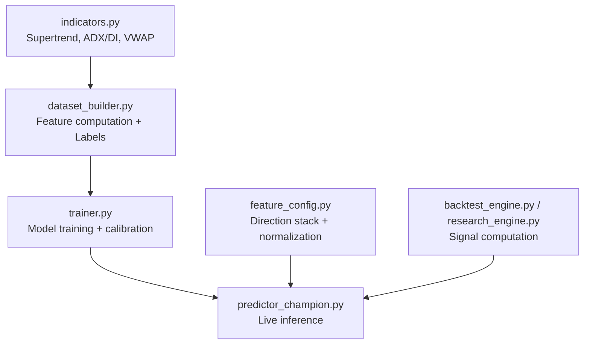
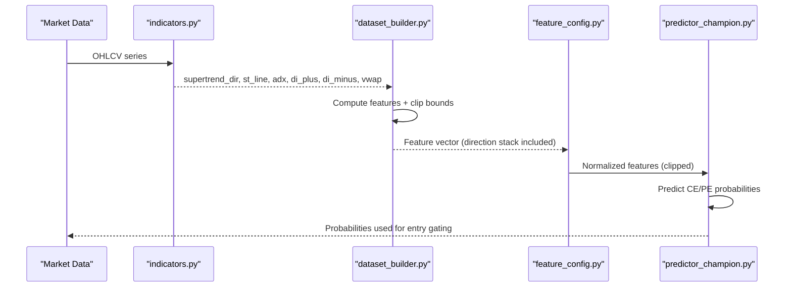
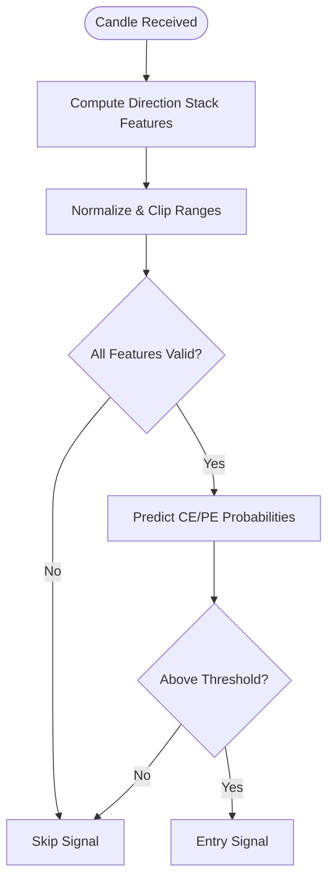
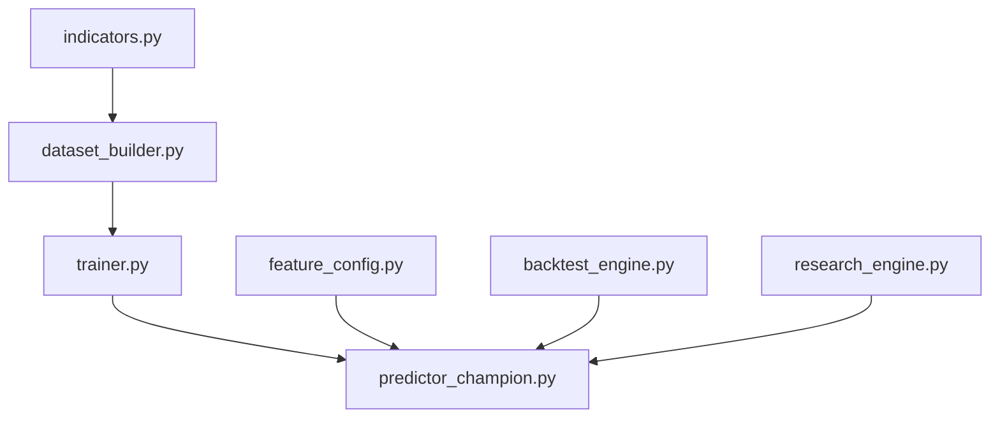

# Direction Stack Features

<cite>
**Referenced Files in This Document**
- [feature_config.py](file://ml/feature_config.py)
- [indicators.py](file://ml/indicators.py)
- [dataset_builder.py](file://ml/dataset_builder.py)
- [predictor_champion.py](file://ml/predictor_champion.py)
- [trainer.py](file://ml/trainer.py)
- [champion_ce_lgbm_features.txt](file://ml/models/champion_ce_lgbm_features.txt)
- [champion_pe_lgbm_features.txt](file://ml/models/champion_pe_lgbm_features.txt)
- [backtest_engine.py](file://backtest/backtest_engine.py)
- [research_engine.py](file://research/backtest/engine/research_engine.py)
</cite>

## Table of Contents
1. [Introduction](#introduction)
2. [Project Structure](#project-structure)
3. [Core Components](#core-components)
4. [Architecture Overview](#architecture-overview)
5. [Detailed Component Analysis](#detailed-component-analysis)
6. [Dependency Analysis](#dependency-analysis)
7. [Performance Considerations](#performance-considerations)
8. [Troubleshooting Guide](#troubleshooting-guide)
9. [Conclusion](#conclusion)
10. [Appendices](#appendices)

## Introduction
This document explains the direction stack feature system that acts as the primary trend gate for trading decisions. The direction stack is composed of seven core features designed to reach consensus before a strong signal is considered: supertrend_dir, supertrend_dist, price_vs_vwap, adx, di_spread, ema_alignment, and volume_ratio. These features are engineered to confirm trend direction, strength, bias, momentum alignment, and liquidity conviction. They are normalized and clipped into bounded ranges so the ML models can learn robust decision boundaries across market regimes.

The system integrates these features into a 36-feature vector used by LightGBM/CatBoost models to predict the probability of a successful call (CE) or put (PE) move within a short lookahead horizon. The direction stack ensures that only candles with aligned trend, momentum, and liquidity conditions are considered high-quality entries.

## Project Structure
The direction stack spans multiple modules:
- Feature definitions and normalization live in the feature configuration module.
- Indicator computations (Supertrend, ADX/DI, VWAP) are implemented in the indicators module.
- Dataset construction computes all features and labels for training.
- Prediction uses the trained models with the same feature order and clipping rules.
- Backtesting and research engines compute the same signals to ensure parity between training and deployment.

**Diagram sources**
- [indicators.py:41-90](file://ml/indicators.py#L41-L90)
- [indicators.py:97-129](file://ml/indicators.py#L97-L129)
- [indicators.py:136-169](file://ml/indicators.py#L136-L169)
- [dataset_builder.py:84-176](file://ml/dataset_builder.py#L84-L176)
- [feature_config.py:82-252](file://ml/feature_config.py#L82-L252)
- [predictor_champion.py:151-204](file://ml/predictor_champion.py#L151-L204)
- [backtest_engine.py:505-528](file://backtest/backtest_engine.py#L505-L528)
- [research_engine.py:177-200](file://research/backtest/engine/research_engine.py#L177-L200)

**Section sources**
- [feature_config.py:25-64](file://ml/feature_config.py#L25-L64)
- [dataset_builder.py:84-176](file://ml/dataset_builder.py#L84-L176)
- [predictor_champion.py:151-204](file://ml/predictor_champion.py#L151-L204)
- [backtest_engine.py:505-528](file://backtest/backtest_engine.py#L505-L528)
- [research_engine.py:177-200](file://research/backtest/engine/research_engine.py#L177-L200)

## Core Components
The direction stack consists of seven features that must agree for a strong signal. Each component serves a distinct role:

- supertrend_dir: Binary trend direction from Supertrend (period 10, multiplier 3). Values are clipped to [-1, 1].
- supertrend_dist: Normalized distance from the Supertrend line, computed as (close - st_line) / close. Clipped to [-0.05, 0.05].
- price_vs_vwap: Normalized bias relative to session VWAP, computed as (close - vwap) / close. Clipped to [-0.05, 0.05].
- adx: Trend strength filter; values clipped to [0, 100], with >25 indicating trending regime.
- di_spread: Directional momentum confirmation via DI+ minus DI-. Clipped to [-60, 60].
- ema_alignment: EMA20 vs EMA50 confirmation; binary +1 if EMA20 > EMA50, else -1. Clipped to [-1, 1].
- volume_ratio: Liquidity conviction filter; current volume divided by 20-bar average volume. Clipped to [0, 10].

These features are first computed in dataset_builder.py during training and then mirrored in live/backtest pipelines using indicator functions and consistent normalization.

**Section sources**
- [feature_config.py:25-64](file://ml/feature_config.py#L25-L64)
- [feature_config.py:109-116](file://ml/feature_config.py#L109-L116)
- [feature_config.py:201-209](file://ml/feature_config.py#L201-L209)
- [dataset_builder.py:92-136](file://ml/dataset_builder.py#L92-L136)
- [indicators.py:41-90](file://ml/indicators.py#L41-L90)
- [indicators.py:97-129](file://ml/indicators.py#L97-L129)
- [indicators.py:136-169](file://ml/indicators.py#L136-L169)

## Architecture Overview
The direction stack flows through three stages: computation, normalization/clipping, and model integration.

**Diagram sources**
- [indicators.py:41-90](file://ml/indicators.py#L41-L90)
- [indicators.py:97-129](file://ml/indicators.py#L97-L129)
- [indicators.py:136-169](file://ml/indicators.py#L136-L169)
- [dataset_builder.py:92-136](file://ml/dataset_builder.py#L92-L136)
- [feature_config.py:201-209](file://ml/feature_config.py#L201-L209)
- [predictor_champion.py:151-204](file://ml/predictor_champion.py#L151-L204)

## Detailed Component Analysis

### Supertrend Direction and Distance
- supertrend_dir: Derived from Supertrend logic with period 10 and multiplier 3. Returns +1 for bullish/up and -1 for bearish/down.
- supertrend_dist: Measures how far price is from the Supertrend line, normalized by price. Positive indicates price above ST (bullish), negative below ST (bearish).

Normalization and clipping:
- supertrend_dir is clipped to [-1, 1].
- supertrend_dist is clipped to [-0.05, 0.05] to prevent outliers from dominating the model.

Rationale:
- Supertrend provides a robust trend baseline. Distance captures trend strength and deviation, helping the model distinguish strong trends from mean-reverting environments.

**Section sources**
- [indicators.py:41-90](file://ml/indicators.py#L41-L90)
- [dataset_builder.py:92-97](file://ml/dataset_builder.py#L92-L97)
- [feature_config.py:201-204](file://ml/feature_config.py#L201-L204)

### VWAP Bias Measurement
- price_vs_vwap: Computed as (close - vwap) / close. Captures institutional anchor bias; positive means price above VWAP (bullish), negative below (bearish).

Normalization and clipping:
- Clipped to [-0.05, 0.05] to maintain stability and avoid extreme values.

Rationale:
- VWAP is widely used by institutions. Price relative to VWAP helps confirm whether moves have institutional participation or are retail-driven noise.

**Section sources**
- [indicators.py:136-169](file://ml/indicators.py#L136-L169)
- [dataset_builder.py:99-103](file://ml/dataset_builder.py#L99-L103)
- [feature_config.py:204-205](file://ml/feature_config.py#L204-L205)

### ADX Trend Strength Filter
- adx: Average Directional Index over period 14. Values clipped to [0, 100]. Thresholds: >25 trending, <20 ranging.

Normalization and clipping:
- Clipped to [0, 100] to bound the input range.

Rationale:
- ADX filters out low-trend environments where directional strategies underperform. The model learns to ignore or reduce confidence during ranging sessions.

**Section sources**
- [indicators.py:97-129](file://ml/indicators.py#L97-L129)
- [dataset_builder.py:105-110](file://ml/dataset_builder.py#L105-L110)
- [feature_config.py:206-206](file://ml/feature_config.py#L206-L206)

### DI Spread Directional Momentum
- di_spread: Difference between DI+ and DI-. Positive indicates bullish pressure; negative indicates bearish pressure.

Normalization and clipping:
- Clipped to [-60, 60] to limit outlier influence.

Rationale:
- DI spread confirms directional momentum beyond simple trend direction. It helps differentiate between weak bounces and sustained directional moves.

**Section sources**
- [indicators.py:97-129](file://ml/indicators.py#L97-L129)
- [dataset_builder.py:105-110](file://ml/dataset_builder.py#L105-L110)
- [feature_config.py:207-207](file://ml/feature_config.py#L207-L207)

### EMA Alignment Confirmation
- ema_alignment: Binary confirmation based on EMA20 vs EMA50. +1 if EMA20 > EMA50 (bullish), -1 otherwise (bearish).

Normalization and clipping:
- Clipped to [-1, 1].

Rationale:
- EMA alignment provides medium-term trend confirmation. When aligned with Supertrend and VWAP, it increases confidence in trend continuation.

**Section sources**
- [dataset_builder.py:112-119](file://ml/dataset_builder.py#L112-L119)
- [feature_config.py:208-208](file://ml/feature_config.py#L208-L208)

### Volume Ratio Liquidity Conviction
- volume_ratio: Current volume divided by 20-bar average volume. Indicates whether volume supports the move.

Normalization and clipping:
- Clipped to [0, 10] to cap extreme spikes.

Rationale:
- Volume confirms conviction behind breakouts or reversals. Low volume often leads to fake moves; high volume suggests stronger follow-through.

**Section sources**
- [dataset_builder.py:134-136](file://ml/dataset_builder.py#L134-L136)
- [feature_config.py:209-209](file://ml/feature_config.py#L209-L209)

### Consensus Mechanism and Model Integration
The direction stack operates as a consensus mechanism:
- All seven features must align for a strong signal. For example, a bullish setup requires:
  - supertrend_dir = +1
  - supertrend_dist > 0
  - price_vs_vwap > 0
  - adx > 25
  - di_spread > 0
  - ema_alignment = +1
  - volume_ratio > 1

Integration with ML:
- The 36-feature vector includes the direction stack plus additional indicators, time features, and options-specific variables.
- Models are trained on this feature set and calibrated to produce probabilities for CE and PE directions.
- During prediction, the predictor validates feature presence and handles invalid values gracefully.

**Diagram sources**
- [feature_config.py:82-252](file://ml/feature_config.py#L82-L252)
- [predictor_champion.py:151-204](file://ml/predictor_champion.py#L151-L204)

**Section sources**
- [feature_config.py:25-64](file://ml/feature_config.py#L25-L64)
- [predictor_champion.py:151-204](file://ml/predictor_champion.py#L151-L204)
- [dataset_builder.py:84-176](file://ml/dataset_builder.py#L84-L176)

## Dependency Analysis
The direction stack depends on indicator calculations and is consumed by both training and prediction pipelines.

**Diagram sources**
- [indicators.py:41-90](file://ml/indicators.py#L41-L90)
- [dataset_builder.py:84-176](file://ml/dataset_builder.py#L84-L176)
- [trainer.py:82-129](file://ml/trainer.py#L82-L129)
- [predictor_champion.py:151-204](file://ml/predictor_champion.py#L151-L204)
- [backtest_engine.py:505-528](file://backtest/backtest_engine.py#L505-L528)
- [research_engine.py:177-200](file://research/backtest/engine/research_engine.py#L177-L200)

**Section sources**
- [indicators.py:41-90](file://ml/indicators.py#L41-L90)
- [dataset_builder.py:84-176](file://ml/dataset_builder.py#L84-L176)
- [trainer.py:82-129](file://ml/trainer.py#L82-L129)
- [predictor_champion.py:151-204](file://ml/predictor_champion.py#L151-L204)
- [backtest_engine.py:505-528](file://backtest/backtest_engine.py#L505-L528)
- [research_engine.py:177-200](file://research/backtest/engine/research_engine.py#L177-L200)

## Performance Considerations
- Normalization and clipping ensure stable inputs for ML models, reducing sensitivity to outliers.
- ADX thresholding avoids low-trend environments where directional strategies typically underperform.
- Volume ratio filtering reduces false breakouts during low liquidity periods.
- Consensus mechanism reduces noise by requiring multiple confirmations before signaling.

[No sources needed since this section provides general guidance]

## Troubleshooting Guide
Common issues and resolutions:
- Missing features: Predictor logs warnings and returns None if required features are missing. Ensure all 36 features are present.
- Invalid values: NaN or Inf values cause prediction to return None. Check data quality and preprocessing steps.
- Low probabilities: If probabilities are consistently near zero, check calibration and thresholds. Review recent model performance and retrain if necessary.
- Direction mismatch: Verify that Supertrend direction aligns with VWAP bias and EMA alignment. Inconsistent signals may indicate choppy markets.

**Section sources**
- [predictor_champion.py:156-178](file://ml/predictor_champion.py#L156-L178)
- [predictor_champion.py:196-204](file://ml/predictor_champion.py#L196-L204)
- [feature_config.py:255-267](file://ml/feature_config.py#L255-L267)

## Conclusion
The direction stack feature system provides a robust consensus mechanism for trend confirmation in options trading. By combining Supertrend direction and distance, VWAP bias, ADX trend strength, DI spread momentum, EMA alignment, and volume ratio conviction, the system filters out low-quality signals and focuses on high-probability setups. The normalized and clipped features integrate seamlessly with ML models, enabling adaptive decision-making across varying market regimes.

[No sources needed since this section summarizes without analyzing specific files]

## Appendices

### Example Strong Bullish Setup
- supertrend_dir = +1 (Supertrend up)
- supertrend_dist > 0 (price above ST line)
- price_vs_vwap > 0 (price above VWAP)
- adx > 25 (trending regime)
- di_spread > 0 (bullish momentum)
- ema_alignment = +1 (EMA20 > EMA50)
- volume_ratio > 1 (above-average volume)

Rationale: All components confirm upward momentum with institutional participation and sufficient trend strength.

### Example Strong Bearish Setup
- supertrend_dir = -1 (Supertrend down)
- supertrend_dist < 0 (price below ST line)
- price_vs_vwap < 0 (price below VWAP)
- adx > 25 (trending regime)
- di_spread < 0 (bearish momentum)
- ema_alignment = -1 (EMA20 < EMA50)
- volume_ratio > 1 (above-average volume)

Rationale: All components confirm downward momentum with institutional participation and sufficient trend strength.

[No sources needed since this section provides conceptual examples]