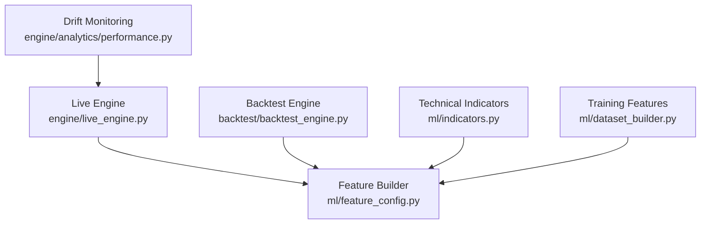
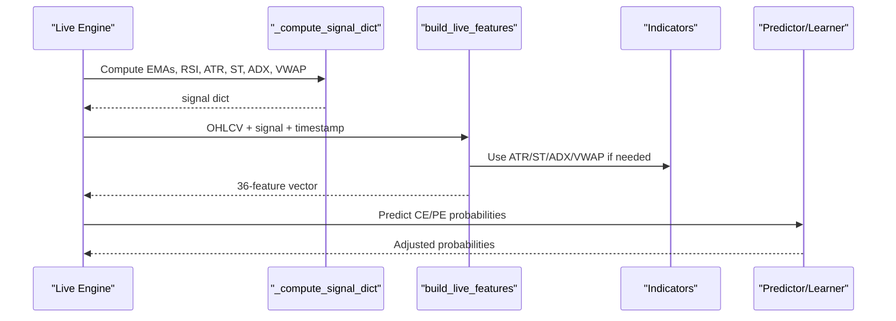
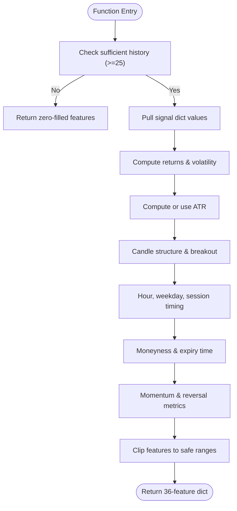
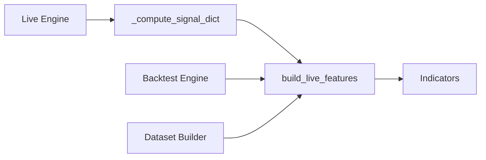

# Feature Engineering Pipeline

<cite>
**Referenced Files in This Document**
- [feature_config.py](file://ml/feature_config.py)
- [indicators.py](file://ml/indicators.py)
- [dataset_builder.py](file://ml/dataset_builder.py)
- [live_engine.py](file://engine/live_engine.py)
- [backtest_engine.py](file://backtest/backtest_engine.py)
- [performance.py](file://engine/analytics/performance.py)
</cite>

## Table of Contents
1. [Introduction](#introduction)
2. [Project Structure](#project-structure)
3. [Core Components](#core-components)
4. [Architecture Overview](#architecture-overview)
5. [Detailed Component Analysis](#detailed-component-analysis)
6. [Dependency Analysis](#dependency-analysis)
7. [Performance Considerations](#performance-considerations)
8. [Troubleshooting Guide](#troubleshooting-guide)
9. [Conclusion](#conclusion)
10. [Appendices](#appendices)

## Introduction
This document explains the feature engineering pipeline that transforms raw market data into ML-ready features for live trading and backtesting. It focuses on the complete construction process inside build_live_features(), the 36-feature architecture, direction stack components (supertrend_dir, supertrend_dist, price_vs_vwap, adx, di_spread, ema_alignment, volume_ratio), core technical indicators, normalization techniques, rolling windows, cross-timeframe context, time-based features, options-specific features, momentum indicators, and guidance for adding new features while maintaining backward compatibility. It also covers validation procedures, monitoring distributions, and identifying feature drift in production.

## Project Structure
The feature pipeline spans multiple modules:
- ml/feature_config.py defines the canonical 36-feature set and the build_live_features() function used by both live and backtest engines.
- ml/indicators.py provides vectorized technical indicators (ATR, Supertrend, ADX, VWAP).
- ml/dataset_builder.py computes all features for training datasets and labels.
- engine/live_engine.py computes signals and integrates with a VWAP accumulator and higher-timeframe trend alignment before calling build_live_features().
- backtest/backtest_engine.py mirrors live behavior to compute features during backtests.
- engine/analytics/performance.py includes drift monitoring utilities used in production.

**Diagram sources**
- [live_engine.py:450-590](file://engine/live_engine.py#L450-L590)
- [feature_config.py:82-252](file://ml/feature_config.py#L82-L252)
- [indicators.py:24-169](file://ml/indicators.py#L24-L169)
- [dataset_builder.py:84-176](file://ml/dataset_builder.py#L84-L176)
- [performance.py:294-356](file://engine/analytics/performance.py#L294-L356)

**Section sources**
- [feature_config.py:25-64](file://ml/feature_config.py#L25-L64)
- [feature_config.py:82-252](file://ml/feature_config.py#L82-L252)
- [indicators.py:24-169](file://ml/indicators.py#L24-L169)
- [dataset_builder.py:84-176](file://ml/dataset_builder.py#L84-L176)
- [live_engine.py:450-590](file://engine/live_engine.py#L450-L590)
- [backtest_engine.py:320-353](file://backtest/backtest_engine.py#L320-L353)
- [performance.py:294-356](file://engine/analytics/performance.py#L294-L356)

## Core Components
- Canonical 36-feature set defined in FEATURE_COLUMNS ensures identical ordering across training, backtesting, and live environments.
- Direction stack comprises seven features that must agree for strong directional signals: supertrend_dir, supertrend_dist, price_vs_vwap, adx, di_spread, ema_alignment, volume_ratio.
- Core technical indicators include EMA20/EMA50, MACD, RSI, ATR, volatility, returns, candle structure metrics, and session/time features.
- Time-based features capture hour, weekday, minutes since open, minutes to close, and session flags.
- Options-specific features include moneyness and time_to_expiry_min.
- Momentum indicators include momentum_velocity, range_compression, wick_ratio, body_efficiency, mom3_strength, upper_wick, lower_wick, close_position.

Normalization and bounds:
- Many features are clipped to safe ranges (e.g., supertrend_dist within [-0.05, 0.05], adx within [0, 100], di_spread within [-60, 60], volume_ratio within [0, 10]).
- Volatility is bounded to [0, 0.02] to prevent outliers.
- Returns and momentum velocity use normalized percentage changes to match training scales.

Rolling windows:
- Volatility uses last 20 returns standard deviation.
- Range compression compares 5-bar vs 15-bar ranges.
- Volume ratio compares current volume to 20-bar average.
- Candle breakouts compare close to 10-bar rolling high normalized by ATR.

Cross-timeframe context:
- Higher-timeframe SuperTrend directions (5m, 15m, 30m) and EMA alignments are computed in the live engine to inform direction bias and confirmations.

**Section sources**
- [feature_config.py:25-64](file://ml/feature_config.py#L25-L64)
- [feature_config.py:103-117](file://ml/feature_config.py#L103-L117)
- [feature_config.py:118-199](file://ml/feature_config.py#L118-L199)
- [feature_config.py:201-252](file://ml/feature_config.py#L201-L252)
- [live_engine.py:518-589](file://engine/live_engine.py#L518-L589)
- [live_engine.py:591-641](file://engine/live_engine.py#L591-L641)

## Architecture Overview
The pipeline integrates signal computation and feature building:
- The live engine builds a rolling OHLCV window and computes a signal dict containing EMAs, RSI, ATR, trend strength, and direction stack components.
- build_live_features() consumes this signal dict plus the latest OHLCV lists to produce the 36-feature vector.
- The backtest engine mirrors this flow using the same feature builder to ensure parity between live and historical evaluation.
- Training uses dataset_builder.compute_all_features() to generate consistent features from full historical DataFrames.

**Diagram sources**
- [live_engine.py:450-590](file://engine/live_engine.py#L450-L590)
- [feature_config.py:82-252](file://ml/feature_config.py#L82-L252)
- [indicators.py:24-169](file://ml/indicators.py#L24-L169)

**Section sources**
- [live_engine.py:450-590](file://engine/live_engine.py#L450-L590)
- [backtest_engine.py:320-353](file://backtest/backtest_engine.py#L320-L353)
- [dataset_builder.py:84-176](file://ml/dataset_builder.py#L84-L176)

## Detailed Component Analysis

### build_live_features() — 36-feature construction
- Input: closes, opens, highs, lows, volumes (lists, latest last), signal dict, optional timestamp ts.
- Early exit: If fewer than 25 closes, returns zero-filled feature dict to maintain shape.
- Direction stack extraction: Reads pre-computed values from signal dict (supertrend_dir, supertrend_dist, price_vs_vwap, adx, di_spread, ema_alignment, volume_ratio).
- Returns and volatility: Computes last return and 3-bar return; volatility via std of last 20 returns.
- ATR: Uses provided ATR or computes Wilder ATR over last 14 bars; minimum bound applied.
- Candle structure: Body percentage, range breakout strength normalized by ATR.
- Time features: Hour, weekday, minutes since open/close, session flags based on market hours.
- Options features: Moneyness relative to EMA20, capped; time_to_expiry_min capped.
- Momentum and reversal features: Momentum velocity (diff of returns), range compression (5 vs 15 bar ranges), wick ratios, body efficiency, 3-bar momentum, upper/lower wicks normalized by ATR, close position within range.
- Output: Dictionary of 36 features with clipping applied to keep distributions stable.

**Diagram sources**
- [feature_config.py:82-252](file://ml/feature_config.py#L82-L252)

**Section sources**
- [feature_config.py:82-252](file://ml/feature_config.py#L82-L252)

### Direction Stack Components
- supertrend_dir: Binary direction (+1 UP, -1 DOWN) from Supertrend(10,3).
- supertrend_dist: Normalized distance from Supertrend line, clipped to [-0.05, 0.05].
- price_vs_vwap: Normalized deviation from VWAP, clipped to [-0.05, 0.05].
- adx: Trend strength indicator, clipped to [0, 100].
- di_spread: Difference between DI+ and DI-, clipped to [-60, 60].
- ema_alignment: Binary confirmation (+1 if EMA20 > EMA50, else -1).
- volume_ratio: Current volume divided by 20-bar average, clipped to [0, 10].

These features form a consensus filter: when they align, the model focuses on entry quality rather than direction discovery.

**Section sources**
- [feature_config.py:25-33](file://ml/feature_config.py#L25-L33)
- [feature_config.py:109-117](file://ml/feature_config.py#L109-L117)
- [feature_config.py:201-210](file://ml/feature_config.py#L201-L210)
- [live_engine.py:518-589](file://engine/live_engine.py#L518-L589)

### Core Technical Indicators
- EMA20/EMA50: Exponential moving averages used for trend and MACD.
- MACD: Difference between EMA20 and EMA50.
- RSI: Relative Strength Index over recent gains/losses.
- ATR: Average True Range for volatility and normalization.
- Volatility: Rolling standard deviation of returns.
- Returns: Percentage change for short-term momentum.

These indicators are either pre-computed in the signal dict or derived directly in build_live_features().

**Section sources**
- [feature_config.py:103-117](file://ml/feature_config.py#L103-L117)
- [feature_config.py:118-149](file://ml/feature_config.py#L118-L149)
- [indicators.py:24-34](file://ml/indicators.py#L24-L34)

### Time-Based Features
- hour: Integer hour of the candle timestamp.
- weekday: Day of week integer.
- mins_since_open / mins_to_close: Minutes relative to market open/close, capped at 375.
- session_open / session_close: Boolean-like flags indicating early/late session windows.

Timestamps must be passed explicitly to avoid mismatch between backtest dates and wall-clock time.

**Section sources**
- [feature_config.py:157-168](file://ml/feature_config.py#L157-L168)
- [feature_config.py:221-237](file://ml/feature_config.py#L221-L237)
- [dataset_builder.py:138-148](file://ml/dataset_builder.py#L138-L148)

### Options-Specific Features
- moneyness: Normalized distance of close from EMA20, clipped to [-0.02, 0.02].
- time_to_expiry_min: Minutes until market close, capped at 375.

These features help the model account for options pricing dynamics near expiry and relative value positioning.

**Section sources**
- [feature_config.py:166-168](file://ml/feature_config.py#L166-L168)
- [feature_config.py:239-241](file://ml/feature_config.py#L239-L241)
- [dataset_builder.py:150-151](file://ml/dataset_builder.py#L150-L151)

### Momentum Indicators
- momentum_velocity: Difference between consecutive returns to capture acceleration/deceleration.
- range_compression: Ratio of 5-bar range to 15-bar range to detect consolidation.
- wick_ratio: Upper/lower wick length relative to body, clipped.
- body_efficiency: Body size relative to total range.
- mom3_strength: Absolute 3-bar return magnitude.
- upper_wick / lower_wick: Wick lengths normalized by ATR.
- close_position: Close location within the candle range.

These features capture early reversal signals and intraday momentum shifts.

**Section sources**
- [feature_config.py:170-199](file://ml/feature_config.py#L170-L199)
- [feature_config.py:243-251](file://ml/feature_config.py#L243-L251)
- [dataset_builder.py:168-174](file://ml/dataset_builder.py#L168-L174)

### Cross-Timeframe Feature Generation
- Higher-timeframe SuperTrend directions (5m, 15m, 30m) are computed by resampling the 1-minute window into larger candles and applying Supertrend.
- HTF EMA pairs (EMA20/EMA50) are computed on resampled closes to confirm dominant trends.
- These confirmations influence direction bias and filtering but are not part of the 36-feature vector; they inform decision logic around feature usage.

**Section sources**
- [live_engine.py:538-560](file://engine/live_engine.py#L538-L560)
- [live_engine.py:591-641](file://engine/live_engine.py#L591-L641)

### Normalization Techniques
- Clipping: Most features are clipped to predefined ranges to stabilize distributions and prevent outliers.
- ATR normalization: Wicks and breakout strengths are normalized by ATR to scale with volatility.
- Return-based features: Percentage changes ensure scale consistency with training data.
- Volatility bounds: Prevent extreme values from dominating models.

**Section sources**
- [feature_config.py:201-252](file://ml/feature_config.py#L201-L252)
- [dataset_builder.py:128-136](file://ml/dataset_builder.py#L128-L136)

### Rolling Window Calculations
- Volatility: Std of last 20 returns.
- Range compression: 5-bar vs 15-bar ranges.
- Volume ratio: Current vs 20-bar average volume.
- Breakout strength: Close vs 10-bar rolling high normalized by ATR.

**Section sources**
- [feature_config.py:123-155](file://ml/feature_config.py#L123-L155)
- [feature_config.py:184-188](file://ml/feature_config.py#L184-L188)
- [dataset_builder.py:128-136](file://ml/dataset_builder.py#L128-L136)

## Dependency Analysis
- build_live_features() depends on:
  - Signal dict from live/backtest engines containing EMAs, RSI, ATR, trend strength, and direction stack components.
  - Technical indicators module for ATR, Supertrend, ADX, VWAP where applicable.
  - Timestamps for accurate time features.
- Live engine computes signal dict and integrates VWAP accumulator and HTF trend alignment.
- Backtest engine mirrors live behavior to ensure parity.
- Training dataset builder computes all features consistently for model training.

**Diagram sources**
- [live_engine.py:450-590](file://engine/live_engine.py#L450-L590)
- [feature_config.py:82-252](file://ml/feature_config.py#L82-L252)
- [indicators.py:24-169](file://ml/indicators.py#L24-L169)
- [backtest_engine.py:320-353](file://backtest/backtest_engine.py#L320-L353)
- [dataset_builder.py:84-176](file://ml/dataset_builder.py#L84-L176)

**Section sources**
- [live_engine.py:450-590](file://engine/live_engine.py#L450-L590)
- [backtest_engine.py:320-353](file://backtest/backtest_engine.py#L320-L353)
- [dataset_builder.py:84-176](file://ml/dataset_builder.py#L84-L176)

## Performance Considerations
- Vectorized indicators in indicators.py reduce overhead for ATR, Supertrend, ADX, and VWAP computations.
- Rolling windows are kept minimal (e.g., 20-bar volatility) to balance responsiveness and stability.
- Clipping prevents outlier spikes that can degrade model performance.
- Cross-timeframe computations are guarded by sufficient data checks to avoid unnecessary processing.
- Safe feature builder wrapper (_safe_build_live_features) ensures robustness against exceptions and missing keys.

[No sources needed since this section provides general guidance]

## Troubleshooting Guide
Common issues and remedies:
- Missing features: The live engine checks for missing FEATURE_COLUMNS after building and logs errors if any are absent.
- Insufficient history: build_live_features() returns zero-filled features if fewer than 25 closes are available; ensure adequate warm-up periods.
- Timestamp mismatches: Always pass the candle timestamp to build_live_features() to avoid incorrect time features in backtests.
- Scale mismatches: Ensure momentum_velocity and other return-based features match training scales; deviations can cause model outputs to collapse.
- Drift detection: Use drift_check() to monitor strategy performance degradation and receive alerts when thresholds are breached.

Monitoring distributions:
- Track feature means, standard deviations, and percentiles over rolling windows to detect distribution shifts.
- Log key features like adx, volume_ratio, and supertrend_dist to identify regime changes.

Identifying feature drift:
- Compare recent feature distributions against baseline statistics from training data.
- Alert on significant deviations in critical features (e.g., adx dropping below trending thresholds, volume_ratio anomalies).

**Section sources**
- [live_engine.py:465-468](file://engine/live_engine.py#L465-L468)
- [feature_config.py:94-95](file://ml/feature_config.py#L94-L95)
- [feature_config.py:157-164](file://ml/feature_config.py#L157-L164)
- [performance.py:294-356](file://engine/analytics/performance.py#L294-L356)

## Conclusion
The feature engineering pipeline delivers a robust, normalized, and consistent 36-feature set for ML-driven trading decisions. The direction stack provides strong directional confirmation, while core indicators, time-based features, options-specific metrics, and momentum signals enrich the feature space. Rolling windows and cross-timeframe context enhance adaptability to changing market regimes. Validation safeguards and drift monitoring ensure reliability in production. Adding new features requires careful attention to normalization, clipping, and backward compatibility to maintain parity across training, backtesting, and live environments.

[No sources needed since this section summarizes without analyzing specific files]

## Appendices

### Guidance for Adding New Features
- Maintain canonical order: Insert new features into FEATURE_COLUMNS in a consistent location to preserve model input shape.
- Match training implementation: Replicate the exact calculation in dataset_builder.compute_all_features() to ensure parity.
- Normalize and clip: Apply appropriate scaling and clipping to prevent outliers.
- Validate completeness: Use _safe_build_live_features() to catch missing keys and handle exceptions gracefully.
- Test in backtest and live: Verify feature values and distributions match expectations across environments.

**Section sources**
- [feature_config.py:25-64](file://ml/feature_config.py#L25-L64)
- [feature_config.py:255-266](file://ml/feature_config.py#L255-L266)
- [dataset_builder.py:84-176](file://ml/dataset_builder.py#L84-L176)

### Example Debugging Workflow
- Log feature vectors per candle to inspect values and distributions.
- Compare live vs backtest feature values for parity.
- Use drift_check() to correlate performance drops with feature regime changes.
- Monitor VWAP bias and ADX to understand trendiness and liquidity conditions.

**Section sources**
- [live_engine.py:802-828](file://engine/live_engine.py#L802-L828)
- [performance.py:294-356](file://engine/analytics/performance.py#L294-L356)