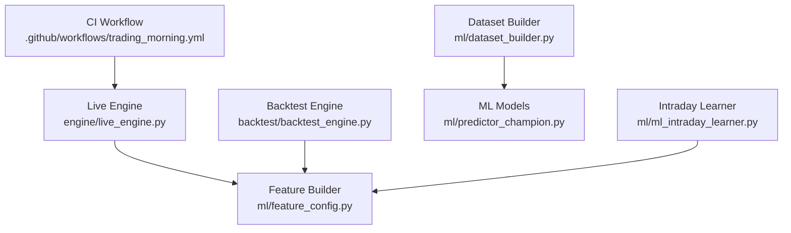
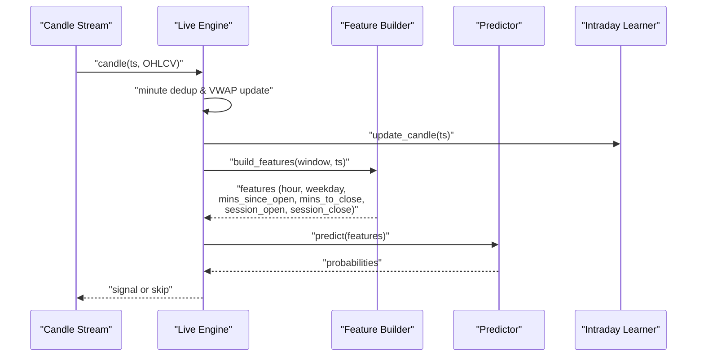
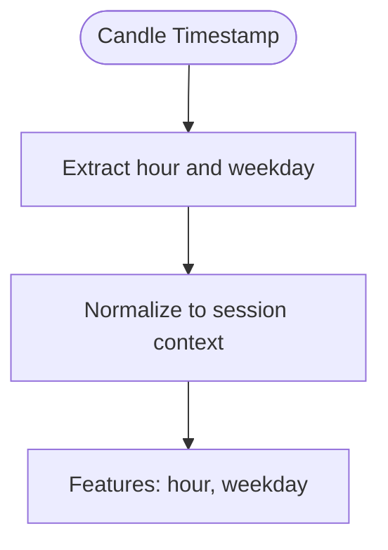
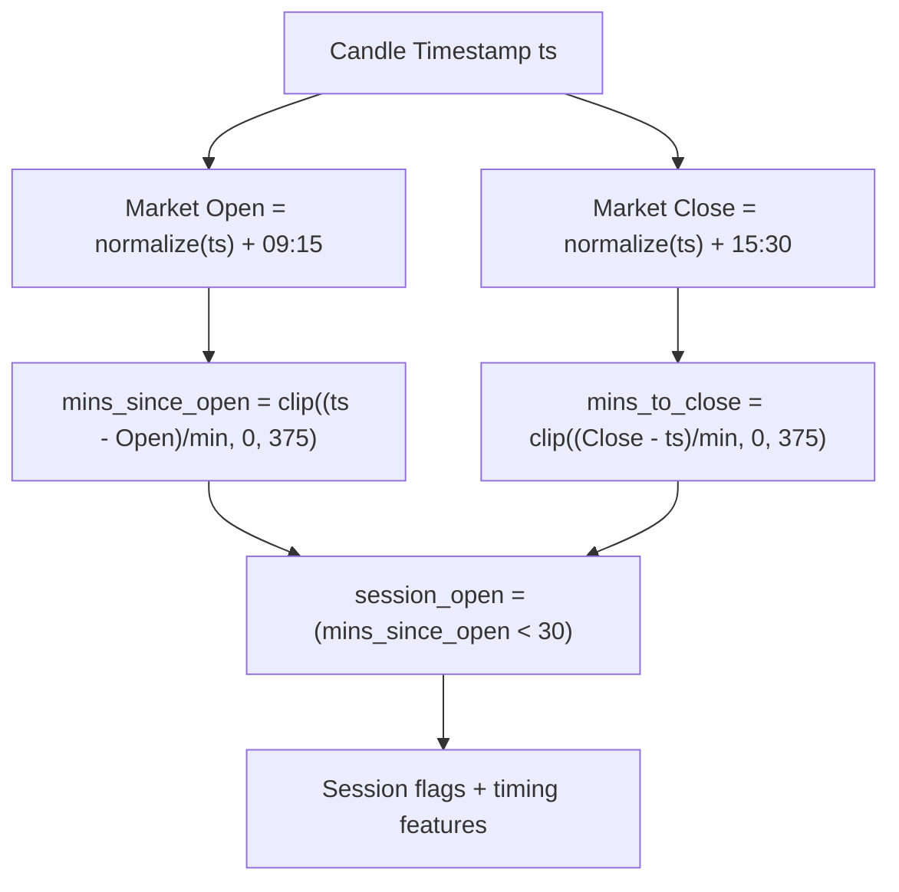
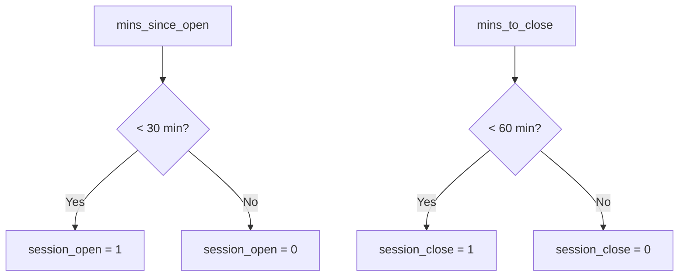
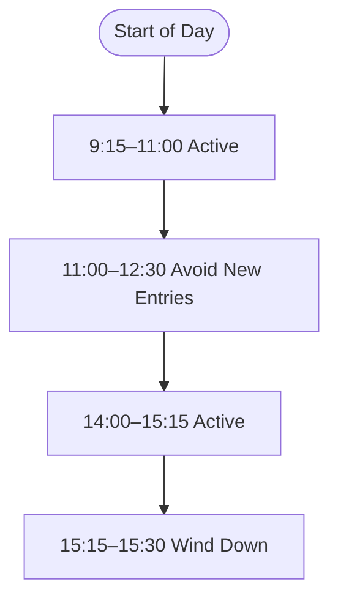
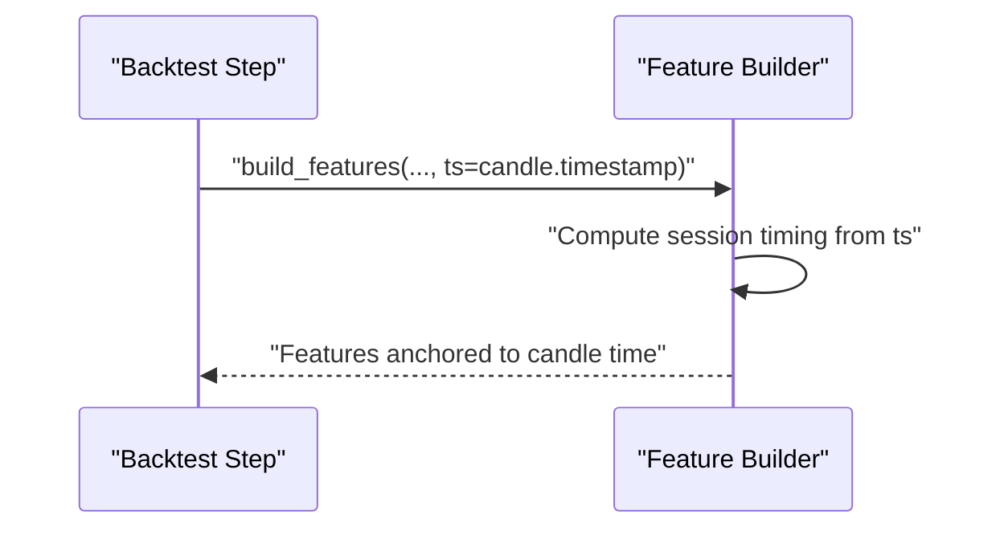
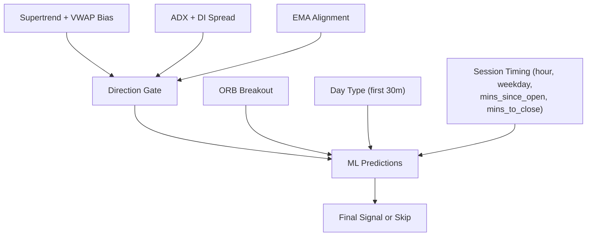
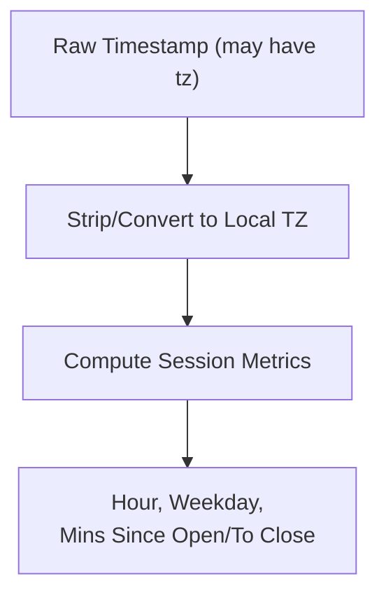
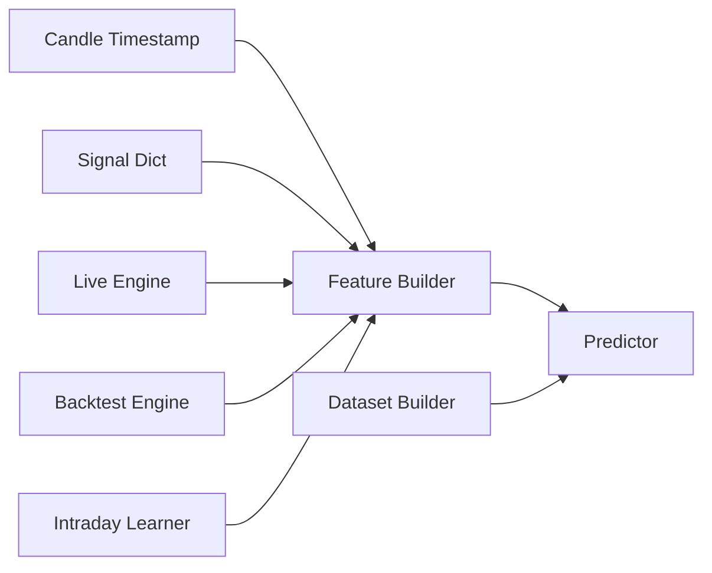

# Time and Session Context Features

<cite>
**Referenced Files in This Document**
- [dataset_builder.py](file://ml/dataset_builder.py)
- [feature_config.py](file://ml/feature_config.py)
- [backtest_engine.py](file://backtest/backtest_engine.py)
- [live_engine.py](file://engine/live_engine.py)
- [ml_intraday_learner.py](file://ml/ml_intraday_learner.py)
- [trading_morning.yml](file://.github/workflows/trading_morning.yml)
</cite>

## Table of Contents
1. [Introduction](#introduction)
2. [Project Structure](#project-structure)
3. [Core Components](#core-components)
4. [Architecture Overview](#architecture-overview)
5. [Detailed Component Analysis](#detailed-component-analysis)
6. [Dependency Analysis](#dependency-analysis)
7. [Performance Considerations](#performance-considerations)
8. [Troubleshooting Guide](#troubleshooting-guide)
9. [Conclusion](#conclusion)

## Introduction
This document explains how the system captures temporal patterns in market behavior using time-based and session context features. It focuses on:
- Hour and weekday features to model day-of-week effects
- Intraday timing features (mins_since_open, mins_to_close) for intraday pattern recognition
- Session boundary flags (session_open, session_close) to capture opening/closing dynamics
- The critical importance of using candle timestamps rather than wall-clock time to prevent data leakage in backtesting
- Indian market session boundaries (9:15 AM to 3:30 PM IST), lunch break considerations, and how these features help the model understand market microstructure
- How time features interact with other signal components
- Guidance on timezone handling and daylight saving adjustments in multi-market deployments

## Project Structure
The time and session context features are implemented across ML feature construction, live/backtest engines, and workflow orchestration:
- Feature computation and canonical feature order: ml/feature_config.py
- Batch dataset construction with time features: ml/dataset_builder.py
- Live engine feature building and minute-level gating: engine/live_engine.py
- Backtest engine time gates and session filters: backtest/backtest_engine.py
- Intraday learner day-type detection based on first 30 minutes: ml/ml_intraday_learner.py
- Multi-market timezone usage in CI workflows: .github/workflows/trading_morning.yml

**Diagram sources**
- [live_engine.py:445-470](file://engine/live_engine.py#L445-L470)
- [feature_config.py:82-252](file://ml/feature_config.py#L82-L252)
- [dataset_builder.py:84-176](file://ml/dataset_builder.py#L84-L176)
- [ml_intraday_learner.py:109-197](file://ml/ml_intraday_learner.py#L109-L197)
- [trading_morning.yml:89-101](file://.github/workflows/trading_morning.yml#L89-L101)

**Section sources**
- [feature_config.py:25-64](file://ml/feature_config.py#L25-L64)
- [dataset_builder.py:138-148](file://ml/dataset_builder.py#L138-L148)
- [backtest_engine.py:33-48](file://backtest/backtest_engine.py#L33-L48)
- [live_engine.py:380-439](file://engine/live_engine.py#L380-L439)
- [ml_intraday_learner.py:52-99](file://ml/ml_intraday_learner.py#L52-L99)

## Core Components
- Canonical feature set includes time and session context: hour, weekday, mins_since_open, mins_to_close, session_open, session_close, time_to_expiry_min
- Feature builder computes session-relative timing from candle timestamps to ensure consistency between training and live/backtest
- Dataset builder constructs historical features using normalized dates and explicit market open/close times for India
- Live engine passes the current candle timestamp into the feature builder each step
- Backtest engine enforces time gates aligned with Indian session hours and lunch chop avoidance

Key responsibilities:
- Compute accurate minute-level session timing relative to market open/close
- Provide binary flags for early session and late session windows
- Ensure consistent feature scaling and clipping across pipelines
- Prevent data leakage by anchoring time features to candle timestamps

**Section sources**
- [feature_config.py:39-53](file://ml/feature_config.py#L39-L53)
- [feature_config.py:157-168](file://ml/feature_config.py#L157-L168)
- [feature_config.py:221-241](file://ml/feature_config.py#L221-L241)
- [dataset_builder.py:138-148](file://ml/dataset_builder.py#L138-L148)
- [live_engine.py:445-470](file://engine/live_engine.py#L445-L470)
- [backtest_engine.py:33-48](file://backtest/backtest_engine.py#L33-L48)

## Architecture Overview
Time and session context flow through the system as follows:
- Candle timestamps drive all time-related features
- Feature builder translates candle timestamps into session-relative metrics
- Live and backtest engines pass the same timestamp to maintain parity
- Day-type detection uses first 30 minutes of session to adapt strategy behavior
- Session filters block trading during low-liquidity periods

**Diagram sources**
- [live_engine.py:380-439](file://engine/live_engine.py#L380-L439)
- [feature_config.py:82-252](file://ml/feature_config.py#L82-L252)
- [ml_intraday_learner.py:109-197](file://ml/ml_intraday_learner.py#L109-L197)

## Detailed Component Analysis

### Time Features: hour and weekday
- Purpose: Capture daily seasonality and day-of-week effects
- Implementation:
  - Dataset builder sets hour and weekday from date column
  - Feature builder sets hour and weekday from candle timestamp
- Impact: Helps model learn typical behavior at different hours and days

**Diagram sources**
- [dataset_builder.py:138-140](file://ml/dataset_builder.py#L138-L140)
- [feature_config.py:221-223](file://ml/feature_config.py#L221-L223)

**Section sources**
- [dataset_builder.py:138-140](file://ml/dataset_builder.py#L138-L140)
- [feature_config.py:221-223](file://ml/feature_config.py#L221-L223)

### Intraday Timing: mins_since_open and mins_to_close
- Purpose: Encode position within the trading session for intraday pattern recognition
- Implementation:
  - Dataset builder computes mins_since_open and mins_to_close using normalized date plus fixed market open/close times
  - Feature builder computes session-relative minutes from candle timestamp, clipped to a maximum of 375 minutes
- Impact: Enables model to recognize opening volatility, midday lulls, and closing pressure

**Diagram sources**
- [dataset_builder.py:142-148](file://ml/dataset_builder.py#L142-L148)
- [feature_config.py:157-168](file://ml/feature_config.py#L157-L168)
- [feature_config.py:233-241](file://ml/feature_config.py#L233-L241)

**Section sources**
- [dataset_builder.py:142-148](file://ml/dataset_builder.py#L142-L148)
- [feature_config.py:157-168](file://ml/feature_config.py#L157-L168)
- [feature_config.py:233-241](file://ml/feature_config.py#L233-L241)

### Session Boundary Detection: session_open and session_close
- Purpose: Binary indicators for early session and late session windows
- Implementation:
  - session_open is true when within first 30 minutes after market open
  - session_close is true when within last 60 minutes before market close
- Impact: Captures opening/closing dynamics such as liquidity spikes and momentum shifts

**Diagram sources**
- [dataset_builder.py:146-147](file://ml/dataset_builder.py#L146-L147)
- [feature_config.py:235-237](file://ml/feature_config.py#L235-L237)

**Section sources**
- [dataset_builder.py:146-147](file://ml/dataset_builder.py#L146-L147)
- [feature_config.py:235-237](file://ml/feature_config.py#L235-L237)

### Indian Market Session Boundaries and Lunch Break
- Market hours: 9:15 AM to 3:30 PM IST
- Active session windows used in dataset construction include morning and afternoon segments
- Institutional filter avoids lunch-hour chop (11:00–12:30) in backtest logic
- These boundaries help the model focus on high-quality liquidity regimes and avoid thin-order-flow periods

**Diagram sources**
- [dataset_builder.py:42-45](file://ml/dataset_builder.py#L42-L45)
- [backtest_engine.py:33-41](file://backtest/backtest_engine.py#L33-L41)
- [backtest_engine.py:462-468](file://backtest/backtest_engine.py#L462-L468)

**Section sources**
- [dataset_builder.py:42-45](file://ml/dataset_builder.py#L42-L45)
- [backtest_engine.py:33-41](file://backtest/backtest_engine.py#L33-L41)
- [backtest_engine.py:462-468](file://backtest/backtest_engine.py#L462-L468)

### Critical Importance of Candle Timestamps vs Wall-Clock Time
- Risk: Using wall-clock time in backtests can assign incorrect session context to historical candles (e.g., 2024 candles evaluated with 2026 wall-clock time)
- Mitigation: Feature builder explicitly uses the candle timestamp passed into it to compute session timing
- Enforcement: Live engine passes the current candle timestamp to feature builder; backtest engine also passes ts per step

**Diagram sources**
- [feature_config.py:157-168](file://ml/feature_config.py#L157-L168)
- [live_engine.py:445-470](file://engine/live_engine.py#L445-L470)
- [backtest_engine.py:330-347](file://backtest/backtest_engine.py#L330-L347)

**Section sources**
- [feature_config.py:157-168](file://ml/feature_config.py#L157-L168)
- [live_engine.py:445-470](file://engine/live_engine.py#L445-L470)
- [backtest_engine.py:330-347](file://backtest/backtest_engine.py#L330-L347)

### Interaction with Other Signal Components
- Direction stack: Supertrend direction, price vs VWAP, ADX, DI spread, EMA alignment influence whether signals are allowed
- ORB (Opening Range Breakout): CE entries require an ORB breakout confirmation; PE entries follow similar logic
- Day-type detection: First 30 minutes classify the day as TREND, RANGE, VOLATILE, or GAP, influencing thresholds and risk
- Time features complement these components by indicating where in the session the signal occurs

**Diagram sources**
- [backtest_engine.py:400-427](file://backtest/backtest_engine.py#L400-L427)
- [backtest_engine.py:503-545](file://backtest/backtest_engine.py#L503-L545)
- [ml_intraday_learner.py:150-197](file://ml/ml_intraday_learner.py#L150-L197)
- [feature_config.py:25-64](file://ml/feature_config.py#L25-L64)

**Section sources**
- [backtest_engine.py:400-427](file://backtest/backtest_engine.py#L400-L427)
- [backtest_engine.py:503-545](file://backtest/backtest_engine.py#L503-L545)
- [ml_intraday_learner.py:150-197](file://ml/ml_intraday_learner.py#L150-L197)
- [feature_config.py:25-64](file://ml/feature_config.py#L25-L64)

### Timezone Handling and Daylight Saving Adjustments
- Live ORB reconstruction strips timezone info and converts to Asia/Kolkata if present, ensuring correct session filtering
- CI workflow demonstrates computing IST offsets explicitly for scheduling sessions
- Best practices for multi-market deployments:
  - Always anchor time features to instrument-specific session times
  - Convert incoming timestamps to local market timezone before computing session metrics
  - Avoid relying on naive datetime.now() for historical evaluation
  - Use robust timezone libraries and handle missing tzinfo gracefully

**Diagram sources**
- [live_engine.py:279-300](file://engine/live_engine.py#L279-L300)
- [trading_morning.yml:89-101](file://.github/workflows/trading_morning.yml#L89-L101)

**Section sources**
- [live_engine.py:279-300](file://engine/live_engine.py#L279-L300)
- [trading_morning.yml:89-101](file://.github/workflows/trading_morning.yml#L89-L101)

## Dependency Analysis
- Feature builder depends on candle timestamps and pre-computed signal dict
- Live and backtest engines depend on feature builder for consistent feature generation
- Intraday learner depends on minute-deduplicated updates to correctly classify day type
- Dataset builder depends on normalized dates and fixed session boundaries for training consistency

**Diagram sources**
- [feature_config.py:82-252](file://ml/feature_config.py#L82-L252)
- [live_engine.py:445-470](file://engine/live_engine.py#L445-L470)
- [backtest_engine.py:330-347](file://backtest/backtest_engine.py#L330-L347)
- [ml_intraday_learner.py:109-197](file://ml/ml_intraday_learner.py#L109-L197)
- [dataset_builder.py:84-176](file://ml/dataset_builder.py#L84-L176)

**Section sources**
- [feature_config.py:82-252](file://ml/feature_config.py#L82-L252)
- [live_engine.py:445-470](file://engine/live_engine.py#L445-L470)
- [backtest_engine.py:330-347](file://backtest/backtest_engine.py#L330-L347)
- [ml_intraday_learner.py:109-197](file://ml/ml_intraday_learner.py#L109-L197)
- [dataset_builder.py:84-176](file://ml/dataset_builder.py#L84-L176)

## Performance Considerations
- Minute-level deduplication prevents overcounting in the first 30 minutes, ensuring accurate day-type classification
- Clipping session timing features to 375 minutes stabilizes model inputs and avoids outliers
- Avoiding lunch-hour entries reduces false breakouts and improves signal quality
- Consistent feature computation across live and backtest ensures reliable evaluation

[No sources needed since this section provides general guidance]

## Troubleshooting Guide
Common issues and resolutions:
- Incorrect session timing in backtests: Ensure candle timestamp is passed to feature builder; do not use wall-clock time
- Missing time features: Verify that ts is provided and that feature builder returns all required columns
- ORB unavailable due to timezone mismatches: Confirm timestamps are converted to local market timezone and filtered strictly within session windows
- Day-type stuck UNKNOWN: Check minute deduplication and ensure enough candles are collected before 9:45; use backfill if engine starts late

**Section sources**
- [feature_config.py:157-168](file://ml/feature_config.py#L157-L168)
- [live_engine.py:380-439](file://engine/live_engine.py#L380-L439)
- [live_engine.py:279-300](file://engine/live_engine.py#L279-L300)
- [ml_intraday_learner.py:109-197](file://ml/ml_intraday_learner.py#L109-L197)

## Conclusion
The system’s time and session context features provide a robust foundation for modeling market microstructure patterns. By anchoring features to candle timestamps, enforcing Indian session boundaries, and integrating with directional and regime-aware signals, the model can better distinguish high-probability opportunities while avoiding low-liquidity traps. Proper timezone handling and consistent feature computation across environments are essential to prevent data leakage and maintain performance in both backtesting and live trading.

[No sources needed since this section summarizes without analyzing specific files]