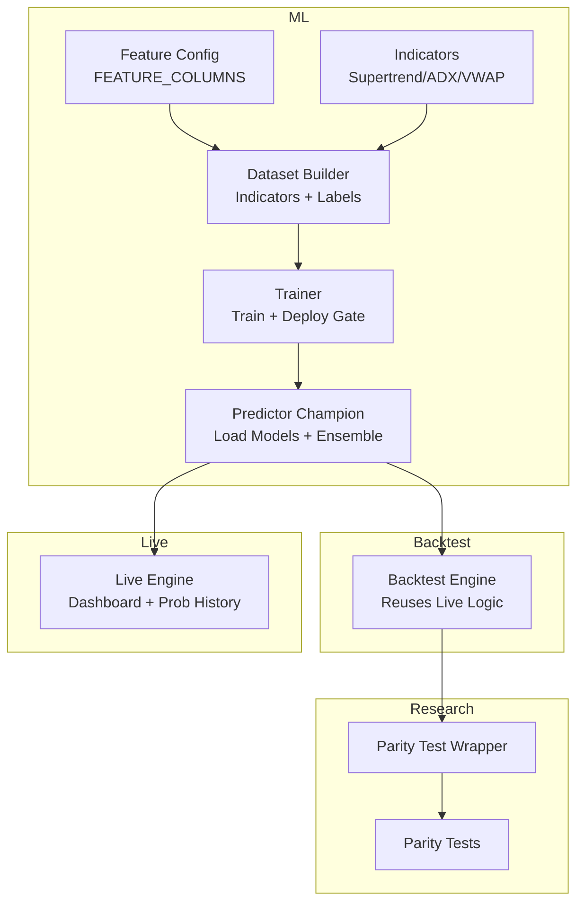
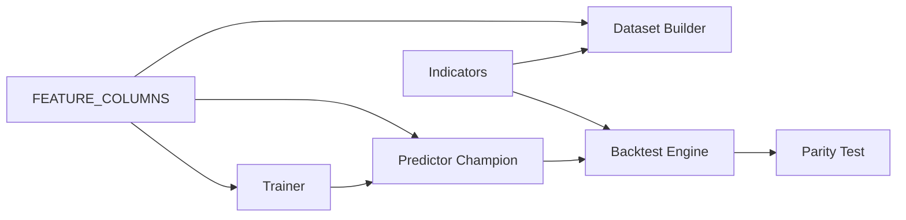

# Model Integration Procedures

<cite>
**Referenced Files in This Document**
- [feature_config.py](file://ml/feature_config.py)
- [dataset_builder.py](file://ml/dataset_builder.py)
- [trainer.py](file://ml/trainer.py)
- [predictor_champion.py](file://ml/predictor_champion.py)
- [indicators.py](file://ml/indicators.py)
- [backtest_engine.py](file://backtest/backtest_engine.py)
- [parity_test.py](file://research/backtest/engine/parity_test.py)
- [test_parity.py](file://research/backtest/tests/test_parity.py)
- [research-tests.yml](file://.github/workflows/research-tests.yml)
- [performance.py](file://engine/analytics/performance.py)
- [live_engine.py](file://engine/live_engine.py)
</cite>

## Table of Contents
1. Introduction
2. Project Structure
3. Core Components
4. Architecture Overview
5. Detailed Component Analysis
6. Dependency Analysis
7. Performance Considerations
8. Troubleshooting Guide
9. Conclusion
10. Appendices

## Introduction
This document provides a comprehensive, step-by-step guide to integrating new features into the machine learning model pipeline. It covers maintaining FEATURE_COLUMNS, updating signal dictionaries, training and validating models with backtesting, ensuring champion compatibility, versioning and rollback strategies, deprecation handling, integration testing (including parity between live and research engines), monitoring feature importance changes, A/B testing procedures, measuring incremental performance, and gradual rollout strategies.

## Project Structure
The ML pipeline is centered around:
- Feature engineering and canonical ordering
- Dataset construction with directional labels
- Model training with deployment gates
- Live inference via champion models
- Backtesting that reuses live logic for fidelity
- Parity tests to ensure research and live engines agree



**Diagram sources**
- [feature_config.py:22-64](file://ml/feature_config.py#L22-L64)
- [dataset_builder.py:84-176](file://ml/dataset_builder.py#L84-L176)
- [trainer.py:82-129](file://ml/trainer.py#L82-L129)
- [predictor_champion.py:57-100](file://ml/predictor_champion.py#L57-L100)
- [indicators.py:41-90](file://ml/indicators.py#L41-L90)
- [backtest_engine.py:196-205](file://backtest/backtest_engine.py#L196-L205)
- [parity_test.py:30-57](file://research/backtest/engine/parity_test.py#L30-L57)
- [live_engine.py:807-828](file://engine/live_engine.py#L807-L828)

**Section sources**
- [feature_config.py:22-64](file://ml/feature_config.py#L22-L64)
- [dataset_builder.py:84-176](file://ml/dataset_builder.py#L84-L176)
- [trainer.py:82-129](file://ml/trainer.py#L82-L129)
- [predictor_champion.py:57-100](file://ml/predictor_champion.py#L57-L100)
- [backtest_engine.py:196-205](file://backtest/backtest_engine.py#L196-L205)
- [parity_test.py:30-57](file://research/backtest/engine/parity_test.py#L30-L57)
- [live_engine.py:807-828](file://engine/live_engine.py#L807-L828)

## Core Components
- Feature configuration and live builder: Canonical feature order and safe computation used by both research and live systems.
- Dataset builder: Computes indicators and creates first-touch directional labels for training.
- Trainer: Trains LightGBM and optional CatBoost models, applies calibration, selects thresholds, and enforces deploy gates.
- Predictor champion: Loads deployed models, validates features, runs ensemble if available, and exposes threshold checks.
- Backtest engine: Reuses live components to simulate trades and measure performance under realistic conditions.
- Parity tests: Validate that research decisions match live decisions on identical inputs.

**Section sources**
- [feature_config.py:82-267](file://ml/feature_config.py#L82-L267)
- [dataset_builder.py:185-233](file://ml/dataset_builder.py#L185-L233)
- [trainer.py:196-210](file://ml/trainer.py#L196-L210)
- [predictor_champion.py:151-218](file://ml/predictor_champion.py#L151-L218)
- [backtest_engine.py:431-758](file://backtest/backtest_engine.py#L431-L758)
- [parity_test.py:118-162](file://research/backtest/engine/parity_test.py#L118-L162)

## Architecture Overview
End-to-end flow from adding a new feature to deploying a validated model:

```mermaid
sequenceDiagram
participant Dev as "Developer"
participant FC as "Feature Config"
participant DB as "Dataset Builder"
participant TR as "Trainer"
participant PC as "Predictor Champion"
participant BE as "Backtest Engine"
participant CI as "CI Parity Tests"
Dev->>FC : Add new feature to FEATURE_COLUMNS
Dev->>DB : Update indicator computations if needed
Dev->>TR : Run trainer to train CE/PE models
TR-->>PC : Save champion models + thresholds + features list
Dev->>BE : Run backtests using same live logic
BE-->>Dev : Metrics, conversion rates, PnL
Dev->>CI : Commit changes; parity tests run automatically
CI-->>Dev : Pass/Fail parity results
Dev->>TR : If gate passes, champions updated; else candidates saved
```

**Diagram sources**
- [feature_config.py:22-64](file://ml/feature_config.py#L22-L64)
- [dataset_builder.py:84-176](file://ml/dataset_builder.py#L84-L176)
- [trainer.py:212-280](file://ml/trainer.py#L212-L280)
- [predictor_champion.py:57-100](file://ml/predictor_champion.py#L57-L100)
- [backtest_engine.py:196-205](file://backtest/backtest_engine.py#L196-L205)
- [research-tests.yml:13-30](file://.github/workflows/research-tests.yml#L13-L30)

## Detailed Component Analysis

### Feature Configuration and Signal Dictionary Maintenance
- Maintain FEATURE_COLUMNS as the single source of truth for feature order across training, backtesting, and live inference.
- Ensure any new feature is computed identically in dataset_builder and live feature builder to avoid data drift.
- The live builder reads pre-computed values from a signal dict; add keys consistently and clip/scale them to expected ranges.

Key responsibilities:
- Canonical feature order and defaults for missing values
- Safe feature building with robust fallbacks
- Consistent time-based features using candle timestamps

**Section sources**
- [feature_config.py:22-64](file://ml/feature_config.py#L22-L64)
- [feature_config.py:82-267](file://ml/feature_config.py#L82-L267)

### Dataset Construction and Labeling
- Compute all indicators once in dataset_builder to guarantee parity with live computation.
- Use first-touch barrier labels to create true directional targets (CE vs PE).
- Output a training dataset compatible with the live feature pipeline.

Validation checklist:
- Active session windows respected
- Indicator calculations match live implementations
- Label distribution balanced and meaningful

**Section sources**
- [dataset_builder.py:84-176](file://ml/dataset_builder.py#L84-L176)
- [dataset_builder.py:185-233](file://ml/dataset_builder.py#L185-L233)

### Model Training and Deployment Gate
- Train LightGBM models for CE and PE directions; optionally train CatBoost models for ensemble.
- Apply Platt calibration and select thresholds based on expectancy over holdout folds.
- Enforce deploy gates: minimum AUC, calibrated probability spread, positive expectancy.
- Backup existing champions before overwrite; save candidates when gate fails.

Operational notes:
- Recency weighting applied by date only to avoid label bias
- Thresholds persisted alongside models for consistent inference
- Feature list persisted to guard against schema drift

**Section sources**
- [trainer.py:82-129](file://ml/trainer.py#L82-L129)
- [trainer.py:179-210](file://ml/trainer.py#L179-L210)
- [trainer.py:212-280](file://ml/trainer.py#L212-L280)

### Champion Model Compatibility and Inference
- Predictor loads CE/PE models and thresholds; supports LGBM-only or LGBM+CatBoost ensemble.
- Validates required features exist; returns None on invalid inputs to prevent silent mispredictions.
- Exposes threshold check method for downstream gating.

Compatibility requirements:
- Feature names must match those used during training
- Missing or invalid features should short-circuit prediction safely
- Ensemble mode requires both CE and CatBoost models present

**Section sources**
- [predictor_champion.py:57-100](file://ml/predictor_champion.py#L57-L100)
- [predictor_champion.py:151-218](file://ml/predictor_champion.py#L151-L218)

### Backtesting with Live Logic Fidelity
- Backtest engine reuses live components (features, predictor, risk/profit managers) to ensure parity.
- Implements ORB entry logic, direction bias gating, adaptive thresholds, and exit rules mirroring live behavior.
- Tracks telemetry for raw signals, ML pass rates, blocks, and executions.

Performance metrics:
- Conversion rates from raw signals to executed trades
- Expected PnL guards to avoid low-value entries
- Day-type classification influences thresholds and exits

**Section sources**
- [backtest_engine.py:196-205](file://backtest/backtest_engine.py#L196-L205)
- [backtest_engine.py:431-758](file://backtest/backtest_engine.py#L431-L758)
- [backtest_engine.py:952-982](file://backtest/backtest_engine.py#L952-L982)

### Parity Testing Between Research and Live Engines
- Parity test wrapper invokes live engine methods directly to compare decisions on identical historical windows.
- Tests verify entry/exit invariants, cost model parity, sizing consistency, and early-exit triggers.
- CI workflow runs parity tests on relevant changes to catch regressions early.

Integration steps:
- Ensure research and live use the same feature builder and predictor
- Mock external dependencies deterministically for stable tests
- Assert invariants like lot sizes, costs, and net PnL calculations

**Section sources**
- [parity_test.py:30-57](file://research/backtest/engine/parity_test.py#L30-L57)
- [parity_test.py:118-162](file://research/backtest/engine/parity_test.py#L118-L162)
- [test_parity.py:130-180](file://research/backtest/tests/test_parity.py#L130-L180)
- [research-tests.yml:13-30](file://.github/workflows/research-tests.yml#L13-L30)

### Monitoring Feature Importance and Live Signals
- Live engine maintains recent ML probabilities and adjusted probabilities for dashboard visibility.
- Analytics module provides ML bucket breakdowns and regime performance summaries to track signal quality.

Monitoring practices:
- Track CE/PE probability distributions and edge differences
- Correlate day-type classifications with performance
- Alert on sudden drops in win rate or expectancy

**Section sources**
- [live_engine.py:807-828](file://engine/live_engine.py#L807-L828)
- [performance.py:236-261](file://engine/analytics/performance.py#L236-L261)

## Dependency Analysis
Core dependencies and coupling:
- FEATURE_COLUMNS couples dataset_builder, trainer, and predictor_champion; changes must propagate everywhere.
- Indicators are shared between dataset_builder and backtest_engine to maintain parity.
- Predictor_champion depends on deployed models and thresholds; incompatible features cause safe failures.
- Backtest_engine depends on live components to ensure identical decision paths.

Potential risks:
- Schema drift if FEATURE_COLUMNS changes without updating all consumers
- Data leakage if indicator computations differ between research and live
- Silent failures if predictor receives unexpected feature sets

Mitigations:
- Centralize feature definitions and enforce strict validation in predictor
- Use parity tests to detect divergence
- Persist feature lists with models to validate at load time



**Diagram sources**
- [feature_config.py:22-64](file://ml/feature_config.py#L22-L64)
- [dataset_builder.py:84-176](file://ml/dataset_builder.py#L84-L176)
- [trainer.py:82-129](file://ml/trainer.py#L82-L129)
- [predictor_champion.py:57-100](file://ml/predictor_champion.py#L57-L100)
- [backtest_engine.py:196-205](file://backtest/backtest_engine.py#L196-L205)

**Section sources**
- [feature_config.py:22-64](file://ml/feature_config.py#L22-L64)
- [dataset_builder.py:84-176](file://ml/dataset_builder.py#L84-L176)
- [trainer.py:82-129](file://ml/trainer.py#L82-L129)
- [predictor_champion.py:57-100](file://ml/predictor_champion.py#L57-L100)
- [backtest_engine.py:196-205](file://backtest/backtest_engine.py#L196-L205)

## Performance Considerations
- Use vectorized indicator computations to minimize overhead in dataset_builder and live builders.
- Avoid redundant recomputation by leveraging rolling windows efficiently.
- Keep feature scaling and clipping consistent to prevent calibration drift.
- Monitor backtest conversion rates and expected PnL to identify inefficient features.
- Limit ensemble usage to cases where CatBoost models improve stability and accuracy.

[No sources needed since this section provides general guidance]

## Troubleshooting Guide
Common issues and resolutions:
- Missing features in predictor: Ensure FEATURE_COLUMNS matches model training features; predictor will return None if missing.
- Zero probabilities: Check calibration and threshold selection; ensure sufficient probability spread and correct recency weighting.
- Parity test failures: Verify indicator implementations are identical across dataset_builder and backtest_engine; confirm VWAP accumulation resets per session.
- Backtest no signals: Confirm direction bias gating and ORB filters; review adaptive thresholds and day-type classification.

Diagnostic steps:
- Inspect telemetry counts (raw signals, ML pass, blocked, executed)
- Review live dashboard probabilities and adjusted probabilities
- Run parity tests locally to isolate discrepancies

**Section sources**
- [predictor_champion.py:151-218](file://ml/predictor_champion.py#L151-L218)
- [backtest_engine.py:952-982](file://backtest/backtest_engine.py#L952-L982)
- [test_parity.py:160-225](file://research/backtest/tests/test_parity.py#L160-L225)

## Conclusion
Integrating new features requires disciplined maintenance of FEATURE_COLUMNS, consistent indicator computation, rigorous training with deploy gates, and thorough validation through backtesting and parity tests. By following these procedures, you can confidently add features, measure their impact, and roll out updates safely while preserving system stability and performance.

[No sources needed since this section summarizes without analyzing specific files]

## Appendices

### Step-by-Step: Adding a New Feature
1. Define the feature in FEATURE_COLUMNS and compute it identically in dataset_builder and live feature builder.
2. Update signal dictionary keys if the feature relies on pre-computed values.
3. Regenerate the training dataset and retrain models.
4. Validate via backtests; inspect conversion rates and expected PnL.
5. Run parity tests to ensure research and live engines agree.
6. If deploy gates pass, champions are updated; otherwise, inspect candidates and adjust.

**Section sources**
- [feature_config.py:22-64](file://ml/feature_config.py#L22-L64)
- [dataset_builder.py:84-176](file://ml/dataset_builder.py#L84-L176)
- [trainer.py:212-280](file://ml/trainer.py#L212-L280)
- [backtest_engine.py:431-758](file://backtest/backtest_engine.py#L431-L758)
- [research-tests.yml:13-30](file://.github/workflows/research-tests.yml#L13-L30)

### Step-by-Step: Retraining and Validating with Backtesting
1. Prepare dataset with updated features and labels.
2. Run trainer to produce candidate models; observe AUC, std, and expectancy.
3. Execute backtests to evaluate trade-level performance after costs.
4. Compare metrics across thresholds; select best performing configuration.
5. If gates pass, deploy champions; otherwise, retain current models and iterate.

**Section sources**
- [dataset_builder.py:236-270](file://ml/dataset_builder.py#L236-L270)
- [trainer.py:82-129](file://ml/trainer.py#L82-L129)
- [backtest_engine.py:952-982](file://backtest/backtest_engine.py#L952-L982)

### Step-by-Step: A/B Testing New Features
1. Create two cohorts: control (current champion) and treatment (new champion).
2. Route traffic proportionally; log predictions, thresholds, and outcomes.
3. Measure incremental win rate, expectancy, and drawdown for each cohort.
4. Use parity tests to ensure cohort logic does not introduce biases.
5. Gradually increase treatment share if metrics improve significantly.

[No sources needed since this section provides general guidance]

### Step-by-Step: Measuring Incremental Model Performance
1. Segment trades by feature presence or value buckets to assess contribution.
2. Compare performance metrics (WR, PF, expectancy) before and after feature addition.
3. Monitor live dashboard probabilities and adjusted probabilities for shifts.
4. Validate statistical significance with sufficient sample sizes.

**Section sources**
- [performance.py:236-261](file://engine/analytics/performance.py#L236-L261)
- [live_engine.py:807-828](file://engine/live_engine.py#L807-L828)

### Step-by-Step: Gradual Rollout Strategies
1. Start with small percentage of sessions using new champion.
2. Monitor key metrics and parity test results continuously.
3. Increase rollout incrementally if performance remains stable or improves.
4. Maintain rollback plan: revert to previous champion if metrics degrade.

[No sources needed since this section provides general guidance]

### Feature Versioning and Deprecation
- Version features by tagging datasets and models with feature set identifiers.
- When deprecating a feature, remove it from FEATURE_COLUMNS and update all consumers.
- Keep old models accessible for rollback; store feature lists with models to detect mismatches.
- Audit logs to ensure no live code references deprecated features.

**Section sources**
- [trainer.py:196-210](file://ml/trainer.py#L196-L210)
- [predictor_champion.py:116-147](file://ml/predictor_champion.py#L116-L147)

### Model Rollback Scenarios
- If new champion fails parity or live performance degrades, restore previous champion from backups.
- Use backup directories created by trainer to revert quickly.
- Re-run parity tests post-rollback to confirm stability.

**Section sources**
- [trainer.py:179-193](file://ml/trainer.py#L179-L193)