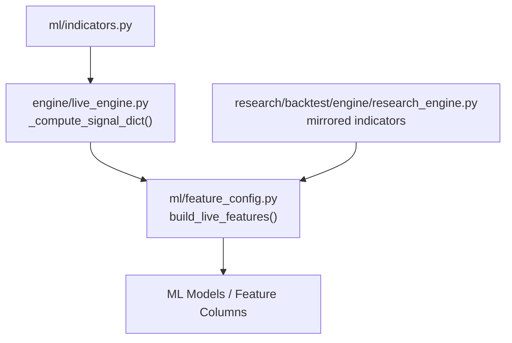
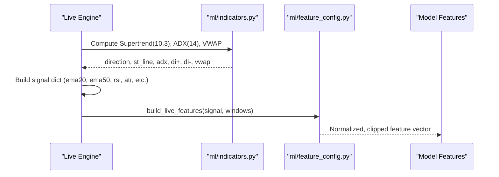
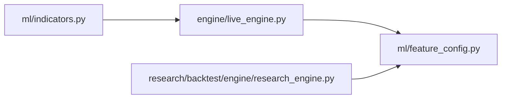
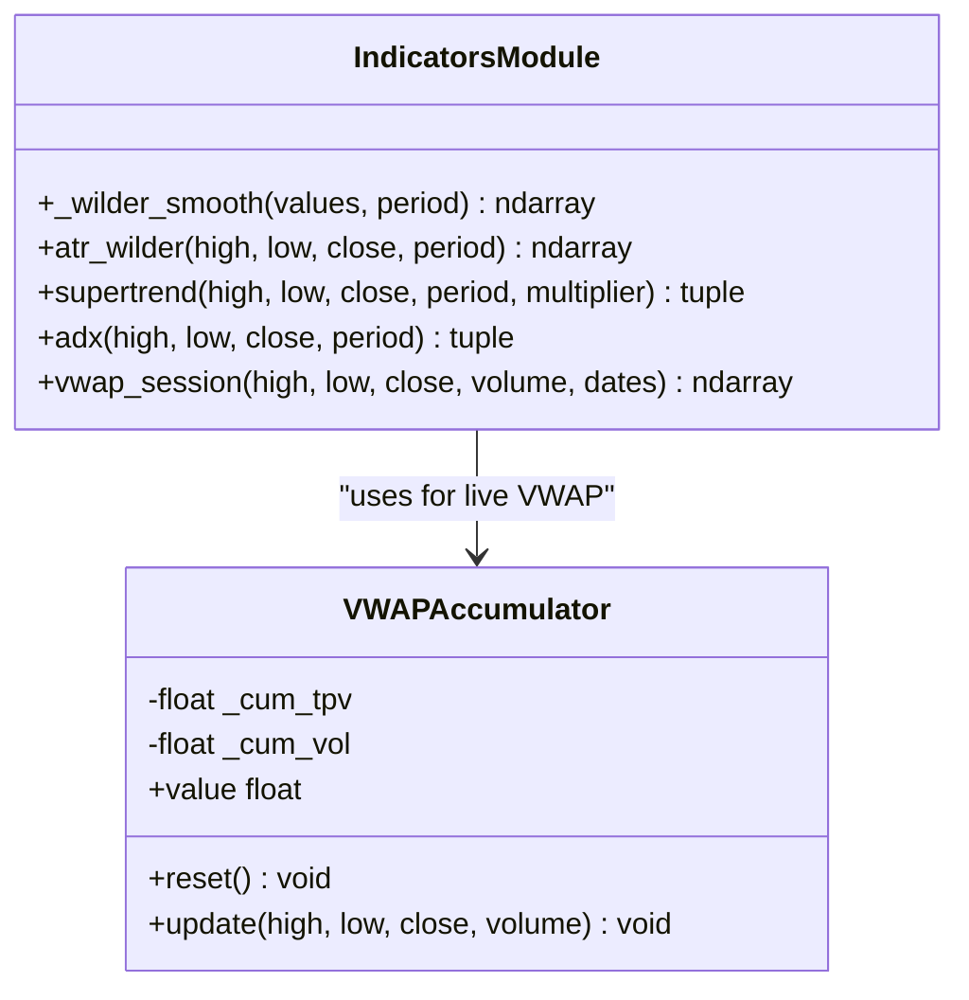
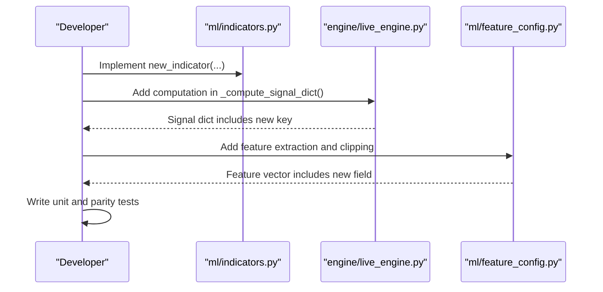

# Technical Indicators Extension

<cite>
**Referenced Files in This Document**
- [indicators.py](file://ml/indicators.py)
- [feature_config.py](file://ml/feature_config.py)
- [live_engine.py](file://engine/live_engine.py)
- [research_engine.py](file://research/backtest/engine/research_engine.py)
</cite>

## Table of Contents
1. [Introduction](#introduction)
2. [Project Structure](#project-structure)
3. [Core Components](#core-components)
4. [Architecture Overview](#architecture-overview)
5. [Detailed Component Analysis](#detailed-component-analysis)
6. [Dependency Analysis](#dependency-analysis)
7. [Performance Considerations](#performance-considerations)
8. [Troubleshooting Guide](#troubleshooting-guide)
9. [Conclusion](#conclusion)
10. [Appendices](#appendices)

## Introduction
This document explains how to extend the technical indicators library in ml/indicators.py with new, production-grade indicators that integrate seamlessly into the existing framework. It covers the established patterns for pure numpy functions, rolling window calculations, input validation, and integration points used by live and backtest engines. It also provides step-by-step guidance for implementing common indicator families (moving averages, volatility bands, momentum oscillators, trend-following), handling edge cases and numerical stability, tuning parameters, optimizing performance, and testing procedures.

## Project Structure
The indicators module is intentionally minimal and stateless: it exposes vectorized numpy functions and a small accumulator class for session-based metrics. The live engine computes a signal dictionary per candle and passes pre-computed values into a feature builder that produces a fixed 36-feature vector consumed by ML models.

**Diagram sources**
- [indicators.py:1-202](file://ml/indicators.py#L1-L202)
- [live_engine.py:472-589](file://engine/live_engine.py#L472-L589)
- [feature_config.py:82-252](file://ml/feature_config.py#L82-L252)
- [research_engine.py:536-572](file://research/backtest/engine/research_engine.py#L536-L572)

**Section sources**
- [indicators.py:1-202](file://ml/indicators.py#L1-L202)
- [feature_config.py:25-64](file://ml/feature_config.py#L25-L64)
- [live_engine.py:472-589](file://engine/live_engine.py#L472-L589)
- [research_engine.py:536-572](file://research/backtest/engine/research_engine.py#L536-L572)

## Core Components
- Pure numpy indicator functions: no side effects, no globals, deterministic outputs given inputs.
- Rolling smoothing helper using Wilder’s RMA pattern.
- Session-aware VWAP computation and an incremental VWAPAccumulator for live use.
- Direction stack components (Supertrend, ADX, DI spread, EMA alignment, VWAP bias) integrated into live features.

Key responsibilities:
- Provide robust, vectorized computations over OHLCV arrays.
- Handle missing data and zero-volume gracefully.
- Return predictable shapes and types for downstream consumers.

**Section sources**
- [indicators.py:12-34](file://ml/indicators.py#L12-L34)
- [indicators.py:41-90](file://ml/indicators.py#L41-L90)
- [indicators.py:97-129](file://ml/indicators.py#L97-L129)
- [indicators.py:136-169](file://ml/indicators.py#L136-L169)
- [indicators.py:176-202](file://ml/indicators.py#L176-L202)

## Architecture Overview
Indicators are computed either directly in the indicators module or mirrored in research/live contexts. The live engine builds a signal dict each candle and feeds it into the feature builder, which normalizes and clips values to stable ranges before producing the final feature vector.

**Diagram sources**
- [live_engine.py:472-589](file://engine/live_engine.py#L472-L589)
- [indicators.py:41-169](file://ml/indicators.py#L41-L169)
- [feature_config.py:82-252](file://ml/feature_config.py#L82-L252)

## Detailed Component Analysis

### Standard Indicator Interface
- Inputs: numpy arrays of OHLCV with consistent length; optional scalar parameters like period and multiplier.
- Outputs: numpy arrays of the same length as inputs (or tuples thereof), with well-defined semantics (e.g., direction as int8).
- Validation: guard against short series, zero denominators, and NaN propagation; clip or normalize where appropriate.
- Performance: prefer vectorized operations; avoid Python loops when possible; keep memory footprint low.

Patterns observed:
- Use Wilder’s smoothing via a dedicated helper for RMA-style indicators.
- For session resets (VWAP), track cumulative sums and reset on date boundaries.
- For live streaming, maintain an accumulator object with reset/update/value methods.

**Section sources**
- [indicators.py:12-34](file://ml/indicators.py#L12-L34)
- [indicators.py:136-202](file://ml/indicators.py#L136-L202)

### Moving Averages (SMA, EMA, VWAP)
- SMA: simple rolling mean; initialize warm-up with first-period average; pad initial values with zeros or NaNs depending on usage.
- EMA: exponential smoothing with alpha = 2/(span+1); initialize with first value; update iteratively or vectorize via pandas/numpy cumprod if needed.
- VWAP: session-reset accumulation of typical price times volume divided by cumulative volume; handle zero volume by falling back to equal weights.

Integration notes:
- Live engine uses EMA20/EMA50 for trend alignment and moneyness.
- VWAP bias is included in the direction stack and normalized in features.

**Section sources**
- [live_engine.py:481-490](file://engine/live_engine.py#L481-L490)
- [feature_config.py:104-116](file://ml/feature_config.py#L104-L116)
- [indicators.py:136-169](file://ml/indicators.py#L136-L169)

### Volatility Measures (Bollinger Bands, Keltner Channels)
- Bollinger Bands: compute SMA and standard deviation over a lookback; upper/lower bands at k*std around SMA.
- Keltner Channels: use ATR-based bands around EMA; align with existing Wilder smoothing.

Implementation tips:
- Use the existing ATR implementation as the volatility basis for Keltner.
- Clip band widths to reasonable ranges to avoid extreme outliers in features.

**Section sources**
- [indicators.py:24-34](file://ml/indicators.py#L24-L34)
- [feature_config.py:123-148](file://ml/feature_config.py#L123-L148)

### Momentum Oscillators (RSI, MACD, Stochastic)
- RSI: compute gains/losses and apply Wilder smoothing; handle zero-loss case to avoid division by zero.
- MACD: difference between two EMAs (e.g., 12 and 26) and optionally a signal line; can be derived from EMA building blocks.
- Stochastic: compare close to range over a lookback; normalize to [0,1].

Integration notes:
- RSI is already present in the feature set; ensure consistent calculation method across modules.
- MACD is represented as ema20 - ema50 in features; consider adding explicit MACD if needed.

**Section sources**
- [research_engine.py:536-557](file://research/backtest/engine/research_engine.py#L536-L557)
- [feature_config.py:211-218](file://ml/feature_config.py#L211-L218)

### Trend-Following Indicators (Supertrend, ADX)
- Supertrend: compute ATR-based bands, finalize bands with conditional updates, derive direction and support/resistance line.
- ADX: compute +DI/-DI via smoothed directional movements and ATR; then smooth DX to get ADX.

Integration notes:
- Live engine computes Supertrend and ADX per candle and includes them in the direction stack.
- Values are clipped to safe ranges before feature emission.

**Section sources**
- [indicators.py:41-129](file://ml/indicators.py#L41-L129)
- [live_engine.py:518-532](file://engine/live_engine.py#L518-L532)
- [feature_config.py:202-209](file://ml/feature_config.py#L202-L209)

### Step-by-Step: Implementing a New Indicator
Follow this pattern to add a new indicator to ml/indicators.py and integrate it into the system:

1. Define a pure function:
   - Inputs: numpy arrays (OHLCV) and scalar parameters.
   - Output: numpy array(s) of same length; document return types clearly.
   - Validate inputs: check lengths, handle NaNs, guard against division by zero.

2. Use established helpers:
   - Reuse _wilder_smooth for RMA-style smoothing.
   - Use existing ATR where applicable.

3. Add to the signal dict in live_engine._compute_signal_dict:
   - Compute the indicator over the current rolling window.
   - Extract the latest value(s) and include in the returned dict.

4. Integrate into feature_config.build_live_features:
   - Read the new key from the signal dict.
   - Normalize and clip to a sensible range.
   - Emit the feature with a descriptive name.

5. Test:
   - Unit test with known inputs and expected outputs.
   - Parity test against any mirrored implementations.
   - Backtest sanity checks for stability and performance.

**Section sources**
- [indicators.py:12-34](file://ml/indicators.py#L12-L34)
- [live_engine.py:472-589](file://engine/live_engine.py#L472-L589)
- [feature_config.py:82-252](file://ml/feature_config.py#L82-L252)

### Edge Cases, Missing Data, and Numerical Stability
- Short series: return zeros or safe defaults until enough history is available.
- Zero denominators: add small epsilon or guard clauses to prevent inf/nan.
- Zero volume: fall back to equal weighting for VWAP-like calculations.
- Clipping: constrain outputs to bounded ranges to protect downstream models.
- Dtype consistency: ensure float arrays for numeric stability; int8 for directions.

**Section sources**
- [indicators.py:147-169](file://ml/indicators.py#L147-L169)
- [indicators.py:192-202](file://ml/indicators.py#L192-L202)
- [feature_config.py:202-218](file://ml/feature_config.py#L202-L218)

### Parameter Tuning and Optimization Techniques
- Parameters: periods, multipliers, spans should be configurable and validated (positive integers, reasonable bounds).
- Warm-up: initialize with first-period statistics; avoid biased early signals.
- Vectorization: prefer numpy broadcasting; minimize Python loops; reuse intermediate arrays.
- Memory: avoid unnecessary copies; use views where possible; clear temporary arrays.
- Incremental updates: for live use, maintain accumulators (like VWAPAccumulator) to compute O(1) per tick.

**Section sources**
- [indicators.py:176-202](file://ml/indicators.py#L176-L202)
- [feature_config.py:123-148](file://ml/feature_config.py#L123-L148)

### Testing Procedures
- Unit tests: verify output shapes, ranges, and known edge cases (zero volume, short series).
- Parity tests: ensure mirrored implementations match within tolerance.
- Backtest stress: run over long histories to detect drift, overflow, or instability.
- Feature parity: confirm that new features appear in the feature vector with correct names and clipping.

**Section sources**
- [research_engine.py:536-572](file://research/backtest/engine/research_engine.py#L536-L572)
- [feature_config.py:255-266](file://ml/feature_config.py#L255-L266)

## Dependency Analysis
The indicators module has minimal external dependencies (numpy, optional pandas for date parsing in VWAP). Integration points:
- Live engine consumes indicator outputs to build the signal dict.
- Feature builder reads the signal dict and emits normalized features.
- Research engine mirrors some indicator logic for parity.

**Diagram sources**
- [indicators.py:1-202](file://ml/indicators.py#L1-L202)
- [live_engine.py:472-589](file://engine/live_engine.py#L472-L589)
- [feature_config.py:82-252](file://ml/feature_config.py#L82-L252)
- [research_engine.py:536-572](file://research/backtest/engine/research_engine.py#L536-L572)

**Section sources**
- [indicators.py:1-202](file://ml/indicators.py#L1-L202)
- [live_engine.py:472-589](file://engine/live_engine.py#L472-L589)
- [feature_config.py:82-252](file://ml/feature_config.py#L82-L252)
- [research_engine.py:536-572](file://research/backtest/engine/research_engine.py#L536-L572)

## Performance Considerations
- Prefer vectorized numpy operations; avoid per-tick Python loops where possible.
- Reuse precomputed arrays (e.g., ATR) across indicators to reduce recomputation.
- Keep rolling windows bounded; avoid unbounded growth in memory.
- For live trading, use incremental accumulators (like VWAPAccumulator) to achieve O(1) updates.
- Clip and normalize outputs to prevent model instability and reduce numerical issues.

[No sources needed since this section provides general guidance]

## Troubleshooting Guide
Common issues and resolutions:
- Division by zero: add epsilon or guard conditions; clip results.
- NaN propagation: sanitize inputs; replace NaNs with safe defaults before computation.
- Short series: return safe defaults until sufficient history exists.
- Zero volume: fallback to equal weights for VWAP-like calculations.
- Feature mismatch: ensure new features are added to FEATURE_COLUMNS and emitted consistently.

**Section sources**
- [indicators.py:147-169](file://ml/indicators.py#L147-L169)
- [feature_config.py:255-266](file://ml/feature_config.py#L255-L266)

## Conclusion
Extending the indicators library involves adhering to the established patterns: pure numpy functions, robust input validation, consistent return types, and careful integration into the live engine’s signal dict and the feature builder’s normalized output. By following these guidelines, you can implement reliable, high-performance indicators that integrate seamlessly into the trading system’s ML pipeline.

[No sources needed since this section summarizes without analyzing specific files]

## Appendices

### Appendix A: Class Diagram of Indicator Components

**Diagram sources**
- [indicators.py:12-34](file://ml/indicators.py#L12-L34)
- [indicators.py:41-129](file://ml/indicators.py#L41-L129)
- [indicators.py:136-202](file://ml/indicators.py#L136-L202)

### Appendix B: Sequence Diagram for Adding a New Indicator

**Diagram sources**
- [indicators.py:1-202](file://ml/indicators.py#L1-L202)
- [live_engine.py:472-589](file://engine/live_engine.py#L472-L589)
- [feature_config.py:82-252](file://ml/feature_config.py#L82-L252)