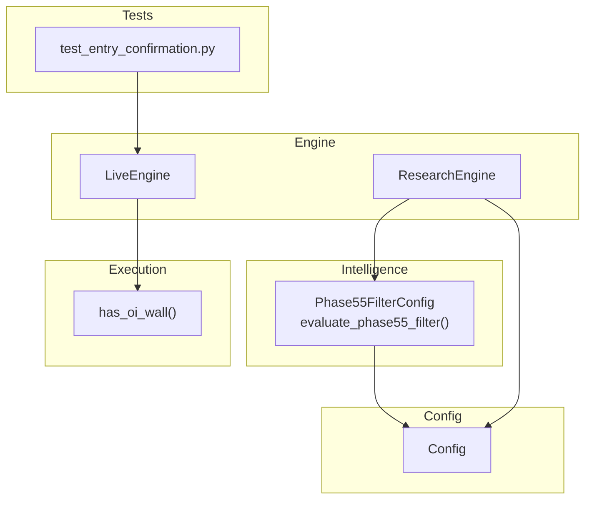
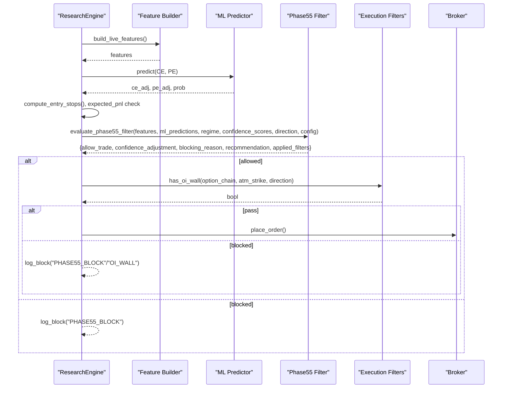
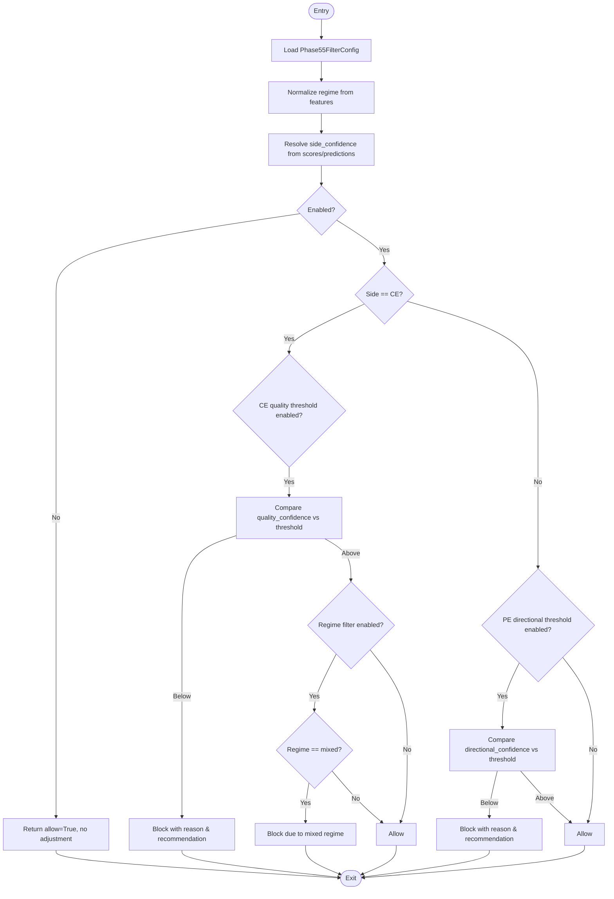
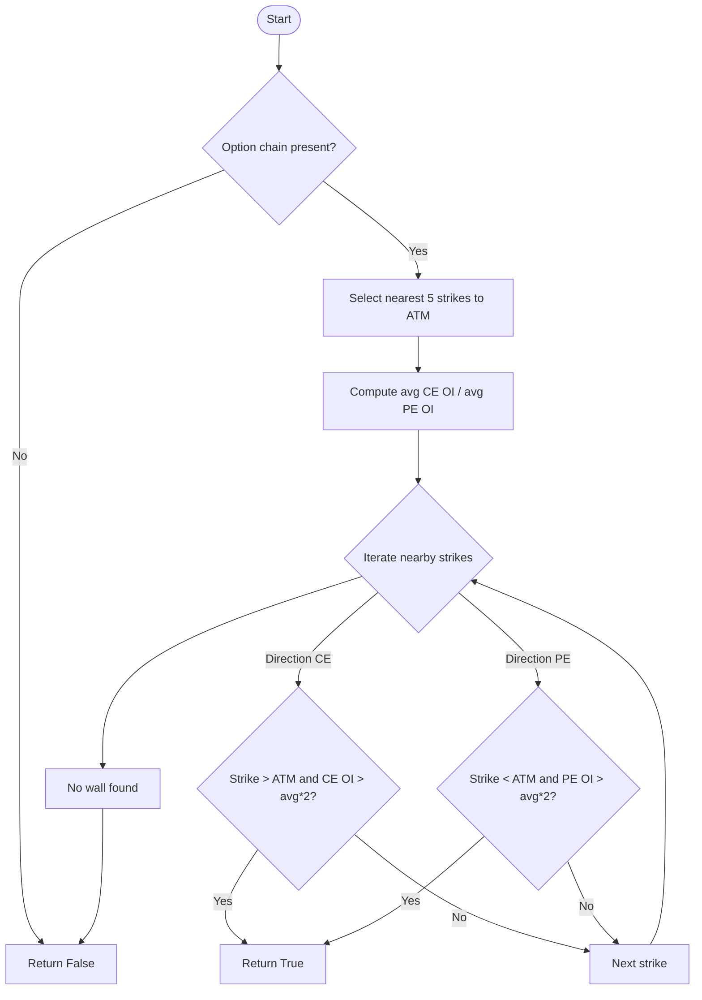
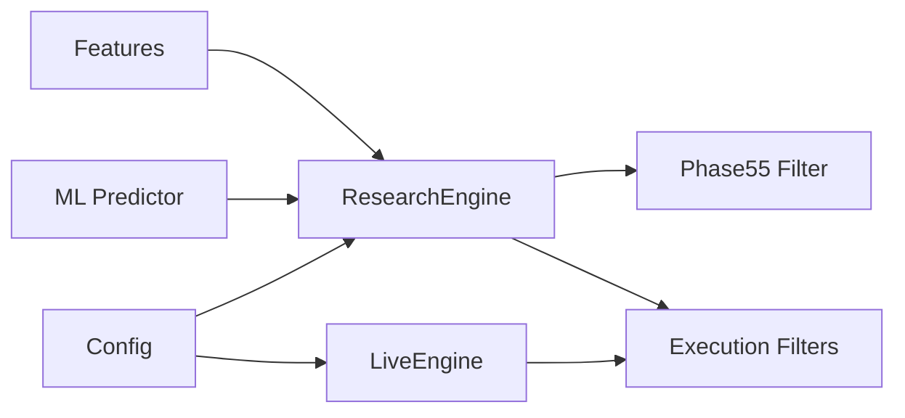

# Custom Filter Development

<cite>
**Referenced Files in This Document**
- [phase55_filter.py](file://engine/intelligence/phase55_filter.py)
- [filters.py](file://engine/execution/filters.py)
- [config.py](file://engine/config/config.py)
- [live_engine.py](file://engine/live_engine.py)
- [research_engine.py](file://research/backtest/engine/research_engine.py)
- [test_entry_confirmation.py](file://tests/test_entry_confirmation.py)
</cite>

## Table of Contents
1. Introduction
2. Project Structure
3. Core Components
4. Architecture Overview
5. Detailed Component Analysis
6. Dependency Analysis
7. Performance Considerations
8. Troubleshooting Guide
9. Conclusion
10. Appendices

## Introduction
This document explains how to implement custom market filters by extending the existing filter architecture in the trading system. It focuses on the Phase55 filter as a reference implementation, detailing its interface patterns, signal generation inputs, confidence scoring mechanisms, and decision outputs. You will learn how to create specialized filters for high volatility periods, earnings events, or economic announcements; how to integrate them with configuration; and how to register them into the main trading engine. The guide also covers testing procedures, performance monitoring, and optimization strategies to improve accuracy and execution speed.

## Project Structure
The filtering subsystem spans several modules:
- Intelligence layer: Phase55 filter logic and configuration
- Execution layer: Additional execution-time filters (e.g., open interest wall detection)
- Configuration: Centralized runtime settings and environment-driven toggles
- Engine integration: How signals are gated by filters during live and research backtesting
- Tests: Unit tests demonstrating entry confirmation and gate behaviors

**Diagram sources**
- [phase55_filter.py:12-34](file://engine/intelligence/phase55_filter.py#L12-L34)
- [phase55_filter.py:96-199](file://engine/intelligence/phase55_filter.py#L96-L199)
- [filters.py:4-38](file://engine/execution/filters.py#L4-L38)
- [config.py:4-164](file://engine/config/config.py#L4-L164)
- [research_engine.py:269-302](file://research/backtest/engine/research_engine.py#L269-L302)
- [live_engine.py:71-184](file://engine/live_engine.py#L71-L184)
- [test_entry_confirmation.py:1-389](file://tests/test_entry_confirmation.py#L1-L389)

**Section sources**
- [phase55_filter.py:12-34](file://engine/intelligence/phase55_filter.py#L12-L34)
- [phase55_filter.py:96-199](file://engine/intelligence/phase55_filter.py#L96-L199)
- [filters.py:4-38](file://engine/execution/filters.py#L4-L38)
- [config.py:4-164](file://engine/config/config.py#L4-L164)
- [research_engine.py:269-302](file://research/backtest/engine/research_engine.py#L269-L302)
- [live_engine.py:71-184](file://engine/live_engine.py#L71-L184)
- [test_entry_confirmation.py:1-389](file://tests/test_entry_confirmation.py#L1-L389)

## Core Components
- Phase55FilterConfig: A frozen dataclass that encapsulates filter toggles and thresholds for CE quality and PE directional confidence, plus regime-based gating. It supports construction from an arbitrary config object via attribute lookup.
- evaluate_phase55_filter(): The core evaluation function that consumes market features, ML predictions, current regime, and confidence scores to return a standardized decision dict indicating whether to allow trade, any confidence adjustment, blocking reason, recommendation, and which filters were applied.
- has_oi_wall(): An execution-time utility that detects potential option chain walls near ATM strikes to block entries when liquidity barriers exist against the intended direction.
- Config: Centralized runtime configuration loaded from environment variables, including session filters, risk controls, and scalping parameters.

Key responsibilities:
- Provide a consistent input/output contract for filters
- Allow configuration-driven behavior without code changes
- Return structured decisions that can be logged, persisted, or used to adjust downstream logic

**Section sources**
- [phase55_filter.py:12-34](file://engine/intelligence/phase55_filter.py#L12-L34)
- [phase55_filter.py:96-199](file://engine/intelligence/phase55_filter.py#L96-L199)
- [filters.py:4-38](file://engine/execution/filters.py#L4-L38)
- [config.py:4-164](file://engine/config/config.py#L4-L164)

## Architecture Overview
Filters operate as gates between signal generation and order execution. In research backtesting, the research engine builds features and ML probabilities, computes stops/targets, applies a PnL guard, then invokes the Phase55 filter before committing to a trade. In live trading, the LiveEngine orchestrates ORB tracking, feature building, ML prediction, and exit management, while execution-time filters like OI wall checks run at entry time.

**Diagram sources**
- [research_engine.py:269-302](file://research/backtest/engine/research_engine.py#L269-L302)
- [phase55_filter.py:96-199](file://engine/intelligence/phase55_filter.py#L96-L199)
- [filters.py:4-38](file://engine/execution/filters.py#L4-L38)

## Detailed Component Analysis

### Phase55 Filter Interface and Decision Contract
- Inputs:
  - market_features: Mapping of indicators such as ADX, DI spread, volatility
  - ml_predictions: Mapping containing side probabilities or adjusted probabilities
  - current_regime: Normalized regime string (e.g., trend, range, volatile_trend, mixed)
  - confidence_scores: Mapping with side_confidence or side-specific confidence keys
  - direction: Side string ("CE" or "PE")
  - config: Optional Phase55FilterConfig instance
  - symbol/timestamp: Optional metadata for logging
- Outputs:
  - allow_trade: Boolean gate
  - confidence_adjustment: Numeric adjustment to apply to confidence if needed
  - blocking_reason: Human-readable explanation when blocked
  - recommendation: Actionable hint (e.g., reduce/block trades under certain regimes)
  - applied_filters: List of filter names that participated in this decision

Confidence scoring mechanism:
- The function resolves side confidence by probing multiple key names in confidence_scores and ml_predictions, falling back gracefully to defaults.
- For CE, it may use a dedicated quality_confidence; for PE, it uses directional_confidence.
- Regime normalization maps various strings to canonical categories and can infer regime from features when missing.

**Diagram sources**
- [phase55_filter.py:96-199](file://engine/intelligence/phase55_filter.py#L96-L199)

**Section sources**
- [phase55_filter.py:12-34](file://engine/intelligence/phase55_filter.py#L12-L34)
- [phase55_filter.py:53-79](file://engine/intelligence/phase55_filter.py#L53-L79)
- [phase55_filter.py:96-199](file://engine/intelligence/phase55_filter.py#L96-L199)

### Execution-Time Filters (Open Interest Wall)
- Purpose: Detect strong OI walls near ATM that could impede price movement in the intended direction.
- Behavior: Sorts nearby strikes around ATM, computes average CE/PE OI, and returns True if a wall exists against the trade direction.
- Integration: Typically called before placing orders to avoid entering into illiquid or heavily defended levels.

**Diagram sources**
- [filters.py:4-38](file://engine/execution/filters.py#L4-L38)

**Section sources**
- [filters.py:4-38](file://engine/execution/filters.py#L4-L38)

### Configuration System
- Central Config class loads environment variables to control behavior across the system, including warmup windows, lunch filters, re-entry cooldowns, and scalping parameters.
- Phase55FilterConfig reads attributes from an arbitrary config object using getattr, enabling flexible integration without tight coupling.

Integration points:
- ResearchEngine constructs Phase55FilterConfig from a config object and passes it into evaluate_phase55_filter.
- LiveEngine uses Config values to manage session behavior and entry timing.

**Section sources**
- [config.py:4-164](file://engine/config/config.py#L4-L164)
- [phase55_filter.py:21-34](file://engine/intelligence/phase55_filter.py#L21-L34)
- [research_engine.py:269-302](file://research/backtest/engine/research_engine.py#L269-L302)
- [live_engine.py:71-184](file://engine/live_engine.py#L71-L184)

## Dependency Analysis
- Phase55 filter depends on:
  - Market features (ADX, DI spread, volatility)
  - ML predictions and confidence scores
  - Current regime classification
- ResearchEngine depends on:
  - Feature builder and ML predictor
  - Risk manager for stop/target computation
  - Phase55 filter for final gating
- LiveEngine depends on:
  - Execution filters (e.g., OI wall)
  - Profit manager and risk manager
  - Session and warmup controls from Config

**Diagram sources**
- [research_engine.py:269-302](file://research/backtest/engine/research_engine.py#L269-L302)
- [phase55_filter.py:96-199](file://engine/intelligence/phase55_filter.py#L96-L199)
- [filters.py:4-38](file://engine/execution/filters.py#L4-L38)
- [config.py:4-164](file://engine/config/config.py#L4-L164)
- [live_engine.py:71-184](file://engine/live_engine.py#L71-L184)

**Section sources**
- [research_engine.py:269-302](file://research/backtest/engine/research_engine.py#L269-L302)
- [phase55_filter.py:96-199](file://engine/intelligence/phase55_filter.py#L96-L199)
- [filters.py:4-38](file://engine/execution/filters.py#L4-L38)
- [config.py:4-164](file://engine/config/config.py#L4-L164)
- [live_engine.py:71-184](file://engine/live_engine.py#L71-L184)

## Performance Considerations
- Keep filter evaluations lightweight:
  - Prefer dictionary lookups over heavy computations inside hot paths
  - Cache derived values (e.g., normalized regime) per tick where appropriate
- Minimize I/O and logging overhead in live loops; batch logs when possible
- Use environment-driven toggles to disable expensive checks during high-frequency cycles
- Profile critical sections in research backtests to identify bottlenecks before deploying to live

[No sources needed since this section provides general guidance]

## Troubleshooting Guide
Common issues and remedies:
- Missing or misnamed confidence keys:
  - Ensure confidence_scores includes side_confidence or side-specific keys; fallbacks exist but explicit keys improve clarity
- Incorrect regime string:
  - Use normalize_regime-compatible values; unknown strings fall back to inference based on features
- Overly strict thresholds:
  - Adjust Phase55FilterConfig thresholds via environment attributes to balance false positives/negatives
- Execution-time blocks:
  - Inspect OI wall detection results; consider relaxing thresholds or adjusting ATM selection window

Logging and diagnostics:
- ResearchEngine logs block reasons when Phase55 blocks trades
- LiveEngine tracks last block reason and ML edge metrics for dashboards

**Section sources**
- [phase55_filter.py:96-199](file://engine/intelligence/phase55_filter.py#L96-L199)
- [research_engine.py:269-302](file://research/backtest/engine/research_engine.py#L269-L302)
- [live_engine.py:71-184](file://engine/live_engine.py#L71-L184)

## Conclusion
The filter architecture provides a robust, configurable foundation for gating trades based on market conditions and model confidence. Phase55 demonstrates a clean interface pattern with clear inputs and outputs, making it straightforward to extend with new filters for volatility spikes, earnings events, or macro announcements. By integrating with the configuration system and registering filters in both research and live engines, you can maintain consistency and traceability across environments. Testing and performance monitoring ensure reliability and efficiency as you iterate on filter logic.

[No sources needed since this section summarizes without analyzing specific files]

## Appendices

### Step-by-Step: Implementing a New Custom Filter
1. Define a filter function with a consistent signature:
   - Inputs: market_features, ml_predictions, current_regime, confidence_scores, direction, optional config/metadata
   - Output: a dict with allow_trade, confidence_adjustment, blocking_reason, recommendation, applied_filters
2. Add configuration options:
   - Extend Phase55FilterConfig-like structure or add a new config class
   - Support reading from environment via getattr or direct env parsing
3. Integrate into research backtesting:
   - Call your filter after risk/PnL guards and before order placement
   - Log block reasons and update analytics counters
4. Integrate into live engine:
   - Insert your filter into the entry confirmation flow
   - Combine with execution-time checks (e.g., OI wall)
5. Test thoroughly:
   - Write unit tests covering normal, edge, and failure cases
   - Validate behavior under different regimes and confidence levels

**Section sources**
- [phase55_filter.py:96-199](file://engine/intelligence/phase55_filter.py#L96-L199)
- [research_engine.py:269-302](file://research/backtest/engine/research_engine.py#L269-L302)
- [test_entry_confirmation.py:1-389](file://tests/test_entry_confirmation.py#L1-L389)

### Extending Phase55FilterConfig
- Add new boolean flags for enabling/disabling additional rules
- Add numeric thresholds for new metrics (e.g., volatility spike threshold)
- Implement from_config to read environment attributes safely with defaults

**Section sources**
- [phase55_filter.py:12-34](file://engine/intelligence/phase55_filter.py#L12-L34)

### Handling Filter Responses
- If allow_trade is False:
  - Record blocking_reason and recommendation
  - Optionally adjust confidence or skip further processing
- If allow_trade is True:
  - Proceed to execution-time filters and order placement
  - Log applied_filters for auditability

**Section sources**
- [phase55_filter.py:81-93](file://engine/intelligence/phase55_filter.py#L81-L93)
- [phase55_filter.py:193-199](file://engine/intelligence/phase55_filter.py#L193-L199)

### Testing Procedures
- Create synthetic histories and feature sets to exercise each branch
- Assert correct blocking and confirmation outcomes
- Cover edge cases: missing keys, empty chains, neutral regimes, extreme values

**Section sources**
- [test_entry_confirmation.py:1-389](file://tests/test_entry_confirmation.py#L1-L389)

### Performance Monitoring and Optimization
- Track filter application frequency and block rates
- Measure latency of filter functions in hot loops
- Tune thresholds to reduce false positives without sacrificing safety
- Batch or defer non-critical computations outside real-time paths

[No sources needed since this section provides general guidance]