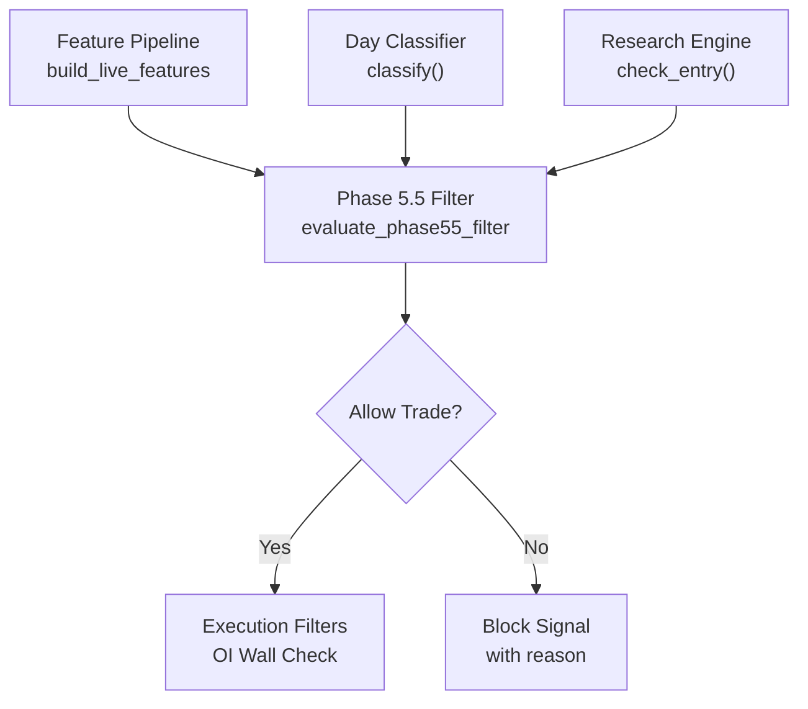
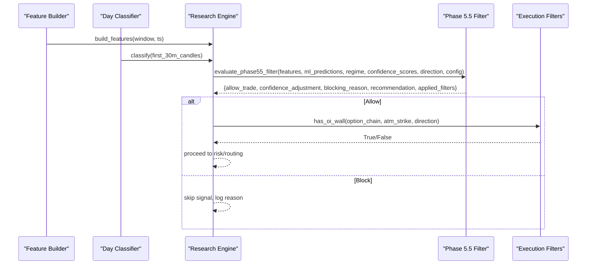
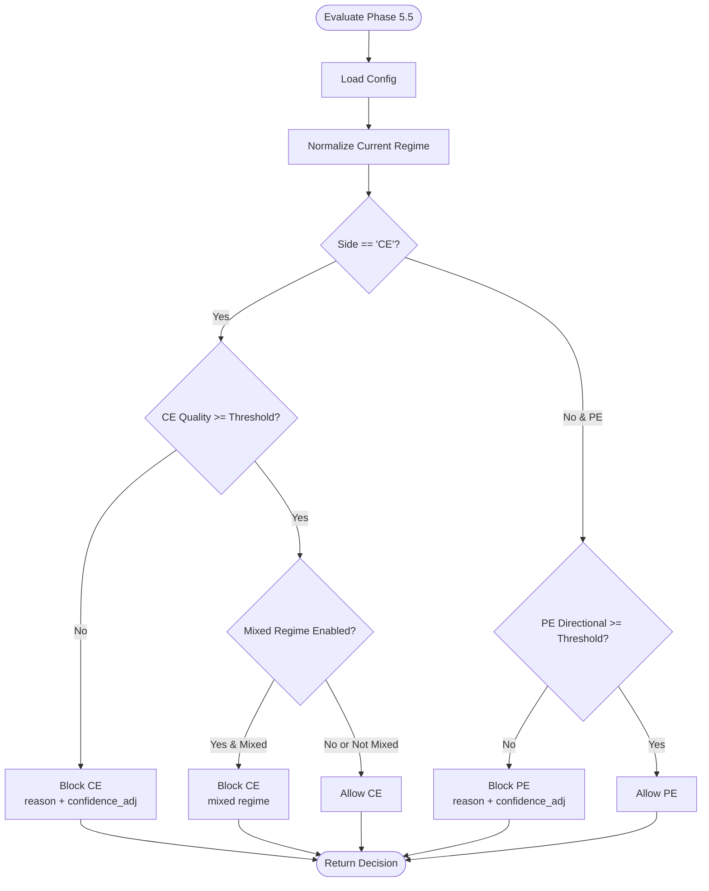
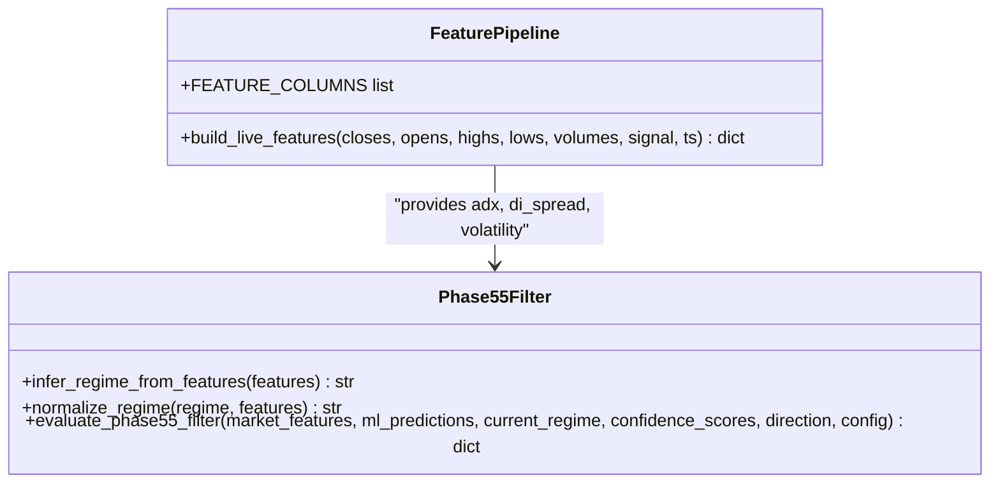
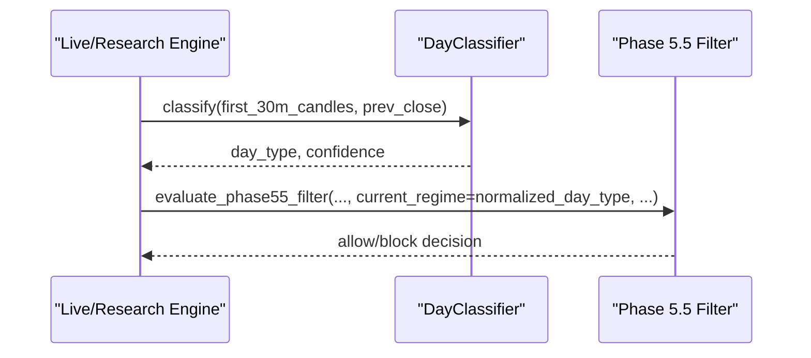
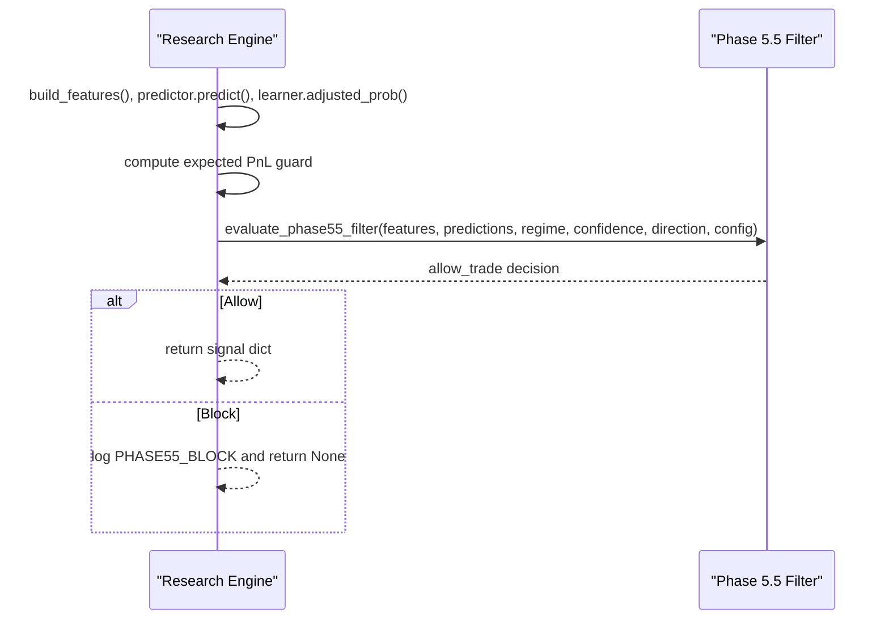
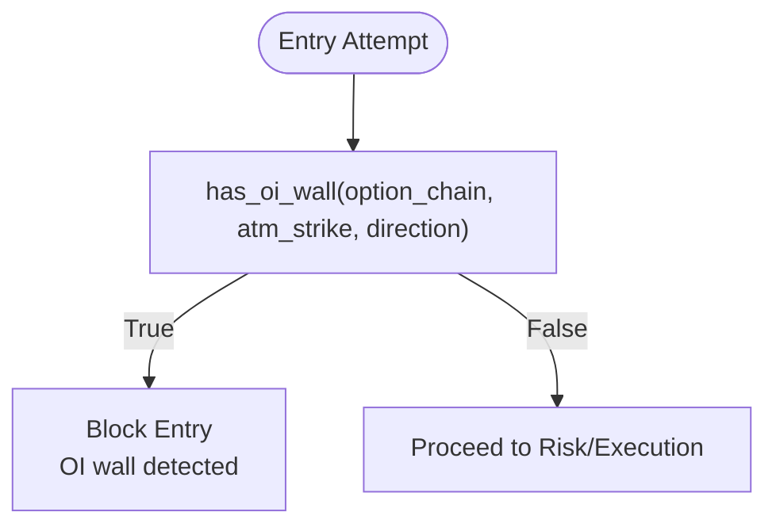
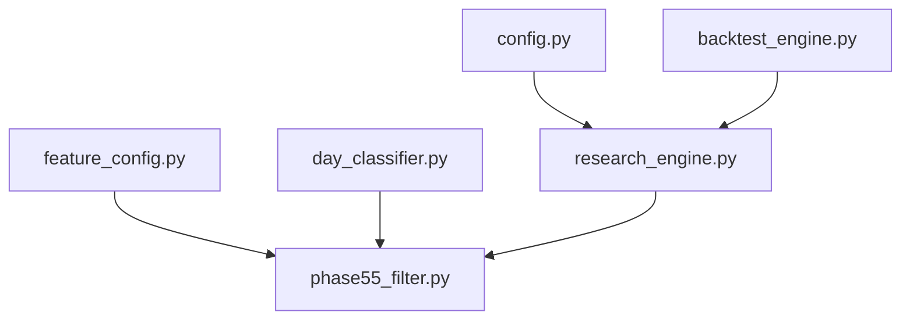

# Intelligent Market Filters

<cite>
**Referenced Files in This Document**
- [phase55_filter.py](file://engine/intelligence/phase55_filter.py)
- [research_engine.py](file://research/backtest/engine/research_engine.py)
- [feature_config.py](file://ml/feature_config.py)
- [day_classifier.py](file://ml/day_classifier.py)
- [config.py](file://engine/config/config.py)
- [filters.py](file://engine/execution/filters.py)
- [backtest_engine.py](file://backtest/backtest_engine.py)
</cite>

## Table of Contents
1. [Introduction](#introduction)
2. [Project Structure](#project-structure)
3. [Core Components](#core-components)
4. [Architecture Overview](#architecture-overview)
5. [Detailed Component Analysis](#detailed-component-analysis)
6. [Dependency Analysis](#dependency-analysis)
7. [Performance Considerations](#performance-considerations)
8. [Troubleshooting Guide](#troubleshooting-guide)
9. [Conclusion](#conclusion)
10. [Appendices](#appendices)

## Introduction
This document explains the intelligent market filters system with a focus on the Phase 5.5 filter used for market condition assessment and custom rule implementation. It details how the filter analyzes market regimes, identifies trending versus ranging conditions, and provides bias signals to the trading engine. It also documents decision logic, inputs, outputs, configuration options, and integration points across live and research backtesting environments. Finally, it provides guidance for creating specialized filters, performance monitoring, backtesting procedures, and optimization techniques.

## Project Structure
The intelligent filtering layer is implemented as a standalone module that can be invoked by both live and research engines. The key components are:
- Phase 5.5 filter module: regime inference, thresholds, and block/allow decisions
- Feature pipeline: standardized feature set including ADX, DI spread, volatility, and trend alignment
- Day classifier: day-level regime classification (TREND/RANGE/VOLATILE)
- Research backtest engine: integrates Phase 5.5 into signal generation
- Execution filters: additional execution-time guards (e.g., OI wall detection)
- Configuration: environment-driven parameters controlling behavior

**Diagram sources**
- [phase55_filter.py:53-79](file://engine/intelligence/phase55_filter.py#L53-L79)
- [phase55_filter.py:96-199](file://engine/intelligence/phase55_filter.py#L96-L199)
- [research_engine.py:289-300](file://research/backtest/engine/research_engine.py#L289-L300)
- [feature_config.py:25-64](file://ml/feature_config.py#L25-L64)
- [filters.py:4-38](file://engine/execution/filters.py#L4-L38)

**Section sources**
- [phase55_filter.py:1-200](file://engine/intelligence/phase55_filter.py#L1-L200)
- [research_engine.py:289-300](file://research/backtest/engine/research_engine.py#L289-L300)
- [feature_config.py:25-64](file://ml/feature_config.py#L25-L64)
- [day_classifier.py:293-339](file://ml/day_classifier.py#L293-L339)
- [filters.py:4-38](file://engine/execution/filters.py#L4-L38)

## Core Components
- Phase 5.5 Filter:
  - Regime inference from features (ADX, DI spread, volatility)
  - Side-specific thresholds for CE quality and PE directional confidence
  - Optional mixed-regime blocking for CE
  - Returns allow/block decision with confidence adjustment and applied filters
- Feature Pipeline:
  - Produces canonical features including direction stack (Supertrend, VWAP bias, ADX, DI spread, EMA alignment, volume ratio)
  - Ensures consistent feature names and ranges for model compatibility
- Day Classifier:
  - Classifies days at 9:45 using first 30 minutes of data into TREND/RANGE/VOLATILE
  - Provides confidence and should_trade_orb gating
- Research Engine Integration:
  - Calls Phase 5.5 after ML threshold checks and expected PnL guard
  - Logs block reasons and continues or aborts signal based on decision
- Execution Filters:
  - Additional guards like OI wall detection to avoid entries against large open interest walls

**Section sources**
- [phase55_filter.py:53-79](file://engine/intelligence/phase55_filter.py#L53-L79)
- [phase55_filter.py:96-199](file://engine/intelligence/phase55_filter.py#L96-L199)
- [feature_config.py:82-252](file://ml/feature_config.py#L82-L252)
- [day_classifier.py:293-339](file://ml/day_classifier.py#L293-L339)
- [research_engine.py:289-300](file://research/backtest/engine/research_engine.py#L289-L300)
- [filters.py:4-38](file://engine/execution/filters.py#L4-L38)

## Architecture Overview
The Phase 5.5 filter sits between feature computation and trade execution. It receives market features, ML predictions, current regime, and confidence scores, then applies configurable thresholds and regime rules to decide whether to allow or block a trade. In research backtests, it is explicitly called during entry checks; in live systems, similar logic can be integrated via the same interface.

**Diagram sources**
- [research_engine.py:289-300](file://research/backtest/engine/research_engine.py#L289-L300)
- [phase55_filter.py:96-199](file://engine/intelligence/phase55_filter.py#L96-L199)
- [feature_config.py:82-252](file://ml/feature_config.py#L82-L252)
- [day_classifier.py:293-339](file://ml/day_classifier.py#L293-L339)
- [filters.py:4-38](file://engine/execution/filters.py#L4-L38)

## Detailed Component Analysis

### Phase 5.5 Filter: Decision Logic and Outputs
- Inputs:
  - market_features: dictionary containing indicators such as adx, di_spread, volatility
  - ml_predictions: side probabilities (CE/PE)
  - current_regime: normalized regime string (trend/range/volatile_trend/mixed)
  - confidence_scores: side_confidence or side-specific confidence keys
  - direction: "CE" or "PE"
  - config: Phase55FilterConfig instance
- Regime Inference:
  - Uses ADX, DI spread, and volatility to infer regime when not provided or unknown
  - Normalizes various regime strings to canonical forms
- Thresholds:
  - CE quality threshold: blocks low-quality CE opportunities below configured threshold
  - PE directional threshold: blocks low-directional-confidence PE opportunities below configured threshold
  - Mixed regime filter: optional block for CE trades in mixed regime
- Output Schema:
  - allow_trade: boolean indicating if trade is permitted
  - confidence_adjustment: numeric adjustment (negative when blocked)
  - blocking_reason: human-readable reason for block
  - recommendation: action suggestion (e.g., allow_phase55, phase55_disabled)
  - applied_filters: list of filters applied during evaluation

**Diagram sources**
- [phase55_filter.py:53-79](file://engine/intelligence/phase55_filter.py#L53-L79)
- [phase55_filter.py:96-199](file://engine/intelligence/phase55_filter.py#L96-L199)

**Section sources**
- [phase55_filter.py:1-200](file://engine/intelligence/phase55_filter.py#L1-L200)

### Feature Pipeline: Inputs for Regime Assessment
- Canonical Features:
  - Direction stack: supertrend_dir, supertrend_dist, price_vs_vwap, adx, di_spread, ema_alignment, volume_ratio
  - Core indicators: ema20, ema50, macd, returns, volatility, rsi, atr, trend_strength
  - Time/session features: hour, weekday, mins_since_open, mins_to_close, session_open, session_close
  - Options-specific: time_to_expiry_min, moneyness
  - Reversal/momentum: momentum_velocity, range_compression, wick_ratio, body_efficiency, mom3_strength, upper_wick, lower_wick, close_position
- Role in Phase 5.5:
  - ADX, DI spread, and volatility feed regime inference
  - Confidence scores may reference side_confidence or side-specific keys

**Diagram sources**
- [feature_config.py:25-64](file://ml/feature_config.py#L25-L64)
- [feature_config.py:82-252](file://ml/feature_config.py#L82-L252)
- [phase55_filter.py:53-79](file://engine/intelligence/phase55_filter.py#L53-L79)
- [phase55_filter.py:96-199](file://engine/intelligence/phase55_filter.py#L96-L199)

**Section sources**
- [feature_config.py:25-64](file://ml/feature_config.py#L25-L64)
- [feature_config.py:82-252](file://ml/feature_config.py#L82-L252)

### Day Classifier: Market Regime Context
- Purpose:
  - Classify the entire day at 9:45 using first 30 minutes of data
  - Labels: TREND, RANGE, VOLATILE
  - Provides confidence and should_trade_orb gate
- Usage:
  - Research engine computes regime string ("EXPANSION"/"TREND"/"RANGE") from learner’s day type
  - Phase 5.5 uses normalized regime to apply mixed-regime blocking for CE when enabled

**Diagram sources**
- [day_classifier.py:293-339](file://ml/day_classifier.py#L293-L339)
- [research_engine.py:289-300](file://research/backtest/engine/research_engine.py#L289-L300)
- [phase55_filter.py:53-79](file://engine/intelligence/phase55_filter.py#L53-L79)

**Section sources**
- [day_classifier.py:293-339](file://ml/day_classifier.py#L293-L339)
- [research_engine.py:289-300](file://research/backtest/engine/research_engine.py#L289-L300)

### Research Engine Integration: Where Phase 5.5 Is Applied
- Entry Flow:
  - Build features and compute ML probabilities
  - Apply edge margin and threshold checks
  - Compute expected PnL guard
  - Call Phase 5.5 with features, predictions, regime, confidence, direction, and config
  - If blocked, log reason and skip signal
- Outputs:
  - Signal includes side, probability, stop loss, target, quantity, regime, and timestamps
  - Block reasons tracked for analysis

**Diagram sources**
- [research_engine.py:289-300](file://research/backtest/engine/research_engine.py#L289-L300)
- [phase55_filter.py:96-199](file://engine/intelligence/phase55_filter.py#L96-L199)

**Section sources**
- [research_engine.py:289-300](file://research/backtest/engine/research_engine.py#L289-L300)

### Execution Filters: Additional Guards
- OI Wall Detection:
  - Checks nearby strikes for significant open interest relative to average
  - Blocks entries if a wall exists in the direction of trade
- Use Case:
  - Prevents entering against strong resistance/support indicated by OI concentration

**Diagram sources**
- [filters.py:4-38](file://engine/execution/filters.py#L4-L38)

**Section sources**
- [filters.py:4-38](file://engine/execution/filters.py#L4-L38)

## Dependency Analysis
- Phase 5.5 depends on:
  - Feature pipeline for adx, di_spread, volatility
  - Day classifier for regime context
  - Research engine for invocation and logging
- Backtest engine mirrors live logic but does not directly call Phase 5.5 in its step function; research engine does
- Configuration drives behavior via environment variables

**Diagram sources**
- [feature_config.py:25-64](file://ml/feature_config.py#L25-L64)
- [phase55_filter.py:53-79](file://engine/intelligence/phase55_filter.py#L53-L79)
- [day_classifier.py:293-339](file://ml/day_classifier.py#L293-L339)
- [research_engine.py:289-300](file://research/backtest/engine/research_engine.py#L289-L300)
- [config.py:1-164](file://engine/config/config.py#L1-L164)
- [backtest_engine.py:1-800](file://backtest/backtest_engine.py#L1-L800)

**Section sources**
- [feature_config.py:25-64](file://ml/feature_config.py#L25-L64)
- [phase55_filter.py:53-79](file://engine/intelligence/phase55_filter.py#L53-L79)
- [day_classifier.py:293-339](file://ml/day_classifier.py#L293-L339)
- [research_engine.py:289-300](file://research/backtest/engine/research_engine.py#L289-L300)
- [config.py:1-164](file://engine/config/config.py#L1-L164)
- [backtest_engine.py:1-800](file://backtest/backtest_engine.py#L1-L800)

## Performance Considerations
- Feature computation efficiency:
  - Ensure rolling windows are sized appropriately to avoid excessive recomputation
  - Use vectorized operations where possible (numpy/pandas)
- Threshold tuning:
  - Calibrate CE quality and PE directional thresholds using historical data
  - Monitor false positive/negative rates under different regimes
- Regime sensitivity:
  - Adjust ADX and volatility thresholds to reflect changing market conditions
  - Validate mixed-regime blocking effectiveness across sessions
- Execution overhead:
  - Minimize redundant computations in hot loops
  - Cache regime and feature results per candle when feasible

[No sources needed since this section provides general guidance]

## Troubleshooting Guide
- Common Issues:
  - Missing features: ensure all FEATURE_COLUMNS are present before calling Phase 5.5
  - Incorrect regime normalization: verify input regime strings map to canonical values
  - Threshold misconfiguration: check environment variables and config defaults
  - Blocked signals: inspect blocking_reason and applied_filters to diagnose
- Debugging Steps:
  - Log market_features, ml_predictions, current_regime, and confidence_scores
  - Validate threshold comparisons and regime checks
  - Review research engine telemetry for block reasons

**Section sources**
- [phase55_filter.py:96-199](file://engine/intelligence/phase55_filter.py#L96-L199)
- [research_engine.py:289-300](file://research/backtest/engine/research_engine.py#L289-L300)

## Conclusion
The Phase 5.5 filter provides a robust mechanism for assessing market regimes and applying side-specific thresholds to improve trade quality. Integrated within the research backtest engine, it enhances signal reliability by blocking low-confidence or unfavorable regime setups. With proper configuration and monitoring, it can significantly reduce false entries and improve overall strategy performance.

[No sources needed since this section summarizes without analyzing specific files]

## Appendices

### Configuration Options
- Phase 5.5 Filter:
  - ENABLE_PHASE55_FILTERS: enable/disable filter
  - ENABLE_PHASE55_CE_THRESHOLD: enable CE quality threshold
  - ENABLE_PHASE55_PE_THRESHOLD: enable PE directional threshold
  - ENABLE_PHASE55_REGIME_FILTER: enable mixed regime blocking for CE
  - PHASE55_CE_QUALITY_THRESHOLD: CE quality threshold value
  - PHASE55_PE_DIRECTIONAL_THRESHOLD: PE directional threshold value
- General Config:
  - WARMUP_MINUTES, SKIP_RANGE_REGIME, LUNCH_FILTER_ENABLED, etc.

**Section sources**
- [phase55_filter.py:13-34](file://engine/intelligence/phase55_filter.py#L13-L34)
- [config.py:1-164](file://engine/config/config.py#L1-L164)

### Custom Filter Implementation Guide
- Extend existing architecture by:
  - Adding new threshold checks or regime rules
  - Returning standardized decision schema (allow_trade, confidence_adjustment, blocking_reason, recommendation, applied_filters)
  - Integrating with research engine or live engine via evaluate_phase55_filter-like interface
- Signal Generation:
  - Use market_features and ml_predictions to compute confidence scores
  - Apply domain-specific logic (e.g., high volatility periods, earnings events, economic announcements)
- Integration:
  - Call custom filter after ML threshold and expected PnL guard
  - Log and track block reasons for analysis

[No sources needed since this section provides general guidance]

### Backtesting Procedures
- Run research engine over historical data
- Record signals, blocks, and outcomes
- Analyze performance by regime and side
- Optimize thresholds and parameters using walk-forward or cross-validation

**Section sources**
- [research_engine.py:358-479](file://research/backtest/engine/research_engine.py#L358-L479)
- [backtest_engine.py:1-800](file://backtest/backtest_engine.py#L1-L800)

### Optimization Techniques
- Parameter Sensitivity Analysis:
  - Vary thresholds and observe impact on win rate and expectancy
- Regime-Specific Tuning:
  - Adjust ADX/volatility thresholds per regime
- Monitoring:
  - Track applied_filters and blocking_reason distributions
  - Use telemetry to identify bottlenecks or over-filtering

[No sources needed since this section provides general guidance]