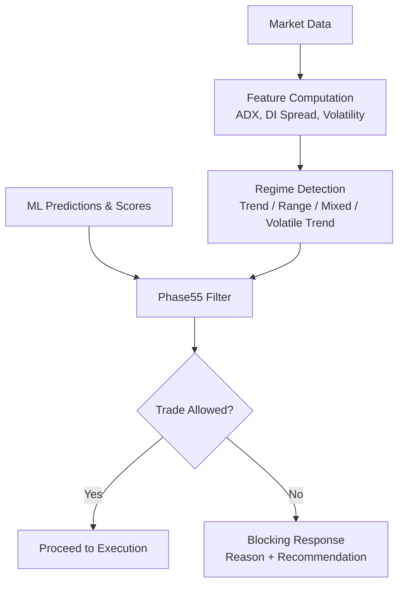
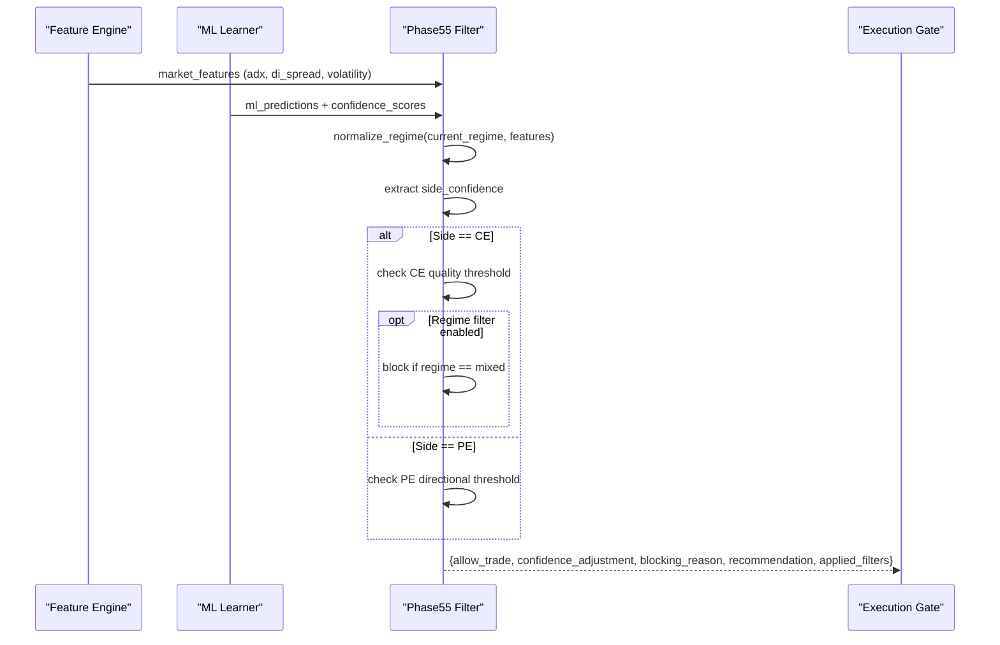
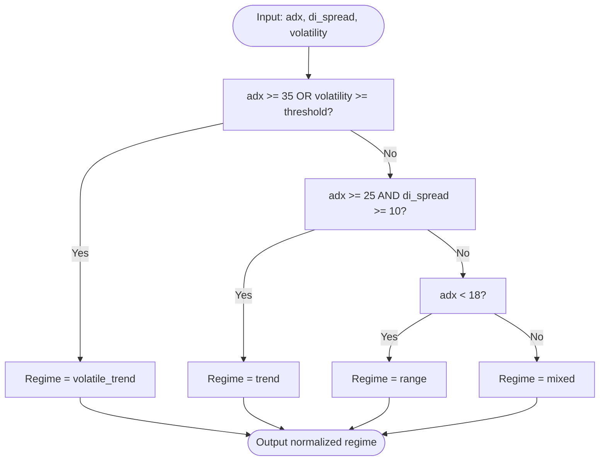
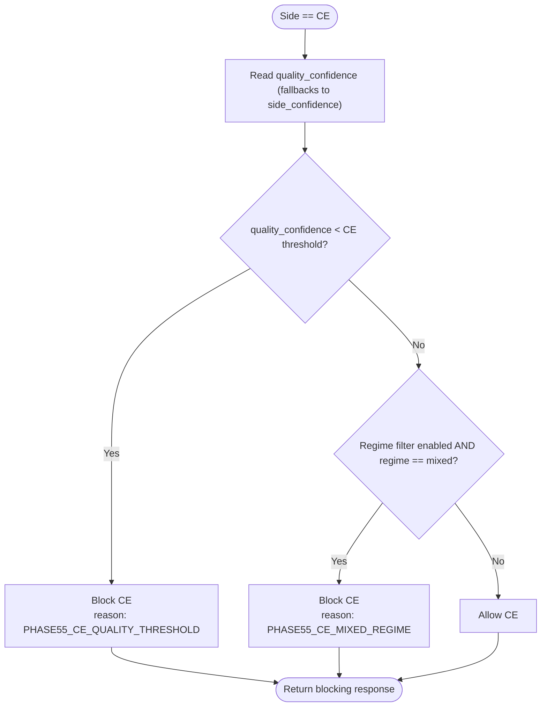
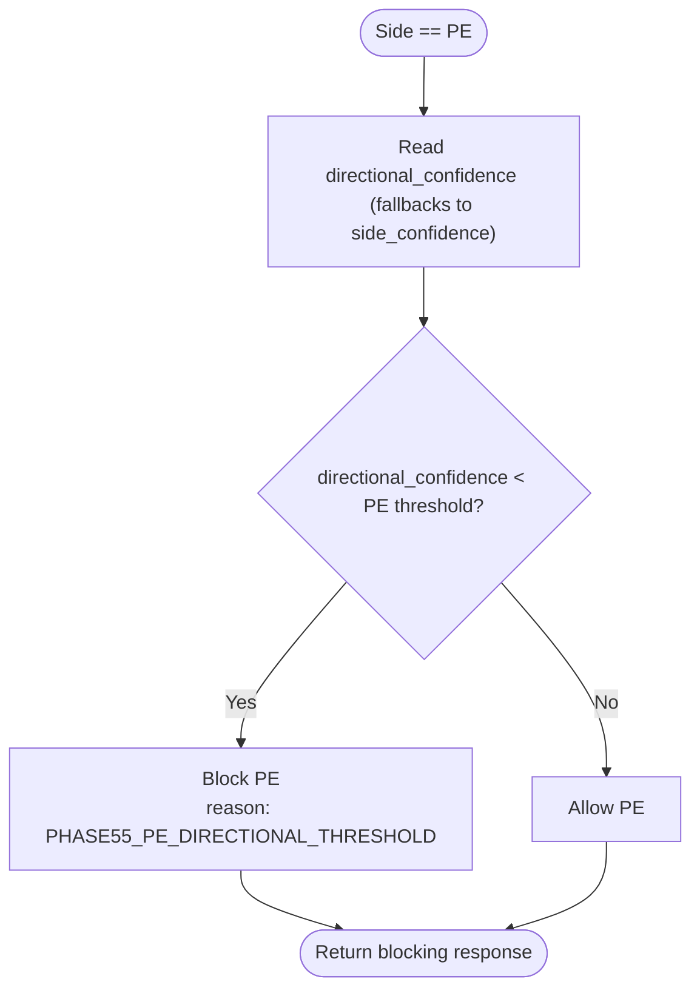
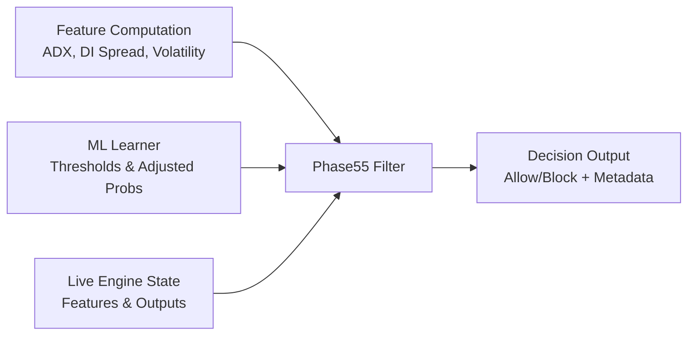

# Phase55 Market Analysis

<cite>
**Referenced Files in This Document**
- [phase55_filter.py](file://engine/intelligence/phase55_filter.py)
- [config.py](file://engine/config/config.py)
- [ml_intraday_learner.py](file://ml/ml_intraday_learner.py)
- [feature_config.py](file://ml/feature_config.py)
- [dataset_builder.py](file://ml/dataset_builder.py)
- [research_engine.py](file://research/backtest/engine/research_engine.py)
- [live_engine.py](file://engine/live_engine.py)
</cite>

## Table of Contents
1. [Introduction](#introduction)
2. [Project Structure](#project-structure)
3. [Core Components](#core-components)
4. [Architecture Overview](#architecture-overview)
5. [Detailed Component Analysis](#detailed-component-analysis)
6. [Dependency Analysis](#dependency-analysis)
7. [Performance Considerations](#performance-considerations)
8. [Troubleshooting Guide](#troubleshooting-guide)
9. [Conclusion](#conclusion)
10. [Appendices](#appendices)

## Introduction
This document explains the Phase55 market analysis filter system that gates trading eligibility and adjusts confidence based on current market regime, ML predictions, and side-specific thresholds. It details how the filter identifies trending vs ranging markets using ADX, DI spread, and volatility; how it enforces CE quality and PE directional thresholds; and how it returns a blocking response with clear reasoning when conditions are unfavorable. It also provides configuration options to enable/disable filters and adjust thresholds, plus examples of how inputs flow through the filter to produce trade approval decisions.

## Project Structure
The Phase55 filter lives under the intelligence module and integrates with feature computation, ML prediction pipelines, and live execution. Key integration points include:
- Feature computation for ADX, DI spread, and volatility used by regime detection
- ML learner thresholds and adjusted probabilities that feed into confidence scoring
- Live engine state that exposes features and ML outputs consumed by the filter
- Research backtest engine that mirrors live logic and imports the Phase55 filter

**Diagram sources**
- [phase55_filter.py:53-78](file://engine/intelligence/phase55_filter.py#L53-L78)
- [feature_config.py:111-132](file://ml/feature_config.py#L111-L132)
- [dataset_builder.py:105-110](file://ml/dataset_builder.py#L105-L110)
- [research_engine.py:182-200](file://research/backtest/engine/research_engine.py#L182-L200)

**Section sources**
- [phase55_filter.py:1-200](file://engine/intelligence/phase55_filter.py#L1-L200)
- [feature_config.py:111-132](file://ml/feature_config.py#L111-L132)
- [dataset_builder.py:105-110](file://ml/dataset_builder.py#L105-L110)
- [research_engine.py:182-200](file://research/backtest/engine/research_engine.py#L182-L200)

## Core Components
- Phase55FilterConfig: Centralized configuration for enabling/disabling filters and setting thresholds for CE quality and PE directional checks, plus regime filtering.
- evaluate_phase55_filter: Main decision function that processes market features, ML predictions, confidence scores, and regime to approve or block trades.
- Regime detection helpers: infer_regime_from_features and normalize_regime translate raw indicators into standardized regimes (trend, range, mixed, volatile_trend).
- Blocking response helper: _blocked_response produces structured rejection output with reason, recommendation, and applied filters.

Key responsibilities:
- Normalize regime from either explicit labels or computed features
- Extract side-specific confidence from multiple possible keys for robustness
- Apply CE quality threshold and optional mixed-regime filter
- Apply PE directional threshold
- Return allow/block decision with metadata for logging and dashboards

**Section sources**
- [phase55_filter.py:12-34](file://engine/intelligence/phase55_filter.py#L12-L34)
- [phase55_filter.py:53-78](file://engine/intelligence/phase55_filter.py#L53-L78)
- [phase55_filter.py:81-93](file://engine/intelligence/phase55_filter.py#L81-L93)
- [phase55_filter.py:96-199](file://engine/intelligence/phase55_filter.py#L96-L199)

## Architecture Overview
The Phase55 filter sits between feature extraction and execution gating. It consumes:
- Market features including ADX, DI spread, and volatility
- ML predictions and confidence scores
- Current regime label or inferred regime
- Direction (CE or PE)

It outputs:
- allow_trade boolean
- confidence_adjustment (negative when blocked)
- blocking_reason and recommendation
- applied_filters list for auditability

**Diagram sources**
- [phase55_filter.py:96-199](file://engine/intelligence/phase55_filter.py#L96-L199)
- [feature_config.py:111-132](file://ml/feature_config.py#L111-L132)
- [dataset_builder.py:105-110](file://ml/dataset_builder.py#L105-L110)

## Detailed Component Analysis

### Regime Detection Logic
The filter determines market regime using:
- ADX: trend strength indicator
- DI spread: absolute difference between directional indicators
- Volatility: recent return standard deviation

Rules:
- If ADX >= 35 or volatility exceeds a specific threshold, classify as volatile_trend
- Else if ADX >= 25 and DI spread >= 10, classify as trend
- Else if ADX < 18, classify as range
- Otherwise, classify as mixed

Normalization handles various input formats and maps synonyms like “volatile”, “expansion”, “gap” to volatile_trend.

**Diagram sources**
- [phase55_filter.py:53-64](file://engine/intelligence/phase55_filter.py#L53-L64)
- [feature_config.py:111-132](file://ml/feature_config.py#L111-L132)
- [dataset_builder.py:105-110](file://ml/dataset_builder.py#L105-L110)

**Section sources**
- [phase55_filter.py:53-78](file://engine/intelligence/phase55_filter.py#L53-L78)
- [feature_config.py:111-132](file://ml/feature_config.py#L111-L132)
- [dataset_builder.py:105-110](file://ml/dataset_builder.py#L105-L110)

### CE Quality Threshold Filtering
For Call Option (CE) directions:
- The filter extracts a quality_confidence value from multiple possible keys to be resilient to schema variations
- Compares against a configurable CE quality threshold
- If below threshold, blocks the trade with a detailed reason and recommendation
- Optionally applies an additional mixed-regime filter to block CE during mixed regimes

**Diagram sources**
- [phase55_filter.py:134-167](file://engine/intelligence/phase55_filter.py#L134-L167)

**Section sources**
- [phase55_filter.py:134-167](file://engine/intelligence/phase55_filter.py#L134-L167)

### PE Directional Threshold Mechanism
For Put Option (PE) directions:
- The filter reads directional_confidence from multiple possible keys
- Compares against a configurable PE directional threshold
- If below threshold, blocks the trade with a detailed reason and recommendation

**Diagram sources**
- [phase55_filter.py:169-191](file://engine/intelligence/phase55_filter.py#L169-L191)

**Section sources**
- [phase55_filter.py:169-191](file://engine/intelligence/phase55_filter.py#L169-L191)

### Configuration Options
Phase55FilterConfig supports:
- enabled: Master switch to enable/disable all Phase55 filters
- ce_threshold_enabled: Toggle CE quality threshold enforcement
- pe_threshold_enabled: Toggle PE directional threshold enforcement
- regime_filter_enabled: Toggle mixed-regime blocking for CE
- ce_quality_threshold: Numeric threshold for CE quality confidence
- pe_directional_threshold: Numeric threshold for PE directional confidence

Configuration is loaded via from_config using environment-backed attributes such as ENABLE_PHASE55_FILTERS, ENABLE_PHASE55_CE_THRESHOLD, ENABLE_PHASE55_PE_THRESHOLD, ENABLE_PHASE55_REGIME_FILTER, PHASE55_CE_QUALITY_THRESHOLD, and PHASE55_PE_DIRECTIONAL_THRESHOLD.

Additional system-level settings relevant to regime and thresholds:
- CHAMPION_THRESHOLD influences ML gating elsewhere in the system
- Adaptive thresholds from the ML learner adjust daily expectations and can affect effective confidence requirements

**Section sources**
- [phase55_filter.py:12-34](file://engine/intelligence/phase55_filter.py#L12-L34)
- [config.py:49-50](file://engine/config/config.py#L49-L50)
- [ml_intraday_learner.py:208-232](file://ml/ml_intraday_learner.py#L208-L232)

### Processing Examples
Below are conceptual examples showing how the filter processes inputs to generate decisions. These illustrate data flow without exposing code content.

Example 1: CE Trade Blocked by Quality Threshold
- Inputs:
  - market_features: adx=28, di_spread=12, volatility=0.0006
  - ml_predictions: ce_prob=0.48
  - confidence_scores: quality_confidence=0.41
  - direction: CE
  - config: ce_threshold_enabled=True, ce_quality_threshold=0.4358
- Flow:
  - Regime inferred as trend (adx>=25 and di_spread>=10)
  - quality_confidence=0.41 < threshold=0.4358
  - Decision: Block CE with reason referencing PHASE55_CE_QUALITY_THRESHOLD
- Output:
  - allow_trade=False
  - confidence_adjustment negative proportional to confidence
  - blocking_reason includes threshold comparison
  - recommendation advises waiting until quality clears threshold

Example 2: PE Trade Blocked by Directional Threshold
- Inputs:
  - market_features: adx=15, di_spread=5, volatility=0.0003
  - ml_predictions: pe_prob=0.44
  - confidence_scores: directional_confidence=0.42
  - direction: PE
  - config: pe_threshold_enabled=True, pe_directional_threshold=0.4645
- Flow:
  - Regime inferred as range (adx<18)
  - directional_confidence=0.42 < threshold=0.4645
  - Decision: Block PE with reason referencing PHASE55_PE_DIRECTIONAL_THRESHOLD
- Output:
  - allow_trade=False
  - confidence_adjustment negative
  - blocking_reason includes threshold comparison
  - recommendation advises waiting until directional confidence clears threshold

Example 3: CE Trade Allowed in Strong Trend
- Inputs:
  - market_features: adx=38, di_spread=15, volatility=0.0007
  - ml_predictions: ce_prob=0.52
  - confidence_scores: quality_confidence=0.50
  - direction: CE
  - config: ce_threshold_enabled=True, regime_filter_enabled=True
- Flow:
  - Regime inferred as volatile_trend (adx>=35)
  - quality_confidence=0.50 >= threshold
  - Regime not mixed, so no mixed-regime block
  - Decision: Allow CE
- Output:
  - allow_trade=True
  - confidence_adjustment=0.0
  - recommendation indicates allowance

**Section sources**
- [phase55_filter.py:53-78](file://engine/intelligence/phase55_filter.py#L53-L78)
- [phase55_filter.py:134-191](file://engine/intelligence/phase55_filter.py#L134-L191)

## Dependency Analysis
The Phase55 filter depends on:
- Feature computation for ADX, DI spread, and volatility
- ML learner thresholds and adjusted probabilities
- Live engine state exposing features and ML outputs

**Diagram sources**
- [feature_config.py:111-132](file://ml/feature_config.py#L111-L132)
- [dataset_builder.py:105-110](file://ml/dataset_builder.py#L105-L110)
- [ml_intraday_learner.py:208-232](file://ml/ml_intraday_learner.py#L208-L232)
- [live_engine.py:1344-1369](file://engine/live_engine.py#L1344-L1369)
- [phase55_filter.py:96-199](file://engine/intelligence/phase55_filter.py#L96-L199)

**Section sources**
- [feature_config.py:111-132](file://ml/feature_config.py#L111-L132)
- [dataset_builder.py:105-110](file://ml/dataset_builder.py#L105-L110)
- [ml_intraday_learner.py:208-232](file://ml/ml_intraday_learner.py#L208-L232)
- [live_engine.py:1344-1369](file://engine/live_engine.py#L1344-L1369)
- [phase55_filter.py:96-199](file://engine/intelligence/phase55_filter.py#L96-L199)

## Performance Considerations
- Lightweight regime inference uses simple numeric comparisons; negligible overhead per cycle
- Flexible score lookup reduces failures due to schema drift, at minimal cost
- Early exits on disabled filters or threshold breaches minimize unnecessary processing
- Configurable thresholds allow tuning to balance sensitivity and throughput

[No sources needed since this section provides general guidance]

## Troubleshooting Guide
Common issues and resolutions:
- Filters disabled: Ensure ENABLE_PHASE55_FILTERS is set appropriately; otherwise all trades bypass Phase55 checks
- CE blocked by quality: Inspect quality_confidence values and consider adjusting PHASE55_CE_QUALITY_THRESHOLD or improving signal quality upstream
- PE blocked by directional: Review directional_confidence and PHASE55_PE_DIRECTIONAL_THRESHOLD; ensure ML predictions reflect current market conditions
- Mixed regime blocks: If regime_filter_enabled is True and regime is mixed, CE trades will be blocked; wait for clearer trend or range signals
- Logging and diagnostics: Use returned applied_filters and blocking_reason to identify which gate triggered; correlate with live_engine market state for context

**Section sources**
- [phase55_filter.py:124-132](file://engine/intelligence/phase55_filter.py#L124-L132)
- [phase55_filter.py:147-167](file://engine/intelligence/phase55_filter.py#L147-L167)
- [phase55_filter.py:181-191](file://engine/intelligence/phase55_filter.py#L181-L191)
- [live_engine.py:1344-1369](file://engine/live_engine.py#L1344-L1369)

## Conclusion
The Phase55 filter provides a robust, configurable gating layer that aligns trading eligibility with market regime and side-specific confidence thresholds. By combining ADX, DI spread, and volatility-based regime detection with CE quality and PE directional thresholds, it prevents entries in unfavorable conditions while allowing high-confidence setups to proceed. Its structured blocking responses offer clear reasons and recommendations, facilitating both automated controls and manual oversight.

[No sources needed since this section summarizes without analyzing specific files]

## Appendices

### Integration Points and Usage
- Research backtest imports and uses Phase55 filter alongside feature computation to mirror live behavior
- Live engine exposes market features and ML outputs consumed by downstream logic; Phase55 can be invoked within entry checks to enforce regime and threshold gates

**Section sources**
- [research_engine.py:34-37](file://research/backtest/engine/research_engine.py#L34-L37)
- [research_engine.py:182-200](file://research/backtest/engine/research_engine.py#L182-L200)
- [live_engine.py:1344-1369](file://engine/live_engine.py#L1344-L1369)