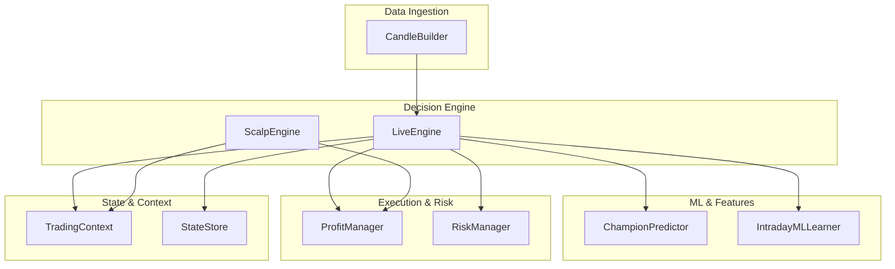
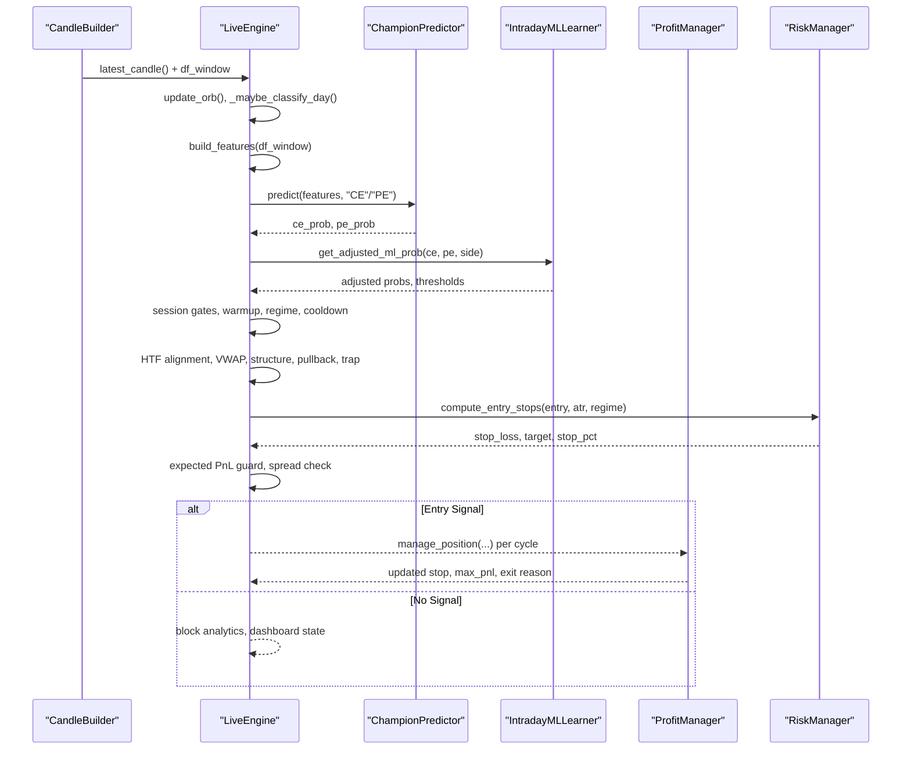
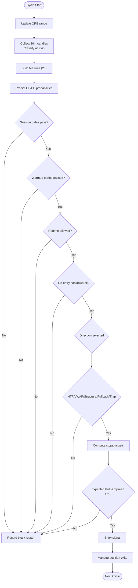
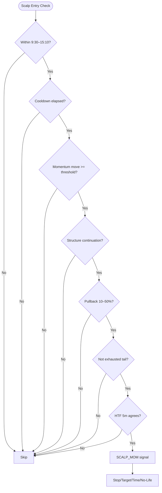
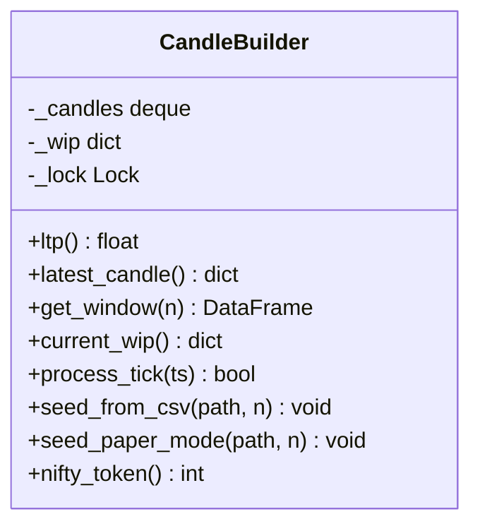
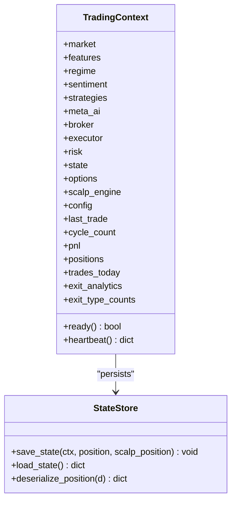
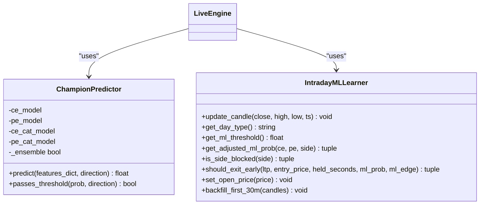
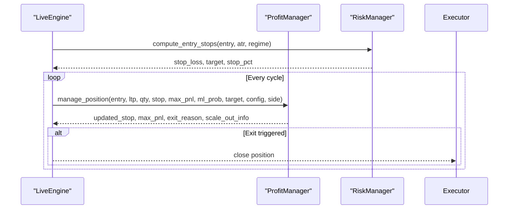
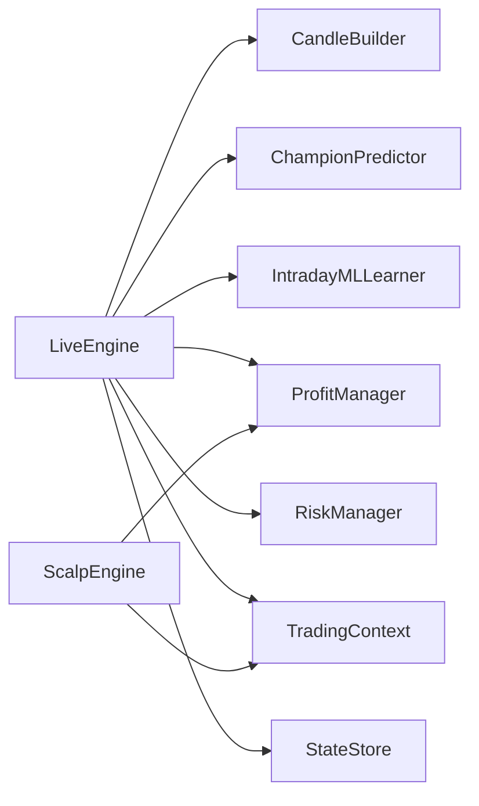

# Core Trading Engine

<cite>
**Referenced Files in This Document**
- [live_engine.py](file://engine/live_engine.py)
- [scalp_engine.py](file://engine/scalping/scalp_engine.py)
- [candle_builder.py](file://engine/data/candle_builder.py)
- [context.py](file://engine/core/context.py)
- [state_store.py](file://engine/core/state_store.py)
- [predictor_champion.py](file://ml/predictor_champion.py)
- [profit_manager.py](file://engine/execution/profit_manager.py)
- [risk_manager.py](file://engine/risk/risk_manager.py)
</cite>

## Table of Contents
1. [Introduction](#introduction)
2. [Project Structure](#project-structure)
3. [Core Components](#core-components)
4. [Architecture Overview](#architecture-overview)
5. [Detailed Component Analysis](#detailed-component-analysis)
6. [Dependency Analysis](#dependency-analysis)
7. [Performance Considerations](#performance-considerations)
8. [Troubleshooting Guide](#troubleshooting-guide)
9. [Conclusion](#conclusion)

## Introduction
This document explains the core trading engine subsystem responsible for real-time decision making and trade execution coordination. It focuses on:
- The live engine architecture that orchestrates ORB (Opening Range Breakout), multi-timeframe analysis, and ML-driven signal generation.
- The scalp engine integration for intraday momentum opportunities.
- Real-time candle building from tick data.
- Context management and persistent state across sessions.
- Session lifecycle controls including warmup, lunch chop avoidance, and end-of-day procedures.
- Error handling, recovery mechanisms, and monitoring.
- Relationships with ML predictors, execution engines, and risk managers.

## Project Structure
The live system is organized around a central LiveEngine that consumes rolling 1-minute candles, builds features, runs ML predictions, applies multi-gate filters (ORB, HTF trend, VWAP, structure, traps), and coordinates exits via profit and risk modules. Supporting components include:
- CandleBuilder for real-time OHLC aggregation from WebSocket ticks.
- ScalpEngine for short-duration momentum trades when the main ML position is flat.
- Context container to decouple modules without direct cross-imports.
- StateStore for atomic persistence of positions and session metrics.
- ML predictor and learner for probability estimation and adaptive thresholds.
- ProfitManager and RiskManager for exit logic and entry stop/target computation.

**Diagram sources**
- [live_engine.py:71-184](file://engine/live_engine.py#L71-L184)
- [candle_builder.py:18-58](file://engine/data/candle_builder.py#L18-L58)
- [scalp_engine.py:11-50](file://engine/scalping/scalp_engine.py#L11-L50)
- [predictor_champion.py:57-100](file://ml/predictor_champion.py#L57-L100)
- [profit_manager.py:173-225](file://engine/execution/profit_manager.py#L173-L225)
- [risk_manager.py:20-59](file://engine/risk/risk_manager.py#L20-L59)
- [context.py:3-78](file://engine/core/context.py#L3-L78)
- [state_store.py:40-94](file://engine/core/state_store.py#L40-L94)

**Section sources**
- [live_engine.py:71-184](file://engine/live_engine.py#L71-L184)
- [candle_builder.py:18-58](file://engine/data/candle_builder.py#L18-L58)
- [scalp_engine.py:11-50](file://engine/scalping/scalp_engine.py#L11-L50)
- [predictor_champion.py:57-100](file://ml/predictor_champion.py#L57-L100)
- [profit_manager.py:173-225](file://engine/execution/profit_manager.py#L173-L225)
- [risk_manager.py:20-59](file://engine/risk/risk_manager.py#L20-L59)
- [context.py:3-78](file://engine/core/context.py#L3-L78)
- [state_store.py:40-94](file://engine/core/state_store.py#L40-L94)

## Core Components
- LiveEngine: Central decision loop; manages ORB tracking, feature building, ML prediction, multi-timeframe confirmation, and exit delegation.
- CandleBuilder: Converts raw ticks into completed 1-minute candles and provides rolling windows for indicators and ML features.
- ScalpEngine: Momentum scalper operating within a defined intraday window with strict confirmation rules and ATR-adaptive stops.
- ChampionPredictor: Loads champion models (LightGBM/CatBoost ensemble optional) and returns calibrated probabilities for CE/PE.
- ProfitManager: Unified trailing stop ladder and scale-out logic for both ML and scalp positions.
- RiskManager: Computes entry stops and targets based on ATR and regime, enforcing capital protection limits.
- TradingContext: Runtime container exposing market, strategies, executor, risk, state, and config to all modules.
- StateStore: Atomic persistence of open positions and session metrics across restarts.

**Section sources**
- [live_engine.py:71-184](file://engine/live_engine.py#L71-L184)
- [candle_builder.py:18-58](file://engine/data/candle_builder.py#L18-L58)
- [scalp_engine.py:11-50](file://engine/scalping/scalp_engine.py#L11-L50)
- [predictor_champion.py:57-100](file://ml/predictor_champion.py#L57-L100)
- [profit_manager.py:173-225](file://engine/execution/profit_manager.py#L173-L225)
- [risk_manager.py:20-59](file://engine/risk/risk_manager.py#L20-L59)
- [context.py:3-78](file://engine/core/context.py#L3-L78)
- [state_store.py:40-94](file://engine/core/state_store.py#L40-L94)

## Architecture Overview
The engine processes each incoming candle through a deterministic pipeline:
1. Update ORB range and day classification at specific times.
2. Build features using rolling window and compute ML probabilities for CE/PE.
3. Apply session gates (ORB build time, closing time, lunch filter).
4. Enforce warmup period and regime filters (skip range days if configured).
5. Check re-entry cooldown and direction bias or predict-first selection.
6. Validate higher-timeframe alignment, VWAP agreement, structure confirmation, pullback timing, and trap detection.
7. Compute entry stops/targets and expected PnL guard; apply spread/slippage checks.
8. On exit, delegate to profit manager for trailing and drawdown logic; enforce time-based exits and early exit signals from the learner.

**Diagram sources**
- [live_engine.py:186-470](file://engine/live_engine.py#L186-L470)
- [live_engine.py:798-1144](file://engine/live_engine.py#L798-L1144)
- [predictor_champion.py:151-208](file://ml/predictor_champion.py#L151-L208)
- [profit_manager.py:173-225](file://engine/execution/profit_manager.py#L173-L225)
- [risk_manager.py:20-59](file://engine/risk/risk_manager.py#L20-L59)

## Detailed Component Analysis

### LiveEngine: ORB, Multi-Timeframe, Signals
- ORB Tracking: Accumulates high/low during 9:15–9:29; reconstructs from historical data if startup occurs after the window closes.
- Day Classification: Collects first 30 minutes of candles and classifies once at 9:45; supports backfill from CSV if late-start.
- Feature Building: Computes 28 features including EMA20/50, RSI-14, ATR-14, Supertrend direction/distance, ADX/DI spread, VWAP bias, and HTF SuperTrend/EMA alignment on 5m/15m/30m.
- Signal Generation: Two paths:
  - Predict-first: ML chooses direction; requires edge margin, threshold, HTF agreement, VWAP alignment, structure confirmation, pullback timing, trap filter, and side-block checks.
  - Legacy direction gate: Uses SuperTrend direction and VWAP confirmation; applies HTF 5m opposition filter, then evaluates ORB breakout and ML thresholds with additional HTF 15m/30m EMA alignment for PE entries.
- Exit Logic: Delegates to profit manager for trailing and drawdown exits; enforces time-based exits and learner early-exit signals.

**Diagram sources**
- [live_engine.py:186-470](file://engine/live_engine.py#L186-L470)
- [live_engine.py:798-1144](file://engine/live_engine.py#L798-L1144)
- [live_engine.py:1378-1455](file://engine/live_engine.py#L1378-L1455)

**Section sources**
- [live_engine.py:186-470](file://engine/live_engine.py#L186-L470)
- [live_engine.py:798-1144](file://engine/live_engine.py#L798-L1144)
- [live_engine.py:1378-1455](file://engine/live_engine.py#L1378-L1455)

### ScalpEngine: Intraday Momentum
- Operates between 9:30 and 15:10; requires minimum momentum move within a configurable window.
- Confirmation rules:
  - Structure: continuation required (HH for CE, LL for PE).
  - Pullback: price must retrace 10–50% (tighter in safe mode).
  - Exhaustion cap: avoid chasing extended moves beyond a threshold.
  - HTF agreement: 5m SuperTrend must agree or not oppose depending on configuration.
- Adaptive SL: ATR-based tiers with open-volatility penalty; fallback to fixed tiers when ATR unavailable.
- Exits: Stop loss, target hit, time-based hold limit, no-life exit if trade never reaches breakeven quickly.

**Diagram sources**
- [scalp_engine.py:52-171](file://engine/scalping/scalp_engine.py#L52-L171)
- [scalp_engine.py:174-280](file://engine/scalping/scalp_engine.py#L174-L280)

**Section sources**
- [scalp_engine.py:52-171](file://engine/scalping/scalp_engine.py#L52-L171)
- [scalp_engine.py:174-280](file://engine/scalping/scalp_engine.py#L174-L280)

### CandleBuilder: Real-Time Price Data Processing
- Aggregates WebSocket ticks into completed 1-minute OHLC candles.
- Provides latest candle, rolling DataFrame window, current WIP candle, and LTP with REST fallback.
- Seeds historical candles at startup to warm indicators immediately.
- Thread-safe updates with locking to prevent race conditions.

**Diagram sources**
- [candle_builder.py:18-58](file://engine/data/candle_builder.py#L18-L58)
- [candle_builder.py:64-108](file://engine/data/candle_builder.py#L64-L108)
- [candle_builder.py:114-192](file://engine/data/candle_builder.py#L114-L192)
- [candle_builder.py:198-317](file://engine/data/candle_builder.py#L198-L317)

**Section sources**
- [candle_builder.py:18-58](file://engine/data/candle_builder.py#L18-L58)
- [candle_builder.py:64-108](file://engine/data/candle_builder.py#L64-L108)
- [candle_builder.py:114-192](file://engine/data/candle_builder.py#L114-L192)
- [candle_builder.py:198-317](file://engine/data/candle_builder.py#L198-L317)

### Context Management and State Store
- TradingContext: Central runtime container holding market, features, strategies, executor, risk, state, options, scalp engine, and config. Provides readiness checks and heartbeat for monitoring.
- StateStore: Persists session date, PnL, trades today, positions, and open positions atomically. Restores only if snapshot is from the current trading day.

**Diagram sources**
- [context.py:3-78](file://engine/core/context.py#L3-L78)
- [state_store.py:40-94](file://engine/core/state_store.py#L40-L94)

**Section sources**
- [context.py:3-78](file://engine/core/context.py#L3-L78)
- [state_store.py:40-94](file://engine/core/state_store.py#L40-L94)

### ML Predictors and Learner Integration
- ChampionPredictor: Loads LightGBM models (and optional CatBoost ensemble), validates features, handles invalid values, and returns probabilities without hard floors to preserve edge/threshold filtering downstream.
- IntradayMLLearner: Provides adaptive thresholds, day-type classification, side-blocking, and early-exit signals; integrated into LiveEngine for dynamic gating.

**Diagram sources**
- [predictor_champion.py:57-100](file://ml/predictor_champion.py#L57-L100)
- [predictor_champion.py:151-208](file://ml/predictor_champion.py#L151-L208)
- [live_engine.py:71-184](file://engine/live_engine.py#L71-L184)
- [live_engine.py:375-470](file://engine/live_engine.py#L375-L470)
- [live_engine.py:1146-1274](file://engine/live_engine.py#L1146-L1274)

**Section sources**
- [predictor_champion.py:57-100](file://ml/predictor_champion.py#L57-L100)
- [predictor_champion.py:151-208](file://ml/predictor_champion.py#L151-L208)
- [live_engine.py:71-184](file://engine/live_engine.py#L71-L184)
- [live_engine.py:375-470](file://engine/live_engine.py#L375-L470)
- [live_engine.py:1146-1274](file://engine/live_engine.py#L1146-L1274)

### Execution and Risk Coordination
- ProfitManager: Unified trailing stop ladder and scale-out logic; ensures locks are cost-aware and never below break-even; identical behavior for ML and scalp positions.
- RiskManager: Computes entry stops and targets based on ATR and regime; enforces capital protection by capping worst-case loss per trade.

**Diagram sources**
- [profit_manager.py:173-225](file://engine/execution/profit_manager.py#L173-L225)
- [risk_manager.py:20-59](file://engine/risk/risk_manager.py#L20-L59)
- [live_engine.py:1378-1455](file://engine/live_engine.py#L1378-L1455)

**Section sources**
- [profit_manager.py:173-225](file://engine/execution/profit_manager.py#L173-L225)
- [risk_manager.py:20-59](file://engine/risk/risk_manager.py#L20-L59)
- [live_engine.py:1378-1455](file://engine/live_engine.py#L1378-L1455)

## Dependency Analysis
- LiveEngine depends on:
  - CandleBuilder for rolling data windows.
  - ChampionPredictor for CE/PE probabilities.
  - IntradayMLLearner for adaptive thresholds, day-type classification, side-blocking, and early exits.
  - ProfitManager for trailing and drawdown exits.
  - RiskManager for entry stop/target computation.
  - TradingContext for shared runtime state and configuration.
  - StateStore for persistence across restarts.
- ScalpEngine integrates with ProfitManager and TradingContext for consistent exit logic and configuration access.
- CandleBuilder interacts with broker for tick data and REST fallback.

**Diagram sources**
- [live_engine.py:71-184](file://engine/live_engine.py#L71-L184)
- [scalp_engine.py:11-50](file://engine/scalping/scalp_engine.py#L11-L50)
- [candle_builder.py:18-58](file://engine/data/candle_builder.py#L18-L58)
- [predictor_champion.py:57-100](file://ml/predictor_champion.py#L57-L100)
- [profit_manager.py:173-225](file://engine/execution/profit_manager.py#L173-L225)
- [risk_manager.py:20-59](file://engine/risk/risk_manager.py#L20-L59)
- [context.py:3-78](file://engine/core/context.py#L3-L78)
- [state_store.py:40-94](file://engine/core/state_store.py#L40-L94)

**Section sources**
- [live_engine.py:71-184](file://engine/live_engine.py#L71-L184)
- [scalp_engine.py:11-50](file://engine/scalping/scalp_engine.py#L11-L50)
- [candle_builder.py:18-58](file://engine/data/candle_builder.py#L18-L58)
- [predictor_champion.py:57-100](file://ml/predictor_champion.py#L57-L100)
- [profit_manager.py:173-225](file://engine/execution/profit_manager.py#L173-L225)
- [risk_manager.py:20-59](file://engine/risk/risk_manager.py#L20-L59)
- [context.py:3-78](file://engine/core/context.py#L3-L78)
- [state_store.py:40-94](file://engine/core/state_store.py#L40-L94)

## Performance Considerations
- Feature computation uses efficient rolling windows and vectorized operations where possible; ensure sufficient history (≥26 candles) before ML inference.
- HTF calculations resample 1m data to 5m/15m/30m; avoid excessive lookbacks to maintain responsiveness.
- VWAP accumulation updates once per minute to reduce redundant computations.
- ScalpEngine momentum checks use sliding windows and exhaustion caps to avoid chasing extended moves.
- ProfitManager ladder logic is O(1) per cycle; ensure max_pnl is accurately tracked for correct lock stages.
- StateStore writes atomically to prevent corruption; batch saves on trade transitions and periodically.

[No sources needed since this section provides general guidance]

## Troubleshooting Guide
Common issues and resolutions:
- Missing features or insufficient data: Ensure CandleBuilder has seeded enough candles and process_tick is called every cycle.
- ORB reconstruction failures: Verify broker API availability and timestamps; fallback leaves ORB empty but ML-only entries remain active.
- Day classifier backfill: If engine starts after 9:45, backfill from CSV to populate day type; otherwise RANGE_REGIME_SKIP may block signals.
- Low ML probabilities: Check model files exist and feature columns match; ensemble mode requires both LGBM and CatBoost files.
- Frequent stop-outs: Review ATR-based stops and initial SL multiplier; consider widening slightly if noise causes premature exits.
- Scalp no-life exits: Ensure momentum moves show life quickly; adjust no-life seconds and breakeven triggers if necessary.
- State persistence errors: Verify file permissions and disk space; logs will indicate save/load failures.

**Section sources**
- [candle_builder.py:114-192](file://engine/data/candle_builder.py#L114-L192)
- [live_engine.py:222-315](file://engine/live_engine.py#L222-L315)
- [live_engine.py:321-439](file://engine/live_engine.py#L321-L439)
- [predictor_champion.py:57-100](file://ml/predictor_champion.py#L57-L100)
- [profit_manager.py:173-225](file://engine/execution/profit_manager.py#L173-L225)
- [scalp_engine.py:246-280](file://engine/scalping/scalp_engine.py#L246-L280)
- [state_store.py:40-94](file://engine/core/state_store.py#L40-L94)

## Conclusion
The core trading engine integrates real-time data processing, robust signal generation, and disciplined risk management to deliver consistent intraday trading decisions. By combining ORB breakout detection, multi-timeframe confirmation, adaptive ML thresholds, and unified exit logic, the system maintains resilience across varying market regimes. ScalpEngine complements the main strategy with focused momentum opportunities, while context and state management ensure continuity across sessions. Continuous monitoring, error handling, and performance optimizations support reliable operation in live environments.

[No sources needed since this section summarizes without analyzing specific files]