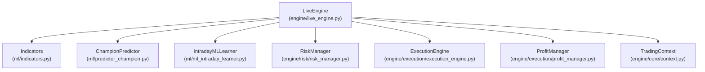
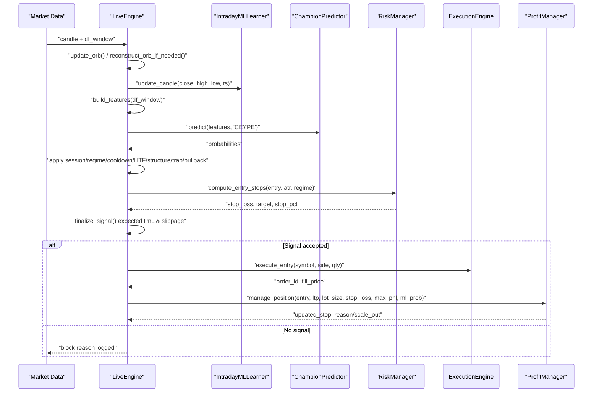
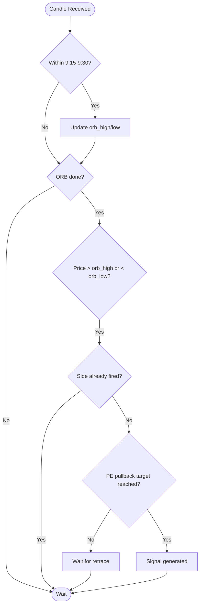
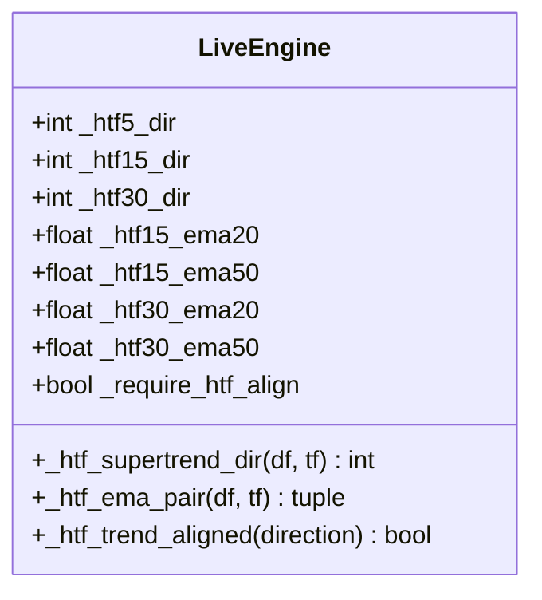
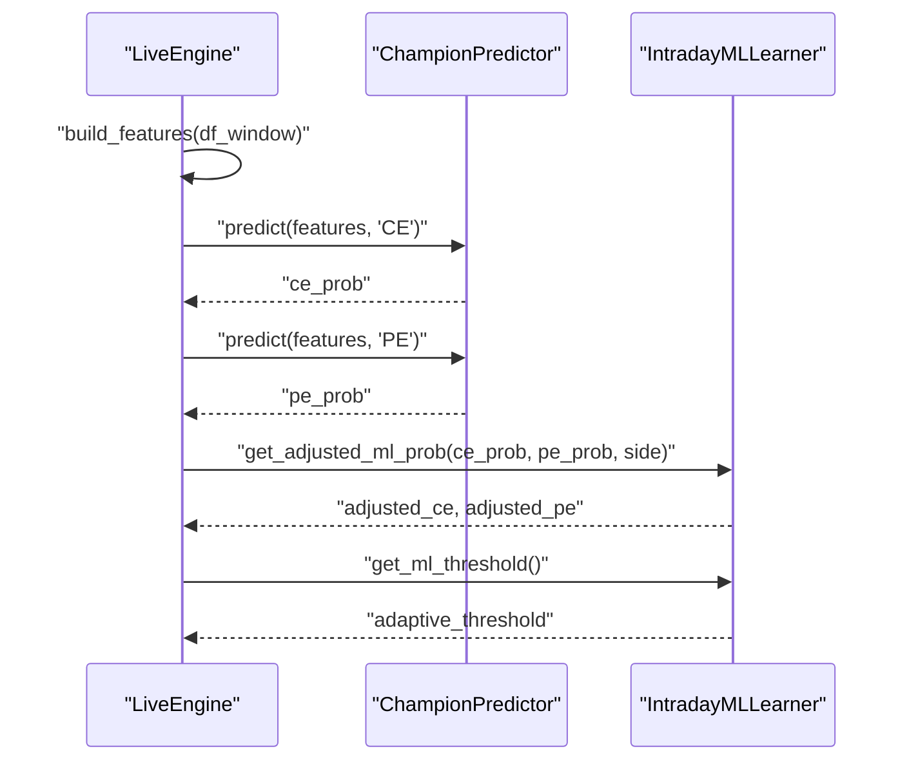
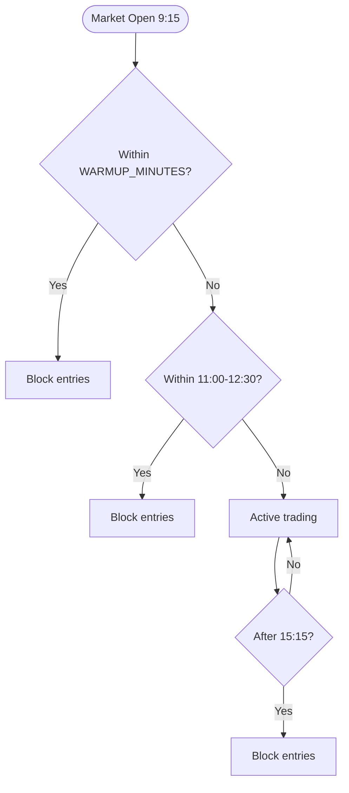
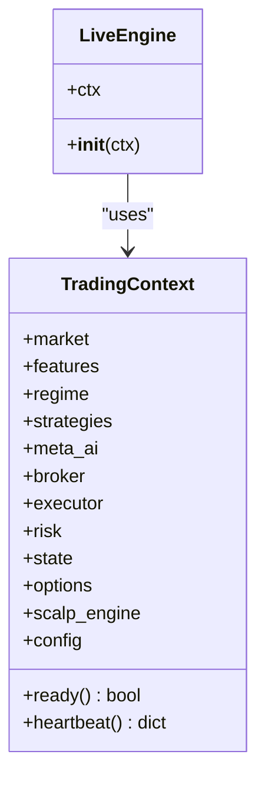
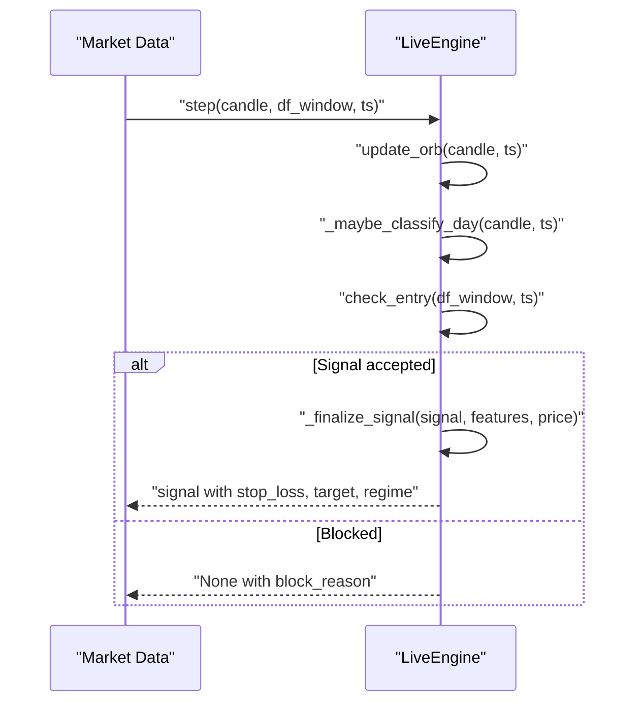
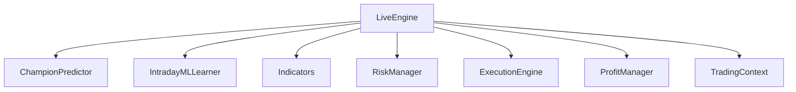

# Live Engine Architecture

<cite>
**Referenced Files in This Document**
- [live_engine.py](file://engine/live_engine.py)
- [predictor_champion.py](file://ml/predictor_champion.py)
- [ml_intraday_learner.py](file://ml/ml_intraday_learner.py)
- [indicators.py](file://ml/indicators.py)
- [context.py](file://engine/core/context.py)
- [risk_manager.py](file://engine/risk/risk_manager.py)
- [execution_engine.py](file://engine/execution/execution_engine.py)
- [profit_manager.py](file://engine/execution/profit_manager.py)
</cite>

## Table of Contents
1. Introduction
2. Project Structure
3. Core Components
4. Architecture Overview
5. Detailed Component Analysis
6. Dependency Analysis
7. Performance Considerations
8. Troubleshooting Guide
9. Conclusion

## Introduction
This document explains the architecture and decision-making flow of the LiveEngine class, which orchestrates an intraday options trading system centered on an Opening Range Breakout (ORB) strategy with multi-timeframe confirmation and machine learning integration. It covers:
- ORB window tracking from 9:15 to 9:30 and breakout detection
- Multi-timeframe analysis combining 1-minute scalping signals with higher timeframe (5m, 15m, 30m) SuperTrend alignment
- ML integration via ChampionPredictor for directional bias and probability-based filtering
- Session lifecycle management including warmup, lunch chop avoidance, and end-of-day procedures
- Context management coordinating ML predictors, execution engines, and risk managers
- Concrete examples of market data flow, signal generation, validation, and state maintenance across sessions

## Project Structure
The LiveEngine resides in engine/live_engine.py and coordinates several subsystems:
- Market data and indicators: live_engine.py uses rolling windows and computes technical indicators (Supertrend, ADX, VWAP) via ml/indicators.py
- ML prediction: ml/predictor_champion.py provides calibrated probabilities; ml/ml_intraday_learner.py adapts thresholds and day-type classification
- Risk and execution: engine/risk/risk_manager.py sets entry stops; engine/execution/execution_engine.py handles order placement and protective stops; engine/execution/profit_manager.py manages trailing exits and scale-outs
- Context: engine/core/context.py centralizes runtime dependencies (broker, executor, risk, config)

**Diagram sources**
- [live_engine.py:71-184](file://engine/live_engine.py#L71-L184)
- [indicators.py:41-90](file://ml/indicators.py#L41-L90)
- [predictor_champion.py:57-100](file://ml/predictor_champion.py#L57-L100)
- [ml_intraday_learner.py:46-99](file://ml/ml_intraday_learner.py#L46-L99)
- [risk_manager.py:20-59](file://engine/risk/risk_manager.py#L20-L59)
- [execution_engine.py:21-47](file://engine/execution/execution_engine.py#L21-L47)
- [profit_manager.py:173-225](file://engine/execution/profit_manager.py#L173-L225)
- [context.py:3-62](file://engine/core/context.py#L3-L62)

**Section sources**
- [live_engine.py:71-184](file://engine/live_engine.py#L71-L184)
- [context.py:3-62](file://engine/core/context.py#L3-L62)

## Core Components
- LiveEngine: Central decision loop that builds features, runs ML predictions, applies ORB and HTF filters, and finalizes signals with risk guards
- ChampionPredictor: Loads champion models (LightGBM and optional CatBoost), validates features, returns calibrated probabilities per side (CE/PE)
- IntradayMLLearner: Tracks day type (TREND/RANGE/VOLATILE/GAP), adapts thresholds and side multipliers based on outcomes, and provides early exit logic
- Indicators: Vectorized Supertrend, ADX, ATR, and session VWAP accumulator used for feature computation and HTF alignment
- RiskManager: Computes tight stop-loss and target levels based on ATR and regime
- ExecutionEngine: Places orders, validates fills, manages protective SL-M orders, and verifies flat positions
- ProfitManager: Implements cost-aware profit ladder, trailing stops, drawdown exits, and scale-out triggers

**Section sources**
- [live_engine.py:71-184](file://engine/live_engine.py#L71-L184)
- [predictor_champion.py:57-100](file://ml/predictor_champion.py#L57-L100)
- [ml_intraday_learner.py:46-99](file://ml/ml_intraday_learner.py#L46-L99)
- [indicators.py:41-90](file://ml/indicators.py#L41-L90)
- [risk_manager.py:20-59](file://engine/risk/risk_manager.py#L20-L59)
- [execution_engine.py:21-47](file://engine/execution/execution_engine.py#L21-L47)
- [profit_manager.py:173-225](file://engine/execution/profit_manager.py#L173-L225)

## Architecture Overview
The LiveEngine processes each completed 1-minute candle through a structured pipeline:
1. Update ORB range (9:15–9:30) and reconstruct if missed
2. Feed first-30-min candles to IntradayMLLearner for day-type classification at 9:45
3. Build 28-feature vector using rolling window and compute direction stack (Supertrend, ADX, VWAP bias, EMA alignment)
4. Predict CE/PE probabilities via ChampionPredictor; adjust with learner’s multipliers and adaptive threshold
5. Apply session gates (warmup, lunch filter, closing window), regime filters (skip RANGE days), re-entry cooldown
6. Validate structure (swing highs/lows), trap filter (failed breakouts), pullback entry (retrace after breakout), and HTF alignment (5m/15m/30m SuperTrend + EMA)
7. Finalize signal with risk stops, expected PnL guard, and slippage checks
8. Execute via ExecutionEngine and manage exits via ProfitManager

**Diagram sources**
- [live_engine.py:186-316](file://engine/live_engine.py#L186-L316)
- [live_engine.py:375-440](file://engine/live_engine.py#L375-L440)
- [live_engine.py:445-590](file://engine/live_engine.py#L445-L590)
- [live_engine.py:798-1144](file://engine/live_engine.py#L798-L1144)
- [predictor_champion.py:151-208](file://ml/predictor_champion.py#L151-L208)
- [risk_manager.py:20-59](file://engine/risk/risk_manager.py#L20-L59)
- [execution_engine.py:94-154](file://engine/execution/execution_engine.py#L94-L154)
- [profit_manager.py:173-225](file://engine/execution/profit_manager.py#L173-L225)

## Detailed Component Analysis

### ORB Strategy Implementation
- Window tracking: The engine accumulates the highest high and lowest low between 9:15 and 9:30 using update_orb(). If the engine starts late, reconstruct_orb_if_needed() fetches historical NIFTY 1-minute candles to seed the ORB range.
- Breakout detection: After the ORB window closes, breakout conditions are checked when price exceeds orb_high (CE) or drops below orb_low (PE). Each side can fire once per day via one-shot flags.
- Pullback entry: For PE entries, the engine waits for a retrace of a defined percentage of the breakout move before entering, reducing whipsaw risk.
- Trap filter: Recent failed breakouts (immediate reversal exceeding a threshold within a lookback) block new entries in the same direction to avoid traps.

**Diagram sources**
- [live_engine.py:190-316](file://engine/live_engine.py#L190-L316)
- [live_engine.py:695-793](file://engine/live_engine.py#L695-L793)

**Section sources**
- [live_engine.py:190-316](file://engine/live_engine.py#L190-L316)
- [live_engine.py:695-793](file://engine/live_engine.py#L695-L793)

### Multi-Timeframe Analysis System
- 1-minute scalping: Features include Supertrend direction, ADX strength, VWAP bias, EMA alignment, and RSI/ATR metrics computed from the rolling 1-minute window.
- Higher timeframe confirmation:
  - 5m SuperTrend direction is computed by resampling the 1-minute window into 5-minute bars and evaluating Supertrend direction.
  - 15m and 30m SuperTrend directions and EMA20 vs EMA50 alignments are computed similarly to ensure trades align with dominant trends.
- Alignment logic: Trades are blocked if HTF directions oppose the intended side, unless insufficient data exists.

**Diagram sources**
- [live_engine.py:538-666](file://engine/live_engine.py#L538-L666)

**Section sources**
- [live_engine.py:538-666](file://engine/live_engine.py#L538-L666)

### ML Integration Architecture
- ChampionPredictor loads LightGBM models for CE and PE, optionally ensembles with CatBoost if available, and validates feature presence and values.
- Probabilities are calibrated and returned per side; thresholds are loaded from model metadata but overridden by the learner’s adaptive threshold to account for de-saturated outputs.
- IntradayMLLearner adjusts side multipliers and thresholds based on daily outcomes, detects day type from the first 30 minutes, and provides early exit signals.

**Diagram sources**
- [live_engine.py:807-828](file://engine/live_engine.py#L807-L828)
- [predictor_champion.py:151-208](file://ml/predictor_champion.py#L151-L208)
- [ml_intraday_learner.py:208-245](file://ml/ml_intraday_learner.py#L208-L245)

**Section sources**
- [live_engine.py:807-828](file://engine/live_engine.py#L807-L828)
- [predictor_champion.py:57-100](file://ml/predictor_champion.py#L57-L100)
- [ml_intraday_learner.py:208-245](file://ml/ml_intraday_learner.py#L208-L245)

### Session Lifecycle Management
- Warmup period: No entries until WARMUP_MINUTES after market open to allow ML learner warmup and avoid early noise.
- Lunch chop avoidance: Optional filter blocks entries during 11:00–12:30 to reduce low-quality trades.
- End-of-day procedures: Entries blocked after 15:15; VWAP reset at session open; day classifier locks at 9:45.
- Day classification: First 30 minutes’ data determines TREND/RANGE/VOLATILE/GAP day type, influencing thresholds and behavior.

**Diagram sources**
- [live_engine.py:27-49](file://engine/live_engine.py#L27-L49)
- [live_engine.py:829-850](file://engine/live_engine.py#L829-L850)
- [live_engine.py:375-440](file://engine/live_engine.py#L375-L440)

**Section sources**
- [live_engine.py:27-49](file://engine/live_engine.py#L27-L49)
- [live_engine.py:829-850](file://engine/live_engine.py#L829-L850)
- [live_engine.py:375-440](file://engine/live_engine.py#L375-L440)

### Context Management System
- TradingContext centralizes all runtime modules (market, features, strategies, broker, executor, risk, config) ensuring loose coupling and clear ownership.
- LiveEngine depends on context for configuration, broker access, and execution coordination without direct cross-imports among subsystems.

**Diagram sources**
- [context.py:3-62](file://engine/core/context.py#L3-L62)
- [live_engine.py:71-184](file://engine/live_engine.py#L71-L184)

**Section sources**
- [context.py:3-62](file://engine/core/context.py#L3-L62)
- [live_engine.py:71-184](file://engine/live_engine.py#L71-L184)

### Concrete Examples of Market Data Flow and State Maintenance
- Market data enters via step(market_data, ts), which updates ORB, feeds day classifier, and calls check_entry() to evaluate signals.
- Signals are validated through multiple layers: session gates, regime filters, re-entry cooldown, structure confirmation, trap filter, pullback entry, HTF alignment, and risk/PnL guards.
- State is maintained across cycles: ORB range, VWAP accumulator, direction bias, swing highs/lows, recent breakouts, and ML history for percentile scoring.

**Diagram sources**
- [live_engine.py:1461-1494](file://engine/live_engine.py#L1461-L1494)
- [live_engine.py:798-1144](file://engine/live_engine.py#L798-L1144)

**Section sources**
- [live_engine.py:1461-1494](file://engine/live_engine.py#L1461-L1494)
- [live_engine.py:798-1144](file://engine/live_engine.py#L798-L1144)

## Dependency Analysis
- LiveEngine depends on:
  - ML components: ChampionPredictor for probabilities, IntradayMLLearner for adaptive thresholds and day-type classification
  - Indicators: Supertrend, ADX, VWAP for feature computation and HTF alignment
  - Risk and execution: RiskManager for stops, ExecutionEngine for orders, ProfitManager for trailing exits
  - Context: Centralized access to broker, executor, risk, and configuration

**Diagram sources**
- [live_engine.py:71-184](file://engine/live_engine.py#L71-L184)
- [predictor_champion.py:57-100](file://ml/predictor_champion.py#L57-L100)
- [ml_intraday_learner.py:46-99](file://ml/ml_intraday_learner.py#L46-L99)
- [indicators.py:41-90](file://ml/indicators.py#L41-L90)
- [risk_manager.py:20-59](file://engine/risk/risk_manager.py#L20-L59)
- [execution_engine.py:21-47](file://engine/execution/execution_engine.py#L21-L47)
- [profit_manager.py:173-225](file://engine/execution/profit_manager.py#L173-L225)
- [context.py:3-62](file://engine/core/context.py#L3-L62)

**Section sources**
- [live_engine.py:71-184](file://engine/live_engine.py#L71-L184)
- [predictor_champion.py:57-100](file://ml/predictor_champion.py#L57-L100)
- [ml_intraday_learner.py:46-99](file://ml/ml_intraday_learner.py#L46-L99)
- [indicators.py:41-90](file://ml/indicators.py#L41-L90)
- [risk_manager.py:20-59](file://engine/risk/risk_manager.py#L20-L59)
- [execution_engine.py:21-47](file://engine/execution/execution_engine.py#L21-L47)
- [profit_manager.py:173-225](file://engine/execution/profit_manager.py#L173-L225)
- [context.py:3-62](file://engine/core/context.py#L3-L62)

## Performance Considerations
- Feature computation efficiency: Rolling window operations and vectorized indicator calculations minimize overhead per cycle.
- Deduplication: Per-minute guards prevent redundant learner updates and VWAP recalculations, avoiding inflated state.
- Adaptive thresholds: Learner-adjusted thresholds and side multipliers reduce false positives and improve signal quality over time.
- HTF alignment: Requiring trend agreement on 5m/15m/30m reduces whipsaw entries and improves win rate consistency.
- Cost-aware exits: ProfitManager ensures no lock below round-trip costs, protecting against guaranteed losses from small moves.

[No sources needed since this section provides general guidance]

## Troubleshooting Guide
- Missing ORB data: If engine starts after 9:30, reconstruct_orb_if_needed() attempts to fetch historical data; failures log warnings and proceed with ML-only entries.
- Insufficient features: build_features() requires at least 26 rows; missing columns or invalid values return None and block signals.
- ML prediction failures: ChampionPredictor logs warnings for missing or invalid features and returns None; ensure feature pipeline completeness.
- Execution issues: ExecutionEngine polls for fill prices and validates orders; failures log errors and skip position tracking.
- Exit logic: ProfitManager handles trailing stops and drawdown exits; monitor ladder stages and scale-out triggers for performance tuning.

**Section sources**
- [live_engine.py:222-316](file://engine/live_engine.py#L222-L316)
- [live_engine.py:445-470](file://engine/live_engine.py#L445-L470)
- [predictor_champion.py:151-208](file://ml/predictor_champion.py#L151-L208)
- [execution_engine.py:52-88](file://engine/execution/execution_engine.py#L52-L88)
- [profit_manager.py:173-225](file://engine/execution/profit_manager.py#L173-L225)

## Conclusion
The LiveEngine integrates ORB breakout detection, multi-timeframe confirmation, and machine learning to generate robust intraday trading signals. Its modular design, guided by TradingContext, enables clear separation of concerns between prediction, risk management, and execution. The system’s adaptive mechanisms—day-type classification, threshold adjustment, and cost-aware exits—enhance resilience across varying market regimes. By maintaining strict session controls and validating signals through multiple filters, the engine aims to deliver consistent performance while minimizing risk exposure.

[No sources needed since this section summarizes without analyzing specific files]