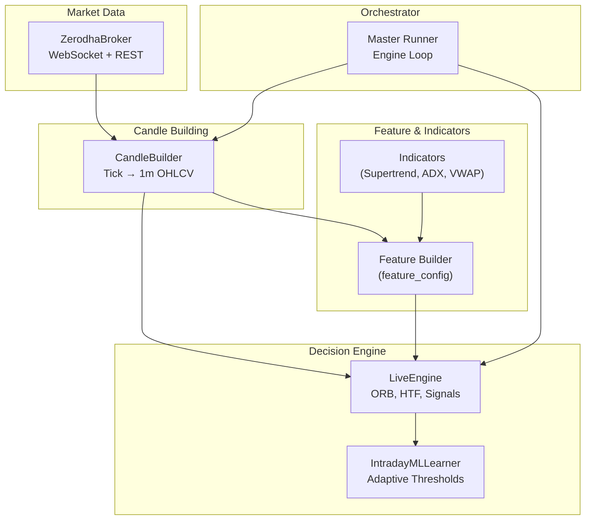
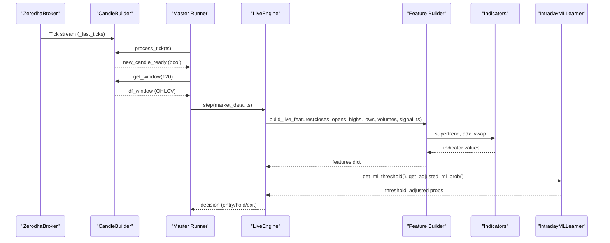
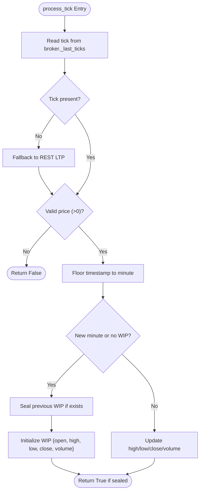
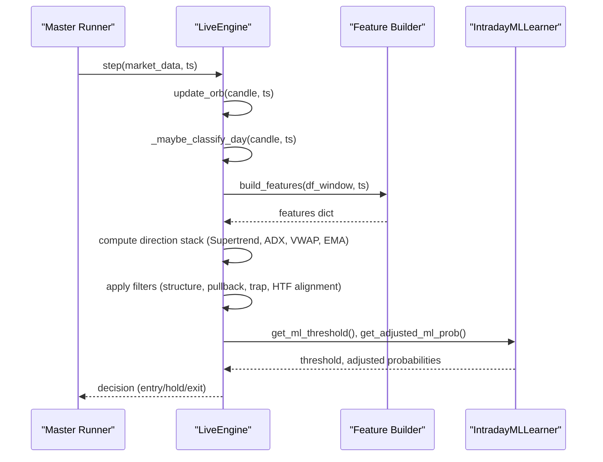
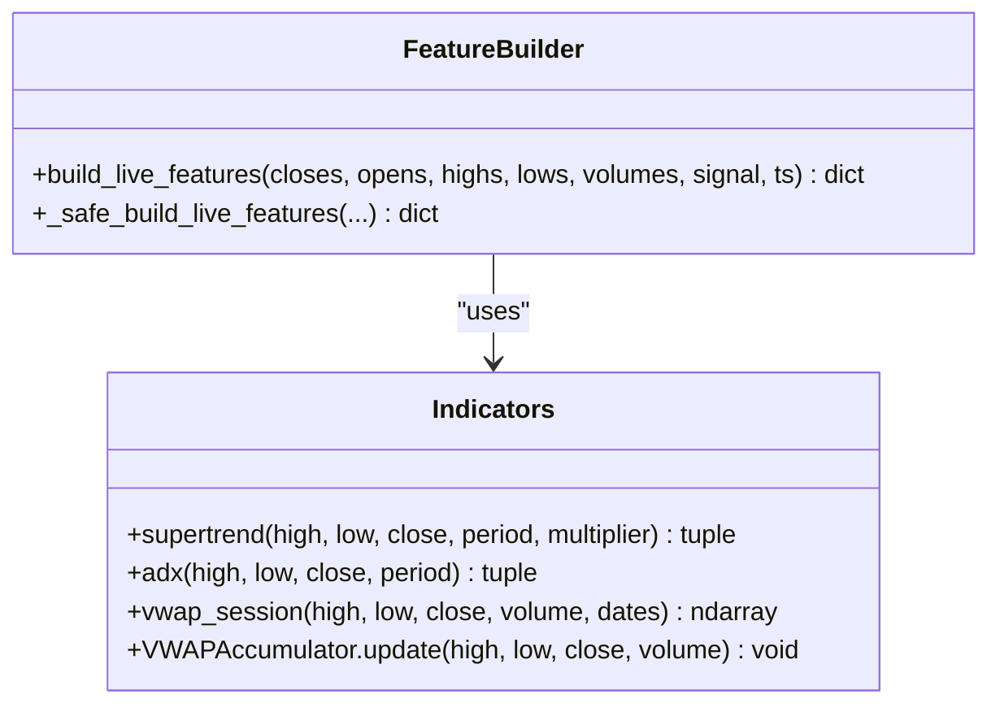
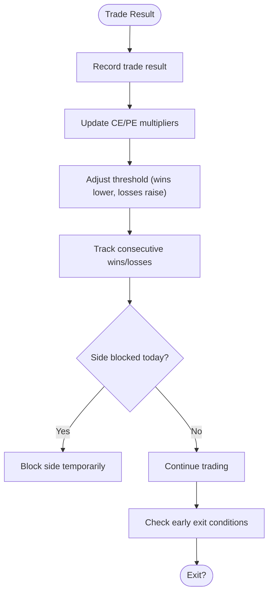
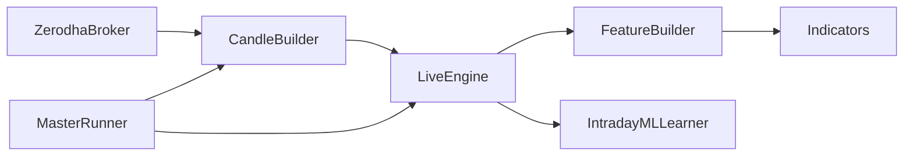

# Real-time Data Processing

<cite>
**Referenced Files in This Document**
- [candle_builder.py](file://engine/data/candle_builder.py)
- [live_engine.py](file://engine/live_engine.py)
- [feature_config.py](file://ml/feature_config.py)
- [indicators.py](file://ml/indicators.py)
- [broker.py](file://engine/execution/broker.py)
- [master_runner.py](file://master_runner.py)
- [ml_intraday_learner.py](file://ml/ml_intraday_learner.py)
</cite>

## Table of Contents
1. [Introduction](#introduction)
2. [Project Structure](#project-structure)
3. [Core Components](#core-components)
4. [Architecture Overview](#architecture-overview)
5. [Detailed Component Analysis](#detailed-component-analysis)
6. [Dependency Analysis](#dependency-analysis)
7. [Performance Considerations](#performance-considerations)
8. [Troubleshooting Guide](#troubleshooting-guide)
9. [Conclusion](#conclusion)

## Introduction
This document explains the real-time data processing subsystem that transforms raw market ticks into structured OHLCV candles and feeds them into feature engineering and ML-driven trading decisions. The centerpiece is the CandleBuilder, which aggregates WebSocket ticks from Zerodha into 1-minute completed candles while maintaining a rolling window for downstream components. It integrates with the live engine to build features, run predictions, and manage signals, including opening range breakout (ORB), higher-timeframe trend alignment, and adaptive thresholds based on intraday learning.

## Project Structure
The real-time pipeline spans several modules:
- Market data ingestion via Zerodha broker WebSocket
- Candle aggregation and rolling buffer management
- Feature computation and indicator calculations
- Live decision engine orchestrating signals and exits
- Intraday learner adapting thresholds and day-type context

**Diagram sources**
- [broker.py:59-122](file://engine/execution/broker.py#L59-L122)
- [candle_builder.py:18-192](file://engine/data/candle_builder.py#L18-L192)
- [feature_config.py:82-267](file://ml/feature_config.py#L82-L267)
- [indicators.py:41-129](file://ml/indicators.py#L41-L129)
- [live_engine.py:71-800](file://engine/live_engine.py#L71-L800)
- [ml_intraday_learner.py:46-233](file://ml/ml_intraday_learner.py#L46-L233)
- [master_runner.py:1126-1181](file://master_runner.py#L1126-L1181)

**Section sources**
- [broker.py:59-122](file://engine/execution/broker.py#L59-L122)
- [candle_builder.py:18-192](file://engine/data/candle_builder.py#L18-L192)
- [feature_config.py:82-267](file://ml/feature_config.py#L82-L267)
- [indicators.py:41-129](file://ml/indicators.py#L41-L129)
- [live_engine.py:71-800](file://engine/live_engine.py#L71-L800)
- [ml_intraday_learner.py:46-233](file://ml/ml_intraday_learner.py#L46-L233)
- [master_runner.py:1126-1181](file://master_runner.py#L1126-L1181)

## Core Components
- CandleBuilder: Converts raw ticks into completed 1-minute OHLCV candles, maintains a rolling buffer, exposes latest candle and windowed DataFrame, and supports seeding from historical CSV or paper mode.
- LiveEngine: Orchestrates ORB tracking, feature building, direction bias, higher-timeframe alignment, trap/pullback filters, and entry/exit logic.
- Feature Builder: Produces a fixed set of 36 features used by ML models, including a “direction stack” (Supertrend direction/distance, VWAP bias, ADX, DI spread, EMA alignment, volume ratio).
- Indicators: Vectorized implementations of Supertrend, ADX, and VWAP accumulator for live use.
- IntradayMLLearner: Adapts thresholds and side multipliers based on daily outcomes, detects day type early in session, and provides early exit guidance.
- Master Runner: Main loop that drives tick processing, candle persistence, and calls the live engine step each cycle.

**Section sources**
- [candle_builder.py:18-192](file://engine/data/candle_builder.py#L18-L192)
- [live_engine.py:71-800](file://engine/live_engine.py#L71-L800)
- [feature_config.py:25-64](file://ml/feature_config.py#L25-L64)
- [indicators.py:41-129](file://ml/indicators.py#L41-L129)
- [ml_intraday_learner.py:46-233](file://ml/ml_intraday_learner.py#L46-L233)
- [master_runner.py:1126-1181](file://master_runner.py#L1126-L1181)

## Architecture Overview
The system ingests ticks from Zerodha’s WebSocket, aggregates them into 1-minute candles, and passes a rolling window to the live engine. The engine builds features using indicators and time/session context, then runs ML-based signal detection with multiple filters (ORB, structure confirmation, pullback, trap filter, higher-timeframe alignment). Adaptive thresholds from the intraday learner modulate confidence requirements throughout the day.

**Diagram sources**
- [broker.py:78-91](file://engine/execution/broker.py#L78-L91)
- [candle_builder.py:114-192](file://engine/data/candle_builder.py#L114-L192)
- [master_runner.py:1126-1181](file://master_runner.py#L1126-L1181)
- [live_engine.py:445-590](file://engine/live_engine.py#L445-L590)
- [feature_config.py:82-267](file://ml/feature_config.py#L82-L267)
- [indicators.py:41-129](file://ml/indicators.py#L41-L129)
- [ml_intraday_learner.py:208-245](file://ml/ml_intraday_learner.py#L208-L245)

## Detailed Component Analysis

### CandleBuilder: Tick Aggregation and Rolling Window
Responsibilities:
- Reads latest tick per instrument token from broker._last_ticks
- Validates price and volume; falls back to REST LTP if no WebSocket tick yet
- Builds work-in-progress (WIP) candle per minute; seals completed candles at minute rollover
- Maintains a deque-based rolling buffer of completed candles
- Exposes latest completed candle, current WIP, LTP, and windowed DataFrame

Key behaviors:
- Time-based aggregation: floors timestamps to minute boundaries to detect rollovers
- Data validation: skips invalid prices (<=0), logs warnings when falling back to REST
- Historical seeding: loads recent candles from CSV to warm up indicators immediately
- Paper mode seeding: preloads candles without live feed for testing

**Diagram sources**
- [candle_builder.py:114-192](file://engine/data/candle_builder.py#L114-L192)

**Section sources**
- [candle_builder.py:18-192](file://engine/data/candle_builder.py#L18-L192)
- [candle_builder.py:198-300](file://engine/data/candle_builder.py#L198-L300)

### LiveEngine: Signal Orchestration and Filters
Responsibilities:
- Tracks ORB (opening range breakout) using timestamps
- Builds features via feature_config and computes direction stack
- Applies structural confirmation, pullback entry, trap filter, and higher-timeframe alignment
- Integrates with IntradayMLLearner for adaptive thresholds and early exit logic

Key behaviors:
- ORB reconstruction: fetches missing 9:15–9:29 candles via REST if needed
- Day classification: collects first 30 minutes and classifies regime once at 9:45
- Feature pipeline: ensures all required columns are present; returns None if insufficient data
- Direction bias: uses Supertrend and VWAP agreement to inform trade direction

**Diagram sources**
- [live_engine.py:190-315](file://engine/live_engine.py#L190-L315)
- [live_engine.py:375-470](file://engine/live_engine.py#L375-L470)
- [live_engine.py:445-590](file://engine/live_engine.py#L445-L590)
- [ml_intraday_learner.py:208-245](file://ml/ml_intraday_learner.py#L208-L245)

**Section sources**
- [live_engine.py:71-800](file://engine/live_engine.py#L71-L800)

### Feature Builder and Indicators: 36 Features and Direction Stack
Responsibilities:
- Compute canonical feature set aligned with training pipeline
- Include direction stack: Supertrend direction/distance, VWAP bias, ADX, DI spread, EMA alignment, volume ratio
- Provide safe fallbacks for missing data and robust normalization/clipping

Key behaviors:
- Uses precomputed signal dict from LiveEngine for efficiency
- Computes volatility, ATR, momentum velocity, wick metrics, session timing features
- Ensures consistent feature order and clipping to avoid outliers

**Diagram sources**
- [feature_config.py:82-267](file://ml/feature_config.py#L82-L267)
- [indicators.py:41-129](file://ml/indicators.py#L41-L129)
- [indicators.py:176-202](file://ml/indicators.py#L176-L202)

**Section sources**
- [feature_config.py:25-64](file://ml/feature_config.py#L25-L64)
- [feature_config.py:82-267](file://ml/feature_config.py#L82-L267)
- [indicators.py:41-129](file://ml/indicators.py#L41-L129)
- [indicators.py:176-202](file://ml/indicators.py#L176-L202)

### IntradayMLLearner: Adaptive Thresholds and Early Exit Guidance
Responsibilities:
- Detect day type from first 30 minutes (trend/range/volatile/gap)
- Adjust ML thresholds and side multipliers based on daily outcomes
- Provide early exit conditions tailored to day type and adverse moves

Key behaviors:
- Bayesian updates: boost winning sides, reduce losing sides
- Adaptive threshold bounds to keep system usable
- Early exit guards require both time and move thresholds to avoid premature exits

**Diagram sources**
- [ml_intraday_learner.py:247-391](file://ml/ml_intraday_learner.py#L247-L391)

**Section sources**
- [ml_intraday_learner.py:46-233](file://ml/ml_intraday_learner.py#L46-L233)
- [ml_intraday_learner.py:247-391](file://ml/ml_intraday_learner.py#L247-L391)

### Master Runner: Engine Loop Integration
Responsibilities:
- Drive the main loop, poll commands, watchdogs, and ATM re-subscriptions
- Process ticks into candles, persist completed candles to CSV
- Build market_data and call live engine step each cycle

Key behaviors:
- Feed watchdog: alerts and reconnects if WebSocket stalls during market hours
- Dynamic ATM re-subscription: keeps option chain subscriptions aligned with spot drift
- Heartbeat: periodic status messages to confirm liveness

**Section sources**
- [master_runner.py:1034-1181](file://master_runner.py#L1034-L1181)
- [master_runner.py:2351-2372](file://master_runner.py#L2351-L2372)

## Dependency Analysis
- CandleBuilder depends on ZerodhaBroker for ticks and REST fallback
- LiveEngine depends on CandleBuilder for OHLCV windows and on feature_config/indicators for signals
- Feature builder depends on indicators for vectorized computations
- IntradayMLLearner influences LiveEngine thresholds and early exit logic
- Master Runner orchestrates the entire flow and persists data

**Diagram sources**
- [broker.py:59-122](file://engine/execution/broker.py#L59-L122)
- [candle_builder.py:18-192](file://engine/data/candle_builder.py#L18-L192)
- [live_engine.py:71-800](file://engine/live_engine.py#L71-L800)
- [feature_config.py:82-267](file://ml/feature_config.py#L82-L267)
- [indicators.py:41-129](file://ml/indicators.py#L41-L129)
- [ml_intraday_learner.py:46-233](file://ml/ml_intraday_learner.py#L46-L233)
- [master_runner.py:1126-1181](file://master_runner.py#L1126-L1181)

**Section sources**
- [broker.py:59-122](file://engine/execution/broker.py#L59-L122)
- [candle_builder.py:18-192](file://engine/data/candle_builder.py#L18-L192)
- [live_engine.py:71-800](file://engine/live_engine.py#L71-L800)
- [feature_config.py:82-267](file://ml/feature_config.py#L82-L267)
- [indicators.py:41-129](file://ml/indicators.py#L41-L129)
- [ml_intraday_learner.py:46-233](file://ml/ml_intraday_learner.py#L46-L233)
- [master_runner.py:1126-1181](file://master_runner.py#L1126-L1181)

## Performance Considerations
- Rolling buffer: deque with maxlen limits memory usage and avoids unbounded growth
- Locking: thread-safe access to WIP and completed candles prevents race conditions
- Deduplication: per-minute guards prevent duplicate updates to learner and VWAP
- Vectorized indicators: numpy-based computations minimize overhead
- Feature clipping: bounded ranges reduce outlier sensitivity and improve model stability
- REST fallback: only used when WebSocket is silent; minimizes unnecessary API calls
- Warm-up: seed historical candles to ensure indicators have sufficient history immediately

[No sources needed since this section provides general guidance]

## Troubleshooting Guide
Common issues and mitigations:
- No WebSocket ticks: CandleBuilder falls back to REST LTP; logs warning indicating flat candles until feed recovers
- Missing date column in seed CSV: logging warns and skips seeding; ensure CSV has a recognized date column
- Insufficient candles for features: get_window returns None if fewer than 26 candles; engine waits until enough data accumulates
- ORB reconstruction failure: logs warning and proceeds with ML-only entries; check Zerodha API availability
- Stale feed watchdog: alerts and attempts reconnection if no ticks for >60 seconds during market hours
- Feature errors: safe wrapper returns zero-filled features to avoid crashes; inspect logs for specific exceptions

**Section sources**
- [candle_builder.py:122-150](file://engine/data/candle_builder.py#L122-L150)
- [candle_builder.py:204-247](file://engine/data/candle_builder.py#L204-L247)
- [candle_builder.py:259-300](file://engine/data/candle_builder.py#L259-L300)
- [live_engine.py:222-315](file://engine/live_engine.py#L222-L315)
- [master_runner.py:1050-1069](file://master_runner.py#L1050-L1069)
- [feature_config.py:255-267](file://ml/feature_config.py#L255-L267)

## Conclusion
The real-time data processing subsystem reliably converts raw market ticks into actionable OHLCV candles and integrates them into a robust decision engine. CandleBuilder ensures accurate time-based aggregation with validation and resilience to feed gaps. LiveEngine applies multiple filters and higher-timeframe context to generate high-quality signals, while IntradayMLLearner adapts thresholds and early exit logic based on daily performance. Together, these components form a cohesive pipeline that supports high-frequency processing, error handling, and continuous adaptation for intraday trading.

[No sources needed since this section summarizes without analyzing specific files]