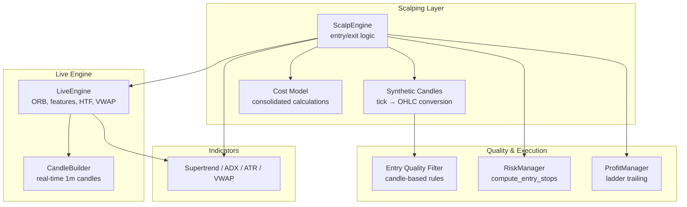
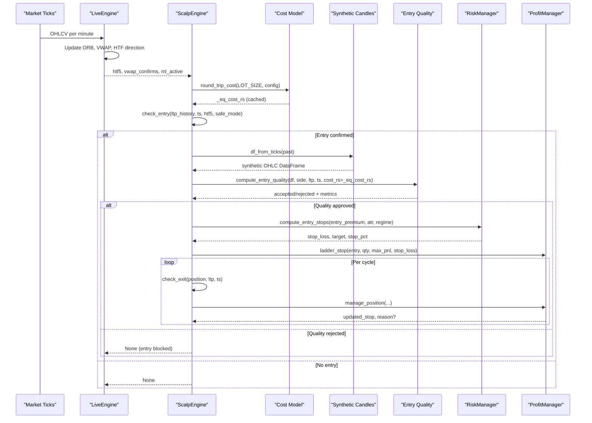
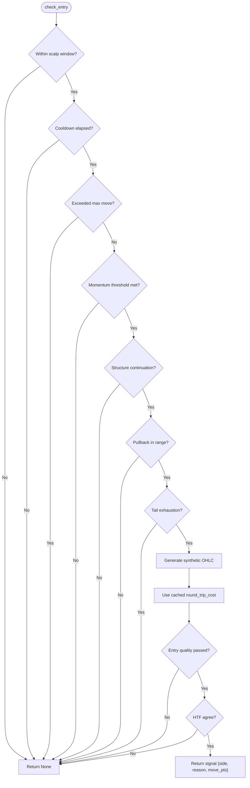
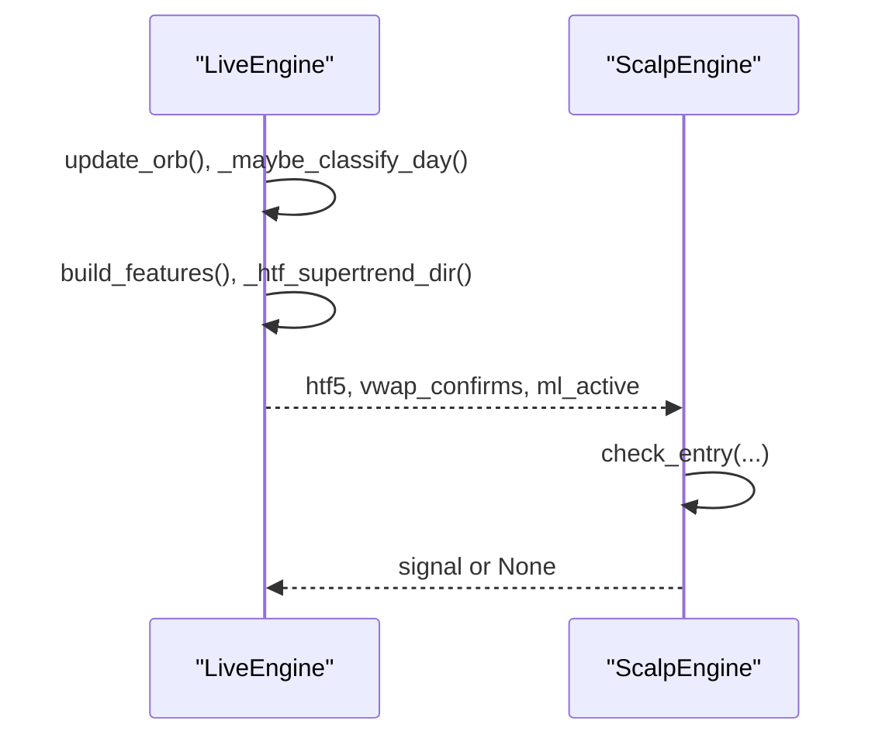
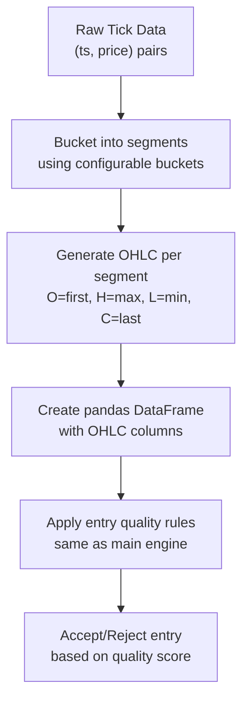
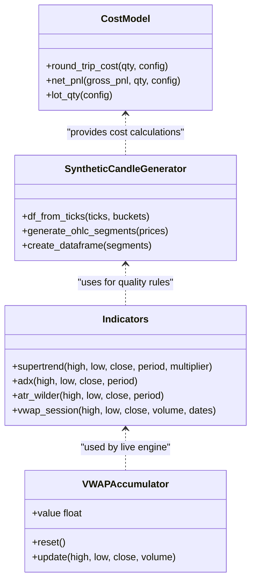
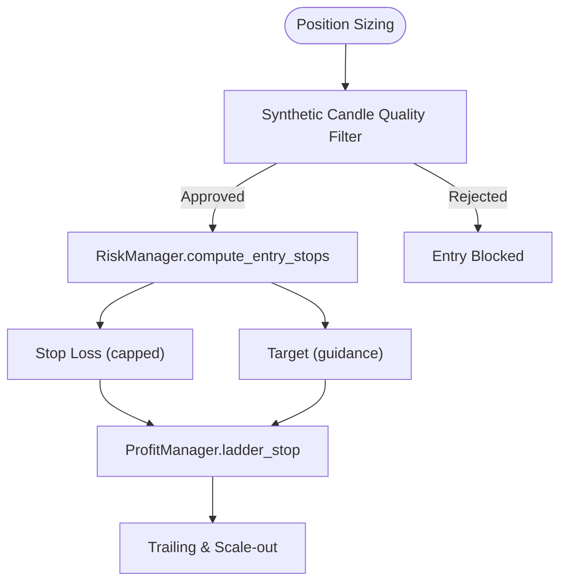
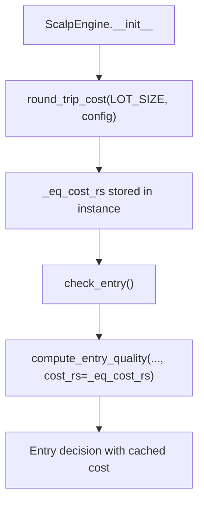
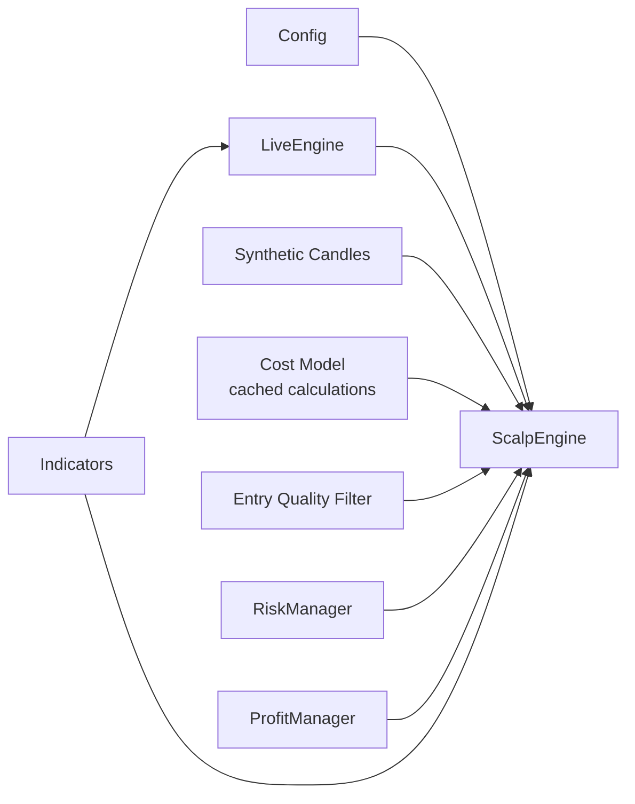

# Scalping Strategy Engine

<cite>
**Referenced Files in This Document**
- [scalp_engine.py](file://engine/scalping/scalp_engine.py)
- [filters.py](file://engine/execution/filters.py)
- [candle_builder.py](file://engine/data/candle_builder.py)
- [cost_model.py](file://engine/execution/cost_model.py)
- [live_engine.py](file://engine/live_engine.py)
- [config.py](file://engine/config/config.py)
- [indicators.py](file://ml/indicators.py)
- [risk_manager.py](file://engine/risk/risk_manager.py)
- [profit_manager.py](file://engine/execution/profit_manager.py)
- [scalp_backtest.py](file://backtest/scalp_backtest.py)
</cite>

## Update Summary
**Changes Made**
- Updated cost model integration section to reflect streamlined round-trip cost calculations
- Enhanced ScalpEngine initialization documentation to show simplified constructor parameters
- Added details about consolidated cost computation reducing computational overhead
- Updated performance considerations for live trading operations with optimized cost calculations
- Revised dependency analysis to show streamlined cost model integration

## Table of Contents
1. [Introduction](#introduction)
2. [Project Structure](#project-structure)
3. [Core Components](#core-components)
4. [Architecture Overview](#architecture-overview)
5. [Detailed Component Analysis](#detailed-component-analysis)
6. [Synthetic Candle Architecture](#synthetic-candle-architecture)
7. [Cost Model Integration](#cost-model-integration)
8. [Dependency Analysis](#dependency-analysis)
9. [Performance Considerations](#performance-considerations)
10. [Troubleshooting Guide](#troubleshooting-guide)
11. [Conclusion](#conclusion)

## Introduction
This document explains the scalping strategy engine that identifies intraday, short-term price movements and executes quick trades based on momentum and structure confirmation. The engine now leverages synthetic OHLC candles generated from tick data to apply consistent candle-based quality rules across both the scalping and main ML engines, ensuring unified entry quality standards throughout the trading system. Recent optimizations have streamlined cost model integration by removing redundant round-trip cost calculations, reducing computational overhead during live trading operations.

## Project Structure
The scalping layer is a focused module that runs alongside the main ML-driven live engine. It uses a momentum-based approach with strict filters to avoid chasing exhausted moves and to align with higher-timeframe trends. The recent enhancement introduces synthetic candle generation from tick data, enabling the same quality rules used by the main engine to be applied to scalp entries.

**Diagram sources**
- [scalp_engine.py:186-211](file://engine/scalping/scalp_engine.py#L186-L211)
- [filters.py:112-133](file://engine/execution/filters.py#L112-L133)
- [candle_builder.py:18-31](file://engine/data/candle_builder.py#L18-L31)
- [live_engine.py:192-200](file://engine/live_engine.py#L192-L200)
- [cost_model.py:29-33](file://engine/execution/cost_model.py#L29-L33)

**Section sources**
- [scalp_engine.py:11-170](file://engine/scalping/scalp_engine.py#L11-L170)
- [live_engine.py:71-184](file://engine/live_engine.py#L71-L184)
- [config.py:89-163](file://engine/config/config.py#L89-L163)

## Core Components
- **ScalpEngine**: Momentum entry detection, structure/pullback/exhaustion checks, HTF alignment, adaptive stop selection, and exits (target/time/no-life). Now integrates synthetic candle generation for unified quality filtering with optimized cost model integration.
- **Synthetic Candle Generator**: Converts raw tick data into synthetic OHLC bars using configurable bucket sizes, enabling candle-based quality rules without requiring actual 1-minute candles.
- **Entry Quality Filter**: Applies comprehensive candle-based quality rules including move extension, late entry detection, buying-at-top prevention, rejection candle filtering, momentum analysis, and profitability assessment.
- **LiveEngine**: Provides ORB levels, higher-timeframe SuperTrend direction, VWAP bias, and feature context; coordinates when scalps can run relative to ML activity.
- **RiskManager**: Computes tight, capital-aware stops and targets for options bought (CE/PE).
- **ProfitManager**: Centralized profit-lock ladder and trailing for both normal and scalp positions.
- **Indicators**: Supertrend, ADX, ATR, and VWAP used by both engines.
- **Config**: All scalping parameters (thresholds, cooldowns, SL tiers, exhaustion cap, daily caps, etc.).
- **Cost Model**: Streamlined round-trip cost calculations with consolidated computation to reduce memory usage during live trading.

**Section sources**
- [scalp_engine.py:11-280](file://engine/scalping/scalp_engine.py#L11-L280)
- [filters.py:112-288](file://engine/execution/filters.py#L112-L288)
- [candle_builder.py:18-317](file://engine/data/candle_builder.py#L18-L317)
- [live_engine.py:71-184](file://engine/live_engine.py#L71-L184)
- [risk_manager.py:20-59](file://engine/risk/risk_manager.py#L20-L59)
- [profit_manager.py:116-225](file://engine/execution/profit_manager.py#L116-L225)
- [indicators.py:41-90](file://ml/indicators.py#L41-L90)
- [config.py:89-163](file://engine/config/config.py#L89-L163)
- [cost_model.py:29-33](file://engine/execution/cost_model.py#L29-L33)

## Architecture Overview
The scalping engine runs as a secondary layer that only acts when the main ML engine is flat or inactive, ensuring it does not interfere with primary directional trades. It scans recent ticks within a short momentum window, validates continuation structure and pullback, avoids exhaustion tails, and requires HTF agreement. The enhanced architecture now generates synthetic OHLC candles from tick data to apply the same comprehensive quality rules used by the main engine, with streamlined cost model integration for improved performance.

**Diagram sources**
- [scalp_engine.py:52-170](file://engine/scalping/scalp_engine.py#L52-L170)
- [scalp_engine.py:186-211](file://engine/scalping/scalp_engine.py#L186-L211)
- [filters.py:112-288](file://engine/execution/filters.py#L112-L288)
- [scalp_engine.py:174-244](file://engine/scalping/scalp_engine.py#L174-L244)
- [scalp_engine.py:246-280](file://engine/scalping/scalp_engine.py#L246-L280)
- [risk_manager.py:20-59](file://engine/risk/risk_manager.py#L20-L59)
- [profit_manager.py:116-225](file://engine/execution/profit_manager.py#L116-L225)
- [live_engine.py:190-217](file://engine/live_engine.py#L190-L217)
- [cost_model.py:29-33](file://engine/execution/cost_model.py#L29-L33)

## Detailed Component Analysis

### ScalpEngine: Enhanced Entry Logic with Synthetic Candles
- Time gating: Only trades between configured start/end times.
- Cooldown: Prevents re-entry immediately after an exit.
- Exhaustion cap: Blocks entries if NIFTY has already moved beyond a threshold within the momentum window.
- Momentum detection: Measures move over a short window; side determined by direction of move.
- Structure confirmation: Requires continuation in the second half of the window (higher highs for CE, lower lows for PE).
- Pullback filter: Enters on a controlled retracement from the extreme (tighter in safe mode).
- Exhaustion tail filter: Avoids buying/selling at the tail of a vertical spike.
- HTF alignment: Requires 5m SuperTrend agreement (or at least non-opposition depending on config).
- **Enhanced**: Synthetic candle generation and comprehensive quality filtering using the same rules as the main engine with optimized cost model integration.

**Diagram sources**
- [scalp_engine.py:52-170](file://engine/scalping/scalp_engine.py#L52-L170)
- [scalp_engine.py:186-211](file://engine/scalping/scalp_engine.py#L186-L211)
- [cost_model.py:29-33](file://engine/execution/cost_model.py#L29-L33)

**Section sources**
- [scalp_engine.py:52-170](file://engine/scalping/scalp_engine.py#L52-L170)
- [scalp_engine.py:186-211](file://engine/scalping/scalp_engine.py#L186-L211)

### ScalpEngine: Adaptive Stop Selection
- Conviction score built from:
  - Momentum burst strength (move size),
  - HTF agreement,
  - VWAP confirmation,
  - ML engine activity.
- ATR-adaptive stops: When ATR > 0, stop = max(ATR × tier multiplier, fixed floor). Tier depends on conviction score.
- Open-volatility penalty: Wider stops during first minutes after market open due to elevated volatility.
- Fallback to fixed tiers when ATR unavailable.

**Diagram sources**
- [scalp_engine.py:174-244](file://engine/scalping/scalp_engine.py#L174-L244)
- [config.py:96-110](file://engine/config/config.py#L96-L110)

**Section sources**
- [scalp_engine.py:174-244](file://engine/scalping/scalp_engine.py#L174-L244)
- [config.py:96-110](file://engine/config/config.py#L96-L110)

### ScalpEngine: Exit Logic
- Stop loss: Exits when LTP drops below active stop level.
- Target: Exits when LTP reaches configured target points.
- Time exit: Exits after maximum hold seconds.
- No-life exit: If the trade never reaches breakeven zone within a short window, cut early to avoid bleeding.

**Diagram sources**
- [scalp_engine.py:246-280](file://engine/scalping/scalp_engine.py#L246-L280)

**Section sources**
- [scalp_engine.py:246-280](file://engine/scalping/scalp_engine.py#L246-L280)

### Integration with LiveEngine
- The live engine computes ORB levels, updates VWAP, and determines higher-timeframe trend direction (e.g., 5m SuperTrend).
- It passes relevant context (htf5, vwap_confirms, ml_active) to the scalp engine so entries respect broader market structure and ML activity.
- The scalp engine runs only when the main ML position is flat, avoiding conflicts.

**Diagram sources**
- [live_engine.py:190-217](file://engine/live_engine.py#L190-L217)
- [live_engine.py:591-665](file://engine/live_engine.py#L591-L665)
- [scalp_engine.py:52-170](file://engine/scalping/scalp_engine.py#L52-L170)

**Section sources**
- [live_engine.py:190-217](file://engine/live_engine.py#L190-L217)
- [live_engine.py:591-665](file://engine/live_engine.py#L591-L665)
- [scalp_engine.py:52-170](file://engine/scalping/scalp_engine.py#L52-L170)

## Synthetic Candle Architecture

### Tick-to-Candle Conversion Process
The scalping engine now generates synthetic OHLC candles from raw tick data to enable comprehensive quality filtering using the same rules as the main trading engine. This ensures consistency in entry quality standards across all trading strategies.

**Diagram sources**
- [filters.py:112-133](file://engine/execution/filters.py#L112-L133)
- [filters.py:136-288](file://engine/execution/filters.py#L136-L288)

### Entry Quality Rules Applied via Synthetic Candles
The synthetic candle approach enables the application of comprehensive quality rules:

1. **Move Extension Check**: Ensures the move hasn't already exceeded maximum thresholds
2. **Late Entry Detection**: Prevents entries after breakout signals have aged out
3. **Buying-at-Top Prevention**: Identifies entries at candle extremes
4. **Rejection Candle Filtering**: Filters candles with excessive adverse wicks
5. **Momentum Analysis**: Uses momentum velocity calculations from candle closes
6. **Quality Scoring**: Composite scoring system for overall entry quality
7. **Profitability Assessment**: Ensures expected moves can cover transaction costs using streamlined cost model

### Integration with Main Engine Consistency
The synthetic candle architecture maintains consistency with the main trading engine by:
- Using identical quality rule logic (`compute_entry_quality`)
- Applying the same thresholds and scoring mechanisms
- Leveraging the same cost model for profitability assessments with optimized calculations
- Maintaining uniform rejection tracking and analytics

**Section sources**
- [filters.py:112-288](file://engine/execution/filters.py#L112-288)
- [scalp_engine.py:186-211](file://engine/scalping/scalp_engine.py#L186-L211)
- [cost_model.py:29-33](file://engine/execution/cost_model.py#L29-L33)

### Technical Indicators Used
- **Supertrend (10, 3)**: Higher-timeframe trend alignment (5m/15m/30m) and distance metrics.
- **ADX**: Trend strength assessment via DI spread.
- **ATR**: Volatility measure for adaptive stops and feature inputs.
- **VWAP**: Session VWAP accumulator for bias confirmation.
- **RSI**: Computed in feature pipeline for momentum context.
- **Synthetic Candle Metrics**: Generated OHLC data for comprehensive quality analysis.

**Diagram sources**
- [indicators.py:41-90](file://ml/indicators.py#L41-L90)
- [indicators.py:97-129](file://ml/indicators.py#L97-L129)
- [indicators.py:136-169](file://ml/indicators.py#L136-L169)
- [indicators.py:176-202](file://ml/indicators.py#L176-L202)
- [filters.py:112-133](file://engine/execution/filters.py#L112-L133)
- [cost_model.py:29-33](file://engine/execution/cost_model.py#L29-L33)

**Section sources**
- [indicators.py:41-90](file://ml/indicators.py#L41-L90)
- [indicators.py:97-129](file://ml/indicators.py#L97-L129)
- [indicators.py:136-169](file://ml/indicators.py#L136-L169)
- [indicators.py:176-202](file://ml/indicators.py#L176-L202)
- [filters.py:112-133](file://engine/execution/filters.py#L112-L133)

### Position Sizing and Risk Management
- **RiskManager**: Computes tight, capital-aware stops capped at a premium point limit, with a target ratio guidance; actual exits rely on trailing via ProfitManager.
- **ProfitManager**: Applies a cost-aware profit-lock ladder that ensures locked profits cover costs and trails peak profit once meaningful gains are achieved.
- **ScalpEngine**: Uses ATR-adaptive stops and fixed tiers based on conviction; also widens stops during open volatility.
- **Enhanced**: Synthetic candle quality filtering reduces poor-quality entries before risk calculation with streamlined cost model integration.

**Diagram sources**
- [risk_manager.py:20-59](file://engine/risk/risk_manager.py#L20-L59)
- [profit_manager.py:116-225](file://engine/execution/profit_manager.py#L116-L225)
- [filters.py:112-288](file://engine/execution/filters.py#L112-L288)

**Section sources**
- [risk_manager.py:20-59](file://engine/risk/risk_manager.py#L20-L59)
- [profit_manager.py:116-225](file://engine/execution/profit_manager.py#L116-L225)
- [filters.py:112-288](file://engine/execution/filters.py#L112-L288)

### Typical Scalping Scenarios
- **Strong momentum breakout with structure continuation and pullback**: Enter CE/PE aligned with HTF trend; set adaptive stop; trail using profit ladder; exit on target/time/no-life. Enhanced by synthetic candle quality filtering and optimized cost calculations.
- **Exhausted spike**: Skip entry when last quarter accounts for most of the move; prevents chasing tops/bottoms. Synthetic candles help identify exhaustion patterns more reliably.
- **Early session volatility**: Wider stops initially; patience until stabilization; avoid premature entries. Quality filtering helps avoid false breakouts during volatile periods.
- **Low-quality setups**: Synthetic candle analysis rejects entries where quality scores fall below thresholds, improving overall win rate with streamlined cost model integration.

## Cost Model Integration

### Streamlined Round-Trip Cost Calculations
The ScalpEngine now uses a streamlined approach to cost model integration, eliminating redundant round-trip cost calculations that were previously handled separately. This optimization reduces computational overhead and memory usage during live trading operations.

**Key Improvements:**
- **Single Calculation**: Round-trip cost is computed once during ScalpEngine initialization and cached as `_eq_cost_rs`
- **Consolidated Processing**: Eliminates duplicate cost calculations across different components
- **Memory Efficiency**: Reduces object creation and garbage collection pressure during high-frequency trading
- **Performance Optimization**: Minimizes CPU cycles spent on repetitive cost computations

**Diagram sources**
- [scalp_engine.py:49-52](file://engine/scalping/scalp_engine.py#L49-L52)
- [scalp_engine.py:186-191](file://engine/scalping/scalp_engine.py#L186-L191)
- [cost_model.py:29-33](file://engine/execution/cost_model.py#L29-L33)

### Simplified ScalpEngine Initialization
The ScalpEngine class initialization has been simplified to focus on essential configuration while maintaining robust functionality:

**Initialization Parameters:**
- Configuration-driven parameters for all trading thresholds and risk controls
- Cached round-trip cost calculation for entry quality filtering
- Rejection tracking for entry quality metrics
- Optimized memory footprint for live trading operations

**Benefits:**
- Reduced constructor complexity
- Better separation of concerns between configuration and execution logic
- Improved maintainability and testability
- Enhanced performance through pre-computation of frequently used values

**Section sources**
- [scalp_engine.py:20-52](file://engine/scalping/scalp_engine.py#L20-L52)
- [cost_model.py:29-33](file://engine/execution/cost_model.py#L29-L33)

## Dependency Analysis
- **ScalpEngine** depends on:
  - Config for thresholds and risk controls.
  - LiveEngine for HTF direction and VWAP context.
  - **Enhanced**: Synthetic candle generator for unified quality filtering.
  - **Optimized**: Streamlined cost model integration with cached calculations.
  - RiskManager for initial stop/target computation.
  - ProfitManager for trailing and scale-out.
  - Indicators for Supertrend, ADX, ATR, VWAP.

**Diagram sources**
- [scalp_engine.py:11-170](file://engine/scalping/scalp_engine.py#L11-L170)
- [scalp_engine.py:186-211](file://engine/scalping/scalp_engine.py#L186-L211)
- [filters.py:112-288](file://engine/execution/filters.py#L112-L288)
- [live_engine.py:71-184](file://engine/live_engine.py#L71-L184)
- [risk_manager.py:20-59](file://engine/risk/risk_manager.py#L20-L59)
- [profit_manager.py:116-225](file://engine/execution/profit_manager.py#L116-L225)
- [indicators.py:41-90](file://ml/indicators.py#L41-L90)
- [config.py:89-163](file://engine/config/config.py#L89-L163)
- [cost_model.py:29-33](file://engine/execution/cost_model.py#L29-L33)

**Section sources**
- [scalp_engine.py:11-170](file://engine/scalping/scalp_engine.py#L11-L170)
- [scalp_engine.py:186-211](file://engine/scalping/scalp_engine.py#L186-L211)
- [filters.py:112-288](file://engine/execution/filters.py#L112-L288)
- [live_engine.py:71-184](file://engine/live_engine.py#L71-L184)
- [risk_manager.py:20-59](file://engine/risk/risk_manager.py#L20-L59)
- [profit_manager.py:116-225](file://engine/execution/profit_manager.py#L116-L225)
- [indicators.py:41-90](file://ml/indicators.py#L41-L90)
- [config.py:89-163](file://engine/config/config.py#L89-L163)
- [cost_model.py:29-33](file://engine/execution/cost_model.py#L29-L33)

## Performance Considerations
- **Latency**: The scalp engine evaluates entries/exits every cycle; synthetic candle generation adds minimal overhead through efficient bucketing algorithms. Ensure minimal overhead in indicator calculations and data access. Use vectorized indicators where possible.
- **Data resolution**: Backtests scale windows for 1-minute data; live uses tick-level windows with synthetic candle conversion. Ensure deque sizes and sampling rates match intended latency.
- **Computational load**: HTF computations (resampling to 5m/15m/30m) should be efficient; cache results per bar to avoid recomputation. Synthetic candle generation uses optimized bucketing to minimize CPU usage.
- **Cost awareness**: Profit ladder ensures locks cover round-trip costs; synthetic candle quality filtering reduces unnecessary entries that would incur costs without proper quality validation. **Enhanced**: Streamlined cost model integration eliminates redundant calculations, reducing CPU overhead during live trading.
- **Overtrading guards**: Daily trade caps and consecutive loss circuit breakers reduce drawdown risk and cost drag. Enhanced quality filtering further reduces overtrading by blocking low-quality setups.
- **Memory efficiency**: Synthetic candles are generated on-demand and discarded after quality evaluation, minimizing memory footprint. **Improved**: Cached cost calculations reduce object creation and garbage collection pressure.
- **Optimization Benefits**: 
  - Single round-trip cost calculation per ScalpEngine instance
  - Reduced memory allocation during high-frequency operations
  - Faster entry quality filtering with pre-computed cost values
  - Lower CPU utilization during peak trading hours

## Troubleshooting Guide
- **No entries during expected moves**:
  - Verify momentum threshold and minimum samples are met.
  - Check HTF alignment and exhaustion tail filter.
  - Confirm cooldown and time gating.
  - **Enhanced**: Review synthetic candle quality metrics and rejection reasons.
- **Frequent stop-outs**:
  - Review ATR-adaptive stop tiers and open-volatility multiplier.
  - Ensure conviction score is accurate; adjust thresholds if necessary.
  - **Enhanced**: Check if quality filtering is too aggressive, blocking valid entries.
- **Trades held too long**:
  - Check no-life exit and max hold seconds.
  - Validate target and trailing activation settings.
- **Inconsistent behavior across backtest/live**:
  - Ensure data frequency and window scaling match expectations.
  - Confirm VWAP reset and ORB reconstruction logic.
  - **Enhanced**: Verify synthetic candle bucket sizing matches backtest configurations.
- **Quality filter rejections**:
  - Monitor rejection statistics to understand which rules are blocking entries.
  - Adjust thresholds based on market conditions and strategy performance.
  - **Enhanced**: Use synthetic candle metrics to diagnose specific quality issues.
- **Performance issues**:
  - **New**: Monitor memory usage and CPU utilization during live trading.
  - **New**: Verify that cost model caching is working correctly.
  - **New**: Check for any remaining redundant cost calculations in custom modifications.

**Section sources**
- [scalp_engine.py:52-170](file://engine/scalping/scalp_engine.py#L52-L170)
- [scalp_engine.py:174-244](file://engine/scalping/scalp_engine.py#L174-L244)
- [scalp_engine.py:246-280](file://engine/scalping/scalp_engine.py#L246-L280)
- [filters.py:112-288](file://engine/execution/filters.py#L112-L288)
- [scalp_backtest.py:48-94](file://backtest/scalp_backtest.py#L48-L94)
- [cost_model.py:29-33](file://engine/execution/cost_model.py#L29-L33)

## Conclusion
The scalping engine provides a disciplined, momentum-driven intraday strategy with robust filters to avoid exhaustion and misaligned entries. The recent enhancements introducing synthetic OHLC candles from tick data and streamlined cost model integration significantly improve both entry quality and operational efficiency. The optimized cost model integration eliminates redundant round-trip cost calculations, reducing computational overhead and memory usage during live trading operations while maintaining the same accuracy and reliability.

The synthetic candle architecture enables sophisticated quality analysis including move extension detection, late entry prevention, buying-at-top avoidance, rejection candle filtering, momentum analysis, and profitability assessment. Combined with adaptive stops grounded in volatility and conviction, streamlined cost calculations, and a cost-aware profit ladder for consistent risk management, the enhanced scalping engine complements the main ML system while focusing on quick, high-probability intraday opportunities.

With careful parameter tuning, attention to latency and data quality, monitoring of synthetic candle quality metrics, and leveraging the optimized cost model integration, the scalping engine delivers improved entry quality, reduced computational overhead, and minimized drawdown risk while maintaining its role as a complementary strategy to the primary ML-driven approach. The streamlined cost model integration represents a significant improvement in operational efficiency, particularly beneficial for high-frequency scalping operations where every millisecond and byte of memory matters.