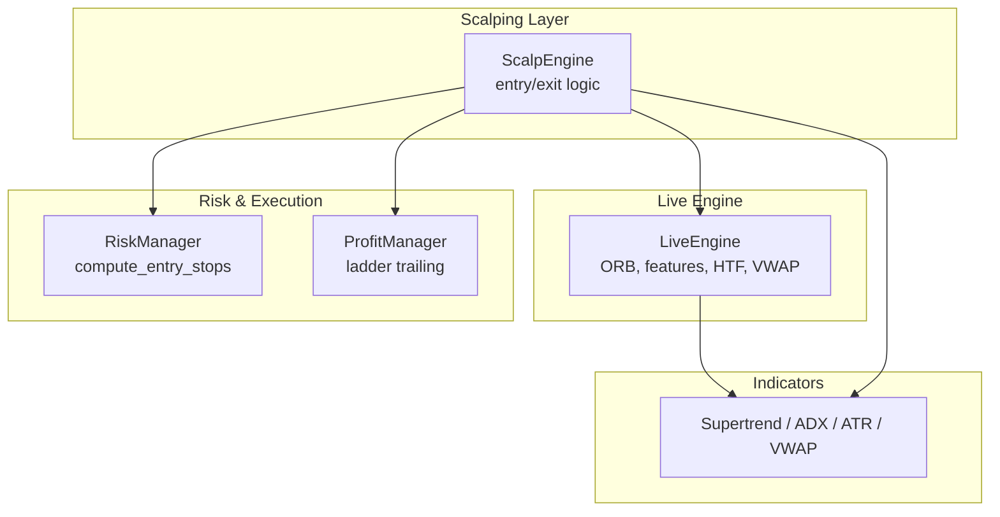
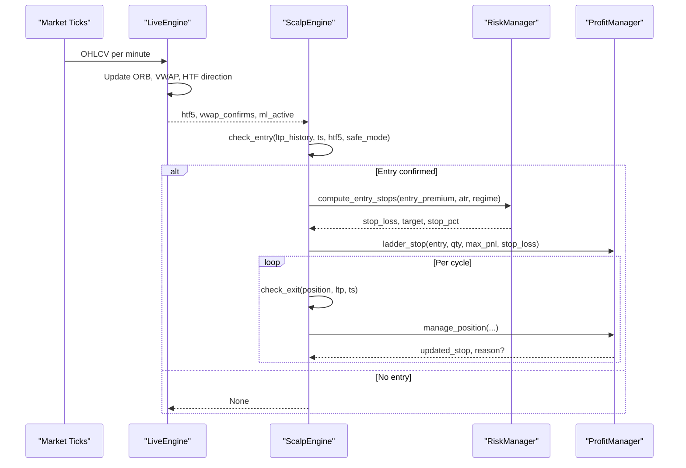
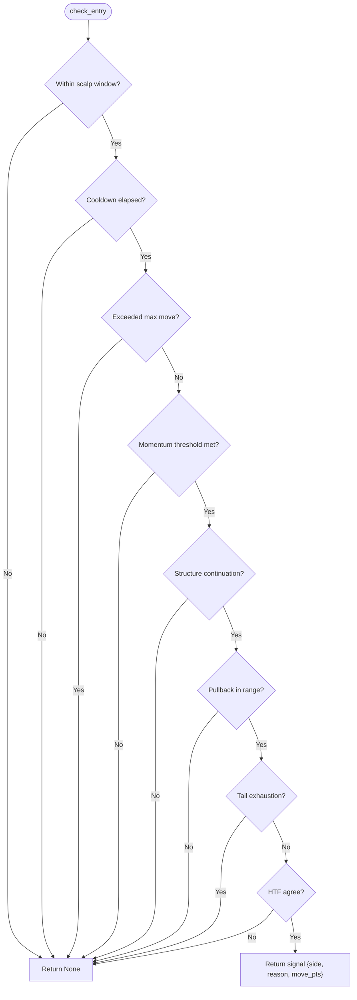
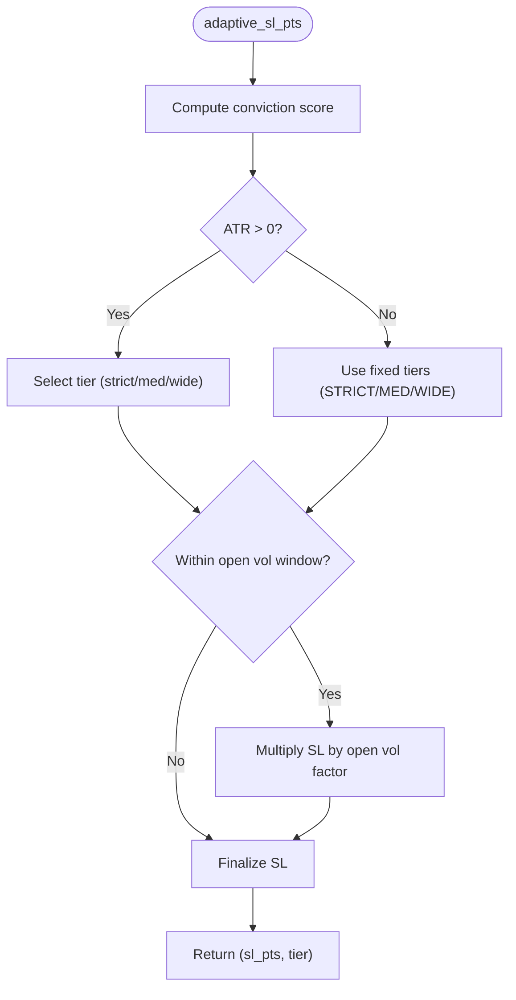
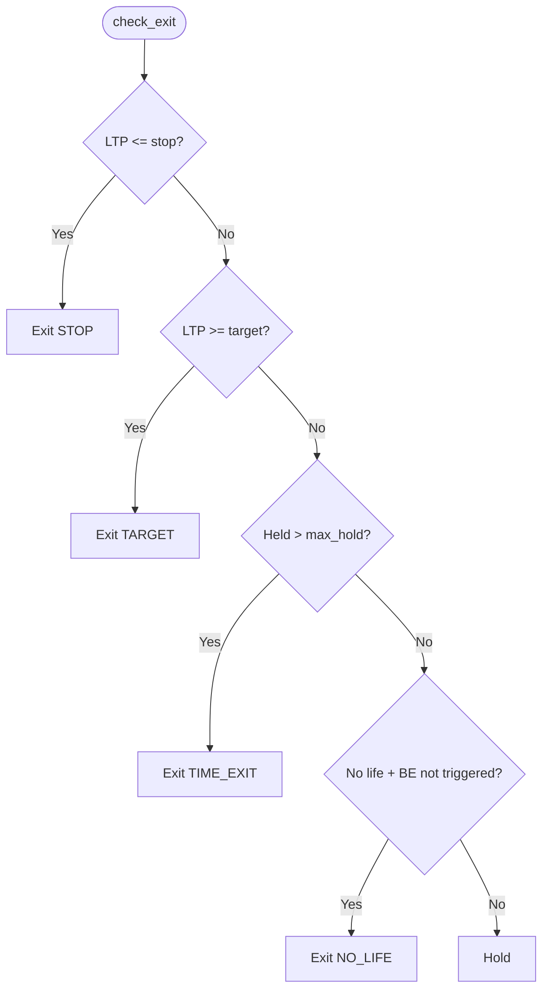
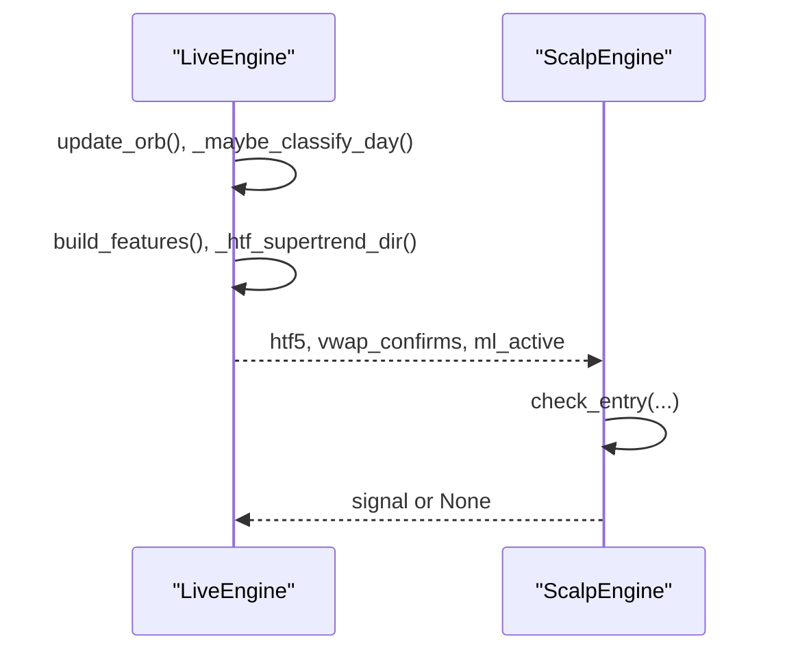
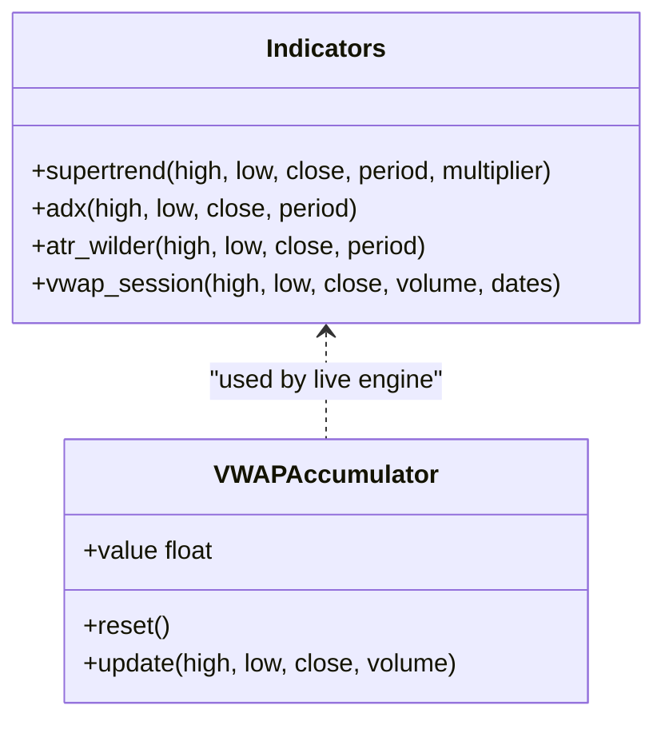
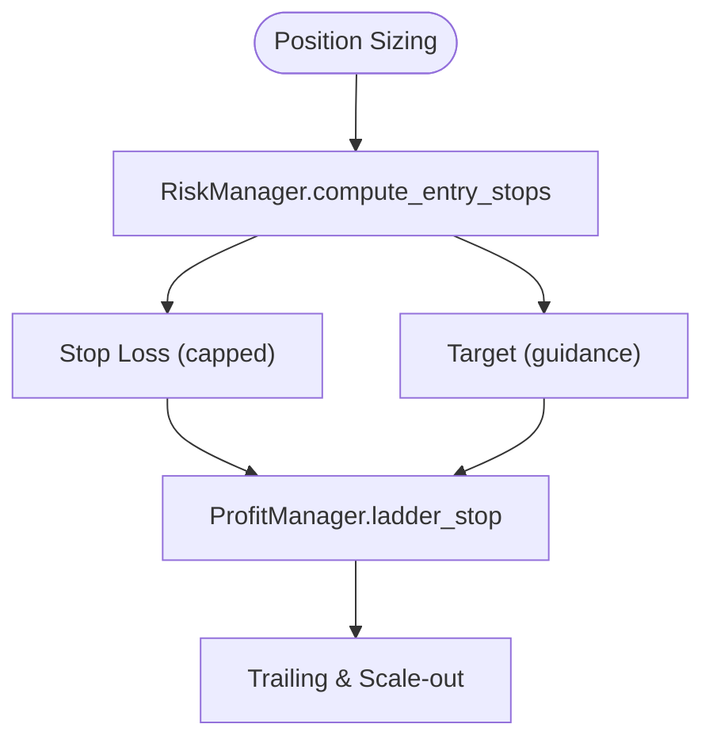
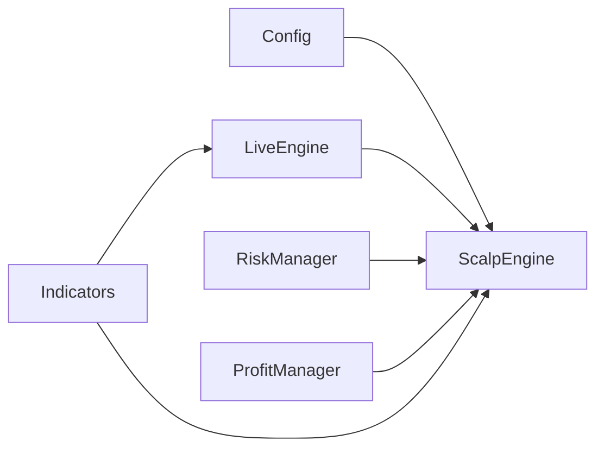

# Scalping Strategy Engine

<cite>
**Referenced Files in This Document**
- [scalp_engine.py](file://engine/scalping/scalp_engine.py)
- [live_engine.py](file://engine/live_engine.py)
- [config.py](file://engine/config/config.py)
- [indicators.py](file://ml/indicators.py)
- [risk_manager.py](file://engine/risk/risk_manager.py)
- [profit_manager.py](file://engine/execution/profit_manager.py)
- [scalp_backtest.py](file://backtest/scalp_backtest.py)
</cite>

## Table of Contents
1. [Introduction](#introduction)
2. [Project Structure](#project-structure)
3. [Core Components](#core-components)
4. [Architecture Overview](#architecture-overview)
5. [Detailed Component Analysis](#detailed-component-analysis)
6. [Dependency Analysis](#dependency-analysis)
7. [Performance Considerations](#performance-considerations)
8. [Troubleshooting Guide](#troubleshooting-guide)
9. [Conclusion](#conclusion)

## Introduction
This document explains the scalping strategy engine that identifies intraday, short-term price movements and executes quick trades based on momentum and structure confirmation. It details entry and exit criteria, position sizing considerations for high-frequency trading, integration with the main live engine and risk management systems, technical indicators used for decisions, typical scenarios, targets, stop-loss strategies, and performance/latency requirements.

## Project Structure
The scalping layer is a focused module that runs alongside the main ML-driven live engine. It uses a momentum-based approach with strict filters to avoid chasing exhausted moves and to align with higher-timeframe trends.

**Diagram sources**
- [scalp_engine.py:11-170](file://engine/scalping/scalp_engine.py#L11-L170)
- [live_engine.py:71-184](file://engine/live_engine.py#L71-L184)
- [risk_manager.py:20-59](file://engine/risk/risk_manager.py#L20-L59)
- [profit_manager.py:116-225](file://engine/execution/profit_manager.py#L116-L225)
- [indicators.py:41-90](file://ml/indicators.py#L41-L90)

**Section sources**
- [scalp_engine.py:11-170](file://engine/scalping/scalp_engine.py#L11-L170)
- [live_engine.py:71-184](file://engine/live_engine.py#L71-L184)
- [config.py:89-163](file://engine/config/config.py#L89-L163)

## Core Components
- ScalpEngine: Momentum entry detection, structure/pullback/exhaustion checks, HTF alignment, adaptive stop selection, and exits (target/time/no-life).
- LiveEngine: Provides ORB levels, higher-timeframe SuperTrend direction, VWAP bias, and feature context; coordinates when scalps can run relative to ML activity.
- RiskManager: Computes tight, capital-aware stops and targets for options bought (CE/PE).
- ProfitManager: Centralized profit-lock ladder and trailing for both normal and scalp positions.
- Indicators: Supertrend, ADX, ATR, and VWAP used by both engines.
- Config: All scalping parameters (thresholds, cooldowns, SL tiers, exhaustion cap, daily caps, etc.).

**Section sources**
- [scalp_engine.py:11-280](file://engine/scalping/scalp_engine.py#L11-L280)
- [live_engine.py:71-184](file://engine/live_engine.py#L71-L184)
- [risk_manager.py:20-59](file://engine/risk/risk_manager.py#L20-L59)
- [profit_manager.py:116-225](file://engine/execution/profit_manager.py#L116-L225)
- [indicators.py:41-90](file://ml/indicators.py#L41-L90)
- [config.py:89-163](file://engine/config/config.py#L89-L163)

## Architecture Overview
The scalping engine runs as a secondary layer that only acts when the main ML engine is flat or inactive, ensuring it does not interfere with primary directional trades. It scans recent ticks within a short momentum window, validates continuation structure and pullback, avoids exhaustion tails, and requires HTF agreement. Stops are adaptive to volatility and conviction; exits use target, time, no-life, and stop triggers.

**Diagram sources**
- [scalp_engine.py:52-170](file://engine/scalping/scalp_engine.py#L52-L170)
- [scalp_engine.py:174-244](file://engine/scalping/scalp_engine.py#L174-L244)
- [scalp_engine.py:246-280](file://engine/scalping/scalp_engine.py#L246-L280)
- [risk_manager.py:20-59](file://engine/risk/risk_manager.py#L20-L59)
- [profit_manager.py:116-225](file://engine/execution/profit_manager.py#L116-L225)
- [live_engine.py:190-217](file://engine/live_engine.py#L190-L217)

## Detailed Component Analysis

### ScalpEngine: Entry Logic
- Time gating: Only trades between configured start/end times.
- Cooldown: Prevents re-entry immediately after an exit.
- Exhaustion cap: Blocks entries if NIFTY has already moved beyond a threshold within the momentum window.
- Momentum detection: Measures move over a short window; side determined by direction of move.
- Structure confirmation: Requires continuation in the second half of the window (higher highs for CE, lower lows for PE).
- Pullback filter: Enters on a controlled retracement from the extreme (tighter in safe mode).
- Exhaustion tail filter: Avoids buying/selling at the tail of a vertical spike.
- HTF alignment: Requires 5m SuperTrend agreement (or at least non-opposition depending on config).

**Diagram sources**
- [scalp_engine.py:52-170](file://engine/scalping/scalp_engine.py#L52-L170)

**Section sources**
- [scalp_engine.py:52-170](file://engine/scalping/scalp_engine.py#L52-L170)

### ScalpEngine: Adaptive Stop Selection
- Conviction score built from:
  - Momentum burst strength (move size),
  - HTF agreement,
  - VWAP confirmation,
  - ML engine activity.
- ATR-adaptive stops: When ATR > 0, stop = max(ATR × tier multiplier, fixed floor). Tier depends on conviction score.
- Open-volatility penalty: Wider stops during first minutes after market open due to elevated volatility.
- Fallback to fixed tiers when ATR unavailable.

**Diagram sources**
- [scalp_engine.py:174-244](file://engine/scalping/scalp_engine.py#L174-L244)
- [config.py:96-110](file://engine/config/config.py#L96-L110)

**Section sources**
- [scalp_engine.py:174-244](file://engine/scalping/scalp_engine.py#L174-L244)
- [config.py:96-110](file://engine/config/config.py#L96-L110)

### ScalpEngine: Exit Logic
- Stop loss: Exits when LTP drops below active stop level.
- Target: Exits when LTP reaches configured target points.
- Time exit: Exits after maximum hold seconds.
- No-life exit: If the trade never reaches breakeven zone within a short window, cut early to avoid bleeding.

**Diagram sources**
- [scalp_engine.py:246-280](file://engine/scalping/scalp_engine.py#L246-L280)

**Section sources**
- [scalp_engine.py:246-280](file://engine/scalping/scalp_engine.py#L246-L280)

### Integration with LiveEngine
- The live engine computes ORB levels, updates VWAP, and determines higher-timeframe trend direction (e.g., 5m SuperTrend).
- It passes relevant context (htf5, vwap_confirms, ml_active) to the scalp engine so entries respect broader market structure and ML activity.
- The scalp engine runs only when the main ML position is flat, avoiding conflicts.

**Diagram sources**
- [live_engine.py:190-217](file://engine/live_engine.py#L190-L217)
- [live_engine.py:591-665](file://engine/live_engine.py#L591-L665)
- [scalp_engine.py:52-170](file://engine/scalping/scalp_engine.py#L52-L170)

**Section sources**
- [live_engine.py:190-217](file://engine/live_engine.py#L190-L217)
- [live_engine.py:591-665](file://engine/live_engine.py#L591-L665)
- [scalp_engine.py:52-170](file://engine/scalping/scalp_engine.py#L52-L170)

### Technical Indicators Used
- Supertrend (10, 3): Higher-timeframe trend alignment (5m/15m/30m) and distance metrics.
- ADX: Trend strength assessment via DI spread.
- ATR: Volatility measure for adaptive stops and feature inputs.
- VWAP: Session VWAP accumulator for bias confirmation.
- RSI: Computed in feature pipeline for momentum context.

**Diagram sources**
- [indicators.py:41-90](file://ml/indicators.py#L41-L90)
- [indicators.py:97-129](file://ml/indicators.py#L97-L129)
- [indicators.py:136-169](file://ml/indicators.py#L136-L169)
- [indicators.py:176-202](file://ml/indicators.py#L176-L202)

**Section sources**
- [indicators.py:41-90](file://ml/indicators.py#L41-L90)
- [indicators.py:97-129](file://ml/indicators.py#L97-L129)
- [indicators.py:136-169](file://ml/indicators.py#L136-L169)
- [indicators.py:176-202](file://ml/indicators.py#L176-L202)

### Position Sizing and Risk Management
- RiskManager computes tight, capital-aware stops capped at a premium point limit, with a target ratio guidance; actual exits rely on trailing via ProfitManager.
- ProfitManager applies a cost-aware profit-lock ladder that ensures locked profits cover costs and trails peak profit once meaningful gains are achieved.
- ScalpEngine uses ATR-adaptive stops and fixed tiers based on conviction; also widens stops during open volatility.

**Diagram sources**
- [risk_manager.py:20-59](file://engine/risk/risk_manager.py#L20-L59)
- [profit_manager.py:116-225](file://engine/execution/profit_manager.py#L116-L225)

**Section sources**
- [risk_manager.py:20-59](file://engine/risk/risk_manager.py#L20-L59)
- [profit_manager.py:116-225](file://engine/execution/profit_manager.py#L116-L225)

### Typical Scalping Scenarios
- Strong momentum breakout with structure continuation and pullback: Enter CE/PE aligned with HTF trend; set adaptive stop; trail using profit ladder; exit on target/time/no-life.
- Exhausted spike: Skip entry when last quarter accounts for most of the move; prevents chasing tops/bottoms.
- Early session volatility: Wider stops initially; patience until stabilization; avoid premature entries.

[No sources needed since this section summarizes conceptual scenarios]

## Dependency Analysis
- ScalpEngine depends on:
  - Config for thresholds and risk controls.
  - LiveEngine for HTF direction and VWAP context.
  - RiskManager for initial stop/target computation.
  - ProfitManager for trailing and scale-out.
  - Indicators for Supertrend, ADX, ATR, VWAP.

**Diagram sources**
- [scalp_engine.py:11-170](file://engine/scalping/scalp_engine.py#L11-L170)
- [live_engine.py:71-184](file://engine/live_engine.py#L71-L184)
- [risk_manager.py:20-59](file://engine/risk/risk_manager.py#L20-L59)
- [profit_manager.py:116-225](file://engine/execution/profit_manager.py#L116-L225)
- [indicators.py:41-90](file://ml/indicators.py#L41-L90)
- [config.py:89-163](file://engine/config/config.py#L89-L163)

**Section sources**
- [scalp_engine.py:11-170](file://engine/scalping/scalp_engine.py#L11-L170)
- [live_engine.py:71-184](file://engine/live_engine.py#L71-L184)
- [risk_manager.py:20-59](file://engine/risk/risk_manager.py#L20-L59)
- [profit_manager.py:116-225](file://engine/execution/profit_manager.py#L116-L225)
- [indicators.py:41-90](file://ml/indicators.py#L41-L90)
- [config.py:89-163](file://engine/config/config.py#L89-L163)

## Performance Considerations
- Latency: The scalp engine evaluates entries/exits every cycle; ensure minimal overhead in indicator calculations and data access. Use vectorized indicators where possible.
- Data resolution: Backtests scale windows for 1-minute data; live uses tick-level windows. Ensure deque sizes and sampling rates match intended latency.
- Computational load: HTF computations (resampling to 5m/15m/30m) should be efficient; cache results per bar to avoid recomputation.
- Cost awareness: Profit ladder ensures locks cover round-trip costs; avoid locking too early to prevent guaranteed losses.
- Overtrading guards: Daily trade caps and consecutive loss circuit breakers reduce drawdown risk and cost drag.

[No sources needed since this section provides general guidance]

## Troubleshooting Guide
- No entries during expected moves:
  - Verify momentum threshold and minimum samples are met.
  - Check HTF alignment and exhaustion tail filter.
  - Confirm cooldown and time gating.
- Frequent stop-outs:
  - Review ATR-adaptive stop tiers and open-volatility multiplier.
  - Ensure conviction score is accurate; adjust thresholds if necessary.
- Trades held too long:
  - Check no-life exit and max hold seconds.
  - Validate target and trailing activation settings.
- Inconsistent behavior across backtest/live:
  - Ensure data frequency and window scaling match expectations.
  - Confirm VWAP reset and ORB reconstruction logic.

**Section sources**
- [scalp_engine.py:52-170](file://engine/scalping/scalp_engine.py#L52-L170)
- [scalp_engine.py:174-244](file://engine/scalping/scalp_engine.py#L174-L244)
- [scalp_engine.py:246-280](file://engine/scalping/scalp_engine.py#L246-L280)
- [scalp_backtest.py:48-94](file://backtest/scalp_backtest.py#L48-L94)

## Conclusion
The scalping engine provides a disciplined, momentum-driven intraday strategy with robust filters to avoid exhaustion and misaligned entries. It integrates tightly with the live engine’s HTF and VWAP context, uses adaptive stops grounded in volatility and conviction, and employs a cost-aware profit ladder for consistent risk management. With careful parameter tuning and attention to latency and data quality, it complements the main ML system while focusing on quick, high-probability intraday opportunities.