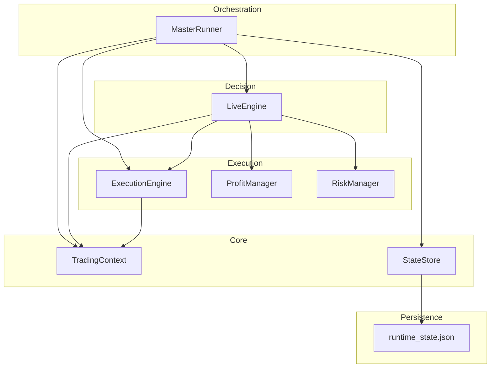
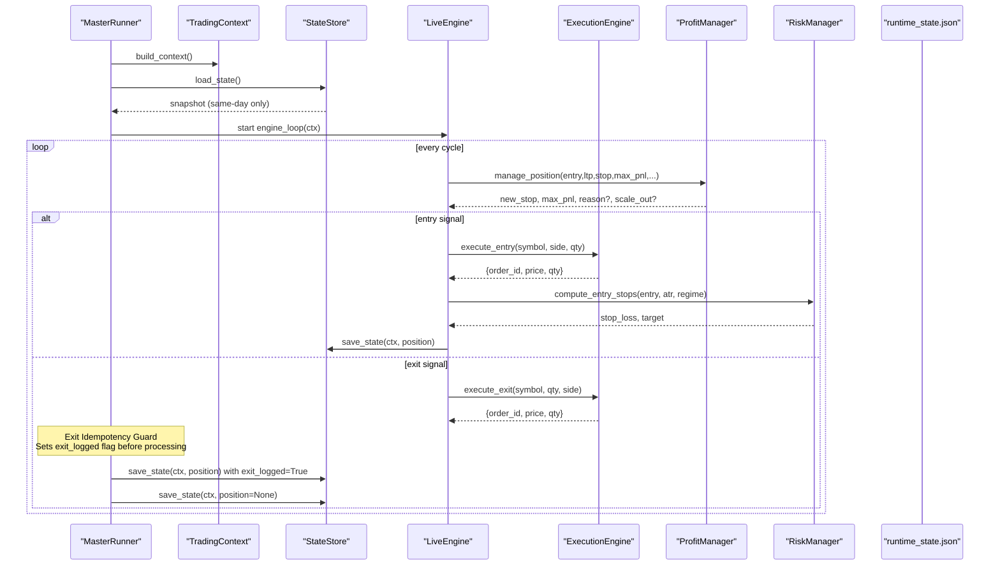
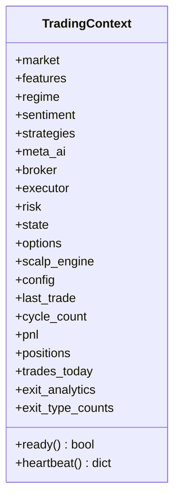
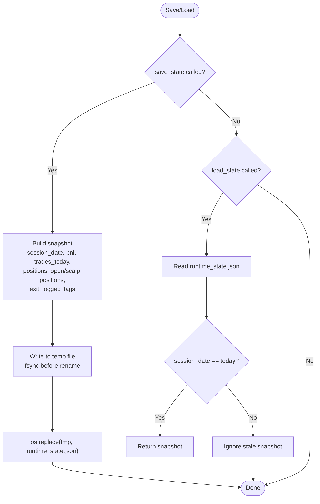
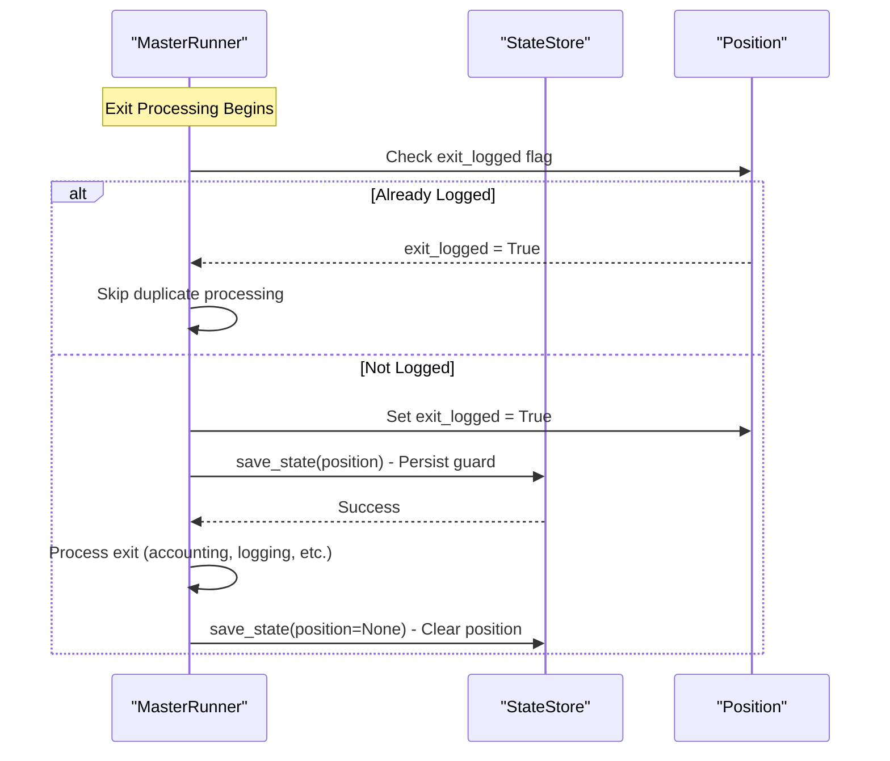
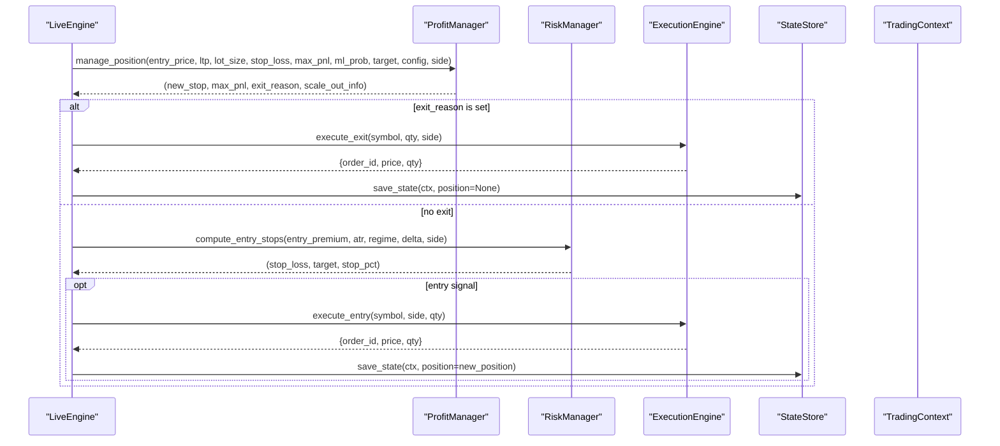
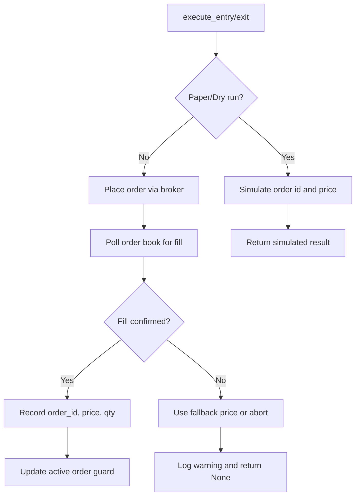
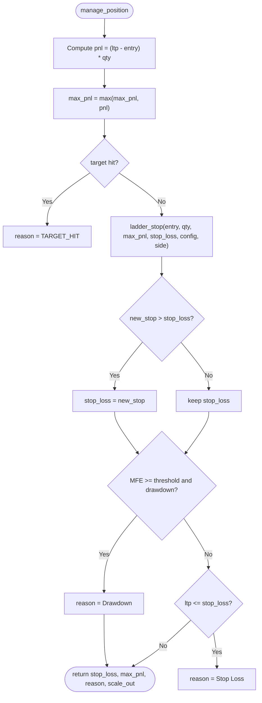
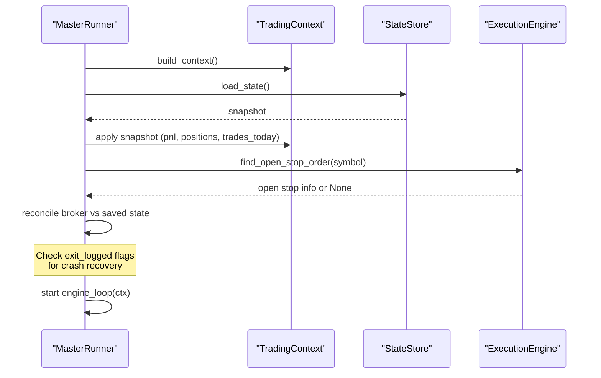
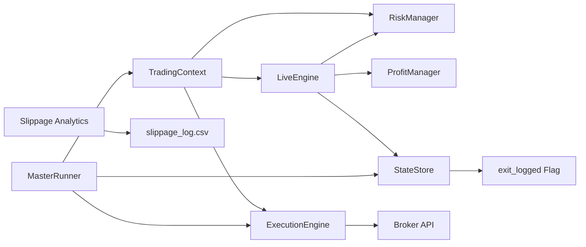

# Trading State Management

<cite>
**Referenced Files in This Document**
- [context.py](file://engine/core/context.py)
- [state_store.py](file://engine/core/state_store.py)
- [live_engine.py](file://engine/live_engine.py)
- [execution_engine.py](file://engine/execution/execution_engine.py)
- [profit_manager.py](file://engine/execution/profit_manager.py)
- [risk_manager.py](file://engine/risk/risk_manager.py)
- [master_runner.py](file://master_runner.py)
- [slippage.py](file://engine/analytics/slippage.py)
- [runtime_state.json](file://data/runtime_state.json)
</cite>

## Update Summary
**Changes Made**
- Enhanced state persistence system with `exit_logged` field added to `_PERSIST_KEYS` for improved idempotency safeguards
- Updated crash recovery mechanisms to prevent duplicate exit logging and accounting
- Added comprehensive documentation of exit idempotency guards for both regular and scalp positions
- Enhanced error recovery strategies with persistent state flags that survive process restarts

## Table of Contents
1. Introduction
2. Project Structure
3. Core Components
4. Architecture Overview
5. Detailed Component Analysis
6. Dependency Analysis
7. Performance Considerations
8. Troubleshooting Guide
9. Conclusion

## Introduction
This document explains the trading state management system that keeps consistent state across the trading engine components. It focuses on:
- The shared runtime Context object for configuration, market data, and component references
- Persistent state storage for positions, session counters, and recovery after failures or restarts
- **Enhanced idempotency safeguards** with `exit_logged` field preventing duplicate exit processing
- Synchronization patterns between live engine, execution layer, and risk systems
- Data structures for positions, order status, and performance metrics
- Thread safety and concurrent access considerations
- Examples of state transitions during the trade lifecycle and error recovery strategies

## Project Structure
The state management system spans core runtime context, persistence, decision engine, execution, risk, and orchestration:
- Context provides a single place to access broker, executor, risk, ML learner, and live engine
- State store persists open positions, daily PnL, and trade counts with atomic writes and **enhanced idempotency protection**
- Live engine drives signals, features, and exit decisions while updating position state
- Execution engine places orders, validates fills, and manages protective stops
- Risk manager computes entry stops and targets; profit manager handles trailing and exits
- Master runner orchestrates startup, recovery, reconciliation, and threading with **robust crash recovery**

**Diagram sources**
- [context.py:10-42](file://engine/core/context.py#L10-L42)
- [state_store.py:18-79](file://engine/core/state_store.py#L18-L79)
- [live_engine.py:71-184](file://engine/live_engine.py#L71-L184)
- [execution_engine.py:21-371](file://engine/execution/execution_engine.py#L21-L371)
- [profit_manager.py:116-225](file://engine/execution/profit_manager.py#L116-L225)
- [risk_manager.py:15-60](file://engine/risk/risk_manager.py#L15-L60)
- [master_runner.py:725-747](file://master_runner.py#L725-L747)

**Section sources**
- [context.py:10-42](file://engine/core/context.py#L10-L42)
- [state_store.py:18-79](file://engine/core/state_store.py#L18-L79)
- [live_engine.py:71-184](file://engine/live_engine.py#L71-L184)
- [execution_engine.py:21-371](file://engine/execution/execution_engine.py#L21-L371)
- [profit_manager.py:116-225](file://engine/execution/profit_manager.py#L116-L225)
- [risk_manager.py:15-60](file://engine/risk/risk_manager.py#L15-L60)
- [master_runner.py:725-747](file://master_runner.py#L725-L747)

## Core Components
- TradingContext: Central runtime container holding references to market data, ML learner, strategies, broker, executor, risk, options, config, and runtime counters (cycle_count, pnl, positions, trades_today). Provides readiness checks and heartbeat diagnostics.
- StateStore: Persists daily session state (PnL, trades_today, closed positions list) and open positions (including scalp positions) to a JSON file using atomic write pattern. **Enhanced with `exit_logged` field for idempotency protection**. Loads only same-day snapshots to avoid cross-session leakage.
- LiveEngine: Decision engine that builds features, tracks ORB, day classification, and coordinates entry/exit logic. Updates and consumes state via Context and calls into ProfitManager and RiskManager.
- ExecutionEngine: Places entries/exits, validates fills by polling broker order book, manages broker-side protective stop orders, and verifies flat positions post-exit.
- ProfitManager: Centralized trailing stop ladder and exit logic based on rupee-based MFE thresholds; returns updated stop levels and scale-out info.
- RiskManager: Computes tight entry stops and targets for long options (both CE and PE), capping worst-case loss per trade.
- MasterRunner: Orchestrates process startup, thread creation, context building, state restoration, broker reconciliation, and ongoing loop control with **enhanced crash recovery and idempotency safeguards**.

**Section sources**
- [context.py:10-78](file://engine/core/context.py#L10-L78)
- [state_store.py:28-94](file://engine/core/state_store.py#L28-L94)
- [live_engine.py:71-184](file://engine/live_engine.py#L71-L184)
- [execution_engine.py:21-371](file://engine/execution/execution_engine.py#L21-L371)
- [profit_manager.py:116-225](file://engine/execution/profit_manager.py#L116-L225)
- [risk_manager.py:15-60](file://engine/risk/risk_manager.py#L15-L60)
- [master_runner.py:725-747](file://master_runner.py#L725-L747)

## Architecture Overview
The system uses a central context to decouple modules and a persistent state store to survive restarts. The master runner initializes the context, restores same-day state, reconciles with the broker, and runs the live engine loop. The live engine reads/writes Context fields and delegates execution and risk to dedicated components. **Enhanced with robust idempotency guards that persist exit state across process restarts.**

**Diagram sources**
- [master_runner.py:725-747](file://master_runner.py#L725-L747)
- [state_store.py:40-79](file://engine/core/state_store.py#L40-L79)
- [live_engine.py:798-800](file://engine/live_engine.py#L798-L800)
- [execution_engine.py:94-154](file://engine/execution/execution_engine.py#L94-L154)
- [execution_engine.py:160-215](file://engine/execution/execution_engine.py#L160-L215)
- [profit_manager.py:173-225](file://engine/execution/profit_manager.py#L173-L225)
- [risk_manager.py:20-60](file://engine/risk/risk_manager.py#L20-L60)
- [master_runner.py:1350-1370](file://master_runner.py#L1350-L1370)

## Detailed Component Analysis

### TradingContext
- Purpose: Single source of truth for runtime references and counters used by all modules without direct cross-imports.
- Key fields: market, features, regime, sentiment, strategies, meta_ai, broker, executor, risk, state, options, scalp_engine, config, last_trade, cycle_count, pnl, positions, trades_today, exit analytics.
- Utilities: ready() validates critical dependencies; heartbeat() exposes diagnostic metrics.

**Diagram sources**
- [context.py:10-78](file://engine/core/context.py#L10-L78)

**Section sources**
- [context.py:10-78](file://engine/core/context.py#L10-L78)

### StateStore
- Persistence strategy: Writes a JSON snapshot containing session_date, saved_at, pnl, trades_today, positions, open_position, and scalp_position. Uses atomic tmp file plus os.replace to prevent partial reads. Only loads snapshots from the current trading day to avoid cross-session leakage.
- **Enhanced Position Serialization**: Now includes `exit_logged` field in `_PERSIST_KEYS` for idempotency protection. Keeps only essential keys for open positions and safely serializes timestamps.
- Recovery: deserialize_position reconstructs datetime fields when present. **Enhanced with crash recovery support for exit idempotency flags.**

**Diagram sources**
- [state_store.py:28-94](file://engine/core/state_store.py#L28-L94)
- [runtime_state.json:1-9](file://data/runtime_state.json#L1-L9)

**Section sources**
- [state_store.py:28-94](file://engine/core/state_store.py#L28-L94)
- [runtime_state.json:1-9](file://data/runtime_state.json#L1-L9)

### Enhanced Exit Idempotency Guards
**Updated** Added comprehensive idempotency protection for exit processing to prevent duplicate accounting, ledger entries, and ML feedback recording.

- **Regular Position Exits**: Sets `exit_logged = True` flag immediately before any exit processing, persists it atomically, and skips duplicate processing if already logged.
- **Scalp Position Exits**: Symmetric implementation for scalp positions with the same idempotency protection.
- **Crash Recovery**: If process crashes mid-exit, restart detects the `exit_logged` flag and prevents re-processing of the same exit.
- **Protected Operations**: Accounting updates, trade logging, ML feedback recording, Telegram notifications, and analytics collection are all guarded by this mechanism.

**Diagram sources**
- [master_runner.py:1350-1370](file://master_runner.py#L1350-L1370)
- [master_runner.py:2000-2010](file://master_runner.py#L2000-L2010)
- [state_store.py:22-28](file://engine/core/state_store.py#L22-L28)

**Section sources**
- [master_runner.py:1350-1370](file://master_runner.py#L1350-L1370)
- [master_runner.py:2000-2010](file://master_runner.py#L2000-L2010)
- [state_store.py:22-28](file://engine/core/state_store.py#L22-L28)

### LiveEngine and State Synchronization
- Feature building and signals: Builds features from rolling candle windows and integrates day classification and ORB tracking.
- Exit coordination: Delegates to ProfitManager to compute trailing stops and determine exit reasons; updates Context fields (e.g., pnl, positions, trades_today) and triggers persistence.
- Entry coordination: On successful entry, sets up risk parameters via RiskManager and persists the new position.

**Diagram sources**
- [live_engine.py:798-800](file://engine/live_engine.py#L798-L800)
- [profit_manager.py:173-225](file://engine/execution/profit_manager.py#L173-L225)
- [risk_manager.py:20-60](file://engine/risk/risk_manager.py#L20-L60)
- [execution_engine.py:94-154](file://engine/execution/execution_engine.py#L94-L154)
- [execution_engine.py:160-215](file://engine/execution/execution_engine.py#L160-L215)
- [state_store.py:40-79](file://engine/core/state_store.py#L40-L79)

**Section sources**
- [live_engine.py:798-800](file://engine/live_engine.py#L798-L800)
- [profit_manager.py:173-225](file://engine/execution/profit_manager.py#L173-L225)
- [risk_manager.py:20-60](file://engine/risk/risk_manager.py#L20-L60)
- [execution_engine.py:94-154](file://engine/execution/execution_engine.py#L94-L154)
- [execution_engine.py:160-215](file://engine/execution/execution_engine.py#L160-L215)
- [state_store.py:40-79](file://engine/core/state_store.py#L40-L79)

### ExecutionEngine and Order Status
- Entry/Exit placement: Places market orders for both CE and PE (buy to open, sell to close). Validates fill prices by polling broker order book until complete or fallback.
- Duplicate guard: Prevents overlapping active orders within a cycle.
- Protective stop: Places/modifies/cancels broker-side SL-M orders; supports recovery by finding open stop orders at startup.
- Verification: Confirms flat positions post-exit to avoid double exits.

**Diagram sources**
- [execution_engine.py:94-154](file://engine/execution/execution_engine.py#L94-L154)
- [execution_engine.py:160-215](file://engine/execution/execution_engine.py#L160-L215)
- [execution_engine.py:235-328](file://engine/execution/execution_engine.py#L235-L328)
- [execution_engine.py:349-371](file://engine/execution/execution_engine.py#L349-L371)

**Section sources**
- [execution_engine.py:94-154](file://engine/execution/execution_engine.py#L94-L154)
- [execution_engine.py:160-215](file://engine/execution/execution_engine.py#L160-L215)
- [execution_engine.py:235-328](file://engine/execution/execution_engine.py#L235-L328)
- [execution_engine.py:349-371](file://engine/execution/execution_engine.py#L349-L371)

### RiskManager and ProfitManager
- RiskManager: Computes tight entry stops capped to limit worst-case loss per trade; derives target as multiple of stop distance. Designed for long options where premium rise profits both CE and PE.
- ProfitManager: Implements a cost-aware trailing ladder based on rupee MFE thresholds; returns updated stop level, stage label, locked rupees, and optional scale-out info. Enforces ratchet behavior (never loosens stop).

**Diagram sources**
- [profit_manager.py:116-225](file://engine/execution/profit_manager.py#L116-L225)
- [risk_manager.py:20-60](file://engine/risk/risk_manager.py#L20-L60)

**Section sources**
- [profit_manager.py:116-225](file://engine/execution/profit_manager.py#L116-L225)
- [risk_manager.py:20-60](file://engine/risk/risk_manager.py#L20-L60)

### MasterRunner Orchestration and Recovery
- Context building: Initializes broker, config, executor, ML learner, live engine, allocator, and restores same-day runtime state into Context fields.
- **Enhanced Restart Recovery**: Reloads runtime_state.json and reconciles against broker positions to ensure no orphaned positions; repairs protective stops if needed. **Now includes idempotency guard detection to prevent duplicate exit processing.**
- Threading: Starts engine_loop in a daemon thread for continuous operation.

**Diagram sources**
- [master_runner.py:725-747](file://master_runner.py#L725-L747)
- [master_runner.py:915-965](file://master_runner.py#L915-L965)
- [execution_engine.py:311-328](file://engine/execution/execution_engine.py#L311-L328)
- [state_store.py:66-79](file://engine/core/state_store.py#L66-L79)
- [master_runner.py:1350-1370](file://master_runner.py#L1350-L1370)

**Section sources**
- [master_runner.py:725-747](file://master_runner.py#L725-L747)
- [master_runner.py:915-965](file://master_runner.py#L915-L965)
- [execution_engine.py:311-328](file://engine/execution/execution_engine.py#L311-L328)
- [state_store.py:66-79](file://engine/core/state_store.py#L66-L79)
- [master_runner.py:1350-1370](file://master_runner.py#L1350-L1370)

## Dependency Analysis
- Context couples all major subsystems without direct imports between them, enabling modular updates and clear ownership.
- StateStore depends only on OS and JSON; it is independent of trading logic but consumed by MasterRunner and LiveEngine. **Enhanced with exit_logged field support for idempotency.**
- LiveEngine depends on ProfitManager and RiskManager for exit and stop calculations; it does not directly persist state except through Context and StateStore.
- ExecutionEngine interacts with the broker and is used by LiveEngine and MasterRunner for recovery.
- Analytics (Slippage) are observational and append CSV records protected by a lock.

**Diagram sources**
- [context.py:10-42](file://engine/core/context.py#L10-L42)
- [live_engine.py:71-184](file://engine/live_engine.py#L71-L184)
- [execution_engine.py:21-371](file://engine/execution/execution_engine.py#L21-L371)
- [profit_manager.py:116-225](file://engine/execution/profit_manager.py#L116-L225)
- [risk_manager.py:15-60](file://engine/risk/risk_manager.py#L15-L60)
- [state_store.py:18-79](file://engine/core/state_store.py#L18-L79)
- [slippage.py:1-131](file://engine/analytics/slippage.py#L1-L131)
- [master_runner.py:1350-1370](file://master_runner.py#L1350-L1370)

**Section sources**
- [context.py:10-42](file://engine/core/context.py#L10-L42)
- [live_engine.py:71-184](file://engine/live_engine.py#L71-L184)
- [execution_engine.py:21-371](file://engine/execution/execution_engine.py#L21-L371)
- [profit_manager.py:116-225](file://engine/execution/profit_manager.py#L116-L225)
- [risk_manager.py:15-60](file://engine/risk/risk_manager.py#L15-L60)
- [state_store.py:18-79](file://engine/core/state_store.py#L18-L79)
- [slippage.py:1-131](file://engine/analytics/slippage.py#L1-L131)
- [master_runner.py:1350-1370](file://master_runner.py#L1350-L1370)

## Performance Considerations
- Atomic writes: StateStore uses temporary files and fsync followed by atomic replace to ensure durability and consistency under concurrent writers. **Enhanced with immediate persistence of exit_logged flags to prevent race conditions.**
- Polling limits: ExecutionEngine caps fill polling attempts and intervals to balance responsiveness and broker load.
- Deduplication: LiveEngine deduplicates per-minute operations (learner updates, VWAP accumulation) to avoid redundant computations.
- Cost-aware trailing: ProfitManager avoids locking below round-trip costs and activates trailing only after meaningful profit, reducing churn and improving expectancy.
- **Idempotency overhead**: Minimal performance impact from exit_logged flag checks and persistence, justified by crash recovery benefits.

## Troubleshooting Guide
- Stale snapshots: StateStore ignores previous-day snapshots to prevent PnL/trade count leakage across sessions.
- Fill validation: If broker poll fails to confirm fill, ExecutionEngine falls back to last known price or aborts entry/exit safely.
- Protective stop repair: MasterRunner locates open broker-side stop orders and repairs mismatches to ensure protection remains active.
- Slippage logging: Slippage module appends CSV records with thread-safe locking; use stats function to review recent slippage impact.
- **Exit duplication issues**: If exit processing appears to run multiple times, check for missing `exit_logged` flags in runtime_state.json or corrupted state files.
- **Crash recovery verification**: After process restart, verify that `exit_logged` flags are properly set for any incomplete exits to prevent duplicate processing.

**Section sources**
- [state_store.py:66-79](file://engine/core/state_store.py#L66-L79)
- [execution_engine.py:52-88](file://engine/execution/execution_engine.py#L52-L88)
- [execution_engine.py:294-328](file://engine/execution/execution_engine.py#L294-L328)
- [master_runner.py:915-965](file://master_runner.py#L915-L965)
- [slippage.py:35-66](file://engine/analytics/slippage.py#L35-L66)
- [slippage.py:68-131](file://engine/analytics/slippage.py#L68-L131)
- [master_runner.py:1350-1370](file://master_runner.py#L1350-L1370)

## Conclusion
The trading state management system centers around a shared Context and robust persistence via StateStore to maintain consistency across components and survive restarts. **Enhanced with comprehensive idempotency safeguards through the `exit_logged` field**, the system now prevents duplicate exit processing even after process crashes or restarts. LiveEngine coordinates signals and exits using ProfitManager and RiskManager, while ExecutionEngine ensures reliable order placement and protective stop enforcement. MasterRunner orchestrates startup, recovery, and reconciliation to prevent orphaned positions with **improved crash recovery mechanisms**. The design emphasizes safety (atomic writes, duplicate guards, strict stop policies, idempotency protection), observability (heartbeat, slippage analytics), and resilience (recovery flows, broker-side protections, crash-tolerant state management).