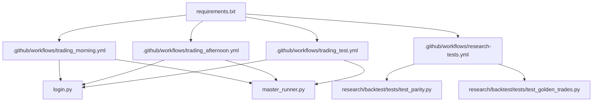
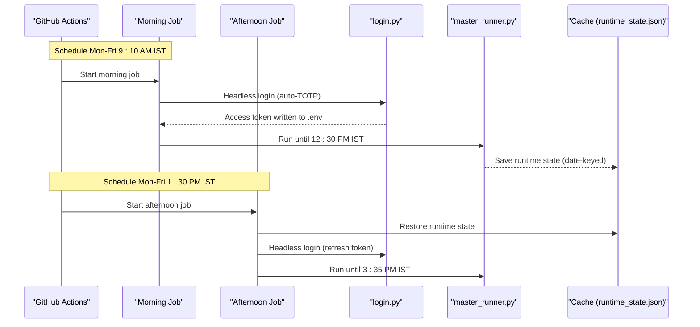
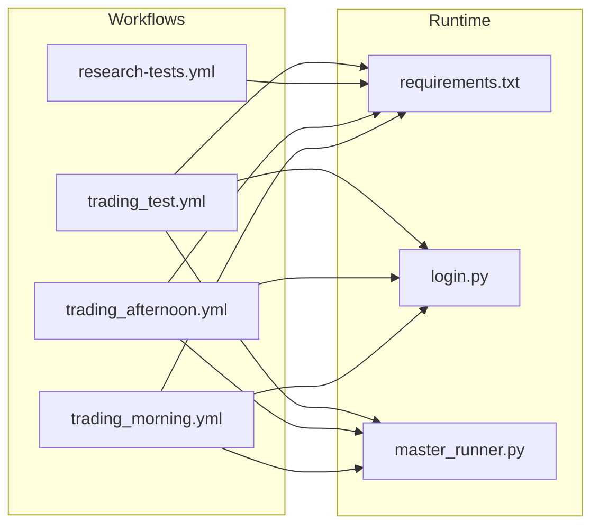

# CI/CD Pipelines

<cite>
**Referenced Files in This Document**
- [trading_morning.yml](file://.github/workflows/trading_morning.yml)
- [trading_afternoon.yml](file://.github/workflows/trading_afternoon.yml)
- [research-tests.yml](file://.github/workflows/research-tests.yml)
- [trading_test.yml](file://.github/workflows/trading_test.yml)
- [login.py](file://login.py)
- [requirements.txt](file://requirements.txt)
- [master_runner.py](file://master_runner.py)
- [test_parity.py](file://research/backtest/tests/test_parity.py)
- [test_golden_trades.py](file://research/backtest/tests/test_golden_trades.py)
</cite>

## Table of Contents
1. Introduction
2. Project Structure
3. Core Components
4. Architecture Overview
5. Detailed Component Analysis
6. Dependency Analysis
7. Performance Considerations
8. Troubleshooting Guide
9. Conclusion
10. Appendices

## Introduction
This document describes the continuous integration and deployment pipelines for a trading system using GitHub Actions. It covers:
- Morning and afternoon trading workflows that automate testing, validation, and execution during market hours
- Research tests workflow to validate ML models and backtesting parity
- Pipeline configuration including environment variables, secrets management, and artifact handling
- Test execution phases (imports, parity tests, smoke tests)
- Deployment strategies across environments via environment flags and runtime state handoff
- Debugging techniques, log analysis, and performance optimization for CI jobs
- Guidance for adding new tests, updating pipelines, and managing dependencies
- Security considerations for credential rotation and access control

## Project Structure
The CI/CD surface is defined by GitHub Actions workflows under .github/workflows. The application code includes a headless login utility, a master runner orchestrating live/paper trading, and research tests validating parity between research and live engines.

**Diagram sources**
- [trading_morning.yml:1-111](file://.github/workflows/trading_morning.yml#L1-L111)
- [trading_afternoon.yml:1-118](file://.github/workflows/trading_afternoon.yml#L1-L118)
- [research-tests.yml:1-33](file://.github/workflows/research-tests.yml#L1-L33)
- [trading_test.yml:1-178](file://.github/workflows/trading_test.yml#L1-L178)
- [login.py:1-243](file://login.py#L1-L243)
- [master_runner.py:1-200](file://master_runner.py#L1-L200)
- [requirements.txt:1-11](file://requirements.txt#L1-L11)

**Section sources**
- [trading_morning.yml:1-111](file://.github/workflows/trading_morning.yml#L1-L111)
- [trading_afternoon.yml:1-118](file://.github/workflows/trading_afternoon.yml#L1-L118)
- [research-tests.yml:1-33](file://.github/workflows/research-tests.yml#L1-L33)
- [trading_test.yml:1-178](file://.github/workflows/trading_test.yml#L1-L178)
- [login.py:1-243](file://login.py#L1-L243)
- [master_runner.py:1-200](file://master_runner.py#L1-L200)
- [requirements.txt:1-11](file://requirements.txt#L1-L11)

## Core Components
- Morning session workflow: schedules at 9:10 AM IST, runs headless login, executes master runner until 12:30 PM IST, saves runtime state to cache keyed by date for afternoon resume.
- Afternoon session workflow: restores morning runtime state from cache, performs fresh login, runs master runner until 3:35 PM IST with an environment flag allowing open positions on start.
- Research tests workflow: triggers on changes to research/utils/scripts/workflows; installs deps; runs parity tests and an obsidian logger smoke test.
- Pipeline test workflow: manual-only end-to-end smoke test that validates imports, writes .env from secrets, performs headless login, runs a short engine run, and verifies logs.

Key environment flags used across workflows:
- PAPER_MODE, TEST_MODE, DRY_RUN for non-live or test modes
- INITIAL_CAPITAL, MAX_RISK_PER_TRADE_PCT, MAX_LOTS_CAP for risk sizing
- ML_ON, CHAMPION_THRESHOLD for ML gating
- ALLOW_BROKER_POSITION_ON_START for afternoon resume safety gate bypass

Secrets consumed:
- KITE_API_KEY, KITE_API_SECRET, KITE_USER_ID, KITE_PASSWORD, KITE_TOTP_SECRET
- TELEGRAM_BOT_TOKEN, TELEGRAM_BOT_CHAT_ID, TELEGRAM_CHANNEL_ID, TELEGRAM_ADMIN_ID

**Section sources**
- [trading_morning.yml:28-111](file://.github/workflows/trading_morning.yml#L28-L111)
- [trading_afternoon.yml:34-118](file://.github/workflows/trading_afternoon.yml#L34-L118)
- [research-tests.yml:13-33](file://.github/workflows/research-tests.yml#L13-L33)
- [trading_test.yml:15-178](file://.github/workflows/trading_test.yml#L15-L178)
- [login.py:21-50](file://login.py#L21-L50)

## Architecture Overview
The CI/CD architecture coordinates scheduled trading sessions and research validations:

**Diagram sources**
- [trading_morning.yml:15-111](file://.github/workflows/trading_morning.yml#L15-L111)
- [trading_afternoon.yml:21-118](file://.github/workflows/trading_afternoon.yml#L21-L118)
- [login.py:147-243](file://login.py#L147-L243)
- [master_runner.py:18-63](file://master_runner.py#L18-L63)

## Detailed Component Analysis

### Morning Session Workflow
- Triggers: cron schedule and manual dispatch
- Environment: sets timezone to IST
- Steps: checkout, Python setup with pip cache, install requirements, install Playwright Chromium, create directories, compute TODAY key, write .env from secrets, headless login, run master runner with timeout until 12:30 PM IST, save runtime state to cache even on failure

Runtime state handoff:
- Saves data/runtime_state.json with key runtime-state-${TODAY} so afternoon can resume position management seamlessly

Security and mode flags:
- Writes DRY_RUN=1 and TEST_MODE=0 for safe execution in CI
- Uses secrets for all credentials

**Section sources**
- [trading_morning.yml:15-111](file://.github/workflows/trading_morning.yml#L15-L111)

### Afternoon Session Workflow
- Triggers: cron schedule and manual dispatch
- Restores morning runtime state from cache if present
- Writes .env with additional ALLOW_BROKER_POSITION_ON_START=1 to allow startup with open positions
- Performs fresh headless login and runs master runner until 3:35 PM IST

Reconciliation behavior:
- If there was an open position at lunch, engine reconciliation detects it via broker + saved state and resumes stop/target management automatically

**Section sources**
- [trading_afternoon.yml:21-118](file://.github/workflows/trading_afternoon.yml#L21-L118)

### Research Tests Workflow
- Triggers: pull requests touching research/, utils/, scripts/, .github/workflows/
- Runs parity tests under research/backtest/tests
- Runs an obsidian logger smoke test (script path referenced in workflow)

Purpose:
- Validates ML model decisions and backtesting results against deterministic expectations and parity with live logic

**Section sources**
- [research-tests.yml:1-33](file://.github/workflows/research-tests.yml#L1-L33)

### Pipeline Test Workflow (Manual)
- Manual-only end-to-end smoke test
- Validates imports, installs dependencies, writes .env from secrets, performs headless login, runs master runner for 120 seconds, and verifies expected log markers
- Uploads login screenshots as artifacts for debugging

Environment flags:
- Sets TEST_MODE=1 and DRY_RUN=1 for safe CI execution

Artifacts:
- login-screenshots uploaded when available

**Section sources**
- [trading_test.yml:1-178](file://.github/workflows/trading_test.yml#L1-L178)

### Login Utility
- Loads .env, validates required credentials, automates headless login with TOTP, obtains request token, exchanges for access token, updates .env with KITE_ACCESS_TOKEN, and persists backup file

Integration points:
- Used by morning, afternoon, and pipeline test workflows to authenticate with the broker before running the trading engine

Error handling:
- Raises errors if required env vars are missing
- Handles timeouts waiting for redirect tokens

**Section sources**
- [login.py:21-50](file://login.py#L21-L50)
- [login.py:147-243](file://login.py#L147-L243)

### Master Runner Integration
- Loads .env, configures logging, initializes core components (execution engine, context, live engine), and manages lifecycle of trading loops
- Integrates with Telegram notifications and analytics suite

CI relevance:
- Invoked by morning/afternoon/pipeline test workflows with timeouts to bound execution time

**Section sources**
- [master_runner.py:18-63](file://master_runner.py#L18-L63)

### Research Parity and Golden Trade Tests
- Parity tests verify sizing invariants, cost model calculations, entry/exit logic consistency between research and live engines
- Golden trade tests parameterize canonical cases and assert entry/exit reasons and prices match expectations

Test execution:
- Executed by research-tests workflow via pytest

**Section sources**
- [test_parity.py:1-533](file://research/backtest/tests/test_parity.py#L1-L533)
- [test_golden_trades.py:1-146](file://research/backtest/tests/test_golden_trades.py#L1-L146)

## Dependency Analysis
External dependencies installed via requirements.txt include broker SDK, OTP, data processing, ML libraries, HTTP client, and browser automation. Workflows pin Python versions and use pip caching to speed up installs.

**Diagram sources**
- [trading_morning.yml:35-48](file://.github/workflows/trading_morning.yml#L35-L48)
- [trading_afternoon.yml:41-54](file://.github/workflows/trading_afternoon.yml#L41-L54)
- [research-tests.yml:19-30](file://.github/workflows/research-tests.yml#L19-L30)
- [trading_test.yml:28-41](file://.github/workflows/trading_test.yml#L28-L41)
- [requirements.txt:1-11](file://requirements.txt#L1-L11)

**Section sources**
- [requirements.txt:1-11](file://requirements.txt#L1-L11)
- [trading_morning.yml:35-48](file://.github/workflows/trading_morning.yml#L35-L48)
- [trading_afternoon.yml:41-54](file://.github/workflows/trading_afternoon.yml#L41-L54)
- [research-tests.yml:19-30](file://.github/workflows/research-tests.yml#L19-L30)
- [trading_test.yml:28-41](file://.github/workflows/trading_test.yml#L28-L41)

## Performance Considerations
- Use pip caching to reduce dependency install times across jobs
- Install Playwright Chromium once per job; avoid repeated downloads
- Keep CI jobs focused: separate research tests from live session workflows
- Limit runtime of long-running jobs with timeouts; ensure graceful shutdowns
- Avoid sharing sensitive tokens between jobs; re-login each session for security and health
- Cache only necessary artifacts (e.g., runtime state keyed by date)

[No sources needed since this section provides general guidance]

## Troubleshooting Guide
Common issues and resolutions:
- Missing secrets: Ensure repository secrets are configured for all KITE and TELEGRAM keys; the pipeline test explicitly checks for presence and prints guidance
- Login failures: Verify TOTP secret and credentials; check login screenshots uploaded by the pipeline test
- Import errors: Validate that all packages listed in requirements.txt are installed; the pipeline test enumerates installed packages and checks imports
- Engine startup issues: Inspect last lines of engine logs captured by the pipeline test; verify expected log markers like broker initialization and telegram startup
- State handoff problems: Confirm morning job saved runtime state and afternoon job restored it; check cache keys based on today’s date

Debugging steps:
- Re-run the pipeline test manually to reproduce issues in a controlled environment
- Review step logs for exact error messages and stack traces
- For login issues, download and inspect login-screenshots artifacts
- For research test failures, run pytest locally with the same Python version and dependencies

**Section sources**
- [trading_test.yml:62-103](file://.github/workflows/trading_test.yml#L62-L103)
- [trading_test.yml:118-178](file://.github/workflows/trading_test.yml#L118-L178)
- [login.py:21-50](file://login.py#L21-L50)

## Conclusion
The CI/CD pipelines provide robust scheduling, authentication, and execution for trading sessions, alongside rigorous research validation. Secrets are managed securely, runtime state is persisted for seamless session handoff, and comprehensive smoke tests ensure reliability. Following the guidance here will help maintain stable operations, simplify debugging, and support secure, scalable growth of the system.

[No sources needed since this section summarizes without analyzing specific files]

## Appendices

### Adding New Test Cases
- Place new tests under research/backtest/tests for parity and golden trade coverage
- Use existing fixtures and mocking patterns to isolate external dependencies
- Ensure tests run via pytest and pass in the research-tests workflow

Updating pipeline configurations:
- Modify relevant workflow files to add steps or change triggers
- Pin Python versions and dependency versions consistently
- Add new secrets only when necessary and rotate regularly

Managing dependencies:
- Update requirements.txt with pinned versions where appropriate
- Leverage pip caching in workflows to speed up installs
- Validate imports early in CI to catch missing or incompatible packages

Security considerations:
- Rotate KITE and TELEGRAM secrets regularly
- Restrict workflow permissions to minimum required scopes
- Avoid printing secrets in logs; mask sensitive values
- Prefer paper/test modes in CI to prevent unintended live actions

Rollback procedures:
- Revert workflow changes via Git revert and push to trigger a clean run
- If a deployed session has issues, rely on broker-side stops and engine failsafes; restart the next scheduled session after resolving root causes
- Use manual dispatch to rerun failed jobs with updated fixes

[No sources needed since this section provides general guidance]