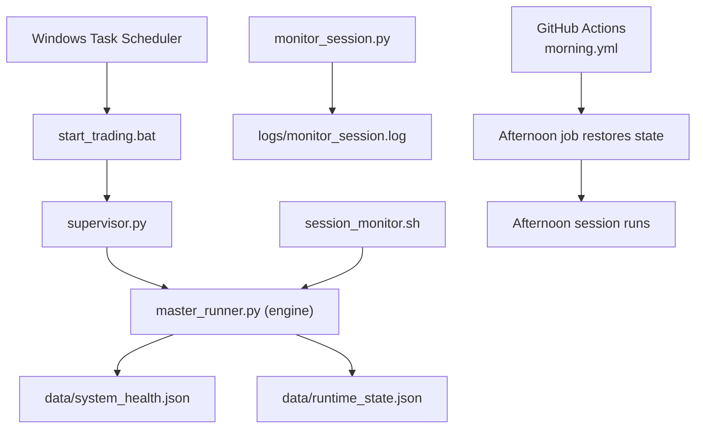
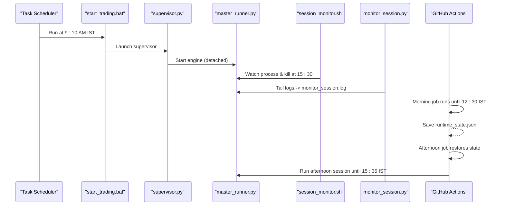
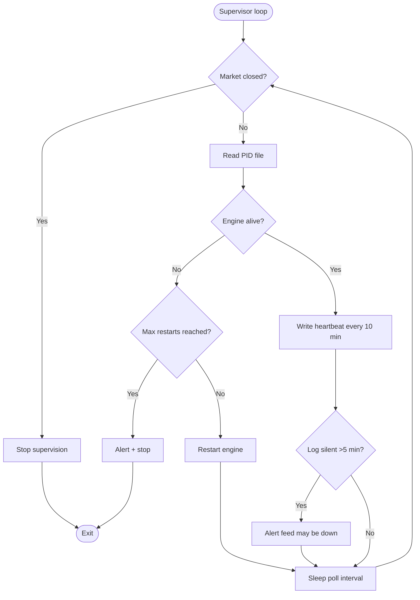
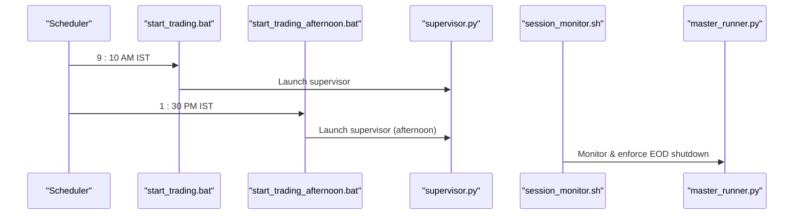
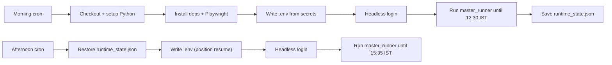
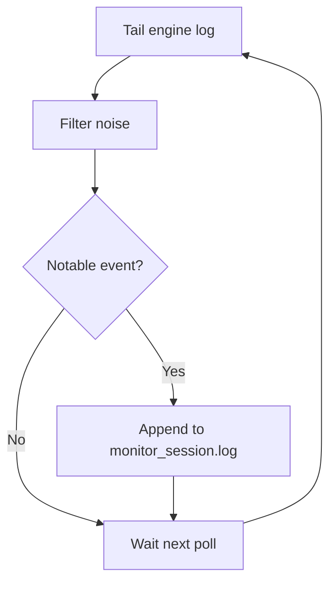
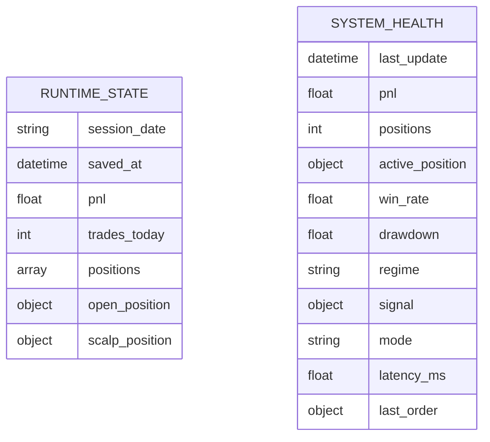

# Deployment and Operations

<cite>
**Referenced Files in This Document**
- [supervisor.py](file://scripts/supervisor.py)
- [session_monitor.sh](file://scripts/session_monitor.sh)
- [start_trading.bat](file://scripts/start_trading.bat)
- [start_trading_afternoon.bat](file://scripts/start_trading_afternoon.bat)
- [monitor_session.py](file://scripts/monitor_session.py)
- [health_monitor.py](file://engine/core/health_monitor.py)
- [config.py](file://engine/config/config.py)
- [system_health.json](file://data/system_health.json)
- [runtime_state.json](file://data/runtime_state.json)
- [trading_morning.yml](file://.github/workflows/trading_morning.yml)
- [trading_afternoon.yml](file://.github/workflows/trading_afternoon.yml)
- [trading_test.yml](file://.github/workflows/trading_test.yml)
- [research-tests.yml](file://.github/workflows/research-tests.yml)
</cite>

## Table of Contents
1. Introduction
2. Project Structure
3. Core Components
4. Architecture Overview
5. Detailed Component Analysis
6. Dependency Analysis
7. Performance Considerations
8. Troubleshooting Guide
9. Conclusion
10. Appendices

## Introduction
This document provides production deployment and operational procedures for the trading system. It covers process supervision, automated session scripts, CI/CD automation via GitHub Actions, monitoring and alerting, troubleshooting, performance optimization, scaling considerations, backup and recovery, monitoring best practices, security, and operational runbooks. The goal is to enable reliable, safe, and observable live trading with clear operational controls.

## Project Structure
The system uses a supervisor-based architecture:
- A Windows batch launcher starts the supervisor at market open and after lunch.
- The supervisor monitors and restarts the engine (master_runner.py), writes heartbeats, and sends Telegram alerts when needed.
- A shell monitor enforces end-of-day shutdown and can restart on failure.
- A lightweight log tailer filters notable events into a compact monitoring log.
- Health snapshots are persisted to disk for dashboards or external tools.
- CI/CD workflows automate testing and scheduled trading sessions with state hand-off between morning and afternoon jobs.

**Diagram sources**
- [start_trading.bat:1-32](file://scripts/start_trading.bat#L1-L32)
- [supervisor.py:1-216](file://scripts/supervisor.py#L1-L216)
- [session_monitor.sh:1-41](file://scripts/session_monitor.sh#L1-L41)
- [monitor_session.py:1-69](file://scripts/monitor_session.py#L1-L69)
- [health_monitor.py:1-67](file://engine/core/health_monitor.py#L1-L67)
- [trading_morning.yml:1-111](file://.github/workflows/trading_morning.yml#L1-L111)
- [trading_afternoon.yml:1-118](file://.github/workflows/trading_afternoon.yml#L1-L118)

**Section sources**
- [start_trading.bat:1-32](file://scripts/start_trading.bat#L1-L32)
- [start_trading_afternoon.bat:1-36](file://scripts/start_trading_afternoon.bat#L1-L36)
- [supervisor.py:1-216](file://scripts/supervisor.py#L1-L216)
- [session_monitor.sh:1-41](file://scripts/session_monitor.sh#L1-L41)
- [monitor_session.py:1-69](file://scripts/monitor_session.py#L1-L69)
- [health_monitor.py:1-67](file://engine/core/health_monitor.py#L1-L67)
- [trading_morning.yml:1-111](file://.github/workflows/trading_morning.yml#L1-L111)
- [trading_afternoon.yml:1-118](file://.github/workflows/trading_afternoon.yml#L1-L118)

## Core Components
- Supervisor: Watches the engine process, auto-restarts up to a limit, logs heartbeats, stops after market close, and sends Telegram alerts on critical events.
- Session Scripts: Windows launchers for morning and afternoon sessions; a shell script that enforces EOD shutdown and can restart if needed.
- Monitoring: Lightweight log tailer that extracts notable events into a compact log; health snapshot writer for runtime metrics.
- Configuration: Centralized environment-driven configuration for modes, risk, execution rules, ML thresholds, and scalping behavior.
- CI/CD: Scheduled GitHub Actions for morning and afternoon sessions with state caching and headless login; manual pipeline test workflow.

**Section sources**
- [supervisor.py:1-216](file://scripts/supervisor.py#L1-L216)
- [session_monitor.sh:1-41](file://scripts/session_monitor.sh#L1-L41)
- [monitor_session.py:1-69](file://scripts/monitor_session.py#L1-L69)
- [health_monitor.py:1-67](file://engine/core/health_monitor.py#L1-L67)
- [config.py:1-164](file://engine/config/config.py#L1-L164)
- [trading_morning.yml:1-111](file://.github/workflows/trading_morning.yml#L1-L111)
- [trading_afternoon.yml:1-118](file://.github/workflows/trading_afternoon.yml#L1-L118)
- [trading_test.yml:1-178](file://.github/workflows/trading_test.yml#L1-L178)

## Architecture Overview
End-to-end flow from scheduler to engine and back to monitoring:

**Diagram sources**
- [start_trading.bat:1-32](file://scripts/start_trading.bat#L1-L32)
- [supervisor.py:1-216](file://scripts/supervisor.py#L1-L216)
- [session_monitor.sh:1-41](file://scripts/session_monitor.sh#L1-L41)
- [monitor_session.py:1-69](file://scripts/monitor_session.py#L1-L69)
- [trading_morning.yml:1-111](file://.github/workflows/trading_morning.yml#L1-L111)
- [trading_afternoon.yml:1-118](file://.github/workflows/trading_afternoon.yml#L1-L118)

## Detailed Component Analysis

### Supervisor Process Management
Responsibilities:
- Polls the engine process liveness using PID file and OS-safe checks.
- Restarts the engine up to a configurable maximum number of restarts.
- Writes periodic heartbeat status including last log line and monitor event count.
- Stops supervision after market close to avoid unintended restarts.
- Sends Telegram alerts on restarts and silent engine logs during market hours.

Operational notes:
- Uses environment variables for max restarts and Telegram credentials.
- Avoids importing notifier threads to prevent Telegram conflicts.
- Ensures UTF-8 console output on Windows.

**Diagram sources**
- [supervisor.py:1-216](file://scripts/supervisor.py#L1-L216)

**Section sources**
- [supervisor.py:1-216](file://scripts/supervisor.py#L1-L216)

### Automated Trading Scripts
Morning session:
- Batch script kills any stale engine from previous day, then launches supervisor to start the engine.
- Designed to be triggered by Windows Task Scheduler at market open.

Afternoon session:
- Batch script kills the morning engine, sets an environment variable to allow resuming positions, and relaunches supervisor.
- Designed to be triggered by Windows Task Scheduler after lunch break.

Shell monitor:
- Runs periodically until market close, checks process liveness, restarts if dead, prints today’s trades and PnL, and kills the engine at end of day.

**Diagram sources**
- [start_trading.bat:1-32](file://scripts/start_trading.bat#L1-L32)
- [start_trading_afternoon.bat:1-36](file://scripts/start_trading_afternoon.bat#L1-L36)
- [session_monitor.sh:1-41](file://scripts/session_monitor.sh#L1-L41)

**Section sources**
- [start_trading.bat:1-32](file://scripts/start_trading.bat#L1-L32)
- [start_trading_afternoon.bat:1-36](file://scripts/start_trading_afternoon.bat#L1-L36)
- [session_monitor.sh:1-41](file://scripts/session_monitor.sh#L1-L41)

### CI/CD Pipelines (GitHub Actions)
Morning session:
- Scheduled Mon–Fri at 9:10 AM IST.
- Sets timezone, installs dependencies, installs Playwright, creates directories, writes .env from secrets, performs headless login, runs engine until 12:30 IST, and saves runtime state to cache for afternoon.

Afternoon session:
- Scheduled Mon–Fri at 1:30 PM IST.
- Restores runtime state from cache, writes .env with position resume flag, performs headless login, runs engine until 15:35 IST.

Pipeline test:
- Manual-only workflow that validates imports, writes .env, performs headless login, runs a short smoke test of the engine, and verifies key log outputs.

Research tests:
- Runs parity tests and smoke tests on changes to research, utils, scripts, and workflows.

**Diagram sources**
- [trading_morning.yml:1-111](file://.github/workflows/trading_morning.yml#L1-L111)
- [trading_afternoon.yml:1-118](file://.github/workflows/trading_afternoon.yml#L1-L118)
- [trading_test.yml:1-178](file://.github/workflows/trading_test.yml#L1-L178)
- [research-tests.yml:1-33](file://.github/workflows/research-tests.yml#L1-L33)

**Section sources**
- [trading_morning.yml:1-111](file://.github/workflows/trading_morning.yml#L1-L111)
- [trading_afternoon.yml:1-118](file://.github/workflows/trading_afternoon.yml#L1-L118)
- [trading_test.yml:1-178](file://.github/workflows/trading_test.yml#L1-L178)
- [research-tests.yml:1-33](file://.github/workflows/research-tests.yml#L1-L33)

### Session Monitoring and Alerting
- Log tailer: Reads the engine log continuously, filters out noisy lines, and appends notable events to a compact monitoring log.
- Shell monitor: Periodically checks process liveness, prints summary info, and shuts down at market close.
- Health snapshot: Writes a JSON snapshot of key metrics (PnL, positions, latency, mode, etc.) to disk for dashboards or external monitoring.

**Diagram sources**
- [monitor_session.py:1-69](file://scripts/monitor_session.py#L1-L69)

**Section sources**
- [monitor_session.py:1-69](file://scripts/monitor_session.py#L1-L69)
- [session_monitor.sh:1-41](file://scripts/session_monitor.sh#L1-L41)
- [health_monitor.py:1-67](file://engine/core/health_monitor.py#L1-L67)
- [system_health.json:1-13](file://data/system_health.json#L1-L13)

### Startup Procedures and Graceful Shutdown
- Morning startup: Use the Windows batch script to clean stale processes and launch the supervisor, which starts the engine.
- Afternoon restart: Use the afternoon batch script to cleanly restart the engine with position resume enabled.
- Graceful shutdown: The shell monitor terminates the engine at market close; the supervisor also stops supervision after market close.

Best practices:
- Ensure environment variables are set correctly before starting.
- Verify PID file presence and remove stale files if necessary.
- Confirm logs are being written and monitor_session.log shows expected events.

**Section sources**
- [start_trading.bat:1-32](file://scripts/start_trading.bat#L1-L32)
- [start_trading_afternoon.bat:1-36](file://scripts/start_trading_afternoon.bat#L1-L36)
- [session_monitor.sh:1-41](file://scripts/session_monitor.sh#L1-L41)
- [supervisor.py:1-216](file://scripts/supervisor.py#L1-L216)

### Backup and Recovery
Critical artifacts:
- Runtime state: data/runtime_state.json captures session date, PnL, trades, positions, and open positions for hand-off between sessions.
- Health snapshot: data/system_health.json contains latest metrics for observability.
- Logs: logs/master_runner.log and logs/monitor_session.log for audit and diagnostics.

Backup strategy:
- Periodically copy data/runtime_state.json and data/system_health.json to a secure backup location.
- Archive logs daily to preserve historical records.
- In CI/CD, rely on cached runtime_state.json for state hand-off between morning and afternoon jobs.

Recovery steps:
- If the engine crashes mid-session, restore runtime_state.json before restarting the afternoon session to resume position management.
- If logs are rotated or truncated, ensure the monitor tailer resets its read position automatically.

**Section sources**
- [runtime_state.json:1-9](file://data/runtime_state.json#L1-L9)
- [system_health.json:1-13](file://data/system_health.json#L1-L13)
- [trading_morning.yml:103-111](file://.github/workflows/trading_morning.yml#L103-L111)
- [trading_afternoon.yml:59-66](file://.github/workflows/trading_afternoon.yml#L59-L66)

### Monitoring Best Practices, Log Management, and Profiling
- Monitoring:
  - Keep monitor_session.py running alongside the engine to capture notable events.
  - Use system_health.json for quick metric snapshots.
  - Configure supervisor alerts for restarts and silent logs during market hours.
- Log management:
  - Rotate logs regularly to prevent disk growth.
  - Maintain both raw engine logs and filtered monitoring logs for different audiences.
- Profiling:
  - Track latency_ms from health snapshots to detect slowdowns.
  - Correlate spikes in latency with broker API calls or heavy computations.

**Section sources**
- [monitor_session.py:1-69](file://scripts/monitor_session.py#L1-L69)
- [health_monitor.py:1-67](file://engine/core/health_monitor.py#L1-L67)
- [supervisor.py:191-210](file://scripts/supervisor.py#L191-L210)

### Security Considerations
- Secrets management:
  - Store all credentials in GitHub Secrets for CI/CD usage.
  - Use environment variables for local deployments; avoid committing .env files.
- Access controls:
  - Restrict access to production machines and repositories.
  - Limit who can modify CI/CD workflows and secrets.
- Operational hygiene:
  - Rotate tokens regularly.
  - Audit logs for unauthorized activity.
  - Use least privilege for service accounts.

**Section sources**
- [trading_morning.yml:53-84](file://.github/workflows/trading_morning.yml#L53-L84)
- [trading_afternoon.yml:68-100](file://.github/workflows/trading_afternoon.yml#L68-L100)
- [trading_test.yml:62-102](file://.github/workflows/trading_test.yml#L62-L102)

### Operational Runbooks
Incident response:
- Engine down:
  - Check supervisor logs for restart attempts and Telegram alerts.
  - Verify PID file and process existence; remove stale PID if needed.
  - Review engine logs for errors; restart manually if necessary.
- Silent logs during market hours:
  - Expect supervisor alert about feed issues; check broker connectivity and network.
  - Validate that monitor_session.log continues to receive updates.
- Position mismatch:
  - Restore runtime_state.json from backup if corrupted.
  - Re-run afternoon session with position resume enabled to reconcile.

System maintenance:
- Update dependencies and re-run pipeline test to validate environment.
- Rotate logs and archive historical data.
- Review health snapshots and monitor_session.log for anomalies.

**Section sources**
- [supervisor.py:161-216](file://scripts/supervisor.py#L161-L216)
- [session_monitor.sh:1-41](file://scripts/session_monitor.sh#L1-L41)
- [monitor_session.py:1-69](file://scripts/monitor_session.py#L1-L69)
- [runtime_state.json:1-9](file://data/runtime_state.json#L1-L9)

## Dependency Analysis
Key runtime dependencies:
- Supervisor depends on psutil or tasklist for process checks; falls back gracefully.
- Monitor tailer depends on filesystem access to engine logs.
- Health monitor writes JSON snapshots to data directory.
- CI/CD depends on Python 3.11/3.12, Playwright, and repository secrets.

Coupling and cohesion:
- Supervisor and engine are loosely coupled via PID file and logs.
- Monitoring components are decoupled from engine logic, reading logs only.
- CI/CD workflows encapsulate environment setup and execution, minimizing local coupling.

Potential circular dependencies:
- None observed; components communicate via files and processes.

External integrations:
- Broker API (Zerodha) via headless login and token refresh.
- Telegram for alerts via direct HTTP requests.

**Section sources**
- [supervisor.py:77-107](file://scripts/supervisor.py#L77-L107)
- [monitor_session.py:14-31](file://scripts/monitor_session.py#L14-L31)
- [health_monitor.py:9-48](file://engine/core/health_monitor.py#L9-L48)
- [trading_morning.yml:35-48](file://.github/workflows/trading_morning.yml#L35-L48)
- [trading_afternoon.yml:41-54](file://.github/workflows/trading_afternoon.yml#L41-L54)

## Performance Considerations
- Reduce polling frequency in supervisor and monitor to balance responsiveness and CPU usage.
- Enable dry-run or paper-mode in CI/CD to validate without real orders.
- Tune ML thresholds and scalp parameters via environment variables to control trade frequency and risk.
- Monitor latency_ms in health snapshots to identify bottlenecks.
- Use efficient log filtering to minimize I/O overhead.

[No sources needed since this section provides general guidance]

## Troubleshooting Guide
Common issues and resolutions:
- Stale PID file:
  - Remove data/.master_runner.pid if the process is not running; supervisor will restart the engine.
- Telegram alerts not received:
  - Verify TELEGRAM_BOT_TOKEN and TELEGRAM_BOT_CHAT_ID are set; check network connectivity.
- Engine not writing logs:
  - Check permissions on logs directory; ensure UTF-8 encoding is set for console output.
- Afternoon session fails to resume positions:
  - Ensure runtime_state.json was saved by morning job; confirm ALLOW_BROKER_POSITION_ON_START is set for afternoon.
- CI/CD login failures:
  - Validate secrets are configured; review screenshots uploaded by the pipeline test.

**Section sources**
- [supervisor.py:133-158](file://scripts/supervisor.py#L133-L158)
- [supervisor.py:51-68](file://scripts/supervisor.py#L51-L68)
- [session_monitor.sh:10-18](file://scripts/session_monitor.sh#L10-L18)
- [trading_afternoon.yml:68-100](file://.github/workflows/trading_afternoon.yml#L68-L100)
- [trading_test.yml:118-128](file://.github/workflows/trading_test.yml#L118-L128)

## Conclusion
The trading system employs a robust supervision model with automated session scripts, comprehensive monitoring, and CI/CD pipelines for testing and deployment. By following the operational procedures, monitoring best practices, and troubleshooting guides, operators can maintain reliable live trading with clear visibility and controlled risk.

[No sources needed since this section summarizes without analyzing specific files]

## Appendices

### Configuration Reference
Environment-driven settings include modes, capital and risk limits, entry confirmation gates, trailing and scale-out rules, scalping parameters, and ML thresholds. Adjust these via environment variables to tailor behavior for production.

**Section sources**
- [config.py:1-164](file://engine/config/config.py#L1-L164)

### Data Models
Runtime state and health snapshots provide structured data for session continuity and observability.

**Diagram sources**
- [runtime_state.json:1-9](file://data/runtime_state.json#L1-L9)
- [system_health.json:1-13](file://data/system_health.json#L1-L13)