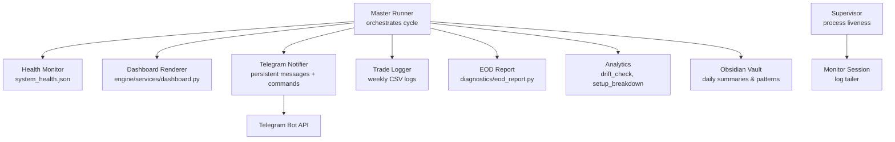
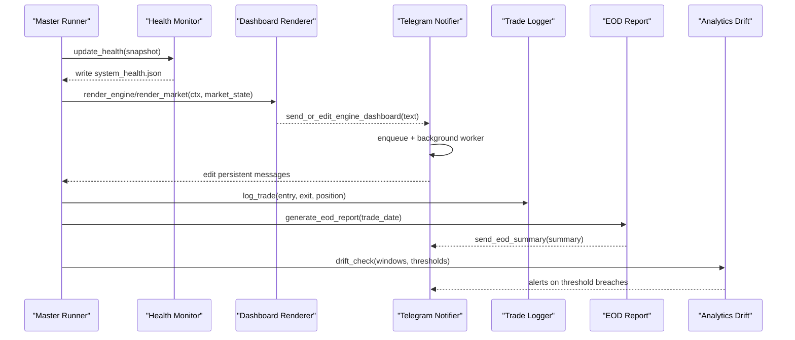
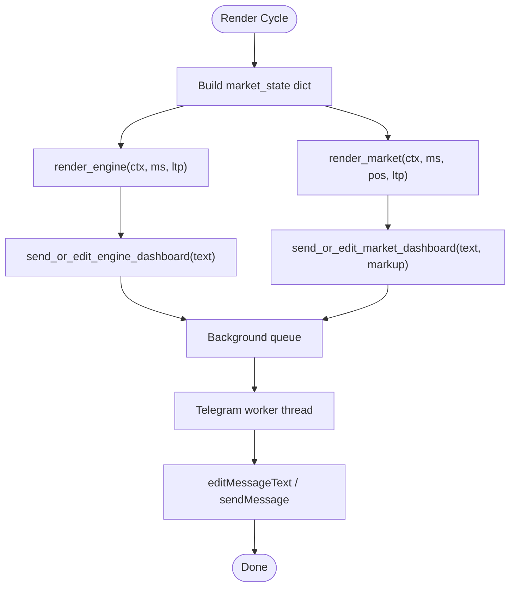
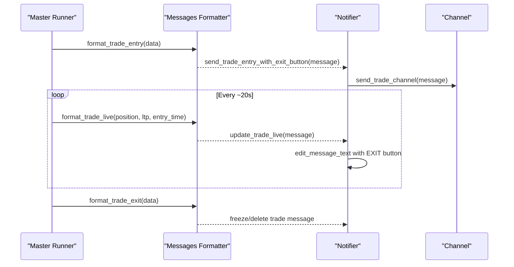
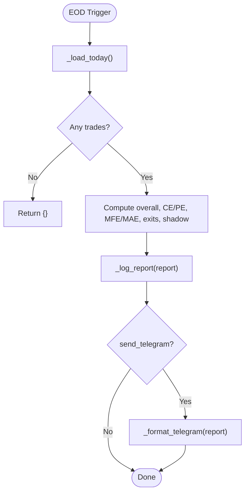
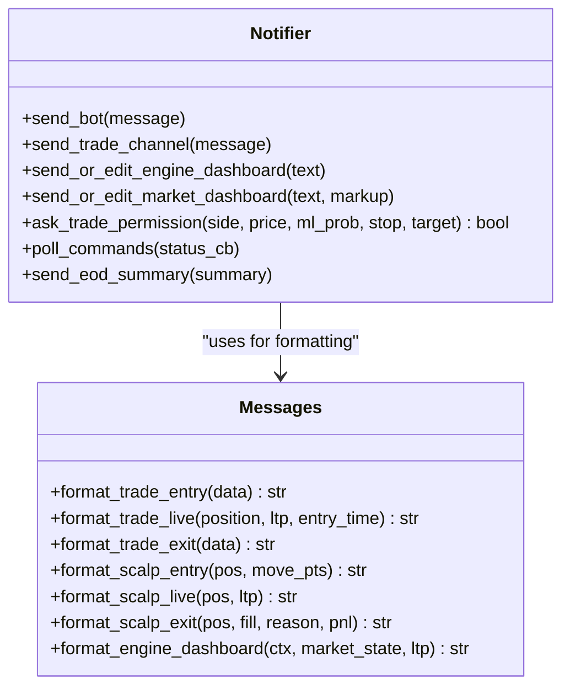
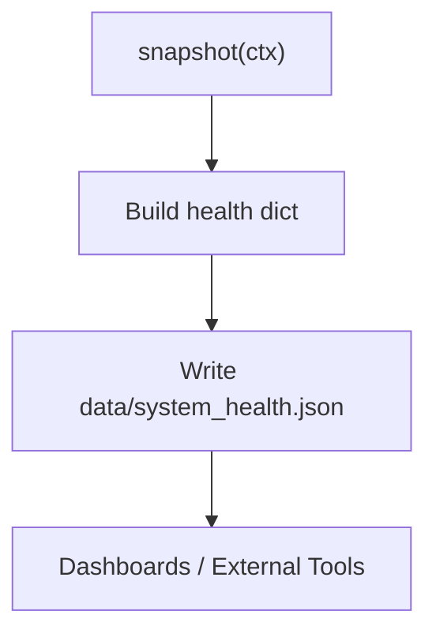
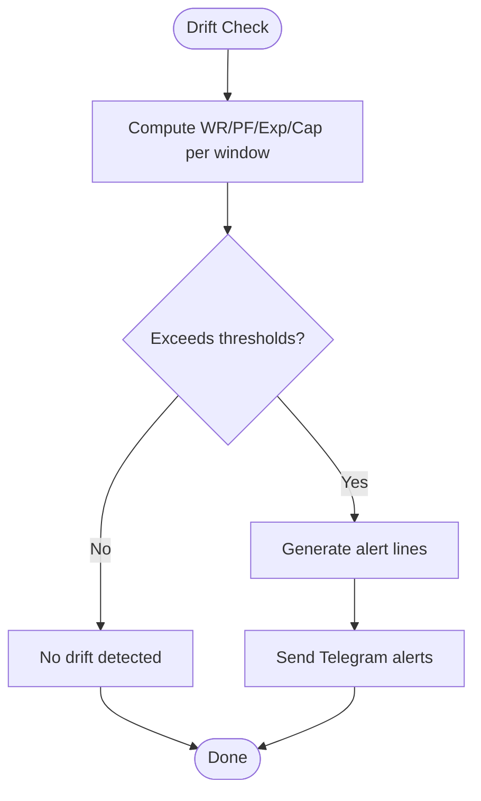
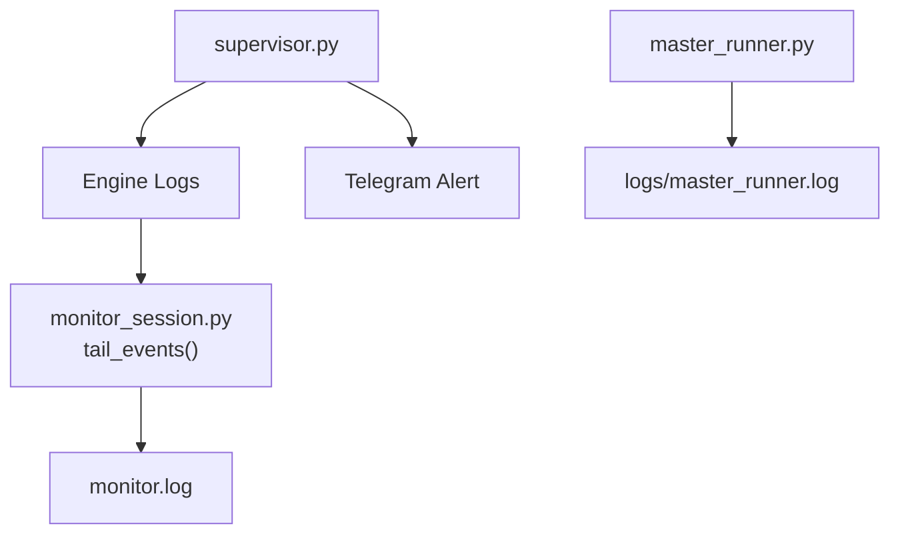
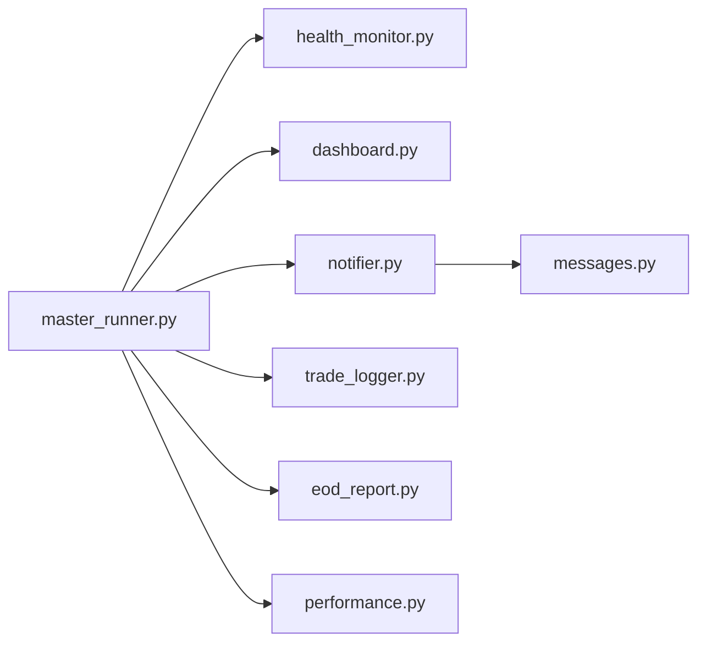

# Monitoring and Alerts

<cite>
**Referenced Files in This Document**
- [master_runner.py](file://master_runner.py)
- [health_monitor.py](file://engine/core/health_monitor.py)
- [dashboard.py](file://engine/services/dashboard.py)
- [notifier.py](file://telegram/notifier.py)
- [messages.py](file://telegram/messages.py)
- [eod_report.py](file://engine/diagnostics/eod_report.py)
- [trade_logger.py](file://engine/services/trade_logger.py)
- [obsidian_logger.py](file://utils/obsidian_logger.py)
- [performance.py](file://engine/analytics/performance.py)
- [monitor_session.py](file://scripts/monitor_session.py)
- [supervisor.py](file://scripts/supervisor.py)
</cite>

## Table of Contents
1. [Introduction](#introduction)
2. [Project Structure](#project-structure)
3. [Core Components](#core-components)
4. [Architecture Overview](#architecture-overview)
5. [Detailed Component Analysis](#detailed-component-analysis)
6. [Dependency Analysis](#dependency-analysis)
7. [Performance Considerations](#performance-considerations)
8. [Troubleshooting Guide](#troubleshooting-guide)
9. [Conclusion](#conclusion)
10. [Appendices](#appendices)

## Introduction
This document explains the monitoring, alerting, and reporting capabilities of the trading platform. It covers:
- Real-time dashboards for performance metrics, trade flow, and system health
- End-of-day (EOD) reporting with P&L analysis, trade statistics, and performance attribution
- Telegram-based notifications for trade confirmations, errors, warnings, and commands
- Health monitoring including API connectivity checks, model performance drift, and resource utilization tracking
- Alert thresholds, escalation procedures, and notification routing strategies
- Log aggregation, structured logging practices, and log retention policies
- Guidance for custom monitors, alert rules, and integration with external systems such as Prometheus or Grafana
- Performance profiling techniques and bottleneck identification methods

## Project Structure
The monitoring and alerting subsystem spans several modules:
- Core health snapshotting and telemetry
- Real-time dashboards rendered to Telegram
- Trade lifecycle messaging and live updates
- EOD analytics and reporting
- Structured logging and vault-style notes
- Supervisor and session monitors for process liveness and log tailing
- Analytics for strategy drift and performance breakdowns

**Diagram sources**
- [master_runner.py:34-43](file://master_runner.py#L34-L43)
- [health_monitor.py:12-48](file://engine/core/health_monitor.py#L12-L48)
- [dashboard.py:61-144](file://engine/services/dashboard.py#L61-L144)
- [notifier.py:117-163](file://telegram/notifier.py#L117-L163)
- [trade_logger.py:49-141](file://engine/services/trade_logger.py#L49-L141)
- [eod_report.py:124-178](file://engine/diagnostics/eod_report.py#L124-L178)
- [performance.py:294-356](file://engine/analytics/performance.py#L294-L356)
- [obsidian_logger.py:124-186](file://utils/obsidian_logger.py#L124-L186)
- [supervisor.py:51-78](file://scripts/supervisor.py#L51-L78)
- [monitor_session.py:40-68](file://scripts/monitor_session.py#L40-L68)

**Section sources**
- [master_runner.py:34-43](file://master_runner.py#L34-L43)
- [health_monitor.py:12-48](file://engine/core/health_monitor.py#L12-L48)
- [dashboard.py:61-144](file://engine/services/dashboard.py#L61-L144)
- [notifier.py:117-163](file://telegram/notifier.py#L117-L163)
- [trade_logger.py:49-141](file://engine/services/trade_logger.py#L49-L141)
- [eod_report.py:124-178](file://engine/diagnostics/eod_report.py#L124-L178)
- [performance.py:294-356](file://engine/analytics/performance.py#L294-L356)
- [obsidian_logger.py:124-186](file://utils/obsidian_logger.py#L124-L186)
- [supervisor.py:51-78](file://scripts/supervisor.py#L51-L78)
- [monitor_session.py:40-68](file://scripts/monitor_session.py#L40-L68)

## Core Components
- Health monitor writes periodic snapshots of key metrics (PnL, positions, latency, regime) to a JSON file for consumption by dashboards and external tools.
- Dashboard renderer formats rich HTML messages for two persistent Telegram cards: AI Engine status and Live Market status.
- Telegram notifier manages persistent message IDs, background queue for non-blocking sends, command polling, trade confirmation prompts, and fallback logging when Telegram is unreachable.
- Trade logger persists every completed trade to weekly CSV files with comprehensive fields (entry/exit, slippage, latencies, MFE/MAE).
- EOD report aggregates daily trades into structured analytics and optional Telegram summary.
- Obsidian logger writes human-friendly daily summaries and pattern notes for post-trade review.
- Analytics module provides drift detection and performance breakdowns with threshold-based alerts.
- Supervisor and monitor scripts provide process liveness checks and log tailing for operational visibility.

**Section sources**
- [health_monitor.py:12-48](file://engine/core/health_monitor.py#L12-L48)
- [dashboard.py:61-144](file://engine/services/dashboard.py#L61-L144)
- [notifier.py:117-163](file://telegram/notifier.py#L117-L163)
- [trade_logger.py:49-141](file://engine/services/trade_logger.py#L49-L141)
- [eod_report.py:124-178](file://engine/diagnostics/eod_report.py#L124-L178)
- [obsidian_logger.py:124-186](file://utils/obsidian_logger.py#L124-L186)
- [performance.py:294-356](file://engine/analytics/performance.py#L294-L356)
- [supervisor.py:51-78](file://scripts/supervisor.py#L51-L78)
- [monitor_session.py:40-68](file://scripts/monitor_session.py#L40-L68)

## Architecture Overview
The system uses a master loop that orchestrates data ingestion, signal generation, execution, and monitoring. Monitoring components are decoupled via queues and file-based state to avoid blocking trading logic.

**Diagram sources**
- [health_monitor.py:12-48](file://engine/core/health_monitor.py#L12-L48)
- [dashboard.py:61-144](file://engine/services/dashboard.py#L61-L144)
- [notifier.py:117-163](file://telegram/notifier.py#L117-L163)
- [trade_logger.py:49-141](file://engine/services/trade_logger.py#L49-L141)
- [eod_report.py:124-178](file://engine/diagnostics/eod_report.py#L124-L178)
- [performance.py:294-356](file://engine/analytics/performance.py#L294-L356)

## Detailed Component Analysis

### Real-Time Dashboards
- Two persistent Telegram messages are maintained:
  - AI Engine dashboard: technical indicators, ML bias bars, scoring, decision reason, today’s stats
  - Live Market dashboard: current position details, trailing stop lock levels, ORB/VWAP, engine state
- Messages are edited in place using persisted message IDs; if a target message is deleted, the system recreates it automatically.
- Human-readable formatting includes emojis, bar charts, and concise sections for quick scanning.

**Diagram sources**
- [dashboard.py:61-144](file://engine/services/dashboard.py#L61-L144)
- [dashboard.py:151-226](file://engine/services/dashboard.py#L151-L226)
- [notifier.py:333-378](file://telegram/notifier.py#L333-L378)

**Section sources**
- [dashboard.py:61-144](file://engine/services/dashboard.py#L61-L144)
- [dashboard.py:151-226](file://engine/services/dashboard.py#L151-L226)
- [notifier.py:333-378](file://telegram/notifier.py#L333-L378)

### Trade Flow Monitoring and Notifications
- Trade entry messages include an inline “EXIT NOW” button; while open, messages are live-edited with updated PnL, peak PnL, trailing stop locks, and hold time.
- Exit messages summarize realized PnL, MFE/MAE, exit reason mapping, and context (ML confidence, regime).
- Scalp layer has separate entry/live/exit messages with similar live updates.
- Trade permission prompt appears in live mode with a short timeout; auto-approve in paper/dry-run modes.

**Diagram sources**
- [messages.py:160-194](file://telegram/messages.py#L160-L194)
- [messages.py:202-267](file://telegram/messages.py#L202-L267)
- [messages.py:274-324](file://telegram/messages.py#L274-L324)
- [notifier.py:419-479](file://telegram/notifier.py#L419-L479)

**Section sources**
- [messages.py:160-194](file://telegram/messages.py#L160-L194)
- [messages.py:202-267](file://telegram/messages.py#L202-L267)
- [messages.py:274-324](file://telegram/messages.py#L274-L324)
- [notifier.py:419-479](file://telegram/notifier.py#L419-L479)

### End-of-Day Reporting
- Reads the day’s journal CSV, computes overall metrics (wins, losses, win rate, profit factor, expectancy, net PnL, max drawdown), side-specific breakdowns (CE/PE), exit reasons, loss classes, MFE/MAE, and shadow analysis.
- Logs a structured summary and optionally formats a Telegram message.
- Provides helper functions to generate formatted reports for Telegram.

**Diagram sources**
- [eod_report.py:18-35](file://engine/diagnostics/eod_report.py#L18-L35)
- [eod_report.py:124-178](file://engine/diagnostics/eod_report.py#L124-L178)
- [eod_report.py:181-250](file://engine/diagnostics/eod_report.py#L181-L250)

**Section sources**
- [eod_report.py:124-178](file://engine/diagnostics/eod_report.py#L124-L178)
- [eod_report.py:181-250](file://engine/diagnostics/eod_report.py#L181-L250)

### Telegram Notification System
- Background worker processes a queue to ensure non-blocking sends; supports proxy configuration and fail-fast retries to avoid stalls.
- Persistent dual dashboards survive restarts via state file; handles missing targets gracefully by recreating messages.
- Command poller handles user commands (/pause, /resume, /stop, /ce, /pe, /reset, /newdash, /status, /help) and callback queries (manual exit, trade confirmations).
- Fallback logging writes clean text to a local file when Telegram API calls fail.

**Diagram sources**
- [notifier.py:117-163](file://telegram/notifier.py#L117-L163)
- [notifier.py:321-378](file://telegram/notifier.py#L321-L378)
- [notifier.py:544-579](file://telegram/notifier.py#L544-L579)
- [notifier.py:600-698](file://telegram/notifier.py#L600-L698)
- [messages.py:160-194](file://telegram/messages.py#L160-L194)
- [messages.py:202-267](file://telegram/messages.py#L202-L267)
- [messages.py:274-324](file://telegram/messages.py#L274-L324)
- [messages.py:331-397](file://telegram/messages.py#L331-L397)
- [messages.py:615-709](file://telegram/messages.py#L615-L709)

**Section sources**
- [notifier.py:117-163](file://telegram/notifier.py#L117-L163)
- [notifier.py:321-378](file://telegram/notifier.py#L321-L378)
- [notifier.py:544-579](file://telegram/notifier.py#L544-L579)
- [notifier.py:600-698](file://telegram/notifier.py#L600-L698)
- [messages.py:160-194](file://telegram/messages.py#L160-L194)
- [messages.py:202-267](file://telegram/messages.py#L202-L267)
- [messages.py:274-324](file://telegram/messages.py#L274-L324)
- [messages.py:331-397](file://telegram/messages.py#L331-L397)
- [messages.py:615-709](file://telegram/messages.py#L615-L709)

### Health Monitoring Capabilities
- Health monitor writes a JSON snapshot including core metrics (PnL, positions, active position), performance (win rate, drawdown), system state (regime, signal, mode), and execution details (latency, last order).
- Feed health section in messages displays WebSocket connectivity, tick age, token counts, chain live vs total, and open interest for CE/PE.
- Master runner integrates feed health reporting within the main loop.

**Diagram sources**
- [health_monitor.py:12-48](file://engine/core/health_monitor.py#L12-L48)
- [messages.py:506-527](file://telegram/messages.py#L506-L527)
- [master_runner.py:2440-2444](file://master_runner.py#L2440-L2444)

**Section sources**
- [health_monitor.py:12-48](file://engine/core/health_monitor.py#L12-L48)
- [messages.py:506-527](file://telegram/messages.py#L506-L527)
- [master_runner.py:2440-2444](file://master_runner.py#L2440-L2444)

### Alerting Thresholds and Escalation Procedures
- Strategy drift monitor computes rolling windows (default 20/50/100) and compares against configurable thresholds; produces alerts per breach and can send Telegram notifications.
- Broker stop failsafe: on SL create/modify/repair failure, logs critical error, pauses new entries, and sends a Telegram alert instructing operator intervention.
- Telegram commands allow dynamic threshold overrides and engine control (pause/resume/stop/reset).

**Diagram sources**
- [performance.py:294-356](file://engine/analytics/performance.py#L294-L356)
- [master_runner.py:179-200](file://master_runner.py#L179-L200)
- [notifier.py:600-698](file://telegram/notifier.py#L600-L698)

**Section sources**
- [performance.py:294-356](file://engine/analytics/performance.py#L294-L356)
- [master_runner.py:179-200](file://master_runner.py#L179-L200)
- [notifier.py:600-698](file://telegram/notifier.py#L600-L698)

### Log Aggregation and Retention
- Master runner configures structured logging with timestamps and severity, writing to a dedicated log file.
- Monitor script tails the engine log and filters interesting events into a separate monitor log; handles log rotation/truncation safely.
- Supervisor logs status and can send Telegram alerts directly; reads last engine log line and mtime for liveness checks.
- Trade logs are stored weekly in CSV under data/trades; EOD journals stored under data/diagnostics/journals.

**Diagram sources**
- [master_runner.py:34-43](file://master_runner.py#L34-L43)
- [monitor_session.py:40-68](file://scripts/monitor_session.py#L40-L68)
- [supervisor.py:51-78](file://scripts/supervisor.py#L51-L78)
- [trade_logger.py:17-22](file://engine/services/trade_logger.py#L17-L22)
- [eod_report.py:15-20](file://engine/diagnostics/eod_report.py#L15-L20)

**Section sources**
- [master_runner.py:34-43](file://master_runner.py#L34-L43)
- [monitor_session.py:40-68](file://scripts/monitor_session.py#L40-L68)
- [supervisor.py:51-78](file://scripts/supervisor.py#L51-L78)
- [trade_logger.py:17-22](file://engine/services/trade_logger.py#L17-L22)
- [eod_report.py:15-20](file://engine/diagnostics/eod_report.py#L15-L20)

### Custom Monitors, Alert Rules, and External Integrations
- Custom monitors:
  - Use health monitor snapshot endpoints to read system_health.json for metrics like latency, PnL, positions, and regime.
  - Implement periodic checks for feed health (WebSocket connectivity, tick age) and trigger alerts if thresholds are exceeded.
- Alert rules:
  - Configure drift thresholds in analytics to detect performance degradation across rolling windows.
  - Use Telegram commands to dynamically adjust thresholds and pause/resume operations during incidents.
- Integration with Prometheus/Grafana:
  - Expose metrics from system_health.json via a lightweight HTTP endpoint or exporter to scrape by Prometheus.
  - Visualize trends in Grafana using dashboards based on scraped metrics (PnL, latency, win rate, drawdown).
  - For real-time streaming, consider exporting key counters (orders/sec, latency percentiles) to a time-series database via an adapter.

[No sources needed since this section provides general guidance]

### Performance Profiling and Bottleneck Identification
- Latency tracking:
  - Capture signal-to-order and order-to-fill latencies in trade logs for post-trade analysis.
  - Monitor execution latency_ms in health snapshots to identify slow paths.
- Throughput and queue depth:
  - Observe Telegram queue size and worker processing delays; tune queue capacity and poll intervals if necessary.
- Resource utilization:
  - Track memory and CPU usage externally (OS-level tools) and correlate with latency spikes and throughput drops.
- Profiling techniques:
  - Add timing markers around critical sections (signal generation, execution, dashboard rendering).
  - Use sampling profilers to identify hotspots in ML inference and feature computation.

[No sources needed since this section provides general guidance]

## Dependency Analysis
Key dependencies among monitoring/alerting components:
- Master Runner depends on health monitor, dashboard renderer, trade logger, EOD report, analytics, and Telegram notifier.
- Telegram notifier depends on messages formatter for content and uses a background worker for non-blocking I/O.
- EOD report depends on journal CSVs and outputs structured logs and optional Telegram messages.
- Analytics depend on historical trade data and produce alerts based on thresholds.

**Diagram sources**
- [master_runner.py:52-110](file://master_runner.py#L52-L110)
- [health_monitor.py:12-48](file://engine/core/health_monitor.py#L12-L48)
- [dashboard.py:61-144](file://engine/services/dashboard.py#L61-L144)
- [notifier.py:117-163](file://telegram/notifier.py#L117-L163)
- [trade_logger.py:49-141](file://engine/services/trade_logger.py#L49-L141)
- [eod_report.py:124-178](file://engine/diagnostics/eod_report.py#L124-L178)
- [performance.py:294-356](file://engine/analytics/performance.py#L294-L356)
- [messages.py:160-194](file://telegram/messages.py#L160-L194)

**Section sources**
- [master_runner.py:52-110](file://master_runner.py#L52-L110)
- [health_monitor.py:12-48](file://engine/core/health_monitor.py#L12-L48)
- [dashboard.py:61-144](file://engine/services/dashboard.py#L61-L144)
- [notifier.py:117-163](file://telegram/notifier.py#L117-L163)
- [trade_logger.py:49-141](file://engine/services/trade_logger.py#L49-L141)
- [eod_report.py:124-178](file://engine/diagnostics/eod_report.py#L124-L178)
- [performance.py:294-356](file://engine/analytics/performance.py#L294-L356)
- [messages.py:160-194](file://telegram/messages.py#L160-L194)

## Performance Considerations
- Non-blocking Telegram I/O:
  - Background worker thread and queue prevent stalls in the trading loop.
  - Fail-fast HTTP sessions reduce blocking on network issues; fallback logging ensures resilience.
- Efficient dashboard updates:
  - Edit-in-place messages minimize API calls and keep UI consistent.
  - Avoid redundant edits by caching last rendered text.
- Logging overhead:
  - Use structured logging with appropriate levels to reduce noise.
  - Rotate logs periodically to manage disk usage.
- Analytics cost:
  - Run drift checks and EOD reports off the hot path; schedule at low-frequency intervals.

[No sources needed since this section provides general guidance]

## Troubleshooting Guide
Common issues and resolutions:
- Telegram connectivity failures:
  - Check environment variables (token, chat ID, channel ID, admin ID).
  - Use TELEGRAM_PROXY if api.telegram.org is blocked; verify proxy settings.
  - Inspect fallback log for detailed error messages.
- Message editing errors:
  - If target message is gone, system recreates it automatically; use /newdash to reset if needed.
- Command handling:
  - Ensure authorized user ID matches your Telegram user ID.
  - Use /help to list available commands and usage.
- Process liveness:
  - Supervisor checks PID and last log line; alerts if unresponsive.
  - Monitor script tails logs and filters relevant events for quick diagnosis.

**Section sources**
- [notifier.py:38-46](file://telegram/notifier.py#L38-L46)
- [notifier.py:227-263](file://telegram/notifier.py#L227-L263)
- [notifier.py:600-698](file://telegram/notifier.py#L600-L698)
- [supervisor.py:51-78](file://scripts/supervisor.py#L51-L78)
- [monitor_session.py:40-68](file://scripts/monitor_session.py#L40-L68)

## Conclusion
The platform provides robust monitoring and alerting through:
- Real-time dashboards with rich visualizations and live updates
- Comprehensive EOD reporting with actionable insights
- Reliable Telegram notifications with command-driven controls
- Health monitoring and drift detection to safeguard performance
- Structured logging and operational tools for troubleshooting
- Extensibility for custom monitors and integrations with external systems

[No sources needed since this section summarizes without analyzing specific files]

## Appendices

### Configuration and Environment
- Required environment variables for Telegram:
  - TELEGRAM_BOT_TOKEN, TELEGRAM_BOT_CHAT_ID, TELEGRAM_CHANNEL_ID, TELEGRAM_ADMIN_ID
- Optional:
  - TELEGRAM_PROXY for outbound proxy support
  - LIVE_MODE, DRY_RUN to control confirmation behavior

**Section sources**
- [notifier.py:38-46](file://telegram/notifier.py#L38-L46)
- [notifier.py:544-579](file://telegram/notifier.py#L544-L579)

### Data Models and Storage
- Health snapshot schema includes core metrics, performance, system state, and execution details.
- Trade logs capture comprehensive fields for post-trade analysis and reporting.
- EOD journals store daily trade records used for analytics and reporting.

**Section sources**
- [health_monitor.py:19-42](file://engine/core/health_monitor.py#L19-L42)
- [trade_logger.py:25-40](file://engine/services/trade_logger.py#L25-L40)
- [eod_report.py:15-20](file://engine/diagnostics/eod_report.py#L15-L20)