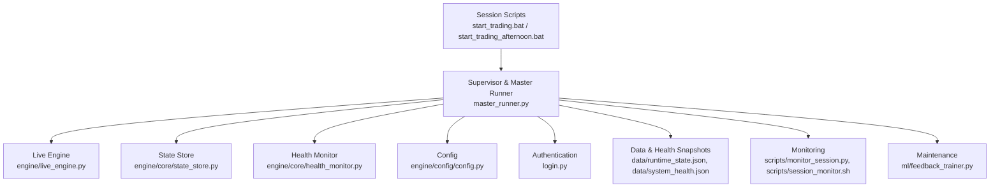
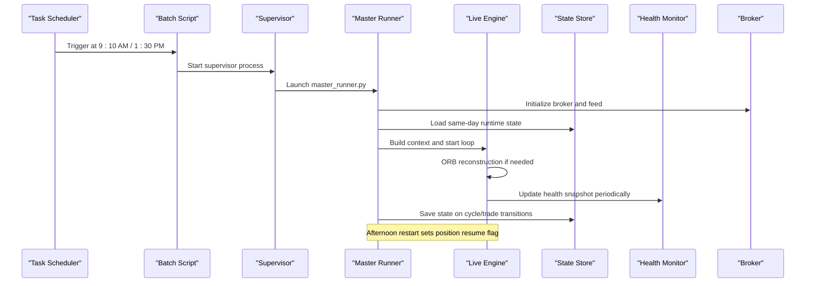
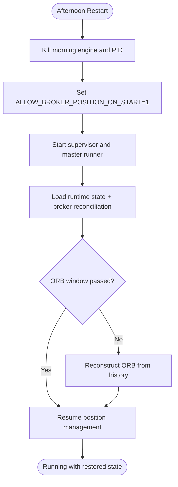
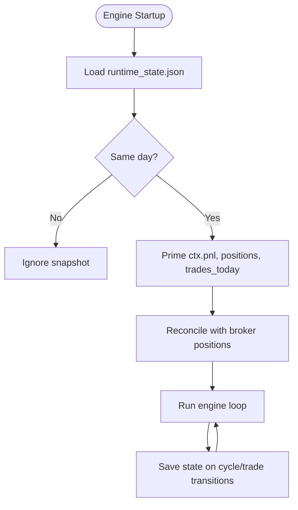
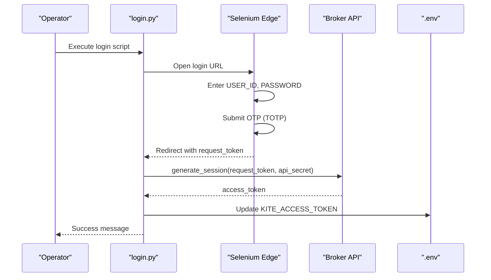
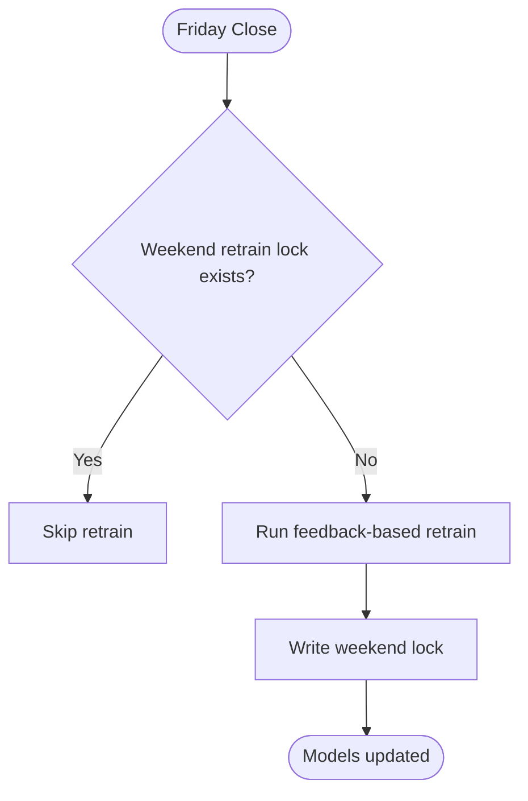
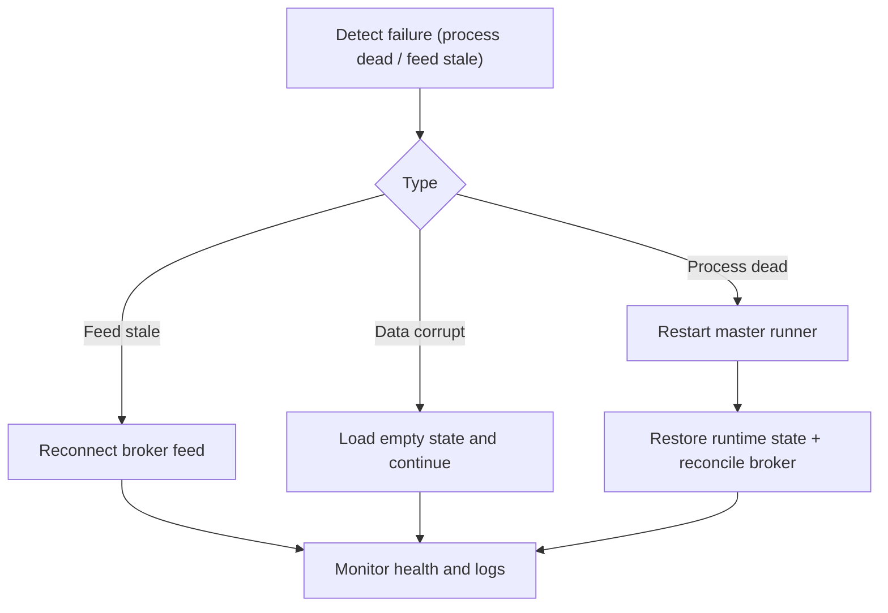
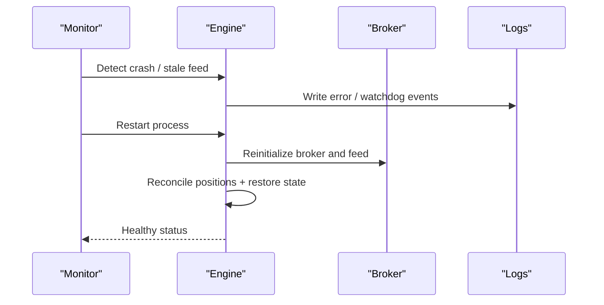
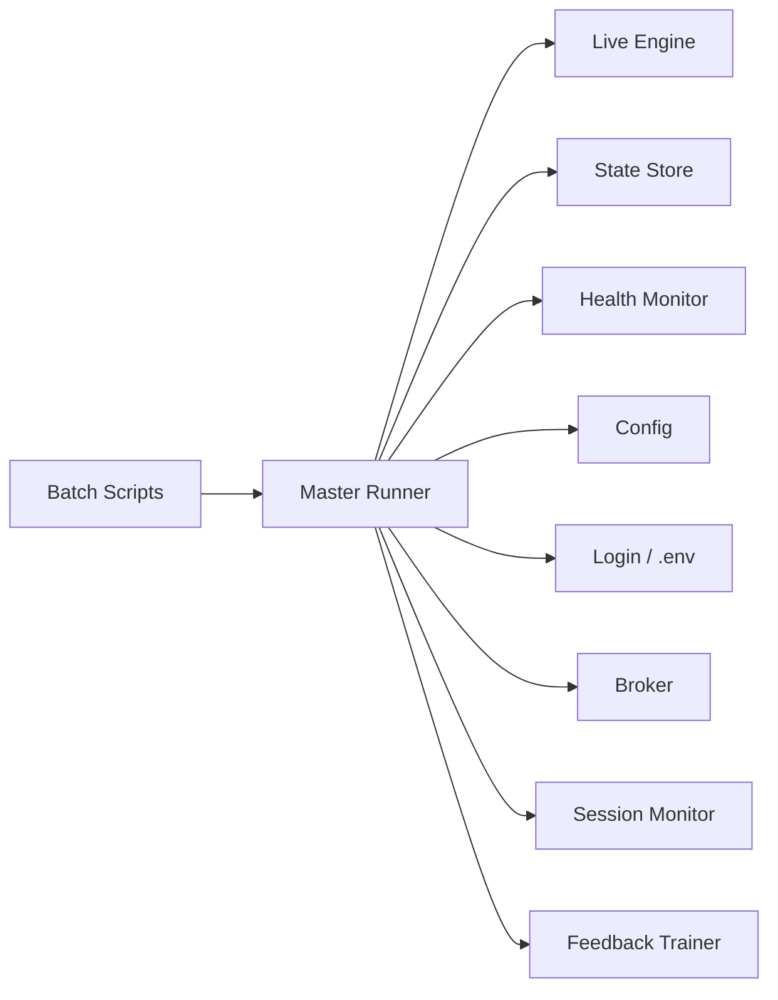

# Operational Procedures

<cite>
**Referenced Files in This Document**
- [SESSION_HANDOFF.md](file://SESSION_HANDOFF.md)
- [login.py](file://login.py)
- [master_runner.py](file://master_runner.py)
- [engine/live_engine.py](file://engine/live_engine.py)
- [engine/core/state_store.py](file://engine/core/state_store.py)
- [data/runtime_state.json](file://data/runtime_state.json)
- [engine/config/config.py](file://engine/config/config.py)
- [scripts/start_trading.bat](file://scripts/start_trading.bat)
- [scripts/start_trading_afternoon.bat](file://scripts/start_trading_afternoon.bat)
- [scripts/monitor_session.py](file://scripts/monitor_session.py)
- [scripts/session_monitor.sh](file://scripts/session_monitor.sh)
- [engine/core/health_monitor.py](file://engine/core/health_monitor.py)
- [data/system_health.json](file://data/system_health.json)
- [ml/feedback_trainer.py](file://ml/feedback_trainer.py)
</cite>

## Table of Contents
1. Introduction
2. Project Structure
3. Core Components
4. Architecture Overview
5. Detailed Component Analysis
6. Dependency Analysis
7. Performance Considerations
8. Troubleshooting Guide
9. Conclusion
10. Appendices

## Introduction
This document provides operational procedures for day-to-day management of the trading system. It covers session handoff between morning and afternoon sessions, runtime state management (checkpointing, recovery, validation), login and authentication workflows, maintenance tasks (model retraining, parameter updates, upgrades), disaster recovery, backup and restore, incident response runbooks, and capacity planning guidance. The goal is to ensure reliable, safe, and observable production operations with minimal downtime and clear recovery paths.

## Project Structure
The system is organized into modules for live execution, ML, configuration, monitoring, scripts, and data persistence:
- Live engine and orchestration: master runner, live engine, broker integration
- State and health: runtime state persistence and system health snapshots
- Authentication: automated login and token refresh
- Session automation: Windows batch scripts and shell monitor for lifecycle control
- Maintenance: weekly model retrain triggers and feedback-based training
- Configuration: environment-driven parameters controlling behavior and risk

**Diagram sources**
- [scripts/start_trading.bat:1-32](file://scripts/start_trading.bat#L1-L32)
- [scripts/start_trading_afternoon.bat:1-36](file://scripts/start_trading_afternoon.bat#L1-L36)
- [master_runner.py:725-774](file://master_runner.py#L725-L774)
- [engine/live_engine.py:71-184](file://engine/live_engine.py#L71-L184)
- [engine/core/state_store.py:1-94](file://engine/core/state_store.py#L1-L94)
- [engine/core/health_monitor.py:1-67](file://engine/core/health_monitor.py#L1-L67)
- [engine/config/config.py:1-164](file://engine/config/config.py#L1-L164)
- [login.py:1-243](file://login.py#L1-L243)
- [scripts/monitor_session.py:1-69](file://scripts/monitor_session.py#L1-L69)
- [scripts/session_monitor.sh:1-41](file://scripts/session_monitor.sh#L1-L41)
- [ml/feedback_trainer.py:127-142](file://ml/feedback_trainer.py#L127-L142)

**Section sources**
- [scripts/start_trading.bat:1-32](file://scripts/start_trading.bat#L1-L32)
- [scripts/start_trading_afternoon.bat:1-36](file://scripts/start_trading_afternoon.bat#L1-L36)
- [master_runner.py:725-774](file://master_runner.py#L725-L774)
- [engine/live_engine.py:71-184](file://engine/live_engine.py#L71-L184)
- [engine/core/state_store.py:1-94](file://engine/core/state_store.py#L1-L94)
- [engine/core/health_monitor.py:1-67](file://engine/core/health_monitor.py#L1-L67)
- [engine/config/config.py:1-164](file://engine/config/config.py#L1-L164)
- [login.py:1-243](file://login.py#L1-L243)
- [scripts/monitor_session.py:1-69](file://scripts/monitor_session.py#L1-L69)
- [scripts/session_monitor.sh:1-41](file://scripts/session_monitor.sh#L1-L41)
- [ml/feedback_trainer.py:127-142](file://ml/feedback_trainer.py#L127-L142)

## Core Components
- Session lifecycle: Morning and afternoon sessions are started via Windows Task Scheduler using batch scripts that kill stale processes and launch a supervisor which starts the master runner. Afternoon restart sets an environment flag to resume open positions from the broker.
- Runtime state: The state store persists daily session state (PnL, trades today, open positions) atomically and only restores same-day snapshots to avoid cross-session leakage.
- Health monitoring: System health snapshot captures PnL, positions, regime, signal, latency, and mode for dashboards and alerts.
- Authentication: Automated login obtains a request token via browser automation, exchanges it for an access token, and updates the .env file for subsequent runs.
- Maintenance: Weekly model retrain is triggered on Friday after close, guarded by a weekend lock to prevent duplicate runs; retraining uses feedback from live trades.

**Section sources**
- [scripts/start_trading.bat:1-32](file://scripts/start_trading.bat#L1-L32)
- [scripts/start_trading_afternoon.bat:1-36](file://scripts/start_trading_afternoon.bat#L1-L36)
- [engine/core/state_store.py:1-94](file://engine/core/state_store.py#L1-L94)
- [engine/core/health_monitor.py:1-67](file://engine/core/health_monitor.py#L1-L67)
- [login.py:1-243](file://login.py#L1-L243)
- [master_runner.py:2172-2195](file://master_runner.py#L2172-L2195)
- [ml/feedback_trainer.py:127-142](file://ml/feedback_trainer.py#L127-L142)

## Architecture Overview
The master runner orchestrates the live engine, manages state persistence, reconciles broker positions on startup, and coordinates monitoring and maintenance tasks. The live engine handles market-time logic (ORB, day classification, feature building, entry/exit signals). The state store ensures durable snapshots of runtime state, while the health monitor writes periodic health metrics.

**Diagram sources**
- [scripts/start_trading.bat:1-32](file://scripts/start_trading.bat#L1-L32)
- [scripts/start_trading_afternoon.bat:1-36](file://scripts/start_trading_afternoon.bat#L1-L36)
- [master_runner.py:725-774](file://master_runner.py#L725-L774)
- [engine/live_engine.py:222-315](file://engine/live_engine.py#L222-L315)
- [engine/core/state_store.py:40-79](file://engine/core/state_store.py#L40-L79)
- [engine/core/health_monitor.py:12-67](file://engine/core/health_monitor.py#L12-L67)

## Detailed Component Analysis

### Session Handoff Procedures (Morning to Afternoon)
- Morning session:
  - Kill any stale engine process and remove PID file.
  - Start supervisor which launches master runner.
  - Verify broker connection, subscriptions, and dry-run mode.
- Afternoon session:
  - Kill morning engine process and PID file.
  - Set environment flag to allow broker position resumption.
  - Start supervisor again; master runner will reconcile open positions from broker and runtime state.

Key behaviors:
- Position continuity: On afternoon restart, the master runner loads same-day runtime state and reconciles against broker positions to resume management safely.
- ORB handling: If the engine starts after the opening range window, the live engine reconstructs ORB from historical data to maintain breakout logic.

**Diagram sources**
- [scripts/start_trading_afternoon.bat:1-36](file://scripts/start_trading_afternoon.bat#L1-L36)
- [master_runner.py:915-964](file://master_runner.py#L915-L964)
- [engine/live_engine.py:222-315](file://engine/live_engine.py#L222-L315)

**Section sources**
- [scripts/start_trading.bat:1-32](file://scripts/start_trading.bat#L1-L32)
- [scripts/start_trading_afternoon.bat:1-36](file://scripts/start_trading_afternoon.bat#L1-L36)
- [master_runner.py:915-964](file://master_runner.py#L915-L964)
- [engine/live_engine.py:222-315](file://engine/live_engine.py#L222-L315)

### Runtime State Management (Checkpointing, Recovery, Validation)
- Checkpointing:
  - The state store writes atomic snapshots (tmp file + os.replace) including session date, saved timestamp, PnL, trades today, positions, and serialized open positions.
  - Writes occur every cycle and on trade transitions to minimize data loss.
- Recovery:
  - On startup, the master runner loads same-day runtime state and primes counters so dashboards and gates are correct immediately.
  - Broker reconciliation adopts open positions and verifies protective stops; repairs if necessary.
- Validation:
  - Only snapshots from the current trading day are restored; previous days are ignored to prevent cross-session leakage.
  - Deserialization converts timestamps back to datetime objects with fallbacks.

**Diagram sources**
- [engine/core/state_store.py:40-94](file://engine/core/state_store.py#L40-L94)
- [master_runner.py:725-774](file://master_runner.py#L725-L774)
- [master_runner.py:915-964](file://master_runner.py#L915-L964)

**Section sources**
- [engine/core/state_store.py:1-94](file://engine/core/state_store.py#L1-L94)
- [data/runtime_state.json:1-9](file://data/runtime_state.json#L1-L9)
- [master_runner.py:725-774](file://master_runner.py#L725-L774)
- [master_runner.py:915-964](file://master_runner.py#L915-L964)

### Login and Authentication Procedures
- Automated login:
  - Uses Selenium Edge to navigate to broker login, enters credentials, submits OTP generated via TOTP secret, waits for redirect with request token.
  - Exchanges request token for access token using broker SDK.
  - Updates .env with new access token and saves a backup copy.
- Token rotation:
  - Daily token expiry requires running login before each session or when tokens expire.
  - Ensure all required environment variables are present; missing values raise errors early.
- Multi-factor authentication:
  - OTP is auto-generated and submitted; if OTP prompt is not detected, flow continues gracefully.

**Diagram sources**
- [login.py:147-243](file://login.py#L147-L243)

**Section sources**
- [login.py:1-243](file://login.py#L1-L243)
- [SESSION_HANDOFF.md:1-39](file://SESSION_HANDOFF.md#L1-L39)

### Maintenance Procedures (Model Retraining, Parameter Updates, Upgrades)
- Model retraining:
  - Weekly trigger on Friday after market close; guarded by a weekend lock to prevent duplicate runs.
  - Retraining uses feedback from live trades and updates champion models.
- Parameter updates:
  - All behavioral parameters are environment-driven via Config; adjust environment variables to change risk controls, filters, thresholds, and scalping behavior.
- System upgrades:
  - Use batch scripts to manage lifecycle; ensure dependencies and environment variables are updated consistently across sessions.

**Diagram sources**
- [master_runner.py:375-402](file://master_runner.py#L375-L402)
- [master_runner.py:2172-2195](file://master_runner.py#L2172-L2195)
- [ml/feedback_trainer.py:127-142](file://ml/feedback_trainer.py#L127-L142)

**Section sources**
- [master_runner.py:375-402](file://master_runner.py#L375-L402)
- [master_runner.py:2172-2195](file://master_runner.py#L2172-L2195)
- [ml/feedback_trainer.py:127-142](file://ml/feedback_trainer.py#L127-L142)
- [engine/config/config.py:1-164](file://engine/config/config.py#L1-L164)

### Disaster Recovery Procedures
- Hardware failures:
  - Use session monitor to detect dead processes and auto-restart the engine.
  - On restart, runtime state is loaded and broker positions are reconciled to resume management safely.
- Network outages:
  - Watchdog detects stale feed and attempts reconnection; logs warnings and notifications.
  - ORB reconstruction tolerates API failures without crashing; ML-only entries remain active.
- Data corruption:
  - Atomic writes protect against partial snapshots; corrupted files fall back to empty state and continue operation.
  - Validate health snapshots and runtime state integrity; regenerate if necessary.

**Diagram sources**
- [scripts/session_monitor.sh:1-41](file://scripts/session_monitor.sh#L1-L41)
- [master_runner.py:1055-1069](file://master_runner.py#L1055-L1069)
- [engine/live_engine.py:222-315](file://engine/live_engine.py#L222-L315)
- [engine/core/state_store.py:40-79](file://engine/core/state_store.py#L40-L79)

**Section sources**
- [scripts/session_monitor.sh:1-41](file://scripts/session_monitor.sh#L1-L41)
- [master_runner.py:1055-1069](file://master_runner.py#L1055-L1069)
- [engine/live_engine.py:222-315](file://engine/live_engine.py#L222-L315)
- [engine/core/state_store.py:40-79](file://engine/core/state_store.py#L40-L79)

### Backup and Restore Procedures
- Critical data files:
  - Back up data/runtime_state.json and data/system_health.json regularly to preserve session state and health snapshots.
  - Back up .env containing broker credentials and secrets; restrict access.
- Configuration settings:
  - Version-control environment variables and configuration changes; document defaults and overrides.
- Model artifacts:
  - Back up ML model directories and feature lists; maintain backups per retrain cycles.
- Restore steps:
  - Stop the engine, replace files with backups, verify integrity, restart, and confirm state restoration and broker reconciliation.

[No sources needed since this section provides general guidance]

### Incident Response Runbooks
- Broker API failures:
  - Verify authentication and token validity; re-run login if needed.
  - Check broker initialization logs; restart master runner if initialization fails.
- Market data disconnections:
  - Watchdog logs feed staleness and attempts reconnection; verify subscriptions and instrument tokens.
  - Use ORB reconstruction to maintain strategy logic during gaps.
- System crashes:
  - Session monitor auto-restarts the engine; check logs for crash reasons.
  - Validate runtime state and health snapshots; recover positions from broker.

**Diagram sources**
- [scripts/monitor_session.py:1-69](file://scripts/monitor_session.py#L1-L69)
- [scripts/session_monitor.sh:1-41](file://scripts/session_monitor.sh#L1-L41)
- [master_runner.py:915-964](file://master_runner.py#L915-L964)
- [engine/core/health_monitor.py:12-67](file://engine/core/health_monitor.py#L12-L67)

**Section sources**
- [scripts/monitor_session.py:1-69](file://scripts/monitor_session.py#L1-L69)
- [scripts/session_monitor.sh:1-41](file://scripts/session_monitor.sh#L1-L41)
- [master_runner.py:915-964](file://master_runner.py#L915-L964)
- [engine/core/health_monitor.py:12-67](file://engine/core/health_monitor.py#L12-L67)

## Dependency Analysis
- Orchestration dependency: Batch scripts depend on supervisor and master runner; master runner depends on live engine, state store, health monitor, config, and broker.
- State dependency: Runtime state is consumed by master runner on startup and written by the engine loop; health snapshots are independent but useful for diagnostics.
- Authentication dependency: Login script updates .env used by broker initialization; token validity affects broker connectivity.
- Maintenance dependency: Weekly retrain depends on feedback trainer and model artifacts; lock prevents concurrent runs.

**Diagram sources**
- [scripts/start_trading.bat:1-32](file://scripts/start_trading.bat#L1-L32)
- [scripts/start_trading_afternoon.bat:1-36](file://scripts/start_trading_afternoon.bat#L1-L36)
- [master_runner.py:725-774](file://master_runner.py#L725-L774)
- [engine/live_engine.py:71-184](file://engine/live_engine.py#L71-L184)
- [engine/core/state_store.py:1-94](file://engine/core/state_store.py#L1-L94)
- [engine/core/health_monitor.py:1-67](file://engine/core/health_monitor.py#L1-L67)
- [engine/config/config.py:1-164](file://engine/config/config.py#L1-L164)
- [login.py:1-243](file://login.py#L1-L243)
- [scripts/monitor_session.py:1-69](file://scripts/monitor_session.py#L1-L69)
- [ml/feedback_trainer.py:127-142](file://ml/feedback_trainer.py#L127-L142)

**Section sources**
- [scripts/start_trading.bat:1-32](file://scripts/start_trading.bat#L1-L32)
- [scripts/start_trading_afternoon.bat:1-36](file://scripts/start_trading_afternoon.bat#L1-L36)
- [master_runner.py:725-774](file://master_runner.py#L725-L774)
- [engine/live_engine.py:71-184](file://engine/live_engine.py#L71-L184)
- [engine/core/state_store.py:1-94](file://engine/core/state_store.py#L1-L94)
- [engine/core/health_monitor.py:1-67](file://engine/core/health_monitor.py#L1-L67)
- [engine/config/config.py:1-164](file://engine/config/config.py#L1-L164)
- [login.py:1-243](file://login.py#L1-L243)
- [scripts/monitor_session.py:1-69](file://scripts/monitor_session.py#L1-L69)
- [ml/feedback_trainer.py:127-142](file://ml/feedback_trainer.py#L127-L142)

## Performance Considerations
- Feed latency and subscription:
  - Monitor feed staleness and reconnect promptly; ensure correct instrument tokens and subscriptions.
- State persistence overhead:
  - Atomic writes minimize contention; avoid excessive save frequency beyond cycle/trade transitions.
- Health snapshot frequency:
  - Balance update cadence with disk I/O; use for dashboards and alerting rather than high-frequency polling.
- ORB reconstruction cost:
  - Historical data calls are bounded to the opening window; failures degrade gracefully without halting ML-only entries.
- Scalability:
  - Single-process design; consider resource limits and CPU usage during feature computation and ML inference.

[No sources needed since this section provides general guidance]

## Troubleshooting Guide
- Common symptoms:
  - No trades: Check warmup period, lunch filter, ML thresholds, and HTF alignment; verify ORB reconstruction and day classification.
  - Stale feed: Watchdog logs indicate staleness; reconnection attempted automatically.
  - Crash loops: Session monitor restarts engine; inspect logs for errors and validate state files.
- Diagnostic tools:
  - Session monitor tailing notable events to a dedicated log.
  - Health snapshot for quick status checks.
  - Runtime state inspection for open positions and PnL.

**Section sources**
- [scripts/monitor_session.py:1-69](file://scripts/monitor_session.py#L1-L69)
- [engine/core/health_monitor.py:12-67](file://engine/core/health_monitor.py#L12-L67)
- [engine/core/state_store.py:40-79](file://engine/core/state_store.py#L40-L79)
- [engine/live_engine.py:222-315](file://engine/live_engine.py#L222-L315)

## Conclusion
The trading system provides robust operational capabilities for session management, state persistence, authentication, maintenance, and disaster recovery. Operators should follow the documented procedures for daily startup, afternoon handoff, token refresh, and monitoring. In case of failures, rely on watchdogs and monitors to detect issues, restore state, and resume trading safely. Regular backups and disciplined parameter management ensure stability and traceability.

[No sources needed since this section summarizes without analyzing specific files]

## Appendices
- Environment variables and configuration:
  - Review Config defaults and environment overrides for risk controls, filters, thresholds, and scalping behavior.
- Key files for operators:
  - Session scripts, master runner, live engine, state store, health monitor, login script, and monitoring utilities.

[No sources needed since this section provides general guidance]