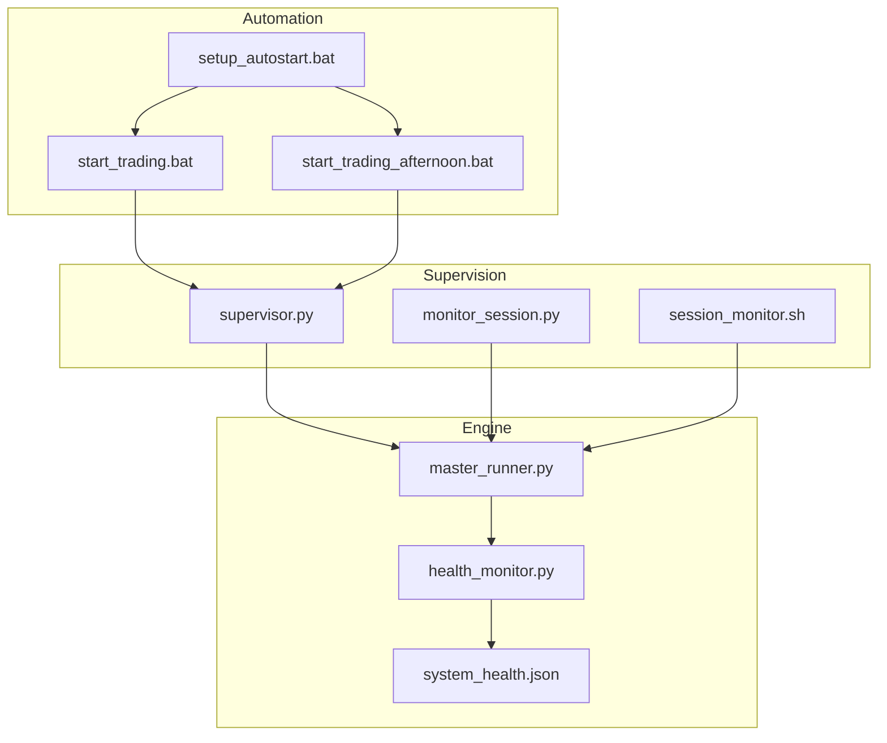
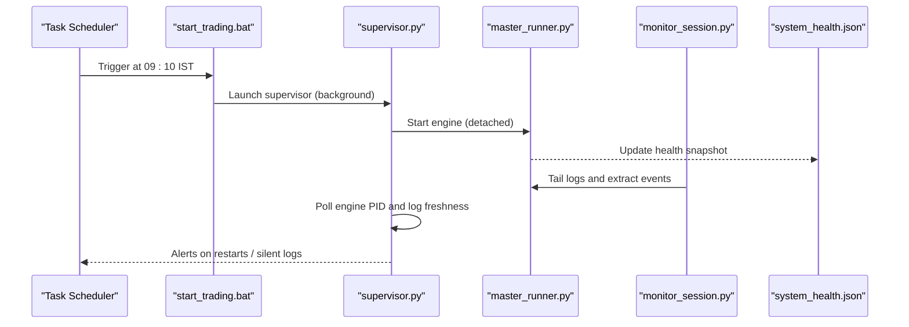
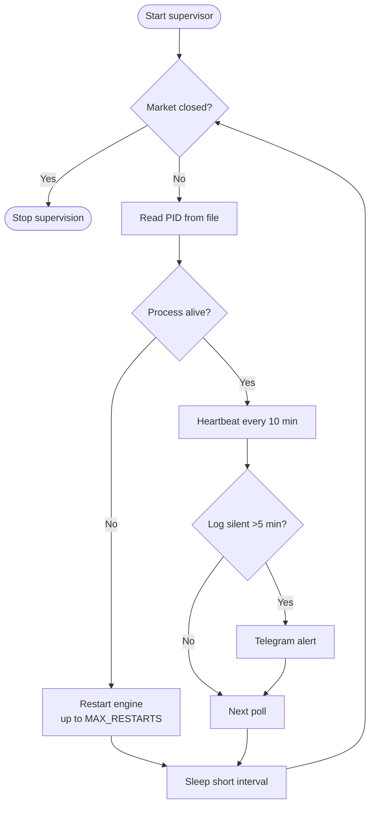
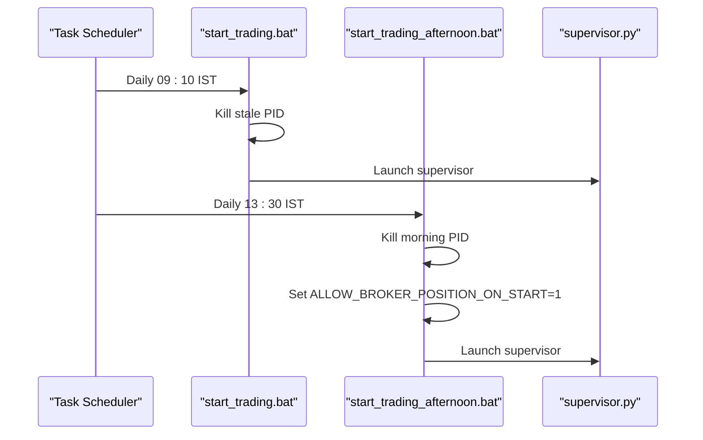
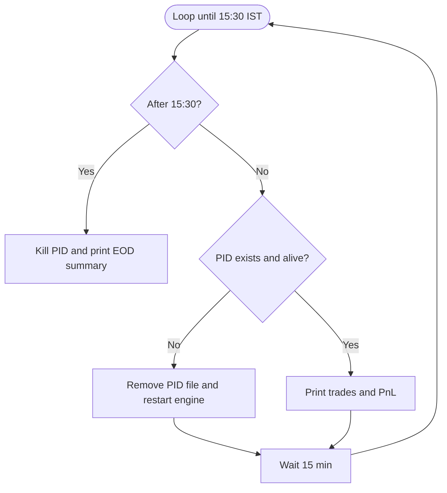
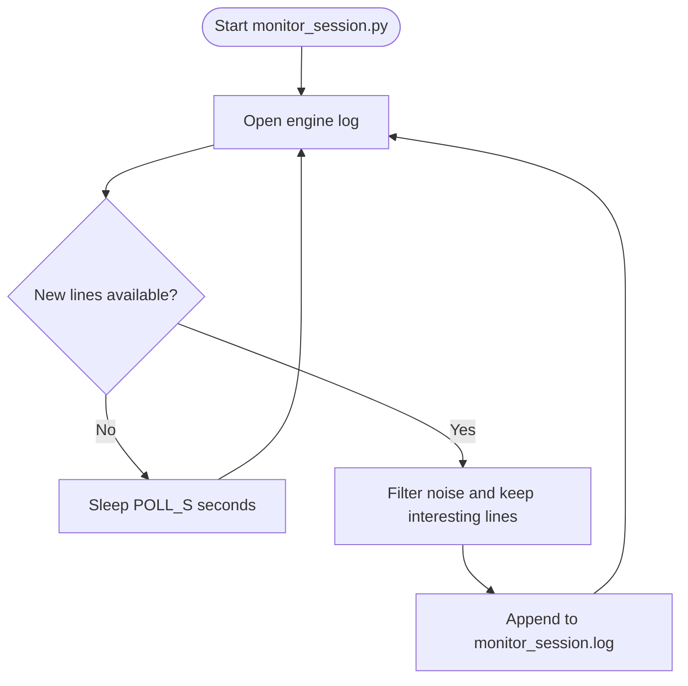
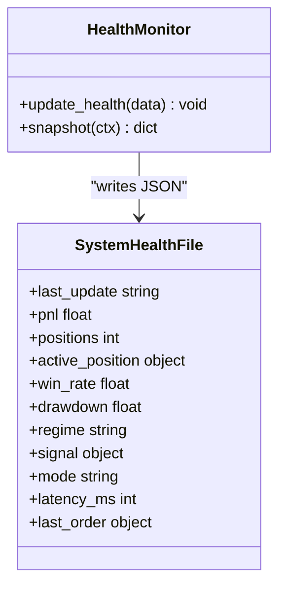
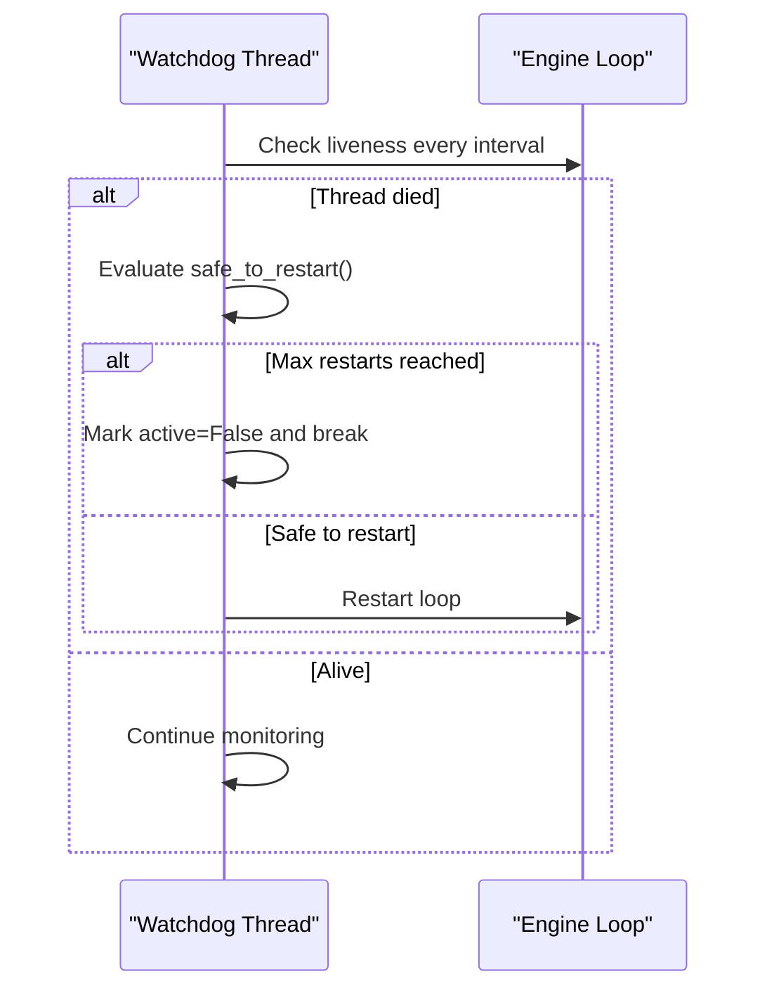
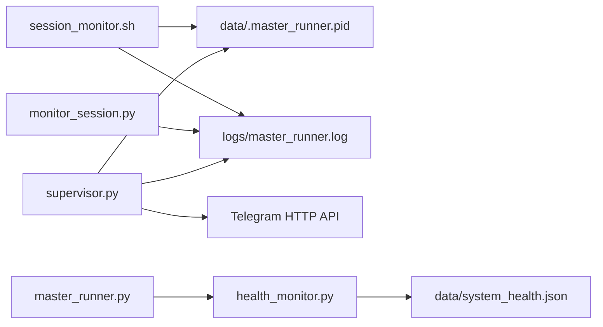

# Process Management

<cite>
**Referenced Files in This Document**
- [supervisor.py](file://scripts/supervisor.py)
- [start_trading.bat](file://scripts/start_trading.bat)
- [start_trading_afternoon.bat](file://scripts/start_trading_afternoon.bat)
- [setup_autostart.bat](file://scripts/setup_autostart.bat)
- [session_monitor.sh](file://scripts/session_monitor.sh)
- [monitor_session.py](file://scripts/monitor_session.py)
- [master_runner.py](file://master_runner.py)
- [health_monitor.py](file://engine/core/health_monitor.py)
- [system_health.json](file://data/system_health.json)
</cite>

## Table of Contents
1. Introduction
2. Project Structure
3. Core Components
4. Architecture Overview
5. Detailed Component Analysis
6. Dependency Analysis
7. Performance Considerations
8. Troubleshooting Guide
9. Conclusion
10. Appendices

## Introduction
This document explains the process management and lifecycle control for the trading system. It covers:
- The supervisor script that monitors and restarts the trading engine, performs health checks, and shuts down gracefully after market close.
- Windows batch scripts that automate session startup with proper environment setup and parameter passing.
- A Unix/Linux shell-based session monitor for process tracking, resource monitoring, and alerting.
- Process isolation strategies, memory management, and CPU utilization optimization.
- Integration guidance with system service managers (systemd and Windows Services).
- Examples of custom monitoring scripts and health check endpoints.

## Project Structure
The process management layer is implemented across a small set of focused scripts and modules:
- Supervisor and watchers: supervisor.py, monitor_session.py
- Session automation: start_trading.bat, start_trading_afternoon.bat, setup_autostart.bat
- Unix session monitor: session_monitor.sh
- Engine core and health: master_runner.py, engine/core/health_monitor.py, data/system_health.json

**Diagram sources**
- [start_trading.bat:1-32](file://scripts/start_trading.bat#L1-L32)
- [start_trading_afternoon.bat:1-36](file://scripts/start_trading_afternoon.bat#L1-L36)
- [setup_autostart.bat:1-70](file://scripts/setup_autostart.bat#L1-L70)
- [supervisor.py:1-216](file://scripts/supervisor.py#L1-L216)
- [monitor_session.py:1-69](file://scripts/monitor_session.py#L1-L69)
- [session_monitor.sh:1-41](file://scripts/session_monitor.sh#L1-L41)
- [master_runner.py:326-353](file://master_runner.py#L326-L353)
- [health_monitor.py:1-67](file://engine/core/health_monitor.py#L1-L67)
- [system_health.json:1-13](file://data/system_health.json#L1-L13)

**Section sources**
- [start_trading.bat:1-32](file://scripts/start_trading.bat#L1-L32)
- [start_trading_afternoon.bat:1-36](file://scripts/start_trading_afternoon.bat#L1-L36)
- [setup_autostart.bat:1-70](file://scripts/setup_autostart.bat#L1-L70)
- [supervisor.py:1-216](file://scripts/supervisor.py#L1-L216)
- [monitor_session.py:1-69](file://scripts/monitor_session.py#L1-L69)
- [session_monitor.sh:1-41](file://scripts/session_monitor.sh#L1-L41)
- [master_runner.py:326-353](file://master_runner.py#L326-L353)
- [health_monitor.py:1-67](file://engine/core/health_monitor.py#L1-L67)
- [system_health.json:1-13](file://data/system_health.json#L1-L13)

## Core Components
- Supervisor (supervisor.py): Watches the engine process via PID file, restarts it on failure up to a configured limit, sends Telegram alerts, writes heartbeat logs, and stops supervision after market close.
- Monitor (monitor_session.py): Tails the engine log and extracts notable events into a compact alert log for quick diagnostics.
- Windows Automation: Batch scripts kill stale processes, set environment variables, and launch the supervisor via Task Scheduler.
- Unix Monitor (session_monitor.sh): Periodically checks process liveness, restarts if needed, prints daily trades and PnL, and terminates at market close.
- Health Snapshot (health_monitor.py + system_health.json): Writes periodic system health metrics to disk for external consumption.

**Section sources**
- [supervisor.py:1-216](file://scripts/supervisor.py#L1-L216)
- [monitor_session.py:1-69](file://scripts/monitor_session.py#L1-L69)
- [start_trading.bat:1-32](file://scripts/start_trading.bat#L1-L32)
- [start_trading_afternoon.bat:1-36](file://scripts/start_trading_afternoon.bat#L1-L36)
- [session_monitor.sh:1-41](file://scripts/session_monitor.sh#L1-L41)
- [health_monitor.py:1-67](file://engine/core/health_monitor.py#L1-L67)

## Architecture Overview
The system uses a layered supervision model:
- Orchestration: Windows Task Scheduler triggers batch scripts at market open and afternoon restart.
- Supervision: supervisor.py runs continuously during market hours, ensuring the engine process stays alive and healthy.
- Monitoring: monitor_session.py tails logs to capture significant events; session_monitor.sh provides a Unix alternative with built-in restart logic.
- Health: master_runner.py updates system_health.json via health_monitor.py for dashboards or external probes.

**Diagram sources**
- [start_trading.bat:14-32](file://scripts/start_trading.bat#L14-L32)
- [supervisor.py:133-158](file://scripts/supervisor.py#L133-L158)
- [monitor_session.py:40-64](file://scripts/monitor_session.py#L40-L64)
- [health_monitor.py:12-48](file://engine/core/health_monitor.py#L12-L48)

## Detailed Component Analysis

### Supervisor (supervisor.py)
Responsibilities:
- Process monitoring: Reads the engine PID from a PID file and checks liveness using psutil or tasklist fallback.
- Automatic restart: Restarts master_runner.py when dead, up to a configurable maximum number of restarts.
- Health checks: Heartbeat every 10 minutes includes last log line and monitor event count; detects silent logs during market hours and alerts.
- Graceful shutdown: Stops supervision after market close time to avoid out-of-hours restarts.
- Alerting: Sends Telegram messages directly via HTTP without starting additional long-poll threads to avoid conflicts.

Key behaviors:
- Environment loading for Telegram credentials from .env.
- Safe process detection on Windows by avoiding os.kill(pid, 0).
- Stale PID cleanup before restart.
- Logging to supervisor_status.log and console_run.log.

**Diagram sources**
- [supervisor.py:161-216](file://scripts/supervisor.py#L161-L216)
- [supervisor.py:77-107](file://scripts/supervisor.py#L77-L107)
- [supervisor.py:133-158](file://scripts/supervisor.py#L133-L158)

**Section sources**
- [supervisor.py:1-216](file://scripts/supervisor.py#L1-L216)

### Windows Batch Scripts
- start_trading.bat:
  - Changes to project directory.
  - Kills any stale engine from previous day using PID file.
  - Starts supervisor.py in background and logs actions.
- start_trading_afternoon.bat:
  - Kills morning engine for clean afternoon restart.
  - Sets ALLOW_BROKER_POSITION_ON_START=1 to resume positions.
  - Starts supervisor.py for afternoon session.
- setup_autostart.bat:
  - Registers weekly tasks for morning and afternoon sessions via Windows Task Scheduler.

**Diagram sources**
- [start_trading.bat:14-32](file://scripts/start_trading.bat#L14-L32)
- [start_trading_afternoon.bat:15-36](file://scripts/start_trading_afternoon.bat#L15-L36)
- [setup_autostart.bat:22-54](file://scripts/setup_autostart.bat#L22-L54)

**Section sources**
- [start_trading.bat:1-32](file://scripts/start_trading.bat#L1-L32)
- [start_trading_afternoon.bat:1-36](file://scripts/start_trading_afternoon.bat#L1-L36)
- [setup_autostart.bat:1-70](file://scripts/setup_autostart.bat#L1-L70)

### Unix/Linux Session Monitor (session_monitor.sh)
Behavior:
- Runs until 15:30 IST, then kills the engine and prints an EOD summary.
- Checks process liveness using PID file and tasklist; restarts if dead.
- Prints recent trades and PnL lines from the engine log.

**Diagram sources**
- [session_monitor.sh:1-41](file://scripts/session_monitor.sh#L1-L41)

**Section sources**
- [session_monitor.sh:1-41](file://scripts/session_monitor.sh#L1-L41)

### Log-Based Session Monitor (monitor_session.py)
Behavior:
- Tails master_runner.log and filters interesting events (entries, exits, errors, watchdog activity).
- Appends timestamped alerts to monitor_session.log for quick triage.

**Diagram sources**
- [monitor_session.py:40-64](file://scripts/monitor_session.py#L40-L64)

**Section sources**
- [monitor_session.py:1-69](file://scripts/monitor_session.py#L1-L69)

### Health Snapshot (health_monitor.py and system_health.json)
Behavior:
- health_monitor.update_health writes a JSON snapshot including PnL, positions, regime, latency, and other metrics.
- system_health.json serves as a lightweight health endpoint for dashboards or external services.

**Diagram sources**
- [health_monitor.py:12-67](file://engine/core/health_monitor.py#L12-L67)
- [system_health.json:1-13](file://data/system_health.json#L1-L13)

**Section sources**
- [health_monitor.py:1-67](file://engine/core/health_monitor.py#L1-L67)
- [system_health.json:1-13](file://data/system_health.json#L1-L13)

### Engine Watchdog and Lifecycle (master_runner.py)
Behavior:
- Internal watchdog thread monitors the engine loop and can restart within limits, logging critical conditions and sending alerts.
- Handles graceful stop on KeyboardInterrupt and ensures notifications are sent.

**Diagram sources**
- [master_runner.py:326-353](file://master_runner.py#L326-L353)

**Section sources**
- [master_runner.py:326-353](file://master_runner.py#L326-L353)

## Dependency Analysis
- supervisor.py depends on:
  - PID file location and engine log paths.
  - Optional psutil for process inspection; falls back to tasklist on Windows.
  - Telegram HTTP API for alerts (no notifier thread).
- monitor_session.py depends on:
  - Engine log path and monitor log path.
- session_monitor.sh depends on:
  - PID file and engine log path; uses tasklist for process checks.
- master_runner.py integrates:
  - Internal watchdog and daemon threads.
  - Health snapshot writer via health_monitor.py.

**Diagram sources**
- [supervisor.py:30-35](file://scripts/supervisor.py#L30-L35)
- [supervisor.py:77-107](file://scripts/supervisor.py#L77-L107)
- [monitor_session.py:19-23](file://scripts/monitor_session.py#L19-L23)
- [session_monitor.sh:3-39](file://scripts/session_monitor.sh#L3-L39)
- [health_monitor.py:9-48](file://engine/core/health_monitor.py#L9-L48)

**Section sources**
- [supervisor.py:30-35](file://scripts/supervisor.py#L30-L35)
- [supervisor.py:77-107](file://scripts/supervisor.py#L77-L107)
- [monitor_session.py:19-23](file://scripts/monitor_session.py#L19-L23)
- [session_monitor.sh:3-39](file://scripts/session_monitor.sh#L3-L39)
- [health_monitor.py:9-48](file://engine/core/health_monitor.py#L9-L48)

## Performance Considerations
- Polling intervals:
  - supervisor.py default poll interval is 15 seconds; adjustable via command-line argument.
  - monitor_session.py default poll interval is 5 seconds; adjustable via command-line argument.
  - session_monitor.sh sleeps 900 seconds between checks.
- I/O efficiency:
  - supervisor.py reads only the last portion of the engine log for heartbeats.
  - monitor_session.py tails the log incrementally to minimize overhead.
- Process detection:
  - Uses psutil where available; falls back to tasklist on Windows to avoid unsafe signals.
- Memory and CPU:
  - Keep polling intervals reasonable to balance responsiveness and resource usage.
  - Avoid heavy operations inside tight loops; rely on OS tools for process checks.

[No sources needed since this section provides general guidance]

## Troubleshooting Guide
Common issues and resolutions:
- Zombie or stale processes:
  - Ensure batch scripts delete the PID file and kill stale processes before starting new sessions.
  - On Unix, verify PID existence and remove stale files before restarting.
- Memory leaks:
  - Monitor system_health.json for anomalies in latency or signal patterns.
  - Use external process monitors to track memory growth over time.
- Resource exhaustion:
  - Reduce polling frequency if CPU spikes occur.
  - Verify that no duplicate engine instances are running due to race conditions.
- Silent logs:
  - supervisor.py alerts when engine logs are silent during market hours; check feed connectivity and broker connections.
- Telegram alerts not received:
  - Confirm TELEGRAM_BOT_TOKEN and TELEGRAM_BOT_CHAT_ID are set in .env and accessible to supervisor.py.

**Section sources**
- [start_trading.bat:19-25](file://scripts/start_trading.bat#L19-L25)
- [start_trading_afternoon.bat:20-26](file://scripts/start_trading_afternoon.bat#L20-L26)
- [session_monitor.sh:21-32](file://scripts/session_monitor.sh#L21-L32)
- [supervisor.py:204-210](file://scripts/supervisor.py#L204-L210)
- [supervisor.py:51-68](file://scripts/supervisor.py#L51-L68)

## Conclusion
The trading system’s process management combines robust supervision, automated session orchestration, and lightweight monitoring to ensure reliable operation during market hours. The supervisor enforces liveness and health checks, while Windows and Unix automation scripts provide resilient startup and restart mechanisms. Health snapshots enable external integration and observability. For production deployments, integrate these components with system service managers to guarantee resilience and maintainability.

[No sources needed since this section summarizes without analyzing specific files]

## Appendices

### Integration with System Service Managers
- systemd (Linux):
  - Create a service unit that starts supervisor.py and optionally monitor_session.py.
  - Configure restart policies and environment variables (e.g., TELEGRAM_BOT_TOKEN, TELEGRAM_BOT_CHAT_ID).
  - Use journalctl to review logs and status.
- Windows Services:
  - Wrap supervisor.py in a Windows Service using a tool like NSSM or pywin32.
  - Configure automatic start and recovery actions to restart on failures.
  - Ensure environment variables are set in the service context.

[No sources needed since this section provides general guidance]

### Custom Monitoring Scripts and Health Endpoints
- Example: Health endpoint
  - Expose data/system_health.json via a simple HTTP server or dashboard to visualize PnL, positions, and latency.
- Example: Custom watcher
  - Implement a script that polls system_health.json and triggers alerts when thresholds are exceeded.
- Example: Log aggregator
  - Combine monitor_session.log entries into a real-time dashboard for trade events and warnings.

[No sources needed since this section provides general guidance]