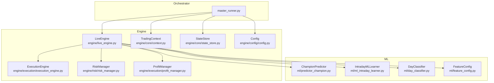
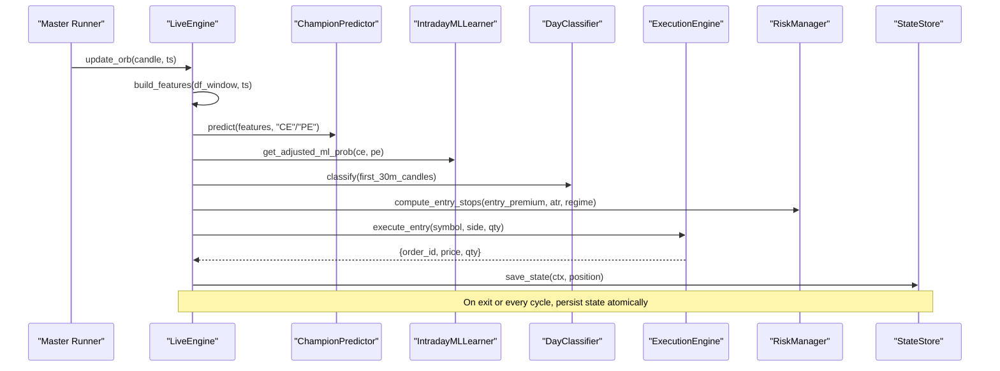
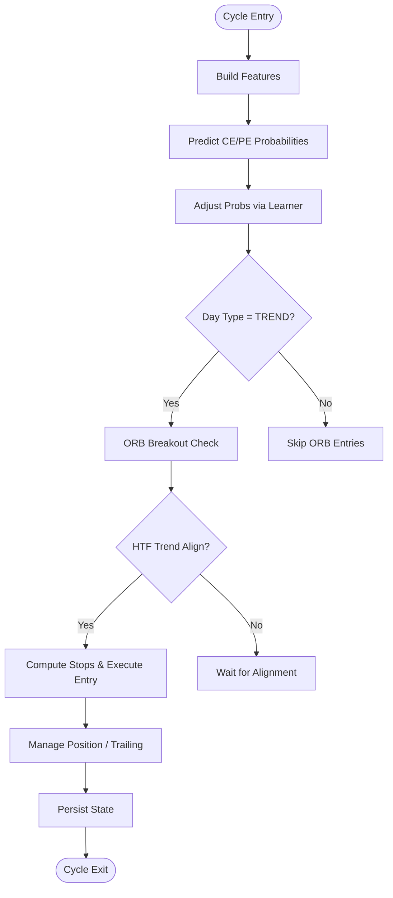
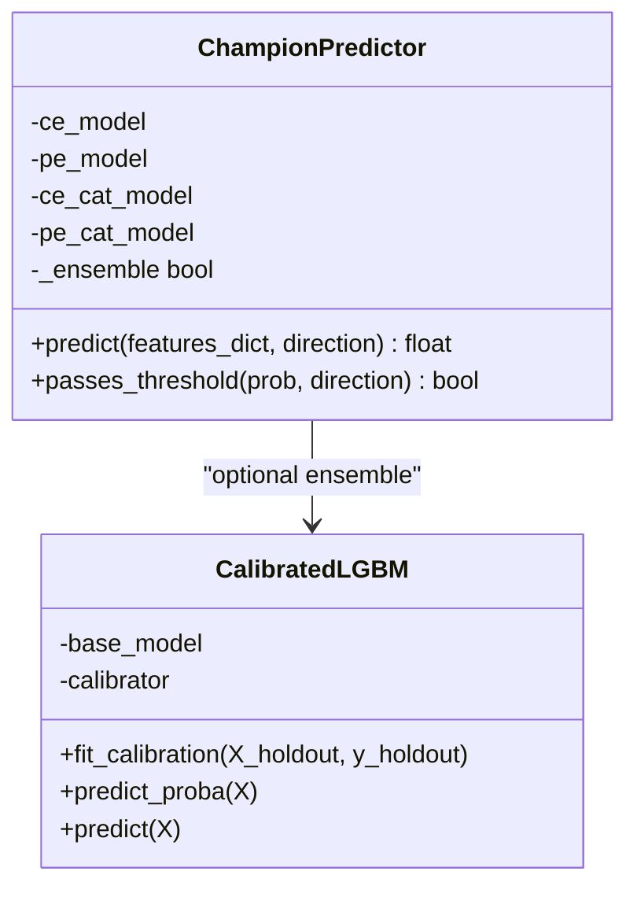
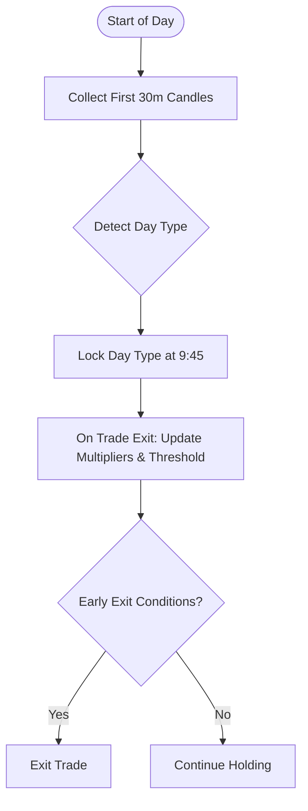
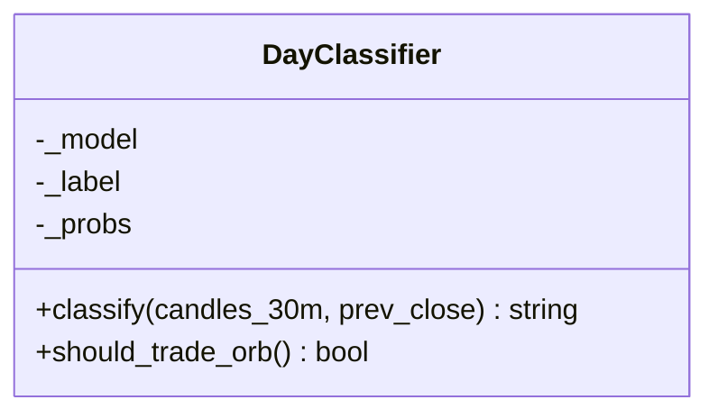
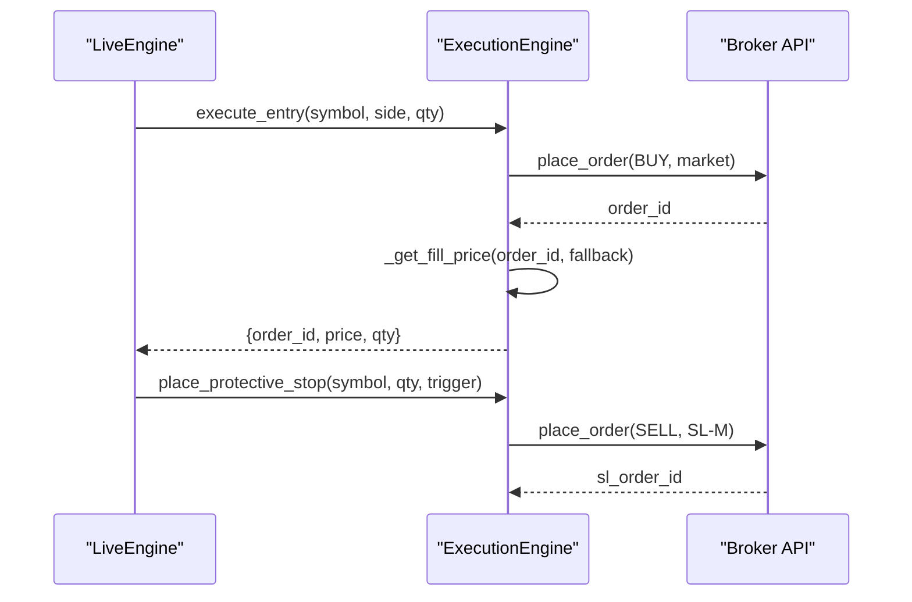
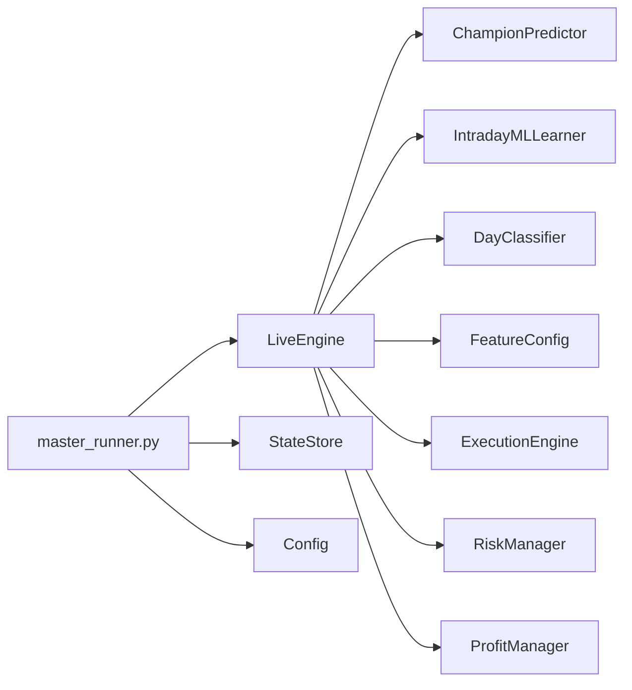

# Code Architecture

<cite>
**Referenced Files in This Document**
- [master_runner.py](file://master_runner.py)
- [engine/live_engine.py](file://engine/live_engine.py)
- [engine/core/context.py](file://engine/core/context.py)
- [engine/core/state_store.py](file://engine/core/state_store.py)
- [ml/predictor_champion.py](file://ml/predictor_champion.py)
- [ml/ml_intraday_learner.py](file://ml/ml_intraday_learner.py)
- [ml/day_classifier.py](file://ml/day_classifier.py)
- [ml/feature_config.py](file://ml/feature_config.py)
- [engine/execution/execution_engine.py](file://engine/execution/execution_engine.py)
- [engine/risk/risk_manager.py](file://engine/risk/risk_manager.py)
- [engine/config/config.py](file://engine/config/config.py)
- [engine/execution/profit_manager.py](file://engine/execution/profit_manager.py)
</cite>

## Table of Contents
1. [Introduction](#introduction)
2. [Project Structure](#project-structure)
3. [Core Components](#core-components)
4. [Architecture Overview](#architecture-overview)
5. [Detailed Component Analysis](#detailed-component-analysis)
6. [Dependency Analysis](#dependency-analysis)
7. [Performance Considerations](#performance-considerations)
8. [Troubleshooting Guide](#troubleshooting-guide)
9. [Conclusion](#conclusion)

## Introduction
This document explains the trading system’s code architecture and design patterns with a focus on modular separation between ML, execution, risk management, and analytics. It details the event-driven flow using context objects and state stores for real-time data, and documents key architectural patterns: Strategy Pattern (pluggable strategies), Factory Pattern (dynamic model loading), and Observer Pattern (monitoring/alerting). It also covers component interactions, data flows, configuration via environment variables, scalability, memory management, and performance optimizations.

## Project Structure
The system is organized into clear modules:
- Engine: live decision loop, execution, risk, portfolio, analytics, diagnostics, services
- ML: feature engineering, predictor ensemble, intraday learner, day classifier
- Execution: broker integration, order placement, protective stops, profit ladder
- Risk: entry stop/target computation
- Config: environment-driven parameters
- Master runner: orchestrates all components at runtime

**Diagram sources**
- [master_runner.py:52-80](file://master_runner.py#L52-L80)
- [engine/live_engine.py:71-184](file://engine/live_engine.py#L71-L184)
- [engine/core/context.py:3-78](file://engine/core/context.py#L3-L78)
- [engine/core/state_store.py:18-94](file://engine/core/state_store.py#L18-L94)
- [ml/predictor_champion.py:57-100](file://ml/predictor_champion.py#L57-L100)
- [ml/ml_intraday_learner.py:46-99](file://ml/ml_intraday_learner.py#L46-L99)
- [ml/day_classifier.py:293-339](file://ml/day_classifier.py#L293-L339)
- [ml/feature_config.py:25-64](file://ml/feature_config.py#L25-L64)
- [engine/execution/execution_engine.py:21-47](file://engine/execution/execution_engine.py#L21-L47)
- [engine/risk/risk_manager.py:15-59](file://engine/risk/risk_manager.py#L15-L59)
- [engine/config/config.py:4-164](file://engine/config/config.py#L4-L164)

**Section sources**
- [master_runner.py:52-80](file://master_runner.py#L52-L80)
- [engine/live_engine.py:71-184](file://engine/live_engine.py#L71-L184)
- [engine/core/context.py:3-78](file://engine/core/context.py#L3-L78)
- [engine/core/state_store.py:18-94](file://engine/core/state_store.py#L18-L94)
- [engine/config/config.py:4-164](file://engine/config/config.py#L4-L164)

## Core Components
- LiveEngine: central decision engine that builds features, runs ML predictions, manages ORB, day classification, and exit logic per cycle.
- ChampionPredictor: loads champion models (LightGBM, optional CatBoost) and predicts probabilities; supports thresholds and ensemble averaging.
- IntradayMLLearner: adapts thresholds and side multipliers based on daily outcomes; detects day type from first 30 minutes.
- DayClassifier: classifies the day as TREND/RANGE/VOLATILE using first-30-min features to gate ORB signals.
- ExecutionEngine: places orders, validates fills, manages protective SL-M orders, and verifies flat positions.
- RiskManager: computes tight, capital-aware entry stops and targets.
- ProfitManager: centralized trailing and scale-out ladder used by both normal trades and scalping.
- TradingContext: central runtime container decoupling modules; ensures readiness and provides heartbeat.
- StateStore: persists open positions and session state atomically across restarts.
- Config: environment-driven parameterization for modes, risk, execution, ML, and scalping.

**Section sources**
- [engine/live_engine.py:71-184](file://engine/live_engine.py#L71-L184)
- [ml/predictor_champion.py:57-100](file://ml/predictor_champion.py#L57-L100)
- [ml/ml_intraday_learner.py:46-99](file://ml/ml_intraday_learner.py#L46-L99)
- [ml/day_classifier.py:293-339](file://ml/day_classifier.py#L293-L339)
- [engine/execution/execution_engine.py:21-47](file://engine/execution/execution_engine.py#L21-L47)
- [engine/risk/risk_manager.py:15-59](file://engine/risk/risk_manager.py#L15-L59)
- [engine/execution/profit_manager.py:116-170](file://engine/execution/profit_manager.py#L116-L170)
- [engine/core/context.py:3-78](file://engine/core/context.py#L3-L78)
- [engine/core/state_store.py:18-94](file://engine/core/state_store.py#L18-L94)
- [engine/config/config.py:4-164](file://engine/config/config.py#L4-L164)

## Architecture Overview
The master runner orchestrates the live engine, ML predictor, execution engine, and risk manager. Data flows through a context object and state store, enabling resilient, real-time operation.

**Diagram sources**
- [engine/live_engine.py:190-217](file://engine/live_engine.py#L190-L217)
- [engine/live_engine.py:445-470](file://engine/live_engine.py#L445-L470)
- [ml/predictor_champion.py:151-204](file://ml/predictor_champion.py#L151-L204)
- [ml/ml_intraday_learner.py:234-245](file://ml/ml_intraday_learner.py#L234-L245)
- [ml/day_classifier.py:309-320](file://ml/day_classifier.py#L309-L320)
- [engine/risk/risk_manager.py:20-59](file://engine/risk/risk_manager.py#L20-L59)
- [engine/execution/execution_engine.py:94-154](file://engine/execution/execution_engine.py#L94-L154)
- [engine/core/state_store.py:40-63](file://engine/core/state_store.py#L40-L63)

## Detailed Component Analysis

### LiveEngine: Feature Building, Prediction, and Exit Logic
- Builds a rolling window of OHLCV and computes a direction stack (Supertrend, VWAP bias, ADX, DI spread, EMA alignment).
- Uses ChampionPredictor for CE/PE probabilities and IntradayMLLearner for adaptive thresholds and side multipliers.
- Integrates DayClassifier to gate ORB-based entries on TREND days.
- Manages ORB high/low accumulation and reconstruction if startup occurs after the window.
- Applies HTF trend alignment (15m/30m SuperTrend + EMA pairs) and trap/pullback filters.
- Delegates exit decisions to ProfitManager for trailing and scale-out.

**Diagram sources**
- [engine/live_engine.py:445-470](file://engine/live_engine.py#L445-L470)
- [engine/live_engine.py:798-828](file://engine/live_engine.py#L798-L828)
- [engine/live_engine.py:190-217](file://engine/live_engine.py#L190-L217)
- [engine/live_engine.py:643-665](file://engine/live_engine.py#L643-L665)
- [engine/execution/profit_manager.py:173-224](file://engine/execution/profit_manager.py#L173-L224)
- [engine/core/state_store.py:40-63](file://engine/core/state_store.py#L40-L63)

**Section sources**
- [engine/live_engine.py:71-184](file://engine/live_engine.py#L71-L184)
- [engine/live_engine.py:445-470](file://engine/live_engine.py#L445-L470)
- [engine/live_engine.py:643-665](file://engine/live_engine.py#L643-L665)
- [engine/live_engine.py:798-828](file://engine/live_engine.py#L798-L828)

### ML Predictor: Factory Pattern for Dynamic Model Loading
- Loads LightGBM models required for CE/PE; optionally loads CatBoost models to form an ensemble.
- Validates feature names and handles missing/invalid features gracefully.
- Provides threshold checks and probability calibration wrapper for robust outputs.

**Diagram sources**
- [ml/predictor_champion.py:18-53](file://ml/predictor_champion.py#L18-L53)
- [ml/predictor_champion.py:57-100](file://ml/predictor_champion.py#L57-L100)
- [ml/predictor_champion.py:151-204](file://ml/predictor_champion.py#L151-L204)

**Section sources**
- [ml/predictor_champion.py:57-100](file://ml/predictor_champion.py#L57-L100)
- [ml/predictor_champion.py:151-204](file://ml/predictor_champion.py#L151-L204)

### IntradayMLLearner: Adaptive Thresholds and Day-Type Detection
- Tracks daily wins/losses per side and adjusts multipliers and thresholds.
- Detects day type from first 30 minutes and locks it at 9:45.
- Provides early-exit heuristics based on day type and ML edge collapse.

**Diagram sources**
- [ml/ml_intraday_learner.py:109-148](file://ml/ml_intraday_learner.py#L109-L148)
- [ml/ml_intraday_learner.py:150-203](file://ml/ml_intraday_learner.py#L150-L203)
- [ml/ml_intraday_learner.py:247-319](file://ml/ml_intraday_learner.py#L247-L319)
- [ml/ml_intraday_learner.py:348-391](file://ml/ml_intraday_learner.py#L348-L391)

**Section sources**
- [ml/ml_intraday_learner.py:46-99](file://ml/ml_intraday_learner.py#L46-L99)
- [ml/ml_intraday_learner.py:150-203](file://ml/ml_intraday_learner.py#L150-L203)
- [ml/ml_intraday_learner.py:247-319](file://ml/ml_intraday_learner.py#L247-L319)
- [ml/ml_intraday_learner.py:348-391](file://ml/ml_intraday_learner.py#L348-L391)

### DayClassifier: Strategy Pattern for Pluggable Day Strategies
- Computes day-level features from first 30 minutes and classifies TREND/RANGE/VOLATILE.
- Gating function allows ORB trading only on TREND days, enabling strategy switching based on day type.

**Diagram sources**
- [ml/day_classifier.py:293-339](file://ml/day_classifier.py#L293-L339)

**Section sources**
- [ml/day_classifier.py:293-339](file://ml/day_classifier.py#L293-L339)

### ExecutionEngine: Order Placement and Protective Stops
- Places BUY orders for both CE and PE (options bought to open).
- Polls order book to validate fill prices and guard against duplicate orders.
- Manages broker-side protective SL-M orders with tick rounding and modification/cancellation.

**Diagram sources**
- [engine/execution/execution_engine.py:94-154](file://engine/execution/execution_engine.py#L94-L154)
- [engine/execution/execution_engine.py:235-292](file://engine/execution/execution_engine.py#L235-L292)

**Section sources**
- [engine/execution/execution_engine.py:21-47](file://engine/execution/execution_engine.py#L21-L47)
- [engine/execution/execution_engine.py:94-154](file://engine/execution/execution_engine.py#L94-L154)
- [engine/execution/execution_engine.py:235-292](file://engine/execution/execution_engine.py#L235-L292)

### RiskManager: Capital-Aware Stop and Target Computation
- Caps stop distance to protect small capital; uses ATR-based calculation with hard limits.
- Sets target guidance while relying on trailing exits for actual profit capture.

**Section sources**
- [engine/risk/risk_manager.py:15-59](file://engine/risk/risk_manager.py#L15-L59)

### ProfitManager: Centralized Trailing and Scale-Out Ladder
- Converts rupee profit lock to premium stop levels and ratchets tighter only.
- Supports activation thresholds, trail distances, and scale-out percentages.
- Used uniformly by normal trades and scalping.

**Section sources**
- [engine/execution/profit_manager.py:116-170](file://engine/execution/profit_manager.py#L116-L170)
- [engine/execution/profit_manager.py:173-224](file://engine/execution/profit_manager.py#L173-L224)

### Context and State Store: Event-Driven Data Flow
- TradingContext centralizes runtime references (market, features, strategies, executor, risk, config) and exposes readiness checks and heartbeat.
- StateStore persists session state and open positions atomically, restoring only same-day snapshots to avoid cross-session leakage.

**Section sources**
- [engine/core/context.py:3-78](file://engine/core/context.py#L3-L78)
- [engine/core/state_store.py:18-94](file://engine/core/state_store.py#L18-L94)

### Configuration System: Environment-Driven Parameters
- All operational modes, risk controls, execution rules, ML thresholds, and scalping parameters are read from environment variables via Config.
- Enables easy toggling between paper/dry-run modes, lunch filters, re-entry cooldowns, and adaptive thresholds.

**Section sources**
- [engine/config/config.py:4-164](file://engine/config/config.py#L4-L164)

## Dependency Analysis
Key dependencies and coupling:
- LiveEngine depends on ML modules (predictor, learner, classifier) and feature builder; integrates risk and execution.
- ExecutionEngine depends on broker interface and config; interacts with risk via stop calculations and profit manager for trailing.
- ML modules depend on feature_config for consistent feature sets across training and live inference.
- Master runner wires components together and coordinates lifecycle, persistence, and monitoring.

**Diagram sources**
- [master_runner.py:52-80](file://master_runner.py#L52-L80)
- [engine/live_engine.py:71-184](file://engine/live_engine.py#L71-L184)
- [ml/predictor_champion.py:57-100](file://ml/predictor_champion.py#L57-L100)
- [ml/ml_intraday_learner.py:46-99](file://ml/ml_intraday_learner.py#L46-L99)
- [ml/day_classifier.py:293-339](file://ml/day_classifier.py#L293-L339)
- [ml/feature_config.py:25-64](file://ml/feature_config.py#L25-L64)
- [engine/execution/execution_engine.py:21-47](file://engine/execution/execution_engine.py#L21-L47)
- [engine/risk/risk_manager.py:15-59](file://engine/risk/risk_manager.py#L15-L59)
- [engine/execution/profit_manager.py:116-170](file://engine/execution/profit_manager.py#L116-L170)
- [engine/core/state_store.py:18-94](file://engine/core/state_store.py#L18-L94)
- [engine/config/config.py:4-164](file://engine/config/config.py#L4-L164)

**Section sources**
- [master_runner.py:52-80](file://master_runner.py#L52-L80)
- [engine/live_engine.py:71-184](file://engine/live_engine.py#L71-L184)
- [ml/feature_config.py:25-64](file://ml/feature_config.py#L25-L64)

## Performance Considerations
- Per-minute deduplication: Both LiveEngine and IntradayMLLearner guard against duplicate updates within the same minute to prevent inflated state and incorrect day-type detection.
- Efficient feature building: Direction stack and indicators computed once per candle; safe builders handle missing data without crashing.
- Atomic state writes: StateStore uses temp file + os.replace for crash-safe persistence; fsync before rename ensures durability.
- Broker-side protective stops: SL-M orders reduce polling gaps and improve execution reliability.
- Ensemble prediction: Optional CatBoost averaging improves robustness when available; falls back to LightGBM-only otherwise.
- Memory usage: Rolling windows and feature lists are bounded; heavy computations are scoped to completed candles.

[No sources needed since this section provides general guidance]

## Troubleshooting Guide
Common issues and mitigations:
- Missing model files: ChampionPredictor raises FileNotFoundError if champion models are absent; ensure model paths exist.
- Invalid features: Predictor logs warnings and returns None for invalid/missing features; verify feature pipeline consistency.
- Fill validation failures: ExecutionEngine polls order book multiple times; if fill not confirmed, uses fallback and logs warnings.
- SL-M order failures: ExecutionEngine catches exceptions and logs errors; master runner includes failsafe to pause entries and alert via Telegram.
- Day classifier unavailable: LiveEngine gracefully skips day classification if model missing; ML-only entries remain active.
- State persistence errors: StateStore logs warnings on save/load failures; process continues with in-memory state until next successful write.

**Section sources**
- [ml/predictor_champion.py:61-70](file://ml/predictor_champion.py#L61-L70)
- [ml/predictor_champion.py:151-204](file://ml/predictor_champion.py#L151-L204)
- [engine/execution/execution_engine.py:52-88](file://engine/execution/execution_engine.py#L52-L88)
- [engine/execution/execution_engine.py:235-292](file://engine/execution/execution_engine.py#L235-L292)
- [engine/live_engine.py:62-68](file://engine/live_engine.py#L62-L68)
- [engine/core/state_store.py:40-79](file://engine/core/state_store.py#L40-L79)

## Conclusion
The trading system employs a modular, event-driven architecture centered around a LiveEngine that orchestrates ML predictions, risk management, and execution. Patterns such as Strategy (day-type gating), Factory (dynamic model loading), and Observer (monitoring/alerting via services) enable pluggability and resilience. Environment-driven configuration simplifies deployment and testing, while atomic state persistence and broker-side stops enhance reliability. Scalability and performance are addressed through deduplication, efficient feature computation, and careful memory management.

[No sources needed since this section summarizes without analyzing specific files]