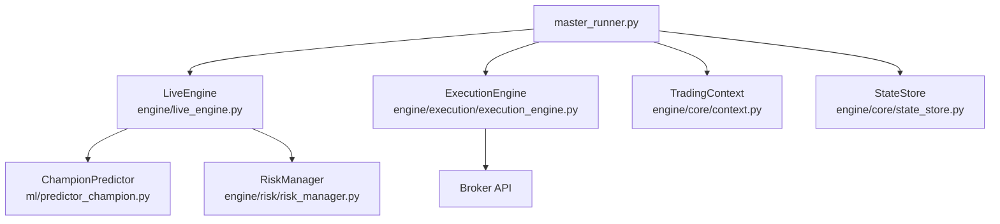
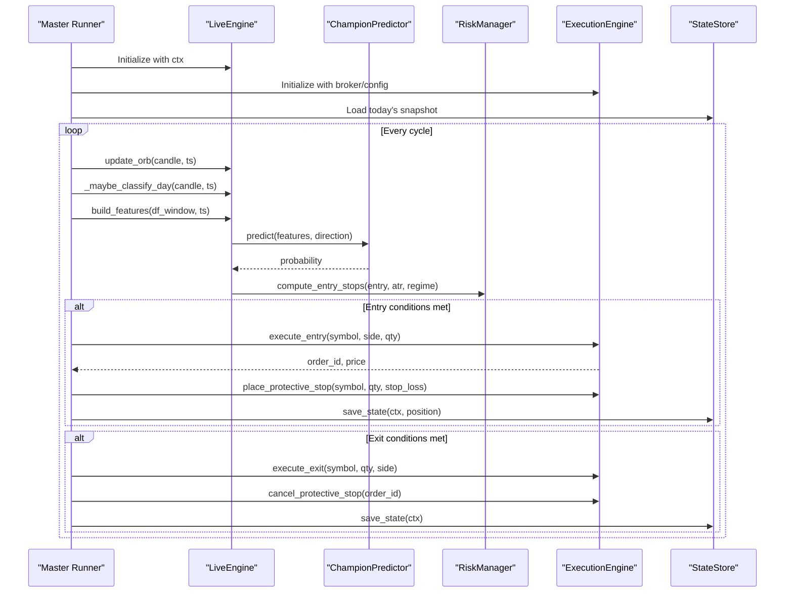
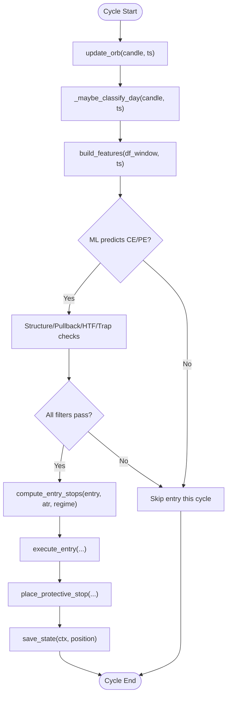
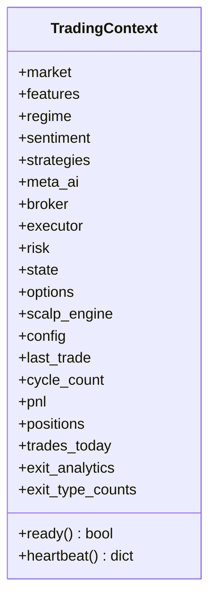
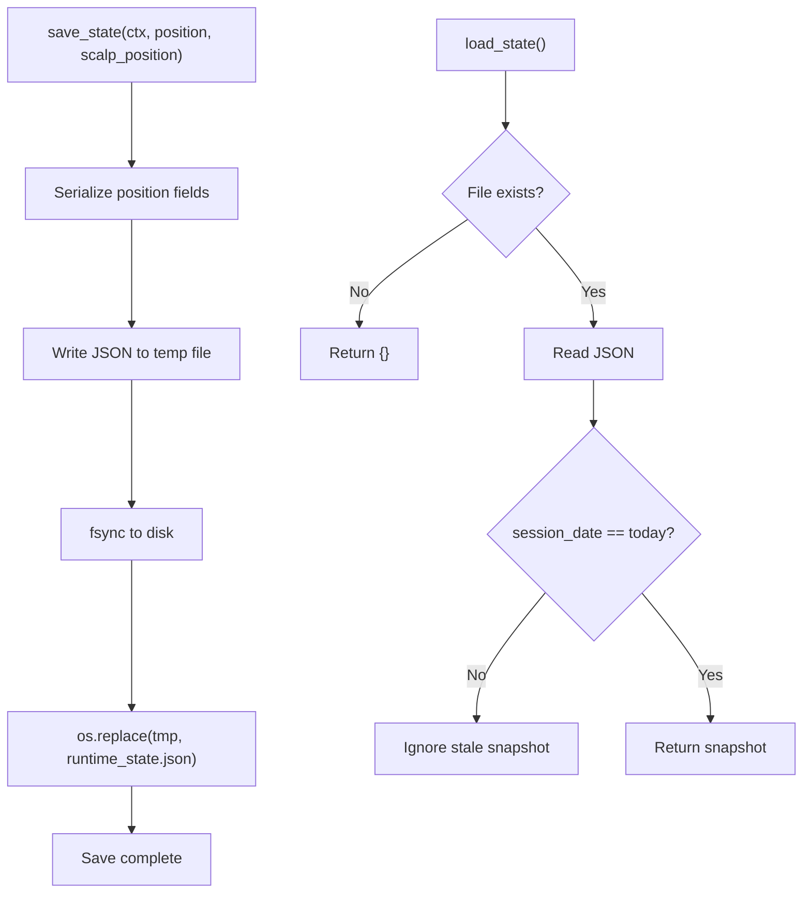
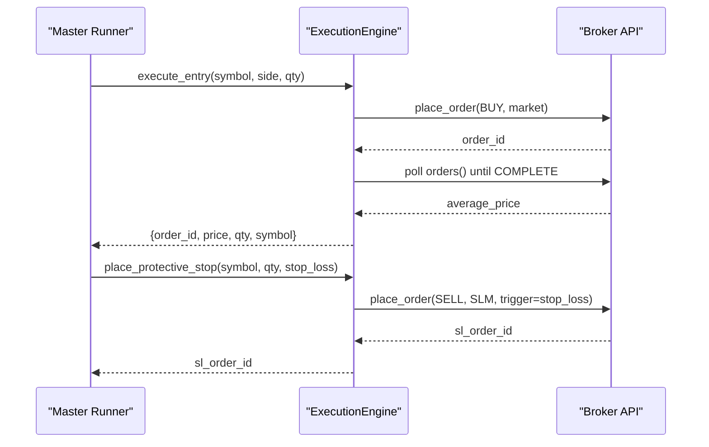
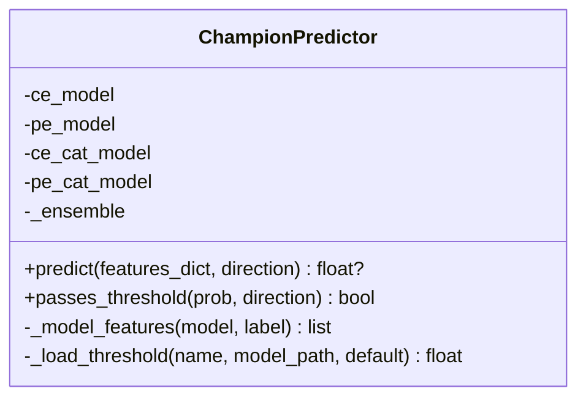
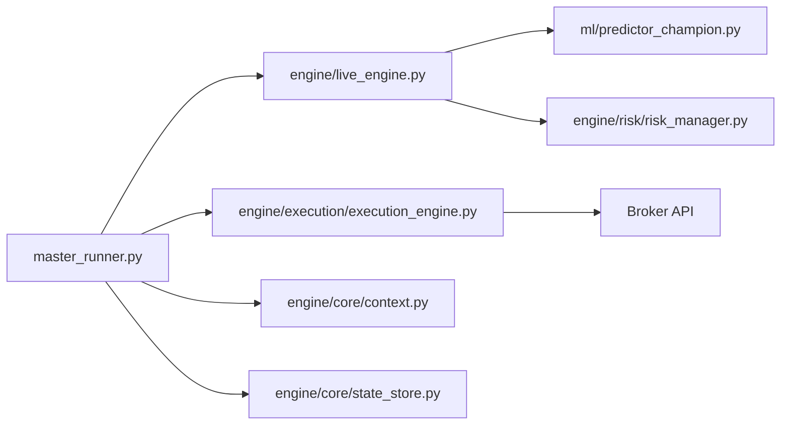

# Core Components

<cite>
**Referenced Files in This Document**
- [master_runner.py](file://master_runner.py)
- [live_engine.py](file://engine/live_engine.py)
- [context.py](file://engine/core/context.py)
- [state_store.py](file://engine/core/state_store.py)
- [execution_engine.py](file://engine/execution/execution_engine.py)
- [predictor_champion.py](file://ml/predictor_champion.py)
- [risk_manager.py](file://engine/risk/risk_manager.py)
- [SESSION_HANDOFF.md](file://SESSION_HANDOFF.md)
</cite>

## Table of Contents
1. Introduction
2. Project Structure
3. Core Components
4. Architecture Overview
5. Detailed Component Analysis
6. Dependency Analysis
7. Performance Considerations
8. Troubleshooting Guide
9. Conclusion
10. Appendices

## Introduction
This document explains the core trading system components and their orchestration. It focuses on how master_runner.py serves as the main entry point, manages session lifecycle, and coordinates between the live engine (ORB strategy, signal generation, real-time decision making), ML predictor, execution engine, and risk manager. It also documents the context management system for state sharing, persistent state store for recovery, error handling patterns, graceful shutdown procedures, and session handoff mechanisms.

## Project Structure
The system is organized into clear layers:
- Orchestration and lifecycle: master_runner.py
- Live decision-making: engine/live_engine.py
- Context and persistence: engine/core/context.py, engine/core/state_store.py
- Execution and broker integration: engine/execution/execution_engine.py
- Machine learning: ml/predictor_champion.py
- Risk controls: engine/risk/risk_manager.py
- Session notes and operational guidance: SESSION_HANDOFF.md

**Diagram sources**
- [master_runner.py:52-64](file://master_runner.py#L52-L64)
- [live_engine.py:71-184](file://engine/live_engine.py#L71-L184)
- [execution_engine.py:21-47](file://engine/execution/execution_engine.py#L21-L47)
- [context.py:3-78](file://engine/core/context.py#L3-L78)
- [state_store.py:1-94](file://engine/core/state_store.py#L1-L94)
- [predictor_champion.py:57-100](file://ml/predictor_champion.py#L57-L100)
- [risk_manager.py:15-60](file://engine/risk/risk_manager.py#L15-L60)

**Section sources**
- [master_runner.py:18-64](file://master_runner.py#L18-L64)
- [live_engine.py:71-184](file://engine/live_engine.py#L71-L184)
- [context.py:3-78](file://engine/core/context.py#L3-L78)
- [state_store.py:1-94](file://engine/core/state_store.py#L1-L94)
- [execution_engine.py:21-47](file://engine/execution/execution_engine.py#L21-L47)
- [predictor_champion.py:57-100](file://ml/predictor_champion.py#L57-L100)
- [risk_manager.py:15-60](file://engine/risk/risk_manager.py#L15-L60)

## Core Components
- Master Runner: Initializes subsystems, runs the live loop, enforces daily limits, orchestrates ORB reconstruction, and manages graceful shutdown and watchdog restarts.
- Live Engine: Implements ORB tracking, feature building, ML prediction gating, HTF alignment, trap filters, pullback entries, and exit logic via profit manager.
- Context: Central runtime container that holds references to market data, strategies, executor, risk, options, config, and runtime metrics.
- State Store: Atomic persistence of positions and session metrics across process restarts; restores open positions safely.
- Execution Engine: Order placement, fill validation, protective stop management (SL-M), and position verification.
- ML Predictor: Loads champion models (LightGBM and optional CatBoost ensemble), validates features, and returns calibrated probabilities with thresholds.
- Risk Manager: Computes tight stops and targets based on ATR and regime, enforcing capital-first risk limits.

**Section sources**
- [master_runner.py:52-64](file://master_runner.py#L52-L64)
- [live_engine.py:71-184](file://engine/live_engine.py#L71-L184)
- [context.py:3-78](file://engine/core/context.py#L3-L78)
- [state_store.py:1-94](file://engine/core/state_store.py#L1-L94)
- [execution_engine.py:21-47](file://engine/execution/execution_engine.py#L21-L47)
- [predictor_champion.py:57-100](file://ml/predictor_champion.py#L57-L100)
- [risk_manager.py:15-60](file://engine/risk/risk_manager.py#L15-L60)

## Architecture Overview
The master runner initializes the TradingContext, wires up the LiveEngine, ExecutionEngine, ML predictor, and risk utilities. It then enters a high-frequency loop that:
- Builds candles and rolling windows
- Updates ORB and day classification
- Builds features and queries ML predictions
- Applies structural, HTF, trap, and pullback filters
- Computes risk-based stops/targets
- Executes orders and places protective stops
- Persists state and logs analytics

**Diagram sources**
- [master_runner.py:52-64](file://master_runner.py#L52-L64)
- [live_engine.py:190-315](file://engine/live_engine.py#L190-L315)
- [live_engine.py:445-590](file://engine/live_engine.py#L445-L590)
- [predictor_champion.py:151-204](file://ml/predictor_champion.py#L151-L204)
- [risk_manager.py:20-60](file://engine/risk/risk_manager.py#L20-L60)
- [execution_engine.py:94-154](file://engine/execution/execution_engine.py#L94-L154)
- [execution_engine.py:235-292](file://engine/execution/execution_engine.py#L235-L292)
- [state_store.py:40-79](file://engine/core/state_store.py#L40-L79)

## Detailed Component Analysis

### Master Runner: Session Lifecycle and Orchestration
- Initialization: Imports and wires core modules (LiveEngine, ExecutionEngine, TradingContext, StateStore, ML learner, analytics).
- ORB Reconstruction: Ensures ORB breakout signals are available even if startup occurs after the 9:15–9:29 window by fetching historical intraday candles from the broker.
- Watchdog: Monitors the engine thread and auto-restarts under safe conditions (respecting daily loss limits and emergency stop flags).
- Daily Limits and Kill Switch: Enforces daily loss caps every cycle and pauses new entries when protective stop operations fail.
- Graceful Shutdown: Uses atexit handlers and Telegram notifications to pause engine and alert operators on critical failures.
- Session Handoff: Operational notes confirm token refresh procedure and instrument configuration for smooth start-of-day operation.

Key responsibilities:
- Start broker feed and subscribe to required tokens
- Build candle windows and pass them to LiveEngine
- Manage protective stops lifecycle (create, modify, cancel, verify/repair)
- Persist state after trade transitions and periodically during the session
- Log analytics and EOD reports

**Section sources**
- [master_runner.py:52-64](file://master_runner.py#L52-L64)
- [master_runner.py:204-286](file://master_runner.py#L204-L286)
- [master_runner.py:295-370](file://master_runner.py#L295-L370)
- [master_runner.py:2388-2395](file://master_runner.py#L2388-L2395)
- [SESSION_HANDOFF.md:5-13](file://SESSION_HANDOFF.md#L5-L13)

### Live Engine: ORB Strategy, Signal Generation, Real-Time Decisions
- ORB Tracking: Accumulates opening range from 9:15 to 9:29 using timestamps; supports reconstruction if missed.
- Day Classification: Collects first 30 minutes of candles and classifies regime once at 9:45; includes backfill for late starts.
- Feature Building: Constructs a fixed set of 28 features via feature_config, including EMA, RSI, ATR, SuperTrend, ADX, VWAP bias, and HTF trend alignment.
- ML Prediction: Queries ChampionPredictor for CE/PE probabilities; applies floors and edge margins to avoid low-conviction trades.
- Entry Filters: Structural confirmation, pullback entry after breakout, HTF alignment (15m/30m SuperTrend + EMA), trap filter to block failed breakouts.
- Exit Logic: Delegates to profit manager for trailing exits and dynamic target management.

**Diagram sources**
- [live_engine.py:190-315](file://engine/live_engine.py#L190-L315)
- [live_engine.py:375-440](file://engine/live_engine.py#L375-L440)
- [live_engine.py:445-590](file://engine/live_engine.py#L445-L590)
- [live_engine.py:643-666](file://engine/live_engine.py#L643-L666)
- [live_engine.py:695-793](file://engine/live_engine.py#L695-L793)
- [risk_manager.py:20-60](file://engine/risk/risk_manager.py#L20-L60)
- [execution_engine.py:94-154](file://engine/execution/execution_engine.py#L94-L154)
- [execution_engine.py:235-292](file://engine/execution/execution_engine.py#L235-L292)
- [state_store.py:40-79](file://engine/core/state_store.py#L40-L79)

**Section sources**
- [live_engine.py:71-184](file://engine/live_engine.py#L71-L184)
- [live_engine.py:190-315](file://engine/live_engine.py#L190-L315)
- [live_engine.py:375-440](file://engine/live_engine.py#L375-L440)
- [live_engine.py:445-590](file://engine/live_engine.py#L445-L590)
- [live_engine.py:643-666](file://engine/live_engine.py#L643-L666)
- [live_engine.py:695-793](file://engine/live_engine.py#L695-L793)

### Context Management System: State Sharing Across Components
- Centralized container holding references to market data, strategies, executor, risk, options, config, and runtime metrics.
- Provides readiness checks and heartbeat for monitoring/debugging.
- Enables loose coupling: components interact through shared context rather than direct imports.

**Diagram sources**
- [context.py:3-78](file://engine/core/context.py#L3-L78)

**Section sources**
- [context.py:3-78](file://engine/core/context.py#L3-L78)

### State Store: Persistent Data Management and Recovery
- Atomic writes using temporary file plus os.replace to prevent partial reads.
- Persists session date, PnL, trades today, positions, and open positions (serialized subset).
- Restores only snapshots from the current trading day to avoid cross-session leakage.
- Deserializes position timestamps safely.

**Diagram sources**
- [state_store.py:28-79](file://engine/core/state_store.py#L28-L79)

**Section sources**
- [state_store.py:1-94](file://engine/core/state_store.py#L1-L94)

### Execution Engine: Orders, Fill Validation, Protective Stops
- Entry/Exit: Places BUY orders to open both CE and PE; closes with SELL; supports paper/dry-run modes.
- Fill Validation: Polls broker order book until COMPLETE or max attempts; falls back to LTP if needed.
- Protective Stops: Manages SL-M orders with tick-aligned triggers; supports create, modify, cancel, and recovery via broker order discovery.
- Position Verification: Confirms flat status post-exit to avoid double exits.

**Diagram sources**
- [execution_engine.py:94-154](file://engine/execution/execution_engine.py#L94-L154)
- [execution_engine.py:235-292](file://engine/execution/execution_engine.py#L235-L292)
- [execution_engine.py:311-328](file://engine/execution/execution_engine.py#L311-L328)

**Section sources**
- [execution_engine.py:21-47](file://engine/execution/execution_engine.py#L21-L47)
- [execution_engine.py:94-154](file://engine/execution/execution_engine.py#L94-L154)
- [execution_engine.py:160-215](file://engine/execution/execution_engine.py#L160-L215)
- [execution_engine.py:235-292](file://engine/execution/execution_engine.py#L235-L292)
- [execution_engine.py:311-328](file://engine/execution/execution_engine.py#L311-L328)
- [execution_engine.py:349-371](file://engine/execution/execution_engine.py#L349-L371)

### ML Predictor: Model Loading, Feature Validation, Probability Output
- Loads LightGBM models for CE and PE; optionally loads CatBoost for ensemble averaging.
- Validates feature presence and values; handles NaN/Inf gracefully.
- Returns calibrated probabilities with per-side thresholds; avoids hard floors that suppress valid signals.

**Diagram sources**
- [predictor_champion.py:57-100](file://ml/predictor_champion.py#L57-L100)
- [predictor_champion.py:151-204](file://ml/predictor_champion.py#L151-L204)
- [predictor_champion.py:210-218](file://ml/predictor_champion.py#L210-L218)

**Section sources**
- [predictor_champion.py:57-100](file://ml/predictor_champion.py#L57-L100)
- [predictor_champion.py:151-204](file://ml/predictor_champion.py#L151-L204)
- [predictor_champion.py:210-218](file://ml/predictor_champion.py#L210-L218)

### Risk Manager: Capital-First Stop and Target Computation
- Computes tight stops capped at 10 premium points to limit worst-case loss per trade.
- Sets target at 3.5R guidance; actual exit managed by profit manager via trailing logic.
- Adjusts stop distance based on ATR and delta; ensures minimum floor to avoid noise stop-outs.

**Section sources**
- [risk_manager.py:15-60](file://engine/risk/risk_manager.py#L15-L60)

## Dependency Analysis
- Master Runner depends on LiveEngine, ExecutionEngine, TradingContext, StateStore, ML Learner, Analytics, and Telegram notifier.
- LiveEngine depends on ML Predictor, Risk Manager, Profit Manager, and Indicator utilities.
- ExecutionEngine depends on Broker API and Configuration.
- StateStore persists to local JSON file and is read by Master Runner on startup.

**Diagram sources**
- [master_runner.py:52-64](file://master_runner.py#L52-L64)
- [live_engine.py:71-184](file://engine/live_engine.py#L71-L184)
- [execution_engine.py:21-47](file://engine/execution/execution_engine.py#L21-L47)
- [context.py:3-78](file://engine/core/context.py#L3-L78)
- [state_store.py:1-94](file://engine/core/state_store.py#L1-L94)
- [predictor_champion.py:57-100](file://ml/predictor_champion.py#L57-L100)
- [risk_manager.py:15-60](file://engine/risk/risk_manager.py#L15-L60)

**Section sources**
- [master_runner.py:52-64](file://master_runner.py#L52-L64)
- [live_engine.py:71-184](file://engine/live_engine.py#L71-L184)
- [execution_engine.py:21-47](file://engine/execution/execution_engine.py#L21-L47)
- [context.py:3-78](file://engine/core/context.py#L3-L78)
- [state_store.py:1-94](file://engine/core/state_store.py#L1-L94)
- [predictor_champion.py:57-100](file://ml/predictor_champion.py#L57-L100)
- [risk_manager.py:15-60](file://engine/risk/risk_manager.py#L15-L60)

## Performance Considerations
- Per-minute deduplication: LiveEngine updates learner and VWAP once per completed minute to avoid redundant computations.
- Efficient feature computation: Rolling windows and vectorized indicators reduce overhead.
- Atomic state writes: Prevents corruption and reduces I/O contention.
- Fill polling with bounded retries: Balances latency and reliability.
- HTF alignment checks: Reduce false entries by aligning with higher timeframe trends.

[No sources needed since this section provides general guidance]

## Troubleshooting Guide
- ORB unavailable: If historical data fetch fails, ORB remains empty; ML-only entries still active. Check broker connectivity and time window.
- Missing features: Predictor warns and skips prediction if features are missing or invalid; ensure feature pipeline builds all required columns.
- Protective stop failures: On create/modify/repair failure, engine pauses new entries and alerts via Telegram; verify broker API and order IDs.
- Daily loss limit reached: Engine halts new entries; review PnL and adjust parameters if necessary.
- Session handoff issues: Ensure access tokens are refreshed before market open; verify instrument symbols and lot sizes match configuration.

**Section sources**
- [master_runner.py:204-286](file://master_runner.py#L204-L286)
- [master_runner.py:295-370](file://master_runner.py#L295-L370)
- [SESSION_HANDOFF.md:5-13](file://SESSION_HANDOFF.md#L5-L13)

## Conclusion
The system integrates robust real-time decision-making with resilient execution and risk controls. The master runner orchestrates lifecycle and recovery, the live engine implements disciplined ORB-based strategies with ML gating, the execution engine ensures reliable order and stop management, and the context/state store provide consistent state sharing and persistence. Together, these components deliver a production-ready trading system capable of adaptive decisions, graceful error handling, and seamless session handoffs.

[No sources needed since this section summarizes without analyzing specific files]

## Appendices
- Operational Notes: Refer to SESSION_HANDOFF.md for token refresh, instrument configuration, and startup verification steps.

**Section sources**
- [SESSION_HANDOFF.md:5-13](file://SESSION_HANDOFF.md#L5-L13)