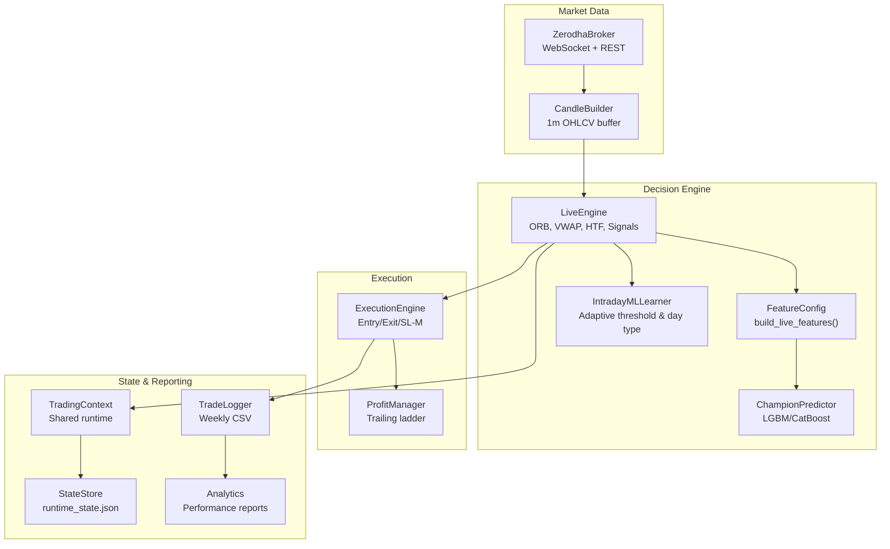
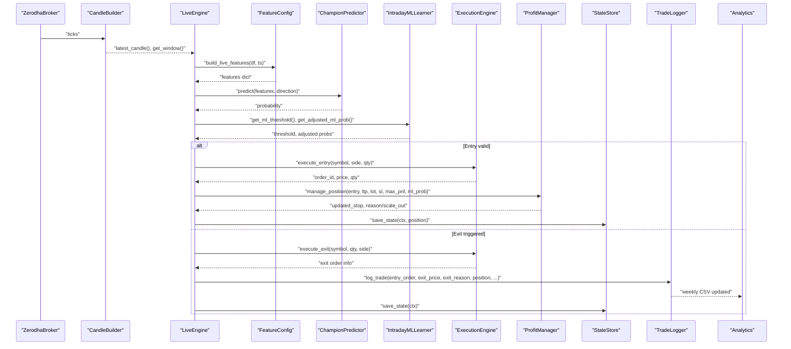
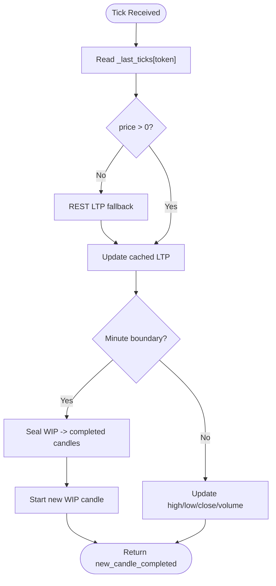
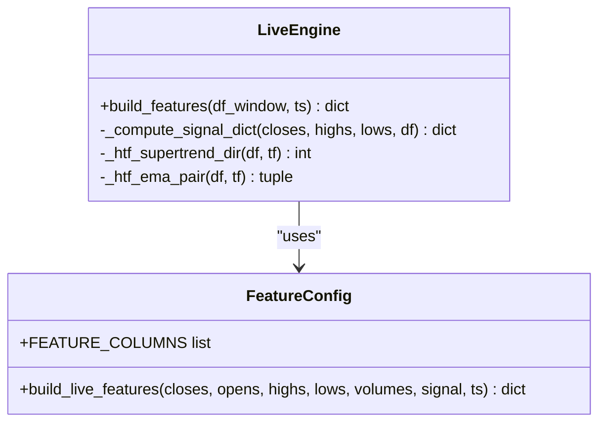
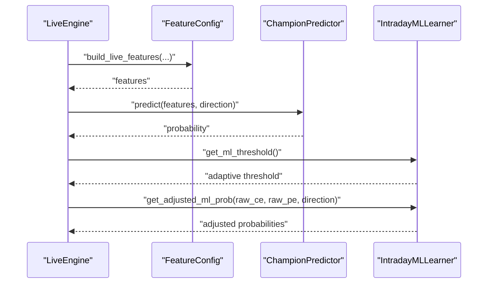
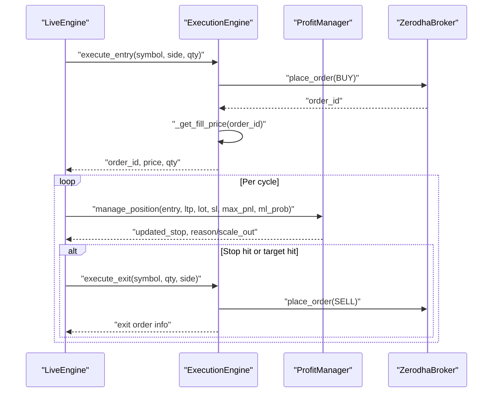
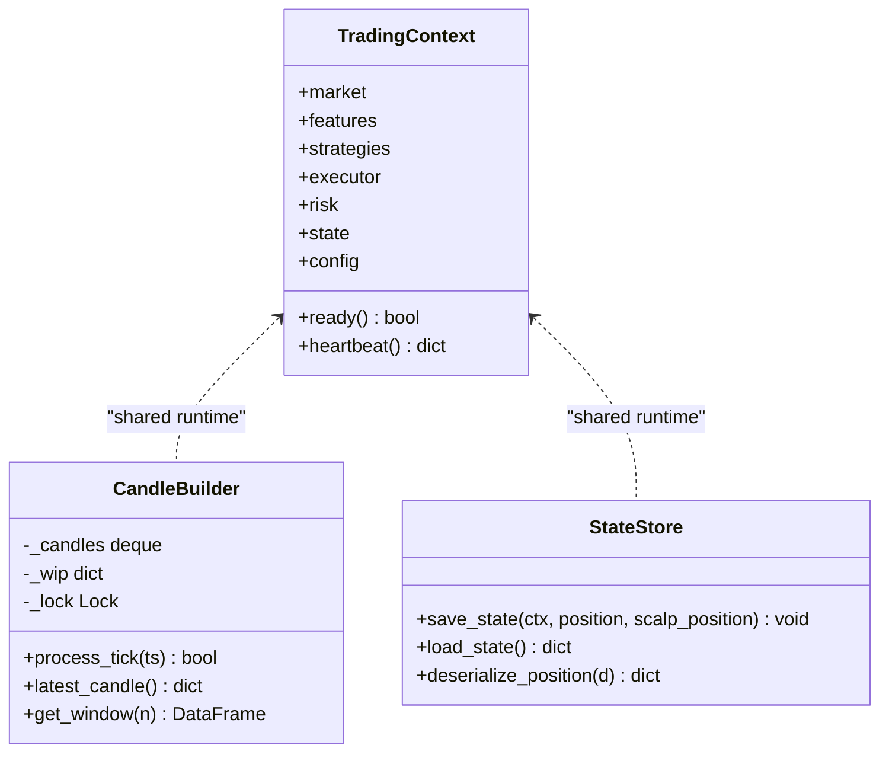
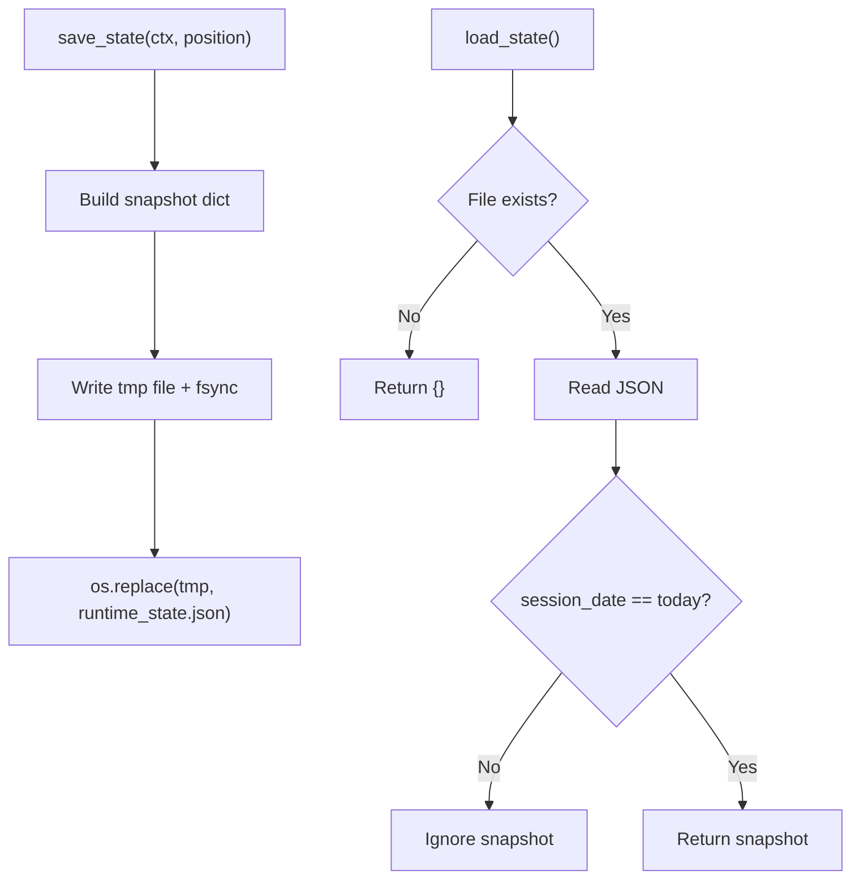
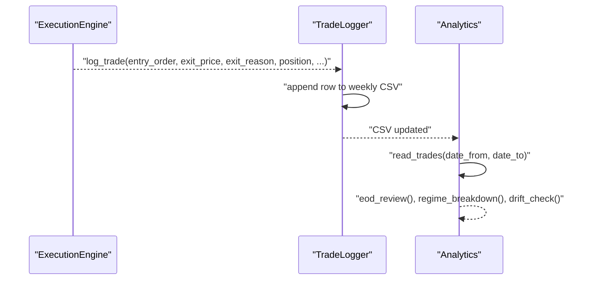
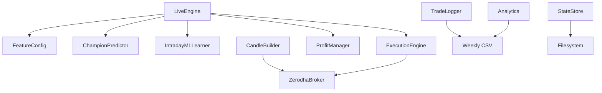

# Data Flow Architecture

<cite>
**Referenced Files in This Document**
- [master_runner.py](file://master_runner.py)
- [engine/live_engine.py](file://engine/live_engine.py)
- [engine/data/candle_builder.py](file://engine/data/candle_builder.py)
- [engine/execution/broker.py](file://engine/execution/broker.py)
- [ml/feature_config.py](file://ml/feature_config.py)
- [ml/ml_intraday_learner.py](file://ml/ml_intraday_learner.py)
- [ml/predictor_champion.py](file://ml/predictor_champion.py)
- [engine/execution/execution_engine.py](file://engine/execution/execution_engine.py)
- [engine/execution/profit_manager.py](file://engine/execution/profit_manager.py)
- [engine/core/context.py](file://engine/core/context.py)
- [engine/core/state_store.py](file://engine/core/state_store.py)
- [engine/services/trade_logger.py](file://engine/services/trade_logger.py)
- [engine/analytics/performance.py](file://engine/analytics/performance.py)
</cite>

## Table of Contents
1. Introduction
2. Project Structure
3. Core Components
4. Architecture Overview
5. Detailed Component Analysis
6. Dependency Analysis
7. Performance Considerations
8. Troubleshooting Guide
9. Conclusion
10. Appendices

## Introduction
This document explains the event-driven data flow and state management for a high-frequency intraday trading system that ingests market data from Zerodha’s WebSocket, builds 1-minute candles, computes features, runs ML predictions, manages exits with trailing stops, persists state across restarts, logs trades, and produces analytics. It focuses on:
- Real-time candle building from ticks
- Feature engineering pipeline
- ML prediction and adaptive thresholds
- Execution and risk controls
- Context object pattern for thread-safe state sharing
- State persistence and crash recovery
- Trade logging and performance analytics
- Caching strategies and memory management for HFT scenarios

## Project Structure
The system is organized into clear layers:
- Market data ingestion: broker WebSocket and candle aggregation
- Decision engine: live engine orchestrates signals, features, ML, and exits
- Execution: order placement, fill validation, protective stops, position verification
- State and context: shared runtime container and persistent state store
- Analytics and reporting: trade journaling and post-trade analysis

**Diagram sources**
- [engine/execution/broker.py:59-122](file://engine/execution/broker.py#L59-L122)
- [engine/data/candle_builder.py:18-108](file://engine/data/candle_builder.py#L18-L108)
- [engine/live_engine.py:71-184](file://engine/live_engine.py#L71-L184)
- [ml/feature_config.py:82-252](file://ml/feature_config.py#L82-L252)
- [ml/predictor_champion.py:57-100](file://ml/predictor_champion.py#L57-L100)
- [ml/ml_intraday_learner.py:46-100](file://ml/ml_intraday_learner.py#L46-L100)
- [engine/execution/execution_engine.py:21-154](file://engine/execution/execution_engine.py#L21-L154)
- [engine/execution/profit_manager.py:116-225](file://engine/execution/profit_manager.py#L116-L225)
- [engine/core/context.py:3-78](file://engine/core/context.py#L3-L78)
- [engine/core/state_store.py:40-94](file://engine/core/state_store.py#L40-L94)
- [engine/services/trade_logger.py:49-141](file://engine/services/trade_logger.py#L49-L141)
- [engine/analytics/performance.py:143-219](file://engine/analytics/performance.py#L143-L219)

**Section sources**
- [engine/execution/broker.py:59-122](file://engine/execution/broker.py#L59-L122)
- [engine/data/candle_builder.py:18-108](file://engine/data/candle_builder.py#L18-L108)
- [engine/live_engine.py:71-184](file://engine/live_engine.py#L71-L184)
- [ml/feature_config.py:82-252](file://ml/feature_config.py#L82-L252)
- [ml/predictor_champion.py:57-100](file://ml/predictor_champion.py#L57-L100)
- [ml/ml_intraday_learner.py:46-100](file://ml/ml_intraday_learner.py#L46-L100)
- [engine/execution/execution_engine.py:21-154](file://engine/execution/execution_engine.py#L21-L154)
- [engine/execution/profit_manager.py:116-225](file://engine/execution/profit_manager.py#L116-L225)
- [engine/core/context.py:3-78](file://engine/core/context.py#L3-L78)
- [engine/core/state_store.py:40-94](file://engine/core/state_store.py#L40-L94)
- [engine/services/trade_logger.py:49-141](file://engine/services/trade_logger.py#L49-L141)
- [engine/analytics/performance.py:143-219](file://engine/analytics/performance.py#L143-L219)

## Core Components
- ZerodhaBroker: Establishes WebSocket feed, maintains last ticks, handles reconnects and option chain subscriptions.
- CandleBuilder: Aggregates ticks into rolling 1-minute OHLCV candles with thread-safe access and historical seeding.
- LiveEngine: Orchestrates ORB tracking, VWAP accumulation, higher-timeframe trend alignment, feature computation, ML prediction, entry filters (structure, pullback, trap), and exit delegation to profit manager.
- FeatureConfig: Builds a canonical 36-feature vector per candle, including direction stack (Supertrend, ADX, EMA alignment, VWAP bias).
- ChampionPredictor: Loads LGBM and optional CatBoost models; predicts probabilities with calibration and ensemble averaging when available.
- IntradayMLLearner: Tracks day type, adapts thresholds and side multipliers based on outcomes, and can request AI review after consecutive losses.
- ExecutionEngine: Places orders, validates fills by polling order book, enforces duplicate order guard, and manages protective SL-M orders.
- ProfitManager: Centralized trailing stop ladder and drawdown exits; single source of truth for stop updates.
- TradingContext: Central runtime container for cross-component state sharing without direct imports.
- StateStore: Atomic persistence of session state and open positions; survives process restarts and prevents stale-day leakage.
- TradeLogger: Writes weekly CSV trade logs with comprehensive metrics and timestamps.
- Analytics: Reads trade logs to produce EOD reviews, regime breakdowns, ML bucket quality, drift alerts, and equity curve stats.

**Section sources**
- [engine/execution/broker.py:59-122](file://engine/execution/broker.py#L59-L122)
- [engine/data/candle_builder.py:18-108](file://engine/data/candle_builder.py#L18-L108)
- [engine/live_engine.py:71-184](file://engine/live_engine.py#L71-L184)
- [ml/feature_config.py:82-252](file://ml/feature_config.py#L82-L252)
- [ml/predictor_champion.py:57-100](file://ml/predictor_champion.py#L57-L100)
- [ml/ml_intraday_learner.py:46-100](file://ml/ml_intraday_learner.py#L46-L100)
- [engine/execution/execution_engine.py:21-154](file://engine/execution/execution_engine.py#L21-L154)
- [engine/execution/profit_manager.py:116-225](file://engine/execution/profit_manager.py#L116-L225)
- [engine/core/context.py:3-78](file://engine/core/context.py#L3-L78)
- [engine/core/state_store.py:40-94](file://engine/core/state_store.py#L40-L94)
- [engine/services/trade_logger.py:49-141](file://engine/services/trade_logger.py#L49-L141)
- [engine/analytics/performance.py:143-219](file://engine/analytics/performance.py#L143-L219)

## Architecture Overview
The data flow is event-driven and cycle-based:
- Broker WebSocket pushes ticks; CandleBuilder aggregates into completed 1-minute candles.
- LiveEngine consumes latest window, builds features via FeatureConfig, and calls ML predictor.
- IntradayMLLearner provides adaptive thresholds and day-type adjustments.
- Entry filters validate structure, pullbacks, traps, and higher-timeframe alignment.
- ExecutionEngine places orders, validates fills, and sets protective stops.
- ProfitManager updates trailing stops and determines exits.
- StateStore persists critical state; TradeLogger records completed trades; Analytics reads logs for reporting.

**Diagram sources**
- [engine/execution/broker.py:59-122](file://engine/execution/broker.py#L59-L122)
- [engine/data/candle_builder.py:114-192](file://engine/data/candle_builder.py#L114-L192)
- [engine/live_engine.py:445-590](file://engine/live_engine.py#L445-L590)
- [ml/feature_config.py:82-252](file://ml/feature_config.py#L82-L252)
- [ml/predictor_champion.py:151-208](file://ml/predictor_champion.py#L151-L208)
- [ml/ml_intraday_learner.py:208-245](file://ml/ml_intraday_learner.py#L208-L245)
- [engine/execution/execution_engine.py:94-154](file://engine/execution/execution_engine.py#L94-L154)
- [engine/execution/profit_manager.py:173-225](file://engine/execution/profit_manager.py#L173-L225)
- [engine/core/state_store.py:40-94](file://engine/core/state_store.py#L40-L94)
- [engine/services/trade_logger.py:49-141](file://engine/services/trade_logger.py#L49-L141)
- [engine/analytics/performance.py:143-219](file://engine/analytics/performance.py#L143-L219)

## Detailed Component Analysis

### Market Data Ingestion and Candle Building
- ZerodhaBroker starts a threaded KiteTicker, subscribes to index and options, and stores last ticks in-memory. Reconnect logic re-applies subscriptions.
- CandleBuilder reads broker._last_ticks per cycle, updates WIP candle, seals completed candles into a deque buffer, and exposes latest candle/window/LTP. Historical CSV seeding warms indicators at startup.

**Diagram sources**
- [engine/execution/broker.py:78-91](file://engine/execution/broker.py#L78-L91)
- [engine/data/candle_builder.py:114-192](file://engine/data/candle_builder.py#L114-L192)

**Section sources**
- [engine/execution/broker.py:59-122](file://engine/execution/broker.py#L59-L122)
- [engine/data/candle_builder.py:18-108](file://engine/data/candle_builder.py#L18-L108)
- [engine/data/candle_builder.py:114-192](file://engine/data/candle_builder.py#L114-L192)
- [engine/data/candle_builder.py:198-247](file://engine/data/candle_builder.py#L198-L247)

### Feature Engineering Pipeline
- LiveEngine computes signal indicators (EMA, RSI, ATR, Supertrend, ADX, VWAP bias, HTF alignment) and passes them to FeatureConfig.build_live_features.
- FeatureConfig returns a fixed-order 36-feature vector used consistently across training and live inference. Includes direction stack and time/session features.

**Diagram sources**
- [engine/live_engine.py:445-590](file://engine/live_engine.py#L445-L590)
- [ml/feature_config.py:82-252](file://ml/feature_config.py#L82-L252)

**Section sources**
- [engine/live_engine.py:445-590](file://engine/live_engine.py#L445-L590)
- [ml/feature_config.py:82-252](file://ml/feature_config.py#L82-L252)

### ML Prediction and Adaptive Thresholds
- ChampionPredictor loads LGBM and optional CatBoost models, validates features, and predicts probabilities. Ensemble averaging is used if both models are present.
- IntradayMLLearner detects day type during first 30 minutes, adjusts thresholds and side multipliers based on outcomes, and supports AI review after consecutive losses.

**Diagram sources**
- [ml/predictor_champion.py:151-208](file://ml/predictor_champion.py#L151-L208)
- [ml/ml_intraday_learner.py:208-245](file://ml/ml_intraday_learner.py#L208-L245)
- [ml/feature_config.py:82-252](file://ml/feature_config.py#L82-L252)

**Section sources**
- [ml/predictor_champion.py:57-100](file://ml/predictor_champion.py#L57-L100)
- [ml/predictor_champion.py:151-208](file://ml/predictor_champion.py#L151-L208)
- [ml/ml_intraday_learner.py:109-148](file://ml/ml_intraday_learner.py#L109-L148)
- [ml/ml_intraday_learner.py:208-245](file://ml/ml_intraday_learner.py#L208-L245)
- [ml/ml_intraday_learner.py:247-319](file://ml/ml_intraday_learner.py#L247-L319)

### Execution and Risk Controls
- ExecutionEngine places BUY orders for entries and SELL orders for exits, polls order book for fill confirmation, and enforces duplicate order guard. Protective SL-M orders are placed server-side to avoid virtual-stop gaps.
- ProfitManager centralizes trailing stop ladder and drawdown exits; it converts rupee profit locks to premium stops and ratchets tighter only.

**Diagram sources**
- [engine/execution/execution_engine.py:94-154](file://engine/execution/execution_engine.py#L94-L154)
- [engine/execution/execution_engine.py:160-215](file://engine/execution/execution_engine.py#L160-L215)
- [engine/execution/execution_engine.py:227-292](file://engine/execution/execution_engine.py#L227-L292)
- [engine/execution/profit_manager.py:116-225](file://engine/execution/profit_manager.py#L116-L225)
- [engine/execution/broker.py:59-122](file://engine/execution/broker.py#L59-L122)

**Section sources**
- [engine/execution/execution_engine.py:21-154](file://engine/execution/execution_engine.py#L21-L154)
- [engine/execution/execution_engine.py:160-215](file://engine/execution/execution_engine.py#L160-L215)
- [engine/execution/execution_engine.py:227-292](file://engine/execution/execution_engine.py#L227-L292)
- [engine/execution/profit_manager.py:116-225](file://engine/execution/profit_manager.py#L116-L225)

### Context Object Pattern and Thread Safety
- TradingContext holds references to all major components (market, features, strategies, executor, risk, state, config) and provides readiness checks and heartbeat diagnostics.
- CandleBuilder uses a threading.Lock to protect its internal deque and WIP state while broker ticks arrive in a separate thread.
- StateStore writes atomically using temp file + os.replace and fsync to prevent partial writes and corruption under concurrent access.

**Diagram sources**
- [engine/core/context.py:3-78](file://engine/core/context.py#L3-L78)
- [engine/data/candle_builder.py:18-108](file://engine/data/candle_builder.py#L18-L108)
- [engine/core/state_store.py:40-94](file://engine/core/state_store.py#L40-L94)

**Section sources**
- [engine/core/context.py:3-78](file://engine/core/context.py#L3-L78)
- [engine/data/candle_builder.py:18-108](file://engine/data/candle_builder.py#L18-L108)
- [engine/core/state_store.py:40-94](file://engine/core/state_store.py#L40-L94)

### State Persistence and Crash Recovery
- StateStore serializes key position fields and session metrics into runtime_state.json with atomic swap and fsync. On load, it ignores snapshots from previous days to prevent PnL leakage.
- Master runner initializes broker, waits for first tick, seeds historical data, and ensures safe start conditions (no open positions unless allowed).

**Diagram sources**
- [engine/core/state_store.py:40-94](file://engine/core/state_store.py#L40-L94)
- [master_runner.py:666-719](file://master_runner.py#L666-L719)

**Section sources**
- [engine/core/state_store.py:40-94](file://engine/core/state_store.py#L40-L94)
- [master_runner.py:666-719](file://master_runner.py#L666-L719)

### Trade Logging and Performance Analytics
- TradeLogger writes weekly CSV files with comprehensive fields including timestamps, prices, quantities, PnL, MFE/MAE, thresholds, and latencies. Uses a lock to ensure thread safety.
- Analytics reads trade logs to generate EOD reviews, regime breakdowns, ML bucket quality, drift alerts, and equity curve statistics.

**Diagram sources**
- [engine/services/trade_logger.py:49-141](file://engine/services/trade_logger.py#L49-L141)
- [engine/analytics/performance.py:143-219](file://engine/analytics/performance.py#L143-L219)
- [engine/analytics/performance.py:294-356](file://engine/analytics/performance.py#L294-L356)
- [engine/analytics/performance.py:401-487](file://engine/analytics/performance.py#L401-L487)

**Section sources**
- [engine/services/trade_logger.py:49-141](file://engine/services/trade_logger.py#L49-L141)
- [engine/analytics/performance.py:143-219](file://engine/analytics/performance.py#L143-L219)
- [engine/analytics/performance.py:294-356](file://engine/analytics/performance.py#L294-L356)
- [engine/analytics/performance.py:401-487](file://engine/analytics/performance.py#L401-L487)

## Dependency Analysis
Key dependencies and coupling:
- LiveEngine depends on FeatureConfig, ChampionPredictor, IntradayMLLearner, ExecutionEngine, and ProfitManager.
- CandleBuilder depends on ZerodhaBroker for ticks.
- StateStore depends on OS filesystem APIs for atomic writes.
- TradeLogger depends on ExecutionEngine outputs and writes to disk.
- Analytics depends on TradeLogger CSV files.

**Diagram sources**
- [engine/live_engine.py:71-184](file://engine/live_engine.py#L71-L184)
- [engine/data/candle_builder.py:18-108](file://engine/data/candle_builder.py#L18-L108)
- [engine/execution/broker.py:59-122](file://engine/execution/broker.py#L59-L122)
- [engine/services/trade_logger.py:49-141](file://engine/services/trade_logger.py#L49-L141)
- [engine/analytics/performance.py:143-219](file://engine/analytics/performance.py#L143-L219)
- [engine/core/state_store.py:40-94](file://engine/core/state_store.py#L40-L94)

**Section sources**
- [engine/live_engine.py:71-184](file://engine/live_engine.py#L71-L184)
- [engine/data/candle_builder.py:18-108](file://engine/data/candle_builder.py#L18-L108)
- [engine/execution/broker.py:59-122](file://engine/execution/broker.py#L59-L122)
- [engine/services/trade_logger.py:49-141](file://engine/services/trade_logger.py#L49-L141)
- [engine/analytics/performance.py:143-219](file://engine/analytics/performance.py#L143-L219)
- [engine/core/state_store.py:40-94](file://engine/core/state_store.py#L40-L94)

## Performance Considerations
- Caching strategies:
  - CandleBuilder maintains a rolling deque of completed candles and a WIP candle to minimize allocations and provide O(1) access to latest data.
  - LiveEngine caches VWAP accumulator and higher-timeframe trend states to avoid recomputation every second.
  - FeatureConfig precomputes direction stack and time features once per candle to reduce redundant calculations.
- Memory management:
  - Deque maxlen limits candle buffer size to prevent unbounded growth.
  - Feature vectors are constructed per candle and discarded after prediction, avoiding large persistent structures.
  - StateStore uses compact serialization of only necessary keys to keep runtime_state.json small.
- Optimization techniques:
  - Deduplication guards ensure learner and VWAP updates occur once per minute despite per-second engine loops.
  - REST fallbacks are minimized; WebSocket ticks are preferred for low-latency data.
  - Protective SL-M orders shift risk enforcement to the broker, reducing polling overhead and latency risks.
  - Ensemble prediction falls back gracefully if one model fails, maintaining throughput.

[No sources needed since this section provides general guidance]

## Troubleshooting Guide
Common issues and mitigations:
- No WebSocket ticks: CandleBuilder falls back to REST LTP and warns; master runner waits up to 10 seconds for first tick before proceeding.
- Stale feed: Watchdog monitors last tick time and triggers reconnection if feed is stale beyond threshold.
- Missing features: FeatureConfig safe builder returns zero-filled features if insufficient data; predictor logs warnings for missing features and avoids returning zero probabilities silently.
- Fill validation failures: ExecutionEngine polls order book multiple times and uses fallback price if needed; logs detailed errors for rejected or cancelled orders.
- State persistence errors: StateStore catches exceptions and logs warnings; readers never observe half-written files due to atomic swap.
- Trade log write errors: TradeLogger uses locking and ensures headers exist; analytics functions handle missing files gracefully.

**Section sources**
- [engine/data/candle_builder.py:125-144](file://engine/data/candle_builder.py#L125-L144)
- [master_runner.py:687-719](file://master_runner.py#L687-L719)
- [engine/live_engine.py:445-470](file://engine/live_engine.py#L445-L470)
- [ml/feature_config.py:255-267](file://ml/feature_config.py#L255-L267)
- [ml/predictor_champion.py:151-176](file://ml/predictor_champion.py#L151-L176)
- [engine/execution/execution_engine.py:52-88](file://engine/execution/execution_engine.py#L52-L88)
- [engine/core/state_store.py:62-79](file://engine/core/state_store.py#L62-L79)
- [engine/services/trade_logger.py:43-47](file://engine/services/trade_logger.py#L43-L47)

## Conclusion
The system implements a robust, event-driven architecture for intraday trading with clear separation of concerns:
- Market data ingestion via Zerodha WebSocket and efficient candle aggregation
- Feature engineering pipeline producing consistent inputs for ML models
- Adaptive ML prediction with day-type detection and threshold tuning
- Safe execution with fill validation and protective stops
- Thread-safe context sharing and atomic state persistence for crash recovery
- Comprehensive trade logging and analytics for continuous improvement

This design balances low-latency requirements with reliability, ensuring that real-time decisions are backed by resilient infrastructure and thorough post-trade analysis.

[No sources needed since this section summarizes without analyzing specific files]

## Appendices
- Configuration highlights:
  - Warmup period and lunch filter control early-session behavior
  - ML edge margin and predict-first mode influence directional selection
  - Trailing activation and scale-out parameters tune risk management
- Environment variables:
  - KITE_API_KEY, KITE_ACCESS_TOKEN for broker authentication
  - CHAMPION_THRESHOLD, COST_PER_LOT, REENTRY_COOLDOWN, LUNCH_FILTER_ENABLED
  - LLM_API_KEY, LLM_BASE_URL, LLM_MODEL for AI review integration

[No sources needed since this section provides general guidance]