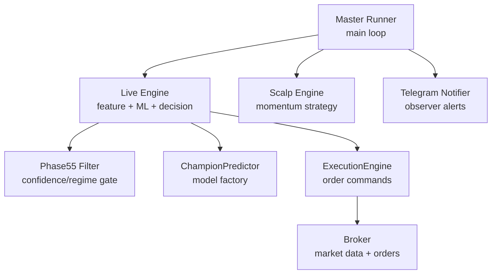
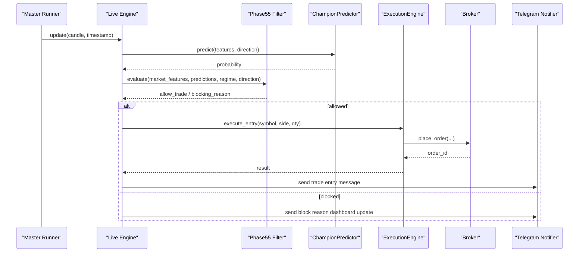
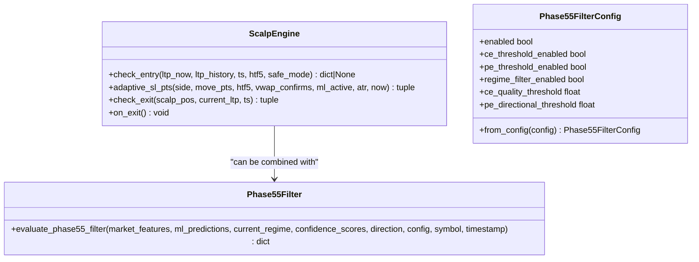
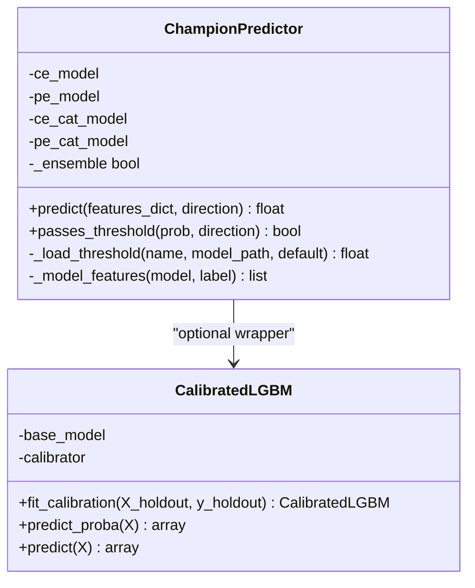
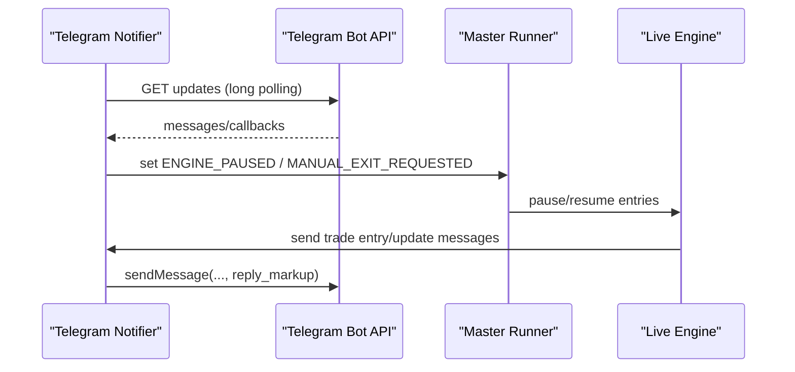
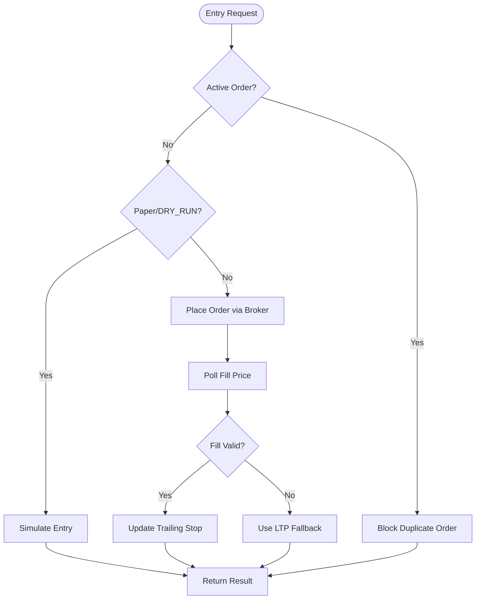
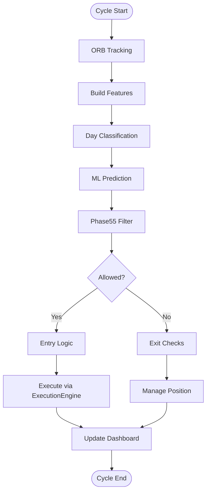
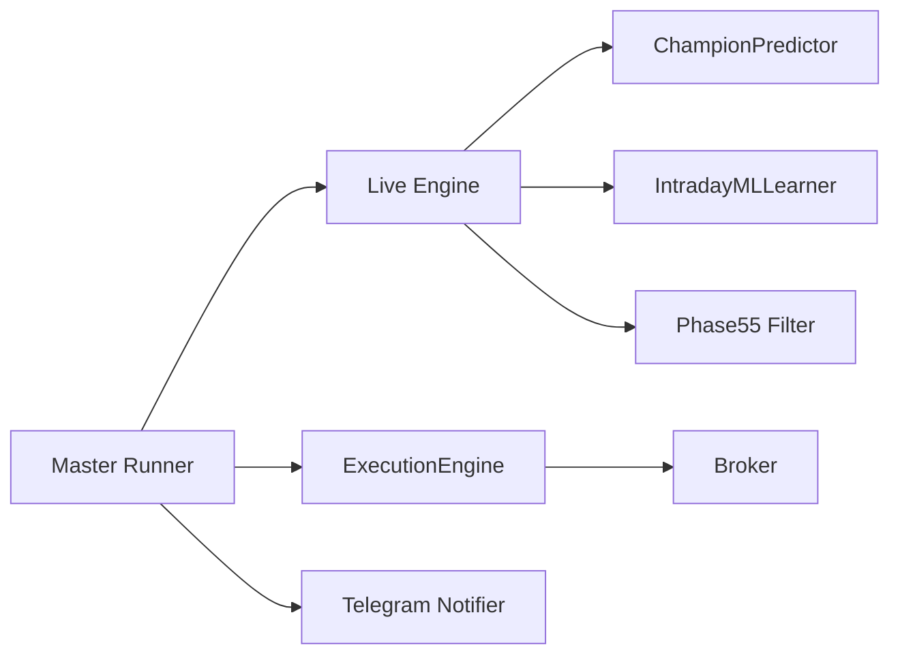

# Design Patterns

<cite>
**Referenced Files in This Document**
- [master_runner.py](file://master_runner.py)
- [engine/live_engine.py](file://engine/live_engine.py)
- [engine/scalping/scalp_engine.py](file://engine/scalping/scalp_engine.py)
- [engine/intelligence/phase55_filter.py](file://engine/intelligence/phase55_filter.py)
- [ml/predictor_champion.py](file://ml/predictor_champion.py)
- [ml/ml_intraday_learner.py](file://ml/ml_intraday_learner.py)
- [engine/execution/execution_engine.py](file://engine/execution/execution_engine.py)
- [engine/execution/broker.py](file://engine/execution/broker.py)
- [telegram/notifier.py](file://telegram/notifier.py)
</cite>

## Table of Contents
1. Introduction
2. Project Structure
3. Core Components
4. Architecture Overview
5. Detailed Component Analysis
6. Dependency Analysis
7. Performance Considerations
8. Troubleshooting Guide
9. Conclusion

## Introduction
This document explains the architectural design patterns implemented across the trading system, focusing on how strategies, models, monitoring, order execution, and standardized workflows are structured for extensibility and reliability. It covers:
- Strategy Pattern for pluggable trading strategies (scalp engine and phase55 filter)
- Factory Pattern for dynamic ML model loading (ChampionPredictor)
- Observer Pattern for monitoring and alerting (Telegram notifier and watchdog)
- Command Pattern for order execution (ExecutionEngine)
- Template Method Pattern for standardized processing workflows (LiveEngine and master loop)

The goal is to show how new strategies and models can be added without modifying existing code, and how the system coordinates signals, risk, execution, and observability.

## Project Structure
At a high level:
- Master orchestrator wires components together and runs the main loop
- Live engine builds features, classifies regime, predicts with ML, and decides entries/exits
- Scalp engine provides a momentum-based strategy that complements the ML engine
- Phase 5.5 filter gates trades based on confidence and regime
- ChampionPredictor loads LightGBM and optional CatBoost models dynamically
- ExecutionEngine encapsulates order placement and protective stops
- Broker abstracts market data and order routing
- Telegram notifier implements an observer-style alerting system

**Diagram sources**
- [master_runner.py:52-110](file://master_runner.py#L52-L110)
- [engine/live_engine.py:71-184](file://engine/live_engine.py#L71-L184)
- [engine/scalping/scalp_engine.py:11-170](file://engine/scalping/scalp_engine.py#L11-L170)
- [engine/intelligence/phase55_filter.py:96-199](file://engine/intelligence/phase55_filter.py#L96-L199)
- [ml/predictor_champion.py:57-100](file://ml/predictor_champion.py#L57-L100)
- [engine/execution/execution_engine.py:21-110](file://engine/execution/execution_engine.py#L21-L110)
- [engine/execution/broker.py:11-122](file://engine/execution/broker.py#L11-L122)
- [telegram/notifier.py:599-689](file://telegram/notifier.py#L599-L689)

**Section sources**
- [master_runner.py:52-110](file://master_runner.py#L52-L110)
- [engine/live_engine.py:71-184](file://engine/live_engine.py#L71-L184)

## Core Components
- Master Runner: Orchestrates the live loop, integrates components, handles watchdog and rate-limited alerts
- Live Engine: Builds features, applies day classification, invokes predictor and filters, manages ORB and exits
- Scalp Engine: Momentum scalper with entry confirmation, adaptive stop logic, and exit rules
- Phase 5.5 Filter: Confidence and regime-based gating for CE/PE trades
- ChampionPredictor: Loads LightGBM and optional CatBoost models; ensembles probabilities
- ExecutionEngine: Encapsulates entry/exit commands, duplicate guard, fill validation, trailing updates
- Broker: Market data feed, option chain subscriptions, order placement
- Telegram Notifier: Polls commands, sends alerts, supports manual controls

**Section sources**
- [master_runner.py:52-110](file://master_runner.py#L52-L110)
- [engine/live_engine.py:71-184](file://engine/live_engine.py#L71-L184)
- [engine/scalping/scalp_engine.py:11-280](file://engine/scalping/scalp_engine.py#L11-L280)
- [engine/intelligence/phase55_filter.py:12-199](file://engine/intelligence/phase55_filter.py#L12-L199)
- [ml/predictor_champion.py:57-218](file://ml/predictor_champion.py#L57-L218)
- [engine/execution/execution_engine.py:21-221](file://engine/execution/execution_engine.py#L21-L221)
- [engine/execution/broker.py:11-389](file://engine/execution/broker.py#L11-L389)
- [telegram/notifier.py:599-689](file://telegram/notifier.py#L599-L689)

## Architecture Overview
The system follows a layered architecture:
- Strategy layer: ScalpEngine and Phase55Filter provide pluggable strategies and filters
- Intelligence layer: LiveEngine composes feature building, ML prediction, and decision logic
- Model layer: ChampionPredictor dynamically loads and optionally ensembles models
- Execution layer: ExecutionEngine issues commands to Broker for order placement and protection
- Observability layer: Telegram Notifier observes state changes and emits alerts

**Diagram sources**
- [engine/live_engine.py:71-184](file://engine/live_engine.py#L71-L184)
- [engine/intelligence/phase55_filter.py:96-199](file://engine/intelligence/phase55_filter.py#L96-L199)
- [ml/predictor_champion.py:151-218](file://ml/predictor_champion.py#L151-L218)
- [engine/execution/execution_engine.py:94-110](file://engine/execution/execution_engine.py#L94-L110)
- [engine/execution/broker.py:346-365](file://engine/execution/broker.py#L346-L365)
- [telegram/notifier.py:599-689](file://telegram/notifier.py#L599-L689)

## Detailed Component Analysis

### Strategy Pattern: Pluggable Trading Strategies
- ScalpEngine implements a momentum strategy with strict entry confirmation, adaptive stop-loss tiers, and exit rules. It exposes methods like check_entry, adaptive_sl_pts, and check_exit, allowing it to be used independently or alongside ML-driven decisions.
- Phase55Filter provides a configurable filter that evaluates confidence thresholds and regime conditions per side (CE/PE). It returns a plain dict indicating whether to allow trade, confidence adjustment, and applied filters.

Extensibility points:
- Add new strategy modules by implementing similar interfaces (entry checks, exit logic, SL calculation) and integrating them into the master loop or LiveEngine decision flow
- Extend Phase55Filter with additional filters by adding new threshold checks and returning appropriate blocking responses

**Diagram sources**
- [engine/scalping/scalp_engine.py:11-280](file://engine/scalping/scalp_engine.py#L11-L280)
- [engine/intelligence/phase55_filter.py:12-199](file://engine/intelligence/phase55_filter.py#L12-L199)

**Section sources**
- [engine/scalping/scalp_engine.py:11-280](file://engine/scalping/scalp_engine.py#L11-L280)
- [engine/intelligence/phase55_filter.py:12-199](file://engine/intelligence/phase55_filter.py#L12-L199)

### Factory Pattern: Dynamic Model Loading in ChampionPredictor
ChampionPredictor acts as a factory for ML models:
- Always loads LightGBM models for CE and PE
- Optionally loads CatBoost models if both files exist, enabling ensemble mode
- Validates features, builds input rows, computes probabilities, and ensembles when available
- Provides threshold checking via passes_threshold

**Diagram sources**
- [ml/predictor_champion.py:18-53](file://ml/predictor_champion.py#L18-L53)
- [ml/predictor_champion.py:57-218](file://ml/predictor_champion.py#L57-L218)

**Section sources**
- [ml/predictor_champion.py:57-218](file://ml/predictor_champion.py#L57-L218)

### Observer Pattern: Monitoring and Alerting System
The Telegram Notifier implements an observer-like pattern:
- Polls for commands and events continuously
- Updates global state flags (e.g., ENGINE_PAUSED, MANUAL_EXIT_REQUESTED)
- Sends alerts and dashboards based on events from the engine
- Supports interactive buttons for manual exit and command handling

**Diagram sources**
- [telegram/notifier.py:599-689](file://telegram/notifier.py#L599-L689)
- [master_runner.py:1055-1069](file://master_runner.py#L1055-L1069)

**Section sources**
- [telegram/notifier.py:599-689](file://telegram/notifier.py#L599-L689)
- [master_runner.py:1055-1069](file://master_runner.py#L1055-L1069)

### Command Pattern: Order Execution
ExecutionEngine encapsulates order commands:
- execute_entry places BUY orders for both CE and PE (buy-to-open)
- execute_exit places SELL orders for CE and BUY orders for PE (sell-to-close), ensuring correct direction
- Includes duplicate order guard, fill price validation, and trailing stop updates
- Integrates with broker for order placement and position management

**Diagram sources**
- [engine/execution/execution_engine.py:94-110](file://engine/execution/execution_engine.py#L94-L110)
- [engine/execution/execution_engine.py:190-215](file://engine/execution/execution_engine.py#L190-L215)
- [engine/execution/broker.py:346-365](file://engine/execution/broker.py#L346-L365)

**Section sources**
- [engine/execution/execution_engine.py:21-221](file://engine/execution/execution_engine.py#L21-L221)
- [engine/execution/broker.py:346-365](file://engine/execution/broker.py#L346-L365)

### Template Method Pattern: Standardized Processing Workflows
LiveEngine defines a standardized workflow for each cycle:
- ORB tracking and warmup gating
- Feature building and day classification
- ML prediction and filtering
- Entry/exit decisions with consistent structure confirmation, pullback checks, HTF alignment, and trap detection
- Delegates specific steps to other components (predictor, filters, profit manager)

**Diagram sources**
- [engine/live_engine.py:71-184](file://engine/live_engine.py#L71-L184)
- [engine/live_engine.py:190-200](file://engine/live_engine.py#L190-L200)

**Section sources**
- [engine/live_engine.py:71-184](file://engine/live_engine.py#L71-L184)

## Dependency Analysis
Key dependencies and relationships:
- Master Runner depends on LiveEngine, ExecutionEngine, RiskManager, PortfolioAllocator, and Telegram Notifier
- LiveEngine depends on ChampionPredictor, IntradayMLLearner, indicators, and profit/risk managers
- ExecutionEngine depends on Broker for order placement and market data
- Telegram Notifier observes engine state and sends alerts

**Diagram sources**
- [master_runner.py:52-110](file://master_runner.py#L52-L110)
- [engine/live_engine.py:71-184](file://engine/live_engine.py#L71-L184)
- [engine/execution/execution_engine.py:21-110](file://engine/execution/execution_engine.py#L21-L110)
- [engine/execution/broker.py:11-122](file://engine/execution/broker.py#L11-L122)
- [engine/intelligence/phase55_filter.py:96-199](file://engine/intelligence/phase55_filter.py#L96-L199)

**Section sources**
- [master_runner.py:52-110](file://master_runner.py#L52-L110)
- [engine/live_engine.py:71-184](file://engine/live_engine.py#L71-L184)
- [engine/execution/execution_engine.py:21-110](file://engine/execution/execution_engine.py#L21-L110)
- [engine/execution/broker.py:11-122](file://engine/execution/broker.py#L11-L122)
- [engine/intelligence/phase55_filter.py:96-199](file://engine/intelligence/phase55_filter.py#L96-L199)

## Performance Considerations
- Model ensemble adds latency but improves robustness when CatBoost is available
- Feature validation and missing feature checks prevent costly errors during prediction
- ATR-adaptive stop-loss reduces overexposure in volatile conditions
- Duplicate order guards and fill validation reduce redundant operations and improve reliability
- Rate limiting in Telegram notifications prevents bans and ensures timely alerts

[No sources needed since this section provides general guidance]

## Troubleshooting Guide
Common issues and resolutions:
- Missing model files: ChampionPredictor raises FileNotFoundError; ensure model paths exist
- Stale feed: Watchdog detects stale ticks and attempts reconnection; verify broker start_feed tokens
- Telegram alerts failing: Check environment variables for token and chat ID; ensure network connectivity
- Order placement failures: ExecutionEngine logs errors and uses fallback prices; verify broker instrument map and symbols

**Section sources**
- [ml/predictor_champion.py:62-70](file://ml/predictor_champion.py#L62-L70)
- [engine/execution/execution_engine.py:190-215](file://engine/execution/execution_engine.py#L190-L215)
- [engine/execution/broker.py:59-122](file://engine/execution/broker.py#L59-L122)
- [master_runner.py:1055-1069](file://master_runner.py#L1055-L1069)

## Conclusion
The trading system employs well-established design patterns to achieve modularity, extensibility, and reliability:
- Strategy Pattern enables pluggable strategies like scalp engine and phase55 filter
- Factory Pattern dynamically loads ML models and supports ensemble modes
- Observer Pattern provides robust monitoring and alerting through Telegram
- Command Pattern encapsulates order execution with safeguards
- Template Method Pattern standardizes processing workflows in LiveEngine

These patterns allow new strategies and models to be integrated without modifying existing code, while maintaining clear separation of concerns and robust error handling.

[No sources needed since this section summarizes without analyzing specific files]