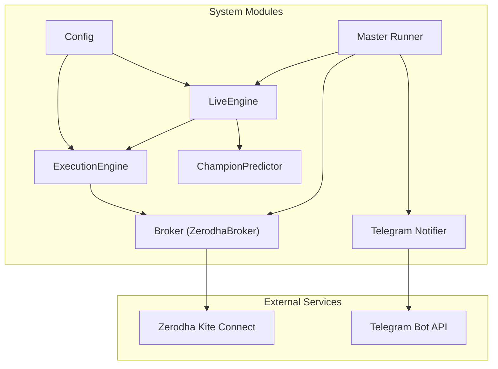
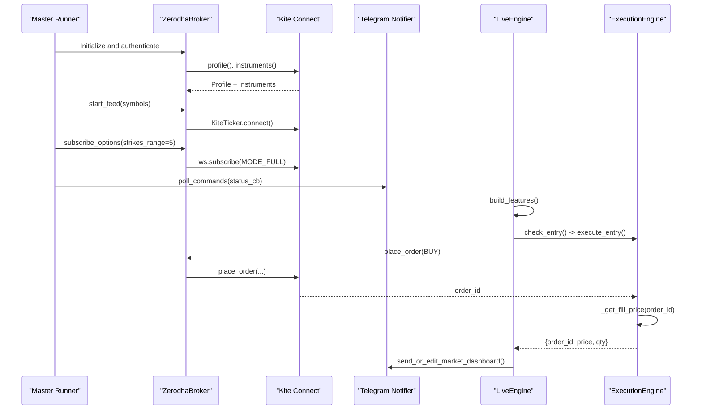
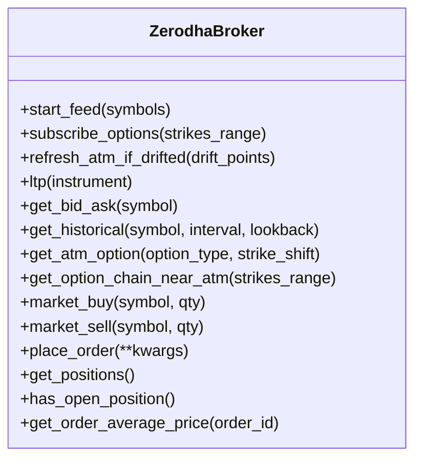
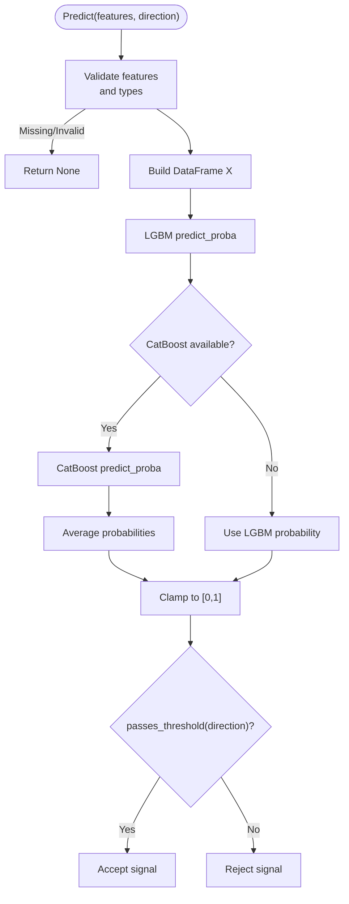
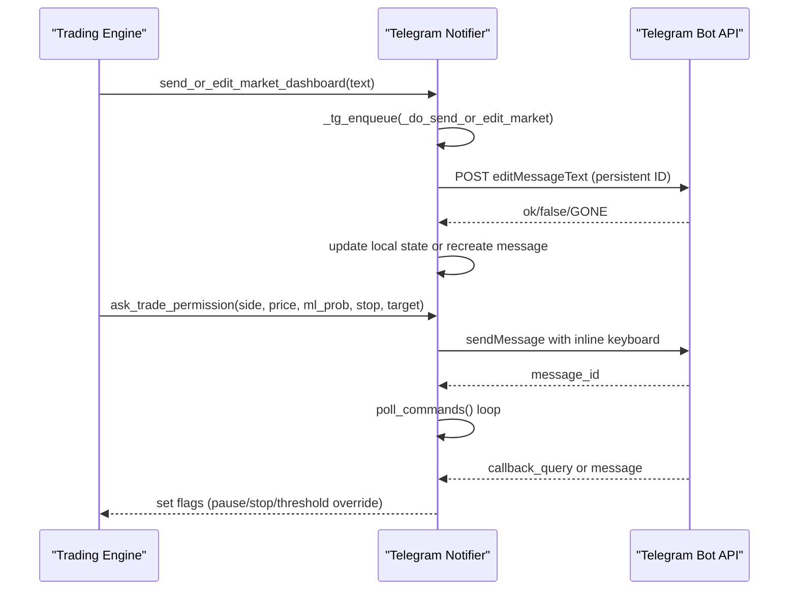
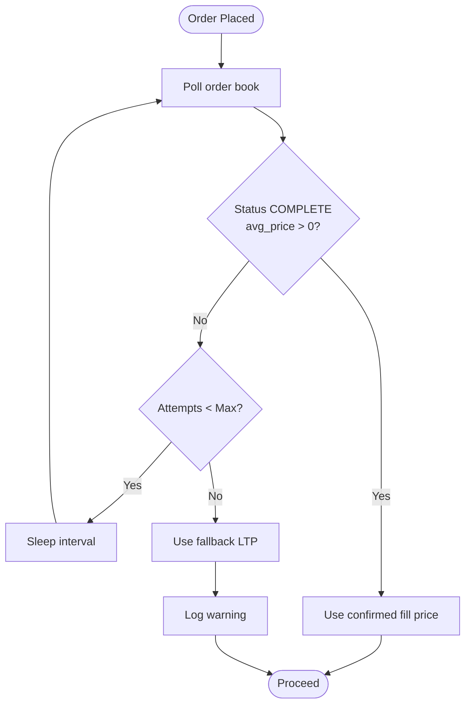
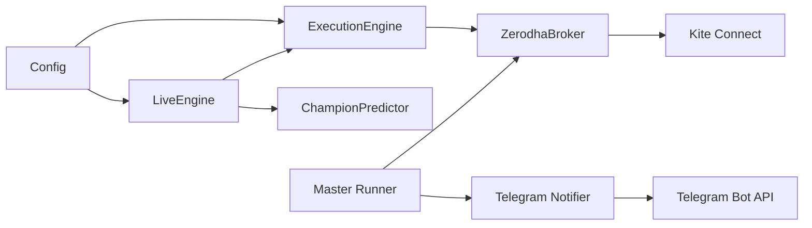

# Integration Points

<cite>
**Referenced Files in This Document**
- [broker.py](file://engine/execution/broker.py)
- [login.py](file://login.py)
- [notifier.py](file://telegram/notifier.py)
- [predictor_champion.py](file://ml/predictor_champion.py)
- [config.py](file://engine/config/config.py)
- [live_engine.py](file://engine/live_engine.py)
- [execution_engine.py](file://engine/execution/execution_engine.py)
- [master_runner.py](file://master_runner.py)
</cite>

## Table of Contents
1. Introduction
2. Project Structure
3. Core Components
4. Architecture Overview
5. Detailed Component Analysis
6. Dependency Analysis
7. Performance Considerations
8. Troubleshooting Guide
9. Conclusion
10. Appendices

## Introduction
This document explains how the trading system integrates with external services: Zerodha broker (authentication, market data streaming, and order execution), machine learning model serving (champion models loading, calibration, and deployment), Telegram notifications (real-time alerts and status updates), and configuration management for environment variables and parameter tuning. It also covers connection pooling, retry strategies, error handling patterns, and guidance to extend the system with new brokers or notification channels.

## Project Structure
The integration surface spans several modules:
- Broker integration: authentication via Selenium-based login and token refresh; live WebSocket feed; REST calls for instruments, LTP, historical data, and orders.
- ML serving: champion model loader, optional ensemble with CatBoost, threshold management, and feature validation.
- Notifications: persistent dashboards, trade entry messages, command polling, and fallback logging.
- Configuration: environment-driven parameters controlling risk, execution, ML thresholds, and scalping behavior.
- Orchestration: master runner wires broker initialization, option chain subscriptions, historical warm-up, and health reporting.

**Diagram sources**
- [broker.py:11-122](file://engine/execution/broker.py#L11-L122)
- [execution_engine.py:21-154](file://engine/execution/execution_engine.py#L21-L154)
- [predictor_champion.py:57-100](file://ml/predictor_champion.py#L57-L100)
- [notifier.py:82-90](file://telegram/notifier.py#L82-L90)
- [config.py:4-164](file://engine/config/config.py#L4-L164)
- [live_engine.py:71-184](file://engine/live_engine.py#L71-L184)
- [master_runner.py:691-719](file://master_runner.py#L691-L719)

**Section sources**
- [broker.py:11-122](file://engine/execution/broker.py#L11-L122)
- [execution_engine.py:21-154](file://engine/execution/execution_engine.py#L21-L154)
- [predictor_champion.py:57-100](file://ml/predictor_champion.py#L57-L100)
- [notifier.py:82-90](file://telegram/notifier.py#L82-L90)
- [config.py:4-164](file://engine/config/config.py#L4-L164)
- [live_engine.py:71-184](file://engine/live_engine.py#L71-L184)
- [master_runner.py:691-719](file://master_runner.py#L691-L719)

## Core Components
- ZerodhaBroker: encapsulates REST and WebSocket interactions with Kite Connect, including instrument loading, ATM option subscription, LTP retrieval, historical data, and order placement.
- ExecutionEngine: orchestrates entry/exit orders, validates fills by polling the order book, and enforces duplicate-order guards.
- ChampionPredictor: loads LightGBM and optional CatBoost champion models, applies Platt scaling calibration wrapper, validates features, and computes probabilities with thresholds.
- Telegram Notifier: manages persistent dashboards, trade messages, command polling, and a pooled HTTP session with fail-fast retries and proxy support.
- Config: centralizes environment-driven settings for capital, risk, execution rules, ML thresholds, and scalping controls.
- LiveEngine: decision engine that builds features, runs day classification, and coordinates signals with execution and exits.
- Master Runner: initializes broker, subscribes to options, warms up historical data, and reports health.

**Section sources**
- [broker.py:11-389](file://engine/execution/broker.py#L11-L389)
- [execution_engine.py:21-221](file://engine/execution/execution_engine.py#L21-L221)
- [predictor_champion.py:18-218](file://ml/predictor_champion.py#L18-L218)
- [notifier.py:1-753](file://telegram/notifier.py#L1-L753)
- [config.py:4-164](file://engine/config/config.py#L4-L164)
- [live_engine.py:71-800](file://engine/live_engine.py#L71-L800)
- [master_runner.py:691-719](file://master_runner.py#L691-L719)

## Architecture Overview
The system composes multiple integrations:
- Authentication and session: login flow obtains an access token and persists it to .env; broker uses it to authenticate REST and WebSocket sessions.
- Market data: WebSocket ticks are buffered; option-chain subscriptions provide OI and LTP for ATM and nearby strikes; REST is used for historical data and quotes when needed.
- Decisioning: LiveEngine builds features, classifies regime, and decides entries/exits using ML probabilities and technical filters.
- Execution: ExecutionEngine places orders via broker, polls for fill confirmation, and manages exits with protective stops.
- Notifications: Telegram notifier posts persistent dashboards and trade updates, polls commands, and supports overrides for thresholds and control flags.
- Configuration: All runtime knobs are loaded from environment variables at startup.

**Diagram sources**
- [master_runner.py:691-719](file://master_runner.py#L691-L719)
- [broker.py:11-122](file://engine/execution/broker.py#L11-L122)
- [execution_engine.py:94-154](file://engine/execution/execution_engine.py#L94-L154)
- [notifier.py:321-378](file://telegram/notifier.py#L321-L378)

## Detailed Component Analysis

### Zerodha Broker Integration
Authentication, market data streaming, and order execution are implemented in the broker module.

- Authentication:
  - The broker reads API key and access token from environment variables and authenticates via KiteConnect.
  - A separate login utility automates browser-based login, OTP handling, token exchange, and writes the access token back to .env for persistence.

- Market Data Streaming:
  - WebSocket ticker connects and subscribes to symbols; on connect, it re-subscribes to option tokens if present.
  - Option-chain subscriptions compute ATM from spot price and subscribe CE/PE options around ATM with MODE_FULL for OI.
  - Tick handler preserves OI across mixed QUOTE/FULL packets and tracks last tick time for watchdogs.

- Orders and Positions:
  - Market buy/sell helpers wrap KiteConnect order placement for NFO instruments.
  - Generic place_order forwards kwargs to KiteConnect.
  - Position queries and average price retrieval are wrapped with exception handling.

**Diagram sources**
- [broker.py:11-389](file://engine/execution/broker.py#L11-L389)

**Section sources**
- [broker.py:11-122](file://engine/execution/broker.py#L11-L122)
- [broker.py:126-250](file://engine/execution/broker.py#L126-L250)
- [broker.py:254-389](file://engine/execution/broker.py#L254-L389)
- [login.py:147-243](file://login.py#L147-L243)

### Machine Learning Model Integration
Champion models are loaded, calibrated, and deployed for production use.

- Model Loading:
  - LightGBM models for CE and PE are required; optional CatBoost models enable ensemble averaging.
  - Thresholds are loaded from companion files or default values.

- Calibration:
  - CalibratedLGBM wraps base models with Platt scaling using LogisticRegression on holdout raw probabilities.
  - Feature names are inferred from model attributes; missing features cause prediction to be rejected safely.

- Prediction Flow:
  - Input validation ensures all required features exist and are finite.
  - Ensemble mode averages LGBM and CatBoost probabilities; otherwise uses LGBM only.
  - Threshold checks determine pass/fail for signal acceptance.

**Diagram sources**
- [predictor_champion.py:18-53](file://ml/predictor_champion.py#L18-L53)
- [predictor_champion.py:57-100](file://ml/predictor_champion.py#L57-L100)
- [predictor_champion.py:151-218](file://ml/predictor_champion.py#L151-L218)

**Section sources**
- [predictor_champion.py:18-53](file://ml/predictor_champion.py#L18-L53)
- [predictor_champion.py:57-100](file://ml/predictor_champion.py#L57-L100)
- [predictor_champion.py:151-218](file://ml/predictor_champion.py#L151-L218)

### Telegram Notification System
Real-time alerts and status updates are delivered via Telegram with robust networking and state persistence.

- Persistent Dashboards:
  - Two edit-in-place messages: “AI ENGINE” and “LIVE STATUS”. Message IDs are persisted to a JSON file to survive restarts.
  - If edits fail due to message deletion, the system recreates fresh messages.

- Trade Messages:
  - Entry messages include inline “EXIT NOW” buttons; live updates preserve markup until exit or freeze.

- Command Polling:
  - Background thread polls updates with exponential backoff on failures.
  - Commands include pause/resume/stop, threshold overrides (/ce, /pe), dashboard reset, and help/status.

- Networking:
  - Shared requests.Session with connection pooling and zero retries to avoid blocking the queue.
  - Optional proxy support via TELEGRAM_PROXY; trust_env disabled to prevent unintended system proxies.

**Diagram sources**
- [notifier.py:321-378](file://telegram/notifier.py#L321-L378)
- [notifier.py:419-479](file://telegram/notifier.py#L419-L479)
- [notifier.py:544-705](file://telegram/notifier.py#L544-L705)
- [notifier.py:82-90](file://telegram/notifier.py#L82-L90)

**Section sources**
- [notifier.py:1-753](file://telegram/notifier.py#L1-L753)

### Configuration Management
Environment variables drive system behavior across risk, execution, ML thresholds, and scalping controls.

- Modes and Risk:
  - PAPER_MODE, DRY_RUN, INITIAL_CAPITAL, RISK_PER_TRADE, DAILY_LOSS_LIMIT, MAX_TRADES_PER_DAY.

- Execution Rules:
  - DEFAULT_SL_PCT, DEFAULT_TARGET_PCT, MAX_HOLD_SECONDS, LOT_SIZE, REENTRY_COOLDOWN, SAME_SYMBOL_COOLDOWN.

- ML and Filters:
  - CHAMPION_THRESHOLD, WARMUP_MINUTES, SKIP_RANGE_REGIME, REQUIRE_VWAP_ALIGN, REQUIRE_5M_TREND, MICRO_TREND_CANDLES, SPREAD_THRESHOLD_PTS, SLIPPAGE_THRESHOLD_PTS.

- Scalping Controls:
  - SCALP_ENABLED, SL tiers, ATR multipliers, open volatility window, momentum thresholds, cooldowns, max trades per day, consecutive loss circuit breaker.

- Usage:
  - Set environment variables before running; the Config class reads them at startup and exposes typed attributes to other modules.

**Section sources**
- [config.py:4-164](file://engine/config/config.py#L4-L164)

### Connection Pooling, Retry Mechanisms, and Error Handling
Robustness patterns are applied across integrations:

- Telegram HTTP:
  - Single shared Session with HTTPAdapter pool_connections=5, pool_maxsize=10.
  - Zero retries configured to fail fast; higher-level logic handles retries or next-cycle resends.
  - Proxy support via TELEGRAM_PROXY; trust_env disabled to avoid system proxy interference.

- Order Fill Validation:
  - ExecutionEngine polls the order book up to a fixed number of attempts with short intervals to confirm fill prices.
  - Fallback to last LTP if confirmation fails; logs warnings and continues safely.

- Broker WebSocket:
  - Re-subscription on reconnect restores option-chain subscriptions automatically.
  - Graceful handling of close/error events; OI preservation across mixed packet modes.

- Historical Data and REST Calls:
  - Wrapped in try/except blocks; failures log warnings and return safe defaults (empty lists or None).

**Diagram sources**
- [execution_engine.py:52-88](file://engine/execution/execution_engine.py#L52-L88)
- [execution_engine.py:94-154](file://engine/execution/execution_engine.py#L94-L154)
- [notifier.py:82-90](file://telegram/notifier.py#L82-L90)
- [broker.py:93-122](file://engine/execution/broker.py#L93-L122)

**Section sources**
- [execution_engine.py:52-88](file://engine/execution/execution_engine.py#L52-L88)
- [execution_engine.py:94-154](file://engine/execution/execution_engine.py#L94-L154)
- [notifier.py:82-90](file://telegram/notifier.py#L82-L90)
- [broker.py:93-122](file://engine/execution/broker.py#L93-L122)

## Dependency Analysis
Key dependencies and coupling:
- Master Runner depends on Broker initialization, option subscription, and historical data updates.
- LiveEngine depends on Predictor, Learner, indicators, and Profit Manager; it coordinates with ExecutionEngine for trades.
- ExecutionEngine depends on Broker for order placement and LTP; it implements fill validation and duplicate order guards.
- Telegram Notifier is decoupled via background queue; it exposes global flags for engine control and threshold overrides.
- Config is consumed by LiveEngine and ExecutionEngine to enforce risk and execution policies.

**Diagram sources**
- [master_runner.py:691-719](file://master_runner.py#L691-L719)
- [live_engine.py:71-184](file://engine/live_engine.py#L71-L184)
- [execution_engine.py:21-154](file://engine/execution/execution_engine.py#L21-L154)
- [broker.py:11-122](file://engine/execution/broker.py#L11-L122)
- [notifier.py:321-378](file://telegram/notifier.py#L321-L378)
- [config.py:4-164](file://engine/config/config.py#L4-L164)

**Section sources**
- [master_runner.py:691-719](file://master_runner.py#L691-L719)
- [live_engine.py:71-184](file://engine/live_engine.py#L71-L184)
- [execution_engine.py:21-154](file://engine/execution/execution_engine.py#L21-L154)
- [broker.py:11-122](file://engine/execution/broker.py#L11-L122)
- [notifier.py:321-378](file://telegram/notifier.py#L321-L378)
- [config.py:4-164](file://engine/config/config.py#L4-L164)

## Performance Considerations
- WebSocket efficiency:
  - Use MODE_QUOTE for indices and MODE_FULL for options to balance bandwidth and OI availability.
  - Preserve OI across mixed packet modes to avoid unnecessary resets.

- HTTP pooling:
  - Telegram notifier uses a pooled session with limited retries to prevent stalls; this keeps dashboard updates responsive.

- Fill polling:
  - Short intervals and bounded attempts minimize latency while ensuring reliable fill confirmation.

- Feature computation:
  - Deduplicate per-minute operations to avoid redundant indicator recalculations and learner updates.

[No sources needed since this section provides general guidance]

## Troubleshooting Guide
Common issues and resolutions:
- Missing credentials:
  - Ensure KITE_API_KEY and KITE_ACCESS_TOKEN are set; login utility can refresh tokens if needed.

- WebSocket not receiving ticks:
  - Verify market hours; outside trading hours, no live ticks are expected.
  - Check option subscription success and ATM drift handling.

- Telegram connectivity:
  - If blocked, configure TELEGRAM_PROXY; verify BOT_TOKEN, BOT_CHAT_ID, CHANNEL_ID, and AUTHORIZED_USER_ID.
  - Persistent message IDs may become invalid; system recreates messages automatically.

- Order fill delays:
  - ExecutionEngine will fall back to LTP after max attempts; review logs for order status and broker errors.

- ML predictions returning None:
  - Inspect feature completeness and validity; ensure feature_config columns match model expectations.

**Section sources**
- [broker.py:11-122](file://engine/execution/broker.py#L11-L122)
- [notifier.py:38-63](file://telegram/notifier.py#L38-L63)
- [notifier.py:227-305](file://telegram/notifier.py#L227-L305)
- [execution_engine.py:52-88](file://engine/execution/execution_engine.py#L52-L88)
- [predictor_champion.py:151-218](file://ml/predictor_champion.py#L151-L218)

## Conclusion
The system integrates tightly with Zerodha for authentication, streaming, and execution; serves ML champion models with calibration and robust feature validation; delivers real-time Telegram notifications with resilient networking; and centralizes configuration through environment variables. Robust error handling, connection pooling, and retry strategies ensure stability under production conditions. Extensibility points exist for adding new brokers and notification channels by following established interfaces and patterns.

[No sources needed since this section summarizes without analyzing specific files]

## Appendices

### Extending with New Brokers
To add a new broker:
- Implement a broker interface mirroring ZerodhaBroker methods: start_feed, ltp, get_bid_ask, get_historical, place_order, get_positions, has_open_position, get_order_average_price.
- Integrate WebSocket subscription and REST calls consistent with the existing broker abstraction.
- Wire into Master Runner initialization and option subscription flows if applicable.

**Section sources**
- [broker.py:11-389](file://engine/execution/broker.py#L11-L389)
- [master_runner.py:691-719](file://master_runner.py#L691-L719)

### Extending with New Notification Channels
To add a new notification channel:
- Create a notifier module with similar capabilities: persistent state, queued background worker, pooled HTTP session, and fallback logging.
- Expose functions to send messages, update dashboards, and poll commands.
- Integrate with Master Runner and LiveEngine to post status and trade updates.

**Section sources**
- [notifier.py:82-90](file://telegram/notifier.py#L82-L90)
- [notifier.py:321-378](file://telegram/notifier.py#L321-L378)
- [notifier.py:544-705](file://telegram/notifier.py#L544-L705)