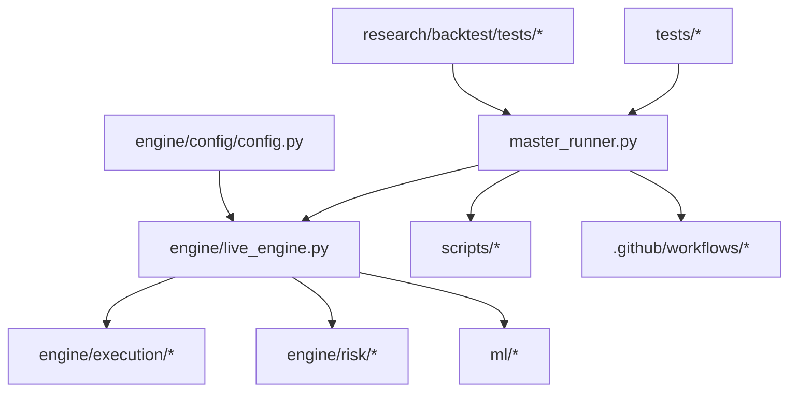
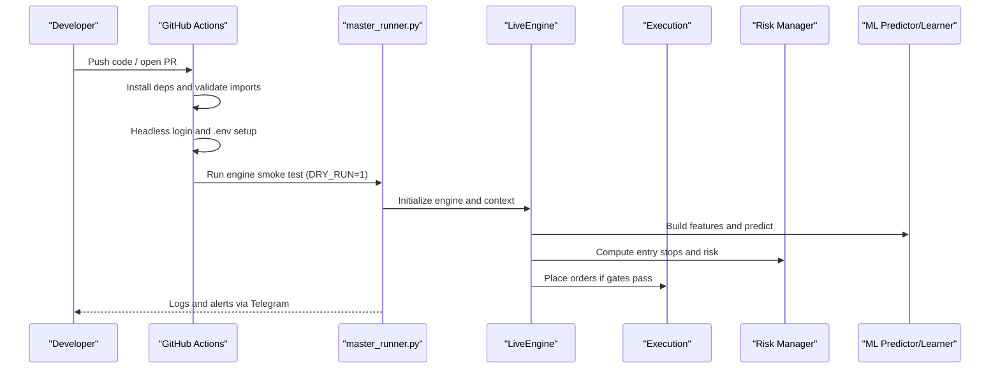
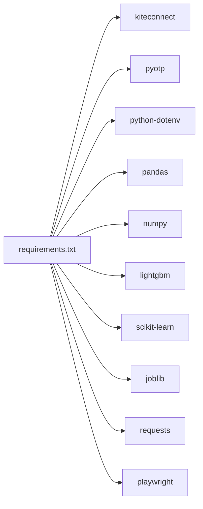

# Contribution Guidelines

<cite>
**Referenced Files in This Document**
- [requirements.txt](file://requirements.txt)
- [login.py](file://login.py)
- [SESSION_HANDOFF.md](file://SESSION_HANDOFF.md)
- [trading_test.yml](file://.github/workflows/trading_test.yml)
- [research-tests.yml](file://.github/workflows/research-tests.yml)
- [live_engine.py](file://engine/live_engine.py)
- [config.py](file://engine/config/config.py)
- [test_entry_confirmation.py](file://tests/test_entry_confirmation.py)
- [monitor_session.py](file://scripts/monitor_session.py)
- [master_runner.py](file://master_runner.py)
- [profit_manager.py](file://engine/execution/profit_manager.py)
</cite>

## Table of Contents
1. Introduction
2. Project Structure
3. Core Components
4. Architecture Overview
5. Detailed Component Analysis
6. Dependency Analysis
7. Performance Considerations
8. Troubleshooting Guide
9. Conclusion
10. Appendices

## Introduction
This document defines the contribution workflow, coding standards, testing requirements, CI/CD pipeline, and deployment procedures for the trading system. It is intended for developers adding strategies, indicators, risk rules, or ML models while preserving production safety, backward compatibility, and performance.

## Project Structure
The repository is organized by responsibility:
- Engine and execution: engine/ (live engine, execution, risk, portfolio, analytics, diagnostics)
- Machine learning: ml/ (features, training, prediction, indicators)
- Research and backtesting: research/, backtest/
- Operations and scripts: scripts/, login.py, master_runner.py
- Tests: tests/, research/backtest/tests/
- CI/CD: .github/workflows/
- Configuration and environment: engine/config/config.py, requirements.txt, .env at runtime

**Diagram sources**
- [master_runner.py:2422-2444](file://master_runner.py#L2422-L2444)
- [live_engine.py:71-184](file://engine/live_engine.py#L71-L184)
- [config.py:4-164](file://engine/config/config.py#L4-L164)
- [trading_test.yml:1-178](file://.github/workflows/trading_test.yml#L1-L178)
- [research-tests.yml:1-33](file://.github/workflows/research-tests.yml#L1-L33)

**Section sources**
- [master_runner.py:2422-2444](file://master_runner.py#L2422-L2444)
- [live_engine.py:71-184](file://engine/live_engine.py#L71-L184)
- [config.py:4-164](file://engine/config/config.py#L4-L164)
- [trading_test.yml:1-178](file://.github/workflows/trading_test.yml#L1-L178)
- [research-tests.yml:1-33](file://.github/workflows/research-tests.yml#L1-L33)

## Core Components
- Live decision engine: orchestrates ORB tracking, feature building, ML predictions, exits, and session filters.
- Execution layer: broker integration, cost modeling, profit management, and order filters.
- Risk manager: entry stops and position sizing controls.
- ML subsystem: feature configuration, predictor champion, intraday learner, and indicators.
- Configuration: environment-driven parameters controlling modes, risk, thresholds, and scalping behavior.
- Master runner and watchdog: process supervision, recovery, and health reporting.
- CI/CD: automated import validation, headless login smoke test, and engine startup checks.

Key responsibilities and interactions are enforced through environment variables and explicit gates to ensure safe operation in dry-run and live modes.

**Section sources**
- [live_engine.py:71-184](file://engine/live_engine.py#L71-L184)
- [profit_manager.py:63-95](file://engine/execution/profit_manager.py#L63-L95)
- [config.py:4-164](file://engine/config/config.py#L4-L164)
- [master_runner.py:2422-2444](file://master_runner.py#L2422-L2444)

## Architecture Overview
The system runs a supervised loop that initializes the broker, builds features, evaluates ML signals, applies risk and confirmation gates, and executes orders with profit management. A watchdog monitors liveness and can restart the engine safely.

**Diagram sources**
- [trading_test.yml:22-167](file://.github/workflows/trading_test.yml#L22-L167)
- [master_runner.py:2422-2444](file://master_runner.py#L2422-L2444)
- [live_engine.py:71-184](file://engine/live_engine.py#L71-L184)

## Detailed Component Analysis

### Development Workflow and Quality Gates
- Local development
  - Ensure dependencies are installed from requirements.
  - Validate imports and environment variables before running.
  - Use DRY_RUN and PAPER_MODE for safe experimentation.
- Pull requests
  - Changes to research/utils/scripts trigger parity and smoke tests.
  - All changes must pass import validation and unit tests.
- Pre-merge checks
  - Import validation step ensures all required packages resolve.
  - Headless login step writes a valid access token into .env.
  - Engine smoke test runs master_runner briefly and asserts startup logs.
- Post-merge
  - Morning and afternoon workflows can be scheduled to run end-to-end checks during market hours.

Quality gates summary:
- Import validation
- Environment readiness (secrets mapped to .env)
- Headless login success
- Engine smoke test assertions
- Unit tests for entry confirmation and research parity

**Section sources**
- [requirements.txt:1-11](file://requirements.txt#L1-L11)
- [trading_test.yml:22-167](file://.github/workflows/trading_test.yml#L22-L167)
- [research-tests.yml:1-33](file://.github/workflows/research-tests.yml#L1-L33)

### Coding Standards and Conventions
- Naming
  - Modules and classes use snake_case and PascalCase respectively.
  - Constants and configuration keys are UPPER_SNAKE_CASE and sourced from environment variables.
- File organization
  - Feature-specific logic under engine/<feature>/; ML under ml/; research under research/.
  - Keep shared utilities in utils/ and scripts for operational tasks.
- Documentation
  - Add module-level docstrings describing purpose, inputs, outputs, and side effects.
  - Maintain READMEs in new directories to explain structure and usage.
- Configuration
  - Expose tunables via environment variables with sensible defaults in Config.
  - Avoid hardcoding strategy parameters; prefer config-driven values.
- Logging and observability
  - Use structured logging and emit actionable messages for entries, exits, blocks, errors, and recovery events.
  - Integrate with session monitoring to capture notable events.

**Section sources**
- [config.py:4-164](file://engine/config/config.py#L4-L164)
- [monitor_session.py:25-31](file://scripts/monitor_session.py#L25-L31)
- [trading_brain/README.md:1-13](file://trading_brain/README.md#L1-L13)

### Testing Requirements
- Unit tests
  - Entry confirmation gates must be covered with synthetic histories asserting block/confirm decisions.
  - Scalp engine behaviors (adaptive SL, no-life exit, exhaustion filter) require explicit tests.
- Parity and regression
  - Research parity tests ensure consistency across data and engine changes.
- Smoke tests
  - CI performs a short-lived engine run in TEST_MODE with DRY_RUN enabled and validates startup logs.
- Data hygiene
  - Historical data cleaning and golden trade checks should be included when modifying data pipelines.

Test coverage expectations:
- Entry confirmation logic (structure, pullback, momentum, HTF, trap)
- Scalp engine edge cases (exhaustion, sparse windows, no-life exit)
- Research parity and invariant tests

**Section sources**
- [test_entry_confirmation.py:1-389](file://tests/test_entry_confirmation.py#L1-L389)
- [research-tests.yml:24-33](file://.github/workflows/research-tests.yml#L24-L33)
- [trading_test.yml:130-167](file://.github/workflows/trading_test.yml#L130-L167)

### Adding New Features
- Trading strategies
  - Implement strategy logic under engine/ with clear interfaces to LiveEngine.
  - Gate entries using existing confirmation framework; avoid bypassing risk and ML checks.
  - Provide unit tests covering edge cases and failure modes.
- Technical indicators
  - Place indicator implementations under ml/indicators or engine/analytics.
  - Ensure numerical stability and consistent units; add tests for known regimes.
- Risk management rules
  - Introduce rules via Config and enforce in LiveEngine and execution layers.
  - Document rationale and include tests demonstrating guard behavior.
- ML models
  - Train and persist models under ml/models; maintain feature alignment with ml/feature_config.
  - Validate model outputs against thresholds and fallbacks; include retraining notes and backups.

Backward compatibility:
- Preserve existing environment variable names and defaults.
- Introduce new flags with conservative defaults; do not change behavior without migration notes.

**Section sources**
- [live_engine.py:71-184](file://engine/live_engine.py#L71-L184)
- [config.py:4-164](file://engine/config/config.py#L4-L164)
- [SESSION_HANDOFF.md:15-25](file://SESSION_HANDOFF.md#L15-L25)

### Production Readiness Criteria
- Dry-run first: All new features must run successfully in DRY_RUN and PAPER_MODE.
- Session handoff: Follow documented procedure to refresh tokens and start the runner safely.
- Monitoring: Ensure logs contain expected markers for startup, subscriptions, and trades.
- Recovery: Watchdog must detect failures and attempt safe restarts within limits.
- Alerts: Telegram notifications for critical events must function in CI and local runs.

Operational checklist:
- Verify token refresh via login flow.
- Confirm feed subscription and spot prices.
- Validate zero errors and healthy watchdog.
- Monitor trade lifecycle and block reasons.

**Section sources**
- [SESSION_HANDOFF.md:5-13](file://SESSION_HANDOFF.md#L5-L13)
- [master_runner.py:326-370](file://master_runner.py#L326-L370)
- [trading_test.yml:105-167](file://.github/workflows/trading_test.yml#L105-L167)

### Security Considerations
- Secrets management
  - Store credentials in GitHub Secrets; CI writes them to .env at runtime only.
  - Never commit secrets or tokens to the repository.
- Token handling
  - Access tokens expire daily; automate refresh via login flow and update .env securely.
- Least privilege
  - Limit API scopes and restrict bot permissions to necessary channels.
- Input validation
  - Validate environment variables on startup; fail fast if missing.

Security best practices:
- Rotate secrets regularly.
- Audit .env contents and log redaction.
- Restrict CI runners and artifacts.

**Section sources**
- [trading_test.yml:62-103](file://.github/workflows/trading_test.yml#L62-L103)
- [login.py:21-50](file://login.py#L21-L50)
- [login.py:104-143](file://login.py#L104-L143)

### Performance Considerations
- Feature computation
  - Build features efficiently per candle; avoid redundant calculations.
- ML inference
  - Use cached predictors and batched updates where possible.
- Execution latency
  - Minimize network calls; coalesce requests and handle retries gracefully.
- Resource usage
  - Cap memory usage for historical data windows; prune old buffers.
- Observability
  - Log key metrics (subscription counts, LTPs, slippage) to diagnose bottlenecks.

[No sources needed since this section provides general guidance]

## Dependency Analysis
External dependencies are declared in requirements and validated in CI. The engine depends on broker SDK, ML libraries, and utilities for automation and messaging.

**Diagram sources**
- [requirements.txt:1-11](file://requirements.txt#L1-L11)

**Section sources**
- [requirements.txt:1-11](file://requirements.txt#L1-L11)
- [trading_test.yml:27-60](file://.github/workflows/trading_test.yml#L27-L60)

## Performance Considerations
- Prefer streaming updates over polling where feasible.
- Use efficient data structures for rolling windows and deduplication.
- Profile hot paths in feature building and ML prediction.
- Tune thresholds and cooldowns via Config to balance signal quality and throughput.

[No sources needed since this section provides general guidance]

## Troubleshooting Guide
Common issues and resolutions:
- Missing environment variables
  - Ensure all required keys exist in .env; CI will fail early if secrets are absent.
- Login failures
  - Re-run login flow to refresh tokens; verify TOTP and browser dependencies.
- Engine startup errors
  - Check logs for import/auth errors; confirm broker initialization and feed health.
- Watchdog restarts
  - Investigate repeated restarts; review guard conditions and external dependencies.
- Session monitoring
  - Use monitor script to tail notable events and reduce noise.

Operational tips:
- Start in DRY_RUN mode and verify zero errors before enabling live trading.
- Keep logs rotated and archived for post-mortem analysis.
- Use Telegram alerts to surface critical events quickly.

**Section sources**
- [trading_test.yml:62-103](file://.github/workflows/trading_test.yml#L62-L103)
- [login.py:147-204](file://login.py#L147-L204)
- [master_runner.py:326-370](file://master_runner.py#L326-L370)
- [monitor_session.py:25-31](file://scripts/monitor_session.py#L25-L31)

## Conclusion
Follow this guide to contribute safely and effectively. Adhere to the established workflow, maintain backward compatibility, and ensure robust testing and observability. Use CI/CD as your quality gate and rely on configuration-driven behavior to keep the system adaptable and production-ready.

[No sources needed since this section summarizes without analyzing specific files]

## Appendices

### Appendix A: CI/CD Pipeline Reference
- Manual full pipeline
  - Triggers on demand; installs dependencies, validates imports, sets up .env from secrets, performs headless login, runs engine smoke test, and verifies startup logs.
- Research tests
  - Runs on PRs touching research/utils/scripts; executes parity tests and obsidian logger smoke test.

**Section sources**
- [trading_test.yml:1-178](file://.github/workflows/trading_test.yml#L1-L178)
- [research-tests.yml:1-33](file://.github/workflows/research-tests.yml#L1-L33)

### Appendix B: Session Handoff and Deployment
- Daily token refresh
  - Tokens expire daily; use login flow to update .env before starting the runner.
- Safe start procedure
  - Kill stale processes, verify token, start master runner, and monitor logs for expected markers.
- Safety mode
  - Default to DRY_RUN until explicitly instructed otherwise.

**Section sources**
- [SESSION_HANDOFF.md:5-13](file://SESSION_HANDOFF.md#L5-L13)
- [SESSION_HANDOFF.md:15-25](file://SESSION_HANDOFF.md#L15-L25)

### Appendix C: Templates

- Pull Request Template
  - Title: Brief description
  - Type: Feature / Bugfix / Refactor / Docs
  - Related Issue: Link
  - Changes: Summary of modifications
  - Testing: What was tested locally and in CI
  - Risk: Potential impact and mitigations
  - Checklist: Tests pass, docs updated, config reviewed

- Issue Report Template
  - Title: Concise problem statement
  - Environment: OS, Python version, broker status
  - Steps to Reproduce: Numbered steps
  - Expected Behavior: What should happen
  - Actual Behavior: What happened
  - Logs: Relevant excerpts (redact secrets)
  - Severity: Low / Medium / High / Critical

- Feature Proposal Template
  - Problem: Why this feature is needed
  - Solution: High-level design and components affected
  - Configuration: New env vars and defaults
  - Testing: Unit and integration plans
  - Backward Compatibility: Migration plan if any
  - Risks: Known risks and mitigations

[No sources needed since this section provides templates]