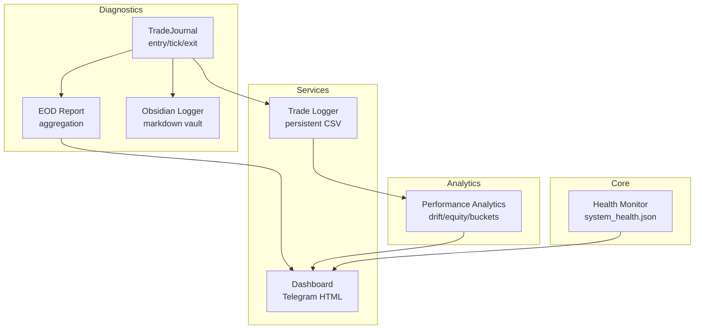
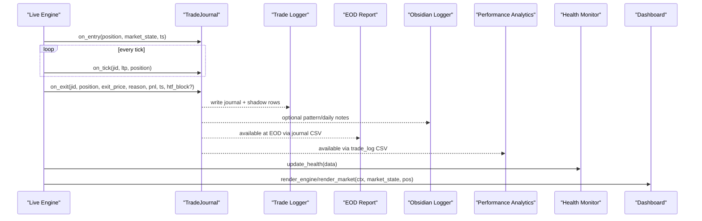
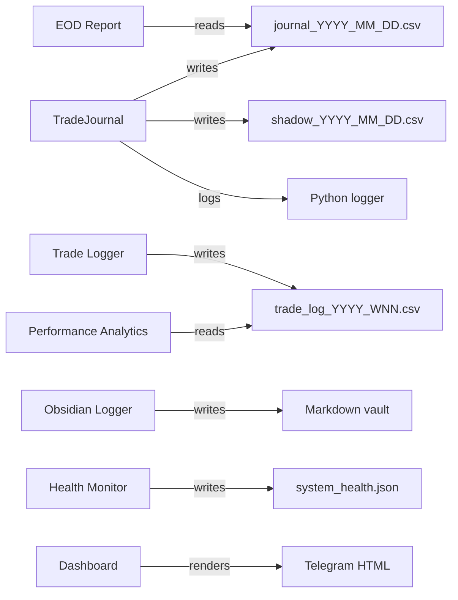

# Debugging Tools

<cite>
**Referenced Files in This Document**
- [obsidian_logger.py](file://utils/obsidian_logger.py)
- [trade_journal.py](file://engine/diagnostics/trade_journal.py)
- [eod_report.py](file://engine/diagnostics/eod_report.py)
- [health_monitor.py](file://engine/core/health_monitor.py)
- [dashboard.py](file://engine/services/dashboard.py)
- [trade_logger.py](file://engine/services/trade_logger.py)
- [performance.py](file://engine/analytics/performance.py)
- [live_engine.py](file://engine/live_engine.py)
- [monitor_session.py](file://scripts/monitor_session.py)
</cite>

## Table of Contents
1. Introduction
2. Project Structure
3. Core Components
4. Architecture Overview
5. Detailed Component Analysis
6. Dependency Analysis
7. Performance Considerations
8. Troubleshooting Guide
9. Conclusion
10. Appendices

## Introduction
This document explains the debugging and diagnostic toolkit embedded in the trading system. It covers:
- Obsidian logger for structured, human-readable trade notes and daily summaries with rich metadata
- End-of-day reporting that aggregates performance, MFE/MAE, exit reasons, loss classes, and shadow analysis
- Trade journaling that records entry snapshots, intra-trade ticks, exits, classification, and counterfactual “shadow” scenarios
- Shadow trading mode (analysis-only) to simulate alternative exits and filters without risking capital
- Monitoring dashboards, alerting, and automated health checks
- Practical troubleshooting guides for order execution issues, ML prediction anomalies, and data synchronization problems
- Log analysis tools and performance profiling utilities

## Project Structure
The diagnostics and monitoring subsystems are organized into focused modules:
- utils/obsidian_logger.py: Markdown-based “second brain” logs for trades, daily summaries, and patterns
- engine/diagnostics/: Journaling, EOD report generation, and shadow analysis
- engine/services/: Persistent trade logging and Telegram dashboards
- engine/analytics/: Post-trade analytics, drift alerts, equity curve stats
- engine/core/health_monitor.py: System health snapshot writer
- scripts/monitor_session.py: Lightweight log tailer for event capture

**Diagram sources**
- [trade_journal.py:229-508](file://engine/diagnostics/trade_journal.py#L229-L508)
- [eod_report.py:124-178](file://engine/diagnostics/eod_report.py#L124-L178)
- [obsidian_logger.py:72-186](file://utils/obsidian_logger.py#L72-L186)
- [trade_logger.py:49-141](file://engine/services/trade_logger.py#L49-L141)
- [performance.py:143-487](file://engine/analytics/performance.py#L143-L487)
- [health_monitor.py:12-67](file://engine/core/health_monitor.py#L12-L67)
- [dashboard.py:61-253](file://engine/services/dashboard.py#L61-L253)

**Section sources**
- [trade_journal.py:229-508](file://engine/diagnostics/trade_journal.py#L229-L508)
- [eod_report.py:124-178](file://engine/diagnostics/eod_report.py#L124-L178)
- [obsidian_logger.py:72-186](file://utils/obsidian_logger.py#L72-L186)
- [trade_logger.py:49-141](file://engine/services/trade_logger.py#L49-L141)
- [performance.py:143-487](file://engine/analytics/performance.py#L143-L487)
- [health_monitor.py:12-67](file://engine/core/health_monitor.py#L12-L67)
- [dashboard.py:61-253](file://engine/services/dashboard.py#L61-L253)

## Core Components
- TradeJournal: Captures per-trade lifecycle (entry snapshot, tick updates, exit), classifies losses, and computes shadow outcomes. Thread-safe, zero strategy impact.
- EOD Report: Reads today’s journal CSV and produces a structured summary including overall metrics, side breakdowns, MFE/MAE, exit reasons, loss classes, and shadow insights.
- Obsidian Logger: Appends markdown records to a “trading_brain” vault for trades, daily summaries, and detected failure patterns.
- Trade Logger: Writes persistent weekly CSVs with full trade details, costs, latencies, and thresholds.
- Health Monitor: Writes a JSON snapshot of system state and key metrics for external monitors.
- Dashboard: Renders rich Telegram messages for engine status and live market view.
- Performance Analytics: Post-trade analytics including drift detection, setup/regime breakdowns, ML bucket quality, and equity curve stats.

**Section sources**
- [trade_journal.py:229-508](file://engine/diagnostics/trade_journal.py#L229-L508)
- [eod_report.py:124-178](file://engine/diagnostics/eod_report.py#L124-L178)
- [obsidian_logger.py:72-186](file://utils/obsidian_logger.py#L72-L186)
- [trade_logger.py:49-141](file://engine/services/trade_logger.py#L49-L141)
- [health_monitor.py:12-67](file://engine/core/health_monitor.py#L12-L67)
- [dashboard.py:61-253](file://engine/services/dashboard.py#L61-L253)
- [performance.py:143-487](file://engine/analytics/performance.py#L143-L487)

## Architecture Overview
The diagnostics pipeline is designed as a passive observability layer around the live engine:
- Entry: TradeJournal.on_entry captures market context, ML probabilities, indicators, and signals.
- Tick: TradeJournal.on_tick updates LTP snapshots and running MFE/MAE in memory.
- Exit: TradeJournal.on_exit finalizes metrics, classifies losses, runs shadow analysis, and writes to journal/shadow CSVs.
- Reporting: EOD report reads the day’s journal CSV to produce structured analytics; Obsidian logger appends human-readable summaries; Trade Logger persists authoritative trade records; Performance Analytics provides drift and equity curve insights; Health Monitor writes system health; Dashboards render Telegram messages.

**Diagram sources**
- [trade_journal.py:297-497](file://engine/diagnostics/trade_journal.py#L297-L497)
- [trade_logger.py:49-141](file://engine/services/trade_logger.py#L49-L141)
- [eod_report.py:124-178](file://engine/diagnostics/eod_report.py#L124-L178)
- [obsidian_logger.py:72-186](file://utils/obsidian_logger.py#L72-L186)
- [performance.py:143-487](file://engine/analytics/performance.py#L143-L487)
- [health_monitor.py:12-67](file://engine/core/health_monitor.py#L12-L67)
- [dashboard.py:61-253](file://engine/services/dashboard.py#L61-L253)

## Detailed Component Analysis

### Obsidian Logger
Purpose:
- Append structured markdown records to a “trading_brain” vault for trades, daily summaries, and recurring failure patterns.
- Provides thread-safe file appends and never crashes the trading loop if I/O fails.

Key capabilities:
- log_trade: Records closed trades with timestamps, prices, PnL, MFE, ML confidence, strategy, side, symbol, exit reason, and holding time.
- log_daily_summary: Creates or updates daily summaries with total trades, net PnL, win rate, average MFE, gross profit/loss, max drawdown, CE/PE breakdowns, observations, and next-day actions.
- log_pattern and check_and_log_patterns: Detects common failure patterns (high MFE low capture, immediate adverse moves, repeated losing streaks, tight stops) and logs them.
- initialize_vault: Ensures directory structure and index files exist.

Design notes:
- Uses a global write lock to ensure thread safety.
- Paths under trading_brain/daily, trading_brain/trades, trading_brain/patterns, trading_brain/rules.
- Formatting helpers for timestamps and currency.

Usage guidance:
- Call log_trade when a trade closes.
- Call log_daily_summary at end-of-day triggers.
- Use check_and_log_patterns with today’s trades to auto-detect recurring issues.

**Section sources**
- [obsidian_logger.py:23-68](file://utils/obsidian_logger.py#L23-L68)
- [obsidian_logger.py:72-121](file://utils/obsidian_logger.py#L72-L121)
- [obsidian_logger.py:124-186](file://utils/obsidian_logger.py#L124-L186)
- [obsidian_logger.py:189-222](file://utils/obsidian_logger.py#L189-L222)
- [obsidian_logger.py:225-331](file://utils/obsidian_logger.py#L225-L331)
- [obsidian_logger.py:334-381](file://utils/obsidian_logger.py#L334-L381)

### Trade Journaling System
Purpose:
- Provide maximum observability with zero strategy impact by recording entry snapshots, intra-trade ticks, exits, loss classification, and shadow analysis.

Lifecycle:
- on_entry: Captures identity, market state (ORB, VWAP, HTF trend), ML probabilities, ATR, signal reason, and initializes in-memory tracking.
- on_tick: Updates LTP snapshots at 5/10/30/60 seconds, tracks running MFE/MAE, and highest ladder stage reached.
- on_exit: Finalizes record, classifies loss type, computes shadow outcomes, writes to journal and shadow CSVs, and logs detailed info.

Loss classification:
- Classifies losing trades into categories such as immediate adverse move, spread loss, good trade reversed, stop too tight, wrong directional signal, theta decay, and other.

Shadow analysis:
- Simulates alternative exits/filters: break-even triggers at different thresholds and trailing strategies, plus hypothetical HTF/ML blocks.
- Produces “same/better/worse” outcomes compared to actual results.

Data schema:
- Journal columns include identity, entry snapshot, intra-trade extremes, exit fields, loss class, and shadow flags/outcomes.
- Shadow columns store simulated outcomes and notes.

Thread safety:
- All file I/O uses a lock; in-memory state is updated per tick without disk writes until exit.

**Section sources**
- [trade_journal.py:31-73](file://engine/diagnostics/trade_journal.py#L31-L73)
- [trade_journal.py:76-129](file://engine/diagnostics/trade_journal.py#L76-L129)
- [trade_journal.py:131-184](file://engine/diagnostics/trade_journal.py#L131-L184)
- [trade_journal.py:187-223](file://engine/diagnostics/trade_journal.py#L187-L223)
- [trade_journal.py:229-508](file://engine/diagnostics/trade_journal.py#L229-L508)

### End-of-Day Reporting System
Purpose:
- Generate comprehensive performance reports from the day’s journal CSV, including overall metrics, side breakdowns, MFE/MAE, exit reasons, loss classes, and shadow analysis.

Capabilities:
- Reads today’s journal CSV and computes win rate, profit factor, expectancy, gross profit/loss, net PnL, and max drawdown.
- Side-specific analysis for CE and PE.
- Exit reason aggregation and loss category distribution.
- Shadow block counts and improvement opportunities.
- Optional formatting for Telegram delivery.

Integration:
- Can be invoked at session close or scheduled EOD trigger.
- Logs summary lines and can format an HTML message for notifications.

**Section sources**
- [eod_report.py:18-35](file://engine/diagnostics/eod_report.py#L18-L35)
- [eod_report.py:45-121](file://engine/diagnostics/eod_report.py#L45-L121)
- [eod_report.py:124-178](file://engine/diagnostics/eod_report.py#L124-L178)
- [eod_report.py:181-257](file://engine/diagnostics/eod_report.py#L181-L257)

### Shadow Trading Mode (Analysis-Only)
Purpose:
- Run counterfactual simulations over real trades to evaluate alternative exits and filters without changing live behavior.

Mechanisms:
- Break-even simulation at configurable thresholds (e.g., 2 or 3 points).
- Trail simulation (e.g., first trail at 10 points instead of 15).
- Hypothetical HTF and ML threshold blocks.
- Outcome comparison (“same”, “better”, “worse”) against actual realized PnL.

Outputs:
- Shadow CSV rows with simulated PnLs and flags.
- EOD report includes shadow counts and improvements.

Operational note:
- Shadow analysis is purely analytical; it does not alter execution or risk parameters.

**Section sources**
- [trade_journal.py:131-184](file://engine/diagnostics/trade_journal.py#L131-L184)
- [trade_journal.py:423-497](file://engine/diagnostics/trade_journal.py#L423-L497)
- [eod_report.py:110-121](file://engine/diagnostics/eod_report.py#L110-L121)

### Monitoring Dashboards and Alerts
Dashboards:
- render_engine: Displays AI engine status, technical indicators, ML bias, scoring, decision state, and today’s performance.
- render_market: Shows live position details, ORB status, VWAP, engine state, and held duration.

Alerts and drift monitoring:
- Drift check evaluates recent windows for win rate, expectancy, profit factor, and capture ratio breaches, producing alerts.
- Equity curve stats compute drawdown and generate alerts when exceeding thresholds.

System health:
- Health monitor writes a JSON snapshot with core metrics, system state, and execution latency for external monitoring.

Log monitoring:
- monitor_session tails engine logs and filters interesting events to a separate log for quick triage.

**Section sources**
- [dashboard.py:61-144](file://engine/services/dashboard.py#L61-L144)
- [dashboard.py:151-226](file://engine/services/dashboard.py#L151-L226)
- [performance.py:294-356](file://engine/analytics/performance.py#L294-L356)
- [performance.py:401-487](file://engine/analytics/performance.py#L401-L487)
- [health_monitor.py:12-67](file://engine/core/health_monitor.py#L12-L67)
- [monitor_session.py:33-68](file://scripts/monitor_session.py#L33-L68)

## Dependency Analysis
- TradeJournal depends on version info retrieval and writes to two CSVs (journal and shadow). It also logs via Python logging.
- EOD Report depends on journal CSV and formats outputs for logging and optional Telegram.
- Obsidian Logger depends on filesystem operations and threading locks.
- Trade Logger depends on cost model for net PnL and writes weekly CSVs.
- Performance Analytics reads trade_log CSVs and generates reports/alerts.
- Health Monitor writes system_health.json.
- Dashboard renders HTML strings using context and market state.

**Diagram sources**
- [trade_journal.py:229-508](file://engine/diagnostics/trade_journal.py#L229-L508)
- [eod_report.py:124-178](file://engine/diagnostics/eod_report.py#L124-L178)
- [trade_logger.py:49-141](file://engine/services/trade_logger.py#L49-L141)
- [performance.py:143-487](file://engine/analytics/performance.py#L143-L487)
- [obsidian_logger.py:72-186](file://utils/obsidian_logger.py#L72-L186)
- [health_monitor.py:12-67](file://engine/core/health_monitor.py#L12-L67)
- [dashboard.py:61-253](file://engine/services/dashboard.py#L61-L253)

**Section sources**
- [trade_journal.py:229-508](file://engine/diagnostics/trade_journal.py#L229-L508)
- [eod_report.py:124-178](file://engine/diagnostics/eod_report.py#L124-L178)
- [trade_logger.py:49-141](file://engine/services/trade_logger.py#L49-L141)
- [performance.py:143-487](file://engine/analytics/performance.py#L143-L487)
- [obsidian_logger.py:72-186](file://utils/obsidian_logger.py#L72-L186)
- [health_monitor.py:12-67](file://engine/core/health_monitor.py#L12-L67)
- [dashboard.py:61-253](file://engine/services/dashboard.py#L61-L253)

## Performance Considerations
- TradeJournal minimizes runtime overhead by keeping in-memory state during the trade lifecycle and only writing on exit.
- EOD Report and Performance Analytics read CSVs post-trade, avoiding live path interference.
- Obsidian Logger uses thread-safe append operations and silent failures to prevent disruption.
- Health Monitor writes a single JSON snapshot; consider throttling frequency based on system load.
- Dashboard rendering is lightweight string formatting; avoid heavy computations inside hot loops.

[No sources needed since this section provides general guidance]

## Troubleshooting Guide

### Order Execution Problems
Symptoms:
- Missing fills, delayed fills, or incorrect slippage/spread values.
- Latency spikes between signal, order submission, and fill.

Diagnostic steps:
- Inspect Trade Logger CSV columns for signal_to_order_latency_ms and order_to_fill_ms to identify bottlenecks.
- Check first_bid, first_ask, first_ltp, spread, and slippage_pts for liquidity and execution quality.
- Verify entry_time and exit_time alignment and holding_seconds for expected durations.
- Use dashboard.render_engine to confirm engine state and decision flow; look for block reasons like VWAP_FAIL, HTF_FAIL, ML_BLOCKED, ML_BELOW_THR.

References:
- [trade_logger.py:25-40](file://engine/services/trade_logger.py#L25-L40)
- [trade_logger.py:49-141](file://engine/services/trade_logger.py#L49-L141)
- [live_engine.py:802-1098](file://engine/live_engine.py#L802-L1098)
- [dashboard.py:61-144](file://engine/services/dashboard.py#L61-L144)

**Section sources**
- [trade_logger.py:25-40](file://engine/services/trade_logger.py#L25-L40)
- [trade_logger.py:49-141](file://engine/services/trade_logger.py#L49-L141)
- [live_engine.py:802-1098](file://engine/live_engine.py#L802-L1098)
- [dashboard.py:61-144](file://engine/services/dashboard.py#L61-L144)

### ML Prediction Errors
Symptoms:
- Low win rate despite high ML probability, or inconsistent signals across cycles.
- Frequent ML_BELOW_THR blocks or unstable adjusted probabilities.

Diagnostic steps:
- Review ML bucket breakdown to see performance by probability ranges.
- Check regime breakdown to detect regime-dependent degradation.
- Use drift_check to detect performance drops over recent windows.
- Validate features and probabilities in the dashboard; compare CE/PE adjusted vs raw probabilities.

References:
- [performance.py:258-287](file://engine/analytics/performance.py#L258-L287)
- [performance.py:226-251](file://engine/analytics/performance.py#L226-L251)
- [performance.py:294-356](file://engine/analytics/performance.py#L294-L356)
- [dashboard.py:61-144](file://engine/services/dashboard.py#L61-L144)

**Section sources**
- [performance.py:258-287](file://engine/analytics/performance.py#L258-L287)
- [performance.py:226-251](file://engine/analytics/performance.py#L226-L251)
- [performance.py:294-356](file://engine/analytics/performance.py#L294-L356)
- [dashboard.py:61-144](file://engine/services/dashboard.py#L61-L144)

### Data Synchronization Issues
Symptoms:
- Inconsistent timestamps, missing LTP snapshots, or stale market state.
- Discrepancies between journal and trade log entries.

Diagnostic steps:
- Confirm journal_id consistency across journal and shadow CSVs.
- Validate entry_ts, exit_ts, and holding_seconds in both Trade Journal and Trade Logger.
- Use monitor_session to tail engine logs and filter relevant events for timing issues.
- Cross-check system_health.json last_update and latency_ms for health anomalies.

References:
- [trade_journal.py:297-497](file://engine/diagnostics/trade_journal.py#L297-L497)
- [trade_logger.py:49-141](file://engine/services/trade_logger.py#L49-L141)
- [monitor_session.py:33-68](file://scripts/monitor_session.py#L33-L68)
- [health_monitor.py:12-67](file://engine/core/health_monitor.py#L12-L67)

**Section sources**
- [trade_journal.py:297-497](file://engine/diagnostics/trade_journal.py#L297-L497)
- [trade_logger.py:49-141](file://engine/services/trade_logger.py#L49-L141)
- [monitor_session.py:33-68](file://scripts/monitor_session.py#L33-L68)
- [health_monitor.py:12-67](file://engine/core/health_monitor.py#L12-L67)

### Analyzing Trade Failures
Approach:
- Use loss classification to categorize failures (immediate adverse move, spread loss, good trade reversed, stop too tight, wrong directional signal, theta decay).
- Examine shadow analysis to see if alternative exits would have improved outcomes.
- Review EOD report sections for exit reasons and loss classes.

References:
- [trade_journal.py:76-129](file://engine/diagnostics/trade_journal.py#L76-L129)
- [trade_journal.py:131-184](file://engine/diagnostics/trade_journal.py#L131-L184)
- [eod_report.py:99-121](file://engine/diagnostics/eod_report.py#L99-L121)

**Section sources**
- [trade_journal.py:76-129](file://engine/diagnostics/trade_journal.py#L76-L129)
- [trade_journal.py:131-184](file://engine/diagnostics/trade_journal.py#L131-L184)
- [eod_report.py:99-121](file://engine/diagnostics/eod_report.py#L99-L121)

### Optimizing System Performance
Recommendations:
- Reduce unnecessary logging in hot paths; rely on TradeJournal’s in-memory updates and batched writes.
- Throttle Health Monitor updates to balance visibility and overhead.
- Use Performance Analytics drift checks to catch regressions early and adjust thresholds.
- Leverage Obsidian patterns to identify recurring inefficiencies and refine rules.

[No sources needed since this section provides general guidance]

## Conclusion
The trading system’s diagnostics suite provides robust, non-invasive observability:
- TradeJournal captures granular lifecycle data and enables counterfactual shadow analysis.
- EOD Report consolidates performance, MFE/MAE, exit reasons, and shadow insights.
- Obsidian Logger creates a human-friendly second brain for review and learning.
- Trade Logger ensures persistent, authoritative records with execution details.
- Health Monitor and Dashboards provide real-time visibility and alerting.
- Performance Analytics detects drift and offers deep post-trade insights.

Together, these tools enable rapid diagnosis of execution issues, ML anomalies, and data synchronization problems, while supporting continuous optimization through structured reviews and alerts.

[No sources needed since this section summarizes without analyzing specific files]

## Appendices

### Step-by-Step Guides

#### Investigating a Failed Trade
1. Locate the trade in journal CSV by journal_id or date.
2. Review entry snapshot (market state, ML probabilities, indicators).
3. Check intra-trade LTP snapshots and MFE/MAE evolution.
4. Inspect exit fields and loss classification.
5. Compare shadow outcomes to assess alternative exits.
6. Cross-reference with Trade Logger CSV for execution details and latencies.

References:
- [trade_journal.py:297-497](file://engine/diagnostics/trade_journal.py#L297-L497)
- [trade_logger.py:49-141](file://engine/services/trade_logger.py#L49-L141)

#### Generating an EOD Report
1. Ensure journal CSV exists for the target date.
2. Invoke generate_eod_report with optional send_telegram flag.
3. Review structured output for overall metrics, side breakdowns, MFE/MAE, exit reasons, loss classes, and shadow analysis.
4. Optionally format and send via Telegram helper.

References:
- [eod_report.py:124-178](file://engine/diagnostics/eod_report.py#L124-L178)
- [eod_report.py:253-257](file://engine/diagnostics/eod_report.py#L253-L257)

#### Setting Up Obsidian Vault Notes
1. Initialize vault to create directories and indexes.
2. Log trades upon closure with log_trade.
3. Update daily summaries at EOD with log_daily_summary.
4. Use check_and_log_patterns to auto-detect recurring issues.

References:
- [obsidian_logger.py:334-381](file://utils/obsidian_logger.py#L334-L381)
- [obsidian_logger.py:72-121](file://utils/obsidian_logger.py#L72-L121)
- [obsidian_logger.py:124-186](file://utils/obsidian_logger.py#L124-L186)
- [obsidian_logger.py:225-331](file://utils/obsidian_logger.py#L225-L331)

#### Monitoring Live Health and Alerts
1. Call update_health periodically with current metrics.
2. Render dashboards for engine and market views.
3. Run drift_check and equity_curve_stats to detect performance issues.
4. Tail engine logs with monitor_session to capture relevant events.

References:
- [health_monitor.py:12-67](file://engine/core/health_monitor.py#L12-L67)
- [dashboard.py:61-253](file://engine/services/dashboard.py#L61-L253)
- [performance.py:294-356](file://engine/analytics/performance.py#L294-L356)
- [performance.py:401-487](file://engine/analytics/performance.py#L401-L487)
- [monitor_session.py:33-68](file://scripts/monitor_session.py#L33-L68)