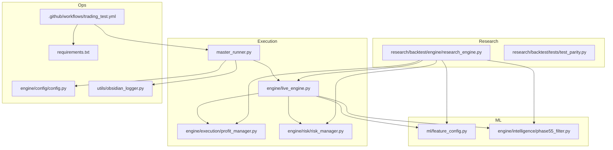
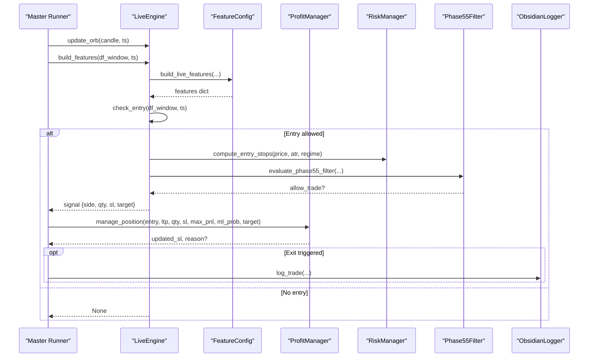
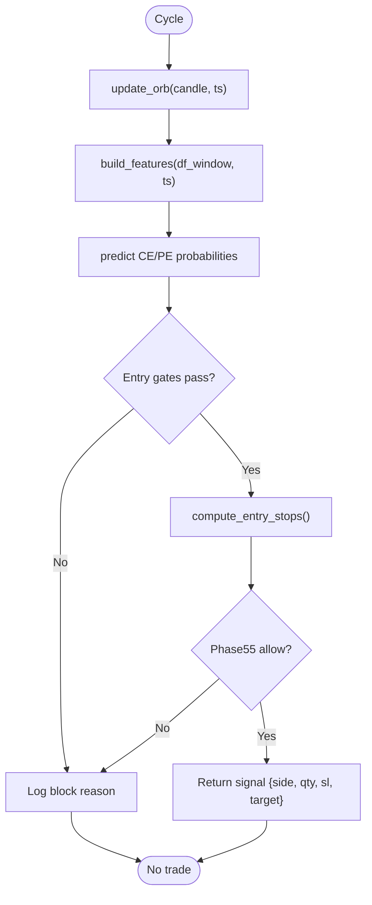
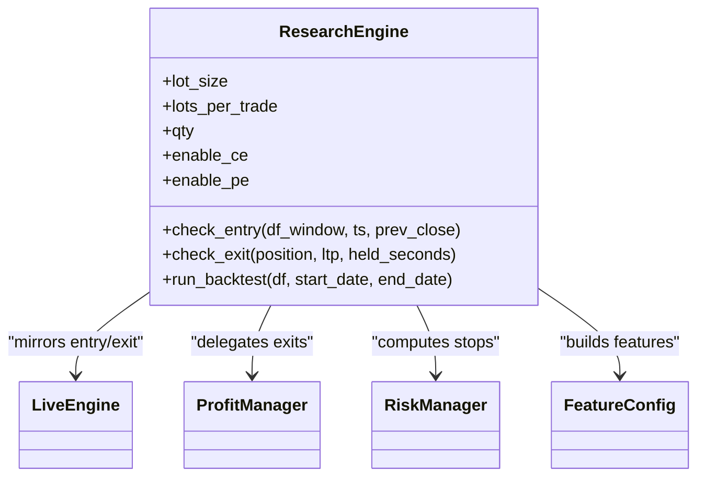
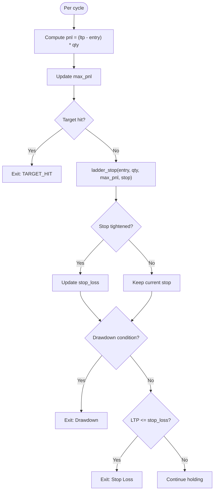
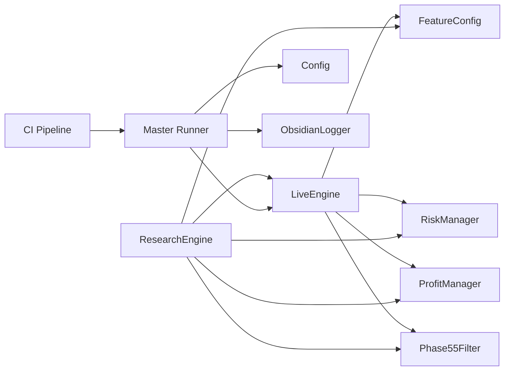

# Development Guide

<cite>
**Referenced Files in This Document**
- [master_runner.py](file://master_runner.py)
- [live_engine.py](file://engine/live_engine.py)
- [research_engine.py](file://research/backtest/engine/research_engine.py)
- [config.py](file://engine/config/config.py)
- [obsidian_logger.py](file://utils/obsidian_logger.py)
- [feature_config.py](file://ml/feature_config.py)
- [profit_manager.py](file://engine/execution/profit_manager.py)
- [risk_manager.py](file://engine/risk/risk_manager.py)
- [phase55_filter.py](file://engine/intelligence/phase55_filter.py)
- [test_parity.py](file://research/backtest/tests/test_parity.py)
- [test_entry_confirmation.py](file://tests/test_entry_confirmation.py)
- [trading_test.yml](file://.github/workflows/trading_test.yml)
- [requirements.txt](file://requirements.txt)
</cite>

## Table of Contents
1. [Introduction](#introduction)
2. [Project Structure](#project-structure)
3. [Core Components](#core-components)
4. [Architecture Overview](#architecture-overview)
5. [Detailed Component Analysis](#detailed-component-analysis)
6. [Dependency Analysis](#dependency-analysis)
7. [Performance Considerations](#performance-considerations)
8. [Troubleshooting Guide](#troubleshooting-guide)
9. [Conclusion](#conclusion)
10. [Appendices](#appendices)

## Introduction
This guide explains how to contribute to and extend the trading system with a focus on codebase structure, architectural patterns, testing strategy (unit, integration, parity), debugging and logging (Obsidian logger), development workflow from feature conception to deployment, guidelines for adding strategies/indicators/risk rules, API interfaces for extension, common development tasks, performance best practices, and contribution standards.

## Project Structure
The system is organized into clear layers:
- Live execution engine and orchestration
- Research backtest that mirrors live logic for parity
- Machine learning features and models
- Risk and profit management
- Configuration and environment-driven behavior
- Testing and CI pipelines
- Logging and observability via Obsidian vault

**Diagram sources**
- [master_runner.py:1-200](file://master_runner.py#L1-L200)
- [live_engine.py:71-184](file://engine/live_engine.py#L71-L184)
- [research_engine.py:48-122](file://research/backtest/engine/research_engine.py#L48-L122)
- [feature_config.py:25-64](file://ml/feature_config.py#L25-L64)
- [phase55_filter.py:12-34](file://engine/intelligence/phase55_filter.py#L12-L34)
- [profit_manager.py:173-225](file://engine/execution/profit_manager.py#L173-L225)
- [risk_manager.py:20-59](file://engine/risk/risk_manager.py#L20-L59)
- [config.py:4-164](file://engine/config/config.py#L4-L164)
- [obsidian_logger.py:72-121](file://utils/obsidian_logger.py#L72-L121)
- [trading_test.yml:1-178](file://.github/workflows/trading_test.yml#L1-L178)
- [requirements.txt:1-11](file://requirements.txt#L1-L11)

**Section sources**
- [master_runner.py:1-200](file://master_runner.py#L1-L200)
- [live_engine.py:71-184](file://engine/live_engine.py#L71-L184)
- [research_engine.py:48-122](file://research/backtest/engine/research_engine.py#L48-L122)
- [feature_config.py:25-64](file://ml/feature_config.py#L25-L64)
- [phase55_filter.py:12-34](file://engine/intelligence/phase55_filter.py#L12-L34)
- [profit_manager.py:173-225](file://engine/execution/profit_manager.py#L173-L225)
- [risk_manager.py:20-59](file://engine/risk/risk_manager.py#L20-L59)
- [config.py:4-164](file://engine/config/config.py#L4-L164)
- [obsidian_logger.py:72-121](file://utils/obsidian_logger.py#L72-L121)
- [trading_test.yml:1-178](file://.github/workflows/trading_test.yml#L1-L178)
- [requirements.txt:1-11](file://requirements.txt#L1-L11)

## Core Components
- LiveEngine: Central decision loop for live sessions; manages ORB, VWAP, day classification, feature building, ML prediction, entry/exit gating, and HTF alignment.
- ResearchEngine: Clean-room research backtest mirroring LiveEngine decisions to ensure parity between research and live.
- ProfitManager: Single source of truth for trailing stops, scale-out, and drawdown exits using a cost-aware ladder.
- RiskManager: Computes tight institutional-style stops and targets based on ATR and regime.
- FeatureConfig: Canonical 36-feature builder used by both live and research engines.
- Phase55Filter: Optional quality/regime filters for CE/PE entries.
- Config: Environment-driven configuration controlling risk, session gates, scalping, and ML thresholds.
- ObsidianLogger: Thread-safe markdown-based logging for trades, daily summaries, and pattern analysis.

**Section sources**
- [live_engine.py:71-184](file://engine/live_engine.py#L71-L184)
- [research_engine.py:48-122](file://research/backtest/engine/research_engine.py#L48-L122)
- [profit_manager.py:173-225](file://engine/execution/profit_manager.py#L173-L225)
- [risk_manager.py:20-59](file://engine/risk/risk_manager.py#L20-L59)
- [feature_config.py:82-267](file://ml/feature_config.py#L82-L267)
- [phase55_filter.py:96-199](file://engine/intelligence/phase55_filter.py#L96-L199)
- [config.py:4-164](file://engine/config/config.py#L4-L164)
- [obsidian_logger.py:72-121](file://utils/obsidian_logger.py#L72-L121)

## Architecture Overview
The system separates concerns across modules while sharing core logic:
- LiveEngine orchestrates market data, indicators, ML predictions, and execution decisions.
- ResearchEngine reuses the same feature pipeline and decision functions to simulate trades deterministically.
- ProfitManager and RiskManager provide consistent exit and stop logic across live and research.
- FeatureConfig ensures identical feature computation across environments.
- Phase55Filter adds optional quality/regime checks.
- Config centralizes environment-driven parameters.
- ObsidianLogger persists trade records and summaries for post-session review.

**Diagram sources**
- [live_engine.py:190-315](file://engine/live_engine.py#L190-L315)
- [live_engine.py:445-590](file://engine/live_engine.py#L445-L590)
- [feature_config.py:82-267](file://ml/feature_config.py#L82-L267)
- [profit_manager.py:173-225](file://engine/execution/profit_manager.py#L173-L225)
- [risk_manager.py:20-59](file://engine/risk/risk_manager.py#L20-L59)
- [phase55_filter.py:96-199](file://engine/intelligence/phase55_filter.py#L96-L199)
- [obsidian_logger.py:72-121](file://utils/obsidian_logger.py#L72-L121)

## Detailed Component Analysis

### LiveEngine
Responsibilities:
- ORB tracking and reconstruction
- Day classification at 9:45
- Feature building via shared feature config
- ML prediction and thresholding
- Entry confirmation (structure, pullback, HTF, trap filters)
- Exit delegation to profit manager
- Session and warmup controls

Key behaviors:
- ORB window 9:15–9:30; reconstructs if missed using historical data.
- VWAP accumulator reset per session.
- Direction bias derived from SuperTrend and VWAP alignment.
- HTF trend alignment using 15m/30m SuperTrend and EMA pairs.
- Pullback entry after breakout detection with tolerance windows.
- Trap filter prevents entries after failed breakouts.

**Diagram sources**
- [live_engine.py:190-315](file://engine/live_engine.py#L190-L315)
- [live_engine.py:445-590](file://engine/live_engine.py#L445-L590)
- [risk_manager.py:20-59](file://engine/risk/risk_manager.py#L20-L59)
- [phase55_filter.py:96-199](file://engine/intelligence/phase55_filter.py#L96-L199)

**Section sources**
- [live_engine.py:71-184](file://engine/live_engine.py#L71-L184)
- [live_engine.py:190-315](file://engine/live_engine.py#L190-L315)
- [live_engine.py:445-590](file://engine/live_engine.py#L445-L590)

### ResearchEngine
Responsibilities:
- Mirror LiveEngine decision logic exactly for deterministic backtesting
- Use same feature builder, risk stops, and profit management
- Enforce Bank Nifty lot size invariants (qty multiple of 30)
- Provide parity tests to validate consistency

Key behaviors:
- Uses LiveEngine.check_entry and manage_position to ensure parity
- Tracks block reasons and generates reports
- Simulates time-based exits and ML early exits via learner mocks

**Diagram sources**
- [research_engine.py:48-122](file://research/backtest/engine/research_engine.py#L48-L122)
- [research_engine.py:205-357](file://research/backtest/engine/research_engine.py#L205-L357)
- [profit_manager.py:173-225](file://engine/execution/profit_manager.py#L173-L225)
- [risk_manager.py:20-59](file://engine/risk/risk_manager.py#L20-L59)
- [feature_config.py:82-267](file://ml/feature_config.py#L82-L267)

**Section sources**
- [research_engine.py:48-122](file://research/backtest/engine/research_engine.py#L48-L122)
- [research_engine.py:205-357](file://research/backtest/engine/research_engine.py#L205-L357)

### ProfitManager
Responsibilities:
- Cost-aware profit ladder that never locks below round-trip cost
- Trailing activation thresholds and distances
- Scale-out triggers
- Drawdown exits after meaningful profit
- Unified logic for normal and scalp positions

Key behaviors:
- Ladder stages lock increasing percentages of peak profit once MFE clears cost thresholds
- Stop only tightens (ratchet up)
- Target hit exits immediately
- Virtual stop semantics: market exit when LTP crosses trigger

**Diagram sources**
- [profit_manager.py:173-225](file://engine/execution/profit_manager.py#L173-L225)

**Section sources**
- [profit_manager.py:173-225](file://engine/execution/profit_manager.py#L173-L225)

### RiskManager
Responsibilities:
- Compute tight institutional stops and targets based on ATR and regime
- Cap worst-case loss per trade
- Guidance target ratio (3.5R) with trailing exits handled elsewhere

Key behaviors:
- Stop distance bounded between floor and ceiling
- LONG options profit when premium rises; stop below entry, target above entry

**Section sources**
- [risk_manager.py:20-59](file://engine/risk/risk_manager.py#L20-L59)

### FeatureConfig
Responsibilities:
- Build canonical 36-feature set used identically in live and research
- Include direction stack (SuperTrend, VWAP bias, ADX, DI spread, EMA alignment, volume ratio)
- Ensure time features use candle timestamps to avoid drift

Key behaviors:
- Safe wrapper returns zeroed features on errors or insufficient data
- Clipping and normalization applied consistently

**Section sources**
- [feature_config.py:25-64](file://ml/feature_config.py#L25-L64)
- [feature_config.py:82-267](file://ml/feature_config.py#L82-L267)

### Phase55Filter
Responsibilities:
- Optional quality/regime filters for CE/PE entries
- Configurable thresholds and regime inference
- Returns structured decision including blocking reasons and recommendations

Key behaviors:
- Can be disabled via config
- Normalizes regimes and infers from features when needed

**Section sources**
- [phase55_filter.py:12-34](file://engine/intelligence/phase55_filter.py#L12-L34)
- [phase55_filter.py:96-199](file://engine/intelligence/phase55_filter.py#L96-L199)

### Config
Responsibilities:
- Centralize environment-driven settings for capital, risk, session gates, scalping, ML thresholds, and execution rules
- Provide defaults and overrides via environment variables

Key behaviors:
- Controls warmup, lunch filter, re-entry cooldown, lot size, trailing/scale-out, scalp parameters, and adaptive thresholds

**Section sources**
- [config.py:4-164](file://engine/config/config.py#L4-L164)

### ObsidianLogger
Responsibilities:
- Append trade records and daily summaries to markdown files under trading_brain
- Detect common failure patterns and log them
- Initialize vault structure and indexes

Key behaviors:
- Thread-safe writes with UTF-8 encoding
- Never crash trading loop on I/O failures
- EOD summary includes metrics and observations

**Section sources**
- [obsidian_logger.py:72-121](file://utils/obsidian_logger.py#L72-L121)
- [obsidian_logger.py:124-186](file://utils/obsidian_logger.py#L124-L186)
- [obsidian_logger.py:189-222](file://utils/obsidian_logger.py#L189-L222)
- [obsidian_logger.py:225-332](file://utils/obsidian_logger.py#L225-L332)
- [obsidian_logger.py:334-381](file://utils/obsidian_logger.py#L334-L381)

## Dependency Analysis
Key dependencies and coupling:
- LiveEngine depends on FeatureConfig, RiskManager, ProfitManager, Phase55Filter, and ML components
- ResearchEngine mirrors LiveEngine to ensure parity
- Config drives behavior across modules via environment variables
- CI pipeline validates imports, login, and engine smoke test

**Diagram sources**
- [live_engine.py:71-184](file://engine/live_engine.py#L71-L184)
- [research_engine.py:48-122](file://research/backtest/engine/research_engine.py#L48-L122)
- [feature_config.py:82-267](file://ml/feature_config.py#L82-L267)
- [profit_manager.py:173-225](file://engine/execution/profit_manager.py#L173-L225)
- [risk_manager.py:20-59](file://engine/risk/risk_manager.py#L20-L59)
- [phase55_filter.py:96-199](file://engine/intelligence/phase55_filter.py#L96-L199)
- [trading_test.yml:1-178](file://.github/workflows/trading_test.yml#L1-L178)

**Section sources**
- [live_engine.py:71-184](file://engine/live_engine.py#L71-L184)
- [research_engine.py:48-122](file://research/backtest/engine/research_engine.py#L48-L122)
- [feature_config.py:82-267](file://ml/feature_config.py#L82-L267)
- [profit_manager.py:173-225](file://engine/execution/profit_manager.py#L173-L225)
- [risk_manager.py:20-59](file://engine/risk/risk_manager.py#L20-L59)
- [phase55_filter.py:96-199](file://engine/intelligence/phase55_filter.py#L96-L199)
- [trading_test.yml:1-178](file://.github/workflows/trading_test.yml#L1-L178)

## Performance Considerations
- Deduplicate per-minute operations in LiveEngine to avoid redundant learner/VWAP updates
- Use rolling windows efficiently; free references after use in loops
- Clip and normalize features to prevent numerical instability
- Avoid heavy computations inside hot loops; precompute where possible
- Monitor memory usage in long-running sessions; reset state at session boundaries
- Prefer vectorized operations in indicator calculations

[No sources needed since this section provides general guidance]

## Troubleshooting Guide
Common issues and resolutions:
- Missing historical data for ORB reconstruction: Engine logs warnings and continues with ML-only entries
- Insufficient candles for day classification: Backfill from CSV if engine starts late
- Feature build failures: Safe wrapper returns zeroed features; check input data shape and timestamps
- Broker/API failures: Graceful handling with warnings; do not crash trading loop
- Telegram notifications: Ensure secrets are configured in CI and runtime

Debugging steps:
- Check Obsidian daily summaries and trade logs for anomalies
- Review block reasons in research engine logs to understand why signals were filtered
- Validate environment variables in Config to ensure correct thresholds and modes
- Run parity tests to confirm research matches live behavior

**Section sources**
- [live_engine.py:222-315](file://engine/live_engine.py#L222-L315)
- [live_engine.py:321-440](file://engine/live_engine.py#L321-L440)
- [feature_config.py:255-267](file://ml/feature_config.py#L255-L267)
- [obsidian_logger.py:72-121](file://utils/obsidian_logger.py#L72-L121)
- [trading_test.yml:62-117](file://.github/workflows/trading_test.yml#L62-L117)

## Conclusion
The system provides a robust, modular architecture with clear separation between live execution, research backtesting, risk management, and observability. Parity testing ensures consistency between environments, while comprehensive logging supports post-session analysis. Following the guidelines in this document will help contributors extend functionality safely and maintain high-quality production code.

[No sources needed since this section summarizes without analyzing specific files]

## Appendices

### Testing Framework
- Unit tests: Validate entry confirmation gates, scalp engine behavior, and component-specific logic
- Integration tests: Smoke tests for broker login, engine startup, and basic lifecycle
- Parity tests: Ensure research engine decisions match live engine decisions field-by-field

Example test categories:
- Sizing invariants and cost model parity
- Entry signal structure validation
- Exit logic (stop-loss, trailing, time-based, ML early exit)
- Pattern detection and logging

**Section sources**
- [test_entry_confirmation.py:1-389](file://tests/test_entry_confirmation.py#L1-L389)
- [test_parity.py:1-533](file://research/backtest/tests/test_parity.py#L1-L533)

### Development Workflow
- Feature conception: Define requirements, risks, and expected behavior
- Implementation: Add logic in appropriate module (e.g., LiveEngine, ProfitManager, RiskManager)
- Testing: Write unit and parity tests; run locally and in CI
- Code review: Ensure adherence to coding standards and design principles
- Deployment: Use CI pipeline to validate imports, login, and engine smoke test

Quality gates:
- All imports must succeed
- Login automation must complete
- Engine must start and run without import/auth errors
- Telegram notifications should initialize correctly

**Section sources**
- [trading_test.yml:22-178](file://.github/workflows/trading_test.yml#L22-L178)

### Guidelines for Adding New Strategies, Indicators, and Risk Rules
- Strategies: Implement in LiveEngine or ScalpEngine; integrate with feature pipeline and phase filters
- Indicators: Add to feature builder or compute within LiveEngine; ensure consistent calculation across live and research
- Risk rules: Extend RiskManager or ProfitManager; maintain capital protection and expectancy principles
- Configuration: Add new parameters to Config with sensible defaults and environment overrides
- Testing: Cover new logic with unit and parity tests; validate behavior in research engine

**Section sources**
- [live_engine.py:445-590](file://engine/live_engine.py#L445-L590)
- [feature_config.py:82-267](file://ml/feature_config.py#L82-L267)
- [risk_manager.py:20-59](file://engine/risk/risk_manager.py#L20-L59)
- [profit_manager.py:173-225](file://engine/execution/profit_manager.py#L173-L225)
- [config.py:4-164](file://engine/config/config.py#L4-L164)

### API Interfaces for Extending Functionality
- LiveEngine methods: update_orb, build_features, check_entry, _maybe_classify_day, reconstruct_orb_if_needed
- ResearchEngine methods: check_entry, check_exit, run_backtest
- ProfitManager functions: manage_position, ladder_stop, ladder_locked_rs
- RiskManager functions: compute_entry_stops, position_size
- FeatureConfig function: build_live_features, _safe_build_live_features
- Phase55Filter function: evaluate_phase55_filter
- ObsidianLogger functions: log_trade, log_daily_summary, log_pattern, check_and_log_patterns, initialize_vault

**Section sources**
- [live_engine.py:190-315](file://engine/live_engine.py#L190-L315)
- [live_engine.py:445-590](file://engine/live_engine.py#L445-L590)
- [research_engine.py:205-357](file://research/backtest/engine/research_engine.py#L205-L357)
- [profit_manager.py:173-225](file://engine/execution/profit_manager.py#L173-L225)
- [risk_manager.py:20-59](file://engine/risk/risk_manager.py#L20-L59)
- [feature_config.py:82-267](file://ml/feature_config.py#L82-L267)
- [phase55_filter.py:96-199](file://engine/intelligence/phase55_filter.py#L96-L199)
- [obsidian_logger.py:72-121](file://utils/obsidian_logger.py#L72-L121)

### Common Development Tasks
- Adding a new feature: Update feature builder, adjust thresholds in Config, add tests, verify parity
- Writing tests: Create unit tests for new logic; add parity tests for research/live consistency
- Debugging issues: Use Obsidian logs, review block reasons, validate environment variables, run CI pipeline

**Section sources**
- [feature_config.py:82-267](file://ml/feature_config.py#L82-L267)
- [config.py:4-164](file://engine/config/config.py#L4-L164)
- [test_entry_confirmation.py:1-389](file://tests/test_entry_confirmation.py#L1-L389)
- [test_parity.py:1-533](file://research/backtest/tests/test_parity.py#L1-L533)
- [obsidian_logger.py:72-121](file://utils/obsidian_logger.py#L72-L121)

### Contribution Process and Coding Standards
- Follow modular design: Keep responsibilities clear and isolated
- Use environment variables for configuration; avoid hardcoding values
- Maintain parity between live and research engines
- Write comprehensive tests covering edge cases and error paths
- Log important decisions and states for traceability
- Adhere to naming conventions and documentation standards

[No sources needed since this section provides general guidance]