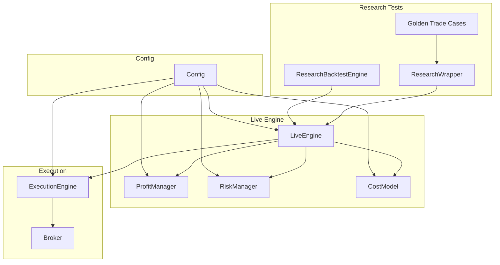
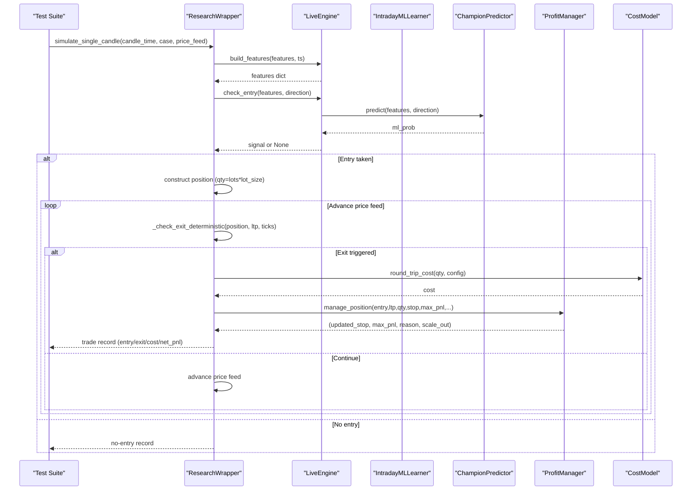
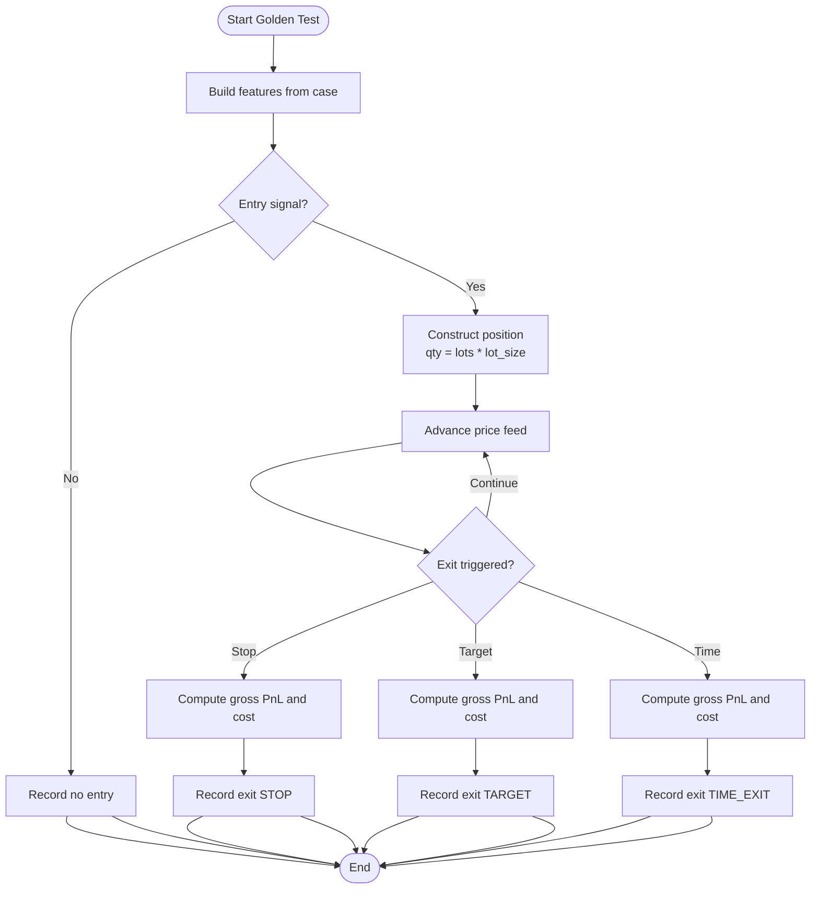
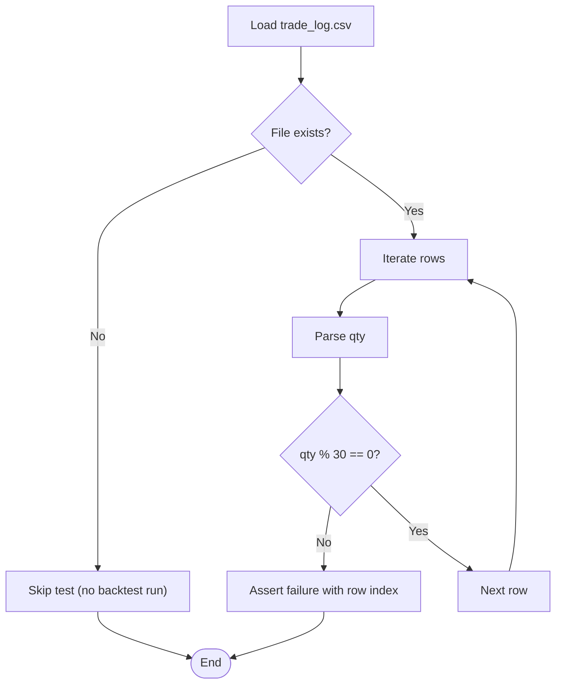
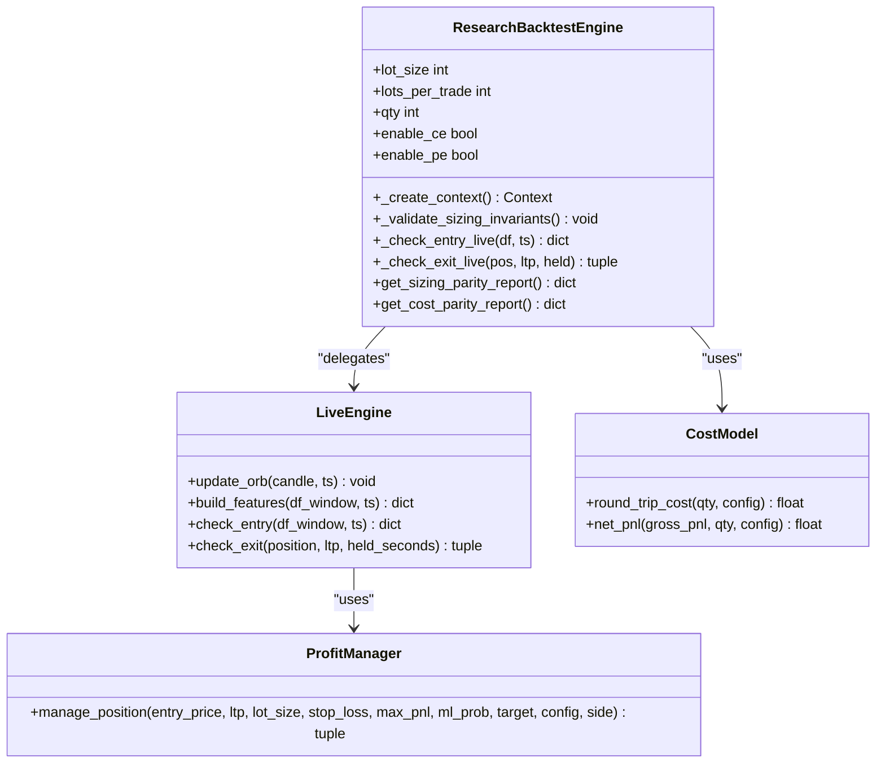
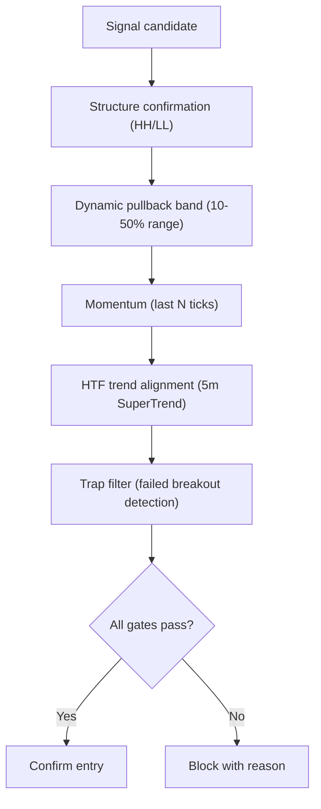
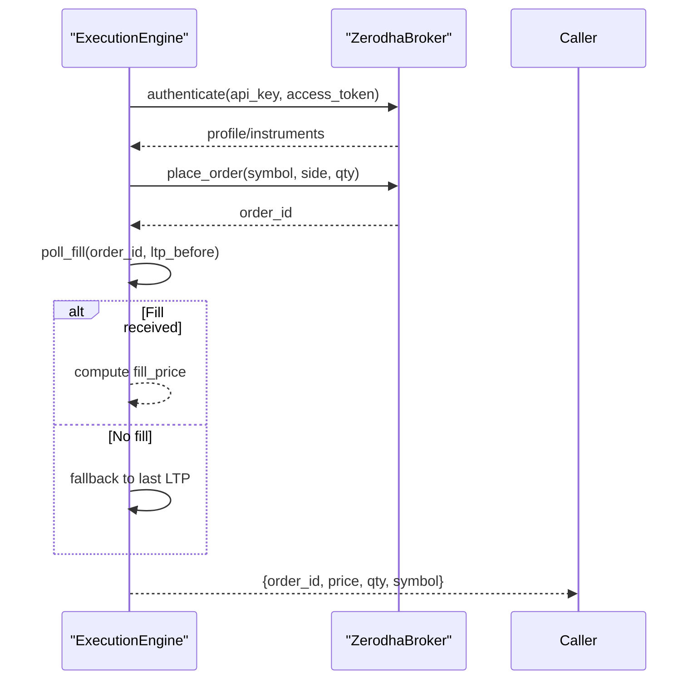
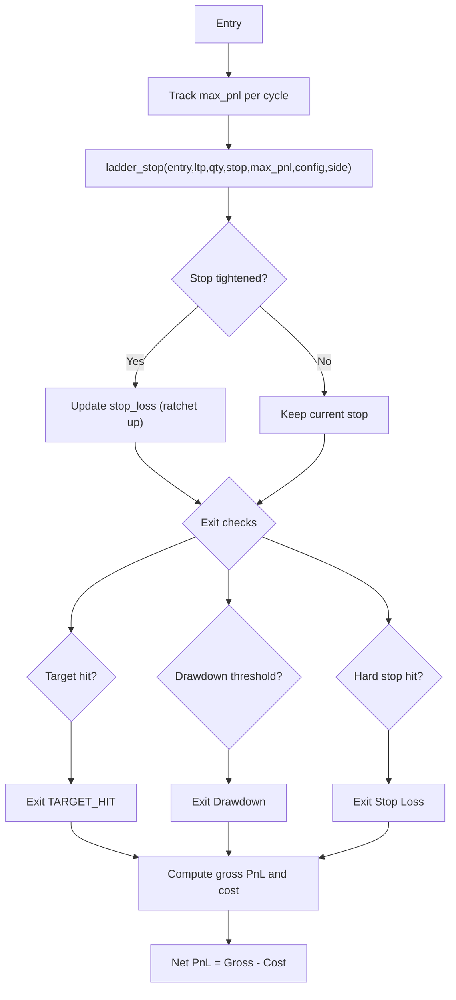
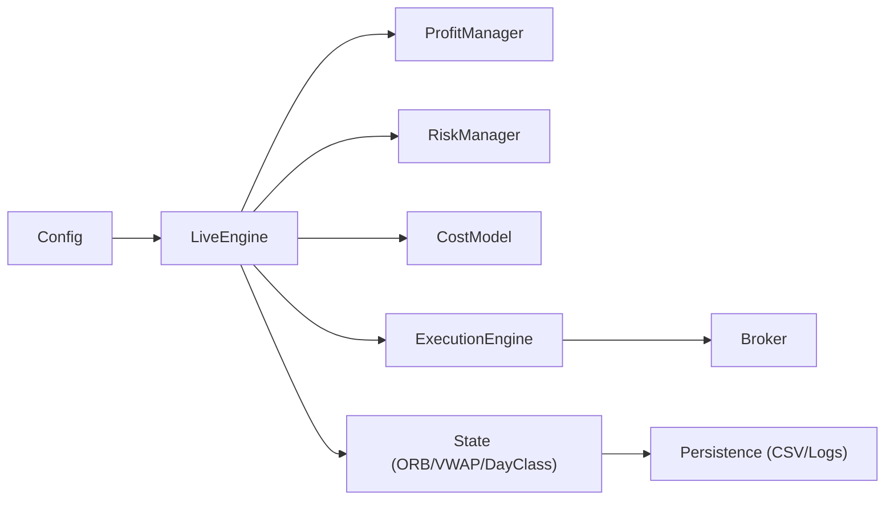
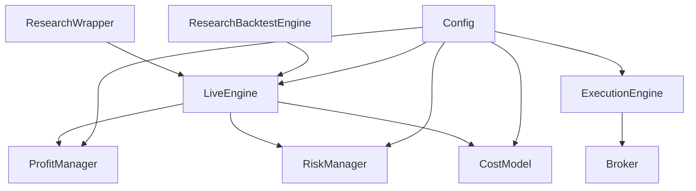

# Integration Testing

<cite>
**Referenced Files in This Document**
- [golden_trades.py](file://research/backtest/tests/golden_trades.py)
- [test_golden_trades.py](file://research/backtest/tests/test_golden_trades.py)
- [test_qty_lot_invariants.py](file://research/backtest/tests/test_qty_lot_invariants.py)
- [test_parity.py](file://research/backtest/tests/test_parity.py)
- [wrapper.py](file://research/backtest/wrapper.py)
- [researchengine.py](file://research/backtest/engine/researchengine.py)
- [live_engine.py](file://engine/live_engine.py)
- [cost_model.py](file://engine/execution/cost_model.py)
- [profit_manager.py](file://engine/execution/profit_manager.py)
- [risk_manager.py](file://engine/risk/risk_manager.py)
- [config.py](file://engine/config/config.py)
- [broker.py](file://engine/execution/broker.py)
- [execution_engine.py](file://engine/execution/execution_engine.py)
- [test_entry_confirmation.py](file://tests/test_entry_confirmation.py)
</cite>

## Table of Contents
1. [Introduction](#introduction)
2. [Project Structure](#project-structure)
3. [Core Components](#core-components)
4. [Architecture Overview](#architecture-overview)
5. [Detailed Component Analysis](#detailed-component-analysis)
6. [Dependency Analysis](#dependency-analysis)
7. [Performance Considerations](#performance-considerations)
8. [Troubleshooting Guide](#troubleshooting-guide)
9. [Conclusion](#conclusion)
10. [Appendices](#appendices)

## Introduction
This document explains the integration testing strategy for validating component interactions and business logic consistency across signal generation, order execution, position management, and PnL calculations. It focuses on:
- Golden trades methodology to validate historical trade patterns by comparing expected vs actual executions
- Quantity and lot invariant testing to ensure consistent position sizing across market conditions and calculation paths
- Broker API integration tests for order execution flows and risk rule enforcement
- Multi-component workflows from signals to orders, position lifecycle, and accurate PnL accounting
- Data persistence, state management, and cross-module communication validation
- Best practices for realistic scenarios, asynchronous handling, and precise financial calculations

## Project Structure
The testing suite spans research backtests, parity checks against live engine behavior, golden trade fixtures, and unit-level entry confirmation tests. Key areas:
- Research backtest wrapper and engine that mirror live engine decisions without duplicating logic
- Live engine with ORB tracking, feature building, ML prediction, and exit delegation to profit manager
- Execution layer with cost model, profit ladder, and broker integration
- Risk manager for stop/target computation and capital-aware sizing
- Configuration driving thresholds, costs, and trading session rules

**Diagram sources**
- [researchengine.py:37-121](file://research/backtest/engine/researchengine.py#L37-L121)
- [wrapper.py:7-214](file://research/backtest/wrapper.py#L7-L214)
- [live_engine.py:71-184](file://engine/live_engine.py#L71-L184)
- [profit_manager.py:173-225](file://engine/execution/profit_manager.py#L173-L225)
- [risk_manager.py:20-60](file://engine/risk/risk_manager.py#L20-L60)
- [cost_model.py:22-45](file://engine/execution/cost_model.py#L22-L45)
- [execution_engine.py:94-215](file://engine/execution/execution_engine.py#L94-L215)
- [broker.py:11-35](file://engine/execution/broker.py#L11-L35)
- [config.py:4-164](file://engine/config/config.py#L4-L164)

**Section sources**
- [researchengine.py:37-121](file://research/backtest/engine/researchengine.py#L37-L121)
- [wrapper.py:7-214](file://research/backtest/wrapper.py#L7-L214)
- [live_engine.py:71-184](file://engine/live_engine.py#L71-L184)
- [profit_manager.py:173-225](file://engine/execution/profit_manager.py#L173-L225)
- [risk_manager.py:20-60](file://engine/risk/risk_manager.py#L20-L60)
- [cost_model.py:22-45](file://engine/execution/cost_model.py#L22-L45)
- [execution_engine.py:94-215](file://engine/execution/execution_engine.py#L94-L215)
- [broker.py:11-35](file://engine/execution/broker.py#L11-L35)
- [config.py:4-164](file://engine/config/config.py#L4-L164)

## Core Components
- Golden trades: deterministic cases defining expected entries, exits, quantities, stops, targets, and reasons
- Research wrapper: thin adapter around live engine to simulate single-candle lifecycles deterministically
- Research backtest engine: parity layer delegating to live engine methods to compare decisions field-by-field
- Live engine: central decision engine orchestrating ORB, features, ML prediction, and exit delegation
- Profit manager: centralized trailing ladder and exit logic
- Risk manager: stop/target computation with capital-aware constraints
- Cost model: authoritative round-trip cost and net PnL
- Execution engine and broker: order placement, fill retrieval, and broker-side protective stops
- Config: environment-driven parameters controlling thresholds, costs, and session filters

**Section sources**
- [golden_trades.py:5-62](file://research/backtest/tests/golden_trades.py#L5-L62)
- [wrapper.py:7-214](file://research/backtest/wrapper.py#L7-L214)
- [researchengine.py:37-121](file://research/backtest/engine/researchengine.py#L37-L121)
- [live_engine.py:71-184](file://engine/live_engine.py#L71-L184)
- [profit_manager.py:173-225](file://engine/execution/profit_manager.py#L173-L225)
- [risk_manager.py:20-60](file://engine/risk/risk_manager.py#L20-L60)
- [cost_model.py:22-45](file://engine/execution/cost_model.py#L22-L45)
- [execution_engine.py:94-215](file://engine/execution/execution_engine.py#L94-L215)
- [broker.py:11-35](file://engine/execution/broker.py#L11-L35)
- [config.py:4-164](file://engine/config/config.py#L4-L164)

## Architecture Overview
Integration tests validate end-to-end flows using deterministic inputs and mocked external dependencies (ML predictor, learner, price feed). The research wrapper drives a single candle through the live engine, simulating entry and exit via controlled LTP sequences. Parity tests assert that research decisions match live engine behavior for historical data.

**Diagram sources**
- [wrapper.py:81-214](file://research/backtest/wrapper.py#L81-L214)
- [live_engine.py:445-470](file://engine/live_engine.py#L445-L470)
- [live_engine.py:798-800](file://engine/live_engine.py#L798-L800)
- [profit_manager.py:173-225](file://engine/execution/profit_manager.py#L173-L225)
- [cost_model.py:29-38](file://engine/execution/cost_model.py#L29-L38)

## Detailed Component Analysis

### Golden Trades Methodology
Golden trades define canonical scenarios with expected entry, quantity/lots, entry price, stop, target, exit reason, and exit price. Tests parametrize over these cases, stubbing ML predictions and price feeds to drive deterministic outcomes. Assertions verify structure parity and numeric tolerances for prices and PnL.

**Diagram sources**
- [golden_trades.py:5-62](file://research/backtest/tests/golden_trades.py#L5-L62)
- [test_golden_trades.py:100-146](file://research/backtest/tests/test_golden_trades.py#L100-L146)
- [wrapper.py:81-214](file://research/backtest/wrapper.py#L81-L214)

**Section sources**
- [golden_trades.py:5-62](file://research/backtest/tests/golden_trades.py#L5-L62)
- [test_golden_trades.py:100-146](file://research/backtest/tests/test_golden_trades.py#L100-L146)
- [wrapper.py:81-214](file://research/backtest/wrapper.py#L81-L214)

### Quantity and Lot Invariant Testing Framework
Ensures all trade quantities are multiples of the lot size (Bank Nifty = 30). Tests read backtest results and assert divisibility. Research engine validates sizing invariants at initialization and enforces them during signal processing.

**Diagram sources**
- [test_qty_lot_invariants.py:8-24](file://research/backtest/tests/test_qty_lot_invariants.py#L8-L24)
- [researchengine.py:93-98](file://research/backtest/engine/researchengine.py#L93-L98)

**Section sources**
- [test_qty_lot_invariants.py:8-24](file://research/backtest/tests/test_qty_lot_invariants.py#L8-L24)
- [researchengine.py:93-98](file://research/backtest/engine/researchengine.py#L93-L98)

### Parity Testing Against Live Engine
Parity tests create a research engine instance, inject mocks for ML components, and delegate entry/exit decisions to the live engine. They assert signal structure, sizing invariants, cost model parity, and exit behaviors (stop loss, trailing, time-based, ML early exit). Reports summarize sizing and cost parity.

**Diagram sources**
- [researchengine.py:37-121](file://research/backtest/engine/researchengine.py#L37-L121)
- [live_engine.py:71-184](file://engine/live_engine.py#L71-L184)
- [profit_manager.py:173-225](file://engine/execution/profit_manager.py#L173-L225)
- [cost_model.py:22-45](file://engine/execution/cost_model.py#L22-L45)

**Section sources**
- [test_parity.py:130-180](file://research/backtest/tests/test_parity.py#L130-L180)
- [test_parity.py:231-282](file://research/backtest/tests/test_parity.py#L231-L282)
- [test_parity.py:288-446](file://research/backtest/tests/test_parity.py#L288-L446)
- [researchengine.py:208-233](file://research/backtest/engine/researchengine.py#L208-L233)

### Entry Confirmation and Trap Filters
Tests validate multi-stage entry confirmation including structure confirmation, dynamic pullback bands, momentum checks, higher-timeframe alignment, and trap filters. Synthetic tick histories exercise gating logic to ensure robust signal quality.

**Diagram sources**
- [test_entry_confirmation.py:72-193](file://tests/test_entry_confirmation.py#L72-L193)
- [live_engine.py:667-792](file://engine/live_engine.py#L667-L792)

**Section sources**
- [test_entry_confirmation.py:72-193](file://tests/test_entry_confirmation.py#L72-L193)
- [live_engine.py:667-792](file://engine/live_engine.py#L667-L792)

### Broker API Integration and Order Execution Flows
Integration points include REST authentication, instrument loading, order placement, fill polling, and fallback strategies. Tests should mock broker calls to validate execution flow under paper/dry-run modes and assert error handling for API failures.

**Diagram sources**
- [broker.py:11-35](file://engine/execution/broker.py#L11-L35)
- [execution_engine.py:94-215](file://engine/execution/execution_engine.py#L94-L215)

**Section sources**
- [broker.py:11-35](file://engine/execution/broker.py#L11-L35)
- [execution_engine.py:94-215](file://engine/execution/execution_engine.py#L94-L215)

### Position Management Lifecycle and PnL Accuracy
Position lifecycle includes entry creation, trailing stop updates, drawdown exits, and hard stop triggers. PnL accuracy relies on centralized cost model and profit manager ladder logic. Tests assert correct gross/net PnL, cost application, and exit reasons.

**Diagram sources**
- [profit_manager.py:116-225](file://engine/execution/profit_manager.py#L116-L225)
- [cost_model.py:29-45](file://engine/execution/cost_model.py#L29-L45)
- [researchengine.py:208-233](file://research/backtest/engine/researchengine.py#L208-L233)

**Section sources**
- [profit_manager.py:116-225](file://engine/execution/profit_manager.py#L116-L225)
- [cost_model.py:29-45](file://engine/execution/cost_model.py#L29-L45)
- [researchengine.py:208-233](file://research/backtest/engine/researchengine.py#L208-L233)

### Data Persistence, State Management, and Cross-Module Communication
- State management: LiveEngine maintains ORB state, VWAP accumulator, day classification, and re-entry cooldowns; tests reset session state for parity runs
- Data persistence: Backtest results written to CSV; tests validate output invariants
- Cross-module communication: Research wrapper delegates to live engine; parity engine uses shared cost model and profit manager; configuration drives behavior across modules

**Diagram sources**
- [config.py:4-164](file://engine/config/config.py#L4-L164)
- [live_engine.py:71-184](file://engine/live_engine.py#L71-L184)
- [profit_manager.py:173-225](file://engine/execution/profit_manager.py#L173-L225)
- [risk_manager.py:20-60](file://engine/risk/risk_manager.py#L20-L60)
- [cost_model.py:22-45](file://engine/execution/cost_model.py#L22-L45)
- [execution_engine.py:94-215](file://engine/execution/execution_engine.py#L94-L215)
- [broker.py:11-35](file://engine/execution/broker.py#L11-L35)

**Section sources**
- [config.py:4-164](file://engine/config/config.py#L4-L164)
- [live_engine.py:71-184](file://engine/live_engine.py#L71-L184)
- [profit_manager.py:173-225](file://engine/execution/profit_manager.py#L173-L225)
- [risk_manager.py:20-60](file://engine/risk/risk_manager.py#L20-L60)
- [cost_model.py:22-45](file://engine/execution/cost_model.py#L22-L45)
- [execution_engine.py:94-215](file://engine/execution/execution_engine.py#L94-L215)
- [broker.py:11-35](file://engine/execution/broker.py#L11-L35)

## Dependency Analysis
Key dependencies and coupling:
- Research wrapper depends on live engine’s public methods; minimal coupling ensures isolation
- Parity tests depend on mocking ML components while exercising live logic
- Profit manager and cost model are shared across modules; changes propagate consistently
- Execution engine depends on broker; tests must mock network calls for reliability
- Config centralizes parameters; tests can override via environment variables

**Diagram sources**
- [wrapper.py:7-214](file://research/backtest/wrapper.py#L7-L214)
- [researchengine.py:37-121](file://research/backtest/engine/researchengine.py#L37-L121)
- [live_engine.py:71-184](file://engine/live_engine.py#L71-L184)
- [profit_manager.py:173-225](file://engine/execution/profit_manager.py#L173-L225)
- [risk_manager.py:20-60](file://engine/risk/risk_manager.py#L20-L60)
- [cost_model.py:22-45](file://engine/execution/cost_model.py#L22-L45)
- [execution_engine.py:94-215](file://engine/execution/execution_engine.py#L94-L215)
- [broker.py:11-35](file://engine/execution/broker.py#L11-L35)
- [config.py:4-164](file://engine/config/config.py#L4-L164)

**Section sources**
- [wrapper.py:7-214](file://research/backtest/wrapper.py#L7-L214)
- [researchengine.py:37-121](file://research/backtest/engine/researchengine.py#L37-L121)
- [live_engine.py:71-184](file://engine/live_engine.py#L71-L184)
- [profit_manager.py:173-225](file://engine/execution/profit_manager.py#L173-L225)
- [risk_manager.py:20-60](file://engine/risk/risk_manager.py#L20-L60)
- [cost_model.py:22-45](file://engine/execution/cost_model.py#L22-L45)
- [execution_engine.py:94-215](file://engine/execution/execution_engine.py#L94-L215)
- [broker.py:11-35](file://engine/execution/broker.py#L11-L35)
- [config.py:4-164](file://engine/config/config.py#L4-L164)

## Performance Considerations
- Deterministic simulations avoid heavy I/O; use fake price feeds to control exit timing
- Mock ML components to isolate logic under test and reduce runtime variability
- Batch parity runs over small date ranges to keep CI fast; larger datasets for nightly runs
- Avoid repeated expensive computations by caching windows and resetting state between days

[No sources needed since this section provides general guidance]

## Troubleshooting Guide
Common issues and resolutions:
- Missing historical data: tests skip gracefully when files are absent; ensure data is present before running parity tests
- ML predictor/learner mismatches: patch classes at module level to return deterministic values; verify attribute names used by live engine
- Price feed not advancing: ensure tests provide a price_feed and call advance() to trigger exits; otherwise rely on wrapper’s deterministic exit logic
- Cost model discrepancies: confirm config.LOT_SIZE and COST_PER_LOT align with expectations; use centralized cost functions for assertions
- Broker API failures: wrap calls in try/except; assert warnings/logs rather than crashes; use paper mode for safe testing

**Section sources**
- [test_parity.py:68-80](file://research/backtest/tests/test_parity.py#L68-L80)
- [test_parity.py:83-123](file://research/backtest/tests/test_parity.py#L83-L123)
- [test_golden_trades.py:18-38](file://research/backtest/tests/test_golden_trades.py#L18-L38)
- [wrapper.py:81-214](file://research/backtest/wrapper.py#L81-L214)
- [cost_model.py:22-45](file://engine/execution/cost_model.py#L22-L45)
- [broker.py:11-35](file://engine/execution/broker.py#L11-L35)

## Conclusion
The integration testing framework combines golden trades, parity checks, and invariant validations to ensure consistency between research and live systems. By mocking external dependencies and driving deterministic scenarios, tests validate signal quality, execution flows, risk rules, and PnL accuracy. Adhering to best practices—realistic scenarios, careful async handling, and precise financial arithmetic—ensures reliable regression coverage and confidence in production deployments.

[No sources needed since this section summarizes without analyzing specific files]

## Appendices

### Best Practices for Realistic Scenarios
- Use synthetic tick histories covering edge cases (choppy markets, exhaustion spikes, sparse windows)
- Parametrize tests over multiple market regimes and lot sizes
- Validate both positive and negative outcomes (wins, losses, time exits, ML exits)

**Section sources**
- [test_entry_confirmation.py:72-193](file://tests/test_entry_confirmation.py#L72-L193)
- [test_parity.py:288-446](file://research/backtest/tests/test_parity.py#L288-L446)

### Handling Asynchronous Operations
- Mock broker APIs to avoid network latency; assert order IDs and fill prices deterministically
- For real broker tests, implement retries and timeouts; capture logs for diagnostics

**Section sources**
- [execution_engine.py:94-215](file://engine/execution/execution_engine.py#L94-L215)
- [broker.py:11-35](file://engine/execution/broker.py#L11-L35)

### Validating Financial Calculations with Precision
- Use centralized cost model for all PnL calculations
- Assert net PnL equals gross minus cost within tight tolerances
- Verify rounding behavior matches expected lot-based costs

**Section sources**
- [cost_model.py:22-45](file://engine/execution/cost_model.py#L22-L45)
- [researchengine.py:208-233](file://research/backtest/engine/researchengine.py#L208-L233)
- [test_parity.py:160-180](file://research/backtest/tests/test_parity.py#L160-L180)