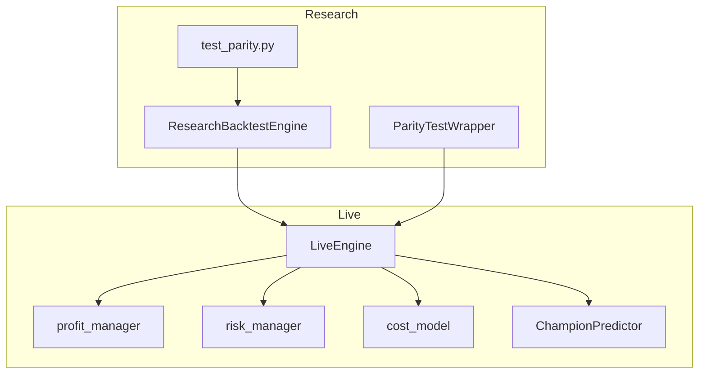
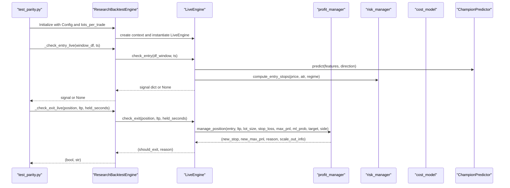
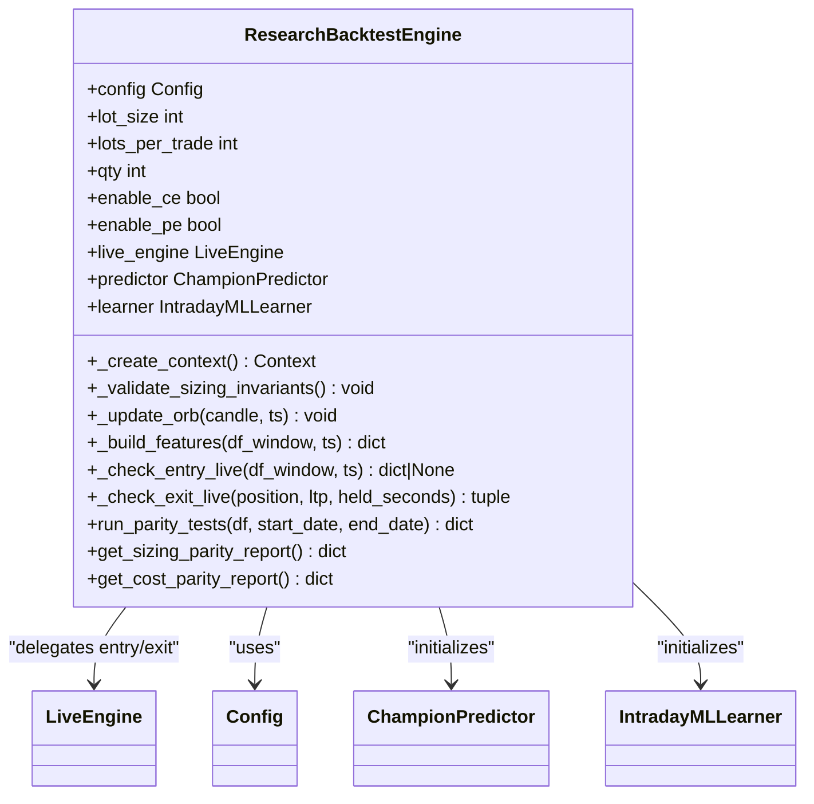
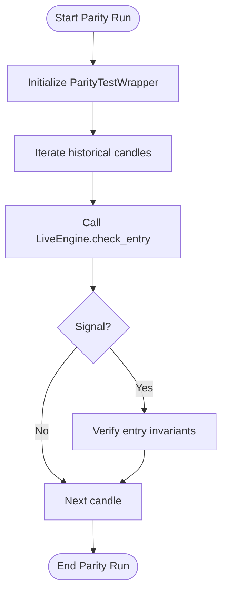
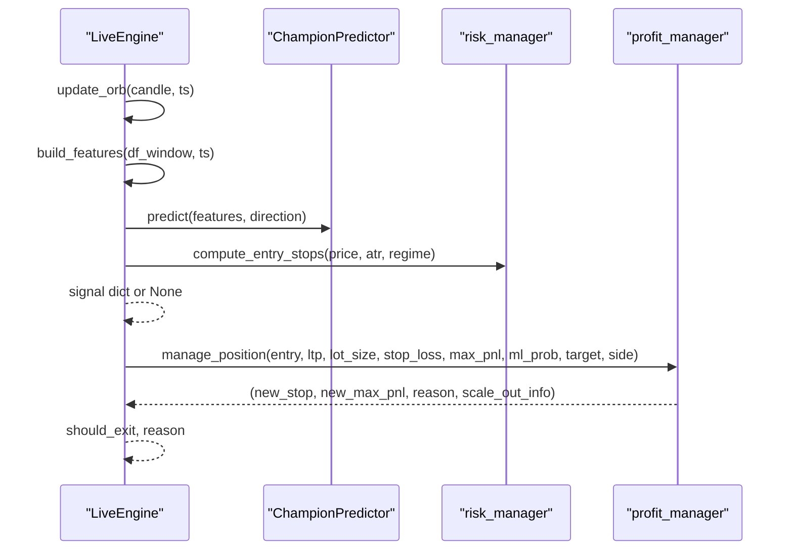
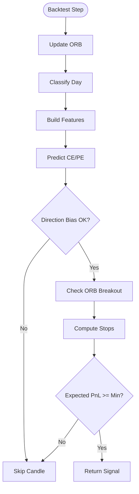
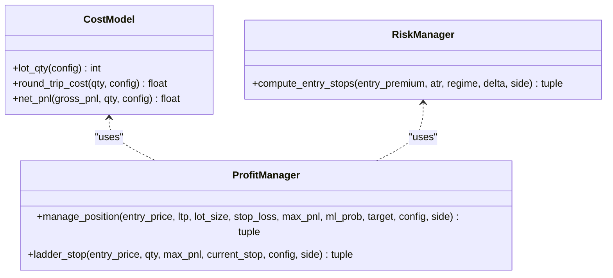
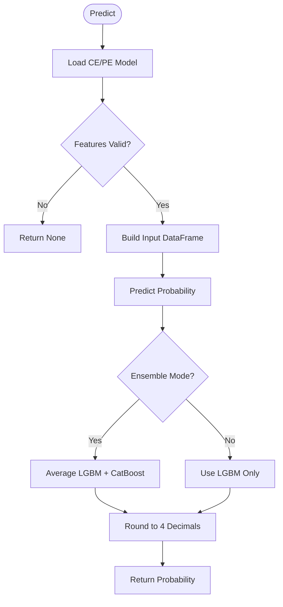
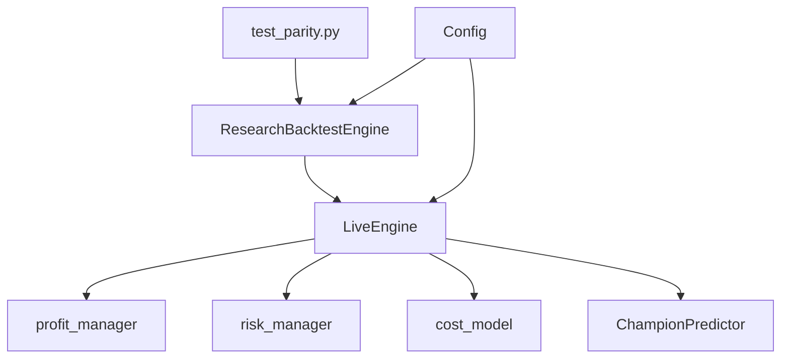

# Parity Testing

<cite>
**Referenced Files in This Document**
- [research/backtest/engine/parity_test.py](file://research/backtest/engine/parity_test.py)
- [research/backtest/tests/test_parity.py](file://research/backtest/tests/test_parity.py)
- [research/backtest/engine/researchengine.py](file://research/backtest/engine/researchengine.py)
- [research/backtest/engine/research_engine.py](file://research/backtest/engine/research_engine.py)
- [engine/live_engine.py](file://engine/live_engine.py)
- [backtest/backtest_engine.py](file://backtest/backtest_engine.py)
- [engine/execution/cost_model.py](file://engine/execution/cost_model.py)
- [engine/execution/profit_manager.py](file://engine/execution/profit_manager.py)
- [engine/risk/risk_manager.py](file://engine/risk/risk_manager.py)
- [ml/predictor_champion.py](file://ml/predictor_champion.py)
- [engine/config/config.py](file://engine/config/config.py)
- [research/backtest/tests/golden_trades.py](file://research/backtest/tests/golden_trades.py)
</cite>

## Table of Contents
1. [Introduction](#introduction)
2. [Project Structure](#project-structure)
3. [Core Components](#core-components)
4. [Architecture Overview](#architecture-overview)
5. [Detailed Component Analysis](#detailed-component-analysis)
6. [Dependency Analysis](#dependency-analysis)
7. [Performance Considerations](#performance-considerations)
8. [Troubleshooting Guide](#troubleshooting-guide)
9. [Conclusion](#conclusion)
10. [Appendices](#appendices)

## Introduction
This document explains the parity testing framework that ensures research and live environments produce identical results for trading decisions. It covers how the system compares outputs between the research engine and the live engine to maintain consistency across development and production, including signal generation, position sizing, and execution logic. It also documents techniques for synchronizing test data, handling time-based differences, managing external dependencies, and writing parity tests for strategies, indicators, and risk rules. Finally, it addresses common parity issues such as floating-point precision, timestamp handling, and market data variations, with guidance on debugging failures and maintaining regression tests.

## Project Structure
The parity testing framework is centered around a thin wrapper that delegates to the live engine’s public methods, ensuring no logic duplication. The research backtest engine mirrors live behavior by calling the same feature builders, predictors, risk managers, and profit managers. Tests validate entry signals, exit logic, sizing invariants, and cost calculations using deterministic mocks where necessary.

**Diagram sources**
- [research/backtest/engine/researchengine.py:37-121](file://research/backtest/engine/researchengine.py#L37-L121)
- [research/backtest/engine/parity_test.py:30-57](file://research/backtest/engine/parity_test.py#L30-L57)
- [engine/live_engine.py:71-128](file://engine/live_engine.py#L71-L128)
- [engine/execution/profit_manager.py:173-225](file://engine/execution/profit_manager.py#L173-L225)
- [engine/risk/risk_manager.py:20-60](file://engine/risk/risk_manager.py#L20-L60)
- [engine/execution/cost_model.py:22-45](file://engine/execution/cost_model.py#L22-L45)
- [ml/predictor_champion.py:57-100](file://ml/predictor_champion.py#L57-L100)

**Section sources**
- [research/backtest/engine/researchengine.py:37-121](file://research/backtest/engine/researchengine.py#L37-L121)
- [research/backtest/engine/parity_test.py:30-57](file://research/backtest/engine/parity_test.py#L30-L57)
- [engine/live_engine.py:71-128](file://engine/live_engine.py#L71-L128)

## Core Components
- ResearchBacktestEngine: A thin wrapper that delegates entry and exit decisions to LiveEngine, validates sizing invariants, and uses the same cost model and risk manager.
- ParityTestWrapper: Provides minimal wrappers around LiveEngine.check_entry and check_exit for parity runs.
- LiveEngine: Production decision engine implementing ORB tracking, feature building, ML prediction, and exit logic via profit_manager.
- BacktestSignalEngine: Institutional-grade backtesting engine mirroring LiveEngine step logic without broker/context dependencies.
- Cost Model: Authoritative source for round-trip costs and net PnL; used consistently across systems.
- Profit Manager: Centralized trailing stop ladder and exit triggers (target hit, drawdown, stop loss).
- Risk Manager: Computes entry stops and targets based on ATR and regime.
- ChampionPredictor: Loads models and returns probabilities for CE/PE directions.

Key responsibilities:
- Sizing invariants enforce whole-lot quantities aligned with Bank Nifty lot size.
- Feature building uses shared functions to ensure identical inputs to ML models.
- Exit logic delegates to profit_manager for consistent trailing and exits.
- Cost calculations are centralized to avoid discrepancies.

**Section sources**
- [research/backtest/engine/researchengine.py:37-121](file://research/backtest/engine/researchengine.py#L37-L121)
- [research/backtest/engine/parity_test.py:30-57](file://research/backtest/engine/parity_test.py#L30-L57)
- [engine/live_engine.py:71-128](file://engine/live_engine.py#L71-L128)
- [backtest/backtest_engine.py:196-260](file://backtest/backtest_engine.py#L196-L260)
- [engine/execution/cost_model.py:22-45](file://engine/execution/cost_model.py#L22-L45)
- [engine/execution/profit_manager.py:173-225](file://engine/execution/profit_manager.py#L173-L225)
- [engine/risk/risk_manager.py:20-60](file://engine/risk/risk_manager.py#L20-L60)
- [ml/predictor_champion.py:57-100](file://ml/predictor_champion.py#L57-L100)

## Architecture Overview
The parity testing architecture ensures that research and live engines share the same decision pipeline. Research calls into LiveEngine for entry and exit decisions, while tests inject deterministic mocks for ML components to stabilize outcomes. Cost and risk modules are single sources of truth, preventing divergence.

**Diagram sources**
- [research/backtest/engine/researchengine.py:107-121](file://research/backtest/engine/researchengine.py#L107-L121)
- [engine/live_engine.py:798-860](file://engine/live_engine.py#L798-L860)
- [engine/execution/profit_manager.py:173-225](file://engine/execution/profit_manager.py#L173-L225)
- [engine/risk/risk_manager.py:20-60](file://engine/risk/risk_manager.py#L20-L60)
- [ml/predictor_champion.py:151-204](file://ml/predictor_champion.py#L151-L204)

## Detailed Component Analysis

### ResearchBacktestEngine
- Purpose: Thin wrapper around LiveEngine to mirror live decisions without duplicating logic.
- Key behaviors:
  - Validates sizing invariants (qty > 0, multiple of lot size, multiple of 30).
  - Delegates ORB updates, feature building, entry checks, and exit checks to LiveEngine.
  - Uses shared cost_model and risk_manager for consistent PnL and stops.
  - Generates parity reports for sizing and cost calculations.

**Diagram sources**
- [research/backtest/engine/researchengine.py:37-121](file://research/backtest/engine/researchengine.py#L37-L121)

**Section sources**
- [research/backtest/engine/researchengine.py:37-121](file://research/backtest/engine/researchengine.py#L37-L121)

### ParityTestWrapper
- Purpose: Minimal wrapper to call LiveEngine.check_entry and check_exit for parity runs.
- Behavior:
  - Instantiates LiveEngine with a minimal context.
  - Returns entry signals and exit decisions exactly as LiveEngine produces.
  - Includes helper functions to verify entry and exit invariants.

**Diagram sources**
- [research/backtest/engine/parity_test.py:30-57](file://research/backtest/engine/parity_test.py#L30-L57)
- [research/backtest/engine/parity_test.py:118-162](file://research/backtest/engine/parity_test.py#L118-L162)

**Section sources**
- [research/backtest/engine/parity_test.py:30-57](file://research/backtest/engine/parity_test.py#L30-L57)
- [research/backtest/engine/parity_test.py:118-162](file://research/backtest/engine/parity_test.py#L118-L162)

### LiveEngine
- Purpose: Production decision engine implementing ORB tracking, feature building, ML prediction, and exit logic.
- Key behaviors:
  - Maintains ORB state and reconstructs if needed.
  - Builds features using shared function and validates completeness.
  - Applies session filters, day classification, and HTF alignment.
  - Delegates exit logic to profit_manager and enforces time-based exits.

**Diagram sources**
- [engine/live_engine.py:190-217](file://engine/live_engine.py#L190-L217)
- [engine/live_engine.py:445-470](file://engine/live_engine.py#L445-L470)
- [engine/live_engine.py:798-860](file://engine/live_engine.py#L798-L860)
- [engine/execution/profit_manager.py:173-225](file://engine/execution/profit_manager.py#L173-L225)
- [engine/risk/risk_manager.py:20-60](file://engine/risk/risk_manager.py#L20-L60)

**Section sources**
- [engine/live_engine.py:190-217](file://engine/live_engine.py#L190-L217)
- [engine/live_engine.py:445-470](file://engine/live_engine.py#L445-L470)
- [engine/live_engine.py:798-860](file://engine/live_engine.py#L798-L860)

### BacktestSignalEngine
- Purpose: Institutional-grade backtesting engine mirroring LiveEngine step logic without broker/context dependencies.
- Key behaviors:
  - Reuses feature builder, predictor, risk manager, and profit manager.
  - Tracks telemetry for raw signals, ML passes, blocks, and executions.
  - Implements session filters, day classification, and HTF alignment.

**Diagram sources**
- [backtest/backtest_engine.py:289-327](file://backtest/backtest_engine.py#L289-L327)
- [backtest/backtest_engine.py:431-758](file://backtest/backtest_engine.py#L431-L758)

**Section sources**
- [backtest/backtest_engine.py:289-327](file://backtest/backtest_engine.py#L289-L327)
- [backtest/backtest_engine.py:431-758](file://backtest/backtest_engine.py#L431-L758)

### Cost Model, Profit Manager, Risk Manager
- Cost Model: Centralized calculation of round-trip costs and net PnL; ensures consistency across systems.
- Profit Manager: Trailing stop ladder and exit triggers; enforces cost-aware locks and drawdown exits.
- Risk Manager: Computes entry stops and targets based on ATR and regime; caps worst-case losses.

**Diagram sources**
- [engine/execution/cost_model.py:22-45](file://engine/execution/cost_model.py#L22-L45)
- [engine/execution/profit_manager.py:116-225](file://engine/execution/profit_manager.py#L116-L225)
- [engine/risk/risk_manager.py:20-60](file://engine/risk/risk_manager.py#L20-L60)

**Section sources**
- [engine/execution/cost_model.py:22-45](file://engine/execution/cost_model.py#L22-L45)
- [engine/execution/profit_manager.py:116-225](file://engine/execution/profit_manager.py#L116-L225)
- [engine/risk/risk_manager.py:20-60](file://engine/risk/risk_manager.py#L20-L60)

### ChampionPredictor
- Purpose: Loads ML models and returns probabilities for CE/PE directions.
- Key behaviors:
  - Validates feature presence and handles missing/invalid features gracefully.
  - Supports ensemble mode when both LGBM and CatBoost models exist.
  - Returns probabilities rounded to four decimals for consistency.

**Diagram sources**
- [ml/predictor_champion.py:57-100](file://ml/predictor_champion.py#L57-L100)
- [ml/predictor_champion.py:151-204](file://ml/predictor_champion.py#L151-L204)

**Section sources**
- [ml/predictor_champion.py:57-100](file://ml/predictor_champion.py#L57-L100)
- [ml/predictor_champion.py:151-204](file://ml/predictor_champion.py#L151-L204)

## Dependency Analysis
The parity testing framework relies on shared components to ensure consistency:
- ResearchBacktestEngine depends on LiveEngine for decision logic.
- LiveEngine depends on profit_manager, risk_manager, and cost_model for execution and risk.
- Tests use mocks for ML components to stabilize outcomes.
- Configuration drives behavior across all components.

**Diagram sources**
- [research/backtest/engine/researchengine.py:37-121](file://research/backtest/engine/researchengine.py#L37-L121)
- [engine/live_engine.py:71-128](file://engine/live_engine.py#L71-L128)
- [engine/config/config.py:4-48](file://engine/config/config.py#L4-L48)

**Section sources**
- [research/backtest/engine/researchengine.py:37-121](file://research/backtest/engine/researchengine.py#L37-L121)
- [engine/live_engine.py:71-128](file://engine/live_engine.py#L71-L128)
- [engine/config/config.py:4-48](file://engine/config/config.py#L4-L48)

## Performance Considerations
- Feature building is optimized to reuse shared functions and avoid redundant computations.
- ORB reconstruction minimizes API calls and handles edge cases gracefully.
- Mocking ML components in tests reduces runtime overhead and ensures deterministic outcomes.
- Telemetry in BacktestSignalEngine helps identify bottlenecks and filter inefficiencies.

[No sources needed since this section provides general guidance]

## Troubleshooting Guide
Common parity issues and resolutions:
- Floating-point precision: Use rounding functions consistently (e.g., round to two decimals for PnL) and compare with tolerance thresholds.
- Timestamp handling: Ensure timestamps are normalized to datetime objects and filtered by market hours.
- Market data variations: Use deterministic historical datasets and mock external dependencies (predictor, learner) for stable tests.
- Sizing mismatches: Validate lot sizes and quantities against configuration and enforce whole-lot invariants.
- Exit logic divergence: Delegate exit decisions to profit_manager and verify trailing stop behavior.

Debugging steps:
- Run parity tests with verbose logging to trace decision paths.
- Compare signal fields (side, qty, price, stop_loss, target, ml_prob) between research and live outputs.
- Inspect telemetry from BacktestSignalEngine to identify blocked or skipped signals.
- Validate cost calculations using cost_model and ensure net PnL matches expected values.

**Section sources**
- [research/backtest/tests/test_parity.py:130-180](file://research/backtest/tests/test_parity.py#L130-L180)
- [research/backtest/tests/test_parity.py:231-282](file://research/backtest/tests/test_parity.py#L231-L282)
- [research/backtest/tests/test_parity.py:288-447](file://research/backtest/tests/test_parity.py#L288-L447)
- [engine/execution/cost_model.py:22-45](file://engine/execution/cost_model.py#L22-L45)

## Conclusion
The parity testing framework ensures research and live environments produce identical results by delegating decision logic to the live engine and validating outputs through comprehensive tests. Shared components like cost_model, profit_manager, and risk_manager prevent divergence, while mocks stabilize ML-dependent tests. By following the guidelines in this document, developers can write robust parity tests for strategies, indicators, and risk rules, and effectively debug and resolve parity failures.

[No sources needed since this section summarizes without analyzing specific files]

## Appendices

### Writing Parity Tests for New Strategies
- Use ResearchBacktestEngine to delegate entry and exit decisions to LiveEngine.
- Inject deterministic mocks for ML components to ensure reproducible outcomes.
- Validate sizing invariants and cost calculations using cost_model.
- Test exit logic by simulating various scenarios (stop loss, trailing, time-based exits).

**Section sources**
- [research/backtest/engine/researchengine.py:107-121](file://research/backtest/engine/researchengine.py#L107-L121)
- [research/backtest/tests/test_parity.py:83-123](file://research/backtest/tests/test_parity.py#L83-L123)
- [research/backtest/tests/golden_trades.py:23-62](file://research/backtest/tests/golden_trades.py#L23-L62)

### Synchronizing Test Data
- Use historical datasets from data/historical directory.
- Normalize timestamps and filter by market hours.
- Ensure rolling windows are consistent between research and live runs.

**Section sources**
- [research/backtest/tests/test_parity.py:68-81](file://research/backtest/tests/test_parity.py#L68-L81)

### Handling External Dependencies
- Mock ML components (ChampionPredictor, IntradayMLLearner) to avoid import errors and stabilize tests.
- Use environment variables to configure behavior (e.g., WARMUP_MINUTES, MAX_HOLD_SECONDS).

**Section sources**
- [research/backtest/tests/test_parity.py:25-55](file://research/backtest/tests/test_parity.py#L25-L55)
- [engine/config/config.py:34-48](file://engine/config/config.py#L34-L48)