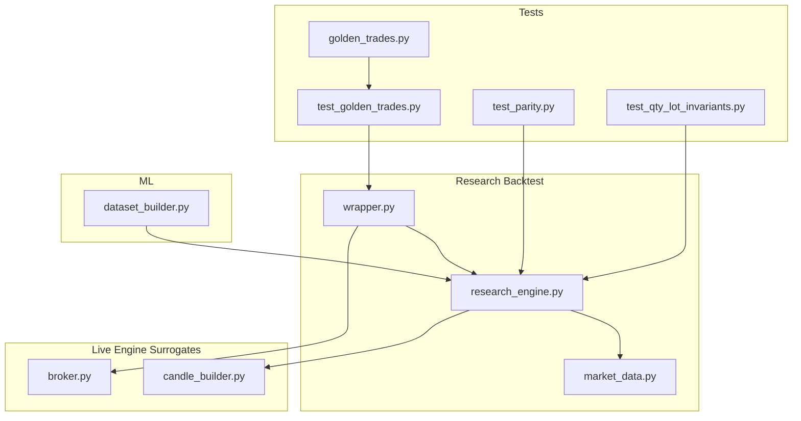
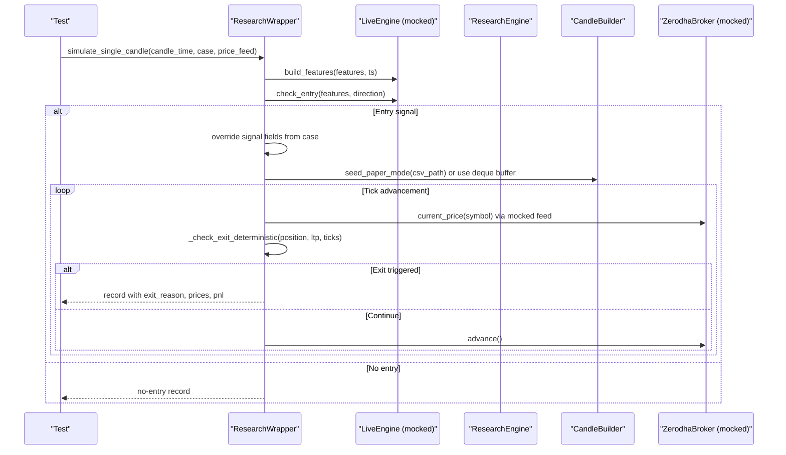
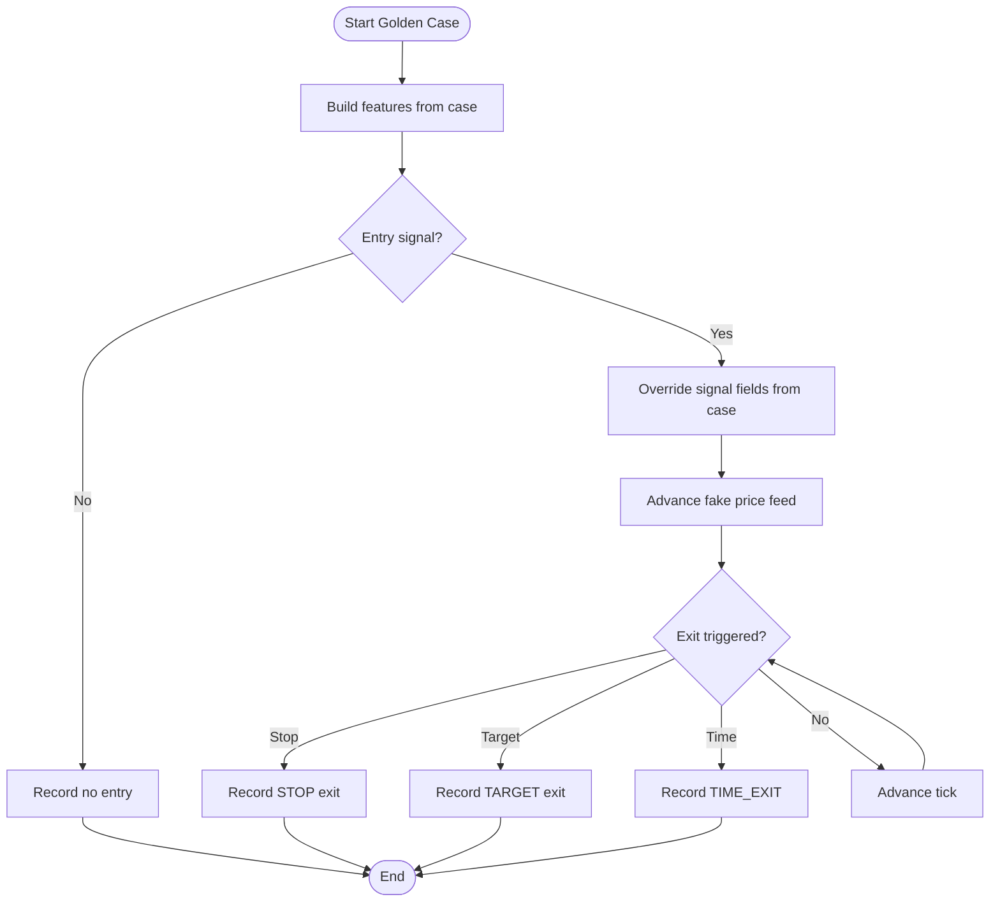
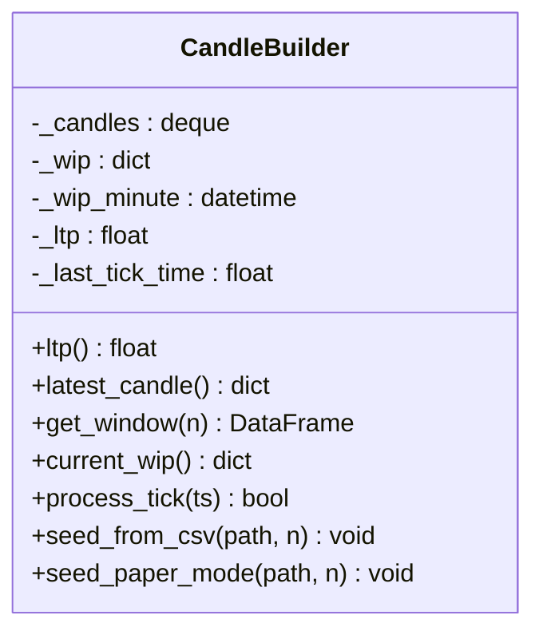
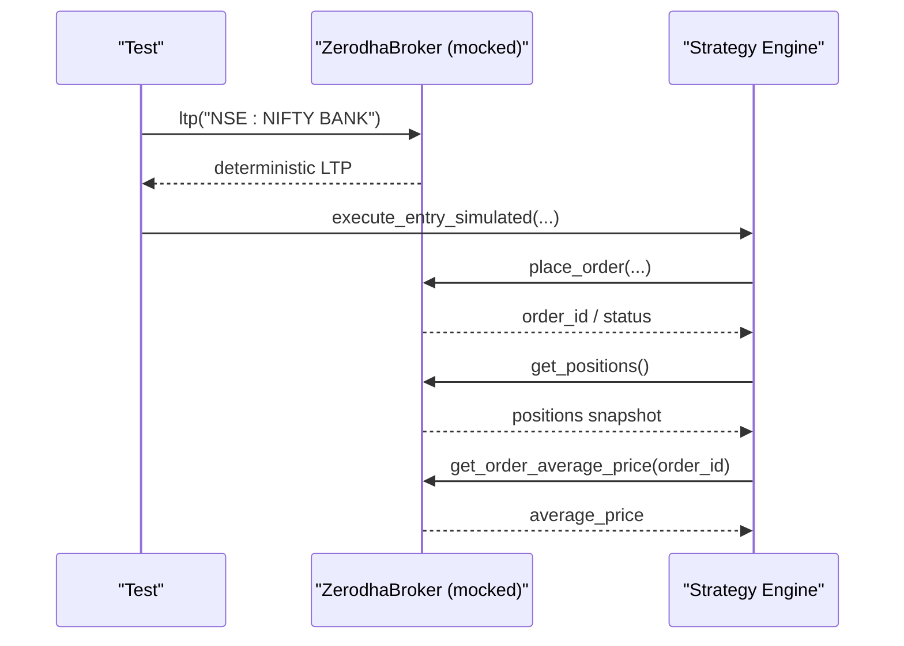
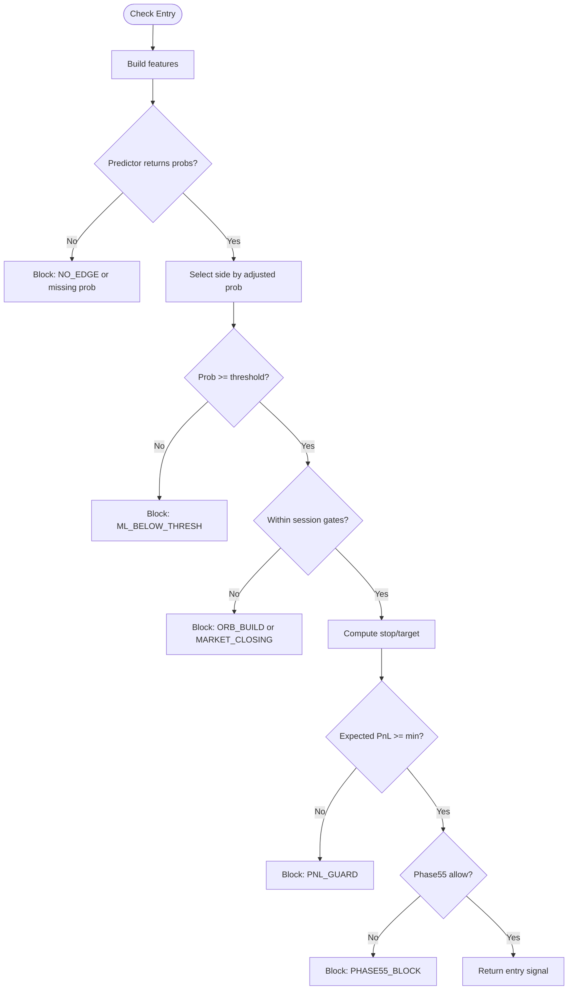
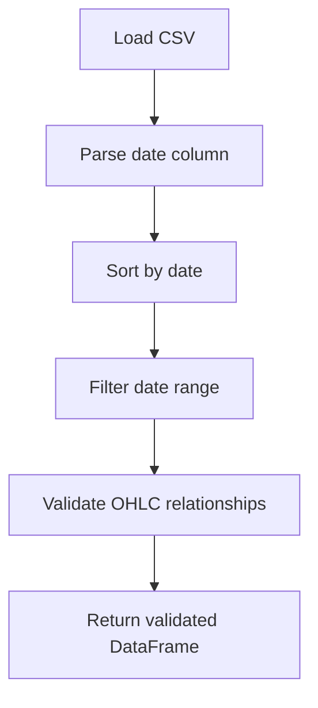
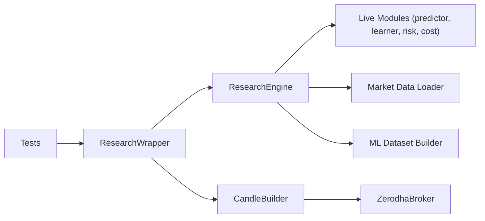

# Test Data Management

<cite>
**Referenced Files in This Document**
- [research/backtest/tests/golden_trades.py](file://research/backtest/tests/golden_trades.py)
- [research/backtest/tests/test_golden_trades.py](file://research/backtest/tests/test_golden_trades.py)
- [research/backtest/wrapper.py](file://research/backtest/wrapper.py)
- [research/backtest/data/market_data.py](file://research/backtest/data/market_data.py)
- [research/backtest/engine/research_engine.py](file://research/backtest/engine/research_engine.py)
- [engine/data/candle_builder.py](file://engine/data/candle_builder.py)
- [engine/execution/broker.py](file://engine/execution/broker.py)
- [research/backtest/tests/test_parity.py](file://research/backtest/tests/test_parity.py)
- [research/backtest/tests/test_qty_lot_invariants.py](file://research/backtest/tests/test_qty_lot_invariants.py)
- [ml/dataset_builder.py](file://ml/dataset_builder.py)
</cite>

## Table of Contents
1. Introduction
2. Project Structure
3. Core Components
4. Architecture Overview
5. Detailed Component Analysis
6. Dependency Analysis
7. Performance Considerations
8. Troubleshooting Guide
9. Conclusion
10. Appendices

## Introduction
This document explains how test data is generated and managed across the testing framework to validate strategy behavior under realistic market conditions. It covers synthetic tick-by-tick simulation using deque-based candle buffers, deterministic golden trade datasets for parity validation, mocking broker responses and order fills, handling partial fills and rejections conceptually, and strategies for versioning, storage formats, seeding, fixtures, parameterization, and integrity checks. The goal is to enable reproducible, scalable, and comprehensive backtests that mirror live engine logic without modifying protected production code.

## Project Structure
The testing framework centers around:
- Golden trade definitions and tests for deterministic parity validation
- A research wrapper that bridges tests to the live engine’s decision functions
- Market data loaders and OHLCV validation utilities
- A research backtest engine mirroring live entry/exit logic
- Real-time candle aggregation with deque buffers for tick-driven simulations
- Broker abstraction for mocking price feeds and order flows
- ML dataset builders for training and feature consistency

**Diagram sources**
- [research/backtest/tests/golden_trades.py:1-62](file://research/backtest/tests/golden_trades.py#L1-L62)
- [research/backtest/tests/test_golden_trades.py:1-146](file://research/backtest/tests/test_golden_trades.py#L1-L146)
- [research/backtest/wrapper.py:1-214](file://research/backtest/wrapper.py#L1-L214)
- [research/backtest/engine/research_engine.py:1-578](file://research/backtest/engine/research_engine.py#L1-L578)
- [research/backtest/data/market_data.py:1-99](file://research/backtest/data/market_data.py#L1-L99)
- [engine/data/candle_builder.py:1-317](file://engine/data/candle_builder.py#L1-L317)
- [engine/execution/broker.py:1-389](file://engine/execution/broker.py#L1-L389)
- [research/backtest/tests/test_parity.py:1-533](file://research/backtest/tests/test_parity.py#L1-L533)
- [research/backtest/tests/test_qty_lot_invariants.py:1-24](file://research/backtest/tests/test_qty_lot_invariants.py#L1-L24)
- [ml/dataset_builder.py:1-28](file://ml/dataset_builder.py#L1-L28)

**Section sources**
- [research/backtest/tests/golden_trades.py:1-62](file://research/backtest/tests/golden_trades.py#L1-L62)
- [research/backtest/wrapper.py:1-214](file://research/backtest/wrapper.py#L1-L214)
- [research/backtest/engine/research_engine.py:1-578](file://research/backtest/engine/research_engine.py#L1-L578)
- [research/backtest/data/market_data.py:1-99](file://research/backtest/data/market_data.py#L1-L99)
- [engine/data/candle_builder.py:1-317](file://engine/data/candle_builder.py#L1-L317)
- [engine/execution/broker.py:1-389](file://engine/execution/broker.py#L1-L389)
- [research/backtest/tests/test_parity.py:1-533](file://research/backtest/tests/test_parity.py#L1-L533)
- [research/backtest/tests/test_qty_lot_invariants.py:1-24](file://research/backtest/tests/test_qty_lot_invariants.py#L1-L24)
- [ml/dataset_builder.py:1-28](file://ml/dataset_builder.py#L1-L28)

## Core Components
- GoldenTradeCase and canonical cases define deterministic scenarios with expected entries, stops, targets, and exit reasons. These drive parity tests against the live engine via a wrapper.
- ResearchWrapper adapts single-candle simulations to the live engine’s interface, building features, invoking entry decisions, and simulating exits deterministically when a fake price feed is provided.
- ResearchEngine mirrors LiveEngine logic exactly (ORB, thresholds, risk stops, PnL guard, Phase55 filter), enabling parity tests without altering live code.
- CandleBuilder uses a deque to aggregate ticks into completed 1-minute candles, supporting both live WebSocket replay and paper-mode CSV seeding for warm-start indicators.
- ZerodhaBroker abstracts REST and WebSocket interactions; tests can mock its methods to simulate LTP, bid/ask, and order placement outcomes.
- Market data loader provides historical Bank Nifty 1-minute data with date filtering and OHLCV validation.
- ML dataset builder ensures feature consistency between training and live pipelines.

**Section sources**
- [research/backtest/tests/golden_trades.py:1-62](file://research/backtest/tests/golden_trades.py#L1-L62)
- [research/backtest/wrapper.py:1-214](file://research/backtest/wrapper.py#L1-L214)
- [research/backtest/engine/research_engine.py:1-578](file://research/backtest/engine/research_engine.py#L1-L578)
- [engine/data/candle_builder.py:1-317](file://engine/data/candle_builder.py#L1-L317)
- [engine/execution/broker.py:1-389](file://engine/execution/broker.py#L1-L389)
- [research/backtest/data/market_data.py:1-99](file://research/backtest/data/market_data.py#L1-L99)
- [ml/dataset_builder.py:1-28](file://ml/dataset_builder.py#L1-L28)

## Architecture Overview
The testing architecture isolates external dependencies while exercising core strategy logic:

**Diagram sources**
- [research/backtest/wrapper.py:81-214](file://research/backtest/wrapper.py#L81-L214)
- [engine/data/candle_builder.py:198-300](file://engine/data/candle_builder.py#L198-L300)
- [engine/execution/broker.py:254-304](file://engine/execution/broker.py#L254-L304)
- [research/backtest/engine/research_engine.py:205-356](file://research/backtest/engine/research_engine.py#L205-L356)

## Detailed Component Analysis

### Golden Trade Datasets and Parity Tests
Golden trade cases encode deterministic expectations for entries, stops, targets, and exit reasons. Tests parametrize over these cases, inject deterministic ML probabilities, and drive price paths to force specific exits. The wrapper overrides signal fields to align with expected values, ensuring parity with live engine behavior.

**Diagram sources**
- [research/backtest/tests/golden_trades.py:1-62](file://research/backtest/tests/golden_trades.py#L1-L62)
- [research/backtest/tests/test_golden_trades.py:100-146](file://research/backtest/tests/test_golden_trades.py#L100-L146)
- [research/backtest/wrapper.py:81-214](file://research/backtest/wrapper.py#L81-L214)

**Section sources**
- [research/backtest/tests/golden_trades.py:1-62](file://research/backtest/tests/golden_trades.py#L1-L62)
- [research/backtest/tests/test_golden_trades.py:1-146](file://research/backtest/tests/test_golden_trades.py#L1-L146)
- [research/backtest/wrapper.py:1-214](file://research/backtest/wrapper.py#L1-L214)

### Synthetic Tick-by-Tick Simulation with Deque Candles
CandleBuilder maintains a rolling deque of completed 1-minute candles and an in-progress candle per minute. process_tick reads the latest tick from the broker’s internal tick store, updates high/low/close/volume, and seals the candle on minute rollover. Historical CSV seeding warms indicators at startup; paper mode supports replay without live WebSocket.

**Diagram sources**
- [engine/data/candle_builder.py:18-108](file://engine/data/candle_builder.py#L18-L108)
- [engine/data/candle_builder.py:114-192](file://engine/data/candle_builder.py#L114-L192)
- [engine/data/candle_builder.py:198-300](file://engine/data/candle_builder.py#L198-L300)

**Section sources**
- [engine/data/candle_builder.py:1-317](file://engine/data/candle_builder.py#L1-L317)

### Mocking Broker Responses and Order Flows
ZerodhaBroker encapsulates REST and WebSocket interactions. For tests, you can:
- Mock ltp to return deterministic prices for scenario generation
- Mock get_bid_ask to simulate spread and liquidity conditions
- Mock place_order to return success/failure or partial fill states
- Use start_feed and subscribe_options to control option chain availability

**Diagram sources**
- [engine/execution/broker.py:254-304](file://engine/execution/broker.py#L254-L304)
- [engine/execution/broker.py:346-389](file://engine/execution/broker.py#L346-L389)

**Section sources**
- [engine/execution/broker.py:1-389](file://engine/execution/broker.py#L1-L389)

### Research Engine Parity and Exit Logic
ResearchEngine mirrors LiveEngine’s entry and exit logic, including ORB gating, ML thresholds, risk stops, PnL guard, and Phase55 filter. Exits delegate to profit management and include time-based weak exits. Tests verify sizing invariants, cost model parity, and exit triggers.

**Diagram sources**
- [research/backtest/engine/research_engine.py:205-317](file://research/backtest/engine/research_engine.py#L205-L317)

**Section sources**
- [research/backtest/engine/research_engine.py:1-578](file://research/backtest/engine/research_engine.py#L1-L578)
- [research/backtest/tests/test_parity.py:130-225](file://research/backtest/tests/test_parity.py#L130-L225)

### Market Data Loading and Validation
Market data loader loads historical Bank Nifty 1-minute data, parses dates, sorts chronologically, filters by date range, and validates OHLC relationships. This ensures consistent inputs for backtests and parity tests.

**Diagram sources**
- [research/backtest/data/market_data.py:13-88](file://research/backtest/data/market_data.py#L13-L88)

**Section sources**
- [research/backtest/data/market_data.py:1-99](file://research/backtest/data/market_data.py#L1-L99)

### ML Dataset Consistency
The ML dataset builder constructs directional labels based on first-touch barriers and ensures feature columns match the live pipeline. This alignment guarantees that predictor outputs used in tests reflect the same feature space as production.

**Section sources**
- [ml/dataset_builder.py:1-28](file://ml/dataset_builder.py#L1-L28)

## Dependency Analysis
Key dependencies and coupling:
- Tests depend on ResearchWrapper to invoke live engine logic deterministically
- ResearchEngine depends on live modules (predictor, learner, risk manager, cost model) but does not modify them
- CandleBuilder depends on broker’s tick store and optionally seeds from CSV
- Broker abstracts external services; tests can fully mock it for isolation
- Market data loader supplies validated historical data for backtests
- ML dataset builder ensures feature parity between training and live inference

**Diagram sources**
- [research/backtest/tests/test_golden_trades.py:1-146](file://research/backtest/tests/test_golden_trades.py#L1-L146)
- [research/backtest/wrapper.py:1-214](file://research/backtest/wrapper.py#L1-L214)
- [research/backtest/engine/research_engine.py:1-578](file://research/backtest/engine/research_engine.py#L1-L578)
- [engine/data/candle_builder.py:1-317](file://engine/data/candle_builder.py#L1-L317)
- [engine/execution/broker.py:1-389](file://engine/execution/broker.py#L1-L389)
- [research/backtest/data/market_data.py:1-99](file://research/backtest/data/market_data.py#L1-L99)
- [ml/dataset_builder.py:1-28](file://ml/dataset_builder.py#L1-L28)

**Section sources**
- [research/backtest/tests/test_golden_trades.py:1-146](file://research/backtest/tests/test_golden_trades.py#L1-L146)
- [research/backtest/wrapper.py:1-214](file://research/backtest/wrapper.py#L1-L214)
- [research/backtest/engine/research_engine.py:1-578](file://research/backtest/engine/research_engine.py#L1-L578)
- [engine/data/candle_builder.py:1-317](file://engine/data/candle_builder.py#L1-L317)
- [engine/execution/broker.py:1-389](file://engine/execution/broker.py#L1-L389)
- [research/backtest/data/market_data.py:1-99](file://research/backtest/data/market_data.py#L1-L99)
- [ml/dataset_builder.py:1-28](file://ml/dataset_builder.py#L1-L28)

## Performance Considerations
- Use deque-backed candle buffers to maintain O(1) append and bounded memory usage for large tick streams
- Seed historical candles once at startup to avoid cold-start stalls and ensure indicator warm-up
- Limit rolling window sizes in feature computation to balance accuracy and performance
- Mock external calls (REST, WebSocket) in tests to eliminate network latency and variability
- Batch CSV operations and sort once to minimize repeated I/O during backtests

[No sources needed since this section provides general guidance]

## Troubleshooting Guide
Common issues and resolutions:
- Missing historical data: Ensure CSV path exists and contains required columns; use loader validation to catch schema mismatches early
- Flat candles during cold start: If WebSocket feed is unavailable, CandleBuilder falls back to REST LTP; restore WS subscription to resume dynamic candles
- No entry signals: Verify ORB gate timing, ML thresholds, and Phase55 filter configuration; adjust test parameters or mock probabilities accordingly
- Sizing invariants failing: Confirm lot size and quantity multiples; tests enforce Bank Nifty lot size constraints
- Exit reason mismatches: Validate price feed sequences to trigger intended exits (stop, target, time); use wrapper’s deterministic exit logic for isolation

**Section sources**
- [research/backtest/data/market_data.py:30-88](file://research/backtest/data/market_data.py#L30-L88)
- [engine/data/candle_builder.py:122-145](file://engine/data/candle_builder.py#L122-L145)
- [research/backtest/engine/research_engine.py:263-317](file://research/backtest/engine/research_engine.py#L263-L317)
- [research/backtest/tests/test_qty_lot_invariants.py:8-24](file://research/backtest/tests/test_qty_lot_invariants.py#L8-L24)

## Conclusion
The testing framework combines deterministic golden trades, robust market data loading, deque-based candle aggregation, and comprehensive mocking to validate strategy behavior against live engine logic. By adhering to invariants, maintaining feature consistency, and structuring tests around clear scenarios, the system enables reliable, repeatable validation of trading strategies across diverse market conditions.

[No sources needed since this section summarizes without analyzing specific files]

## Appendices

### Creating Synthetic Market Scenarios
- Trending markets: Generate monotonic price paths with increasing highs/lows; set ML probabilities to favor trend continuation; expect target hits
- Ranging conditions: Oscillate prices within bounds; rely on time exits or stop-outs; keep ML probabilities near thresholds
- High volatility periods: Introduce wide swings and gaps; ensure stops are respected and trailing logic triggers appropriately
- Low liquidity situations: Reduce volume and widen spreads via bid/ask mocks; simulate delayed fills or partial fills through order mocks

[No sources needed since this section provides general guidance]

### Data Versioning and Storage Formats
- Store historical data as CSV with explicit date columns; loader parses and validates schemas
- Journal and shadow logs use dated CSV files with headers initialized on first write
- Maintain version metadata (commit, model timestamps, config version) in diagnostics for traceability

**Section sources**
- [research/backtest/data/market_data.py:13-88](file://research/backtest/data/market_data.py#L13-L88)
- [engine/diagnostics/trade_journal.py:259-294](file://engine/diagnostics/trade_journal.py#L259-L294)

### Reusable Fixtures and Parameterized Sets
- Define GoldenTradeCase dataclasses for structured, reusable scenarios
- Parametrize tests over canonical cases to run multiple scenarios in one suite
- Use fixtures to create mock learners/predictors and inject them into engines for isolation

**Section sources**
- [research/backtest/tests/golden_trades.py:1-62](file://research/backtest/tests/golden_trades.py#L1-L62)
- [research/backtest/tests/test_golden_trades.py:40-98](file://research/backtest/tests/test_golden_trades.py#L40-L98)
- [research/backtest/tests/test_parity.py:30-55](file://research/backtest/tests/test_parity.py#L30-L55)

### Handling Partial Fills and Rejections
- Mock place_order to return varied statuses (accepted, rejected, partially filled) to exercise risk and position management
- Validate average price calculations and position updates after partial fills
- Ensure exit logic accounts for updated quantities and costs post-fill

**Section sources**
- [engine/execution/broker.py:346-389](file://engine/execution/broker.py#L346-L389)