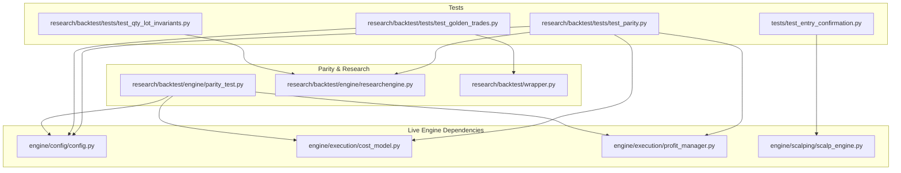
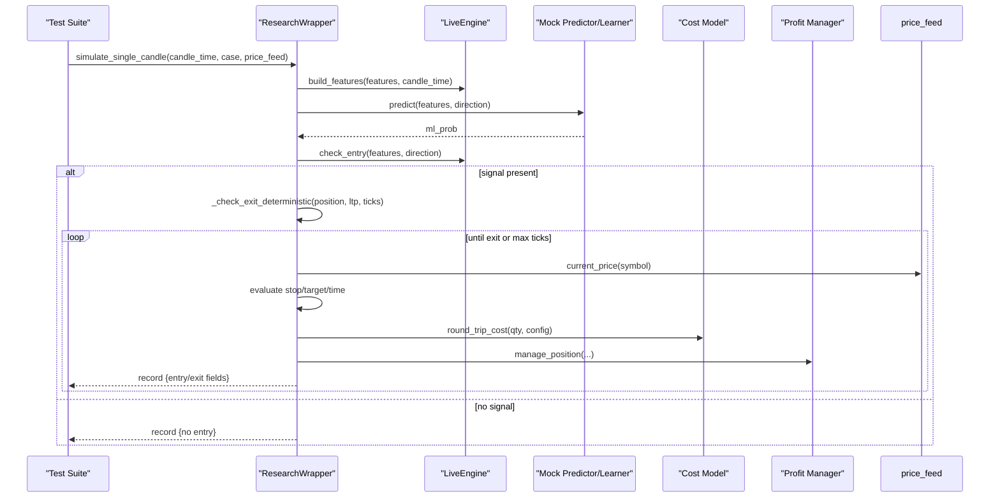
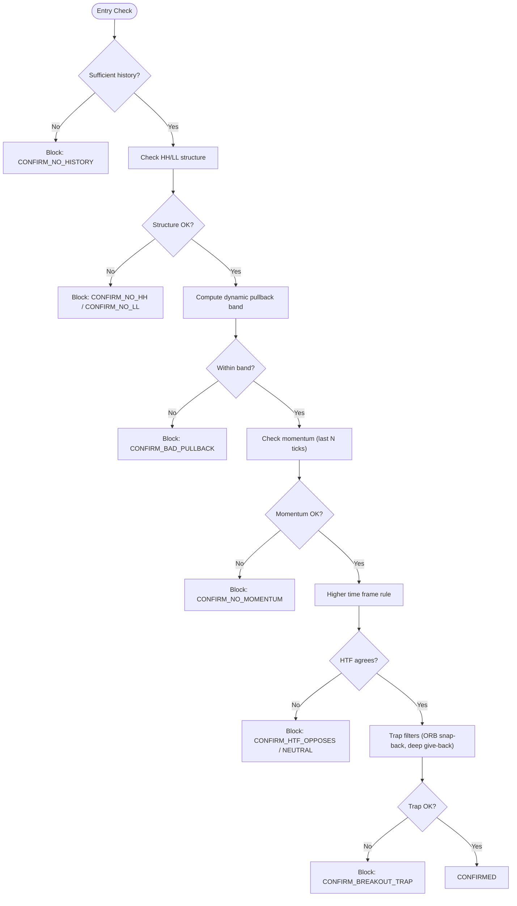
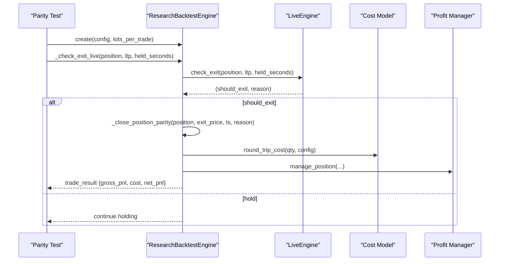
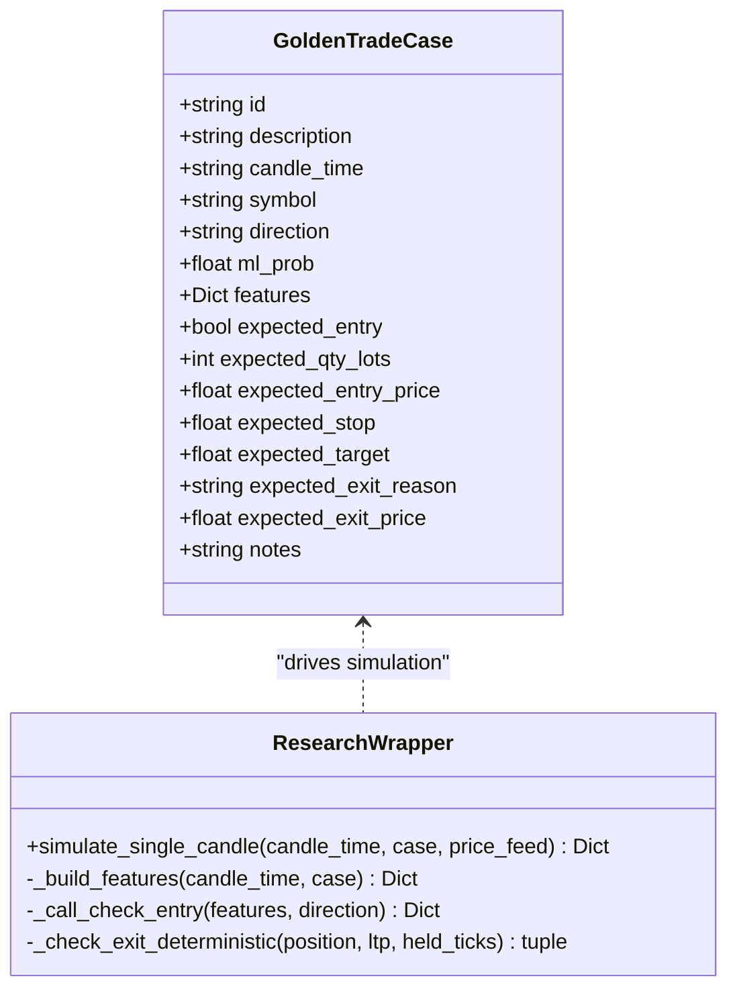
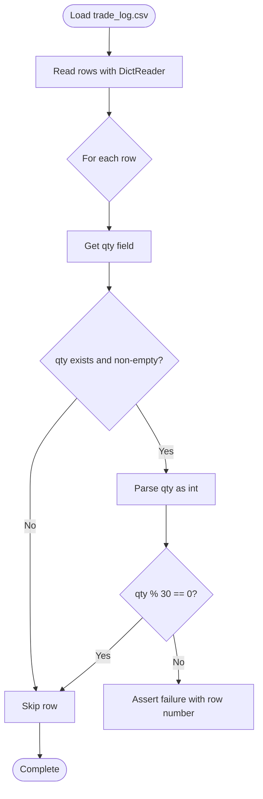
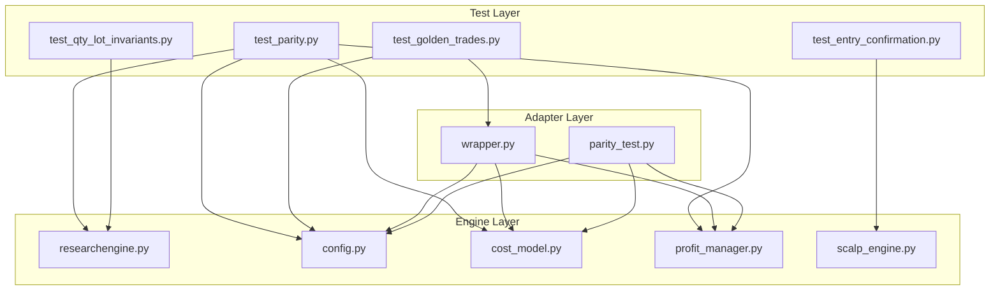

# Testing Framework

<cite>
**Referenced Files in This Document**
- [test_entry_confirmation.py](file://tests/test_entry_confirmation.py)
- [test_parity.py](file://research/backtest/tests/test_parity.py)
- [test_golden_trades.py](file://research/backtest/tests/test_golden_trades.py)
- [golden_trades.py](file://research/backtest/tests/golden_trades.py)
- [test_qty_lot_invariants.py](file://research/backtest/tests/test_qty_lot_invariants.py)
- [wrapper.py](file://research/backtest/wrapper.py)
- [parity_test.py](file://research/backtest/engine/parity_test.py)
- [researchengine.py](file://research/backtest/engine/researchengine.py)
- [config.py](file://engine/config/config.py)
- [cost_model.py](file://engine/execution/cost_model.py)
- [profit_manager.py](file://engine/execution/profit_manager.py)
- [scalp_engine.py](file://engine/scalping/scalp_engine.py)
- [research-tests.yml](file://.github/workflows/research-tests.yml)
- [trading_test.yml](file://.github/workflows/trading_test.yml)
</cite>

## Table of Contents
1. [Introduction](#introduction)
2. [Project Structure](#project-structure)
3. [Core Components](#core-components)
4. [Architecture Overview](#architecture-overview)
5. [Detailed Component Analysis](#detailed-component-analysis)
6. [Dependency Analysis](#dependency-analysis)
7. [Performance Considerations](#performance-considerations)
8. [Troubleshooting Guide](#troubleshooting-guide)
9. [Conclusion](#conclusion)
10. [Appendices](#appendices)

## Introduction
This document explains the comprehensive testing framework for the trading system. It covers:
- Unit tests for individual components (entry confirmation, scalping logic)
- Integration tests that validate module interactions (research vs live engine parity)
- Parity tests ensuring research and live engines produce identical decisions on deterministic inputs
- Golden trades methodology to validate historical trade patterns against expected outcomes
- Quantity/lot invariant testing to ensure consistent position sizing
- Test data generation, mock implementations, and assertion patterns
- Continuous integration practices and end-to-end pipeline testing

The goal is to provide a clear, layered approach to validating strategy behavior, risk controls, and execution logic across environments while keeping tests fast, deterministic, and maintainable.

## Project Structure
The testing framework spans several directories:
- tests: unit tests for entry confirmation and related gating logic
- research/backtest/tests: parity tests, golden trades, and quantity invariants
- research/backtest/engine: parity test wrappers and research backtest engine
- research/backtest/wrapper.py: adapter to drive single-candle simulations with fake feeds
- .github/workflows: CI workflows for parity tests and full pipeline smoke tests

**Diagram sources**
- [test_entry_confirmation.py:1-389](file://tests/test_entry_confirmation.py#L1-L389)
- [test_parity.py:1-533](file://research/backtest/tests/test_parity.py#L1-L533)
- [test_golden_trades.py:1-146](file://research/backtest/tests/test_golden_trades.py#L1-L146)
- [test_qty_lot_invariants.py:1-24](file://research/backtest/tests/test_qty_lot_invariants.py#L1-L24)
- [parity_test.py:1-174](file://research/backtest/engine/parity_test.py#L1-L174)
- [researchengine.py:265-413](file://research/backtest/engine/researchengine.py#L265-L413)
- [wrapper.py:1-214](file://research/backtest/wrapper.py#L1-L214)
- [config.py:33-80](file://engine/config/config.py#L33-L80)
- [cost_model.py:1-200](file://engine/execution/cost_model.py#L1-L200)
- [profit_manager.py:1-200](file://engine/execution/profit_manager.py#L1-L200)
- [scalp_engine.py:1-200](file://engine/scalping/scalp_engine.py#L1-L200)

**Section sources**
- [test_entry_confirmation.py:1-389](file://tests/test_entry_confirmation.py#L1-L389)
- [test_parity.py:1-533](file://research/backtest/tests/test_parity.py#L1-L533)
- [test_golden_trades.py:1-146](file://research/backtest/tests/test_golden_trades.py#L1-L146)
- [test_qty_lot_invariants.py:1-24](file://research/backtest/tests/test_qty_lot_invariants.py#L1-L24)
- [parity_test.py:1-174](file://research/backtest/engine/parity_test.py#L1-L174)
- [researchengine.py:265-413](file://research/backtest/engine/researchengine.py#L265-L413)
- [wrapper.py:1-214](file://research/backtest/wrapper.py#L1-L214)
- [config.py:33-80](file://engine/config/config.py#L33-L80)
- [cost_model.py:1-200](file://engine/execution/cost_model.py#L1-L200)
- [profit_manager.py:1-200](file://engine/execution/profit_manager.py#L1-L200)
- [scalp_engine.py:1-200](file://engine/scalping/scalp_engine.py#L1-L200)

## Core Components
- Entry confirmation unit tests validate multi-gate decision logic using synthetic tick histories and HTF/momentum/trap filters.
- Parity tests compare research engine outputs with live engine behavior using deterministic mocks for ML components.
- Golden trades define canonical scenarios with expected entries, exits, quantities, stops, targets, and PnL arithmetic.
- Quantity/lot invariants enforce lot-size multiples across backtest results.
- Wrapper provides a thin adapter to run single-candle simulations with fake price feeds and deterministic exit checks.
- Parity test wrapper delegates to live engine methods to ensure parity without copying implementation details.

Key responsibilities:
- Deterministic isolation via mocks and fixtures
- Field-by-field assertions for signals, exits, and PnL
- Invariant enforcement for sizing and cost model
- CI-driven parity and smoke tests

**Section sources**
- [test_entry_confirmation.py:1-389](file://tests/test_entry_confirmation.py#L1-L389)
- [test_parity.py:1-533](file://research/backtest/tests/test_parity.py#L1-L533)
- [test_golden_trades.py:1-146](file://research/backtest/tests/test_golden_trades.py#L1-L146)
- [golden_trades.py:1-62](file://research/backtest/tests/golden_trades.py#L1-L62)
- [test_qty_lot_invariants.py:1-24](file://research/backtest/tests/test_qty_lot_invariants.py#L1-L24)
- [wrapper.py:1-214](file://research/backtest/wrapper.py#L1-L214)
- [parity_test.py:1-174](file://research/backtest/engine/parity_test.py#L1-L174)

## Architecture Overview
The testing architecture layers isolate concerns and ensure parity between research and live environments:

**Diagram sources**
- [wrapper.py:16-214](file://research/backtest/wrapper.py#L16-L214)
- [test_parity.py:30-123](file://research/backtest/tests/test_parity.py#L30-L123)
- [parity_test.py:30-80](file://research/backtest/engine/parity_test.py#L30-L80)
- [cost_model.py:1-200](file://engine/execution/cost_model.py#L1-L200)
- [profit_manager.py:1-200](file://engine/execution/profit_manager.py#L1-L200)

## Detailed Component Analysis

### Entry Confirmation Unit Tests
These tests validate the refined entry gates using synthetic tick histories:
- Structure confirmation over past/recent windows
- Dynamic pullback band scaling with volatility
- Momentum confirmation on last ticks
- Higher time frame rule alignment
- Trap filters for failed breakouts and deep give-backs
- Edge cases like insufficient history and safe scalp mode

**Diagram sources**
- [test_entry_confirmation.py:43-193](file://tests/test_entry_confirmation.py#L43-L193)
- [scalp_engine.py:1-200](file://engine/scalping/scalp_engine.py#L1-L200)

**Section sources**
- [test_entry_confirmation.py:1-389](file://tests/test_entry_confirmation.py#L1-L389)
- [scalp_engine.py:1-200](file://engine/scalping/scalp_engine.py#L1-L200)

### Parity Tests (Research vs Live)
Parity tests ensure research engine decisions match live engine decisions field-by-field:
- Sizing invariants: qty must be positive and multiples of lot size
- Cost model parity: gross PnL minus cost equals net PnL
- Entry signal structure validation
- Exit logic validation: stop-loss, trailing, time-based, ML early-exit
- Report generation for sizing and cost parity

**Diagram sources**
- [test_parity.py:130-533](file://research/backtest/tests/test_parity.py#L130-L533)
- [parity_test.py:30-80](file://research/backtest/engine/parity_test.py#L30-L80)
- [cost_model.py:1-200](file://engine/execution/cost_model.py#L1-L200)
- [profit_manager.py:1-200](file://engine/execution/profit_manager.py#L1-L200)

**Section sources**
- [test_parity.py:1-533](file://research/backtest/tests/test_parity.py#L1-L533)
- [parity_test.py:1-174](file://research/backtest/engine/parity_test.py#L1-L174)

### Golden Trades Methodology
Golden trades define canonical scenarios with expected outcomes:
- Dataclass defines case structure: id, description, candle_time, symbol, direction, ml_prob, features, expected entry/exit parameters
- Canonical cases cover winners, losers, trailing, ML exits, time exits, day-end scenarios
- Tests parametrize over cases and assert structure parity and numeric tolerances

**Diagram sources**
- [golden_trades.py:5-62](file://research/backtest/tests/golden_trades.py#L5-L62)
- [wrapper.py:16-214](file://research/backtest/wrapper.py#L16-L214)
- [test_golden_trades.py:18-146](file://research/backtest/tests/test_golden_trades.py#L18-L146)

**Section sources**
- [golden_trades.py:1-62](file://research/backtest/tests/golden_trades.py#L1-L62)
- [test_golden_trades.py:1-146](file://research/backtest/tests/test_golden_trades.py#L1-L146)
- [wrapper.py:1-214](file://research/backtest/wrapper.py#L1-L214)

### Quantity/Lot Invariant Testing
Ensures all trade quantities are multiples of the lot size:
- Reads backtest trade log CSV and validates each row’s qty field
- Skips if file not found (requires prior backtest run)
- Enforces Bank Nifty lot size = 30

**Diagram sources**
- [test_qty_lot_invariants.py:8-24](file://research/backtest/tests/test_qty_lot_invariants.py#L8-L24)

**Section sources**
- [test_qty_lot_invariants.py:1-24](file://research/backtest/tests/test_qty_lot_invariants.py#L1-L24)

### Test Data Generation and Mock Implementations
- Synthetic tick histories created using deques with timestamps for entry confirmation tests
- Fake price feed classes advance through predefined price paths to force specific exit reasons
- Mock predictor returns deterministic probabilities per side
- Mock learner provides thresholds, adjusted probabilities, day type, early exit signals, and confidence adjustments
- Context objects constructed with minimal attributes to satisfy engine initialization

Patterns used:
- Parametrized tests over canonical cases
- Monkeypatching to replace external dependencies during test runs
- Assertions with tolerance for floating-point comparisons
- Skip conditions when required data files are missing

**Section sources**
- [test_entry_confirmation.py:25-46](file://tests/test_entry_confirmation.py#L25-L46)
- [test_golden_trades.py:18-38](file://research/backtest/tests/test_golden_trades.py#L18-L38)
- [test_parity.py:30-123](file://research/backtest/tests/test_parity.py#L30-L123)

### Assertion Patterns
Common assertion strategies:
- Structural parity: verify presence and types of fields in signals and trade records
- Numeric tolerance: allow small differences for floating-point calculations
- Invariant enforcement: qty multiples of lot size, cost model consistency
- Exit reason validation: ensure correct triggers (STOP, TARGET, TIME_EXIT, ML_EXIT)
- PnL arithmetic: gross_pnl minus cost equals net_pnl within tolerance

**Section sources**
- [test_parity.py:130-533](file://research/backtest/tests/test_parity.py#L130-L533)
- [test_golden_trades.py:100-146](file://research/backtest/tests/test_golden_trades.py#L100-L146)
- [parity_test.py:83-115](file://research/backtest/engine/parity_test.py#L83-L115)

## Dependency Analysis
Testing components depend on core engine modules but remain isolated through mocks and wrappers:

**Diagram sources**
- [test_entry_confirmation.py:1-389](file://tests/test_entry_confirmation.py#L1-L389)
- [test_parity.py:1-533](file://research/backtest/tests/test_parity.py#L1-L533)
- [test_golden_trades.py:1-146](file://research/backtest/tests/test_golden_trades.py#L1-L146)
- [test_qty_lot_invariants.py:1-24](file://research/backtest/tests/test_qty_lot_invariants.py#L1-L24)
- [wrapper.py:1-214](file://research/backtest/wrapper.py#L1-L214)
- [parity_test.py:1-174](file://research/backtest/engine/parity_test.py#L1-L174)
- [researchengine.py:265-413](file://research/backtest/engine/researchengine.py#L265-L413)
- [config.py:33-80](file://engine/config/config.py#L33-L80)
- [cost_model.py:1-200](file://engine/execution/cost_model.py#L1-L200)
- [profit_manager.py:1-200](file://engine/execution/profit_manager.py#L1-L200)
- [scalp_engine.py:1-200](file://engine/scalping/scalp_engine.py#L1-L200)

**Section sources**
- [test_entry_confirmation.py:1-389](file://tests/test_entry_confirmation.py#L1-L389)
- [test_parity.py:1-533](file://research/backtest/tests/test_parity.py#L1-L533)
- [test_golden_trades.py:1-146](file://research/backtest/tests/test_golden_trades.py#L1-L146)
- [test_qty_lot_invariants.py:1-24](file://research/backtest/tests/test_qty_lot_invariants.py#L1-L24)
- [wrapper.py:1-214](file://research/backtest/wrapper.py#L1-L214)
- [parity_test.py:1-174](file://research/backtest/engine/parity_test.py#L1-L174)
- [researchengine.py:265-413](file://research/backtest/engine/researchengine.py#L265-L413)
- [config.py:33-80](file://engine/config/config.py#L33-L80)
- [cost_model.py:1-200](file://engine/execution/cost_model.py#L1-L200)
- [profit_manager.py:1-200](file://engine/execution/profit_manager.py#L1-L200)
- [scalp_engine.py:1-200](file://engine/scalping/scalp_engine.py#L1-L200)

## Performance Considerations
- Tests use deterministic mocks to avoid expensive ML computations and network calls
- Single-candle simulations limit iterations to prevent long-running tests
- Historical data loading skips tests when files are missing to keep CI fast
- Parity suite processes limited windows (e.g., 200 candles) to balance coverage and speed
- CI workflows set timeouts and concurrency controls to manage resource usage

Recommendations:
- Keep test datasets small and representative
- Use parametrization efficiently to avoid redundant setup
- Cache expensive fixtures where possible
- Monitor test execution times and optimize slow tests

[No sources needed since this section provides general guidance]

## Troubleshooting Guide
Common issues and resolutions:
- Missing historical data: tests skip gracefully; ensure data files exist before running parity tests
- Import errors: CI validates imports; fix dependency versions in requirements.txt
- Authentication failures: pipeline test writes .env from secrets; verify GitHub Secrets configuration
- Engine startup issues: smoke test checks logs for broker init, engine loop, and Telegram startup messages
- Parity mismatches: review mock configurations and ensure live engine methods are called correctly

Debugging steps:
- Enable verbose pytest output to see detailed assertions
- Print debug information in golden trades tests to inspect records
- Verify mock return values match expected interfaces
- Check cost model calculations and lot size assumptions

**Section sources**
- [test_parity.py:68-80](file://research/backtest/tests/test_parity.py#L68-L80)
- [trading_test.yml:62-103](file://.github/workflows/trading_test.yml#L62-L103)
- [trading_test.yml:130-167](file://.github/workflows/trading_test.yml#L130-L167)

## Conclusion
The testing framework provides a robust, multi-layered approach to validating trading logic:
- Unit tests ensure individual components behave correctly under synthetic conditions
- Integration tests validate module interactions and maintain parity between research and live environments
- Golden trades and quantity invariants enforce deterministic outcomes and consistent sizing
- CI workflows automate parity and smoke tests to catch regressions early
- Mock implementations and assertion patterns ensure tests are fast, reliable, and maintainable

This framework enables confident development and deployment of trading strategies while maintaining strict quality standards.

[No sources needed since this section summarizes without analyzing specific files]

## Appendices

### Writing Effective Tests
Guidelines for new tests:
- Use synthetic data for unit tests to ensure determinism
- Mock external dependencies (ML predictors, learners, market data)
- Validate both structure and numeric precision in assertions
- Cover edge cases and error conditions
- Follow existing patterns for fixtures and parametrization

Examples:
- New strategy rules: add entry/exit gate tests with synthetic histories
- Indicators: test calculation accuracy and boundary conditions
- Risk management: validate position sizing, stop-loss, and exposure limits

**Section sources**
- [test_entry_confirmation.py:43-193](file://tests/test_entry_confirmation.py#L43-L193)
- [test_parity.py:130-533](file://research/backtest/tests/test_parity.py#L130-L533)
- [test_golden_trades.py:100-146](file://research/backtest/tests/test_golden_trades.py#L100-L146)

### Continuous Integration Practices
- Research tests run on pull requests affecting research code
- Full pipeline test runs manually with timeout and environment validation
- Steps include checkout, dependency installation, import validation, headless login, engine smoke test, and log verification
- Artifacts uploaded for debugging (login screenshots, engine logs)

**Section sources**
- [research-tests.yml:1-33](file://.github/workflows/research-tests.yml#L1-L33)
- [trading_test.yml:1-178](file://.github/workflows/trading_test.yml#L1-L178)