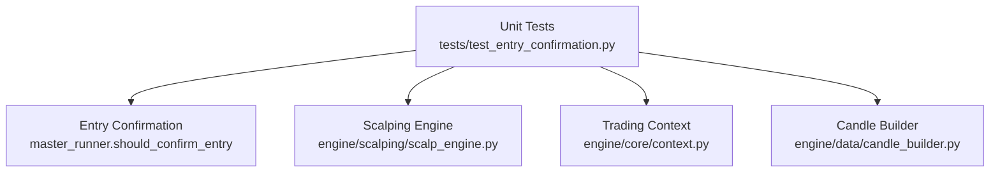
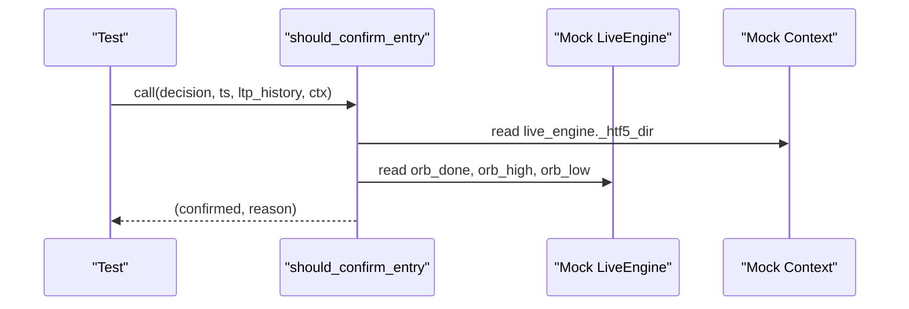
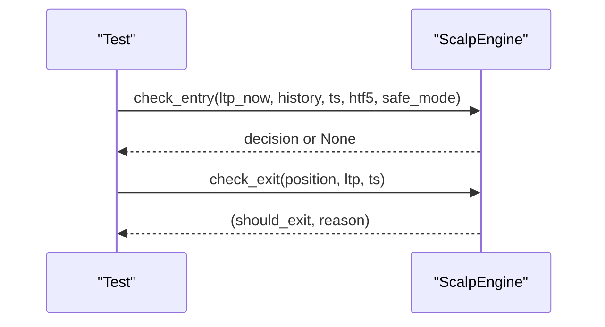
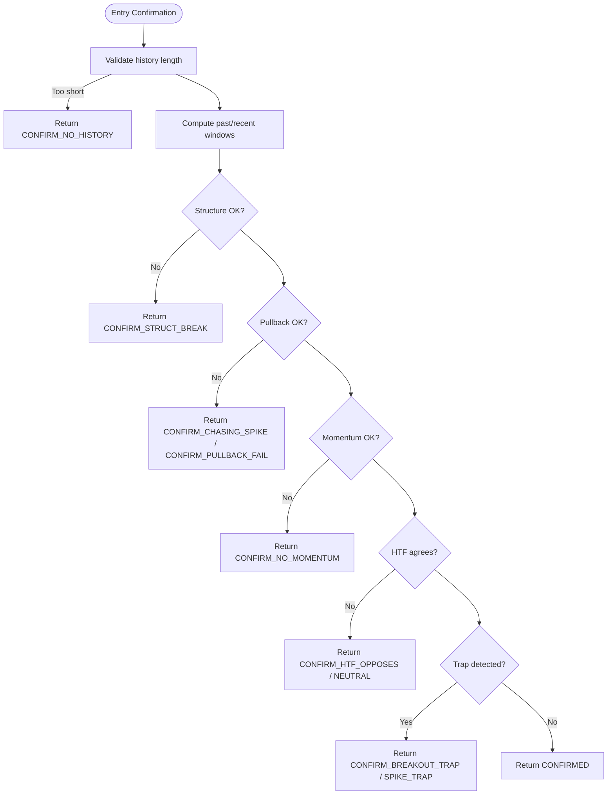
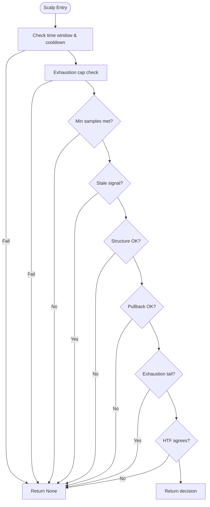
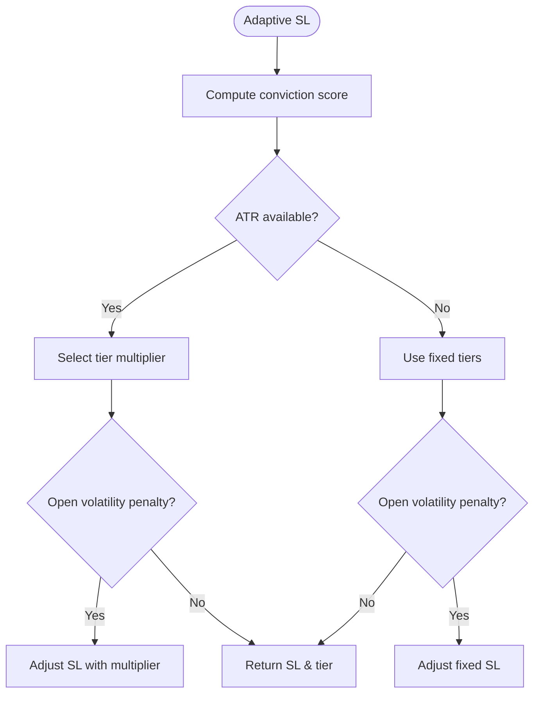
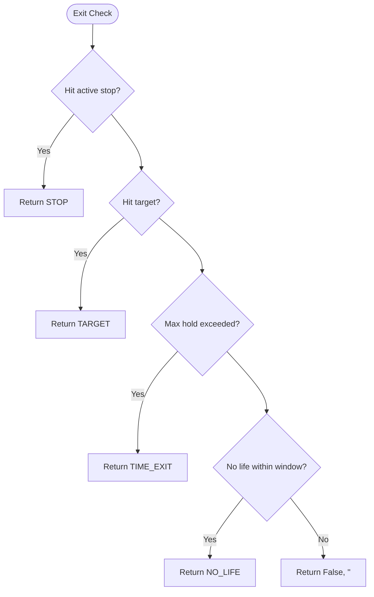
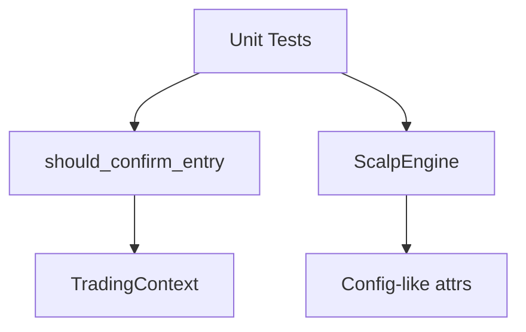

# Unit Testing

<cite>
**Referenced Files in This Document**
- [test_entry_confirmation.py](file://tests/test_entry_confirmation.py)
- [master_runner.py](file://master_runner.py)
- [scalp_engine.py](file://engine/scalping/scalp_engine.py)
- [candle_builder.py](file://engine/data/candle_builder.py)
- [context.py](file://engine/core/context.py)
</cite>

## Table of Contents
1. [Introduction](#introduction)
2. [Project Structure](#project-structure)
3. [Core Components](#core-components)
4. [Architecture Overview](#architecture-overview)
5. [Detailed Component Analysis](#detailed-component-analysis)
6. [Dependency Analysis](#dependency-analysis)
7. [Performance Considerations](#performance-considerations)
8. [Troubleshooting Guide](#troubleshooting-guide)
9. [Conclusion](#conclusion)
10. [Appendices](#appendices)

## Introduction
This document explains the unit testing framework used to validate entry confirmation and scalping logic in the trading system. It focuses on how tests create synthetic tick data using deques with timestamps, mock live engine components and context objects, and assert boolean confirmations with reason codes. It also covers test patterns for structure confirmation (higher highs/lower lows), dynamic pullback bands, momentum confirmation, higher timeframe rules, trap filters, adaptive stop loss calculations, exhaustion filters, and no-life exit mechanisms. Guidance is provided for writing isolated tests for complex strategies by simulating market conditions deterministically.

## Project Structure
The testing approach centers around:
- A dedicated test file that constructs synthetic price histories and mocks external dependencies
- The production entry confirmation function under test
- The scalping engine’s entry/exit logic and adaptive stop-loss calculation
- Supporting runtime components like the candle builder and trading context

**Diagram sources**
- [test_entry_confirmation.py:1-389](file://tests/test_entry_confirmation.py#L1-L389)
- [master_runner.py:799-886](file://master_runner.py#L799-L886)
- [scalp_engine.py:11-280](file://engine/scalping/scalp_engine.py#L11-L280)
- [context.py:1-56](file://engine/core/context.py#L1-L56)
- [candle_builder.py:1-267](file://engine/data/candle_builder.py#L1-L267)

**Section sources**
- [test_entry_confirmation.py:1-389](file://tests/test_entry_confirmation.py#L1-L389)
- [master_runner.py:799-886](file://master_runner.py#L799-L886)
- [scalp_engine.py:11-280](file://engine/scalping/scalp_engine.py#L11-L280)
- [context.py:1-56](file://engine/core/context.py#L1-L56)
- [candle_builder.py:1-267](file://engine/data/candle_builder.py#L1-L267)

## Core Components
- Entry confirmation gates: a multi-stage filter applied after an ML signal fires and before placing orders. It validates structure, pullback, momentum, higher timeframe alignment, and trap avoidance.
- Scalping engine: a momentum-based entry/exit engine with additional safeguards such as exhaustion filtering, adaptive stop-loss tiers, and no-life exits.
- Synthetic data helpers: lightweight utilities to build timestamped price deques for deterministic scenarios.
- Mocks: minimal fakes for live engine and context to isolate behavior without broker or network calls.

Key responsibilities:
- should_confirm_entry returns a boolean and a reason code indicating pass or specific block cause
- ScalpEngine.check_entry returns either a decision dict or None based on multiple filters
- ScalpEngine.adaptive_sl_pts computes stop distance based on conviction and volatility
- ScalpEngine.check_exit enforces stops, targets, time exits, and no-life exits

**Section sources**
- [master_runner.py:799-886](file://master_runner.py#L799-L886)
- [scalp_engine.py:52-172](file://engine/scalping/scalp_engine.py#L52-L172)
- [scalp_engine.py:174-244](file://engine/scalping/scalp_engine.py#L174-L244)
- [scalp_engine.py:246-280](file://engine/scalping/scalp_engine.py#L246-L280)
- [test_entry_confirmation.py:25-46](file://tests/test_entry_confirmation.py#L25-L46)

## Architecture Overview
The unit tests exercise two primary flows:
- Master runner entry confirmation flow: synthetic ticks are fed into should_confirm_entry along with a mocked context containing live engine attributes (e.g., HTF direction and ORB state).
- Scalping engine flow: synthetic ticks are passed to check_entry and check_exit to validate strategy decisions under varied market conditions.

**Diagram sources**
- [master_runner.py:799-886](file://master_runner.py#L799-L886)
- [test_entry_confirmation.py:25-46](file://tests/test_entry_confirmation.py#L25-L46)

**Diagram sources**
- [scalp_engine.py:52-172](file://engine/scalping/scalp_engine.py#L52-L172)
- [scalp_engine.py:246-280](file://engine/scalping/scalp_engine.py#L246-L280)
- [test_entry_confirmation.py:213-389](file://tests/test_entry_confirmation.py#L213-L389)

## Detailed Component Analysis

### Entry Confirmation Gates
The entry confirmation function applies four mandatory checks:
- Structure confirmation: ensures continuation rather than reversal; blocks if price fully gives back the move
- Pullback entry: avoids chasing extremes; requires price to have retraced within a dynamic band
- Momentum confirmation: last few ticks must continue pushing in the intended direction
- Higher timeframe rule: 5m SuperTrend must agree; neutral may block depending on configuration
- Trap filters: failed breakouts (ORB snap-back) and spike-and-reverse patterns are blocked

Tests cover:
- Valid HH/LL continuation leading to confirmation
- Blocks when structure breaks or momentum stalls
- HTF opposition and neutral blocking where required
- Breakout traps and deep give-backs

**Diagram sources**
- [master_runner.py:799-886](file://master_runner.py#L799-L886)

**Section sources**
- [master_runner.py:799-886](file://master_runner.py#L799-L886)
- [test_entry_confirmation.py:72-207](file://tests/test_entry_confirmation.py#L72-L207)

### Scalping Engine Entry Logic
The scalping engine validates entries through:
- Time window constraints and cooldown
- Exhaustion cap to avoid extended moves
- Minimum sample requirement for confirmation
- Stale signal check to avoid late entries
- Structure confirmation (HH/LL) across recent halves
- Dynamic pullback band (tighter in safe mode)
- Exhaustion filter to avoid buying tails of vertical spikes
- HTF agreement requirements (configurable strictness)

Tests cover:
- Normal vs safe mode HTF requirements
- Adaptive stop-loss tiers based on conviction and volatility
- Exhaustion blocking for fresh vertical spikes
- Sparse sample blocking to ensure sufficient confirmation

**Diagram sources**
- [scalp_engine.py:52-172](file://engine/scalping/scalp_engine.py#L52-L172)

**Section sources**
- [scalp_engine.py:52-172](file://engine/scalping/scalp_engine.py#L52-L172)
- [test_entry_confirmation.py:243-352](file://tests/test_entry_confirmation.py#L243-L352)

### Adaptive Stop Loss Calculation
Adaptive SL computation uses a conviction score derived from:
- Move magnitude
- HTF alignment
- VWAP confirmation
- ML engine activity
- Optional ATR-based scaling with open-volatility penalty

Tests verify:
- Strict tier for weak/no-support setups
- Medium tier for moderate conviction
- Wide tier for strong aligned setups
- Open-volatility adjustments when applicable

**Diagram sources**
- [scalp_engine.py:174-244](file://engine/scalping/scalp_engine.py#L174-L244)

**Section sources**
- [scalp_engine.py:174-244](file://engine/scalping/scalp_engine.py#L174-L244)
- [test_entry_confirmation.py:274-285](file://tests/test_entry_confirmation.py#L274-L285)

### Exit Logic and No-Life Mechanism
Exit logic enforces:
- Active stop-loss level (adaptive)
- Target profit
- Maximum hold time
- No-life exit: early cut if trade never reaches breakeven zone within a time window

Tests cover:
- Using position-specific stop-loss instead of hardcoded values
- No-life firing only when trade remains dead beyond threshold
- Not firing when breakeven has been triggered

**Diagram sources**
- [scalp_engine.py:246-280](file://engine/scalping/scalp_engine.py#L246-L280)

**Section sources**
- [scalp_engine.py:246-280](file://engine/scalping/scalp_engine.py#L246-L280)
- [test_entry_confirmation.py:287-389](file://tests/test_entry_confirmation.py#L287-L389)

### Creating Mock Objects and Synthetic Data
Patterns demonstrated in tests:
- Fake live engine: minimal object exposing required attributes (e.g., HTF direction, ORB flags and levels)
- Fake context: wraps fake live engine to satisfy interface expectations
- Synthetic history helper: builds a deque of (datetime, float) pairs representing 1-second ticks over a defined window

These patterns allow deterministic scenario construction without broker or network dependencies.

**Section sources**
- [test_entry_confirmation.py:25-46](file://tests/test_entry_confirmation.py#L25-L46)
- [test_entry_confirmation.py:232-240](file://tests/test_entry_confirmation.py#L232-L240)
- [context.py:1-56](file://engine/core/context.py#L1-L56)

### Test Patterns for Trading Conditions
- Structure confirmation: tests assert both positive cases (HH/LL continuation) and negative cases (no continuation or full reversal)
- Dynamic pullback bands: tests assert blocks when price chases extremes or gives back too much
- Momentum confirmation: tests assert blocks when last ticks do not push in the intended direction
- Higher timeframe rules: tests assert blocks when HTF opposes or is neutral where required
- Trap filters: tests assert blocks for failed breakouts and spike-and-reverse patterns
- Edge cases: tests assert blocks for insufficient history or sparse samples

**Section sources**
- [test_entry_confirmation.py:72-207](file://tests/test_entry_confirmation.py#L72-L207)

### Parameterized and Scenario-Based Testing
While the current tests use explicit functions per scenario, the same pattern can be parameterized by:
- Building a list of scenarios with inputs (side, prices, HTF, ORB state)
- Iterating over scenarios to call the confirmation function and assert expected outcomes
- Centralizing assertions for boolean results and reason codes

This approach reduces duplication and makes it easier to add new edge cases.

[No sources needed since this section provides general guidance]

## Dependency Analysis
The tests depend on:
- master_runner.should_confirm_entry for entry gate validation
- engine.scalping.scalp_engine for scalping entry/exit and adaptive SL logic
- Minimal mocks for live engine and context to isolate behavior
- Deque-based synthetic tick histories for deterministic simulation

**Diagram sources**
- [test_entry_confirmation.py:1-389](file://tests/test_entry_confirmation.py#L1-L389)
- [master_runner.py:799-886](file://master_runner.py#L799-L886)
- [scalp_engine.py:11-280](file://engine/scalping/scalp_engine.py#L11-L280)
- [context.py:1-56](file://engine/core/context.py#L1-L56)

**Section sources**
- [test_entry_confirmation.py:1-389](file://tests/test_entry_confirmation.py#L1-L389)
- [master_runner.py:799-886](file://master_runner.py#L799-L886)
- [scalp_engine.py:11-280](file://engine/scalping/scalp_engine.py#L11-L280)
- [context.py:1-56](file://engine/core/context.py#L1-L56)

## Performance Considerations
- Keep synthetic histories bounded to relevant windows to minimize memory usage
- Use deques with maxlen to automatically drop old ticks
- Avoid unnecessary recomputation by reusing prebuilt scenario arrays
- Ensure tests run quickly by limiting tick counts and avoiding heavy I/O

[No sources needed since this section provides general guidance]

## Troubleshooting Guide
Common issues and resolutions:
- Insufficient history: ensure at least the minimum number of ticks are provided; tests assert CONFIRM_NO_HISTORY when too few
- Sparse confirmation: ensure enough samples meet the minimum threshold; otherwise entry is blocked
- HTF misalignment: verify HTF direction matches side requirements; neutral may block depending on configuration
- Trap detection: check ORB state and recent extremes; failed breakouts will block entries
- No-life exit: confirm breakeven trigger status and elapsed time; no-life only fires when trade remains dead beyond threshold

**Section sources**
- [test_entry_confirmation.py:198-207](file://tests/test_entry_confirmation.py#L198-L207)
- [test_entry_confirmation.py:345-352](file://tests/test_entry_confirmation.py#L345-L352)
- [test_entry_confirmation.py:359-389](file://tests/test_entry_confirmation.py#L359-L389)

## Conclusion
The unit testing framework effectively isolates and validates critical trading logic using synthetic data and minimal mocks. It covers structure confirmation, pullback dynamics, momentum, higher timeframe alignment, trap filters, adaptive stop losses, exhaustion filters, and no-life exits. By following the demonstrated patterns, you can extend coverage to new scenarios, parameterize tests for efficiency, and maintain confidence in strategy behavior under diverse market conditions.

[No sources needed since this section summarizes without analyzing specific files]

## Appendices

### How to Create Synthetic Tick Data
- Build a deque of (datetime, float) pairs representing 1-second ticks
- Use a base timestamp and increment seconds for each tick
- Keep lengths consistent with the windows used by the logic under test

**Section sources**
- [test_entry_confirmation.py:38-41](file://tests/test_entry_confirmation.py#L38-L41)
- [test_entry_confirmation.py:232-240](file://tests/test_entry_confirmation.py#L232-L240)

### How to Mock Live Engine and Context
- Create a fake live engine with required attributes (e.g., HTF direction, ORB flags and levels)
- Wrap it in a fake context to satisfy interface expectations
- Pass these mocks into the functions under test to isolate behavior

**Section sources**
- [test_entry_confirmation.py:25-46](file://tests/test_entry_confirmation.py#L25-L46)
- [context.py:1-56](file://engine/core/context.py#L1-L56)

### Assertion Patterns
- Assert boolean confirmation and exact reason codes for both pass and fail scenarios
- For scalping engine, assert decision presence or absence and exit tuples
- Validate adaptive SL tiers and exit reasons against expected conditions

**Section sources**
- [test_entry_confirmation.py:72-207](file://tests/test_entry_confirmation.py#L72-L207)
- [test_entry_confirmation.py:243-389](file://tests/test_entry_confirmation.py#L243-L389)