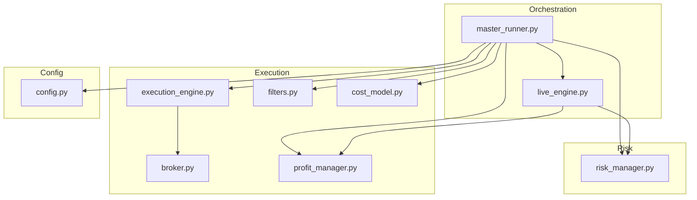
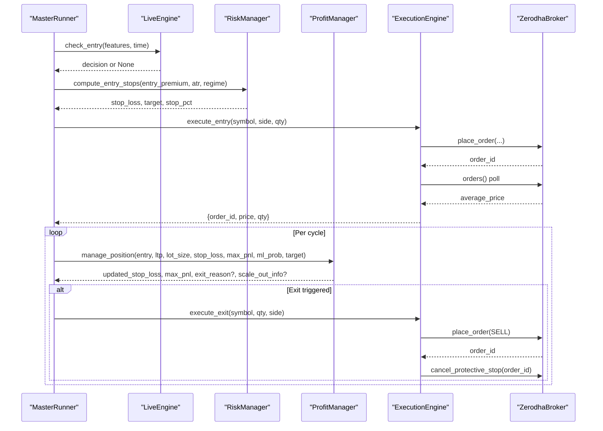
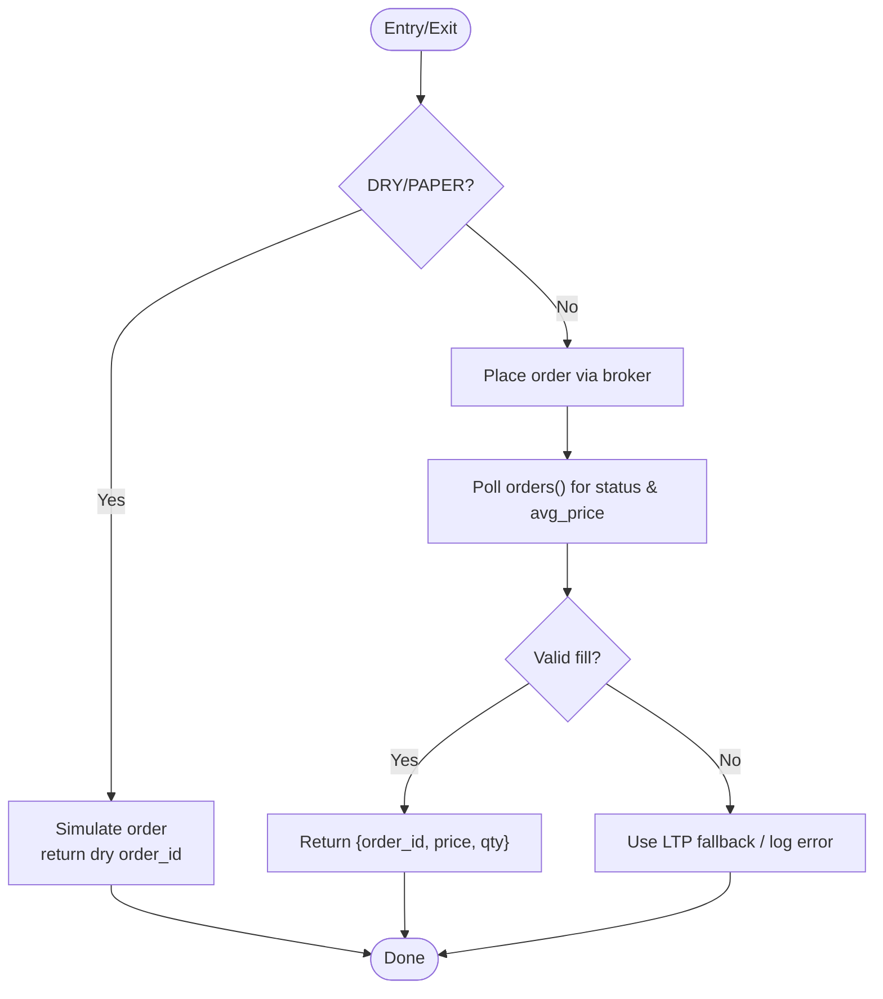
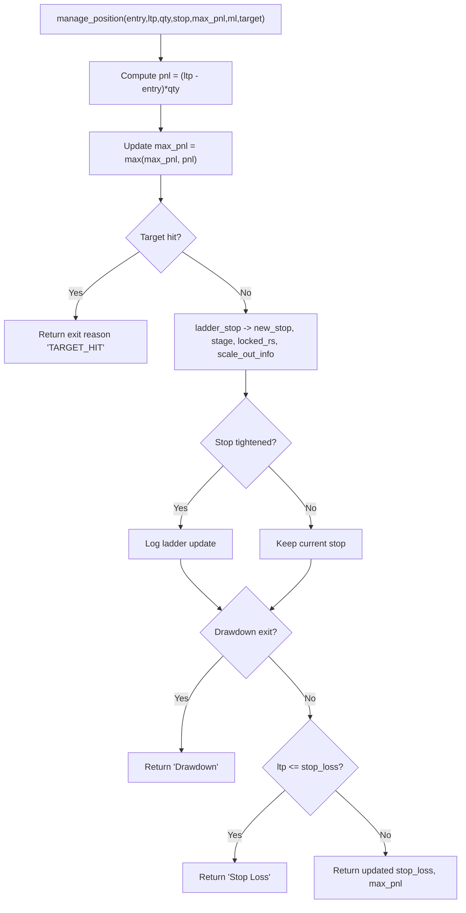
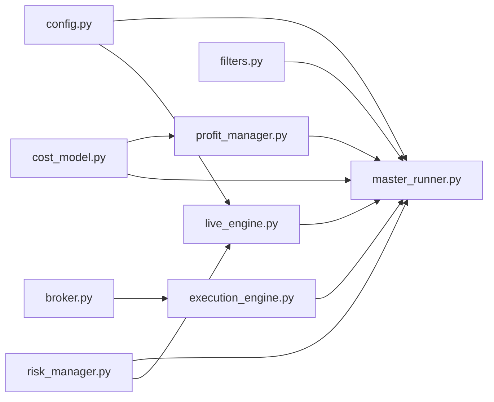

# Execution and Risk Management

<cite>
**Referenced Files in This Document**
- [execution_engine.py](file://engine/execution/execution_engine.py)
- [broker.py](file://engine/execution/broker.py)
- [risk_manager.py](file://engine/risk/risk_manager.py)
- [profit_manager.py](file://engine/execution/profit_manager.py)
- [filters.py](file://engine/execution/filters.py)
- [cost_model.py](file://engine/execution/cost_model.py)
- [config.py](file://engine/config/config.py)
- [live_engine.py](file://engine/live_engine.py)
- [master_runner.py](file://master_runner.py)
</cite>

## Table of Contents
1. Introduction
2. Project Structure
3. Core Components
4. Architecture Overview
5. Detailed Component Analysis
6. Dependency Analysis
7. Performance Considerations
8. Troubleshooting Guide
9. Conclusion

## Introduction
This document explains the execution and risk management subsystem that handles order placement, position management, and risk controls for options trading on Zerodha (Kite). It covers:
- Execution engine architecture with fill validation, protective stops, and duplicate-order guards
- Broker integration layer for Kite API communication and order lifecycle
- Profit manager for trailing stops, scale-out strategies, and exit optimization
- Risk management including position sizing, daily loss limits, circuit breakers, and per-trade risk controls
- Trade validation filters and cost modeling for accurate PnL
- Concrete workflows, configuration examples, error handling scenarios, monitoring/alerting, and how execution decisions are constrained by risk parameters

## Project Structure
The execution and risk system is organized into focused modules:
- Execution: execution_engine, broker, profit_manager, filters, cost_model
- Risk: risk_manager
- Orchestration: live_engine (signal generation), master_runner (session loop, gates, alerts)
- Configuration: config (environment-driven parameters)

**Diagram sources**
- [master_runner.py:52-64](file://master_runner.py#L52-L64)
- [live_engine.py:22-23](file://live_engine.py#L22-L23)
- [execution_engine.py:21-28](file://engine/execution/execution_engine.py#L21-L28)
- [broker.py:11-28](file://engine/execution/broker.py#L11-L28)
- [profit_manager.py:116-170](file://engine/execution/profit_manager.py#L116-L170)
- [risk_manager.py:15-59](file://engine/risk/risk_manager.py#L15-L59)
- [filters.py:4-38](file://engine/execution/filters.py#L4-L38)
- [cost_model.py:22-44](file://engine/execution/cost_model.py#L22-L44)
- [config.py:4-164](file://engine/config/config.py#L4-L164)

**Section sources**
- [master_runner.py:52-64](file://master_runner.py#L52-L64)
- [live_engine.py:22-23](file://live_engine.py#L22-L23)
- [execution_engine.py:21-28](file://engine/execution/execution_engine.py#L21-L28)
- [broker.py:11-28](file://engine/execution/broker.py#L11-L28)
- [profit_manager.py:116-170](file://engine/execution/profit_manager.py#L116-L170)
- [risk_manager.py:15-59](file://engine/risk/risk_manager.py#L15-L59)
- [filters.py:4-38](file://engine/execution/filters.py#L4-L38)
- [cost_model.py:22-44](file://engine/execution/cost_model.py#L22-L44)
- [config.py:4-164](file://engine/config/config.py#L4-L164)

## Core Components
- ExecutionEngine: Places entry/exit orders, validates fills via order book polling, manages broker-side protective stop-loss (SL-M), and prevents duplicate orders.
- ZerodhaBroker: Wraps KiteConnect/KiteTicker for REST and WebSocket market data, option chain subscriptions, and order/position queries.
- ProfitManager: Centralized trailing stop ladder and scale-out logic; converts rupee-based profit locks to premium-level stops and enforces ratcheting behavior.
- RiskManager: Computes per-trade stop-loss and target based on volatility and regime; caps risk per trade.
- Filters: OI wall detection to avoid entering against strong resistance/support.
- CostModel: Authoritative source for round-trip costs and net PnL calculations across the system.
- Config: Environment-driven parameters controlling session filters, risk limits, trailing/scale-out behavior, and scalping rules.
- LiveEngine: Builds features, runs ML predictions, and decides entries/exits; integrates with risk and profit management.
- MasterRunner: Orchestrates the live loop, applies global risk gates (daily loss limit, trade counts), coordinates SL-M lifecycle, and sends alerts.

**Section sources**
- [execution_engine.py:21-371](file://engine/execution/execution_engine.py#L21-L371)
- [broker.py:11-389](file://engine/execution/broker.py#L11-L389)
- [profit_manager.py:1-225](file://engine/execution/profit_manager.py#L1-L225)
- [risk_manager.py:1-60](file://engine/risk/risk_manager.py#L1-L60)
- [filters.py:1-38](file://engine/execution/filters.py#L1-L38)
- [cost_model.py:1-45](file://engine/execution/cost_model.py#L1-L45)
- [config.py:1-164](file://engine/config/config.py#L1-L164)
- [live_engine.py:71-800](file://engine/live_engine.py#L71-L800)
- [master_runner.py:1-200](file://master_runner.py#L1-L200)

## Architecture Overview
The system follows a layered design:
- Signal generation in LiveEngine uses ML and technical indicators to propose trades.
- MasterRunner enforces global risk gates (daily loss limit, trade caps, cooldowns) and orchestrates execution.
- ExecutionEngine places orders via ZerodhaBroker, validates fills, and manages broker-side protective stops.
- ProfitManager continuously updates trailing stops and triggers scale-outs based on realized PnL.
- RiskManager sets initial stops/targets grounded in volatility and regime.
- CostModel ensures all PnL reporting and profit locks account for real transaction costs.

**Diagram sources**
- [live_engine.py:798-800](file://engine/live_engine.py#L798-L800)
- [risk_manager.py:20-59](file://engine/risk/risk_manager.py#L20-L59)
- [execution_engine.py:94-154](file://engine/execution/execution_engine.py#L94-L154)
- [execution_engine.py:160-215](file://engine/execution/execution_engine.py#L160-L215)
- [execution_engine.py:235-292](file://engine/execution/execution_engine.py#L235-L292)
- [profit_manager.py:173-225](file://engine/execution/profit_manager.py#L173-L225)
- [broker.py:346-389](file://engine/execution/broker.py#L346-L389)

## Detailed Component Analysis

### Execution Engine
Responsibilities:
- Entry/exit order placement with duplicate-order guard
- Fill validation by polling order book for actual average_price
- Broker-side protective stop-loss (SL-M) placement, modification, cancellation
- Position verification after exits

Key behaviors:
- get_lot_size resolves instrument lot size from broker’s instrument map with fallback
- _get_fill_price polls orders until COMPLETE or max attempts; returns fallback if not confirmed
- execute_entry places BUY market order; execute_exit places SELL market order; both support DRY_RUN/paper mode
- place_protective_stop computes tick-aligned trigger and places SELL SL-M; modify and cancel supported
- verify_flat checks broker positions post-exit to ensure closure

**Diagram sources**
- [execution_engine.py:94-154](file://engine/execution/execution_engine.py#L94-L154)
- [execution_engine.py:160-215](file://engine/execution/execution_engine.py#L160-L215)
- [execution_engine.py:52-88](file://engine/execution/execution_engine.py#L52-L88)

**Section sources**
- [execution_engine.py:21-371](file://engine/execution/execution_engine.py#L21-L371)

### Broker Integration Layer (Zerodha)
Responsibilities:
- Initialize KiteConnect and load instruments
- Manage WebSocket feed (KiteTicker) for LTP/OI and re-subscribe on reconnect
- Provide LTP, bid/ask, historical data, ATM option selection, and option chain near ATM
- Order and position APIs wrapper

Highlights:
- start_feed subscribes to tokens, preserves OI across mixed packet sizes, and restores option-chain subscriptions after reconnect
- subscribe_options computes ATM from BANK NIFTY spot and subscribes CE/PE around ATM with MODE_FULL for OI
- refresh_atm_if_drifted re-subscribes when ATM drifts beyond threshold
- ltp supports both index and instrument symbols; get_positions returns net positions

**Section sources**
- [broker.py:11-389](file://engine/execution/broker.py#L11-L389)

### Profit Manager (Trailing Stops, Scale-Out, Exit Optimization)
Responsibilities:
- Convert rupee-based profit locks to premium-level stops
- Enforce ratcheting (stop only tightens)
- Trigger scale-out at configured profit thresholds
- Manage virtual stops evaluated each cycle

Design notes:
- Uses max_pnl (Rs) as source of truth; never locks below round-trip cost
- Tiered locking percentages increase as profits grow
- Trailing activates after TRAIL_ACTIVATION_PTS and trails TRAIL_DISTANCE_PTS behind peak
- manage_position evaluates fixed target, ladder stop tightening, drawdown exit, and hard stop

**Diagram sources**
- [profit_manager.py:116-170](file://engine/execution/profit_manager.py#L116-L170)
- [profit_manager.py:173-225](file://engine/execution/profit_manager.py#L173-L225)

**Section sources**
- [profit_manager.py:1-225](file://engine/execution/profit_manager.py#L1-L225)

### Risk Management System
Responsibilities:
- Compute per-trade stop-loss and target based on volatility and regime
- Cap worst-case risk per trade
- Integrate with profit manager for trailing exits

Key algorithms:
- position_size scales base risk by confidence
- compute_entry_stops calculates stop distance using delta and ATR, clamped between floor and ceiling; target set at 3.5R; stop_loss below entry for long options (both CE and PE bought)

Risk constraints enforced elsewhere:
- Daily loss limit checked every cycle in master runner
- Max trades per day and scalp-specific circuit breakers
- Re-entry cooldowns and same-symbol cooldowns

**Section sources**
- [risk_manager.py:15-59](file://engine/risk/risk_manager.py#L15-L59)
- [config.py:12-18](file://engine/config/config.py#L12-L18)
- [master_runner.py:1562-1571](file://master_runner.py#L1562-L1571)
- [master_runner.py:1974-1996](file://master_runner.py#L1974-L1996)

### Filtering Mechanisms for Trade Validation
- OI wall filter detects strong resistance/support near ATM and blocks entries against it
- Used before entry to avoid fighting large open interest walls

Usage:
- Called in master runner prior to entry confirmation to block low-quality setups

**Section sources**
- [filters.py:4-38](file://engine/execution/filters.py#L4-L38)
- [master_runner.py:1-200](file://master_runner.py#L1-L200)

### Cost Modeling for Accurate PnL
- Authoritative module for round-trip cost and net PnL
- Ensures consistent cost accounting across profit manager, journals, analytics, and reports
- Supports environment overrides for cost per lot and lot size

**Section sources**
- [cost_model.py:1-45](file://engine/execution/cost_model.py#L1-L45)
- [profit_manager.py:75-80](file://engine/execution/profit_manager.py#L75-L80)

### Order Placement Workflows and Examples
- Entry workflow: signal approved → compute stops → place BUY market → validate fill → set broker SL-M
- Exit workflow: profit manager triggers exit → place SELL market → cancel broker SL-M → verify flat
- Paper/DRY_RUN modes simulate orders without live execution

Configuration examples:
- Set DAILY_LOSS_LIMIT, MAX_TRADES_PER_DAY, REENTRY_COOLDOWN, SAME_SYMBOL_COOLDOWN
- Configure trailing activation and distance: TRAIL_ACTIVATION_PTS, TRAIL_DISTANCE_PTS
- Configure scale-out: SCALE_OUT_PCT, SCALE_OUT_PTS
- Scalp controls: SCALP_MAX_CONSEC_LOSSES, SCALP_MAX_TRADES_PER_DAY, SCALP_SL_*

Error handling scenarios:
- Fill not confirmed after polling → use fallback and log warning
- Order placement exceptions → log error and abort
- SL-M modify/cancel failures → critical log, Telegram alert, pause new entries while retaining protection

**Section sources**
- [execution_engine.py:94-215](file://engine/execution/execution_engine.py#L94-L215)
- [execution_engine.py:235-292](file://engine/execution/execution_engine.py#L235-L292)
- [master_runner.py:171-200](file://master_runner.py#L171-L200)
- [config.py:12-164](file://engine/config/config.py#L12-L164)

### Relationship Between Execution Decisions and Risk Constraints
- Positions sized by capital and confidence via position_size; per-trade risk capped by stop distance and lot size
- Daily loss limit halts trading when breached
- Circuit breakers stop scalp entries after consecutive losses or daily cap
- Re-entry cooldowns prevent immediate re-entry into reversing instruments
- Profit manager ensures exits protect gains and reduce exposure quickly

Position sizing based on volatility and equity:
- compute_entry_stops uses ATR and delta to derive stop distance, ensuring risk aligns with volatility
- Lot size sourced from instrument map or config to keep risk per trade bounded

**Section sources**
- [risk_manager.py:15-59](file://engine/risk/risk_manager.py#L15-L59)
- [execution_engine.py:34-46](file://engine/execution/execution_engine.py#L34-L46)
- [master_runner.py:1562-1571](file://master_runner.py#L1562-L1571)
- [master_runner.py:1974-1996](file://master_runner.py#L1974-L1996)

### Monitoring and Alerting
- Daily loss limit breach triggers system stop and Telegram alert
- SL-M lifecycle failures trigger critical logs, Telegram alerts, and pause new entries
- Strategy drift monitor generates alerts when performance degrades
- Option feed diagnostics help detect subscription drift and missing OI

**Section sources**
- [master_runner.py:1562-1571](file://master_runner.py#L1562-L1571)
- [master_runner.py:171-200](file://master_runner.py#L171-L200)
- [broker.py:230-250](file://engine/execution/broker.py#L230-L250)
- [master_runner.py:2140-2149](file://master_runner.py#L2140-L2149)

## Dependency Analysis

**Diagram sources**
- [config.py:4-164](file://engine/config/config.py#L4-L164)
- [risk_manager.py:15-59](file://engine/risk/risk_manager.py#L15-L59)
- [filters.py:4-38](file://engine/execution/filters.py#L4-L38)
- [cost_model.py:22-44](file://engine/execution/cost_model.py#L22-L44)
- [broker.py:11-389](file://engine/execution/broker.py#L11-L389)
- [execution_engine.py:21-371](file://engine/execution/execution_engine.py#L21-L371)
- [profit_manager.py:116-225](file://engine/execution/profit_manager.py#L116-L225)
- [live_engine.py:71-800](file://engine/live_engine.py#L71-L800)
- [master_runner.py:52-64](file://master_runner.py#L52-L64)

**Section sources**
- [master_runner.py:52-64](file://master_runner.py#L52-L64)
- [live_engine.py:71-800](file://engine/live_engine.py#L71-L800)
- [execution_engine.py:21-371](file://engine/execution/execution_engine.py#L21-L371)
- [broker.py:11-389](file://engine/execution/broker.py#L11-L389)
- [profit_manager.py:116-225](file://engine/execution/profit_manager.py#L116-L225)
- [risk_manager.py:15-59](file://engine/risk/risk_manager.py#L15-L59)
- [filters.py:4-38](file://engine/execution/filters.py#L4-L38)
- [cost_model.py:22-44](file://engine/execution/cost_model.py#L22-L44)
- [config.py:4-164](file://engine/config/config.py#L4-L164)

## Performance Considerations
- Fill validation uses bounded polling to avoid blocking; fallback prices used when necessary
- Option chain subscriptions refreshed only on ATM drift to minimize overhead
- Virtual stops evaluated once per cycle; broker-side SL-M reduces reliance on polling
- Cost-aware profit ladder avoids locking below costs, reducing unnecessary exits
- Scalp circuit breakers and daily caps limit overtrading and reduce churn costs

[No sources needed since this section provides general guidance]

## Troubleshooting Guide
Common issues and resolutions:
- Fill not confirmed: Check order status via broker.orders(); if rejected/cancelled, handle accordingly and do not track position
- SL-M modify/cancel failure: Critical alert logged; entries paused; investigate network/API errors; resume manually when resolved
- Daily loss limit breached: System stops; review strategy and adjust parameters; wait for next session
- No option chain data: Ensure subscribe_options ran and ATM computed; check instrument list freshness
- High slippage: Monitor [SLIPPAGE] warnings; consider adjusting entry filters or spread thresholds

**Section sources**
- [execution_engine.py:52-88](file://engine/execution/execution_engine.py#L52-L88)
- [execution_engine.py:235-292](file://engine/execution/execution_engine.py#L235-L292)
- [master_runner.py:1562-1571](file://master_runner.py#L1562-L1571)
- [broker.py:230-250](file://engine/execution/broker.py#L230-L250)

## Conclusion
The execution and risk management subsystem combines robust order execution, intelligent trailing exits, and comprehensive risk controls to deliver disciplined, cost-aware trading. ExecutionEngine ensures reliable order placement and fill validation; ZerodhaBroker provides resilient market data and order services; ProfitManager protects gains with adaptive trailing and scale-outs; RiskManager bounds per-trade risk; and MasterRunner enforces global safeguards and alerts. Together, these components form a production-ready framework for automated options trading with strong risk discipline and operational resilience.

[No sources needed since this section summarizes without analyzing specific files]