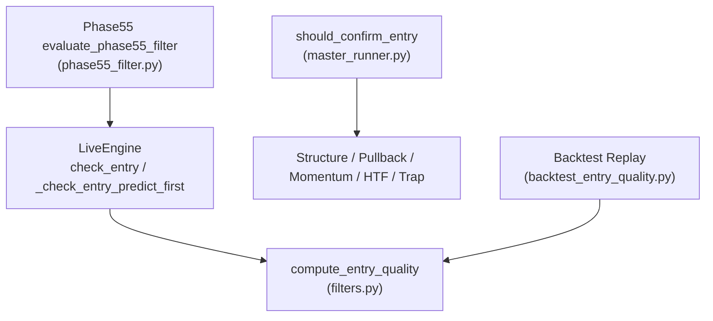
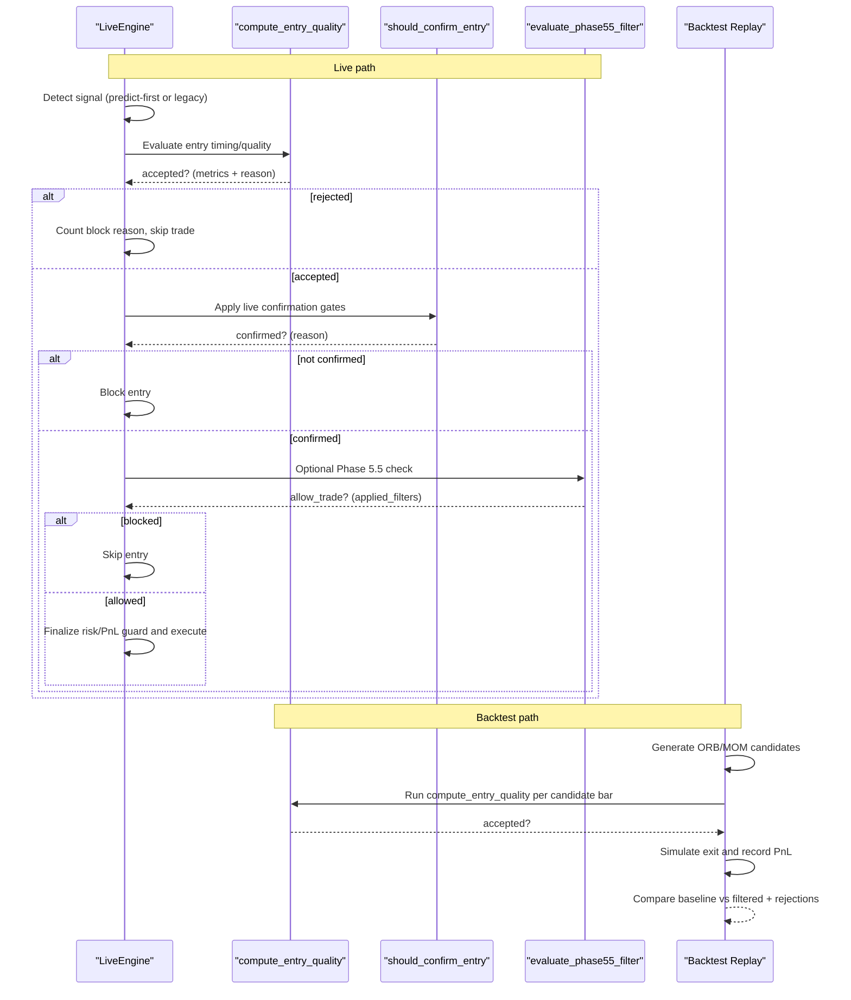
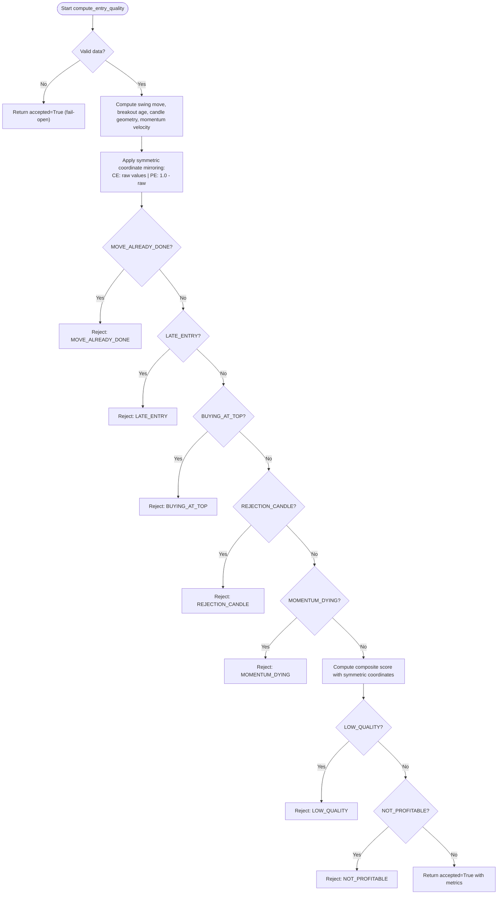
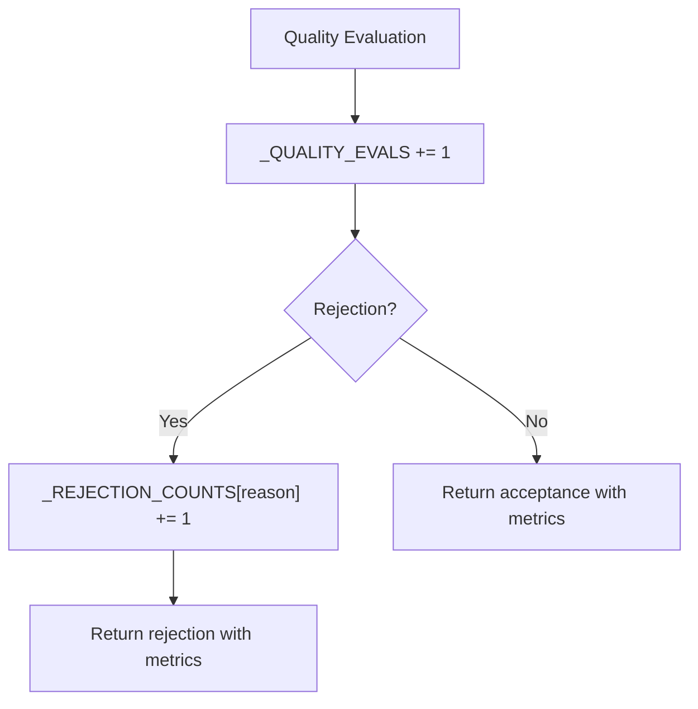
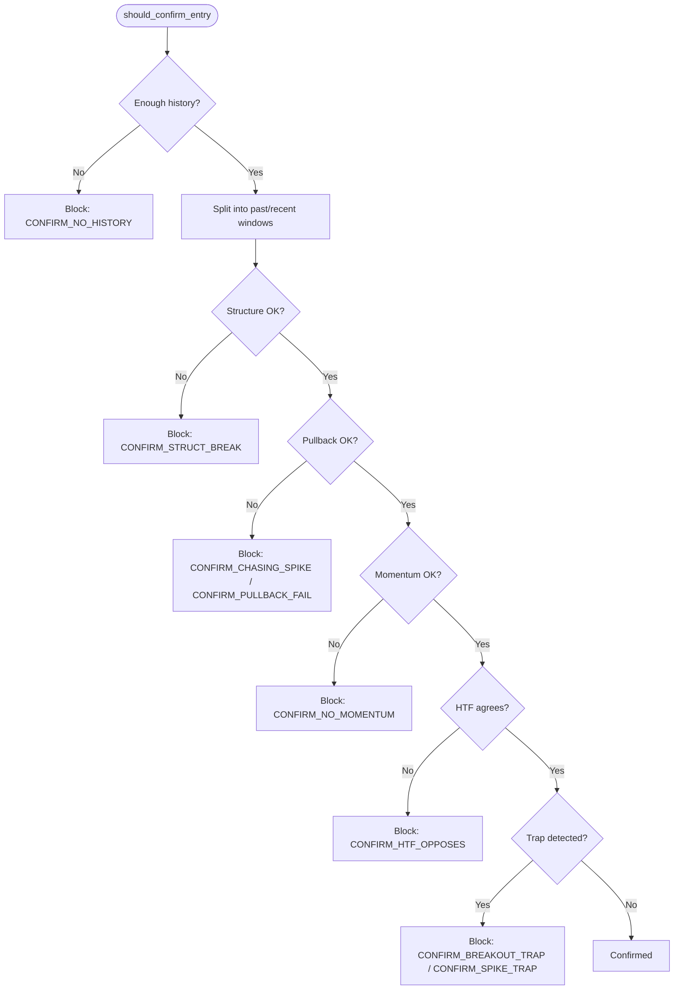
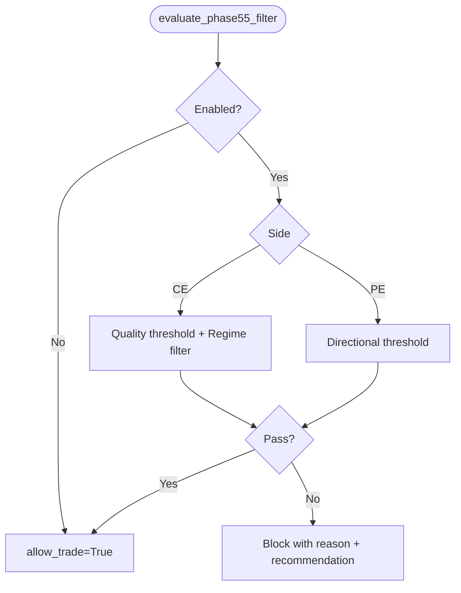
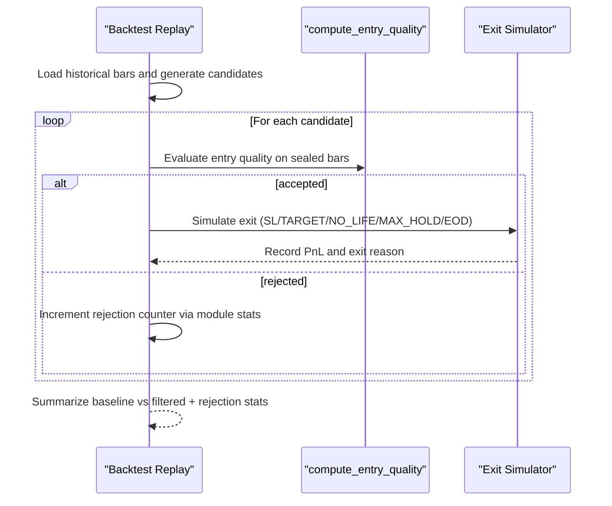
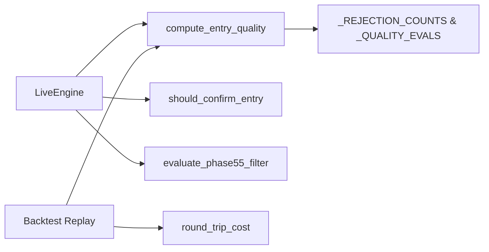

# Entry Quality Filter

<cite>
**Referenced Files in This Document**
- [filters.py](file://engine/execution/filters.py)
- [live_engine.py](file://engine/live_engine.py)
- [master_runner.py](file://master_runner.py)
- [backtest_entry_quality.py](file://scripts/backtest_entry_quality.py)
- [phase55_filter.py](file://engine/intelligence/phase55_filter.py)
- [test_entry_confirmation.py](file://tests/test_entry_confirmation.py)
</cite>

## Update Summary
**Changes Made**
- Updated Entry Quality Filter to reflect symmetric coordinate handling for both CE and PE instruments
- Enhanced documentation of the seven-stage rejection pipeline with consistent behavior across option types
- Added comprehensive coverage of module-level rejection counters (_REJECTION_COUNTS, _QUALITY_EVALS) for aggregate statistics
- Updated threshold configuration section to document the mirrored coordinate system where CE uses raw values and PE uses inverted values (1.0 - raw)
- Enhanced quality scoring mechanism documentation with symmetric coordinate handling

## Table of Contents
1. [Introduction](#introduction)
2. [Project Structure](#project-structure)
3. [Core Components](#core-components)
4. [Architecture Overview](#architecture-overview)
5. [Detailed Component Analysis](#detailed-component-analysis)
6. [Dependency Analysis](#dependency-analysis)
7. [Performance Considerations](#performance-considerations)
8. [Troubleshooting Guide](#troubleshooting-guide)
9. [Conclusion](#conclusion)

## Introduction
This document explains the Entry Quality Filter system that prevents low-quality or mistimed entries from being executed. It combines:
- A rejection-first entry timing and quality filter based on completed 1-minute candles and momentum velocity with **symmetric coordinate handling for CE and PE options**.
- An additional Phase 5.5 decision filter for CE/PE confidence thresholds and regime awareness.
- Live confirmation gates (structure, pullback, momentum, HTF alignment, trap filters) used by the master runner.
- A backtest replay script to measure baseline vs filtered performance and collect rejection statistics.

The goal is to reduce whipsaw entries, avoid chasing extended moves, and ensure trades have a reasonable chance of covering costs and moving favorably.

## Project Structure
Entry quality filtering spans several modules:
- Execution-time quality gate: engine/execution/filters.py
- Live engine integration points: engine/live_engine.py
- Master-level confirmation gates: master_runner.py
- Backtest replay and stats: scripts/backtest_entry_quality.py
- Phase 5.5 ML-aware filter: engine/intelligence/phase55_filter.py
- Unit tests for live confirmation gates: tests/test_entry_confirmation.py

**Diagram sources**
- [live_engine.py:1090-1111](file://engine/live_engine.py#L1090-L1111)
- [filters.py:126-264](file://engine/execution/filters.py#L126-L264)
- [master_runner.py:799-886](file://master_runner.py#L799-L886)
- [backtest_entry_quality.py:118-125](file://scripts/backtest_entry_quality.py#L118-L125)
- [phase55_filter.py:96-199](file://engine/intelligence/phase55_filter.py#L96-L199)

**Section sources**
- [filters.py:1-264](file://engine/execution/filters.py#L1-L264)
- [live_engine.py:1090-1111](file://engine/live_engine.py#L1090-L1111)
- [master_runner.py:799-886](file://master_runner.py#L799-L886)
- [backtest_entry_quality.py:1-207](file://scripts/backtest_entry_quality.py#L1-L207)
- [phase55_filter.py:1-200](file://engine/intelligence/phase55_filter.py#L1-L200)
- [test_entry_confirmation.py:1-389](file://tests/test_entry_confirmation.py#L1-L389)

## Core Components
- compute_entry_quality: Rejection-first filter using OHLC geometry, swing move, breakout age, candle wick, momentum velocity, composite score, and cost coverage with **symmetric coordinate handling for CE and PE options**. Returns accepted/rejected with metrics and reason.
- should_confirm_entry: Live confirmation gates applied after an ML signal fires but before execution: structure continuation, pullback band, momentum push, HTF alignment, and trap detection.
- evaluate_phase55_filter: Optional ML-aware filter that can block CE/PE entries based on side-specific confidence thresholds and regime conditions.
- Backtest replay: Generates ORB/momentum candidates, runs compute_entry_quality per bar, simulates exits, and compares baseline vs filtered results plus rejection breakdown.

**Section sources**
- [filters.py:126-264](file://engine/execution/filters.py#L126-L264)
- [master_runner.py:799-886](file://master_runner.py#L799-L886)
- [phase55_filter.py:96-199](file://engine/intelligence/phase55_filter.py#L96-L199)
- [backtest_entry_quality.py:86-155](file://scripts/backtest_entry_quality.py#L86-L155)

## Architecture Overview
The entry pipeline integrates multiple layers of quality control:

**Diagram sources**
- [live_engine.py:1090-1111](file://engine/live_engine.py#L1090-L1111)
- [filters.py:126-264](file://engine/execution/filters.py#L126-L264)
- [master_runner.py:799-886](file://master_runner.py#L799-L886)
- [phase55_filter.py:96-199](file://engine/intelligence/phase55_filter.py#L96-L199)
- [backtest_entry_quality.py:86-155](file://scripts/backtest_entry_quality.py#L86-L155)

## Detailed Component Analysis

### Entry Timing and Quality Filter (compute_entry_quality)
- Purpose: Reject entries that are late, already moved too far, poorly timed, or unlikely to cover costs.
- Inputs: Completed 1m OHLC window, side (CE/PE), last price, timestamp, optional ORB state, round-trip cost.
- Key checks (in order):
  - MOVE_ALREADY_DONE: Move off recent swing exceeds threshold.
  - LATE_ENTRY: Breakout older than configured seconds.
  - BUYING_AT_TOP: Candle closed at adverse extreme with **symmetric coordinate handling**.
  - REJECTION_CANDLE: Adverse wick dominates range.
  - MOMENTUM_DYING: Momentum velocity falling while price still extends.
  - LOW_QUALITY: Composite score below minimum with **symmetric coordinate scoring**.
  - NOT_PROFITABLE: Expected premium move cannot cover round-trip cost.
- Outputs: accepted flag, reason if rejected, metrics including move_pct, wick_ratio, close_position, breakout_age_s, momentum_velocity_now/prev, score.

**Updated Symmetric Coordinate Handling:**
- **Mirrored Coordinates System**: CE uses raw values while PE uses inverted values (1.0 - raw) to maintain consistent threshold logic
- **CLOSE_POS_MAX**: Standard threshold for buying-at-top detection across all options in mirrored coordinates
- **CLOSE_POS_GOOD**: Threshold for quality scoring bonus in mirrored coordinates
- **Adverse Wick Calculation**: Direction-specific wick calculation that works consistently across option types

**Diagram sources**
- [filters.py:126-264](file://engine/execution/filters.py#L126-L264)

**Section sources**
- [filters.py:126-264](file://engine/execution/filters.py#L126-L264)

### Module-Level Rejection Counters
- Purpose: Track aggregate statistics for backtest reporting and EOD analysis
- Components:
  - `_REJECTION_COUNTS`: Dictionary tracking rejection reasons and their frequencies
  - `_QUALITY_EVALS`: Counter for total quality evaluations performed
- Functions:
  - `get_rejection_stats()`: Returns comprehensive rejection statistics
  - `reset_rejection_stats()`: Clears counters between backtest folds
  - `_eq_reject()`: Increments rejection counter and returns rejection result

**Diagram sources**
- [filters.py:66-89](file://engine/execution/filters.py#L66-L89)

**Section sources**
- [filters.py:66-89](file://engine/execution/filters.py#L66-L89)

### Live Confirmation Gates (should_confirm_entry)
- Purpose: Ensure structural continuation, proper pullback, momentum, HTF alignment, and no trap patterns before executing.
- Checks:
  - Structure confirmation: Avoid full reversal of prior move.
  - Pullback entry: Avoid chasing extremes; require retracement within dynamic band.
  - Momentum: Last ticks must continue pushing direction.
  - HTF rule: 5m SuperTrend must agree (neutral/opposing blocks).
  - Trap filters: Failed breakout snap-back and spike-and-reverse patterns.
- Output: (confirmed, reason).

**Diagram sources**
- [master_runner.py:799-886](file://master_runner.py#L799-L886)

**Section sources**
- [master_runner.py:799-886](file://master_runner.py#L799-L886)
- [test_entry_confirmation.py:72-192](file://tests/test_entry_confirmation.py#L72-L192)

### Phase 5.5 Decision Filter
- Purpose: Optional ML-aware gating that can block CE/PE entries based on side-specific confidence thresholds and regime conditions.
- Behavior:
  - CE: Quality confidence threshold; mixed regime blocking when enabled.
  - PE: Directional confidence threshold.
  - Returns allow_trade, confidence_adjustment, blocking_reason, recommendation, applied_filters.
- Integration: Can be applied in the live engine flow to further refine entries.

**Diagram sources**
- [phase55_filter.py:96-199](file://engine/intelligence/phase55_filter.py#L96-L199)

**Section sources**
- [phase55_filter.py:1-200](file://engine/intelligence/phase55_filter.py#L1-L200)

### Backtest Replay and Metrics
- Purpose: Reproduce ORB/momentum candidates on sealed bars, run compute_entry_quality per bar, simulate exits, and compare baseline vs filtered outcomes. Also aggregates rejection reasons.
- Highlights:
  - Candidate generation: ORB breakouts and momentum bursts.
  - Exit model: SL, target, no-life cutoff, max hold, delta proxy, lot size, round-trip cost.
  - Aggregation: Win rate, net PnL, exit mix, total evaluations, rejections by reason.
  - **Statistics Collection**: Uses module-level counters to track evaluation counts and rejection breakdowns.

**Diagram sources**
- [backtest_entry_quality.py:86-155](file://scripts/backtest_entry_quality.py#L86-L155)
- [filters.py:71-89](file://engine/execution/filters.py#L71-L89)

**Section sources**
- [backtest_entry_quality.py:1-207](file://scripts/backtest_entry_quality.py#L1-L207)
- [filters.py:71-89](file://engine/execution/filters.py#L71-L89)

## Dependency Analysis
- LiveEngine depends on compute_entry_quality for both predict-first and legacy paths to enforce consistent entry quality.
- MasterRunner's should_confirm_entry provides additional live confirmation gates independent of the candle-based quality filter.
- Phase 5.5 filter is optional and can be integrated to adjust allowance based on ML confidence and regime.
- Backtest Replay depends on compute_entry_quality and round_trip_cost to simulate realistic trading economics.
- **Enhanced Statistics**: Module-level counters provide aggregate data for backtest analysis and reporting.

**Diagram sources**
- [live_engine.py:1090-1111](file://engine/live_engine.py#L1090-L1111)
- [filters.py:126-264](file://engine/execution/filters.py#L126-L264)
- [master_runner.py:799-886](file://master_runner.py#L799-L886)
- [phase55_filter.py:96-199](file://engine/intelligence/phase55_filter.py#L96-L199)
- [backtest_entry_quality.py:23-33](file://scripts/backtest_entry_quality.py#L23-L33)

**Section sources**
- [live_engine.py:1090-1111](file://engine/live_engine.py#L1090-L1111)
- [filters.py:126-264](file://engine/execution/filters.py#L126-L264)
- [master_runner.py:799-886](file://master_runner.py#L799-L886)
- [phase55_filter.py:96-199](file://engine/intelligence/phase55_filter.py#L96-L199)
- [backtest_entry_quality.py:23-33](file://scripts/backtest_entry_quality.py#L23-L33)

## Performance Considerations
- compute_entry_quality operates on completed 1m candles and uses lightweight calculations (swing extremes, wick ratios, momentum velocity). Complexity is linear in the lookback window size.
- The rejection-first design ensures early exits on failing rules, minimizing unnecessary computation.
- Backtest Replay processes only sealed bars and throttles momentum candidates to avoid burst spam, keeping runtime efficient.
- Phase 5.5 filter adds minimal overhead via confidence lookups and regime inference.
- **Symmetric coordinate handling** adds negligible computational overhead while providing consistent behavior across option types.
- **Module-level counters** provide O(1) increment operations with minimal memory overhead.

## Troubleshooting Guide
Common rejection reasons and diagnostics:
- MOVE_ALREADY_DONE: Entry occurs after a large move; consider waiting for pullback or next setup.
- LATE_ENTRY: Breakout too old; wait for fresh signals.
- BUYING_AT_TOP / REJECTION_CANDLE: Poor candle geometry; avoid chasing or entering into adverse wicks.
- MOMENTUM_DYING: Momentum weakening while price extends; wait for consolidation or trend resumption.
- LOW_QUALITY: Composite score insufficient; review thresholds and market regime.
- NOT_PROFITABLE: Expected move cannot cover costs; adjust lot size, delta proxy, or wait for better setups.
- Live confirmation blocks: CONFIRM_NO_HISTORY, CONFIRM_STRUCT_BREAK, CONFIRM_CHASING_SPIKE, CONFIRM_PULLBACK_FAIL, CONFIRM_NO_MOMENTUM, CONFIRM_HTF_OPPOSES, CONFIRM_BREAKOUT_TRAP, CONFIRM_SPIKE_TRAP.

**Updated Statistics Tracking:**
- Use `get_rejection_stats()` to retrieve comprehensive rejection breakdowns
- Monitor `_QUALITY_EVALS` to track total quality evaluations
- Reset counters between backtest folds using `reset_rejection_stats()`

Use backtest replay to inspect rejection breakdowns and validate parameter changes.

**Section sources**
- [filters.py:126-264](file://engine/execution/filters.py#L126-L264)
- [master_runner.py:799-886](file://master_runner.py#L799-L886)
- [backtest_entry_quality.py:198-202](file://scripts/backtest_entry_quality.py#L198-L202)

## Conclusion
The Entry Quality Filter system combines robust, rejection-first timing and quality checks with **symmetric coordinate handling for CE and PE options**, live confirmation gates, and optional ML-aware Phase 5.5 filtering. The symmetric approach addresses the different characteristics between call and put options through mirrored coordinates, providing consistent behavior across option types while maintaining the same threshold logic. The addition of module-level rejection counters enables comprehensive statistical analysis and reporting. Together, these layers significantly reduce low-probability entries, protect against traps and late entries, and improve the expected profitability of trades. The backtest replay tool enables continuous validation and tuning of parameters and thresholds with detailed rejection statistics.