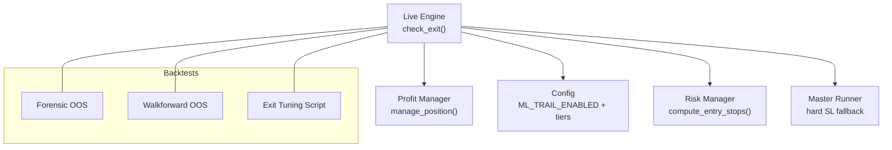
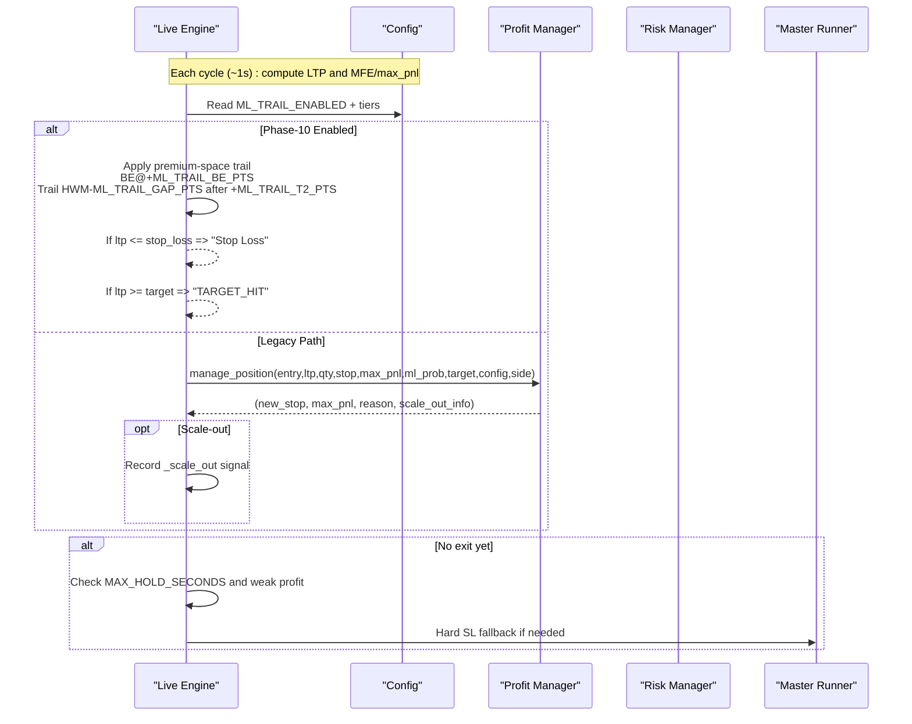
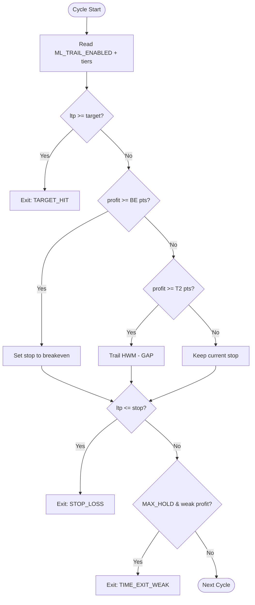
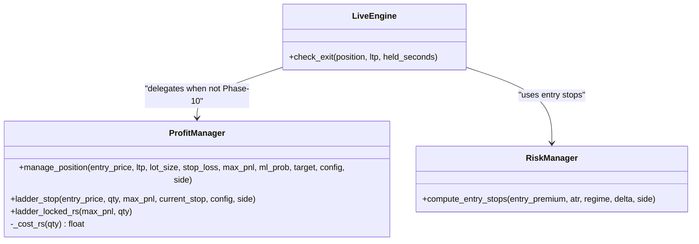
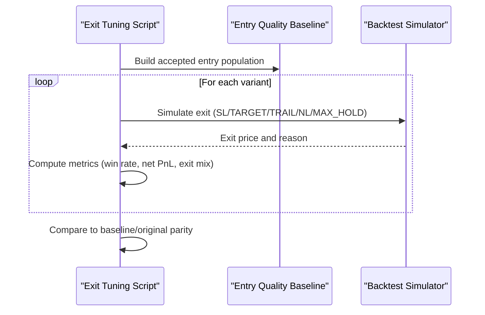
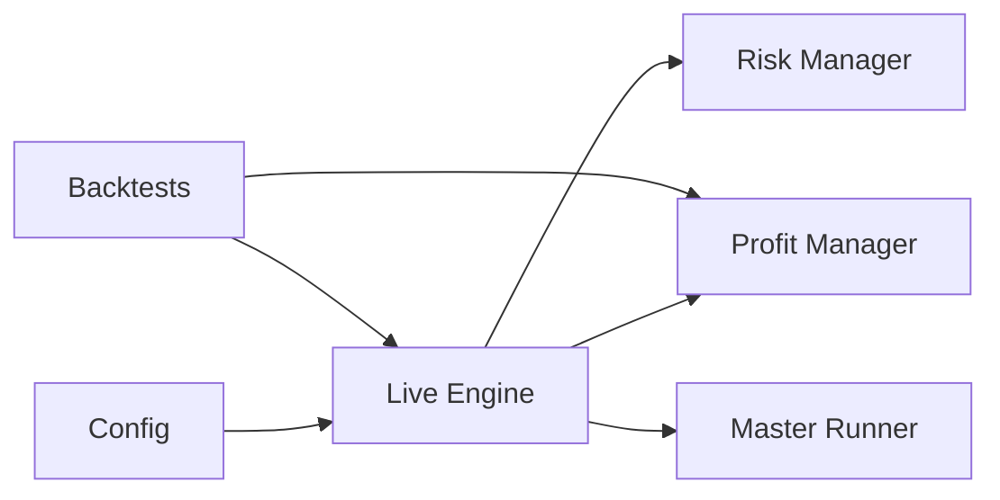

# Phase-10 Exit Strategy

<cite>
**Referenced Files in This Document**
- [profit_manager.py](file://engine/execution/profit_manager.py)
- [risk_manager.py](file://engine/risk/risk_manager.py)
- [live_engine.py](file://engine/live_engine.py)
- [config.py](file://engine/config/config.py)
- [backtest_exit_tuning.py](file://scripts/backtest_exit_tuning.py)
- [forensic_oos.py](file://backtest/forensic_oos.py)
- [walkforward_oos.py](file://backtest/walkforward_oos.py)
- [master_runner.py](file://master_runner.py)
</cite>

## Table of Contents
1. [Introduction](#introduction)
2. [Project Structure](#project-structure)
3. [Core Components](#core-components)
4. [Architecture Overview](#architecture-overview)
5. [Detailed Component Analysis](#detailed-component-analysis)
6. [Dependency Analysis](#dependency-analysis)
7. [Performance Considerations](#performance-considerations)
8. [Troubleshooting Guide](#troubleshooting-guide)
9. [Conclusion](#conclusion)
10. [Appendices](#appendices)

## Introduction
This document explains the Phase-10 exit strategy for the trading system. It covers how exits are determined, how trailing stops work in premium space, and how the system integrates with backtests and live execution. The goal is to make the design accessible while preserving precise implementation details.

## Project Structure
Phase-10 exits are implemented across a small set of focused modules:
- Live engine orchestrates per-cycle exit checks and applies Phase-10 premium-space trailing when enabled.
- Profit manager provides a cost-aware profit ladder and scale-out logic for non-Phase-10 paths.
- Risk manager sets initial stops/targets at entry.
- Configuration centralizes Phase-10 parameters and environment toggles.
- Backtesting scripts validate exit variants against historical data and compare to live behavior.

**Diagram sources**
- [live_engine.py:1429-1506](file://engine/live_engine.py#L1429-L1506)
- [profit_manager.py:173-239](file://engine/execution/profit_manager.py#L173-L239)
- [risk_manager.py:20-59](file://engine/risk/risk_manager.py#L20-L59)
- [config.py:45-64](file://engine/config/config.py#L45-L64)
- [forensic_oos.py:162-189](file://backtest/forensic_oos.py#L162-L189)
- [walkforward_oos.py:175-194](file://backtest/walkforward_oos.py#L175-L194)
- [backtest_exit_tuning.py:87-129](file://scripts/backtest_exit_tuning.py#L87-L129)

**Section sources**
- [live_engine.py:1429-1506](file://engine/live_engine.py#L1429-L1506)
- [profit_manager.py:1-239](file://engine/execution/profit_manager.py#L1-L239)
- [risk_manager.py:1-60](file://engine/risk/risk_manager.py#L1-L60)
- [config.py:1-185](file://engine/config/config.py#L1-L185)
- [backtest_exit_tuning.py:1-282](file://scripts/backtest_exit_tuning.py#L1-L282)
- [forensic_oos.py:162-189](file://backtest/forensic_oos.py#L162-L189)
- [walkforward_oos.py:175-194](file://backtest/walkforward_oos.py#L175-L194)
- [master_runner.py:434-471](file://master_runner.py#L434-L471)

## Core Components
- Phase-10 premium-space trailing stop: When ML_TRAIL_ENABLED is true, exits are governed by a premium-space trail that moves to breakeven after a profit threshold and then trails behind the high-water mark by a fixed gap.
- Cost-aware profit ladder: For non-Phase-10 paths (e.g., scalping), a rupee-based ladder locks profits progressively as peak PnL grows, ensuring locked exits cover costs.
- Entry risk setup: Initial stop and target are computed from ATR and regime, with hard caps on risk per trade.
- Time-based and early exits: Max hold time and learner-driven early exits complement trailing logic.

Key responsibilities:
- Live engine: Applies Phase-10 trail or delegates to profit manager; updates position state; handles scale-out signals; enforces time-based exits.
- Profit manager: Computes locked profit levels and converts them to premium stops; supports scale-out; implements drawdown exits.
- Risk manager: Sets tight initial stops and guidance targets; ensures worst-case loss is bounded.
- Config: Centralizes Phase-10 flags and tier thresholds; enables/disables features via environment variables.

**Section sources**
- [live_engine.py:1429-1506](file://engine/live_engine.py#L1429-L1506)
- [profit_manager.py:83-170](file://engine/execution/profit_manager.py#L83-L170)
- [risk_manager.py:20-59](file://engine/risk/risk_manager.py#L20-L59)
- [config.py:45-64](file://engine/config/config.py#L45-L64)

## Architecture Overview
The exit decision flow differs depending on whether Phase-10 premium-space trailing is enabled.

**Diagram sources**
- [live_engine.py:1429-1506](file://engine/live_engine.py#L1429-L1506)
- [profit_manager.py:173-239](file://engine/execution/profit_manager.py#L173-L239)
- [config.py:45-64](file://engine/config/config.py#L45-L64)
- [master_runner.py:1250-1262](file://master_runner.py#L1250-L1262)

## Detailed Component Analysis

### Phase-10 Premium-Space Trailing Stop
When ML_TRAIL_ENABLED is true, the live engine uses a premium-space trail:
- At profit >= ML_TRAIL_BE_PTS, move stop to breakeven (entry plus round-trip cost in premium points).
- At profit >= ML_TRAIL_T2_PTS, activate trailing: stop = high-water mark - ML_TRAIL_GAP_PTS.
- Exits occur on:
  - Target hit (if configured).
  - Stop loss hit (virtual trigger evaluated each cycle).
  - Time-based exit if held too long with weak profit.
  - Learner early exit if applicable.

**Diagram sources**
- [live_engine.py:1429-1506](file://engine/live_engine.py#L1429-L1506)
- [config.py:45-64](file://engine/config/config.py#L45-L64)
- [backtest_exit_tuning.py:87-129](file://scripts/backtest_exit_tuning.py#L87-L129)

**Section sources**
- [live_engine.py:1429-1506](file://engine/live_engine.py#L1429-L1506)
- [config.py:45-64](file://engine/config/config.py#L45-L64)
- [backtest_exit_tuning.py:87-129](file://scripts/backtest_exit_tuning.py#L87-L129)

### Cost-Aware Profit Ladder (Legacy Path)
For non-Phase-10 paths (e.g., scalping), the profit manager computes a rupee-based lock level:
- No lock until MFE exceeds 1.5x round-trip cost to avoid noise triggering premature locks.
- Above cost recovery, trail ~62% of peak profit, floored at break-even-after-cost.
- Higher profit tiers lock more aggressively (e.g., 65%, 70%, 80%).
- Converts locked rupees into premium stop levels and ratchets only tighter.
- Supports scale-out at configurable profit thresholds.

**Diagram sources**
- [profit_manager.py:75-170](file://engine/execution/profit_manager.py#L75-L170)
- [profit_manager.py:173-239](file://engine/execution/profit_manager.py#L173-L239)
- [risk_manager.py:20-59](file://engine/risk/risk_manager.py#L20-L59)
- [live_engine.py:1429-1506](file://engine/live_engine.py#L1429-L1506)

**Section sources**
- [profit_manager.py:75-170](file://engine/execution/profit_manager.py#L75-L170)
- [profit_manager.py:173-239](file://engine/execution/profit_manager.py#L173-L239)
- [risk_manager.py:20-59](file://engine/risk/risk_manager.py#L20-L59)

### Entry Risk Setup
Initial stops and targets are designed for capital protection:
- Stop capped at a fixed premium distance (with ATR-based calculation), ensuring worst-case loss per trade is bounded.
- Target is guidance; trailing (or Phase-10 trail) is the real exit mechanism.
- Both CE and PE benefit when premium rises; stop goes below entry, target above entry.

**Section sources**
- [risk_manager.py:20-59](file://engine/risk/risk_manager.py#L20-L59)

### Backtest Validation and Parity
Exit tuning script validates Phase-10 exit variants against a fixed entry population:
- Replays accepted entries through the same rejection stack used in entry quality analysis.
- Sweeps grids of SL, target, no-life thresholds, and trailing parameters.
- Compares results to baseline and original simulator to ensure parity.

**Diagram sources**
- [backtest_exit_tuning.py:63-129](file://scripts/backtest_exit_tuning.py#L63-L129)
- [backtest_exit_tuning.py:136-153](file://scripts/backtest_exit_tuning.py#L136-L153)
- [backtest_exit_tuning.py:206-227](file://scripts/backtest_exit_tuning.py#L206-L227)

**Section sources**
- [backtest_exit_tuning.py:63-129](file://scripts/backtest_exit_tuning.py#L63-L129)
- [backtest_exit_tuning.py:136-153](file://scripts/backtest_exit_tuning.py#L136-L153)
- [backtest_exit_tuning.py:206-227](file://scripts/backtest_exit_tuning.py#L206-L227)

### Integration Points in Live and Backtests
- Live engine check_exit applies Phase-10 trail when enabled; otherwise delegates to profit manager.
- Backtests mirror this behavior: forensic and walkforward OOS use manage_position and apply additional time-based and hard stop checks.
- Master runner includes a belt-and-suspenders hard stop fallback.

**Section sources**
- [live_engine.py:1429-1506](file://engine/live_engine.py#L1429-L1506)
- [forensic_oos.py:162-189](file://backtest/forensic_oos.py#L162-L189)
- [walkforward_oos.py:175-194](file://backtest/walkforward_oos.py#L175-L194)
- [master_runner.py:1250-1262](file://master_runner.py#L1250-L1262)

## Dependency Analysis
Phase-10 exits depend on configuration flags and interact with multiple components:
- Live engine depends on config to enable/disable Phase-10 trail and on profit manager for legacy path.
- Profit manager depends on cost model and quantity to compute rupee locks and convert to premium stops.
- Risk manager supplies initial stops/targets based on ATR and regime.
- Backtests reuse the same management functions to ensure parity between live and offline evaluation.

**Diagram sources**
- [config.py:45-64](file://engine/config/config.py#L45-L64)
- [live_engine.py:1429-1506](file://engine/live_engine.py#L1429-L1506)
- [profit_manager.py:173-239](file://engine/execution/profit_manager.py#L173-L239)
- [risk_manager.py:20-59](file://engine/risk/risk_manager.py#L20-L59)
- [forensic_oos.py:162-189](file://backtest/forensic_oos.py#L162-L189)
- [walkforward_oos.py:175-194](file://backtest/walkforward_oos.py#L175-L194)

**Section sources**
- [config.py:45-64](file://engine/config/config.py#L45-L64)
- [live_engine.py:1429-1506](file://engine/live_engine.py#L1429-L1506)
- [profit_manager.py:173-239](file://engine/execution/profit_manager.py#L173-L239)
- [risk_manager.py:20-59](file://engine/risk/risk_manager.py#L20-L59)
- [forensic_oos.py:162-189](file://backtest/forensic_oos.py#L162-L189)
- [walkforward_oos.py:175-194](file://backtest/walkforward_oos.py#L175-L194)

## Performance Considerations
- Virtual stop semantics: Stops are triggers evaluated each cycle; fills can slip below trigger due to gaps or fast moves. Slippage warnings are emitted when gaps exceed thresholds.
- Cost-aware locking: Ensures locked exits are never guaranteed losses; first lock arms only after sufficient cushion to avoid noise.
- Trailing activation thresholds: Prevent premature tightening that could cause whipsaws; tune activation and distance to balance capture vs. churn.
- Time-based exits: Limit exposure for weak trades; keep trailing logic primary to allow runners to breathe.

[No sources needed since this section provides general guidance]

## Troubleshooting Guide
Common issues and diagnostics:
- Unexpected exits below stop: Expected under virtual stop semantics; monitor slippage warnings and adjust polling frequency or thresholds if necessary.
- Premature locks: Ensure MFE clears 1.5x cost before first lock; verify cost model and quantity inputs.
- Phase-10 not activating: Confirm ML_TRAIL_ENABLED and tier thresholds in config; check that profit reaches BE and T2 thresholds.
- Scale-out not firing: Verify scale-out configuration and that profit reaches the configured threshold; ensure side-specific flags are reset correctly.

**Section sources**
- [profit_manager.py:8-16](file://engine/execution/profit_manager.py#L8-L16)
- [profit_manager.py:75-170](file://engine/execution/profit_manager.py#L75-L170)
- [live_engine.py:1482-1501](file://engine/live_engine.py#L1482-L1501)
- [master_runner.py:1250-1262](file://master_runner.py#L1250-L1262)

## Conclusion
Phase-10 introduces a premium-space trailing stop that moves to breakeven after a profit threshold and then trails behind the high-water mark by a fixed gap. This complements the cost-aware profit ladder used in non-Phase-10 paths and aligns live behavior with validated backtests. Proper configuration of thresholds and monitoring of virtual stop semantics ensure robust performance and controlled risk.

[No sources needed since this section summarizes without analyzing specific files]

## Appendices

### Configuration Reference (Phase-10)
- ML_TRAIL_ENABLED: Enable/disable Phase-10 premium-space trail.
- ML_TRAIL_BE_PTS: Profit threshold to move stop to breakeven.
- ML_TRAIL_T2_PTS: Profit threshold to activate trailing mode.
- ML_TRAIL_GAP_PTS: Distance below high-water mark for trailing stop.
- ML_SL_PTS / ML_TARGET_PTS: Fixed stop and target in premium points (used when not overridden by trail logic).
- MAX_HOLD_SECONDS: Maximum holding time for weak trades.

**Section sources**
- [config.py:45-64](file://engine/config/config.py#L45-L64)

### Exit Decision Priority
Typical priority order during a cycle:
1. Target hit (if configured).
2. Stop loss hit (virtual trigger).
3. Phase-10 trailing stop (when enabled).
4. Drawdown exit (legacy path, after meaningful profit).
5. Time-based exit (weak profit beyond MAX_HOLD).
6. Learner early exit (if applicable).

**Section sources**
- [profit_manager.py:173-239](file://engine/execution/profit_manager.py#L173-L239)
- [live_engine.py:1506-1525](file://engine/live_engine.py#L1506-L1525)