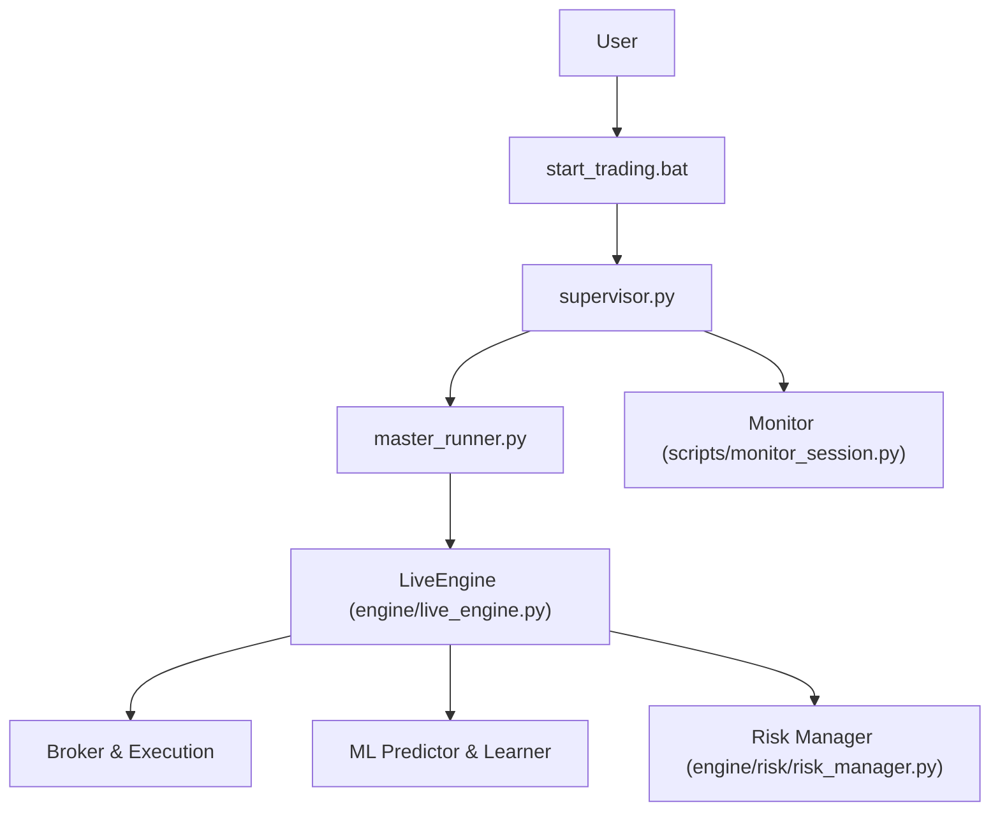
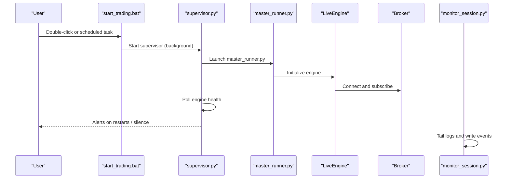
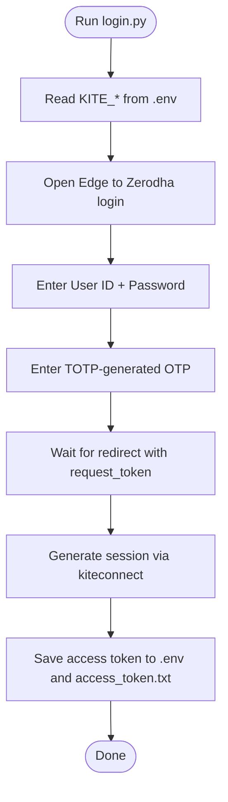

# Getting Started

<cite>
**Referenced Files in This Document**
- [requirements.txt](file://requirements.txt)
- [login.py](file://login.py)
- [engine/config/config.py](file://engine/config/config.py)
- [scripts/start_trading.bat](file://scripts/start_trading.bat)
- [scripts/supervisor.py](file://scripts/supervisor.py)
- [SESSION_HANDOFF.md](file://SESSION_HANDOFF.md)
- [engine/live_engine.py](file://engine/live_engine.py)
- [engine/risk/risk_manager.py](file://engine/risk/risk_manager.py)
- [scripts/monitor_session.py](file://scripts/monitor_session.py)
</cite>

## Table of Contents
1. Introduction
2. Project Structure
3. Core Components
4. Architecture Overview
5. Detailed Component Analysis
6. Dependency Analysis
7. Performance Considerations
8. Troubleshooting Guide
9. Conclusion
10. Appendices

## Introduction
This guide helps you set up and run the trading system for the first time. It covers prerequisites, environment setup, authentication with Zerodha, initial configuration, starting your first session, monitoring health, and understanding safety safeguards. The system supports paper trading by default to validate behavior before considering live trading.

## Project Structure
The repository is organized into modules for data, ML, execution, risk, and orchestration:
- Orchestration and startup scripts under scripts/
- Configuration and runtime settings under engine/config/
- Live trading logic under engine/
- Authentication and token management via login.py
- Session handoff notes in SESSION_HANDOFF.md

**Diagram sources**
- [scripts/start_trading.bat:1-32](file://scripts/start_trading.bat#L1-L32)
- [scripts/supervisor.py:1-216](file://scripts/supervisor.py#L1-L216)
- [engine/live_engine.py:71-184](file://engine/live_engine.py#L71-L184)
- [engine/risk/risk_manager.py:15-59](file://engine/risk/risk_manager.py#L15-L59)
- [scripts/monitor_session.py:1-69](file://scripts/monitor_session.py#L1-L69)

**Section sources**
- [scripts/start_trading.bat:1-32](file://scripts/start_trading.bat#L1-L32)
- [scripts/supervisor.py:1-216](file://scripts/supervisor.py#L1-L216)
- [engine/live_engine.py:71-184](file://engine/live_engine.py#L71-L184)

## Core Components
- Authentication and token refresh: login.py automates browser-based login and updates .env with a fresh access token.
- Configuration: engine/config/config.py loads all trading parameters from environment variables with sensible defaults.
- Startup and supervision: scripts/start_trading.bat launches scripts/supervisor.py, which monitors and restarts the engine if needed.
- Live engine: engine/live_engine.py implements entry/exit logic, ORB handling, feature building, and ML integration.
- Risk controls: engine/risk/risk_manager.py computes stops/targets and enforces capital-aware sizing.
- Monitoring: scripts/monitor_session.py tails logs and writes concise events to a separate log for quick review.

**Section sources**
- [login.py:21-50](file://login.py#L21-L50)
- [engine/config/config.py:4-164](file://engine/config/config.py#L4-L164)
- [scripts/start_trading.bat:1-32](file://scripts/start_trading.bat#L1-L32)
- [scripts/supervisor.py:1-216](file://scripts/supervisor.py#L1-L216)
- [engine/live_engine.py:71-184](file://engine/live_engine.py#L71-L184)
- [engine/risk/risk_manager.py:15-59](file://engine/risk/risk_manager.py#L15-L59)
- [scripts/monitor_session.py:1-69](file://scripts/monitor_session.py#L1-L69)

## Architecture Overview
The automated startup flow:
1. start_trading.bat runs at market open or manually.
2. It kills any stale engine process and starts supervisor.py.
3. supervisor.py polls master_runner.py’s process, restarting it if it dies, until market close.
4. master_runner.py initializes the LiveEngine, connects to broker feeds, and drives the trading loop.
5. monitor_session.py tails logs and highlights key events for quick triage.

**Diagram sources**
- [scripts/start_trading.bat:14-32](file://scripts/start_trading.bat#L14-L32)
- [scripts/supervisor.py:133-158](file://scripts/supervisor.py#L133-L158)
- [engine/live_engine.py:71-184](file://engine/live_engine.py#L71-L184)
- [scripts/monitor_session.py:40-69](file://scripts/monitor_session.py#L40-L69)

## Detailed Component Analysis

### Prerequisites and Environment Setup
- Python environment: Use a recent Python version compatible with the listed dependencies.
- Install dependencies from requirements.txt.
- Create a .env file in the project root with required keys for Zerodha authentication and optional Telegram alerts.

Key environment variables used by the system:
- KITE_API_KEY, KITE_API_SECRET, KITE_USER_ID, KITE_PASSWORD, KITE_TOTP_SECRET: Required for login.py to authenticate and refresh tokens.
- KITE_ACCESS_TOKEN: Updated automatically by login.py after successful login; used by the broker client.
- TELEGRAM_BOT_TOKEN, TELEGRAM_BOT_CHAT_ID: Optional; used by supervisor.py to send alerts.
- PAPER_MODE, DRY_RUN: Enable simulated trading by default for safe testing.
- INITIAL_CAPITAL, RISK_PER_TRADE, DAILY_LOSS_LIMIT, MAX_TRADES_PER_DAY: Control capital assumptions and daily limits.
- LOT_SIZE: Instrument lot size (e.g., Bank Nifty).
- WARMUP_MINUTES, LUNCH_FILTER_ENABLED, REENTRY_COOLDOWN: Entry timing and filters.
- DEFAULT_SL_PCT, DEFAULT_TARGET_PCT, MAX_HOLD_SECONDS: Default stop/target and hold limits.
- CHAMPION_THRESHOLD: ML confidence threshold.
- Various scalping and confirmation gates (SCALP_*, CONFIRMATION_WINDOW_SECONDS, etc.).

**Section sources**
- [requirements.txt:1-11](file://requirements.txt#L1-L11)
- [login.py:21-50](file://login.py#L21-L50)
- [engine/config/config.py:4-164](file://engine/config/config.py#L4-L164)
- [scripts/supervisor.py:42-68](file://scripts/supervisor.py#L42-L68)

### Zerodha Account Configuration and Authentication Flow
- Ensure your Zerodha account has API access enabled and that you have an API key and secret.
- Configure TOTP in your Zerodha app and capture the secret for KITE_TOTP_SECRET.
- Run login.py once to perform browser-based login, generate a request token, exchange it for an access token, and update .env automatically.

Authentication steps performed by login.py:
- Reads credentials from .env.
- Opens Edge browser via Selenium to the Zerodha login page.
- Enters user ID, password, and OTP (generated via pyotp).
- Waits for redirect with request_token, exchanges it using kiteconnect, and saves the access token to .env and a backup file.

**Diagram sources**
- [login.py:21-50](file://login.py#L21-L50)
- [login.py:66-101](file://login.py#L66-L101)
- [login.py:145-243](file://login.py#L145-L243)

**Section sources**
- [login.py:21-50](file://login.py#L21-L50)
- [login.py:66-101](file://login.py#L66-L101)
- [login.py:145-243](file://login.py#L145-L243)

### Initial Configuration Through engine/config/config.py
All trading behavior is controlled via environment variables loaded by Config. Examples include:
- PAPER_MODE=1 and DRY_RUN=1: Simulated trading mode (recommended for first runs).
- INITIAL_CAPITAL, RISK_PER_TRADE, DAILY_LOSS_LIMIT, MAX_TRADES_PER_DAY: Capital and daily risk caps.
- LOT_SIZE: Must match instrument (e.g., Bank Nifty).
- WARMUP_MINUTES: Blocks entries early in the session to allow ML warm-up.
- DEFAULT_SL_PCT, DEFAULT_TARGET_PCT, MAX_HOLD_SECONDS: Default risk and exit parameters.
- CHAMPION_THRESHOLD: Minimum ML probability to act on signals.
- Scalping and confirmation gates: SCALP_*, CONFIRMATION_WINDOW_SECONDS, BREAK_HOLD_SECONDS, MICRO_TREND_CANDLES, SPREAD_THRESHOLD_PTS, SLIPPAGE_THRESHOLD_PTS, etc.

These values are read at startup and influence entry gating, exits, and risk controls throughout the session.

**Section sources**
- [engine/config/config.py:4-164](file://engine/config/config.py#L4-L164)

### Running Your First Trading Session
- Use scripts/start_trading.bat to start the session. It:
  - Changes to the project directory.
  - Kills any stale engine process from previous days.
  - Starts supervisor.py in the background, which launches master_runner.py.
- supervisor.py will:
  - Poll the engine process every N seconds.
  - Restart it if it dies (with configurable max restarts).
  - Stop supervising after market close.
- monitor_session.py can be run alongside to tail logs and extract notable events into a compact log for quick review.

Automated startup sequence:
1. Double-click start_trading.bat or schedule it at market open.
2. Supervisor starts and begins watching master_runner.py.
3. Engine connects to broker, subscribes to feeds, and begins processing candles.
4. Monitor writes key events (entries, exits, blocks, errors) to logs/monitor_session.log.

**Section sources**
- [scripts/start_trading.bat:1-32](file://scripts/start_trading.bat#L1-L32)
- [scripts/supervisor.py:1-216](file://scripts/supervisor.py#L1-L216)
- [scripts/monitor_session.py:1-69](file://scripts/monitor_session.py#L1-L69)

### Session Handoff Mechanism (SESSION_HANDOFF.md)
- Access tokens expire daily; refresh them each morning by running login.py if needed.
- Kill any stale master_runner process and ensure PID files are cleaned.
- Verify feed connectivity and that DRY_RUN is enabled for safe testing.
- Monitor trades, block reasons, and errors throughout the day.
- Only switch off DRY_RUN when explicitly instructed to trade with real money.

**Section sources**
- [SESSION_HANDOFF.md:1-39](file://SESSION_HANDOFF.md#L1-L39)

### Monitoring System Health During Initial Runs
- Check logs/master_runner.log for engine activity and errors.
- Review logs/monitor_session.log for summarized events (entries, exits, blocks, warnings).
- supervisor.py writes heartbeat status to logs/supervisor_status.log and can alert via Telegram if configured.
- If the engine becomes silent during market hours, supervisor.py will alert but not immediately restart unless it detects a crash.

**Section sources**
- [scripts/supervisor.py:161-216](file://scripts/supervisor.py#L161-L216)
- [scripts/monitor_session.py:25-69](file://scripts/monitor_session.py#L25-L69)

## Dependency Analysis
External libraries required:
- kiteconnect: Broker API client for Zerodha.
- pyotp: Generates TOTP codes for two-factor authentication.
- python-dotenv: Loads environment variables from .env.
- pandas, numpy: Data manipulation and numerical computations.
- lightgbm, scikit-learn, joblib: Machine learning models and utilities.
- requests: HTTP client for notifications and APIs.
- playwright: Browser automation dependency (used alongside Selenium in login flow).

These are declared in requirements.txt and should be installed in your Python environment before running the system.

**Section sources**
- [requirements.txt:1-11](file://requirements.txt#L1-L11)

## Performance Considerations
- Warmup period: WARMUP_MINUTES prevents entries during early volatility to allow ML learner stabilization.
- Feature computation: LiveEngine builds features per candle and deduplicates per-minute operations to avoid redundant work.
- ORB reconstruction: If the engine starts late, it reconstructs opening range from historical data to maintain strategy integrity.
- Monitoring overhead: monitor_session.py tails logs efficiently and only writes notable events.

[No sources needed since this section provides general guidance]

## Troubleshooting Guide
Common issues and resolutions:
- Missing environment variables:
  - Symptom: RuntimeError indicating missing KITE_* variables.
  - Resolution: Ensure .env contains all required keys and re-run login.py to refresh tokens.
- Broker connectivity failures:
  - Symptom: No feed subscriptions or historical data errors.
  - Resolution: Verify internet connection, broker API status, and correct instrument tokens; check logs for specific error messages.
- Model loading errors:
  - Symptom: ML components fail to initialize or predict.
  - Resolution: Ensure model files exist and are accessible; verify feature columns match expectations; check logs for detailed exceptions.
- Permission problems:
  - Symptom: Cannot write to .env or logs directories.
  - Resolution: Grant write permissions to the project directory and subfolders; run as appropriate user context.
- Stale processes:
  - Symptom: Multiple engines running or old sessions interfering.
  - Resolution: Kill stale master_runner processes and remove PID files; use start_trading.bat which handles cleanup.
- Telegram alerts not sending:
  - Symptom: Supervisor does not notify on issues.
  - Resolution: Set TELEGRAM_BOT_TOKEN and TELEGRAM_BOT_CHAT_ID in .env; verify network access to Telegram API.

Safety reminders:
- Always start with PAPER_MODE=1 and DRY_RUN=1 to simulate orders.
- Confirm zero errors and healthy feed before considering live trading.
- Only disable dry-run when explicitly instructed to trade with real capital.

**Section sources**
- [login.py:21-50](file://login.py#L21-L50)
- [scripts/supervisor.py:42-68](file://scripts/supervisor.py#L42-L68)
- [engine/live_engine.py:222-315](file://engine/live_engine.py#L222-L315)
- [scripts/monitor_session.py:25-69](file://scripts/monitor_session.py#L25-L69)

## Conclusion
You now have the essentials to set up, authenticate, configure, and run the trading system safely in paper mode. Use the provided scripts to automate startup and monitoring, rely on environment-driven configuration for behavior control, and follow the session handoff notes to manage daily token refreshes. Validate thoroughly in simulation before considering live deployment, and always respect built-in risk safeguards.

[No sources needed since this section summarizes without analyzing specific files]

## Appendices

### Example Configuration Parameters and Effects
- PAPER_MODE=1, DRY_RUN=1: Enables simulated trading; recommended for initial runs.
- INITIAL_CAPITAL: Sets baseline capital for position sizing and risk calculations.
- RISK_PER_TRADE: Fraction of capital risked per trade; influences sizing.
- DAILY_LOSS_LIMIT: Hard cap to halt trading after reaching daily loss threshold.
- MAX_TRADES_PER_DAY: Limits total trades to prevent overtrading.
- LOT_SIZE: Must match instrument (e.g., Bank Nifty); affects order quantities.
- WARMUP_MINUTES: Delays entries to stabilize ML and reduce noise.
- DEFAULT_SL_PCT, DEFAULT_TARGET_PCT: Default stop and target percentages.
- CHAMPION_THRESHOLD: Minimum ML probability to act on signals.
- Scalping and confirmation gates: Fine-tune entry quality, slippage tolerance, cooldowns, and trailing behavior.

**Section sources**
- [engine/config/config.py:4-164](file://engine/config/config.py#L4-L164)

### Risk Management Safeguards
- Position sizing based on capital and confidence.
- Tight stop distances capped to limit worst-case losses per trade.
- Target guidance with trailing exits managed by profit manager.
- Daily loss limits and maximum trades per day to constrain drawdowns.
- Re-entry cooldowns and lunch filters to avoid choppy periods.

**Section sources**
- [engine/risk/risk_manager.py:15-59](file://engine/risk/risk_manager.py#L15-L59)
- [engine/config/config.py:4-164](file://engine/config/config.py#L4-L164)