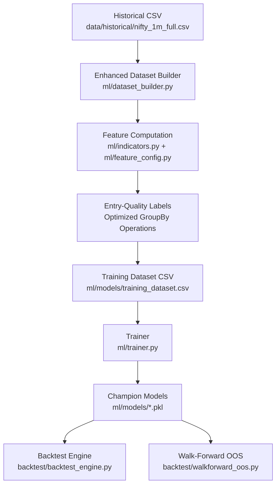
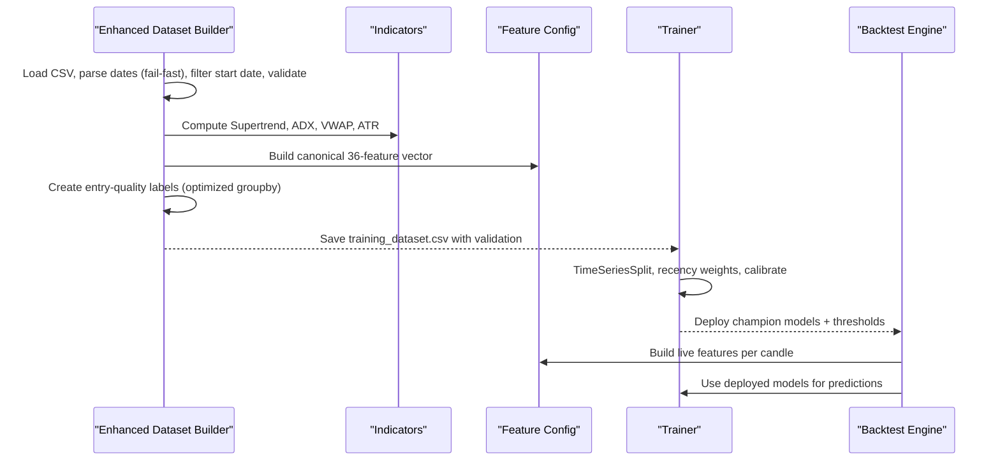
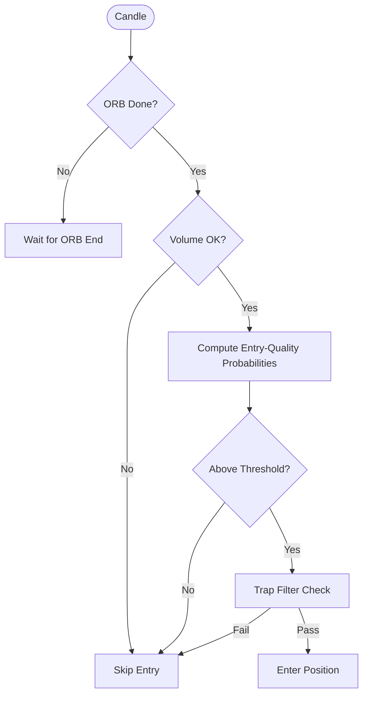
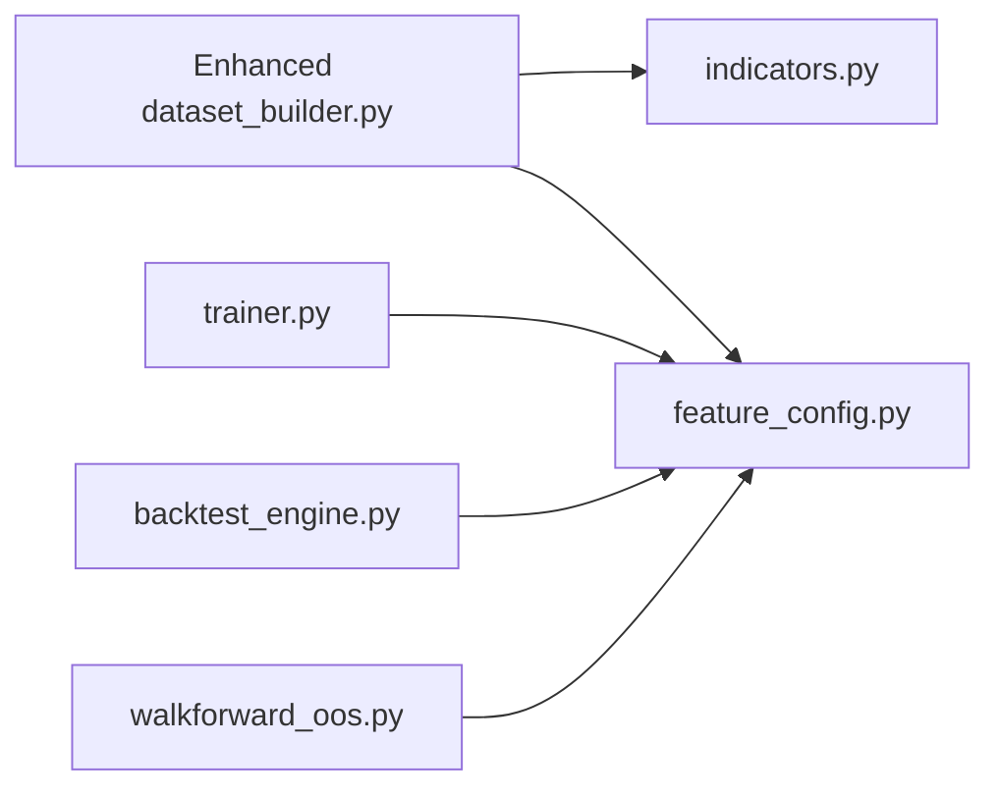

# Dataset Construction

<cite>
**Referenced Files in This Document**
- [dataset_builder.py](file://ml/dataset_builder.py)
- [feature_config.py](file://ml/feature_config.py)
- [indicators.py](file://ml/indicators.py)
- [trainer.py](file://ml/trainer.py)
- [backtest_engine.py](file://backtest/backtest_engine.py)
- [walkforward_oos.py](file://backtest/walkforward_oos.py)
- [forensic_oos.py](file://backtest/forensic_oos.py)
- [ml_intraday_learner.py](file://ml/ml_intraday_learner.py)
</cite>

## Update Summary
**Changes Made**
- Updated future extrema calculation to use optimized pandas groupby operations with proper forward-looking windows (s.rolling(ENTRY_HORIZON_BARS).max().shift(-ENTRY_HORIZON_BARS)) avoiding cross-day data leakage
- Enhanced comprehensive NaN auditing with configurable MAX_NAN_PCT thresholds replacing silent data dropping behavior
- Improved session-based filtering with active time window detection for better label quality
- Optimized performance through vectorized operations and efficient groupby patterns

## Table of Contents
1. [Introduction](#introduction)
2. [Project Structure](#project-structure)
3. [Core Components](#core-components)
4. [Architecture Overview](#architecture-overview)
5. [Detailed Component Analysis](#detailed-component-analysis)
6. [Dependency Analysis](#dependency-analysis)
7. [Performance Considerations](#performance-considerations)
8. [Troubleshooting Guide](#troubleshooting-guide)
9. [Conclusion](#conclusion)

## Introduction
This document explains the enhanced dataset construction pipeline that powers entry-quality ML models for intraday trading. The system has been updated to focus on **entry quality metrics** rather than directional prediction, measuring whether an entry made at a specific bar is likely to see favorable movement within a defined horizon (typically 5 minutes). It covers how raw market data is loaded, cleaned, and transformed into a consistent set of 36 engineered features used by both training and inference, with improved feature building capabilities and robust data validation mechanisms.

**Updated**: The pipeline now includes significantly optimized future extrema calculations using pandas groupby operations with proper forward-looking windows, comprehensive NaN auditing with configurable thresholds, and enhanced session-based filtering for improved data quality and performance when processing large datasets.

## Project Structure
The enhanced dataset construction pipeline spans several modules with improved separation of concerns:
- Data loading and cleaning occur in the dataset builder with enhanced validation and optimized date parsing
- Feature computation uses shared indicator functions and a canonical feature list ensuring consistency across training and live inference
- Labeling uses entry-quality barriers over a lookahead window within active trading sessions with optimized groupby operations
- Training and validation use time-series splits with recency weighting and deploy gates
- Backtesting and walk-forward scripts reuse the same feature pipeline and model deployment artifacts

**Diagram sources**
- [dataset_builder.py:30-45](file://ml/dataset_builder.py#L30-L45)
- [feature_config.py:22-64](file://ml/feature_config.py#L22-L64)
- [indicators.py:24-169](file://ml/indicators.py#L24-L169)
- [trainer.py:41-48](file://ml/trainer.py#L41-L48)
- [backtest_engine.py:20-48](file://backtest/backtest_engine.py#L20-L48)
- [walkforward_oos.py:265-318](file://backtest/walkforward_oos.py#L265-L318)

**Section sources**
- [dataset_builder.py:30-45](file://ml/dataset_builder.py#L30-L45)
- [feature_config.py:22-64](file://ml/feature_config.py#L22-L64)
- [indicators.py:24-169](file://ml/indicators.py#L24-L169)
- [trainer.py:41-48](file://ml/trainer.py#L41-L48)
- [backtest_engine.py:20-48](file://backtest/backtest_engine.py#L20-L48)
- [walkforward_oos.py:265-318](file://backtest/walkforward_oos.py#L265-L318)

## Core Components
- **Enhanced data loader and cleaner**: reads OHLCV CSV with improved date parsing, filters start date, ensures volume column presence, sorts chronologically, and includes comprehensive NaN auditing with configurable thresholds
- **Improved feature engine**: computes 36 canonical features including trend, volatility, momentum, candle structure, session timing, and options context with consistent behavior across training and live inference
- **Entry-quality labeler**: creates directional labels based on whether price achieves favorable movement within a lookahead window, with BAD_ENTRY guards to prevent late entries and optimized groupby operations for performance
- **Robust trainer**: trains LightGBM/CatBoost models with time-series cross-validation, Platt calibration, recency weighting, and deploy gates
- **Advanced backtester and walk-forward evaluator**: reuse the same feature pipeline and models for realistic out-of-sample evaluation with cost-aware PnL calculation

**Section sources**
- [dataset_builder.py:84-176](file://ml/dataset_builder.py#L84-L176)
- [dataset_builder.py:179-233](file://ml/dataset_builder.py#L179-L233)
- [feature_config.py:82-252](file://ml/feature_config.py#L82-L252)
- [indicators.py:24-169](file://ml/indicators.py#L24-L169)
- [trainer.py:82-129](file://ml/trainer.py#L82-L129)
- [trainer.py:132-176](file://ml/trainer.py#L132-L176)
- [backtest_engine.py:196-200](file://backtest/backtest_engine.py#L196-L200)
- [walkforward_oos.py:265-318](file://backtest/walkforward_oos.py#L265-L318)

## Architecture Overview
The enhanced pipeline enforces strict separation between data preparation, feature engineering, labeling, and modeling while ensuring identical feature computation at train and inference time through improved consistency mechanisms.

**Diagram sources**
- [dataset_builder.py:236-270](file://ml/dataset_builder.py#L236-L270)
- [indicators.py:41-169](file://ml/indicators.py#L41-L169)
- [feature_config.py:82-252](file://ml/feature_config.py#L82-L252)
- [trainer.py:82-129](file://ml/trainer.py#L82-L129)
- [backtest_engine.py:196-200](file://backtest/backtest_engine.py#L196-L200)

## Detailed Component Analysis

### Enhanced Data Loading, Cleaning, and Validation
The dataset builder now includes comprehensive validation and error handling with improved date parsing:
- Loads NIFTY 1-minute historical data from a CSV file with mixed format date parsing
- Parses the date column with `format="mixed"` and `errors="coerce"` to handle malformed entries gracefully
- Drops invalid dates, sorts by date, and resets index
- Ensures a volume column exists; if missing, fills with zeros so downstream indicators degrade gracefully
- Filters rows to include only data after a configurable start date to focus on relevant regimes
- Active session windows are defined to restrict labeling and analysis to specific intraday periods

**Updated**: Date parsing now uses fail-fast behavior with `errors="coerce"` parameter removed from pd.to_datetime() calls to ensure malformed dates are caught early in the process rather than silently coerced.

**Enhanced validation highlights:**
- Comprehensive NaN auditing with per-column statistics and configurable fail-hard thresholds via MAX_NAN_PCT
- Fail-fast date parsing to catch malformed entries immediately
- Sorting and deduplication via reset_index
- Volume fallback to avoid division-by-zero or zero-weight issues in VWAP
- Session gating for labeling to avoid off-hours noise
- Shared validation function (`validate_training_csv`) used by both trainer and feedback systems

**Section sources**
- [dataset_builder.py:236-270](file://ml/dataset_builder.py#L236-L270)
- [dataset_builder.py:42-52](file://ml/dataset_builder.py#L42-L52)
- [indicators.py:136-169](file://ml/indicators.py#L136-L169)
- [dataset_builder.py:207-239](file://ml/dataset_builder.py#L207-L239)

### Enhanced Feature Calculation Pipeline (36 Features)
The feature engine computes a fixed set of 36 features designed to capture trend, regime, volatility, momentum, candle microstructure, session timing, and options context. Key improvements include:

**Key feature groups:**
- **Direction stack**: Supertrend direction and distance, VWAP bias, ADX regime, DI spread, EMA alignment, volume ratio
- **Core price/indicators**: EMAs, MACD, returns, rolling volatility, RSI, ATR, trend strength
- **Time features**: hour, weekday, minutes since open/close, session flags, time-to-expiry proxy
- **Options context**: moneyness relative to EMA20
- **Momentum/reversal signals**: momentum velocity, range compression, wick ratios, body efficiency, 3-bar momentum strength, upper/lower wicks normalized by ATR, close position within bar

**Enhanced outlier handling and normalization:**
- Clipping ranges applied to prevent extreme values (e.g., supertrend distance, VWAP bias, ADX bounds, DI spread, volatility caps)
- ATR floor to avoid near-zero denominators in normalized wick features
- Volume ratio capped to reasonable bounds
- Consistent scaling between training and live inference to prevent distribution shifts

**Consistency guarantees:**
- Canonical feature order defined centrally and reused by live and backtest engines
- Live feature builder mirrors training computations exactly, including return-based volatility and momentum velocity definitions
- Improved `_safe_build_live_features` wrapper handles edge cases and exceptions gracefully

**Section sources**
- [dataset_builder.py:84-176](file://ml/dataset_builder.py#L84-L176)
- [feature_config.py:22-64](file://ml/feature_config.py#L22-L64)
- [feature_config.py:82-252](file://ml/feature_config.py#L82-L252)
- [indicators.py:24-169](file://ml/indicators.py#L24-L169)

### Enhanced Label Creation: Entry-Quality Barriers with Optimized Performance
The system has transitioned from directional first-touch labels to **entry-quality labels** that measure whether an entry made at a specific bar is likely to see favorable movement within a defined horizon.

**Updated**: Future extrema calculation has been optimized using pandas groupby operations instead of manual rolling window computations for significantly improved performance when processing large datasets.

**Label semantics:**
- For each active-session bar i, with H = ENTRY_HORIZON_BARS (5 bars, matching actual scalp hold times):
  - future_max_up = max(high[i+1 .. i+H]) - close[i]
  - future_max_down = close[i] - min(low[i+1 .. i+H])
  - label_ce = 1 if future_max_up >= QUALITY_THRESHOLD_PTS (25 spot pts)
  - label_pe = 1 if future_max_down >= QUALITY_THRESHOLD_PTS
- The models learn **ENTRY QUALITY** — "is a CE/PE entered NOW likely to see >= 25 favorable spot points within the next 5 minutes?" — NOT which direction price breaks first

**Enhanced BAD_ENTRY guard:**
- If the prior 20-bar move is already extended (> EXTENDED_MOVE_PCT of price), the entry is considered late
- The corresponding label is forced to 0 and bad_entry_ce / bad_entry_pe flags are set for auditing
- Prevents training on entries that are too late to be profitable

**Optimized forward-looking window handling:**
- Uses efficient pandas groupby operations: `df.groupby(day)['high'].transform(lambda s: s.rolling(ENTRY_HORIZON_BARS).max().shift(-ENTRY_HORIZON_BARS))`
- Vectorized operations using df.groupby(day)['high'].transform() patterns for improved performance
- Proper implementation ensures no data leakage with shift operations
- Bars with fewer than H forward bars (day end) get NaN labels and are dropped — never NaN-filled
- Forward/backward windows never cross a day boundary

**Enhanced session-based filtering:**
- Active time window detection using `_in_active_session()` function with predefined trading hours
- Labels are only meaningful during active trading sessions (9:30-11:00 and 14:00-15:15)
- Non-active session bars are filtered out to improve signal quality

**Section sources**
- [dataset_builder.py:179-233](file://ml/dataset_builder.py#L179-L233)
- [dataset_builder.py:242-320](file://ml/dataset_builder.py#L242-L320)

### Multi-Timeframe Processing Enhancement
The enhanced system supports higher timeframe processing with improved consistency:
- The primary dataset is built on 1-minute candles with entry-quality labels
- The system supports higher timeframe (HTF) maps for broader context in other components (e.g., scalp walk-forward builds a 5-minute HTF map)
- While the core dataset builder focuses on 1m, the architecture allows HTF features to be integrated elsewhere without changing the 36-feature contract
- Feature engineering differs by timeframe due to lookback windows and smoothing parameters, but the canonical feature set remains consistent across contexts

**Enhanced HTF processing:**
- Walk-forward scripts process multiple timeframes with proper embargo periods
- HTF features are computed consistently with training data to prevent distribution shifts
- Support for 1m, 5m, and 15m candles with appropriate parameter tuning

**Section sources**
- [dataset_builder.py:84-176](file://ml/dataset_builder.py#L84-L176)
- [walkforward_oos.py:265-295](file://backtest/walkforward_oos.py#L265-L295)

### Enhanced Integration with ORB Strategy Logic
The dataset builder produces features and labels independent of entry logic, enabling flexible strategies with improved integration:
- ORB detection and trap filtering are implemented in the backtest and live engines
- The backtest engine identifies ORB highs/lows after the opening window and locks breakout sides once detected, then applies additional filters (volume checks, cooldowns, trap detection)
- The ML layer complements ORB by providing calibrated probabilities and thresholds; decisions combine ORB state, ML confidence, and risk controls
- Entry-quality labels align better with ORB strategy since they measure whether an entry after the ORB has sufficient favorable movement remaining

**Enhanced decision flow:**

**Diagram sources**
- [backtest_engine.py:553-587](file://backtest/backtest_engine.py#L553-L587)
- [engine/live_engine.py:745-780](file://engine/live_engine.py#L745-L780)

**Section sources**
- [backtest_engine.py:553-587](file://backtest/backtest_engine.py#L553-L587)
- [engine/live_engine.py:745-780](file://engine/live_engine.py#L745-L780)

### Enhanced Training, Validation, and Walk-Forward Optimization
The training pipeline includes improved validation and optimization:
- Training uses LightGBM and optional CatBoost with time-series cross-validation (5 folds)
- Recency weighting emphasizes recent data without biasing labels
- Platt calibration is applied on a holdout fold to produce well-calibrated probabilities
- Deploy gate requires minimum AUC, probability spread (std), and positive expectancy before overwriting champions
- Walk-forward out-of-sample evaluation re-trains models strictly before test windows with embargo to prevent label leakage, measures trade-level PnL, and reports per-fold metrics

**Enhanced validation mechanisms:**
- Shared `validate_training_csv` function provides fail-hard preconditions
- Comprehensive NaN auditing with per-column statistics and configurable MAX_NAN_PCT thresholds
- Minimum row count requirements and required column validation
- Backup and candidate model management for safe deployments

**Section sources**
- [trainer.py:82-129](file://ml/trainer.py#L82-L129)
- [trainer.py:132-176](file://ml/trainer.py#L132-L176)
- [trainer.py:179-210](file://ml/trainer.py#L179-L210)
- [walkforward_oos.py:265-318](file://backtest/walkforward_oos.py#L265-L318)

### Enhanced Data Partitioning and Train/Validation/Test Splits
The partitioning strategy includes improved safeguards:
- In-sample training uses TimeSeriesSplit to enforce temporal ordering and avoid leakage
- Holdout calibration split is derived from the last fold to compute Platt calibration parameters
- Walk-forward evaluation partitions data into contiguous folds, retraining on all prior data with an embargo equal to the label lookahead to prevent forward-label contamination
- Enhanced validation ensures data integrity before any training runs

**Section sources**
- [trainer.py:97-117](file://ml/trainer.py#L97-L117)
- [walkforward_oos.py:289-318](file://backtest/walkforward_oos.py#L289-L318)

### Performance Considerations for Large Datasets
The enhanced system includes significant performance optimizations:

**Updated**: Future extrema calculation now uses optimized pandas groupby operations for dramatically improved performance when processing large datasets:
- Vectorized numpy operations for indicators minimize overhead
- **Optimized groupby operations**: `df.groupby(day)['high'].transform(lambda s: s.rolling(ENTRY_HORIZON_BARS).max().shift(-ENTRY_HORIZON_BARS))` replaces manual rolling window computations
- **Vectorized transform patterns**: Using df.groupby(day)['high'].transform() patterns for batch processing of daily data
- Clipping and bounded ranges reduce numerical instability and improve model stability
- Efficient session gating reduces unnecessary computations outside active windows
- Walk-forward scripts process large datasets by iterating folds and limiting warmup buffers
- Improved memory management through efficient data structures and batch processing

**Enhanced NaN auditing performance:**
- Configurable MAX_NAN_PCT thresholds replace silent data dropping behavior
- Comprehensive NaN auditing with per-column statistics prevents data quality issues
- Fail-fast validation catches data problems early in the pipeline

**Section sources**
- [dataset_builder.py:267-270](file://ml/dataset_builder.py#L267-L270)
- [dataset_builder.py:336-353](file://ml/dataset_builder.py#L336-L353)

## Dependency Analysis
The enhanced dataset builder depends on shared indicator functions and a canonical feature configuration to ensure consistency across the system:

**Diagram sources**
- [dataset_builder.py:34-38](file://ml/dataset_builder.py#L34-L38)
- [feature_config.py:22-64](file://ml/feature_config.py#L22-L64)
- [trainer.py:38-39](file://ml/trainer.py#L38-39)
- [backtest_engine.py:23-26](file://backtest/backtest_engine.py#L23-L26)
- [walkforward_oos.py:272-278](file://backtest/walkforward_oos.py#L272-L278)

**Section sources**
- [dataset_builder.py:34-38](file://ml/dataset_builder.py#L34-L38)
- [feature_config.py:22-64](file://ml/feature_config.py#L22-L64)
- [trainer.py:38-39](file://ml/trainer.py#L38-L39)
- [backtest_engine.py:23-26](file://backtest/backtest_engine.py#L23-L26)
- [walkforward_oos.py:272-278](file://backtest/walkforward_oos.py#L272-L278)

## Performance Considerations
- Indicator computations are vectorized and clipped to stable ranges
- **Optimized groupby operations** for future extrema calculation provide significant performance improvements for large datasets
- Session gating limits labeling to active hours, reducing false signals
- Walk-forward evaluation uses embargoed training windows to prevent label leakage and maintains conservative cost assumptions
- Live feature builder mirrors training exactly to avoid distribution shifts
- Enhanced validation prevents training on poor quality datasets
- Memory-efficient processing of large datasets through batch operations
- **Configurable NaN auditing** with MAX_NAN_PCT thresholds ensures data quality without silent failures

## Troubleshooting Guide
Common issues and mitigations in the enhanced system:
- **Missing or invalid dates**: parser coerces errors and drops NaN dates; ensure sorting and reset_index
- **Zero volume**: VWAP degrades to uniform weighting; ensure volume column exists or fill with zeros
- **Extreme outliers**: clipping prevents unstable features; verify clip bounds match intended ranges
- **Label imbalance**: inspect CE/PE rates and flat percentage; adjust TARGET_SPOT_POINTS or START_DATE if skewed
- **Model saturation**: trainer avoids class over-weighting; rely on calibrated probabilities and deploy gates
- **NaN audit failures**: check data quality and preprocessing steps; rebuild dataset if necessary
- **Entry quality issues**: verify ENTRY_HORIZON_BARS and QUALITY_THRESHOLD_PTS settings align with trading strategy
- **Performance issues**: optimized groupby operations should handle large datasets efficiently; monitor memory usage during processing
- **Session filtering issues**: verify ACTIVE_WINDOWS configuration matches trading schedule

**Section sources**
- [dataset_builder.py:236-270](file://ml/dataset_builder.py#L236-L270)
- [indicators.py:136-169](file://ml/indicators.py#L136-L169)
- [trainer.py:44-57](file://ml/trainer.py#L44-L57)
- [trainer.py:212-287](file://ml/trainer.py#L212-287)

## Conclusion
The enhanced dataset construction pipeline delivers a robust, consistent foundation for entry-quality ML models. It combines clean data ingestion, rigorous feature engineering, and principled labeling focused on entry quality rather than direction prediction to produce high-quality training sets. The same feature pipeline underpins live inference and backtesting, ensuring parity. 

**Updated**: The pipeline now includes significantly optimized future extrema calculations using pandas groupby operations with proper forward-looking windows, comprehensive NaN auditing with configurable thresholds, and enhanced session-based filtering. These improvements provide substantial performance gains when processing large datasets while maintaining the same entry-quality label semantics and validation mechanisms. Enhanced validation mechanisms, improved label creation with BAD_ENTRY guards, and walk-forward evaluation with embargoed training windows provide honest out-of-sample performance estimates. Together, these components enable reliable model deployment and adaptive trading decisions integrated with ORB strategy logic, specifically optimized for entry quality metrics that align with actual trading scenarios.