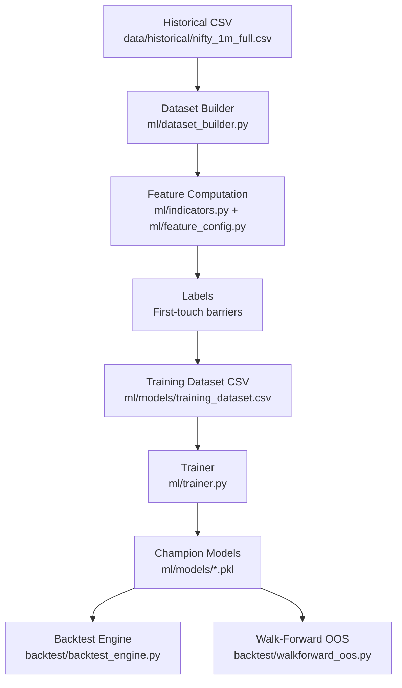
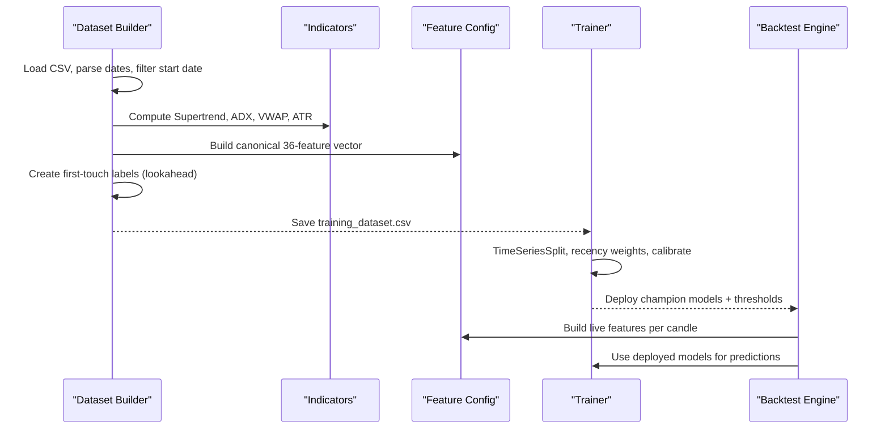
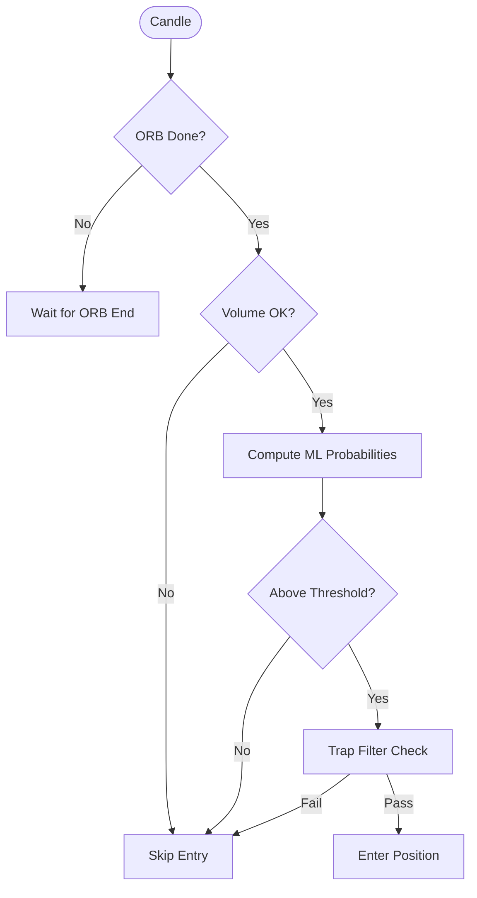
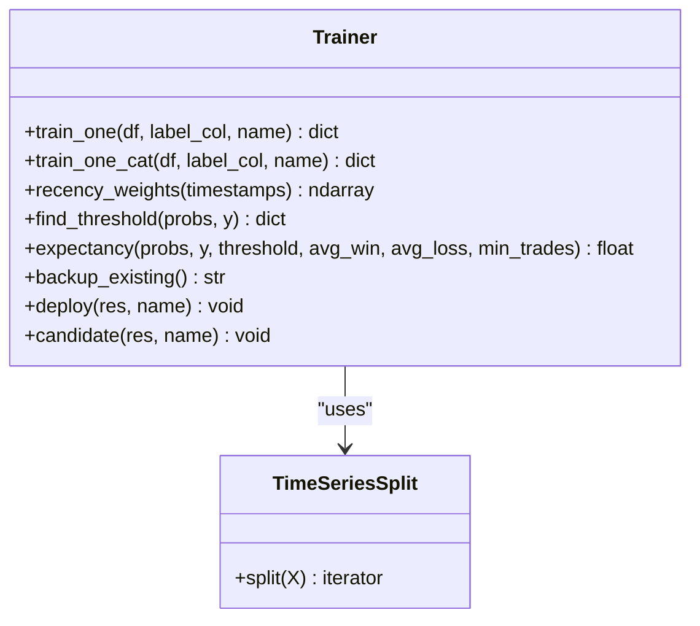
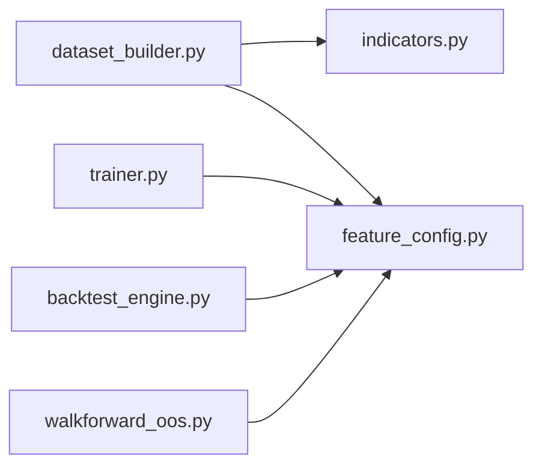

# Dataset Construction

<cite>
**Referenced Files in This Document**
- [dataset_builder.py](file://ml/dataset_builder.py)
- [feature_config.py](file://ml/feature_config.py)
- [indicators.py](file://ml/indicators.py)
- [trainer.py](file://ml/trainer.py)
- [backtest_engine.py](file://backtest/backtest_engine.py)
- [walkforward_oos.py](file://backtest/walkforward_oos.py)
- [forensic_oos.py](file://backtest/forensic_oos.py)
- [ml_intraday_learner.py](file://ml/ml_intraday_learner.py)
</cite>

## Table of Contents
1. [Introduction](#introduction)
2. [Project Structure](#project-structure)
3. [Core Components](#core-components)
4. [Architecture Overview](#architecture-overview)
5. [Detailed Component Analysis](#detailed-component-analysis)
6. [Dependency Analysis](#dependency-analysis)
7. [Performance Considerations](#performance-considerations)
8. [Troubleshooting Guide](#troubleshooting-guide)
9. [Conclusion](#conclusion)

## Introduction
This document explains the dataset construction pipeline that powers directional ML models for intraday trading. It focuses on how raw market data is loaded, cleaned, and transformed into a consistent set of 36 engineered features used by both training and inference. It also documents label creation using first-touch barriers, data quality checks, missing value handling, outlier clipping, multi-timeframe considerations, integration with the Opening Range Breakout (ORB) strategy logic, and walk-forward optimization support for robust evaluation.

## Project Structure
The dataset construction pipeline spans several modules:
- Data loading and cleaning occur in the dataset builder.
- Feature computation uses shared indicator functions and a canonical feature list to ensure consistency across training and live inference.
- Labeling uses forward-looking barrier hits to create directional targets.
- Training and validation use time-series splits and recency weighting.
- Backtesting and walk-forward scripts reuse the same feature pipeline and model deployment artifacts.

**Diagram sources**
- [dataset_builder.py:30-45](file://ml/dataset_builder.py#L30-L45)
- [feature_config.py:22-64](file://ml/feature_config.py#L22-L64)
- [indicators.py:24-169](file://ml/indicators.py#L24-L169)
- [trainer.py:41-48](file://ml/trainer.py#L41-L48)
- [backtest_engine.py:20-48](file://backtest/backtest_engine.py#L20-L48)
- [walkforward_oos.py:265-318](file://backtest/walkforward_oos.py#L265-L318)

**Section sources**
- [dataset_builder.py:30-45](file://ml/dataset_builder.py#L30-L45)
- [feature_config.py:22-64](file://ml/feature_config.py#L22-L64)
- [indicators.py:24-169](file://ml/indicators.py#L24-L169)
- [trainer.py:41-48](file://ml/trainer.py#L41-L48)
- [backtest_engine.py:20-48](file://backtest/backtest_engine.py#L20-L48)
- [walkforward_oos.py:265-318](file://backtest/walkforward_oos.py#L265-L318)

## Core Components
- Data loader and cleaner: reads OHLCV CSV, parses dates, filters start date, ensures volume column presence, sorts chronologically.
- Feature engine: computes 36 canonical features including trend, volatility, momentum, candle structure, session timing, and options context.
- Labeler: creates first-touch directional labels over a lookahead window within active trading sessions.
- Trainer: trains LightGBM/CatBoost models with time-series cross-validation, Platt calibration, recency weighting, and deploy gates.
- Backtester and walk-forward evaluator: reuse the same feature pipeline and models for realistic out-of-sample evaluation.

**Section sources**
- [dataset_builder.py:84-176](file://ml/dataset_builder.py#L84-L176)
- [dataset_builder.py:179-233](file://ml/dataset_builder.py#L179-L233)
- [feature_config.py:82-252](file://ml/feature_config.py#L82-L252)
- [indicators.py:24-169](file://ml/indicators.py#L24-L169)
- [trainer.py:82-129](file://ml/trainer.py#L82-L129)
- [trainer.py:132-176](file://ml/trainer.py#L132-L176)
- [backtest_engine.py:196-200](file://backtest/backtest_engine.py#L196-L200)
- [walkforward_oos.py:265-318](file://backtest/walkforward_oos.py#L265-L318)

## Architecture Overview
The pipeline enforces strict separation between data preparation, feature engineering, labeling, and modeling while ensuring identical feature computation at train and inference time.

**Diagram sources**
- [dataset_builder.py:236-270](file://ml/dataset_builder.py#L236-L270)
- [indicators.py:41-169](file://ml/indicators.py#L41-L169)
- [feature_config.py:82-252](file://ml/feature_config.py#L82-L252)
- [trainer.py:82-129](file://ml/trainer.py#L82-L129)
- [backtest_engine.py:196-200](file://backtest/backtest_engine.py#L196-L200)

## Detailed Component Analysis

### Data Loading, Cleaning, and Validation
- Loads NIFTY 1-minute historical data from a CSV file.
- Parses the date column, drops invalid dates, sorts by date, and resets index.
- Ensures a volume column exists; if missing, fills with zeros so downstream indicators degrade gracefully.
- Filters rows to include only data after a configurable start date to focus on relevant regimes.
- Active session windows are defined to restrict labeling and analysis to specific intraday periods.

Data quality and validation highlights:
- Date parsing with coercion to handle malformed entries.
- Sorting and deduplication via reset_index.
- Volume fallback to avoid division-by-zero or zero-weight issues in VWAP.
- Session gating for labeling to avoid off-hours noise.

**Section sources**
- [dataset_builder.py:236-250](file://ml/dataset_builder.py#L236-L250)
- [dataset_builder.py:42-52](file://ml/dataset_builder.py#L42-L52)
- [indicators.py:136-169](file://ml/indicators.py#L136-L169)

### Feature Calculation Pipeline (36 Features)
The feature engine computes a fixed set of 36 features designed to capture trend, regime, volatility, momentum, candle microstructure, session timing, and options context. These features are computed identically during training and live inference to prevent drift.

Key feature groups:
- Direction stack: Supertrend direction and distance, VWAP bias, ADX regime, DI spread, EMA alignment, volume ratio.
- Core price/indicators: EMAs, MACD, returns, rolling volatility, RSI, ATR, trend strength.
- Time features: hour, weekday, minutes since open/close, session flags, time-to-expiry proxy.
- Options context: moneyness relative to EMA20.
- Momentum/reversal signals: momentum velocity, range compression, wick ratios, body efficiency, 3-bar momentum strength, upper/lower wicks normalized by ATR, close position within bar.

Outlier handling and normalization:
- Clipping ranges applied to prevent extreme values (e.g., supertrend distance, VWAP bias, ADX bounds, DI spread, volatility caps).
- ATR floor to avoid near-zero denominators in normalized wick features.
- Volume ratio capped to reasonable bounds.

Consistency guarantees:
- Canonical feature order defined centrally and reused by live and backtest engines.
- Live feature builder mirrors training computations exactly, including return-based volatility and momentum velocity definitions.

**Section sources**
- [dataset_builder.py:84-176](file://ml/dataset_builder.py#L84-L176)
- [feature_config.py:22-64](file://ml/feature_config.py#L22-L64)
- [feature_config.py:82-252](file://ml/feature_config.py#L82-L252)
- [indicators.py:24-169](file://ml/indicators.py#L24-L169)

### Label Creation: First-Touch Barriers
Labels encode directional outcomes based on whether price first touches an upside or downside barrier within a lookahead window. For each bar:
- Upside target = close + target points.
- Downside target = close - target points.
- If either barrier is hit first within LOOKAHEAD bars, the corresponding label is set to 1; otherwise, both labels are 0 (chop/no-trade), teaching the model to output low probabilities in indecisive conditions.
- Only active-session bars are labeled to reduce noise and align with trading hours.

This approach avoids previous pitfalls where models learned to follow pre-filtered trends rather than predict direction.

**Section sources**
- [dataset_builder.py:179-233](file://ml/dataset_builder.py#L179-L233)

### Multi-Timeframe Processing
- The primary dataset is built on 1-minute candles.
- The system supports higher timeframe (HTF) maps for broader context in other components (e.g., scalp walk-forward builds a 5-minute HTF map). While the core dataset builder focuses on 1m, the architecture allows HTF features to be integrated elsewhere without changing the 36-feature contract.
- Feature engineering differs by timeframe due to lookback windows and smoothing parameters; however, the canonical feature set remains consistent across contexts to maintain compatibility.

Note: The dataset builder itself constructs features on 1m data. HTF processing appears in other scripts and can be combined with the 1m feature pipeline when needed.

**Section sources**
- [dataset_builder.py:84-176](file://ml/dataset_builder.py#L84-L176)
- [walkforward_oos.py:265-295](file://backtest/walkforward_oos.py#L265-L295)

### Integration with ORB Strategy Logic
- The dataset builder produces features and labels independent of entry logic, enabling flexible strategies.
- ORB detection and trap filtering are implemented in the backtest and live engines. The backtest engine identifies ORB highs/lows after the opening window and locks breakout sides once detected, then applies additional filters (volume checks, cooldowns, trap detection).
- The ML layer complements ORB by providing calibrated probabilities and thresholds; decisions combine ORB state, ML confidence, and risk controls.

**Diagram sources**
- [backtest_engine.py:553-587](file://backtest/backtest_engine.py#L553-L587)
- [engine/live_engine.py:745-780](file://engine/live_engine.py#L745-L780)

**Section sources**
- [backtest_engine.py:553-587](file://backtest/backtest_engine.py#L553-L587)
- [engine/live_engine.py:745-780](file://engine/live_engine.py#L745-L780)

### Training, Validation, and Walk-Forward Optimization
- Training uses LightGBM and optional CatBoost with time-series cross-validation (5 folds).
- Recency weighting emphasizes recent data without biasing labels.
- Platt calibration is applied on a holdout fold to produce well-calibrated probabilities.
- Deploy gate requires minimum AUC, probability spread (std), and positive expectancy before overwriting champions.
- Walk-forward out-of-sample evaluation re-trains models strictly before test windows with embargo to prevent label leakage, measures trade-level PnL, and reports per-fold metrics.

**Diagram sources**
- [trainer.py:82-129](file://ml/trainer.py#L82-L129)
- [trainer.py:132-176](file://ml/trainer.py#L132-L176)
- [trainer.py:179-210](file://ml/trainer.py#L179-L210)

**Section sources**
- [trainer.py:82-129](file://ml/trainer.py#L82-L129)
- [trainer.py:132-176](file://ml/trainer.py#L132-L176)
- [trainer.py:179-210](file://ml/trainer.py#L179-L210)
- [walkforward_oos.py:265-318](file://backtest/walkforward_oos.py#L265-L318)

### Data Partitioning and Train/Validation/Test Splits
- In-sample training uses TimeSeriesSplit to enforce temporal ordering and avoid leakage.
- Holdout calibration split is derived from the last fold to compute Platt calibration parameters.
- Walk-forward evaluation partitions data into contiguous folds, retraining on all prior data with an embargo equal to the label lookahead to prevent forward-label contamination.

**Section sources**
- [trainer.py:97-117](file://ml/trainer.py#L97-L117)
- [walkforward_oos.py:289-318](file://backtest/walkforward_oos.py#L289-L318)

### Performance Considerations for Large Datasets
- Vectorized numpy operations for indicators minimize overhead.
- Clipping and bounded ranges reduce numerical instability and improve model stability.
- Efficient session gating reduces unnecessary computations outside active windows.
- Walk-forward scripts process large datasets by iterating folds and limiting warmup buffers.

[No sources needed since this section provides general guidance]

## Dependency Analysis
The dataset builder depends on shared indicator functions and a canonical feature configuration to ensure consistency across the system.

**Diagram sources**
- [dataset_builder.py:34-38](file://ml/dataset_builder.py#L34-L38)
- [feature_config.py:22-64](file://ml/feature_config.py#L22-L64)
- [trainer.py:38-39](file://ml/trainer.py#L38-L39)
- [backtest_engine.py:23-26](file://backtest/backtest_engine.py#L23-L26)
- [walkforward_oos.py:272-278](file://backtest/walkforward_oos.py#L272-L278)

**Section sources**
- [dataset_builder.py:34-38](file://ml/dataset_builder.py#L34-L38)
- [feature_config.py:22-64](file://ml/feature_config.py#L22-L64)
- [trainer.py:38-39](file://ml/trainer.py#L38-L39)
- [backtest_engine.py:23-26](file://backtest/backtest_engine.py#L23-L26)
- [walkforward_oos.py:272-278](file://backtest/walkforward_oos.py#L272-L278)

## Performance Considerations
- Indicator computations are vectorized and clipped to stable ranges.
- Session gating limits labeling to active hours, reducing false signals.
- Walk-forward evaluation uses embargoed training windows to prevent label leakage and maintains conservative cost assumptions.
- Live feature builder mirrors training exactly to avoid distribution shifts.

[No sources needed since this section provides general guidance]

## Troubleshooting Guide
Common issues and mitigations:
- Missing or invalid dates: parser coerces errors and drops NaN dates; ensure sorting and reset_index.
- Zero volume: VWAP degrades to uniform weighting; ensure volume column exists or fill with zeros.
- Extreme outliers: clipping prevents unstable features; verify clip bounds match intended ranges.
- Label imbalance: inspect CE/PE rates and flat percentage; adjust TARGET_SPOT_POINTS or START_DATE if skewed.
- Model saturation: trainer avoids class over-weighting; rely on calibrated probabilities and deploy gates.

**Section sources**
- [dataset_builder.py:236-270](file://ml/dataset_builder.py#L236-L270)
- [indicators.py:136-169](file://ml/indicators.py#L136-L169)
- [trainer.py:44-57](file://ml/trainer.py#L44-L57)
- [trainer.py:212-287](file://ml/trainer.py#L212-L287)

## Conclusion
The dataset construction pipeline delivers a robust, consistent foundation for directional ML models. It combines clean data ingestion, rigorous feature engineering, and principled labeling to produce high-quality training sets. The same feature pipeline underpins live inference and backtesting, ensuring parity. Walk-forward evaluation with embargoed training windows provides honest out-of-sample performance estimates. Together, these components enable reliable model deployment and adaptive trading decisions integrated with ORB strategy logic.

[No sources needed since this section summarizes without analyzing specific files]