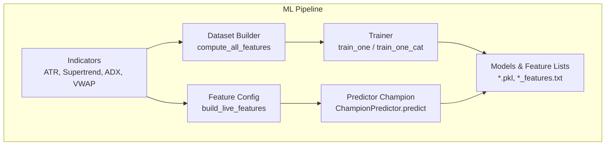
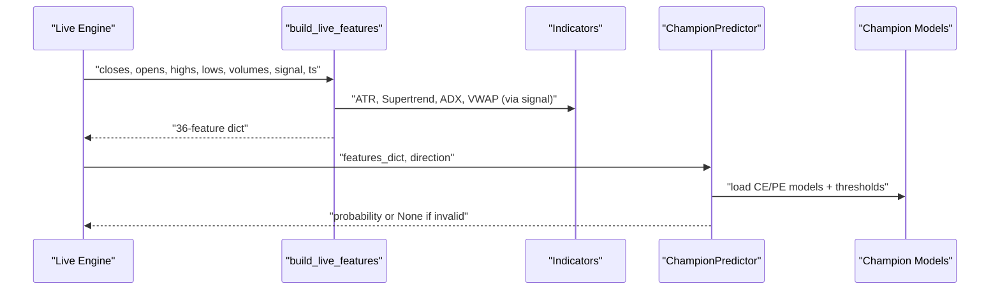
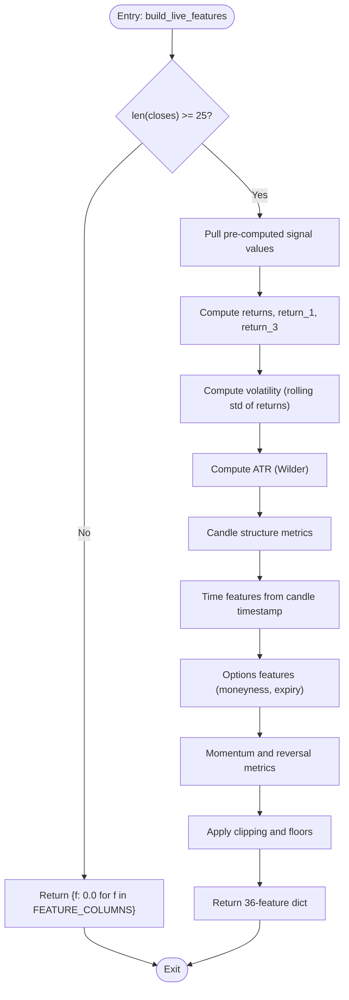
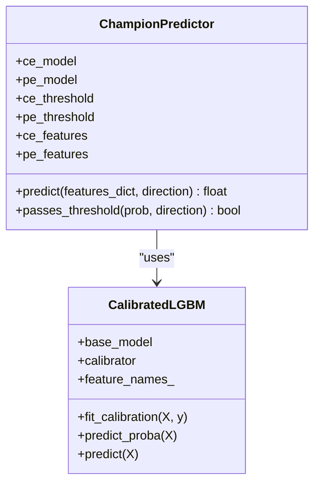
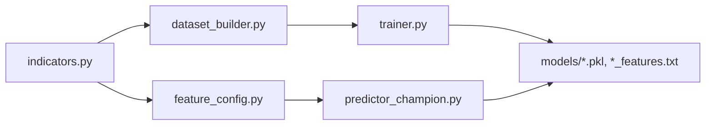

# Feature Configuration

<cite>
**Referenced Files in This Document**
- [feature_config.py](file://ml/feature_config.py)
- [dataset_builder.py](file://ml/dataset_builder.py)
- [indicators.py](file://ml/indicators.py)
- [trainer.py](file://ml/trainer.py)
- [predictor_champion.py](file://ml/predictor_champion.py)
- [champion_ce_lgbm_features.txt](file://ml/models/champion_ce_lgbm_features.txt)
- [champion_pe_lgbm_features.txt](file://ml/models/champion_pe_lgbm_features.txt)
</cite>

## Table of Contents
1. [Introduction](#introduction)
2. [Project Structure](#project-structure)
3. [Core Components](#core-components)
4. [Architecture Overview](#architecture-overview)
5. [Detailed Component Analysis](#detailed-component-analysis)
6. [Dependency Analysis](#dependency-analysis)
7. [Performance Considerations](#performance-considerations)
8. [Troubleshooting Guide](#troubleshooting-guide)
9. [Conclusion](#conclusion)
10. [Appendices](#appendices)

## Introduction
This document explains the feature configuration system that powers training, backtesting, and live trading across the ML pipeline. It focuses on:
- The canonical 36-feature set and its strict ordering
- The “direction stack” features that act as primary trend gates
- The build_live_features function and all feature categories it computes
- Normalization, clipping, and validation strategies to ensure consistency between training and production
- How to analyze feature importance and add new features without breaking parity

The goal is to provide a clear, code-grounded reference for engineers and researchers who need to maintain or extend the feature system safely.

## Project Structure
The feature system spans several modules:
- ml/feature_config.py defines the canonical feature order and builds live features per candle
- ml/dataset_builder.py computes the same indicators for historical data used in training
- ml/indicators.py provides vectorized technical indicators (Supertrend, ADX, VWAP, ATR)
- ml/trainer.py trains models using the canonical feature columns
- ml/predictor_champion.py loads champion models and validates inputs at prediction time
- ml/models/*.txt files persist the exact feature order used by deployed models

**Diagram sources**
- [feature_config.py:82-252](file://ml/feature_config.py#L82-L252)
- [dataset_builder.py:84-176](file://ml/dataset_builder.py#L84-L176)
- [indicators.py:24-169](file://ml/indicators.py#L24-L169)
- [trainer.py:82-176](file://ml/trainer.py#L82-L176)
- [predictor_champion.py:151-208](file://ml/predictor_champion.py#L151-L208)

**Section sources**
- [feature_config.py:22-64](file://ml/feature_config.py#L22-L64)
- [dataset_builder.py:84-176](file://ml/dataset_builder.py#L84-L176)
- [indicators.py:24-169](file://ml/indicators.py#L24-L169)
- [trainer.py:82-176](file://ml/trainer.py#L82-L176)
- [predictor_champion.py:151-208](file://ml/predictor_champion.py#L151-L208)

## Core Components
- Canonical feature order: FEATURE_COLUMNS defines the exact sequence of 36 features that must remain identical across training, backtesting, and live inference.
- Direction stack: Seven features that collectively gate directionality and regime quality before entry decisions.
- build_live_features: Computes all 36 features from rolling OHLCV windows plus pre-computed signal values.
- Indicator library: Vectorized implementations of ATR, Supertrend, ADX, and session VWAP used consistently in both dataset building and live computation.
- Training and prediction: Trainer uses FEATURE_COLUMNS; Predictor validates input features and enforces model feature alignment.

Key responsibilities:
- Maintain numerical stability via clipping and safe defaults
- Ensure time-based features use candle timestamps, not wall-clock time
- Preserve parity between dataset_builder and live feature computation

**Section sources**
- [feature_config.py:22-64](file://ml/feature_config.py#L22-L64)
- [feature_config.py:82-252](file://ml/feature_config.py#L82-L252)
- [dataset_builder.py:84-176](file://ml/dataset_builder.py#L84-L176)
- [indicators.py:24-169](file://ml/indicators.py#L24-L169)
- [trainer.py:82-176](file://ml/trainer.py#L82-L176)
- [predictor_champion.py:151-208](file://ml/predictor_champion.py#L151-L208)

## Architecture Overview
The feature system ensures parity across stages:
- Dataset builder computes indicators and labels from historical data
- Trainer consumes the canonical feature columns to fit models and persist thresholds and feature lists
- Live engine calls build_live_features each candle and feeds results to the predictor
- Predictor validates features, runs inference, and applies thresholds

**Diagram sources**
- [feature_config.py:82-252](file://ml/feature_config.py#L82-L252)
- [indicators.py:24-169](file://ml/indicators.py#L24-L169)
- [predictor_champion.py:151-208](file://ml/predictor_champion.py#L151-L208)

## Detailed Component Analysis

### Canonical Feature Order and Role
FEATURE_COLUMNS defines the authoritative order and grouping:
- Direction stack (7): supertrend_dir, supertrend_dist, price_vs_vwap, adx, di_spread, ema_alignment, volume_ratio
- Core price/indicators (8): ema20, ema50, macd, returns, volatility, rsi, atr, trend_strength
- Time (2): hour, weekday
- Short-term momentum (2): return_1, return_3
- Candle structure (2): candle_body_pct, range_break_strength
- Session context (4): mins_since_open, mins_to_close, session_open, session_close
- Options-specific (2): time_to_expiry_min, moneyness
- Reversal/momentum (9): momentum_velocity, range_compression, wick_ratio, body_efficiency, mom3_strength, upper_wick, lower_wick, close_position

These 36 features are persisted in champion feature lists and must match exactly in training and live pipelines.

**Section sources**
- [feature_config.py:22-64](file://ml/feature_config.py#L22-L64)
- [champion_ce_lgbm_features.txt:1-35](file://ml/models/champion_ce_lgbm_features.txt#L1-L35)
- [champion_pe_lgbm_features.txt:1-35](file://ml/models/champion_pe_lgbm_features.txt#L1-L35)

### Direction Stack Features (Primary Trend Gates)
- supertrend_dir: Discrete direction (+1 UP, -1 DOWN) from Supertrend(10,3). Used to align trades with the dominant trend.
- supertrend_dist: Normalized distance (close - st_line)/close, clipped to [-0.05, 0.05], measuring trend strength relative to the Supertrend line.
- price_vs_vwap: Normalized bias (close - vwap)/close, clipped to [-0.05, 0.05]. Institutional anchor; supports CE above VWAP and PE below VWAP logic.
- adx: ADX(14), clipped to [0, 100]. Regime filter; higher values indicate trending conditions.
- di_spread: DI+ minus DI-, clipped to [-60, 60]. Directional momentum confirmation.
- ema_alignment: Binary alignment (+1 if EMA20 > EMA50 else -1). Confirms medium-term trend direction.
- volume_ratio: Current volume divided by 20-bar average, clipped to [0, 10]. Conviction filter to avoid low-liquidity breakouts.

These seven form a cohesive “direction stack.” When all agree, the signal is stronger; when they disagree, the model learns to reduce confidence.

**Section sources**
- [feature_config.py:22-64](file://ml/feature_config.py#L22-L64)
- [feature_config.py:109-116](file://ml/feature_config.py#L109-L116)
- [feature_config.py:203-209](file://ml/feature_config.py#L203-L209)
- [dataset_builder.py:92-110](file://ml/dataset_builder.py#L92-L110)
- [indicators.py:41-90](file://ml/indicators.py#L41-L90)
- [indicators.py:97-129](file://ml/indicators.py#L97-L129)
- [indicators.py:136-169](file://ml/indicators.py#L136-L169)

### build_live_features: Function Flow and Categories
build_live_features computes all 36 features per candle using:
- Rolling OHLCV windows
- Pre-computed signal values (e.g., EMAs, RSI, ATR, Supertrend, ADX, VWAP)
- Timestamps passed explicitly to compute accurate session timing

Categories and calculations:
- Core price indicators: ema20, ema50, macd (ema20 - ema50), returns (last period pct change), volatility (std of last 20 returns), rsi_1m, atr (Wilder’s ATR), trend_strength ((ema20 - ema50)/close)
- Time features: hour, weekday derived from candle timestamp
- Short-term momentum: return_1 (same as returns), return_3 (3-period pct change)
- Candle structure: candle_body_pct (|close - open| / range), range_break_strength normalized by ATR over a 10-bar high breakout
- Session context: mins_since_open, mins_to_close (clipped to 375), session_open/session_close flags based on proximity to market open/close
- Options-specific: time_to_expiry_min (bounded), moneyness ((close - ema20)/close, clipped)
- Reversal/momentum: momentum_velocity (diff of normalized returns), range_compression (ratio of 5-bar to 15-bar ranges), wick_ratio, body_efficiency, mom3_strength, upper_wick/lower_wick normalized by ATR, close_position within candle range

Normalization and clipping:
- Many features are clipped to bounded ranges to prevent outliers from destabilizing models
- ATR is floored to avoid division by zero and ensure scale stability
- Volatility is floored to a small positive value

Validation:
- If fewer than 25 candles are available, returns a default dict of zeros for all features
- _safe_build_live_features wraps computation and guarantees a complete feature dict even on exceptions

**Diagram sources**
- [feature_config.py:82-252](file://ml/feature_config.py#L82-L252)

**Section sources**
- [feature_config.py:82-252](file://ml/feature_config.py#L82-L252)

### Indicator Implementations and Parity
- ATR: Wilder’s smoothing applied to True Range; used consistently in dataset and live paths
- Supertrend: Direction and line computed with period=10, multiplier=3; used to derive supertrend_dir and supertrend_dist
- ADX: Period=14; yields ADX and DI+/DI- used for adx and di_spread
- VWAP: Session-reset VWAP; used for price_vs_vwap; includes a live accumulator class for incremental updates

Parity is ensured by computing these indicators identically in dataset_builder and relying on pre-computed values in live builds.

**Section sources**
- [indicators.py:24-169](file://ml/indicators.py#L24-L169)
- [dataset_builder.py:92-110](file://ml/dataset_builder.py#L92-L110)
- [feature_config.py:109-116](file://ml/feature_config.py#L109-L116)

### Training and Prediction Consistency
- Trainer reads FEATURE_COLUMNS and constructs X matrices accordingly
- Models are trained with LightGBM and optionally CatBoost; Platt calibration is applied
- Thresholds are optimized on holdout and saved alongside models
- Predictor validates incoming features against model feature names and rejects invalid inputs

**Diagram sources**
- [predictor_champion.py:18-53](file://ml/predictor_champion.py#L18-L53)
- [predictor_champion.py:57-218](file://ml/predictor_champion.py#L57-L218)

**Section sources**
- [trainer.py:82-176](file://ml/trainer.py#L82-L176)
- [predictor_champion.py:151-208](file://ml/predictor_champion.py#L151-L208)

## Dependency Analysis
- feature_config.py depends on indicator outputs provided via the signal dict and computes remaining features locally
- dataset_builder.py imports indicators to compute the same features historically
- trainer.py imports FEATURE_COLUMNS to ensure consistent column selection
- predictor_champion.py loads models and thresholds and validates feature presence and validity

**Diagram sources**
- [indicators.py:24-169](file://ml/indicators.py#L24-L169)
- [dataset_builder.py:84-176](file://ml/dataset_builder.py#L84-L176)
- [feature_config.py:82-252](file://ml/feature_config.py#L82-L252)
- [trainer.py:82-176](file://ml/trainer.py#L82-L176)
- [predictor_champion.py:151-208](file://ml/predictor_champion.py#L151-L208)

**Section sources**
- [trainer.py:38-39](file://ml/trainer.py#L38-L39)
- [predictor_champion.py:13](file://ml/predictor_champion.py#L13)

## Performance Considerations
- Use pre-computed signals where possible to avoid recomputation in live loops
- Keep rolling windows minimal and efficient; avoid unnecessary conversions
- Clipping prevents extreme values from causing numerical issues in models
- ATR floor and volatility floor stabilize ratios and prevent division-by-zero scenarios
- Passing explicit candle timestamps avoids incorrect time features in backtests

[No sources needed since this section provides general guidance]

## Troubleshooting Guide
Common issues and resolutions:
- Missing features: Predictor logs warnings and returns None if required features are absent; ensure build_live_features returns all FEATURE_COLUMNS
- Invalid values: NaN or Inf values cause rejection; validate inputs and apply clipping/floors
- Zero-probability outputs: Calibration can squash probabilities; keep raw probabilities and rely on thresholds and edge filters rather than hard floors
- Time drift: Always pass candle timestamp to build_live_features to avoid misaligned session features

Operational safeguards:
- _safe_build_live_features catches exceptions and returns a full zero-filled feature dict
- Predictor validates feature presence and numeric validity before inference

**Section sources**
- [feature_config.py:255-267](file://ml/feature_config.py#L255-L267)
- [predictor_champion.py:151-208](file://ml/predictor_champion.py#L151-L208)

## Conclusion
The feature configuration system centers on a strict canonical order and robust computation to ensure parity across training, backtesting, and live trading. The direction stack serves as a powerful trend gate, while normalization and clipping protect model stability. Maintaining this order and computation logic is essential when adding new features or modifying existing ones.

[No sources needed since this section summarizes without analyzing specific files]

## Appendices

### Appendix A: Complete 36-Feature Set and Roles
- Direction stack (primary trend gates):
  - supertrend_dir: Trend direction from Supertrend
  - supertrend_dist: Distance from Supertrend line, normalized and clipped
  - price_vs_vwap: Price bias relative to VWAP, normalized and clipped
  - adx: Trend strength regime filter
  - di_spread: Directional momentum confirmation
  - ema_alignment: Medium-term EMA alignment
  - volume_ratio: Volume conviction filter
- Core price/indicators:
  - ema20, ema50, macd, returns, volatility, rsi, atr, trend_strength
- Time:
  - hour, weekday
- Short-term momentum:
  - return_1, return_3
- Candle structure:
  - candle_body_pct, range_break_strength
- Session context:
  - mins_since_open, mins_to_close, session_open, session_close
- Options-specific:
  - time_to_expiry_min, moneyness
- Reversal/momentum:
  - momentum_velocity, range_compression, wick_ratio, body_efficiency, mom3_strength, upper_wick, lower_wick, close_position

**Section sources**
- [feature_config.py:22-64](file://ml/feature_config.py#L22-L64)

### Appendix B: Adding New Features Safely
Steps to add a new feature while maintaining consistency:
1. Define the feature name and place it in FEATURE_COLUMNS at the appropriate position
2. Implement calculation in build_live_features with proper normalization/clipping
3. Mirror the same calculation in dataset_builder.compute_all_features to ensure training parity
4. Update any indicator dependencies in indicators.py if necessary
5. Validate in predictor_champion by ensuring the feature is present and valid
6. Retrain models and verify thresholds and performance
7. Confirm champion feature lists include the new feature in the correct order

Best practices:
- Keep feature scales bounded via clipping
- Use candle timestamps for time-based features
- Avoid look-ahead bias; ensure computations use only past data
- Log and guard against NaN/Inf values

**Section sources**
- [feature_config.py:22-64](file://ml/feature_config.py#L22-L64)
- [feature_config.py:82-252](file://ml/feature_config.py#L82-L252)
- [dataset_builder.py:84-176](file://ml/dataset_builder.py#L84-L176)
- [trainer.py:82-176](file://ml/trainer.py#L82-L176)
- [predictor_champion.py:151-208](file://ml/predictor_champion.py#L151-L208)

### Appendix C: Example Feature Importance Analysis
To analyze feature importance:
- Inspect champion models’ internal feature importances (LightGBM/CatBoost)
- Compare top features across CE and PE models to understand directional biases
- Validate that direction stack features are influential, indicating effective gating
- Monitor changes after retraining to detect drift or regime shifts

Operational checks:
- Ensure FEATURE_COLUMNS matches *_features.txt files
- Verify predictor uses the correct feature order when loading models
- Track threshold changes and their impact on trade frequency and expectancy

**Section sources**
- [trainer.py:82-176](file://ml/trainer.py#L82-L176)
- [predictor_champion.py:116-147](file://ml/predictor_champion.py#L116-L147)
- [champion_ce_lgbm_features.txt:1-35](file://ml/models/champion_ce_lgbm_features.txt#L1-L35)
- [champion_pe_lgbm_features.txt:1-35](file://ml/models/champion_pe_lgbm_features.txt#L1-L35)