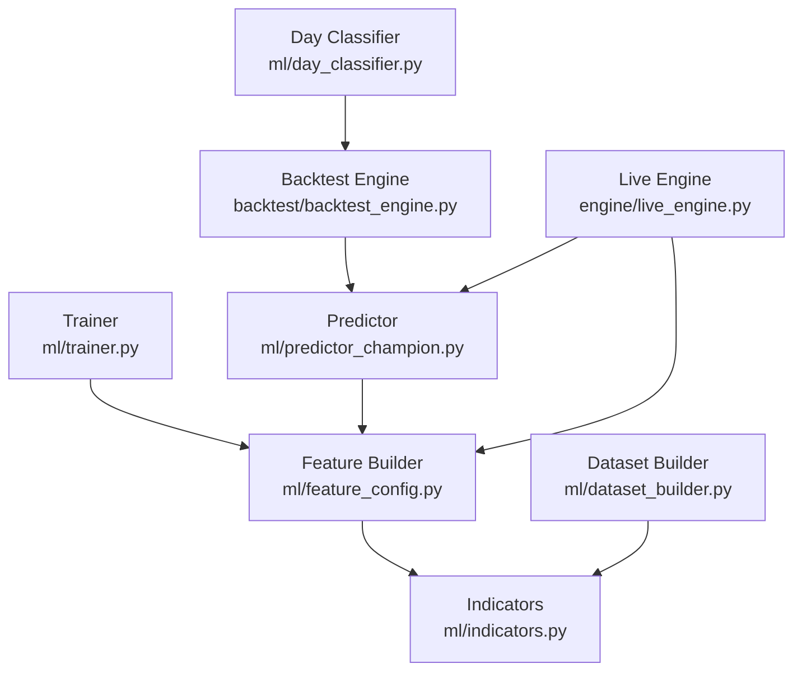
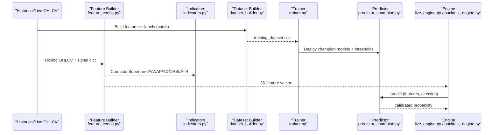
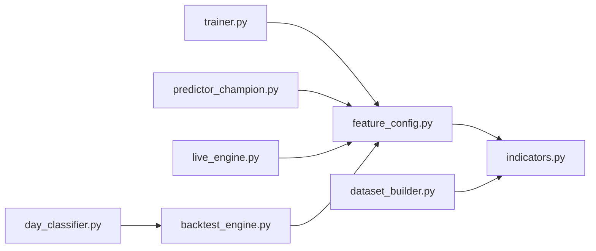

# Feature Engineering

<cite>
**Referenced Files in This Document**
- [feature_config.py](file://ml/feature_config.py)
- [indicators.py](file://ml/indicators.py)
- [dataset_builder.py](file://ml/dataset_builder.py)
- [trainer.py](file://ml/trainer.py)
- [predictor_champion.py](file://ml/predictor_champion.py)
- [day_classifier.py](file://ml/day_classifier.py)
- [live_engine.py](file://engine/live_engine.py)
- [backtest_engine.py](file://backtest/backtest_engine.py)
</cite>

## Table of Contents
1. [Introduction](#introduction)
2. [Project Structure](#project-structure)
3. [Core Components](#core-components)
4. [Architecture Overview](#architecture-overview)
5. [Detailed Component Analysis](#detailed-component-analysis)
6. [Dependency Analysis](#dependency-analysis)
7. [Performance Considerations](#performance-considerations)
8. [Troubleshooting Guide](#troubleshooting-guide)
9. [Conclusion](#conclusion)
10. [Appendices](#appendices)

## Introduction
This document explains the feature engineering framework that powers ML predictions for intraday trading. It covers:
- The 36-feature schema and how each feature is computed in live and batch pipelines
- Technical indicators (Supertrend, VWAP, ADX, RSI, ATR, etc.) with mathematical formulations
- Dataset construction, labeling strategy, and data quality checks
- Validation, missing value handling, and outlier clipping
- Timeframe considerations and integration with trading logic
- Feature selection and guidance for adding new features

## Project Structure
The ML feature pipeline spans several modules:
- Feature definitions and live computation: ml/feature_config.py
- Indicator math and rolling state: ml/indicators.py
- Historical dataset creation and labeling: ml/dataset_builder.py
- Model training and deployment gates: ml/trainer.py
- Inference and validation: ml/predictor_champion.py
- Day-type classification to gate strategies: ml/day_classifier.py
- Integration points in live engine and backtest engine

**Diagram sources**
- [feature_config.py:82-266](file://ml/feature_config.py#L82-L266)
- [indicators.py:12-202](file://ml/indicators.py#L12-L202)
- [dataset_builder.py:84-176](file://ml/dataset_builder.py#L84-L176)
- [trainer.py:82-176](file://ml/trainer.py#L82-L176)
- [predictor_champion.py:151-208](file://ml/predictor_champion.py#L151-L208)
- [day_classifier.py:293-339](file://ml/day_classifier.py#L293-L339)
- [live_engine.py:460-498](file://engine/live_engine.py#L460-L498)
- [backtest_engine.py:320-353](file://backtest/backtest_engine.py#L320-L353)

**Section sources**
- [feature_config.py:22-64](file://ml/feature_config.py#L22-L64)
- [dataset_builder.py:30-45](file://ml/dataset_builder.py#L30-L45)
- [trainer.py:18-48](file://ml/trainer.py#L18-L48)
- [predictor_champion.py:57-100](file://ml/predictor_champion.py#L57-L100)
- [day_classifier.py:5-24](file://ml/day_classifier.py#L5-L24)
- [live_engine.py:460-498](file://engine/live_engine.py#L460-L498)
- [backtest_engine.py:320-353](file://backtest/backtest_engine.py#L320-L353)

## Core Components
- Feature schema: a fixed list of 36 columns ensures consistency across training, backtesting, and live inference.
- Live feature builder: computes features from a rolling OHLCV window plus precomputed signals (e.g., EMA, RSI, Supertrend, VWAP, ADX).
- Indicators module: pure numpy implementations of core technical indicators with vectorized or loop-based algorithms.
- Dataset builder: builds historical features and labels using first-touch barrier logic; outputs a CSV consumed by the trainer.
- Trainer: trains LightGBM and optional CatBoost models with time-series cross-validation, Platt calibration, and deploy gates.
- Predictor: validates inputs, handles missing/invalid values, runs LGBM and optional CatBoost ensemble, returns calibrated probabilities.
- Day classifier: classifies market regime early in session to gate strategy behavior.

**Section sources**
- [feature_config.py:22-64](file://ml/feature_config.py#L22-L64)
- [feature_config.py:82-266](file://ml/feature_config.py#L82-L266)
- [indicators.py:12-202](file://ml/indicators.py#L12-L202)
- [dataset_builder.py:84-176](file://ml/dataset_builder.py#L84-L176)
- [trainer.py:82-176](file://ml/trainer.py#L82-L176)
- [predictor_champion.py:151-208](file://ml/predictor_champion.py#L151-L208)
- [day_classifier.py:293-339](file://ml/day_classifier.py#L293-L339)

## Architecture Overview
End-to-end flow from raw OHLCV to model prediction:

**Diagram sources**
- [dataset_builder.py:236-270](file://ml/dataset_builder.py#L236-L270)
- [trainer.py:212-286](file://ml/trainer.py#L212-L286)
- [feature_config.py:82-266](file://ml/feature_config.py#L82-L266)
- [indicators.py:41-169](file://ml/indicators.py#L41-L169)
- [predictor_champion.py:151-208](file://ml/predictor_champion.py#L151-L208)
- [live_engine.py:460-498](file://engine/live_engine.py#L460-L498)
- [backtest_engine.py:320-353](file://backtest/backtest_engine.py#L320-L353)

## Detailed Component Analysis

### Feature Schema and Live Computation (feature_config.py)
- Canonical order: FEATURE_COLUMNS defines a strict 36-column order used everywhere (training, backtest, live).
- Direction stack: supertrend_dir, supertrend_dist, price_vs_vwap, adx, di_spread, ema_alignment, volume_ratio form a “direction confirmation” layer.
- Core indicators: ema20, ema50, macd, returns, volatility, rsi, atr, trend_strength.
- Time/session: hour, weekday, mins_since_open, mins_to_close, session_open, session_close, time_to_expiry_min.
- Options context: moneyness.
- Momentum/candle structure: return_1, return_3, candle_body_pct, range_break_strength, momentum_velocity, range_compression, wick_ratio, body_efficiency, mom3_strength, upper_wick, lower_wick, close_position.

Key behaviors:
- build_live_features requires at least 25 closes; otherwise returns zeros for all features.
- Uses a signal dict for precomputed indicators (EMA, RSI, ATR, Supertrend, VWAP, ADX, DI spread, EMA alignment, volume ratio).
- Clips and bounds features to stable ranges (e.g., ATR minimum, volatility caps, distance ratios clipped).
- _safe_build_live_features wraps exceptions and guarantees a full 36-key output even on errors.

Practical example (conceptual):
- Input: last N OHLCV rows and a signal dict containing EMA20/50, RSI, ATR, Supertrend direction/distance, VWAP bias, ADX, DI spread, EMA alignment, volume ratio.
- Output: a dict with exactly the 36 keys listed above, ready for predictor input.

**Section sources**
- [feature_config.py:22-64](file://ml/feature_config.py#L22-L64)
- [feature_config.py:82-266](file://ml/feature_config.py#L82-L266)

### Technical Indicators (indicators.py)
- ATR (Wilder’s RMA): True Range smoothed with Wilder’s smoothing; canonical implementation.
- Supertrend (period=10, multiplier=3): Computes basic upper/lower bands, final bands with persistence, direction flips when price crosses bands, and st_line as support/resistance.
- ADX (period=14): Directional movement (+DI/-DI), DX, then smoothed ADX; returns ADX, +DI, -DI.
- VWAP (session reset): Cumulative typical price weighted by volume per calendar day; falls back to uniform weights if volume is zero (index-like instruments).
- VWAPAccumulator: Incremental accumulator for live sessions; reset daily, update per candle, read current value.

Mathematical notes:
- ATR uses True Range = max(high-low, |high-prevClose|, |low-prevClose|), then Wilder’s RMA.
- Supertrend uses HL2 ± multiplier*ATR, with band persistence and direction flip rules.
- ADX uses directional movements relative to ATR, normalized to percentages, then smoothed.
- VWAP = sum(typical_price * volume) / sum(volume), resetting daily.

**Section sources**
- [indicators.py:12-34](file://ml/indicators.py#L12-L34)
- [indicators.py:41-90](file://ml/indicators.py#L41-L90)
- [indicators.py:97-129](file://ml/indicators.py#L97-L129)
- [indicators.py:136-169](file://ml/indicators.py#L136-L169)
- [indicators.py:176-202](file://ml/indicators.py#L176-L202)

### Dataset Construction and Labeling (dataset_builder.py)
- compute_all_features: Adds all indicator columns to a DataFrame using the same logic as live where applicable, ensuring parity between training and live.
- First-touch barrier labels: For each bar, look forward up to LOOKAHEAD candles; label CE if high reaches close+TARGET first, PE if low reaches close-TARGET first; both zero if neither hits (model learns to avoid chop).
- Active session windows: Only active-session bars are labeled and included.
- Output: training_dataset.csv with features and labels, compatible with the live feature pipeline.

Data quality checks:
- Volume defaults to ones if missing (for index-like instruments without volume).
- Clipping applied to derived ratios (e.g., supertrend_dist, price_vs_vwap, di_spread).
- Session-aware time features ensure correct minute offsets.

**Section sources**
- [dataset_builder.py:84-176](file://ml/dataset_builder.py#L84-L176)
- [dataset_builder.py:179-233](file://ml/dataset_builder.py#L179-L233)
- [dataset_builder.py:236-270](file://ml/dataset_builder.py#L236-L270)

### Training and Deployment Gates (trainer.py)
- Uses TimeSeriesSplit for temporal CV; no class over-weighting to keep probabilities calibrated.
- Recency weighting based on date cutoffs to emphasize recent regimes.
- Platt calibration via CalibratedLGBM wrapper; threshold search optimizes expectancy given average win/loss assumptions.
- Deploy gate: only replaces champions if AUC >= MIN_AUC, calibrated-prob std >= MIN_STD, and holdout expectancy > 0. Otherwise saves as candidates.

Model artifacts:
- Champion models and thresholds saved to ml/models/.
- Feature lists persisted alongside models for validation.

**Section sources**
- [trainer.py:18-48](file://ml/trainer.py#L18-L48)
- [trainer.py:82-176](file://ml/trainer.py#L82-L176)
- [trainer.py:179-210](file://ml/trainer.py#L179-L210)
- [trainer.py:212-286](file://ml/trainer.py#L212-L286)

### Prediction and Validation (predictor_champion.py)
- Loads LGBM champions and optional CatBoost champions; supports ensemble averaging.
- Validates input features:
  - Missing features: logs warning and returns None (no silent zero).
  - NaN/Inf values: logs warning and returns None.
- Returns calibrated probability in [0,1]; does not hard-floor to avoid killing edge/threshold logic.
- Threshold check: passes_threshold compares against stored thresholds.

Integration:
- Used by live_engine and backtest_engine after feature building to get CE/PE probabilities.

**Section sources**
- [predictor_champion.py:57-100](file://ml/predictor_champion.py#L57-L100)
- [predictor_champion.py:151-208](file://ml/predictor_champion.py#L151-L208)

### Day-Type Classification (day_classifier.py)
- Computes day-level features from the first 30 minutes (9:15–9:44).
- Classifies into TREND, RANGE, or VOLATILE based on range, momentum, persistence, and gap.
- Provides should_trade_orb gating to restrict ORB-style entries to TREND days.

**Section sources**
- [day_classifier.py:5-24](file://ml/day_classifier.py#L5-L24)
- [day_classifier.py:64-148](file://ml/day_classifier.py#L64-L148)
- [day_classifier.py:293-339](file://ml/day_classifier.py#L293-L339)

### Integration Points (live_engine.py, backtest_engine.py)
- Live engine:
  - Builds features every tick using _safe_build_live_features and _compute_signal_dict.
  - Calls predictor.predict for CE/PE probabilities and applies adaptive adjustments via learner.
- Backtest engine:
  - Builds features similarly and integrates day classifier to gate decisions.

**Section sources**
- [live_engine.py:460-498](file://engine/live_engine.py#L460-L498)
- [live_engine.py:802-828](file://engine/live_engine.py#L802-L828)
- [backtest_engine.py:320-353](file://backtest/backtest_engine.py#L320-L353)

## Dependency Analysis

**Diagram sources**
- [feature_config.py:82-266](file://ml/feature_config.py#L82-L266)
- [indicators.py:41-169](file://ml/indicators.py#L41-L169)
- [dataset_builder.py:84-176](file://ml/dataset_builder.py#L84-L176)
- [trainer.py:82-176](file://ml/trainer.py#L82-L176)
- [predictor_champion.py:151-208](file://ml/predictor_champion.py#L151-L208)
- [live_engine.py:460-498](file://engine/live_engine.py#L460-L498)
- [backtest_engine.py:320-353](file://backtest/backtest_engine.py#L320-L353)
- [day_classifier.py:293-339](file://ml/day_classifier.py#L293-L339)

**Section sources**
- [feature_config.py:22-64](file://ml/feature_config.py#L22-L64)
- [dataset_builder.py:30-45](file://ml/dataset_builder.py#L30-L45)
- [trainer.py:18-48](file://ml/trainer.py#L18-L48)
- [predictor_champion.py:57-100](file://ml/predictor_champion.py#L57-L100)
- [day_classifier.py:5-24](file://ml/day_classifier.py#L5-L24)
- [live_engine.py:460-498](file://engine/live_engine.py#L460-L498)
- [backtest_engine.py:320-353](file://backtest/backtest_engine.py#L320-L353)

## Performance Considerations
- Vectorization vs loops: indicators use efficient numpy operations; some live computations use small loops for clarity and correctness on short windows.
- Clipping and bounds: prevent outliers from destabilizing models (e.g., ATR floor, volatility cap, ratio clips).
- Minimal dependencies in live path: avoids heavy imports inside hot paths; pandas/numpy used judiciously.
- Ensemble overhead: optional CatBoost adds latency; predictor falls back to LGBM-only on failure.

[No sources needed since this section provides general guidance]

## Troubleshooting Guide
Common issues and resolutions:
- Missing features in predictor:
  - Symptom: predictor returns None and logs missing features.
  - Fix: ensure feature_config.build_live_features produces all 36 keys; verify signal dict contains required keys (EMA, RSI, ATR, Supertrend, VWAP, ADX, DI spread, EMA alignment, volume ratio).
- Invalid feature values:
  - Symptom: NaN/Inf detected; predictor returns None.
  - Fix: guard divisions by zero, clip ratios, ensure ATR minimum, handle zero-vol cases in VWAP.
- Zero probabilities:
  - Symptom: extremely low probabilities due to calibration or stale features.
  - Fix: verify feature scaling matches training; ensure timestamps are correct for time features; retrain if data drift occurs.
- Day classifier not loaded:
  - Symptom: FileNotFoundError for day classifier model.
  - Fix: run dataset build and training steps for day_classifier before starting engine.

**Section sources**
- [predictor_champion.py:151-208](file://ml/predictor_champion.py#L151-L208)
- [feature_config.py:255-266](file://ml/feature_config.py#L255-L266)
- [indicators.py:136-169](file://ml/indicators.py#L136-L169)
- [day_classifier.py:293-339](file://ml/day_classifier.py#L293-L339)

## Conclusion
The feature engineering framework delivers a robust, consistent set of 36 features across training, backtesting, and live trading. It combines institutional-grade indicators, careful normalization, and strong validation to feed calibrated ML models. The system includes safeguards for missing data, outliers, and regime changes, while enabling extensibility for new features and models.

[No sources needed since this section summarizes without analyzing specific files]

## Appendices

### Feature Catalog and Interpretation
- Direction stack:
  - supertrend_dir: +1/−1 indicating Supertrend trend direction.
  - supertrend_dist: normalized distance from ST line; measures trend strength.
  - price_vs_vwap: normalized deviation from VWAP; institutional bias.
  - adx: trend strength (>25 trending, <20 ranging).
  - di_spread: DI+ minus DI−; positive indicates bullish pressure.
  - ema_alignment: +1 if EMA20 > EMA50, else −1.
  - volume_ratio: current volume vs 20-bar average; conviction filter.
- Core indicators:
  - ema20, ema50: exponential moving averages.
  - macd: ema20 − ema50.
  - returns: latest return.
  - volatility: rolling std of returns (20-bar).
  - rsi: RSI(14).
  - atr: ATR(14).
  - trend_strength: normalized ema20 − ema50.
- Time/session:
  - hour, weekday: time-of-day features.
  - mins_since_open, mins_to_close: session timing.
  - session_open, session_close: flags for early/late session.
  - time_to_expiry_min: capped minutes to expiry.
- Options context:
  - moneyness: normalized distance from EMA20.
- Momentum/candle structure:
  - return_1, return_3: short-term returns.
  - candle_body_pct, body_efficiency: body size relative to range.
  - range_break_strength: breakout magnitude normalized by ATR.
  - momentum_velocity: change in returns (acceleration).
  - range_compression: recent range vs longer-range ratio.
  - wick_ratio, upper_wick, lower_wick: wick metrics normalized by ATR.
  - close_position: where close sits within the range.
  - mom3_strength: absolute 3-bar return magnitude.

**Section sources**
- [feature_config.py:22-64](file://ml/feature_config.py#L22-L64)
- [feature_config.py:82-266](file://ml/feature_config.py#L82-L266)

### Adding New Features
Steps:
1. Define the feature name and add it to FEATURE_COLUMNS in feature_config.py to maintain canonical order.
2. Implement calculation in build_live_features (and compute_all_features in dataset_builder.py) to ensure parity between live and batch.
3. Add any necessary indicator logic in indicators.py if reusable.
4. Validate in predictor_champion.py (missing feature checks will catch mismatches).
5. Retrain models with trainer.py; ensure deploy gates pass.
6. Update documentation and tests as needed.

**Section sources**
- [feature_config.py:22-64](file://ml/feature_config.py#L22-L64)
- [feature_config.py:82-266](file://ml/feature_config.py#L82-L266)
- [dataset_builder.py:84-176](file://ml/dataset_builder.py#L84-L176)
- [trainer.py:212-286](file://ml/trainer.py#L212-L286)

### Timeframes and Strategy Integration
- Primary timeframe: 1-minute data used for feature computation and labeling.
- Time features: hour, weekday, session timing ensure consistent behavior across timeframes.
- Strategy gating: day_classifier identifies TREND/RANGE/VOLATILE early in session; backtest_engine uses this to gate entries.
- Live integration: live_engine computes features every tick, feeds predictor, and applies adaptive thresholds and multipliers.

**Section sources**
- [dataset_builder.py:30-45](file://ml/dataset_builder.py#L30-L45)
- [day_classifier.py:293-339](file://ml/day_classifier.py#L293-L339)
- [backtest_engine.py:320-353](file://backtest/backtest_engine.py#L320-L353)
- [live_engine.py:460-498](file://engine/live_engine.py#L460-L498)